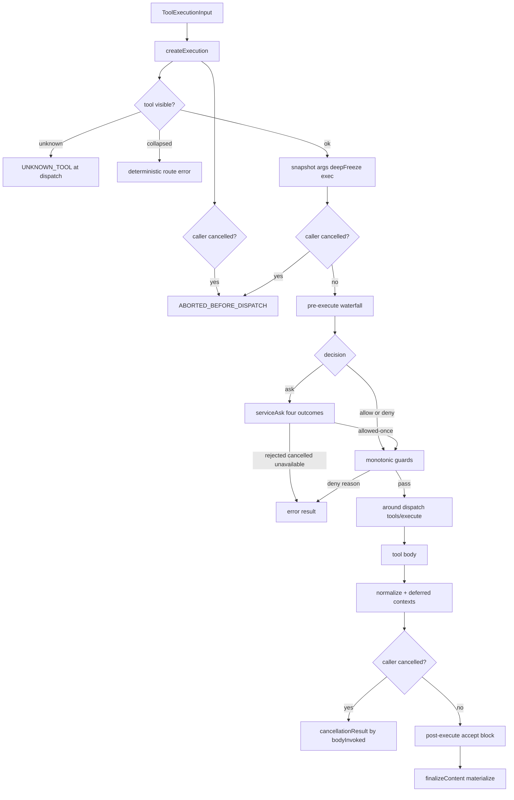
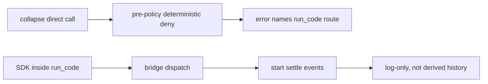

# DeepSeek Harness 工具与沙箱

## 一句话结论

DeepSeek Harness 的工具安全是注册期契约、调度期分类、策略瀑布、单调 guard 加内核沙箱五层叠加。isConcurrencySafe 只有精确 true 才并行；ask 通过可注入 ApprovalService 映射为 allowed-once、rejected、cancelled、unavailable 四态，缺失即 deny；Code collapse 的直接调用在 approval 之前就被确定性拒绝并指路 run_code；sandbox 用平台 runner 链包裹 exact argv，无可用后端时抛 SANDBOX_UNAVAILABLE 而非静默裸跑。

## 上一章遗留问题

F-D2 说明工具结果按模型顺序提交。F-D3 回答：调度器如何决定 parallel？ask 服务不可用怎么办？run_code 里调用的工具权限从哪来？Landlock 启动器失败与命令被拒如何区分？

## 本章解决什么矛盾

工具越多越强，治理面也越大。DeepSeek Harness 的取舍是把每个关注点做成独立扩展点，再用固定顺序串起来：

1. createExecution：冻结参数、判定 collapse、unknown 与 cancelled；
2. pre-execute waterfall：动态策略与 ask；
3. guards：单调拒绝层；
4. tools/execute：around 包装真实 body；
5. post-execute：accept 或 block 并附加上下文；
6. finalizeContent 与 materialize：定义级内容收口；
7. sandbox confine：exact argv 进 runner。

直觉上这是流水线上的多个质检站。精确机制是每站有明确的输入输出契约。失效边界是站点顺序不可交换——collapse 拒绝若放到 approval 之后，攻击者可先消耗审批资源再被拒。

## 核心不变量

1. **并发分类 fail closed**：只有 isConcurrencySafe(args) === true 才 parallel；unknown、hidden、invalid、throw 一律 exclusive。
2. **ask 四态**：allowed-once 放行；rejected 给用户原因；cancelled 附 approvalCancelled；unavailable、无服务、无 agent 都 deny。
3. **guard 单调**：任何匹配 guard 可 deny；没有任何机制能 force-allow 已拒绝调用。
4. **collapse 先拒**：被 run_code 折叠的工具在 pre-execute 前确定性拒绝，错误信息给出路由提示。
5. **取消不弃 promise**：body 已启动则等 quiescence 再标 ABORTED；未启动标 ABORTED_BEFORE_DISPATCH。
6. **sandbox 失败关闭**：confine 返回 enforcing argv 或抛 SANDBOX_UNAVAILABLE；silent passthrough 禁止。
7. **post-execute 不反转失败**：failed result 不能替换 value 或 content 为成功语义。

失效边界在于 Code Mode 的信任模型：bridge 内的子调用继承父 run_code 的能力面，宿主必须把 SDK 视为受信代码边界，而不是给每个子调用独立授权。

## 执行管线全景

| 关注点 | 扩展点 | 典型用途 |
| --- | --- | --- |
| 动态策略 | tools/pre-execute | 风险评分、阶段门控、ask |
| 强制拒绝 | tools.guard() | 租户或 agent 级禁令 |
| 环境注入 | tools/execute around | signal 融合、凭据代理 |
| 结果治理 | tools/post-execute | 阻断危险输出、附加上下文 |
| 内容收口 | finalizeContent | 定义级最终投影 |

## 初学者主线

把工具执行当机场流程：

1. 值机（createExecution）：核对身份、打包行李（snapshot args）、贴冻结标签（deepFreeze）；
2. 安检（pre-execute）：规则放行或要求人工（ask）；
3. 特勤复查（guards）：任何一位特警说不行就不行；
4. 登机口（around body）：signal 融合，起飞后不能弃机；
5. 落地审查（post-execute）：危险货物被扣并给理由；
6. 出关（materialize）：最终内容定稿发布。

### 并发分类

executionMode 只认精确 true：

1. 工具未知、隐藏或 collapsed，exclusive；
2. isConcurrencySafe 未声明或非 true，exclusive；
3. 分类器抛错，exclusive；
4. 精确 true，parallel。

注释给出的理由是 fail closed：共享状态必须容忍并发派发。Agent loop 中每组开始前重新读取配置，因此运行中调整 maxParallelToolCalls 只影响下一组。

### Ask 的四态映射

serviceAsk 是审批语义的单一出口：

1. 无 ApprovalService：deny，reason 为 requires approval (not yet supported)；
2. 无 agent：deny，reason 为 no agent to route it through；
3. allowed-once：allow；
4. rejected：deny，reason 为 the user rejected tool X；
5. cancelled：deny 且 approvalCancelled=true；
6. unavailable：deny，reason 为 no approval channel is available。

四种 non-grant 文案刻意不同——模型能区分人说不、等待被取消和没有通道，从而选择不同后续动作。

### Code Mode 折叠

native 模式下所有 schema 直接暴露给模型；非 native 模式只暴露 run_code，程序内通过 SDK 桥接其他工具。此时对被折叠工具的直接调用在 createExecution 阶段就返回确定性错误：only run_code is callable directly, call X from inside a run_code program instead。

这个拒绝发生在 policy 和 approval 之前，原因有二：

1. 名称在当前可见面上存在，裸 UNKNOWN_TOOL 会误导模型以为部署损坏；
2. 审批资源不应为注定失败的调用消耗。

子调用通过 tool/code-dispatch-start 与 tool/code-dispatch 记录，log-only：deriveMessages 忽略它们，子调用不重新进入模型上下文。

## 机制深拆

### 1. createExecution 的三分支

源码把准备阶段分成三类终局：

1. collapsed 且 aborted：直接 aborted-before-dispatch，取消优先于路由错误；
2. collapsed 且未取消：ToolNotFoundError 携带路由建议；
3. snapshot args 失败：立即 error result。

成功路径才创建 execution 对象：arguments deepFreeze，deferredContexts 与 contentFinalizers 挂载，cancellationStates 记录 callerSignal 与 bodyInvoked=false。

直觉上这是值机柜台：先确认航班存在（collapse），再看护照（args 可序列化），最后发登机牌（execution context）。失效边界是一旦登机（body invoked），就不能假装旅客没上飞机。

### 2. prepareExecution 的取消检查点

prepare 在三个位置检查 callerCancelled：

1. 创建后立即；
2. ask 分辨率后且 approvalCancelled；
3. guard 通过后。

这保证审批通过但人已离开的场景不会继续执行。approvalCancelled 与 caller cancel 合并成 aborted-before-dispatch。

### 3. dispatchToolBody 的 signal 融合

around wrapper 可能替换 exec.signal。Registry 用 fuseToolSignals 把原始 callerSignal 与 wrapper signal 融合：任一 abort 即生效，dispose 清理监听器。body promise 不被放弃——Cancellation never abandons the body: a started promise reaches quiescence before its outcome becomes ABORTED。

### 4. post-execute 的能力边界

post-execute 可以 accept 保留成功并可替换 content 或附 additionalContexts；可以 block 转为 isError 并携带 corrective feedback；可以在原 result 非 error 时替换 value。同时替换 value 与 content 会 TypeError；failed result 上替换 value 也 TypeError。这些约束防止后处理器伪造成功账目。

### 5. Sandbox runner chain

LocalSandboxProvider 按 platform 选择候选链。选择逻辑：

1. 单一候选无需仲裁，执行期拒绝仍 fail closed；
2. 多候选逐个 functional probe，第一个非 unusable 胜出；
3. 全部不可用则 unavailable，confine 抛 SANDBOX_UNAVAILABLE。

probe 决定 enforcement：bwrap 与 seatbelt full；landlock 由 launcher 报告 full 或 partial（旧 ABI）；windows-acl 恒 partial，原因是 Everyone ACE 与 hard-link 边界。

操作员也可显式配置 runnerCommand 加 runnerFailureSignatures 绕过探测链——这是运维断言，enforcement 标记 full，denial dialect 使用通用集合。

### 6. Denial dialect 与 runner failure

每个 runner 有自己的 stderr 方言：bwrap 是 read-only file system，landlock 是 permission denied，seatbelt 是 operation not permitted。消费者只匹配选中后端的方言，不用跨后端 union——union 会声称某后端根本不会产生的拒绝。

runner failure 判定需要三要素：

1. exit-code gate（如 landlock 125、windows-acl 127）；
2. fatal signature（如 launcher 前缀）；
3. informational lines 排除（如 landlock partial ABI warning）。

先排除 benign 行，再匹配致命签名，最后才看 denial dialect。顺序错了会把命令自己打印的 permission denied 误判成沙箱拦截。

## 反例与故障模式

1. **collapsed 工具走完审批**
   - 触发：把 collapse 检查放到 approval 后。
   - 因果：每次误调用都弹一次审批，用户疲劳后乱批。
   - 正确边界：确定性拒绝前置，并携带 run_code 路由提示。
2. **isConcurrencySafe 抛错仍并行**
   - 触发：catch 后默认 parallel。
   - 因果：共享状态竞态，结果互相覆盖。
   - 正确边界：异常即 exclusive。
3. **ApprovalService 缺失默认 allow**
   - 触发：headless 部署忘配服务。
   - 因果：应询问的操作静默执行。
   - 正确边界：degrade to deny，reason 注明 not yet supported。
4. **cancelled 与 rejected 同文案**
   - 触发：审批 UI 统一返回 denied。
   - 因果：模型无法区分人不干与没人了，重试策略错配。
   - 正确边界：四态独立 reason 加 approvalCancelled 标志。
5. **guard 支持 force-allow**
   - 触发：租户插件实现 override。
   - 因果：一个插件的 allow 解锁另一个租户的 deny。
   - 正确边界：deny 单调，allow 无覆盖力。
6. **post-execute 把失败改成功**
   - 触发：隐藏内部错误细节。
   - 因果：副作用已发生但账目显示成功。
   - 正确边界：failed result 禁止替换 value 或 content 为成功。
7. **取消后丢弃 body promise**
   - 触发：abort 直接 return。
   - 因果：后台任务继续写共享状态，结果丢失。
   - 正确边界：await quiescence 再标 ABORTED。
8. **退出码当业务失败**
   - 触发：只看 exit code 判断结果。
   - 因果：launcher 自身失败被当成命令错误，掩盖沙箱故障。
   - 正确边界：exit gate 加 fatal signature 加 informational 排除的组合规则。
9. **跨方言 union 匹配**
   - 触发：统一字符串列表判断 denial。
   - 因果：应用日志里的 permission denied 被误报为沙箱拦截。
   - 正确边界：仅匹配 selected backend dialect。

## 一条完整因果链

一次 bash 命令在 Linux 上执行：

1. 模型输出 bash call；createExecution 快照参数并冻结 execution context，cancellationStates 记录 callerSignal。
2. pre-execute waterfall 的风险评分器返回 ask：网络下载需确认。
3. serviceAsk 调用 ApprovalService.request，UI 弹窗展示命令全文。
4. 用户批准 once，decision 变为 allow；guard 层无拒绝。
5. 调度器读取最新 maxParallelToolCalls=4；bash 属 exclusive 类（isConcurrencySafe 未声明），独占执行。
6. dispatchToolBody fuse callerSignal 与 wrapper signal 后启动 body，bodyInvoked=true。
7. Registry 调用 ctx.sandbox.confine：probe 链发现 bwrap 可用，生成 ro-bind 根目录加 tmpfs 加 workspace bind 的 argv，附 bwrap denialSignatures 与 failure rules。
8. 命令尝试写 /etc/hosts，stderr 出现 read-only file system。消费方按 bwrap dialect 判定为 sandbox denial，而非命令自身错误。
9. body 返回非零退出；post-execute accept 保留 isError；finalizeContent 定稿文本。
10. caller 此时取消：因 bodyInvoked=true 且结果非 error，cancellationResult 转换为 aborted 结果，保留已产生的 bounded tail。
11. Session 收到带 sourceEventSeqs 引用的 tool/result；下一轮模型看到沙箱阻止写入，改用 workspace 内路径。

这条链贯穿了调度、审批、guard、body、沙箱、取消六个关注点，且每一步都有结构化痕迹。

## 设计取舍

| 方案 | 收益 | 代价 | 适用 |
| --- | --- | --- | --- |
| native schemas 全暴露 | 直观省 token 往返 | 每次调用单独审批执行 | 工具少且稳定 |
| Code Mode 折叠 | 一次往返编排多工具 | 调试需父子两层视图 | 高频组合操作 |
| waterfall 策略 | 动态可插拔 | 顺序敏感 | 企业策略 |
| monotonic guards | 安全取交集 | 无法表达例外白名单 | 默认拒绝体系 |
| 四态 ask | 模型决策质量高 | 审批服务契约复杂 | 生产 headless |
| runner chain probe | 平台自适应 | probe 缓存与测试钩子 | 跨 OS 产品 |
| operator runnerCommand | 运维可控 | 配置错误全量生效 | 受管环境 |
| windows-acl partial 诚实标注 | 不夸大保证 | 用户需理解限制 | Windows 支持 |

迁移启示：先建 createExecution 的冻结取消骨架，再叠 waterfall 与 guard，然后接 sandbox provider；Code Mode 最后做，因为它改变模型可见面，回归成本最高。

## 框架实现对照

| 理想概念 | 实现 | 关键锚点 |
| --- | --- | --- |
| 准备三分支 | createExecution collapsed unknown snapshot | `packages/core/tools/src/index.ts:1389-1451` |
| 取消检查点序列 | prepareExecution callerCancelled | `packages/core/tools/src/index.ts:1463-1503` |
| 四态 ask | serviceAsk outcome switch | `packages/core/tools/src/index.ts:1678-1729` |
| monotonic guards | guard 与 guardReason global 到 chain | `packages/core/tools/src/index.ts:1100-1128` |
| body 不弃 | dispatchToolBody fuse 加 quiescence | `packages/core/tools/src/index.ts:1527-1599` |
| post 约束 | accept block value 规则 | `packages/core/tools/src/index.ts:1731-1781` |
| 并发 fail closed | executionMode 仅精确 true | `packages/core/tools/src/index.ts:1269-1285` |
| sandbox 契约 | SandboxProvider confine fail closed | `packages/sandbox/sandbox/src/index.ts:118-157` |
| runner chain | selectRunner probe walk | `packages/sandbox/sandbox-local/src/index.ts:500-539` |
| confine 组装 | confine per platform 加 operator override | `packages/sandbox/sandbox-local/src/index.ts:305-344` |
| 平台 profile | bwrap landlock seatbelt args | `packages/sandbox/sandbox-local/src/profiles.ts:16-58` |
| denial failure | DENIAL_SIGNATURES 加 RUNNER_FAILURE_RULES | `packages/sandbox/sandbox-local/src/index.ts:205-240` |

## 实现精妙之处

1. **collapse 错误自带路由**：不是裸 UNKNOWN_TOOL，而是告诉模型正确入口是 run_code，把安全拒绝变成自愈提示。
2. **approvalCancelled 独立布尔**：让外层区分审批被取消与调用方主动取消，两者合并为 aborted 但审计分离。
3. **fuseToolSignals**：wrapper 替换 signal 后原始 callerSignal 仍生效，防止包装层屏蔽取消。
4. **canonical WeakMap token**：只有 registry 自己生成的结果被视为 canonical，around 外部结果必须重新过 output contract。
5. **operator runnerCommand 双向校验**：signature 与 command 必须成对出现，避免半配置状态。
6. **windows grants 生命周期注释**：standing grant 跨会话复用，temp grant 随 provider dispose 撤销，权限缓存策略写在结构旁。
7. **sole candidate 免仲裁**：单后端不需要 probe 竞速，其执行期拒绝仍是 fail closed 终点。
8. **partial 的诚实标注**：windows-acl 恒 partial，因为 NTFS hard link 能把授权文件别名到外部路径。

## 自检与面试追问

1. 为什么 collapse 拒绝要在 approval 之前？如果放在之后，攻击者能获得什么？
2. 设计 isConcurrencySafe 的测试矩阵：args 变化、registry 更新、异常注入各会产生什么调度结果？
3. 四态 ask 中哪两态最容易合并？合并后会破坏哪些下游自动化？
4. 如果要把 landlock 的 partial ABI 从 informational 升级为 fatal，会影响哪些合法旧内核用户？
5. 你的 Harness 如何防止 post-processor 伪造成功？列出等价的类型与运行时约束。
6. 对照三家：Reasonix mutation barrier、DeepSeek monotonic guard、Pi file queue 分别解决什么粒度的冲突？交集与盲区是什么？

## 交给下一章的问题

DeepSeek Harness 三章至此完成。下一簇转向 Pi——F-P1《Pi 架构总览》将展示以 AgentSession、SessionManager JSONL 树和 resource loader 为骨架的实现。

## 相关页面

- [教材目录](../../TOC.md)
- [DeepSeek Harness 架构总览](./overview.md)
- [DeepSeek Harness Run 生命周期](./run-lifecycle.md)
- [Sandbox 与权限](../../02-harness-mechanics/sandbox.md)
- [术语表](../../09-glossary/glossary.md)
