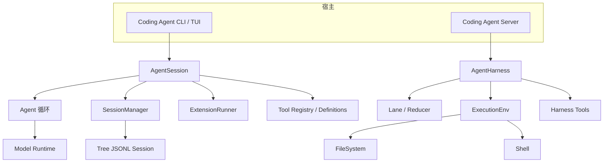
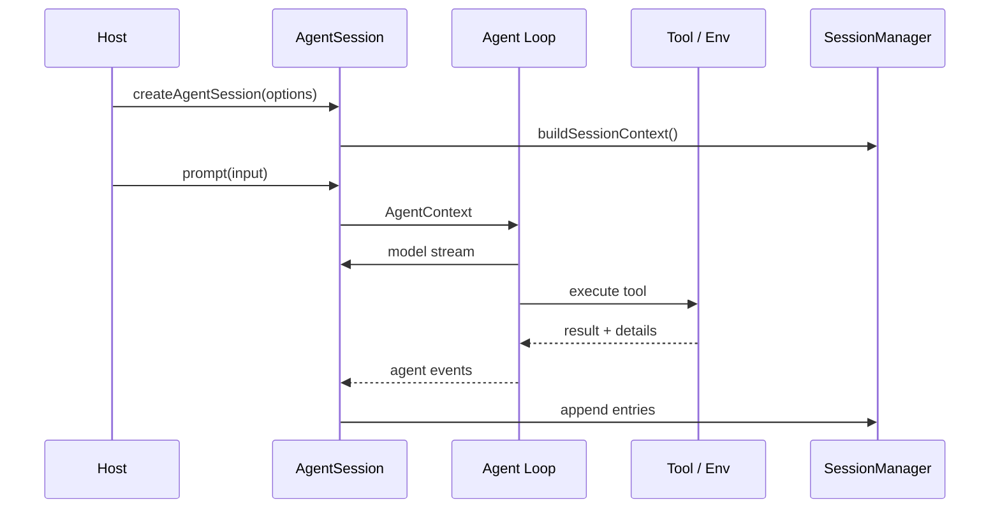

# Pi 架构总览

## 一句话结论

Pi 分两层：`packages/agent` 提供与产品无关的 AgentHarness、Lane、AgentContext 和 ExecutionEnv；`packages/coding-agent` 在其上装配 CLI、server、扩展、SessionManager 和编码工具。它用树状 JSONL 会话保存事实，用 lane 隔离并发活动，用可替换执行环境承载文件与 Shell 副作用。

## 定位与部署形态

仓库按能力拆包：

- **通用内核**：`packages/agent` 定义 Harness、Lane、session reducer、工具上下文和执行环境抽象。
- **模型层**：`packages/ai` 抽象模型与请求；`packages/protocol` 定义跨进程协议。
- **编码产品**：`packages/coding-agent` 聚合资源、扩展、工具、TUI 和 SDK。
- **宿主**：CLI/TUI 面向本地开发者；`packages/server` 和 coding-agent server 路径面向远端或编辑器集成。
- **存储与观测**：`session-backends/sqlite-node` 和 `packages/telemetry` 提供可选后端与遥测。

CLI 主路径用 `createAgentSession` 创建 `AgentSession`；server 路径用 `createCodingAgentHarness` 创建通用 `AgentHarness`，再把编码工具适配成 Harness 工具。两者不是两个引擎，而是同一抽象上的不同宿主装配。

## 架构分层

| 层 | 关键符号 | 职责 |
| --- | --- | --- |
| SDK 入口 | `createAgentSession` | 解析 cwd、agent dir、模型、settings、resource loader 和 SessionManager，再创建会话。 |
| 会话外观 | `AgentSession` | 聚合 Agent、SessionManager、SettingsManager、扩展、工具注册、Steering、压缩和重试。 |
| 通用 Harness | `AgentHarness` | 管理 Lane、工具、流选项、执行环境和事件流，供 server 等宿主复用。 |
| 并发单元 | `LaneInfo` / `LaneSnapshot` | 隔离一次活动；busy lane 拒绝冲突操作。 |
| 会话存储 | `SessionManager` | 维护 append-only entry 树、leaf 指针、分支、标签和模型可见上下文。 |
| 执行环境 | `ExecutionEnv` | 组合 FileSystem 与 Shell 能力，把工具副作用从核心循环中隔离。 |

## 核心类型

| 类型 | 锚点 | 设计意图 |
| --- | --- | --- |
| `AgentSession` | `coding-agent/src/core/agent-session.ts:310` | 面向编码产品的高层会话：模型、工具、扩展、Steering、压缩、重试和事件监听。 |
| `AgentContext` | `agent/src/types.ts:412` | 低层循环可见的系统提示、transcript 和工具集合。 |
| `AgentTool` / `ToolDefinition` | coding-agent tools 与 agent types | 定义参数、执行函数、详情和 sequential/parallel 模式。 |
| `AgentHarness` | `agent/src/harness/agent-harness.ts:305` | 通用 Lane 容器与执行面；server 装配使用它而不是 AgentSession。 |
| `LaneState` / `LaneRecord` | `agent/src/harness/reducer.ts`、`session/types.ts` | 从记录日志重放出 lane 状态，支持恢复和审计。 |
| `ExecutionEnv` | `agent/src/harness/types.ts:315` | 文件与 Shell 能力的最小接口；容器化或本地实现可替换。 |
| `SessionManager` | `coding-agent/src/core/session-manager.ts:855` | append-only 树存储；leaf 决定当前分支，分支不修改历史。 |

## 调用链

### CLI / SDK 路径

1. **解析环境**：`createAgentSession` 解析 cwd、agent dir、auth、models 和 settings。
2. **资源装载**：默认 `DefaultResourceLoader` 读取项目与用户资源；已有 Session 时尝试恢复模型。
3. **会话上下文**：`SessionManager.buildSessionContext()` 从 root 到 leaf 解析消息、压缩摘要和 thinking level。
4. **创建会话**：装配 Agent、SessionManager、SettingsManager、ModelRuntime、ResourceLoader 和扩展运行时。
5. **用户回合**：`AgentSession.prompt()` 把输入交给 Agent 循环；Steering 和 follow-up 分别排队。
6. **工具执行**：循环调用工具定义；扩展可在 before/after 阶段拦截，执行环境提供文件与 Shell 能力。
7. **持久化**：每条可持久事实成为 SessionManager entry，追加为当前 leaf 的子节点。

### Server / Harness 路径

`createCodingAgentHarness` 创建通用 Harness 和 `ExecutionToolContext`，把 read、edit、write 等编码工具包装成 Harness 工具，并动态生成包含 cwd、工具列表和 active tool names 的系统提示。客户端通过协议操作 Lane，Harness 将记录写入可 reducer 的日志。

## 状态与持久化

SessionManager 把会话保存为 append-only JSONL 树。每个 entry 有 id 和 parentId；追加创建当前 leaf 的子节点，分支把 leaf 移到较早 entry，之后的新工作成为新子链。`buildSessionContext()` 沿 root 到 leaf 重组消息，并处理 compaction summary。

这种结构让历史不可变、分支显式：重放不会覆盖旧路径。通用 Harness 侧另有 LaneRecord 日志和 reducer，可从记录重建 LaneState。两层的字段校验、header 格式和 entry_added 可见性属于批量 Implementation Review。

## 工具链路

工具在 AgentSession 中有基础定义、扩展注册、prompt snippet 和 allowed/excluded 集合。执行时传入 AgentContext 与工具上下文；结果包含模型可见内容和 UI details。`executionMode` 支持 sequential 或 parallel，默认模式由循环决定。

扩展可以注册工具、修改系统提示、拦截调用和结果，并提供 UI 或命令。通用 Harness 工具则通过 `AgentHarnessTool` 与 context source 绑定，server 路径把编码工具适配到 ExecutionEnv。审批、沙箱和容器化细节在 F-P3 展开。

## 扩展点

| 扩展点 | 入口 | 说明 |
| --- | --- | --- |
| 模型 | ModelRuntime 与 `packages/ai` | provider/model/thinking level 可配置，会话可恢复模型。 |
| 工具 | custom tools、extension registry、Harness tool | 编码工具、用户工具和协议工具可组合。 |
| 扩展 | ExtensionRunner | 注入 prompt、工具、命令、UI 和生命周期钩子。 |
| 执行环境 | ExecutionEnv | 替换本地文件/Shell 或容器实现。 |
| 存储 | SessionManager 与 sqlite backend | JSONL 为核心路径，SQLite 提供可选后端。 |
| 宿主 | CLI、TUI、server、protocol | 同一核心服务不同交互边界。 |

## 设计取舍

- **优点**：通用 Harness 与编码产品分离，server 和 CLI 可复用抽象；树状 JSONL 天然支持分支和不可变历史；ExecutionEnv 让容器化边界清晰。
- **代价**：AgentSession 聚合大量产品职责；通用 Lane、reducer 与编码 SessionManager 有两套相近概念；JSONL 树需要认真处理校验、压缩和迁移。
- **适用判断**：适合需要多宿主、分支会话和可替换执行环境的编码助手；如果只需要单进程简单循环，两层抽象可能偏重。

## 自检问题

1. AgentSession 和 AgentHarness 的职责边界在哪里？
2. SessionManager 为什么用 leaf 指针而不是修改旧 entry？
3. LaneBusy 在并发场景中保护了什么？
4. ExecutionEnv 如何帮助把工具测试从真实文件系统解耦？

## 相关页面

- [教材目录](../../TOC.md)
- [Session、Turn 与状态模型](../../01-core-concepts/session-and-state.md)
- [Sub-agent 与并发](../../02-harness-mechanics/subagent-concurrency.md)
- [术语表](../../09-glossary/glossary.md)
