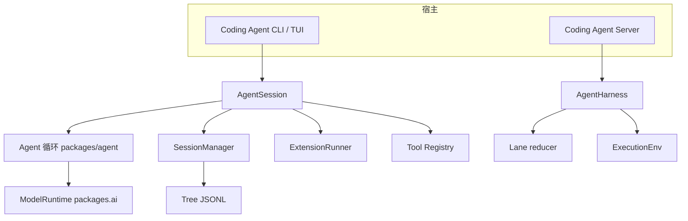
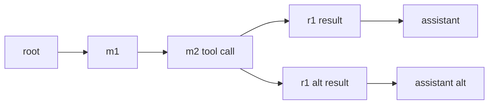

## 一句话结论

Pi 分两层：packages/agent 提供与产品无关的 Agent 循环、AgentHarness 抽象和 ExecutionEnv；packages/coding-agent 在其上装配 AgentSession——聚合 Agent 循环、树状 JSONL SessionManager、SettingsManager、ResourceLoader 与 ExtensionRunner。会话事实保存在 append-only entry 树中：追加创建当前 leaf 的子节点，分支只移动 leaf 指针而永不改写历史。执行副作用被推到 FileSystem 与 Shell 组成的 ExecutionEnv 边界之后。

## 上一章遗留问题

F-D3 展示了 DeepSeek Harness 的服务容器与 runner chain。F-P1 回答另一条路线：不用服务容器时，如何让通用内核被 CLI 与 server 复用？分支会话为什么用 leaf 指针而不是复制历史？

## 本章解决什么矛盾

编码助手需要 TUI、扩展系统和项目资源装载；协议集成需要可嵌入的纯循环和可替换执行环境。把两者塞进一个类会让内核绑死产品细节，拆成两个包又可能出现两套真相。Pi 的取舍是：

1. 内核（packages/agent）：Agent 循环、AgentHarness、session reducer 与 ExecutionEnv 接口；
2. 产品（packages/coding-agent）：AgentSession 聚合内核并叠加 SessionManager、扩展与 TUI；
3. 共享事实：SessionManager 的 append-only 树同时服务两条路径的持久化语义。

直觉上这是发动机加整车。精确机制是 AgentSession 构造函数常驻订阅 Agent 事件（`external/pi/packages/coding-agent/src/core/agent-session.ts:398-400`），把 message_end 翻译为 SessionManager 追加；失效边界是两条宿主路径的能力面不同——AgentHarness.create 对 restore 抛 HarnessNotImplemented（`external/pi/packages/agent/src/harness/agent-harness.ts:347-353`），恢复流程仍由 coding-agent 路径承担。

## 架构分层

| 层 | 关键符号 | 职责 |
| --- | --- | --- |
| SDK 入口 | createAgentSession | 解析 cwd、agentDir、settings、resources 并创建 AgentSession |
| 会话外观 | AgentSession | 聚合 Agent、SessionManager、扩展、Steering、压缩、重试与事件监听 |
| 通用内核 | packages/agent Agent 循环 | 流式请求、工具执行模式、事件发射 |
| Harness 抽象 | AgentHarness implements AgentLane | Lane 容器、模型工具队列配置、watch 快照 |
| 执行环境 | ExecutionEnv extends FileSystem, Shell | 文件与 Shell 能力接口，可替换为容器实现 |
| 会话存储 | SessionManager | append-only id parentId 树、leaf 指针、buildSessionContext |

## 双宿主：AgentSession 与 AgentHarness

### CLI SDK 路径：AgentSession

AgentSession 是面向编码产品的聚合器。构造时注入 agent、sessionManager、settingsManager 等协作对象（`external/pi/packages/coding-agent/src/core/agent-session.ts:310-314`），并常驻订阅 Agent 事件用于持久化、扩展分发、自动压缩与重试（`external/pi/packages/coding-agent/src/core/agent-session.ts:398-400`）。它自己维护：

1. steeringMessages 与 followUpMessages 两类排队输入的 UI 投影；
2. pendingNextTurnMessages 随下一轮用户输入注入的自定义上下文；
3. isAgentRunActive 与 idle wait 表达活动收敛。

这些字段说明 AgentSession 不只是转发器：它拥有排队策略、扩展协调和资源刷新（M-01 已核对 setActiveToolsByName 重建 system prompt）。

### Server 路径：AgentHarness

AgentHarness 实现 AgentLane，name 固定为 main，字段直接对应配置项：durableSession、model、thinkingLevel、activeToolNames、tools、resources、streamOptions、retryPolicy、compactionSettings、steeringMode 和 followUpMode（`external/pi/packages/agent/src/harness/agent-harness.ts:305-345`）。create 是静态入口：查找已有 record 后抛 HarnessNotImplemented 的 create.restore——restore 尚未实现，这一限制被诚实暴露而非隐藏（`external/pi/packages/agent/src/harness/agent-harness.ts:347-353`）。

AgentLane 接口要求 getModel、setModel、getThinkingLevel、setThinkingLevel、getActiveTools、setActiveTools、session SessionTree 和 watch 返回 WatchHandle LaneSnapshot（`external/pi/packages/agent/src/harness/agent-harness.ts:295-303`）。server 宿主通过这组方法操作 lane，而不触碰 coding-agent 内部。

## 会话存储：append-only 树

SessionManager 的类文档就是设计说明书：会话以 append-only 树存储在 JSONL 文件中，每个 entry 有 id 和 parentId 构成树结构；leaf 指针跟踪当前位置；追加创建当前 leaf 的子节点；分支把 leaf 移到较早 entry，允许新分支而不修改历史；buildSessionContext 处理 compaction summary 并沿 root 到 leaf 解析消息列表（`external/pi/packages/coding-agent/src/core/session-manager.ts:845-854`）。

关键结构：

1. fileEntries：磁盘顺序的全部条目；
2. byId：id 到 entry 的索引；
3. labelsById 与 labelTimestampsById：标签投影；
4. leafId：当前分支末端。

追加走 appendEntry：推入 fileEntries、写入 byId、推进 leafId、persist。分支调用后，后续 append 以目标 entry 为 parent——历史永不修改。

切换分支即移动 leaf 到 m2 下的另一子链；旧链仍在文件中，审计与回溯不丢数据。

## 执行环境：ExecutionEnv

ExecutionEnv 继承 FileSystem 与 Shell（`external/pi/packages/agent/src/harness/types.ts:314-315`）。Shell 接口的注释明确两个约束：exec 在 FileSystem.cwd 下执行除非 options.cwd 提供；cleanup 必须 best-effort 且不得抛出或拒绝（`external/pi/packages/agent/src/harness/types.ts:304-312`）。

这个接口把工具想做什么与在哪里做分离：

1. 本地实现直接 spawn 进程；
2. 容器实现把同一组调用转发到隔离环境；
3. 测试实现可以内存模拟。

核心循环与 Harness 工具只见接口不见平台代码——这是 F-P3 讨论容器化时的锚点。

## 工具与扩展

AgentSession 的工具来自三处：baseToolDefinitions、SDK custom tools 和 extension registered tools；合并后经 allowed 与 excluded 过滤形成 toolRegistry，active names 去重后交给 setActiveToolsByName（M-03 锚点 agent-session.ts:2588-2679）。每个工具带 promptSnippet 与 promptGuidelines 参与系统提示构建。

ExtensionRunner 在生命周期各点介入：

1. before_agent_start：修改本次 systemPrompt 并追加 custom messages；
2. tool_call：可 block 或就地 mutate input，无再校验，受信扩展专用；
3. after_tool_call：覆盖 content details isError；
4. compaction 与 navigation：参与摘要与分支摘要。

通用 Harness 侧的工具则通过 HarnessTool 绑定 context source，由 server 装配决定映射到哪个 ExecutionEnv。

## 反例与故障模式

1. **绕过 leaf 改历史**
   - 触发：直接编辑 JSONL 中间行。
   - 因果：byId 索引与文件不一致，branch 语义崩坏。
   - 正确边界：一切写入经 appendEntry；修正用新 entry 表达。
2. **在 AgentHarness 上期待 restore**
   - 触发：server 路径调用 create 恢复旧会话。
   - 因果：抛 HarnessNotImplemented。
   - 正确边界：restore 走 coding-agent 的 SessionManager 路径或等上游实现。
3. **Shell cleanup 抛错**
   - 触发：容器实现清理时 reject。
   - 因果：违反接口契约，上层清理链中断。
   - 正确边界：best-effort 吞错并记录。
4. **custom entry 无命名约定**
   - 触发：多个扩展都用 note 类型。
   - 因果：消费方无法区分来源，检索歧义。
   - 正确边界：customType 采用命名空间约定并在扩展间声明。
5. **leaf 移动后假设工具面不变**
   - 触发：分支早于某次 setActiveTools。
   - 因果：新分支沿用当前工具面，与历史上下文不匹配。
   - 正确边界：需要时在分支后显式重设工具并记录。
6. **ExecutionEnv 泄漏到内核**
   - 触发：Agent 循环直接 import node fs。
   - 因果：无法容器化，测试必须落盘。
   - 正确边界：内核只依赖接口；实现由宿主注入。
7. **两套会话概念混用**
   - 触发：在 AgentHarness 上调用 SessionManager 特有 API。
   - 因果：类型不存在或语义错位。
   - 正确边界：分清宿主路径；共享能力通过 SessionTree 抽象。
8. **Steering 队列跨会话残留**
   - 触发：切换会话后未清空 steeringMessages。
   - 因果：旧指令注入新会话。
   - 正确边界：teardown 时清空队列状态。

## 一条完整因果链

开发者在 CLI 中完成一次重构，然后 fork 出实验分支：

1. createAgentSession 解析 cwd 与 settings，ResourceLoader 装载 AGENTS.md 与 skills；SessionManager 打开既有 JSONL 并迁移到 v3。
2. 用户提交重构任务；prompt 构建 user message 并注入 pendingNextTurnMessages；Agent 循环开始。
3. 模型发出 edit_file 加 bash test 调用；file mutation queue 保证同文件串行；结果作为 entry 挂到当前 leaf。
4. 重构完成后模型总结；message_end 驱动 SessionManager.appendMessage，leaf 前进。
5. 用户执行 fork 到重构前的一条 entry：SessionManager 仅移动 leafId，不改任何已有行。
6. 新分支上的实验性修改全部成为新子链 entry；原重构链完整保留。
7. buildSessionContext 沿 root 到 new leaf 重组消息，遇到 compaction entry 时按 firstKeptEntryId 处理摘要边界。
8. 若实验失败，用户再 fork 回原链——两次分支都只是 leaf 移动，磁盘上没有任何行被改写。

这条链展示了树状存储的核心价值：分支是元数据操作，不是数据复制。

## 设计取舍

| 方案 | 收益 | 代价 | 适用 |
| --- | --- | --- | --- |
| 单一 AgentSession 上帝类 | 开发快 | 无法嵌入其他宿主 | 只做 CLI |
| 内核产品双包 | 复用清晰 | 两套会话概念并存 | Pi 的选择 |
| JSONL 树 | 不可变历史天然分支 | 大文件扫描需迁移 | 本地优先 |
| SQLite 后端 | 查询强 | 引入数据库依赖 | 可选 session backends |
| leaf 指针分支 | 元数据级操作 | UI 需理解多链 | 需要试错的编码任务 |
| ExecutionEnv 接口 | 可测试可容器化 | 实现需遵守 cleanup 契约 | 副作用隔离 |
| ExtensionRunner 全生命周期钩子 | 功能强 | mutate input 无再验证的风险 | 受信扩展 |

迁移启示：若要从单体演进，第一步是把文件与 Shell 副作用抽成 ExecutionEnv 接口；第二步把持久化改为 append-only 条目；最后才拆内核与产品包。顺序反了会把产品逻辑焊死在内核里。

## 自检与面试追问

1. AgentSession 与 AgentHarness 各自的客户是谁？如果要在 IDE 插件中嵌入 Pi，选哪条路径？
2. 为什么分支不能通过复制历史实现？列出存储与审计两方面的后果。
3. Shell cleanup 的不得抛出契约如何影响容器实现的重试逻辑？
4. custom entry 的 customType 应该满足什么命名规则才能避免跨扩展冲突？
5. 如果要把 sqlite backend 设为默认，哪些调用点需要抽象？SessionManager 的哪些方法成为适配层？
6. 对照 Reasonix Controller 与 DeepSeek ctx.agents：Pi 的 AgentSession 缺少什么横切能力？补齐的最小改动是什么？

## 交给下一章的问题

本章给出 Pi 的组件地图与存储模型。F-P2《Pi Run 生命周期》将沿 Agent 循环深挖 turn_start、message_update、tool_execution_end 的发射顺序、并行工具的 completion-order 事件与 source-order 结果，以及 coding-agent 的 retry 与 compaction 如何挂接。

## 相关页面

- [教材目录](../../TOC.md)
- [一次 Agent Run 的完整生命周期](../../01-core-concepts/agent-run-lifecycle.md)
- [Sub-agent 与并发](../../02-harness-mechanics/subagent-concurrency.md)
- [Pi Run 生命周期](./run-lifecycle.md)
- [术语表](../../09-glossary/glossary.md)
