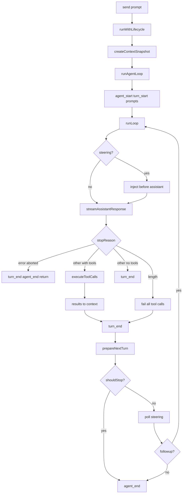

## 一句话结论

Pi 低层循环是 runAgentLoop：发出 agent_start 和 turn_start，消费 Steering，流式生成 assistant message，执行工具批处理，再等待 follow-up 或结束为 agent_end。stopReason 为 error/aborted 时立即终止；为 length 时整批 tool call 失败而非执行畸形参数。高层 Agent 把事件折算成 state 并等待订阅者完成；AgentSession 再把 message_end 桥接为 SessionManager entry，同时维护 steering、follow-up、压缩和重试队列。

## 上一章遗留问题

F-P1 给出组件地图。F-P2 回答：双层循环何时开新 turn？为什么 length 截断不能只丢最后一个 tool call？message_end 在内存与持久化中分别意味着什么？订阅者在 agent_end 中抛错会怎样？

## 本章解决什么矛盾

低层循环要可独立测试且不绑定产品；产品又需要 steering、压缩、重试和持久化。Pi 的解法是把循环做成纯函数（context in → events + messages out），把横切逻辑放到 config 回调（beforeToolCall/afterToolCall/prepareNextTurn/shouldStopAfterTurn），再由 Agent.processEvents 统一分发，由 AgentSession 决定哪些事件落盘。

直觉上这是“发动机不带变速箱”。精确机制是 runLoop 只认 AgentContext 与 config；失效边界是宿主若忘记桥接 message_end，内存历史仍在但磁盘丢失——循环不会替你兜底。

## 核心不变量

1. **prompt 完整边界**：每条 prompt 都发 message_start 加 message_end，即使内容已在调用方历史中。
2. **continue 前置校验**：最后一条消息是 assistant 时抛错——未闭合的工具轮不能直接续跑。
3. **length 全批失败**：截断输出的所有 tool call 一律失败并给出“重新发出完整参数”的指引。
4. **agent_end 收尾**：它是最后事件；Agent 等待其订阅者完成后才 idle。
5. **message_end 驱动持久化**：AgentSession 在该事件把 user/assistant/toolResult/custom 写入 SessionManager。
6. **willRetry 注入**：agent_end 被复制时附 willRetry 字段，让 UI 区分“结束”与“将重试”。

## 理想状态图

```mermaid
stateDiagram-v2
  [*] --> AgentStart: agent_start
  AgentStart --> TurnStart: turn_start
  TurnStart --> Prompts: message_start/end per prompt
  Prompts --> Streaming: streamAssistantResponse
  Steer --> InjectMessages: pending steering
  InjectMessages --> Streaming
  Streaming --> TurnEndError: stopReason error 或 aborted
  Streaming --> TruncatedFail: stopReason length
  Streaming --> ToolBatch: 有 toolCall 且非截断
  TruncatedFail --> TurnEnd: 全部 isError
  ToolBatch --> TurnEnd: results appended
  TurnEnd --> PrepareNext: prepareNextTurn
  PrepareNext --> ShouldStop: shouldStopAfterTurn
  ShouldStop -- true --> AgentEnd: agent_end
  ShouldStop -- false --> SteeringPoll
  SteeringPoll -- has steering --> InjectMessages
  SteeringPoll -- none --> FollowUpCheck
  FollowUpCheck -- has followup --> InjectMessages
  FollowUpCheck -- none --> AgentEnd
```



## 初学者主线

把 runLoop 当流水线的两圈轨道：

1. 内圈（inner loop）：只要还有 tool call 或 steering 就继续转——模型干活、工具执行、结果回填；
2. 外圈（outer loop）：内圈想停时检查 follow-up 队列——有排队任务就再开一圈。

每次经过内圈顶部都发 turn_start；第一次跳过是因为 runAgentLoop 已发过。这个细节解释了为什么代码里有 firstTurn 标志。

### Steering vs follow-up

- Steering：在下一步 assistant response 前注入，用户可以中途纠偏；
- Follow-up：本应停止时的追加任务，触发外圈新回合。

两者都经 getSteeringMessages/getFollowUpMessages 回调获取，循环不持有队列本身。

## 机制深拆

### 1. 启动序列与 continue 校验

runAgentLoop 把 prompts 复制进 newMessages 并合并进 currentContext.messages，然后按序发 agent_start、turn_start 和每条 prompt 的 message_start/end（`external/pi/packages/agent/src/agent-loop.ts:95-118`）。runAgentLoopContinue 则先做两道校验：无消息抛错；最后一条是 assistant 抛错 Cannot continue from message role: assistant（`:120-133`）。原因写在 agentLoopContinue 同步版本的注释里：最后一条必须能 convertToLlm 为 user 或 toolResult，否则 provider 会拒绝请求，而这无法在此处提前验证（`external/pi/packages/agent/src/agent-loop.ts:60-63`）。

### 2. 双层循环与 prepareNextTurn

runLoop 的外层 while(true) 包住内层 while(hasMoreToolCalls || pendingMessages)。每个内圈迭代：

1. 非 firstTurn 发 turn_start；
2. 注入 pending steering（各带完整 start/end）；
3. streamAssistantResponse 得到完整 message；
4. stopReason 分支处理；
5. 发 turn_end；
6. prepareNextTurn 快照可替换 context/model/thinkingLevel；
7. shouldStopAfterTurn 返回 true 则发 agent_end 并返回；
8. 重新拉取 steering 进入下一轮。

外层在内圈退出后拉取 followUpMessages：有则置为 pendingMessages 并 continue 外层；没有则 break 发最终 agent_end（`external/pi/packages/agent/src/agent-loop.ts:155-275`）。

prepareNextTurn 的返回值三选一可覆盖：context（下一轮的消息投影）、model、thinkingLevel。coding-agent 用它把当前 basePrompt/tools 覆盖进 context（M-01 锚点 agent-session.ts:540-560）。

### 3. 流式分支与 sticky length

streamAssistantResponse 在 provider 流上区分 start/text/thinking/toolcall 增量并发 message_update；done/error 时用 response.result() 替换 partial 为 final 并发 message_end（`external/pi/packages/agent/src/agent-loop.ts:314-371`）。runLoop 对结果的处理分三支：

1. error/aborted：turn_end 后 agent_end 直接 return（`:196-200`）；
2. length：failToolCallsFromTruncatedMessage 把整批 tool call 变成错误结果——注释解释 A length stop means the output was cut off by the token limit, so every tool call may carry truncated arguments. Fail them all instead of executing potentially borked calls（`:208-214`）；随后 hasMoreToolCalls=false，走正常 turn_end；
3. 其他且有 tool calls：executeToolCalls；terminate 标志决定 hasMoreToolCalls。

### 4. executeToolCalls 的终止规则

sequential 模式逐个执行并在 abort 时 break；parallel 模式先全部 prepare，执行体并发，结果按 source order 组装（M-03/M-04 已核对锚点 agent-loop.ts:411-553）。shouldTerminateToolBatch 要求 finalizedCalls.length > 0 且 every result.terminate === true——单个 blocked 不武断杀批次（`external/pi/packages/agent/src/types.ts:371-374`）。

### 5. Agent.processEvents 与 AgentSession 桥接

高层 Agent.runPromptMessages 用 runWithLifecycle 包裹 runAgentLoop，把事件交给 processEvents（`external/pi/packages/agent/src/agent.ts:409-423`）。processEvents 更新 mutable state：message_start/update 维护 streamingMessage，message_end 推入 messages，tool start/end 维护 pendingToolCalls，turn_end 落 errorMessage 等。

AgentSession._handleAgentEvent 在扩展分发和监听器通知之后处理持久化：message_end 时 custom 角色走 appendCustomMessageEntry，user/assistant/toolResult 走 appendMessage（`external/pi/packages/coding-agent/src/core/agent-session.ts:650-668`）。agent_end 被复制并附 willRetry = this._willRetryAfterAgentEnd(event)（`:648`），让 UI 能区分“真的结束”与“即将自动重试”。

runWithLifecycle 保证 _isAgentRunActive 在整个 run 期间为 true，结束后 resolve idle wait——这就是 AgentSession.abort() 中 waitForIdle 的语义来源（M-09 锚点 agent-session.ts:1558-1565）。

## 反例与故障模式

1. **从 assistant 直接 continue**
   - 触发：宿主在工具轮中断后调 continue。
   - 因果：provider 收到无法配对的 assistant 尾巴而拒绝。
   - 正确边界：先补齐 toolResult 或改走 prompt。
2. **length 只丢最后一个 call**
   - 触发：认为只有最后一个 JSON 被切断。
   - 因果：前面的 call 可能引用了不存在的后续结果，或参数本身已截断。
   - 正确边界：整批 fail 并提示 re-emit complete arguments。
3. **steering 注入缺 start/end**
   - 触发：只 push 到 context 不发事件。
   - 因果：UI 与持久化都看不到该输入。
   - 正确边界：pending steering 逐条发完整 message 生命周期。
4. **agent_end 先于订阅者完成**
   - 触发：fire-and-forget 监听器。
   - 因果：idle 判定过早，abort/资源清理竞态。
   - 正确边界：await 所有 listener；agent_end 订阅者属于运行结算。
5. **prepareNextTurn 忘记返回 context**
   - 触发：只改 model 不带 context。
   - 因果：下一轮仍用旧消息投影，覆盖无效。
   - 正确边界：nextTurnSnapshot.context ?? currentContext 明确保底。
6. **shouldStop 后仍消费 followup**
   - 触发：shouldStop 返回 true 但外层继续拉 followup。
   - 因果：预算已到却继续烧钱。
   - 正确边界：agent_end 直接 return，followup 留给下一次显式启动。
7. **message_end 前写盘**
+   - 触发：在 message_update 时同步 SessionManager。
+   - 因果：半截消息成为 entry，恢复后读到残句。
+   - 正确边界：只在 message_end 桥接 append。
+8. **willRetry 未透传**
+   - 触发：UI 拿原始 agent_end 判断。
+   - 因果：重试前显示永久失败，用户体验割裂。
+   - 正确边界：AgentSession 复制 event 附 willRetry。
+
+## 一条完整因果链
+
+一次带中途纠偏的代码评审：
+
+1. 用户提交评审任务；AgentSession.prompt 经 runPromptMessages 启动 runAgentLoop。
+2. agent_start、turn_start、prompt 的 start/end 依次落事件流；AgentSession 在 prompt 的 message_end 把 user entry 写入 JSONL。
+3. 模型流式输出 8 个 update 后发出含 read_file 调用的完整消息；message_end 触发 assistant entry 落盘。
+4. executeToolCalls 执行 read_file，tool_execution_start/end 与 toolResult message 依次发射；result entry 落盘并进入 context。
+5. 用户在模型思考时输入补充说明，进入 steering 队列。
+6. 下一个内圈迭代开始：turn_start 发出，steering 消息以完整 start/end 注入 context 并落盘。
+7. 新一轮 assistant 输出命中 max-tokens 且带 tool call：failToolCallsFromTruncatedMessage 整批失败，每个结果都是 isError 并建议重新发出。
+8. turn_end 发出；prepareNextTurn 让 coding-agent 覆盖当前 systemPrompt/tools。
+9. shouldStopAfterTurn 返回 false；steering 已清空，followup 为空。
+10. 外层 break，agent_end 附 messages 发出；AgentSession 复制附 willRetry=false，监听器完成后 idle。
+11. 重启后 JSONL 树完整记录：两条 turn 边界、steering 注入位置、截断失败原因与全部配对结果。
+
+这条链的核心：事件顺序即审计顺序；每个决策点都有对应事件可供回放。
+
+## 设计取舍
+
+| 方案 | 收益 | 代价 | 适用 |
+| --- | --- | --- | --- |
+| 纯函数循环 + config 回调 | 可独立测试、宿主可控 | 回调多需文档 | 库形态 |
+| 循环内置产品逻辑 | 开箱即用 | 无法复用 | 单一产品 |
+| steering 内圈注入 | 即时纠偏 | 每轮 poll 成本 | 交互式助手 |
+| follow-up 外圈开启新 turn | 任务排队清晰 | 队列管理复杂 | 多任务提交 |
+| length 全批失败 | 杜绝畸形执行 | 浪费已生成 tokens | 工具参数含长 JSON |
+| 只丢弃尾部 call | 省 tokens | 可能执行半截参数 | 无 |
+| message_end 驱动持久化 | 单一提交点 | 宿主必须正确桥接 | 事件溯源 |
+| 双处持久化 | 冗余 | 一致性负担 | 禁止 |
+
+迁移启示：如果你的循环把 steering、重试、持久化混在一起，先抽 config 回调把它们变成可选能力；再把事件发射改为有序 sink；最后拆双层循环。不要先做事件系统而不固定顺序，消费者会依赖偶然实现。
+
+## 框架实现对照
+
+| 理想概念 | 实现 | 关键锚点 |
+| --- | --- | --- |
+| 启动序列 | runAgentLoop agent_start/turn_start/prompt events | `packages/agent/src/agent-loop.ts:95-118` |
+| continue 校验 | 最后一条非 assistant；注释说明 provider 拒绝原因 | `packages/agent/src/agent-loop.ts:60-76,120-143` |
+| 双层循环 | runLoop outer followup + inner tools/steering | `packages/agent/src/agent-loop.ts:155-275` |
+| sticky length | failToolCallsFromTruncatedMessage 整批失败 | `packages/agent/src/agent-loop.ts:207-216,381-406` |
+| prepareNextTurn | context/model/thinkingLevel 三覆盖 | `packages/agent/src/agent-loop.ts:226-245` |
+| shouldStop | agent_end 提前返回 | `packages/agent/src/agent-loop.ts:247-257` |
+| 高层分发 | runPromptMessages/processEvents/createContextSnapshot | `packages/agent/src/agent.ts:409-443,486,544` |
+| 持久化桥 | message_end 分角色 append | `packages/coding-agent/src/core/agent-session.ts:650-669` |
+| willRetry | agent_end 复制附加 | `packages/coding-agent/src/core/agent-session.ts:644-648` |
+
+## 实现精妙之处
+
+1. **prompt 也发完整生命周期**：让持久化桥无需特判初始输入。
+2. **continue 校验放在同步入口**：agentLoopContinue 与异步版双重防护，错误信息一致。
+3. **firstTurn 标志**：避免 runAgentLoop 已发的 turn_start 重复。
+4. **length 的注释式推理**：直接说明为什么不能部分执行，后来者不必重新推导。
+5. **getSteeringMessages 放内圈尾部**：保证下一轮 turn_start 前拿到最新纠偏。
+6. **willRetry 复制而非修改原事件**：原事件保持协议稳定，附加信息只给产品层。
+7. **error/aborted 提前 return**：不发多余的 turn_end 配对，避免恢复器误判为正常轮。
+
+## 自检与面试追问
+
+1. 如果 steering 消息到达时内圈正在 executeToolCalls，它会在哪一步被注入？对 provider 请求有什么影响？
+2. 为什么 failToolCallsFromTruncatedMessage 还要发完整的 start/end 事件？省略会破坏什么？
+3. prepareNextTurn 返回 thinkingLevel=off 与 undefined 的区别是什么？
+4. 如果两个订阅者中第一个在 message_end 抛错，第二个还会收到吗？SessionManager 会落盘吗？
+5. 如何测试 continue 从 toolResult 结尾续跑的正确性？需要哪些 fixture？
+6. 对照 DeepSeek 的 request-error waterfall：Pi 的 retry 由谁决定？两者的策略表达能力差异是什么？
+
+## 交给下一章的问题
+
+本章钉住了 Pi 的事件顺序与持久化桥。F-P3《Pi 工具与沙箱》将深入工具定义包装、ExtensionRunner 的 block/mutate 门、file mutation queue 与 bash 进程树治理。
+
+## 相关页面
+
+- [教材目录](../../TOC.md)
+- [Pi 架构总览](./overview.md)
+- [Timeout 与取消](../../02-harness-mechanics/timeout-cancellation.md)
+- [Retry 与幂等](../../02-harness-mechanics/retry-idempotency.md)
+- [术语表](../../09-glossary/glossary.md)
+MDEOF
cp /tmp/fp2-run-lifecycle.md tutorial/zh-CN/03-frameworks/pi/run-lifecycle.md