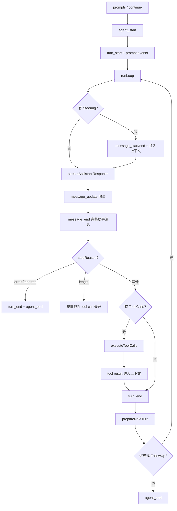

# Pi Run 生命周期

## 一句话结论

Pi 低层循环是 `runAgentLoop`：发出 agent_start 和 turn_start，消费 Steering，流式生成 assistant message，执行工具批处理，再等待 follow-up 或结束为 agent_end。高层 `Agent` 把事件折算成状态并等待订阅者完成；`AgentSession` 再桥接 SessionManager、扩展和 UI。

## 定位与边界

| 层 | 入口 | 职责 |
| --- | --- | --- |
| 低层循环 | `runAgentLoop` / `runAgentLoopContinue` | 接收 prompts、`AgentContext`、配置、abort signal、事件 sink 和 streamFn。 |
| 主循环 | `runLoop` | 外层处理 follow-up，内层处理工具调用与 Steering。 |
| 流式请求 | `streamAssistantResponse` | 组装 LLM 请求，转换增量事件，形成完整 AssistantMessage。 |
| 工具批 | `executeToolCalls` | 按 `toolExecution` 策略执行多个 tool call 并产出结果消息。 |
| 高层 Agent | `packages/agent/src/agent.ts:173` | 管理 state、订阅者、abort、错误消息和 idle 语义。 |
| 产品会话 | `AgentSession` | 桥接 SessionManager、扩展、压缩、重试、Bash 和 UI。 |

Pi 用事件而不是回调承载过程：`agent_start`、`turn_start`、`message_start/update/end`、`tool_execution_start/end`、`turn_end` 和 `agent_end`。订阅者的 Promise 会按订阅顺序被等待；`agent_end` 之后还要等所有 listener 完成，运行才算 idle。

## 生命周期图

## 阶段拆解

### 1. 启动与输入

`runAgentLoop` 复制 prompts，把它们追加到模型可见 transcript，然后发布 agent 与 turn 开始事件。每条 prompt 都有完整的 `message_start/message_end`。continue 入口要求最后一条消息不能是 assistant，避免在未闭合工具轮上直接续跑。

### 2. Steering 与外层循环

循环开始前先读取 Steering 队列。内层每次迭代也会重新读取；这些消息在下一条 assistant response 前注入，因此用户可以在模型工作中纠正方向。外层循环则处理 follow-up：当本应停止时仍有排队消息，就打开新的 turn。

### 3. 流式响应

`streamAssistantResponse` 组装 system prompt、LLM messages 和 tools，解析 API key，然后调用 streamFn。增量事件更新 partial message；结束后产生完整 AssistantMessage。stop reason 决定分支：

- **error / aborted**：立即写 `turn_end` 与 `agent_end`。
- **length**：输出被 token 上限截断，参数可能不完整，所以整批 tool calls 都失败，而不是尝试执行畸形 JSON。
- **toolCalls**：进入工具执行链。
- **普通结束**：没有工具则回合结束。

### 4. 工具批处理

`executeToolCalls` 从 assistant message 中提取 toolCall blocks，按 Agent 配置的 sequential 或 parallel 模式执行。每个调用会发出 start/end 事件，结果转成 ToolResultMessage 追加到 transcript。某些结果可标记 terminate，提前结束本轮工具循环。

### 5. 回合过渡与扩展点

每个回合结束时调用 `shouldStopAfterTurn` 和 `prepareNextTurn`。宿主可以在这里检查预算、修改配置、准备下一轮上下文或要求停止。Agent 构造时还支持 `transformContext`、before/afterToolCall、自定义 streamFn、API key resolver 和 payload/response observer。

## 状态与持久化

低层 `Agent` 的 mutable state 包含 streamingMessage、messages、pendingToolCalls、errorMessage 和 model。`message_end` 才把完整消息推入内存历史；`message_start/update` 只更新流式草稿。工具开始/结束维护 pending set；错误信息在 turn_end 时落到 state。

编码产品的 `AgentSession` 监听这些事件，把稳定消息桥接给 SessionManager，同时维护 Steering、follow-up、asides、压缩、重试和 Bash abort controller。具体桥接时序、entry 类型与 `entry_added` 可见性保留给统一审查。

## 设计取舍

- **优点**：事件流清晰，低层循环可独立测试；Steering 与 follow-up 分离；截断工具调用整体失败，避免执行畸形参数。
- **代价**：事件语义需要宿主正确等待；产品层仍需额外状态管理；压缩与重试逻辑分布在 AgentSession。
- **适用判断**：适合需要精细事件、可插拔模型流和多宿主集成的框架。若不需要 Steering 和多级事件，可简化为同步工具函数循环。

## 自检问题

1. 为什么 continue 不允许从 assistant 消息开始？
2. stopReason 为 length 时为什么不能只丢弃最后一个 tool call？
3. `message_end` 在内存状态和持久化中分别意味着什么？
4. 订阅者在 `agent_end` 中抛错会如何影响 Agent idle？

## 相关页面

- [教材目录](../../TOC.md)
- [Pi 架构总览](./overview.md)
- [一次 Agent Run 的完整生命周期](../../01-core-concepts/agent-run-lifecycle.md)
- [术语表](../../09-glossary/glossary.md)
