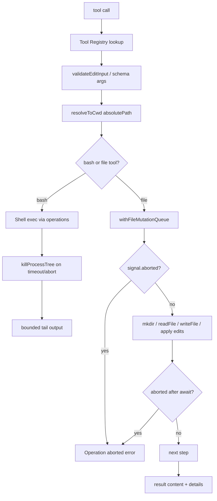

## 一句话结论

Pi 核心没有内置沙箱。工具通过可插拔 operations（如 writeFile/mkdir/exec）访问宿主资源；同一路径的写入用 `withFileMutationQueue`（realpath 作 key）串行保护；abort 采用 per-await throwIfAborted 模式而非 abort listener，保证 mutation queue 在操作 settle 前不释放。真正的隔离来自三种部署模式：Gondolin 工具路由、Plain Docker 整进程容器和 OpenShell 策略沙箱——这是宿主决策，不是框架默认。

## 上一章遗留问题

F-P2 钉住了 Run 状态机。F-P3 回答：write/edit 如何避免同文件竞态？abort 时为什么不在 listener 中 reject？Pi 没有 OS sandbox 时用什么兜底？

## 本章解决什么矛盾

工具需要读写真实文件、执行 shell 命令才能工作；但 Pi 选择不内置 OS 级沙箱，把隔离留给宿主部署。这意味着：

1. **并发安全**由 mutation queue 在应用层解决（同路径串行）；
2. **取消安全**由 throwIfAborted per-await 模式解决（queue 不提前释放）；
3. **物理隔离**由三种部署模式覆盖（Gondolin 路由 / Docker / OpenShell）。

直觉上这是"工具只管做事，边界由装修决定"。精确机制是 operations 接口 + queue + abort check 三层叠加。失效边界是：如果宿主既不配沙箱也不审查扩展，安全默认就是宿主进程权限——文档对此诚实声明。

## 核心不变量

1. **pluggable operations**：每个文件/shell 工具接受自定义 operations 接口，默认实现直连 Node API。
2. **同路径串行**：withFileMutationQueue 以 resolved/realpath 为 key，同 key 排队、不同 key 并行。
3. **abort 不释放 queue**：abort listener 只杀进程树；queue 内部用 signal.aborted per-await 检查，保持锁定直到 settle。
4. **resolveToCwd**：相对路径解析到 cwd 绝对路径后再入队，避免 cwd 变化导致写错位置。
5. **项目信任只是闸门**：决定是否加载扩展/设置/技能，不限制已加载工具后续行为。
6. **无内置沙箱诚实声明**：官方文档明确说明没有内置沙箱；隔离必须靠部署模式。

## 执行链路全景



| 工具 | 并发保护 | 取消方式 | 输出治理 |
| --- | --- | --- | --- |
| read | 无需 queue | signal.aborted per-await | truncateHead 元数据 |
| write | mutation queue | throwIfAborted per-await | byte count |
| edit | mutation queue | throwIfAborted per-await | replacement count |
| bash | exclusive（sequential mode）或独立实例 | killProcessTree + timeout | OutputAccumulator tail |
| grep/find/ls | 可并行 | signal | truncateHead |

## 初学者主线

把 Pi 工具当厨房厨师：

1. 菜谱（schema）告诉厨师做什么；
2. 厨房钥匙（ExecutionEnv）决定在哪个厨房做；
3. 同一个灶台（同文件）一次只能一个人用（mutation queue）；
4. 主厨喊停（abort）时，手里的盘子要放稳再走（settle before release）；
5. 厨房围墙（sandbox）不是厨师的事，是餐厅建筑的事（deployment）。

### Pluggable Operations

每个文件工具暴露 operations 接口：

```text
WriteOperations { writeFile, mkdir }
EditOperations  { readFile, writeFile, ... }
BashOperations  { exec(command, cwd, {onData, signal, timeout, env}) }
```

默认实现绑定 Node fs/child_process；替换实现可以把操作转发到 SSH、容器或远端 executor。这个接口让工具逻辑与执行位置解耦——测试时注入内存实现即可。

### Mutation Queue

`withFileMutationQueue(absolutePath, fn)` 的 key 解析规则：resolved path 存在则 realpath（解析 symlink），不存在（ENOENT/ENOTDIR）则用 resolved path 本身。同 key 串行：当前 promise 完成后才启动下一个。不同 key 完全并行。finally 中 release 并清理空队列条目。

这解决了最常见的编码竞争：两个 agent 同时编辑同一个文件。

### Abort 安全模式

Pi 的 abort 模式刻意区分两层：

1. **进程层**（bash）：abort listener 调 killProcessTree(pid)，立即生效；
2. **文件层**（write/edit）：不用 listener reject，而是在每次 await 后检查 signal.aborted 并 throwIfAborted。

文件层的注释解释了原因：从 abort event listener 中 reject 会在 in-flight filesystem operation 尚未完成时释放 mutation queue，导致下一个排队操作在不一致状态上启动。Per-await check 保持 queue 锁定直到当前操作 settle。

### 项目信任 vs 权限

项目信任（trust-manager）决定是否加载项目级 settings/extensions/skills/prompts/themes。它是一个加载闸门：通过后加载的资源获得 Pi 进程权限。它不是运行时权限系统——已加载的工具不会因为信任级别变化而被动态限制。

## 反例与故障模式

1. **同文件双写**
   - 触发：两个并行 tool call 同时 edit_file 同一路径。
   - 因果：后写者基于旧内容匹配 oldText 失败，或覆盖前者的修改。
   - 正确边界：mutation queue 串行化；第二个调用等第一个释放后再读-改-写。
2. **abort listener 提前释放 queue**
   - 触发：在 addEventListener("abort") 中直接 reject。
   - 因果：fs 操作仍在进行但 queue 已解锁，下一个操作读到中间状态。
   - 正确边界：per-await throwIfAborted 保持锁定直到 settle。
3. **realpath 竞态**
   - 触发：getMutationQueueKey 中 realpath 返回后、入队前路径被替换为 symlink。
   - 因果：两个不同 resolved path 映射到同一物理目标却拿到不同 key。
   - 正确边界：竞态窗口极小且只在创建时判断一次；高危场景应加 OS 级锁。
4. **bash 子进程存活**
   - 触发：shell 启动后台 worker 但未用 detached。
   - 因果：waitForChildProcess 被 inherited stdio handle 卡住。
   - 正确边界：detached spawn + waitForChildProcess 忽略无关 handles。
5. **Docker bind mount 当沙箱**
   - 触发：以为挂载 /workspace 就隔离了文件系统。
   - 因果：bind mount 内的写操作仍影响宿主文件；API key 进入容器环境。
   - 正确边界：理解 bind mount 只是移动执行位置；真正隔离需要网络断开+凭证外置。
6. **Gondolin 未覆盖自定义工具**
   - 触发：扩展注册了 fetch_url 工具但在宿主执行。
   - 因果：微虚拟机只路由了被覆盖的内置工具；自定义工具仍在宿主跑。
   - 正确边界：审查所有已注册工具的执行位置，不只看内置七个。
7. **OpenShell 远端丢文件**
   - 触发：远端 sandbox 启动后期望自动 bind mount。
   - 因果：远端不自动挂载本地目录，文件需要克隆或上传。
   - 正确边界：使用 OpenShell 的文件同步机制或预装 workspace。
8. **信任通过即全权**
   - 触发：用户点了"信任此项目"后以为一切受控。
   - 因果：项目扩展获得 Pi 进程全权限。
   - 正确边界：信任是加载闸门不是运行时权限；不可信仓库用整进程沙箱。
9. **timeout 秒转毫秒溢出**
   - 触发：传入超大秒数导致毫秒值超 MAX_TIMEOUT_MS。
   - 因果：resolveTimeoutMs 抛错而非静默截断。
   - 正确边界：显式校验并报错。

## 一条完整因果链

Agent 并行发出三个编辑调用：edit_file(a.ts)、edit_file(b.ts)、write_file(a.ts)：

1. edit_file(a) 和 write_file(a) 都调用 resolveToCwd 得到相同绝对路径 → mutation queue 分配同一 key（realpath of a.ts）。
2. edit_file(b) 得到不同 key → 完全并行启动。
3. edit_file(a) 先获得 queue 锁，开始读取原内容并匹配 oldText。
4. write_file(a) 在 queue 中等待；不会干扰 edit 的 read-modify-write 周期。
5. 用户中途取消。edit_file(a) 的下一次 await 后 throwIfAborted 抛 "Operation aborted"；queue 释放但文件可能处于部分写入状态（取决于 ops.writeFile 是否原子）。
6. write_file(a) 获得 queue 锁，检查 signal.aborted 也抛错。b.ts 的编辑不受影响，正常完成。
7. 三个结果都带正确 callId 配对回填 Session；a.ts 的最终状态是 edit 的部分写入（或原子实现的原始内容），审计可见 aborted 状态。
8. 如果部署使用了 Gondolin，步骤 3-6 发生在微虚拟机内；宿主的 a.ts 通过 /workspace 写回。如果用了 Plain Docker，整个序列在容器内执行，宿主只看到 bind mount 的结果。

这条链展示了三层保护的分工：queue 解决应用层竞态、abort check 解决清理时机、deployment 模式解决物理隔离。

## 设计取舍

| 方案 | 收益 | 代价 | 适用 |
| --- | --- | --- | --- |
| 无 queue 直接写 | 最快 | 竞态覆盖 | 单线程原型 |
| mutation queue by realpath | 应用层串行 | realpath TOCTOU 极小窗口 | 编码助手默认 |
| OS-level file lock | 强制跨进程 | 平台差异大 | 多进程产品 |
| per-await abort check | queue 不提前释放 | 多次 if 检查 | 有 cleanup 责任的操作 |
| abort listener reject | 即时响应 | queue 泄漏 | 无 cleanup 责任的短操作 |
| 无内置沙箱 | 简单灵活 | 安全依赖部署 | 本地可信项目 |
| Gondolin 工具路由 | 认证留宿主 | 仅覆盖被替换的工具 | Linux 微 VM 可用时 |
| Plain Docker | 配置简单 | 凭证进容器 | 本地隔离 |
| OpenShell | 策略最丰富 | 需要 gateway | 企业/远端 |

迁移启示：如果你的 Harness 目前没有并发保护，先加 per-file queue（不需要 OS 支持）；然后统一 abort 模式为 per-await check；最后才考虑 OS 沙箱。跳过前两步直接上 Docker 会掩盖应用层 bug。

## 框架实现对照

| 理想概念 | 实现 | 关键锚点 |
| --- | --- | --- |
| Pluggable operations | WriteOperations/EditOperations/BashOperations 接口 | `external/pi/packages/coding-agent/src/core/tools/write.ts:31-46`、`external/pi/packages/coding-agent/src/core/tools/bash.ts:58-87` |
| Mutation queue | withFileMutationQueue realpath keying | `external/pi/packages/coding-agent/src/core/tools/file-mutation-queue.ts:16-61` |
| Abort 安全 | throwIfAborted per-await + 注释解释不 listener reject | `external/pi/packages/coding-agent/src/core/tools/write.ts:210-232`、`external/pi/packages/coding-agent/src/core/tools/edit.ts:336-343` |
| Bash 进程树 | detached spawn + trackDetachedChildPid + killProcessTree | `external/pi/packages/coding-agent/src/core/tools/bash.ts:88-154` |
| Timeout 校验 | resolveTimeoutMs MAX_TIMEOUT_MS 上限 | `external/pi/packages/coding-agent/src/core/tools/bash.ts:28-39` |
| 输出截断 | OutputAccumulator persistIfTruncated | `external/pi/packages/coding-agent/src/core/tools/output-accumulator.ts:91-118` |
| resolveToCwd | 相对路径解析到 cwd | `external/pi/packages/coding-agent/src/core/tools/path-utils.ts` |
| ExecutionEnv 接口 | FileSystem + Shell 组合 | `external/pi/packages/agent/src/harness/types.ts:303-315` |

## 实现精妙之处

1. **write.ts 的 abort 注释**：完整解释为什么不能用 listener reject——queue 泄漏的具体后果写成了代码评审级别的文档。
2. **realpath keying**：比字符串比较更准确（symlink 解析），又不需要 OS 锁。
3. **operations 接口按工具拆分**：WriteOperations 只有 writeFile+mkdir，不像通用 ExecutionEnv 那样大而全，减少实现负担。
4. **bash 的 detach + track + killProcessTree 三件套**：POSIX detached 进程组、pid 追踪和树杀的组合解决了 orphan 问题。
5. **OutputAccumulator 的 streaming decoder**：处理 UTF-8 chunk 边界的同时维持 bounded memory 和 full-output temp file。
6. **constrainedSampling 标记**：write 工具标记 getExperimentalToolSampling()，允许实验性采样策略按工具粒度启用。
7. **resolveToCwd 的 trim 归一化**：resource-loader 中的 resolvePath 带 normalizeUnicodeSpaces 和 trim 选项，处理复制粘贴的特殊空格。

## 自检与面试追问

1. 如果两个不同 symlink 指向同一物理文件，mutation queue 会怎样？如何修复？
2. 为什么 write 工具不用 OutputAccumulator 而 bash 用？写出设计理由。
3. 如果要在 Pi 中添加 OS 级沙箱（类似 Reasonix 的 bwrap），应该修改哪个层？需要改动哪些文件？
4. Gondolin 路由模式下，如果扩展注册了一个新的 fetch_url 工具，它的执行位置在哪？如何验证？
5. OpenShell 远端模式下 API key 留在宿主的推理路由是怎么工作的？延迟和可靠性代价是什么？
6. 对照 Reasonix 的 confineWrite + bwrap 和 DeepSeek 的 runner chain：Pi 缺少哪一层？补上的最小方案是什么？

## 交给下一章的问题

Pi 三章至此完成，三家框架页全部收官。下一阶段进入第四章横向对比：X-01《架构对比》将把三家的控制面、持久化和生命周期模型放在同一张表里比较。

## 相关页面

- [教材目录](../../TOC.md)
+- [Pi 架构总览](./overview.md)
+- [Pi Run 生命周期](./run-lifecycle.md)
+- [Sandbox 与权限](../../02-harness-mechanics/sandbox.md)
+- [术语表](../../09-glossary/glossary.md)
