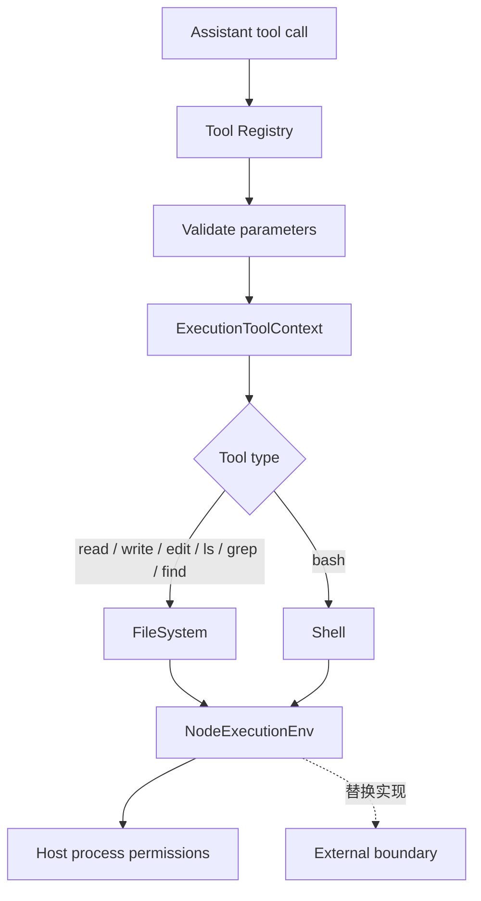
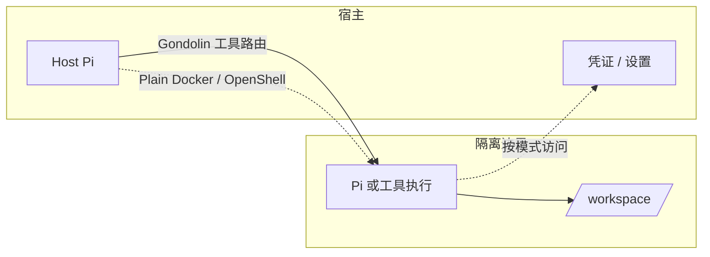

# Pi 工具与容器化

## 一句话结论

Pi 没有内置沙箱。`ExecutionEnv` 是工具访问文件系统和 Shell 的统一入口；默认实现 `NodeExecutionEnv` 直接使用宿主权限。真正的隔离来自外部边界：把整个 Pi 进程放进 Docker 或 OpenShell，或者用 Gondolin 扩展把内置工具和 `!` 命令路由进本地微虚拟机。

## 定位与核心类型

`ExecutionEnv` 由两组能力组成。`FileSystem` 提供路径解析和文件读写能力；`Shell` 提供命令执行和清理能力。工具不直接调用 Node API，而是接收这个环境对象，因此宿主可以替换执行位置。

| 符号 | 职责 | 容器化意义 |
| --- | --- | --- |
| `ExecutionEnv` | 组合 `FileSystem` 和 `Shell`。 | 工具的统一执行边界。 |
| `NodeExecutionEnv` | 默认 Node.js 实现。 | 在 Pi 进程权限内访问宿主。 |
| `ExecutionToolContext` | 携带 `env`，供工具读取。 | 决定工具调用的实际作用域。 |
| `AgentHarnessTool` | 定义参数、执行体和可选 prompt 贡献。 | 可被扩展注册或覆盖。 |

server 装配用 `createCodingAgentHarness` 组装默认工具。调用方显式传入 `ExecutionEnv`；装配器会把 coding-agent 工具适配成 Harness 工具，Bash 工具还能在准备阶段注入会话 ID 和会话文件环境变量。官方安全文档把内置工具和扩展描述为 Pi 进程权限内的普通本地操作；CLI 的具体默认环境装配保留给统一审查。

## 工具链路

### 内置工具

Pi 的内置工具覆盖读取、写入、编辑、列目录、搜索和 Shell。文件修改工具会经过修改队列，避免同一执行环境内的写入互相踩踏。Bash 工具把命令交给 `Shell.exec`，支持超时和取消；输出按行数和字节数截断，超限内容保存到临时文件。

### 扩展点

扩展 API 暴露 `registerTool`、`registerCommand` 和其他宿主能力。扩展可以注册新工具，示例扩展也可以用虚拟机文件系统和命令实现替换内置工具。这个设计让“工具在哪里执行”成为宿主装配问题，而不要求每个工具自己实现沙箱。

## 状态持久化

执行环境本身不保存会话状态。工具结果先进入 Agent 消息流，稳定消息再由会话层写入树状 JSONL。Bash 的完整输出临时文件属于工作副产物；它是否进入长期会话、清理时机和跨宿主恢复语义保留给统一审查。

## 容器化模式

Pi 文档给出三种模式。它们隔离的范围不同，凭证风险也不同。

| 模式 | 隔离对象 | 优点 | 代价 |
| --- | --- | --- | --- |
| Gondolin 扩展 | 内置工具和 `!` 命令 | 认证留在宿主；工作目录写回宿主。 | 需要 Gondolin、QEMU 和 Node.js 版本要求；自定义工具仍可能在宿主执行。 |
| Plain Docker | 整个 Pi 进程 | 配置简单；适合本地隔离。 | API key 进入容器；读写挂载仍会修改宿主文件。 |
| OpenShell | 整个 Pi 进程 | 支持本地或远端策略沙箱；可控制文件、进程、网络、凭证和推理。 | 需要 gateway；远端不自动 bind mount，文件要克隆或上传。 |

### Gondolin：工具路由

Gondolin 是本地 Linux 微虚拟机。示例扩展把宿主工作目录挂到 `/workspace`，并覆盖 `read`、`write`、`edit`、`bash`、`grep`、`find` 和 `ls`。用户 `!` 命令也进入虚拟机；`/workspace` 下的文件改动写回宿主，其他虚拟机文件保持隔离。

### Plain Docker：整进程容器

Plain Docker 用容器包住整个 Pi 进程。当前目录可以挂载到 `/workspace`，Agent 配置适合放在容器本地卷。这个模式最容易启动，但边界强度取决于挂载、网络和凭证配置。读写 bind mount 只是移动执行位置，不会阻止容器内改动宿主文件。

### OpenShell：策略化沙箱

OpenShell 通过 gateway 管理 sandbox，后端可以是 Docker、Podman、虚拟机或远端 Kubernetes。它把整个 Pi 进程放进边界内，因此内置工具、`!` 命令和扩展工具都在沙箱中执行。配置推理路由后，原始 provider API key 可以留在沙箱外。

## 安全边界

项目信任只是资源加载闸门。它决定是否加载项目设置、扩展、技能、提示和主题；不限制已加载工具后续能做什么。Pi 官方文档明确说明没有内置沙箱：内置工具和扩展都使用 Pi 进程权限。要隔离不可信任务，必须使用操作系统、容器、虚拟机或远端沙箱，并只暴露必要文件、网络和凭证。

## 设计取舍

- **优点**：`ExecutionEnv` 保持工具与宿主解耦；扩展可以替换执行位置；三种容器化模式覆盖从本地微虚拟机到远端策略沙箱的需求。
- **代价**：安全默认是宿主权限；隔离配置由用户负责。工具路由模式只覆盖被替换的工具，其他自定义扩展工具仍可能留在宿主。
- **适用判断**：本地可信项目可以直接使用宿主执行环境。不可信仓库、无人值守任务或敏感凭证场景应优先选择整进程沙箱，或用 Gondolin 路由内置工具并审查自定义工具。

## 自检问题

1. 为什么 `ExecutionEnv` 不能等同于安全边界？
2. Gondolin、Plain Docker 和 OpenShell 分别隔离哪些执行面？
3. 项目信任通过后，Pi 获得了哪些额外权限？
4. 读写挂载 `/workspace` 为什么仍可能破坏宿主文件？

## 相关页面

- [教材目录](../../TOC.md)
- [Pi 架构总览](./overview.md)
- [Pi Run 生命周期](./run-lifecycle.md)
- [Sandbox 与权限](../../02-harness-mechanics/sandbox.md)
- [术语表](../../09-glossary/glossary.md)
