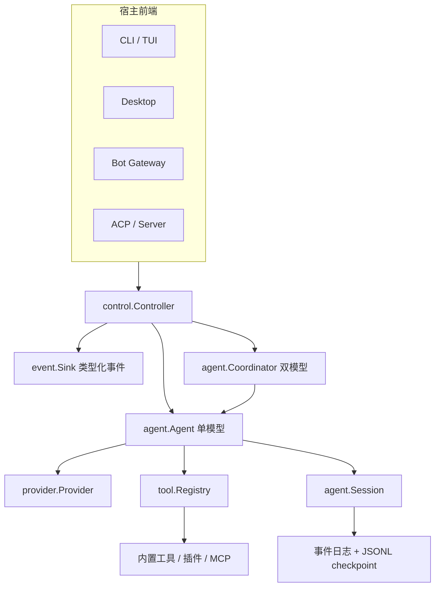
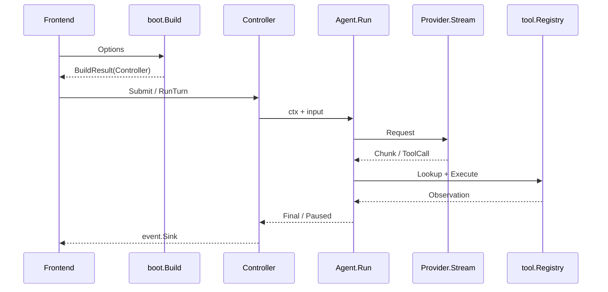

# Reasonix 架构总览

## 一句话结论

Reasonix 用 `boot.BuildRuntime` 做启动装配，用 `control.Controller` 统一驱动多个前端，再用 `agent.Agent` 承接模型 Provider、工具 Registry 和 Session。它把回合生命周期、审批、取消、持久化和事件输出收敛到与 UI 无关的控制面，使 CLI/TUI、桌面、Bot 和 ACP 复用同一套编排逻辑。

## 定位与部署形态

Reasonix 是一个本地优先的编码智能体线束（Harness）。快照中可以看到四类宿主装配：

- **CLI/TUI**：`internal/cli` 提供终端交互和命令目录，适合开发者本机使用。
- **桌面**：`desktop` 通过 `tab_controller_boot.go` 调 `boot.Build`，再由应用层管理标签页、设置和重建。
- **Bot**：`internal/bot` 支持飞书、钉钉、QQ、微信等入口，通过 gateway 创建或重建 Controller。
- **ACP / 服务化接口**：`internal/acp` 与 HTTP/SSE 相关代码把同一个控制面暴露给编辑器协议或远端前端。

这些前端不重新实现 Run 循环，只提交输入、消费类型化事件并调用 Cancel 或 Approve。核心引擎本地运行；插件和部分扩展由 Runtime Owner 管理子进程生命周期。

## 架构分层

分层职责如下：

| 层 | 关键符号 | 职责 |
| --- | --- | --- |
| 启动装配 | `internal/boot/runtime.go` 的 `BuildRuntime`、`Build` | 加载配置、解析模型、装配工具、技能、Hook、MCP、Provider 和系统提示 |
| 控制面 | `internal/control/controller.go` 的 `Controller` | 接收 Send、Cancel、Approve、NewSession 等命令，管理回合、审批、租约和重建 |
| 执行核 | `internal/agent/agent.go` 的 `Agent` | 驱动多步循环、流式推理、工具分支、预算、Steering 和恢复 |
| 协作编排 | `internal/agent/coordinator.go` 的 `Coordinator` | 在配置 Planner 时协调双模型工作流 |
| 会话状态 | `internal/agent/session.go` 的 `Session` | 持有消息历史、版本、修复标记和持久化状态 |
| 工具面 | `internal/tool/tool.go` 的 `Registry` | 注册、查找、限制可见 Schema 并执行内置与扩展工具 |

## 核心类型

| 类型 | 定义锚点 | 为什么存在 |
| --- | --- | --- |
| `BuildResult` | `internal/boot/runtime.go:96` | 同时返回 Controller、Runtime 资源和 Owner，避免前端只关闭 Controller 而泄漏插件子进程。 |
| `Controller` | `internal/control/controller.go:70` 附近 | 拥有 Agent、事件 Sink、权限策略、预算、Guardian、技能和 Hook；是所有前端的统一控制点。 |
| `Agent` | `internal/agent/agent.go:282` | 聚合配置、服务协作对象、会话运行态、任务状态、计划合同和 Steering 队列，执行一次任务的循环。 |
| `Coordinator` | `internal/agent/coordinator.go:322` | 当启用 Planner 模型时提供双模型协作入口，复用底层 Agent 能力。 |
| `Session` | `internal/agent/session.go:19` | 保存带锁的 `Messages`、版本、rewrite 版本、持久化进度、损坏标记和原始消息备份。 |
| `Registry` | `internal/tool/tool.go:282` | 每个 Run 一份工具集合；区分注册可执行工具与 Provider 可见 Schema，支持挂起和 schema revision。 |
| `Provider` | `internal/provider/provider.go:953` | 抽象流式模型后端；取消 context 必须中断请求，关闭 channel 表示完成。 |

## 调用链

以一次用户输入为例：

1. **启动**：前端调用 `boot.Build(ctx, opts)`；该函数先进入 `BuildRuntime`，装配 Provider、`tool.Registry`、skills、commands、hooks、MCP specs 和系统提示，然后返回包着 Controller 的 `BuildResult`。`Build` 把 Runtime 资源链入 Controller 清理流程。
2. **输入**：前端调用 `Controller.Send`、`Submit` 或 `RunTurn`。Controller 先做当前代次、前台回合互斥和权限上下文检查。
3. **运行**：Controller 调 `Agent.Run(ctx, input)`；Agent 组装 Context 和工具声明，调用 `Provider.Stream`，累积文本、reasoning 和 tool call。
4. **分支**：没有工具则进入最终答案校验；有工具则经 Registry 查找、门控和执行，把结果写回 Session 后再次请求模型。若启用 Planner，`Coordinator.Run` 可以在进入执行 Agent 前组织规划。
5. **观察**：全过程通过 `event.Sink` 发布类型化事件；前端渲染增量、工具卡片、审批请求和 Turn 结束状态。
6. **退出**：成功、取消、错误或暂停都会经过 Controller 的清理与持久化路径；插件子进程由 Runtime Owner 统一释放。

## 状态与持久化

Reasonix 以 Session 为中心维护对话权威历史。Run 循环写入 `Session.Messages`；跨 goroutine 读取走锁保护。版本号和 rewrite 版本区分普通追加、压缩重写和已落盘进度。加载时可修复空工具名、悬空调用和截断参数，并在下一次保存中固化结果。

快照还显示它同时处理事件日志和 JSONL checkpoint：事件日志损坏时可回放有效前缀，checkpoint 作为兼容兜底；每用户回合创建 checkpoint，sidecar 记录可恢复事实。字段级事务边界、文件命名和迁移规则保留给批量 Implementation Review。

## 工具链路

工具分三层：

1. **注册**：内置工具通过 `RegisterBuiltin` 进入全局 builtins；每个 Run 再构造独立 `Registry`，合并启用的内置工具和插件/MCP 工具。
2. **可见性**：`SetProviderVisibleTools` 允许某些能力不出现在 Provider Schema 中但仍可通过内部 capability dispatch 执行，这把“模型可见”和“系统可执行”分开。
3. **执行**：Agent 收到 tool call 后查 Registry，经门控、权限和沙箱策略后执行；结果规范化后回填历史。具体审批器、沙箱参数和错误包装属于 F-R3。

## 扩展点

| 扩展点 | 入口 | 说明 |
| --- | --- | --- |
| 模型 | `provider.Provider` 及可选策略接口 | 替换模型后端；协议差异通过可选 reasoning/output budget policy 表达。 |
| 工具 | `tool.RegisterBuiltin`、per-run `Registry` | 内置工具编译期注册，插件和 MCP 进入 Run 级集合。 |
| Hook | `hook.Runner` 与 Boot 装配 | 在生命周期节点注入项目规则或自动化动作。 |
| Skill / Command | `skill.Set`、`command.Command` | 组织可复用指令和用户显式操作。 |
| MCP 与 Sidecar | `plugin.Spec`、extension dispatch | 外部能力以受管子进程接入。 |
| 事件与 UI | `event.Sink`、extension uihub | 前端和扩展消费类型化事件或注册界面 surface。 |

## 设计取舍

- **优点**：控制面集中，前端不需要重复实现回合、取消和审批；Provider、工具和 Session 边界清晰，便于替换模型和能力；Session 兼顾追加日志、压缩和崩溃修复。
- **代价**：Controller 聚合大量职责，启动装配复杂；单模型与双模型路径并存增加阅读成本；本地文件持久化和插件子进程管理要求宿主环境可靠。
- **适用判断**：需要强控制、丰富本地工具和统一多端体验时，这种“厚控制面 + 薄前端”结构很合适；如果目标是极简嵌入式运行时或强多租户服务，应评估裁剪 Controller 职责或外置存储与队列。

## 自检问题

1. `BuildRuntime` 和 `Build` 的职责差异是什么？为什么前端不应绕过 Runtime Owner？
2. `providerVisible` 为什么允许工具注册但不对模型展示？
3. Session 中 `version`、`rewriteVersion` 和 `persistedRewriteVersion` 分别解决什么问题？
4. 如果要把 Reasonix 移到多租户服务，哪些职责必须留在本地宿主之外？

## 相关页面

- [教材目录](../../TOC.md)
- [一次 Agent Run 的完整生命周期](../../01-core-concepts/agent-run-lifecycle.md)
- [Sandbox 与权限](../../02-harness-mechanics/sandbox.md)
- [术语表](../../09-glossary/glossary.md)
