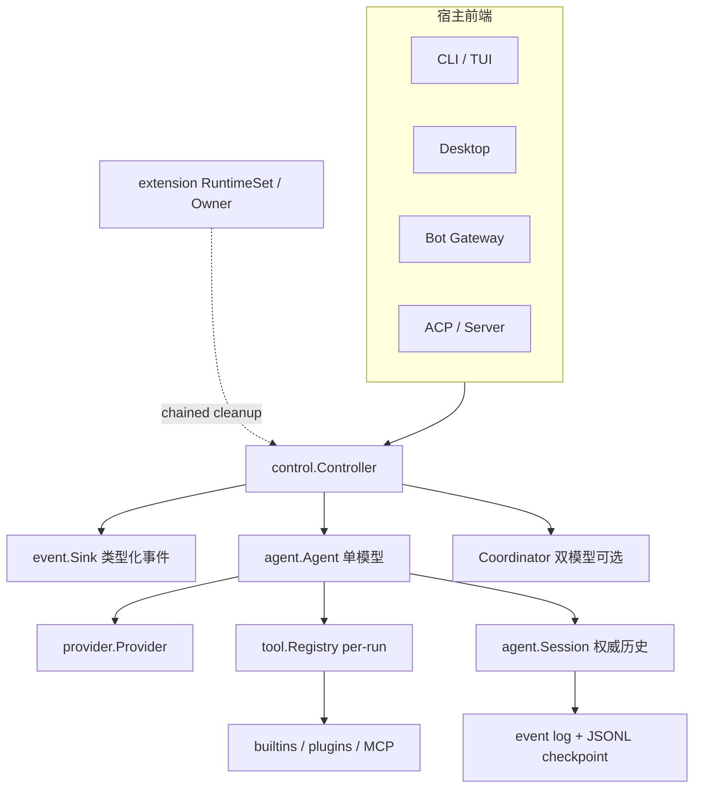
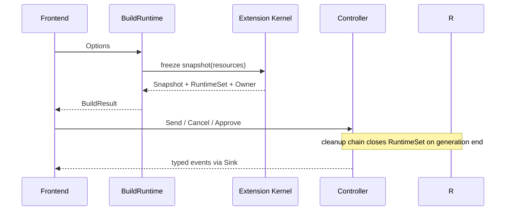

# Reasonix 架构总览

## 一句话结论

Reasonix 的架构核心是“厚控制面 + 薄前端 + 明确生命周期”：`boot.BuildRuntime` 装配 Provider、工具、技能、Hook、MCP 和扩展内核；`BuildResult` 把 `Controller` 与 `RuntimeSet`/`Owner` 绑定在同一代次，保证扩展子进程随控制器生灭；`control.Controller` 是所有前端的唯一命令入口；`agent.Agent` 驱动单任务循环，`tool.Registry` 与 `agent.Session` 提供能力面和权威历史。

## 上一章遗留问题

M-16 完成了机制层的注入防护。F-R1 要回答：这些机制在 Reasonix 里由谁持有？启动时如何避免插件泄漏？多端如何复用同一套回合逻辑？

## 本章解决什么矛盾

CLI/TUI、桌面、Bot 和 ACP 都需要相同的回合语义、审批、取消和持久化；但它们的生命周期不同——桌面会重建标签页，Bot 会并发会话，ACP 会远端接入。Reasonix 的解法是把“运行时资源”从“控制器”中显式拆出又绑在一起：`BuildResult.Runtime` 持有 sidecar Manager，其 Close 被 chained into the controller's cleanup。

直觉上这是“酒店房卡 + 行李托管”。精确机制是 runtime generation 计数器配对 CloseIfGeneration，使 stale cleanup 永远关不掉新一代资源。失效边界是：如果前端只拿 `Build` 返回的 Controller 而绕过 BuildResult，就必须依赖 cleanup chain 正确；直接管理子进程会破坏该假设。

## 架构分层

| 层 | 关键符号 | 职责 |
| --- | --- | --- |
| 启动装配 | `boot.BuildRuntime` / `Build` | 加载配置、解析模型、装配工具/技能/Hook/MCP/Provider/系统提示 |
| 扩展内核 | `extension.RuntimeSnapshot` / `RuntimeSet` / `RuntimeOwner` | 冻结本代次资源清单；管理 sidecar 生命周期 |
| 控制面 | `control.Controller` | Send/Cancel/Approve/NewSession 等命令；回合互斥、审批、预算、重建 |
| 执行核 | `agent.Agent` | 流式推理、工具分支、Steering、恢复、预算 |
| 会话状态 | `agent.Session` | 锁保护的消息历史、版本/重写版本、写权限与修复标记 |
| 工具面 | `tool.Registry` | 注册、解析、可见性裁剪与执行入口 |

## 启动装配与生命周期

`BuildRuntime` 注释定义了它的两个产物：controller 和 extension kernel's frozen snapshot of the exact resources the build wired。快照从 build 自己产出的 in-hand objects 组装，never re-derives anything；assembly error 只降级为 nil Snapshot 加 warning，不让成功构建失败（`external/DeepSeek-Reasonix/internal/boot/runtime.go:88-98`）。

`Build` 是兼容包装：frontends keep their existing signature；返回前不关闭 runtime set，而是 chained into the controller's cleanup，让 extension sidecars live exactly as long as their controller（`external/DeepSeek-Reasonix/internal/boot/runtime.go:100-115`）。

`BuildResult` 则是完整的生命周期包：

- `Controller`：控制面；
- `Snapshot`：本代次冻结资源清单；
- `Runtime`：closable set，持 sidecar Manager，Close chained into controller cleanup；
- `Owner`：session-lineage lifecycle owner，独立构建独立 owner，RebuildFrom 复用旧 owner 使只有该 lineage 的旧代次 drain；
- `Dispatcher`/`ExtensionUI`：冻结拦截链与 UI hub，经 SetExtensions/SetExtensionUI 绑回 controller（`external/DeepSeek-Reasonix/internal/boot/runtime.go:25-53`）。

进程级保障是 `runtimeGeneration`：The first build gets generation 1 so 0 can mean "no snapshot"；generations pair with RuntimeSet.CloseIfGeneration so stale cleanup can never close a newer runtime's resources（`external/DeepSeek-Reasonix/internal/boot/runtime.go:78-86`）。这回答了“桌面重建标签页”场景：旧代次的清理不会误杀新代次。

## 控制面：Controller

`Controller` 的注释自述职责：drives one chat session. Construct with New; drive with the command methods; observe through the Sink passed in Options（`external/DeepSeek-Reasonix/internal/control/controller.go:93-95`）。关键字段揭示了它聚合的横切能力：

- `runner`/`executor`：执行核（单模型或双模型路径）；
- `recoveryGate`：共享 Auto Guard 状态；
- `taskBudget`/`goalTokenBudget`/`evaluator`：花费上限与无人值守 Goal 的失败关闭评估；
- `sink`/`policy`/`subagentGate`：事件输出、权限策略、headless 子代理共享门；
- `skills`/`hooks`/`memory`：技能集、生命周期 Hook、带独立锁的记忆管理器（memory-panel save 不阻塞 approval/status poll）；
- 回合互斥与轮换错误：`ErrTurnRunning`、rotation gate 的 turn-in-flight/rotation-in-progress 双拒绝（`external/DeepSeek-Reasonix/internal/control/controller.go:66-95,104-146`）。

这些字段解释了为什么前端薄：Send、Submit、Cancel、Approve、NewSession 都是控制面命令；前端不实现回合循环，也不直接操作 Session。

## 执行核：Agent

`Agent` 的注释把它定位为 drives a single task: a Provider, a tool Registry, and a Session wired into the main loop（`external/DeepSeek-Reasonix/internal/agent/agent.go:280-288`）。结构上的几个设计点值得注意：

1. **planMode 是协作开关不是安全边界**：注释强调 It does not replace the permission or sandbox boundary，且切换时不改 system prompt/tool list，以保住 provider-cache prefix（`:300-303`）。
2. **readOnlyExecution 是构造期防御**： Unlike planMode it is not a collaboration toggle，planner/research agent 全生命周期保持，并在 proxy resolve 后复查（`:305-308`）。
3. **mutationDependencyBarrier**：记录本批次第一个失败/被阻的 durable-state write；executeOne 在 proxy 解析后复查，防止 use_capability 用 schema-level ReadOnly 绕过屏障；cause 对象 immutable 且不含 args/paths（`:310-315`）。
4. **unwrittenResolve 存放在 Agent 而非 sessionRuntime**：failed state write 欠下的 resolve watermark 要 outlive conversation（`:296-298`）。

这些字段把第二章的机制（plan/read-only 区分、mutation barrier、状态欠账）落到了结构归属上。

## Provider 抽象

`Provider` 接口刻意极小：Name + Stream(ctx, Request) (<-chan Chunk, error)。契约写在注释里：Cancelling ctx must abort the underlying request; a closed channel marks the end of the completion（`external/DeepSeek-Reasonix/internal/provider/provider.go:952-960`）。

协议差异通过可选接口表达，例如 `ToolCallReasoningPolicy`：针对 DeepSeek thinking 这类会在 tool_calls 回合 replay reasoning_content 的后端，Agent 用它归档原始 reasoning 文本并检测缺失轮次（`:962-975`）。大多数 provider 保持 unset，callers must treat it as false——这是“小接口 + 能力探测”的典型 Go 风格。

## 会话状态与写权限

`Session` 是权威对话历史，锁策略写在注释里：run-loop goroutine is the only writer，但 frontend 可从另一 goroutine 读 History/Save，因此 mu guards Messages；run-loop 内的直接读保持 lock-free，跨 goroutine 走 Snapshot（`external/DeepSeek-Reasonix/internal/agent/session.go:15-21`）。

版本三件套各司其职：

- `version uint64`：普通追加水位；
- `rewriteVersion int`：每次 log rewritten (compact/fold) 时递增；
- `persistedRewriteVersion`：highest rewriteVersion whose transcript has fully reached disk，且存于 Session 而非 controller——swapping session objects can never orphan or misattribute the baseline；save 时在 s.mu 下捕获 rewriteVersion 与 message snapshot，compaction landing mid-save stays unpersisted（`:22-31`）。

损坏与修复字段同样显式：`normalizedDirty` 表示 LoadSession 已修复 empty tool-call names/dangling calls/truncated args，下一次 Save 自动固化；`eventLogDamaged` 表示 event log torn/corrupt，已取回 replayable prefix 或 .jsonl checkpoint，next save heals with rewrite-and-compact；`rawMessages` 保留修复前转录供 checkpoint 比对（`:33-48`）。

写权限则升级为对象：`writeAuth *SessionWriteAuthority` 由 Controller 在获得 SessionLease 后绑定，save/ownership paths consult it instead of a process-level boolean；一旦 bind 过 authority，saves fail closed without a live authority，避免 stale controller fork recovery；`recoveryLane` 保证 replacement controller 不能覆盖同一 recovery file（`:62-77`）。这与 M-10 的 CAS/save-verified baseline 共同构成持久化安全网。

## 工具面

`Registry` 是 per-run set：enabled built-ins plus plugin tools；Agent 只见 Registry，不见全局 builtins（`external/DeepSeek-Reasonix/internal/tool/tool.go:1-4,281-295`）。两个关键分离：

1. **provider-visible vs executable**：`SetProviderVisibleTools` 只限制 Schemas 导出，Get/Execute 仍可达全部注册工具，供 use_capability dispatch（`:287-330`）；
2. **stable schema order**：`Schemas()` 按 name order 导出可见工具，稳定顺序保护 prompt cache（`:609-635`）。

执行侧的 parse→policy→prepare→finish、mutation barrier 和取消填充已在 F-R2/M-04 核对；本章只需确认入口收敛于 Registry。

## 扩展点总表

| 扩展点 | 入口 | 说明 |
| --- | --- | --- |
| 模型 | `provider.Provider` + 可选 policy 接口 | 小接口 + 能力探测表达协议差异 |
| 工具 | `tool.RegisterBuiltin` + per-run Registry | 编译期内置与运行期插件/MCP 分层 |
| Hook | `hook.Runner`（Boot 装配） | 生命周期节点注入规则/自动化 |
| Skill/Command | `skill.Set`/`command.Command` | 可复用指令与显式用户操作 |
| MCP/Sidecar | `plugin.Spec`、sidecar Manager | 受管子进程，生命周期归 RuntimeSet |
| 事件/UI | `event.Sink`、uihub.Hub | 前端消费类型化事件，扩展注册 UI surface |

## 设计取舍

| 决策 | 收益 | 代价 | 成立条件 |
| --- | --- | --- | --- |
| BuildRuntime/Build 分层 | 新代码拿完整生命周期包，老前端兼容 | 两条 API 并存 | 文档引导新前端用 BuildResult |
| generation 配对清理 | 重建不误杀新资源 | 需要全局计数与 CloseIfGeneration | 单进程多代次场景 |
| Controller 聚合横切能力 | 前端极薄、行为一致 | 类型体量大，职责多 | 有清晰命令方法分组 |
| planMode 与 readOnlyExecution 分离 | 协作态与安全态解耦 | 两套开关需文档 | 安全边界永不随协作态放宽 |
| Session 版本三件套 + writeAuth | 追加/重写/持久化/所有权全覆盖 | 字段多、心智负担高 | 长会话与崩溃恢复需求强 |
| provider-visible/executable 分离 | cache 稳定 + capability dispatch | execute 前需 contextual gate | 有 use_capability 类内部派发 |

迁移启示：如果你的 Harness 目前只有一个“上帝对象”，可以按此样本渐进拆分——先抽 Boot 装配与资源 Owner，再抽控制面命令，最后给 Session 补版本与写权对象。不要先动 Run 循环，它是回归风险最高的部分。

## 反例与故障模式

1. **前端只 Close Controller**
   - 触发：使用 `Build` 后自行管理插件进程。
   - 因果：sidecar 泄漏或在错误时机被杀。
   - 正确边界：用 `BuildResult`，或信任 cleanup chain 不重复管理。
2. **stale cleanup 关闭新 runtime**
   - 触发：重建标签页时旧代次异步清理晚到。
   - 因果：新会话的 sidecar 被误杀。
   - 正确边界：generation + CloseIfGeneration 配对。
3. **planMode 被当安全边界**
   - 触发：以为打开 Plan 就禁写了。
   - 因果：越权写入仍可能发生。
   - 正确边界：readOnlyExecution/permission/sandbox 才是强制层。
4. **跨 goroutine 直读 Messages**
   - 触发：前端直接遍历 Session.Messages。
   - 因果：数据竞争。
   - 正确边界：Snapshot()。
5. **替换 Session 后复用旧持久化基线**
   - 触发：controller swap 后沿用 persistedRewriteVersion。
   - 因果：baseline 归属错乱，保存冲突。
   - 正确边界：版本存于 Session 本体，swap 即随行。
6. **无 authority 仍尝试 save**
   - 触发：stale controller 在租约丢失后写盘。
   - 因果：fork recovery 或覆盖新 owner。
   - 正确边界：authRequired fail closed。

## 一条完整因果链

桌面用户新建一个标签页再快速关闭：

1. Tab 创建调用 `Build` → `BuildRuntime`，拿到 generation=N 的 BuildResult；sidecar Manager 挂入 RuntimeSet。
2. 用户提交输入，Controller 校验无活动回合后进入 Agent.Run；事件通过 Sink 渲染。
3. 用户关闭标签页。前端调用 Controller 清理路径；cleanup chain 关闭 RuntimeSet，sidecar 进程随之退出。
4. 若另一标签页几乎同时重建（generation=N+1），旧代次的延迟清理触发 CloseIfGeneration(N)——因当前代次更高而成为 no-op，新标签页的 sidecar 不受影响。
5. 若该会话曾启用 SessionLease，则新标签页绑定了新的 writeAuth；旧 controller 即使因竞态残留，save 也 fail closed 而不是覆盖新会话文件。

这条链展示了架构不变量如何在“创建—运行—销毁—重建”全周期中生效。

## 自检与面试追问

1. 如果你要为 Reasonix 增加第四类前端（IDE 插件），应消费哪些 API？绝不应触碰哪些内部字段？
2. generation 机制能防止哪些竞态？不能防止哪些（例如磁盘上两个 owner）？后者由什么兜底？
3. 为什么 readOnlyExecution 必须构造期决定而 planMode 可以原子切换？
4. `persistedRewriteVersion` 为什么不能放到 controller？举一个 swap 导致 baseline 错乱的序列。
5. provider-visible/executable 分离在什么需求下出现？如果没有 use_capability，这个设计的成本是否还值得？
6. 对照你自己的 Harness：Boot、Control、Agent 三层中哪一层最薄？缺什么会导致前端重复造轮子？

## 交给下一章的问题

本章给出组件地图与生命周期。F-R2《Reasonix Run 生命周期》已在基准阶段按 v0.3 重写，将沿 `Agent.Run → runToolLoop` 深挖采样冻结、宽限轮与暂停类型；随后 F-R3 进入工具与审批细节。

## 相关页面

- [教材目录](../../TOC.md)
- [一次 Agent Run 的完整生命周期](../../01-core-concepts/agent-run-lifecycle.md)
- [Reasonix Run 生命周期](./run-lifecycle.md)
- [Reasonix 工具与审批](./tools-approval.md)
- [术语表](../../09-glossary/glossary.md)
