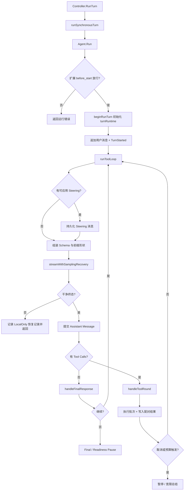

# Reasonix Run 生命周期

## 一句话结论

Reasonix 的用户回合由 `control.Controller` 启动，由 `agent.Agent.Run` 驱动，再进入 `runToolLoop` 反复执行“流式采样 → 提交助手消息 → 最终答案或工具批处理”。关键规则是：失败的流式尝试不写 Session；只有干净终态才提交助手消息并执行工具；预算耗尽先给一轮总结宽限，不丢掉已完成工作。

## 定位与边界

Reasonix 把“一次用户回合”和“一次模型请求”分开：

- **Controller 回合**：前端调用 `Controller.RunTurn(ctx, input)`，进入 `runSynchronousTurn` 和内部 `runTurn` 编排。Controller 管理前台互斥、事件输出、审批、取消和 Goal 循环。
- **Agent Run**：`Agent.Run(ctx, input)` 追加用户消息，初始化 `turnRuntime`，然后进入工具循环。注释明确说明 `maxSteps <= 0` 时 Agent 内部不设回合数上限，限制由宿主决定。
- **模型请求 / Step**：每个循环迭代是一次流式采样请求。它可能产生文本、reasoning、多个 tool call 或最终答案；只有成功终止后才成为 Session 历史。

## 生命周期图

## 核心类型与状态

| 类型 / 字段组 | 锚点 | 作用 |
| --- | --- | --- |
| `Agent.Run` | `internal/agent/agent.go:1239` | 增加运行序号、开始 Workspace Lease、清理 Steering 状态，并在成功交付后提交后台任务证据租约。 |
| `turnRuntime` | `internal/agent/run_loop.go:125` 的 `beginRunTurn` | 每个新用户回合清零；保存约束、交付范围、证据检查点、预算计时、宽限标记和进度追踪状态。 |
| `taskRuntime` | Agent 任务状态 | 承接跨回合任务预算、证据账本、scope 和失败预算；不随单个 Turn 清零。 |
| `Session.Messages` | `internal/agent/session.go:19` | 权威对话历史；Run 循环是唯一写入者，前端读取走锁保护。 |
| `streamedTurn` | `streamWithSamplingRecovery` 返回值 | 聚合文本、reasoning、签名、tool calls、usage 和 partial calls。 |
| `ReadinessResult` | `internal/agent/agent.go` 后续定义 | 向宿主暴露最终就绪检查：是否 Ready、缺失类别、原因和 ProgressKey。 |

## 阶段拆解

### 1. 回合准备

`beginRunTurn` 先重置本回合状态，再处理四类事实：交付范围与证据账本、从上下文或输入解析出的约束、Plan/只读继承约束，以及上一次中断留下的恢复记录。随后发布 `TurnStarted`，把用户消息写入 Session。子 Agent 可通过可信通道提供分类用任务文本，避免宿主框架语言被误判成变更意图。

### 2. 流式采样

每轮先取走队列中的 Steering（中途引导），把它作为带前缀的用户指导写进 Session，同时发出 `Steer` 事件；加载失败则保留 durable entry 并标记未应用。接着捕获工具 Schema 和前缀形状，供缓存诊断使用。

`streamWithSamplingRecovery` 冻结一次请求后进行有限次 body 重试。失败尝试不修改 Session，也不执行工具；只有干净终态才进入提交边界。成功后，Agent 记录 usage 和缓存形状，并把助手文本、reasoning、签名、tool calls 和耗时作为完整消息加入历史。

### 3. 最终答案分支

没有 tool call 时进入 `handleFinalResponse`。该阶段不只是返回文本：

- **可见性检查**：空最终答案通常触发有限重试；某些 thinking 协议在 reasoning 已承载实质内容且显式停止时可直接接受。
- **就绪检查**：读取项目检查、待办、验收、审查、签署、动作证据等缺失项。自动续跑或闭环场景可能产生 `FinalReadinessError`，并持久化恢复标记。
- **预算宽限**：`graceRound` 表示已达显式步数或花费边界；如果这一轮仍无有效总结，则转入 `gracePause`，让用户发送下一条消息继续。
- **Auto Recovery 宽限**：重试预算耗尽时给出一轮 summarize-only 机会；继续调用工具会转为 `RecoveryPauseError`。

### 4. 工具分支

`handleToolRound` 先拦截不该执行的边界调用，再执行整批 calls。执行结果逐个转成 `RoleTool` 消息：`Content` 是稳定且有界的 Provider 形式，原始大输出保存在本地 `RawContent`，只在显式分页时进入模型上下文。

如果工具执行期间 context 被取消，函数在写入本批结果后才返回错误，保证 assistant tool call 和 tool result 保持配对。之后处理待办停滞、恢复宽限、任务预算和最大步数；预算耗尽不是立刻失败，而是布置一轮 finalization round，要求总结已完成、未完成和下一步。

### 5. 终止与恢复

| 结果 | 典型信号 | 处理 |
| --- | --- | --- |
| 成功 | 最终答案通过可见性和就绪检查。 | Controller 收到正常结束，后台证据租约可提交。 |
| 就绪暂停 | 缺少验证、签署、动作证据或项目检查。 | 记录缺失类别和恢复标记，等待明确续跑。 |
| 预算暂停 | 显式 `max_steps` 或任务花费触顶。 | 已有工作留在 Session，给一轮总结宽限或返回可续跑暂停。 |
| 取消 / 中断 | context 取消、Provider 断流或重试耗尽。 | 尽力保存稳定前缀、估算 usage，并写入下一条真实用户消息可消费的恢复记录。 |
| 恢复暂停 | Auto Recovery 达到 Episode 上限。 | 保留已完成工作，提示用户继续或改变方向。 |

## 工具链路与扩展点

Run 循环通过 `a.svc.tools.Schemas()` 获取当前可见工具面，通过 `executeBatch` 进入统一执行链。工具执行前后可以受 Workspace Lease、父级写入预留、权限策略、沙箱和 Hook 影响。扩展可在 `before_start` 阻止回合启动；Steering、Hook、Skill Sub-agent 和 Planner/Executor 分工都挂接在同一回合边界上。

字段级并发顺序、审批器调用点和错误包装属于 F-R3 和批量 Implementation Review 的范围；本章只断言循环层已经把“提交采样”和“执行副作用”分离。

## 设计取舍

- **优点**：失败采样不污染历史，取消后仍保持调用/结果配对；预算暂停保留工作成果；Steering 有 durable 入口，适合长回合中纠正方向。
- **代价**：`turnRuntime`、恢复记录和宽限轮逻辑较多，理解成本高；Agent 内部不强制步数上限，宿主必须正确配置预算；双模型 Coordinator 会增加另一层编排。
- **适用判断**：这种设计适合需要长任务、强审计和可恢复编码工作流的线束。若产品只需要短问答，复杂的 readiness、recovery 和 evidence 机制可能过度。

## 自检问题

1. 为什么失败流式尝试不能直接追加到 Session？
2. 用户在模型流式输出中途 Steering 时，Reasonix 如何避免它变成新任务？
3. 任务预算触顶后，为什么还要给一轮 finalization round？
4. 工具批次执行中被取消时，哪些消息必须已经落盘？

## 相关页面

- [教材目录](../../TOC.md)
- [Reasonix 架构总览](./overview.md)
- [一次 Agent Run 的完整生命周期](../../01-core-concepts/agent-run-lifecycle.md)
- [术语表](../../09-glossary/glossary.md)
