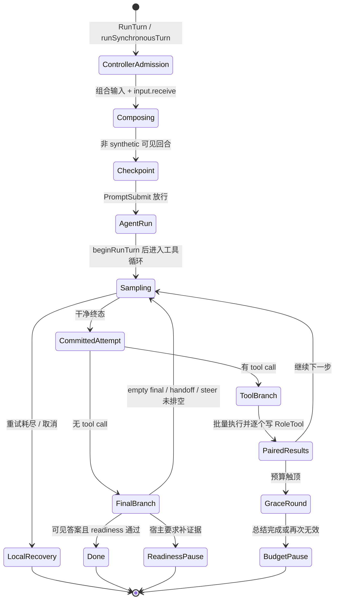
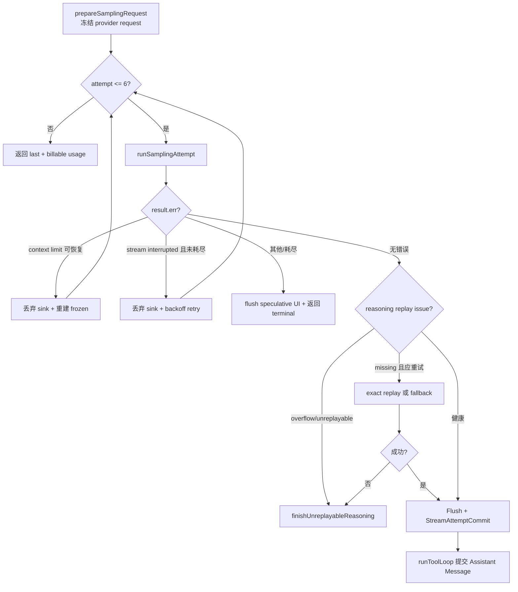

## 一句话结论

Reasonix 把一次前台用户回合拆成三层：`Controller` 负责输入组合、checkpoint、hook 和计划门；`Agent.Run` 负责回合状态与工具循环；每个模型轮次先在冻结请求上做有限重试，只有干净终态才写入 Session 并允许执行工具。失败、取消和预算耗尽都不等于清空现场，而是留下配对结果或本地恢复记录，并把“继续”的入口交还宿主。

## 上一章遗留问题

C-04 说明 `text_delta` 和 UI 事件不能自动成为事实。Reasonix 是这个原则的具体样本：provider 流可能中断，thinking 协议可能缺少 replay 所需 reasoning，工具批次可能在执行中被取消。本章回答：Reasonix 在哪个点把一次采样变成 durable assistant message？取消时哪些内容保留为 local-only？预算暂停为什么不是错误？

## 本章解决什么矛盾

长编码任务要求 Agent 连续多轮调用模型和工具；可靠性要求坏响应不能污染历史，未执行意图不能冒充结果，预算边界不能被 Goal 自动续跑绕过。Reasonix 用“冻结请求 + 干净终态提交 + 配对工具结果 + 可续跑暂停”解决这组冲突。代价是状态机更复杂：同一层要区分普通错误、readiness 错误、recovery 暂停、task budget 暂停和 max steps 暂停。

## 核心不变量

1. **干净终态才提交**：失败的采样尝试不写 Session，也不执行其中的 tool call（`external/DeepSeek-Reasonix/internal/agent/run_loop.go:340-344,301-317`）。
2. **调用/结果配对**：assistant message 一旦提交，后续取消或 recovery stop 会为剩余 call 写入错误或 blocked 的 `RoleTool` 结果（`external/DeepSeek-Reasonix/internal/agent/run_loop.go:643-668`）。
3. **暂停不销毁现场**：max steps 或花费预算触顶后，已完成工作留在 Session，给一轮总结宽限，然后返回可续跑 pause（`external/DeepSeek-Reasonix/internal/agent/finalization.go:81-104`）。
4. **宿主拥有上限**：`Agent.Run` 内部 `runMaxSteps <= 0` 表示 Agent 层不限轮数，限制是宿主决策（`external/DeepSeek-Reasonix/internal/agent/agent.go:1234-1240,1292-1305`）。
5. **本地草稿可观察但不可推理**：中断的文本、reasoning 和 partial calls 写入 `LocalOnly` 恢复消息，供显示和对账，不作为下一轮正常历史（`external/DeepSeek-Reasonix/internal/agent/agent.go:2048-2079`）。

失效边界在于 Go 进程内的内存状态与磁盘 JSONL 不同。本章描述的 turnRuntime 重置、pending reservation 和 sink 缓冲都是进程内语义；崩溃后能否恢复依赖 C-03 已核对的 Session event log 和 checkpoint。

## 理想模型

第二张图是采样恢复的精确路径：`attempt = 0; continue` 会重建 context limit 后的 frozen request，而普通 stream interrupt 复用同一个 frozen request；两种分支都先丢弃推测 UI。

## 初学者主线

把 Reasonix 的一次用户请求想成一场有记录员的施工会议：

1. 前台秘书（Controller）先把你的话整理成正式议程，决定是否开 checkpoint，请 hook 检查能不能开会。
2. 施工队长（Agent.Run）建立一张本回合工作单（turnRuntime），把你原始请求写进档案，然后反复问设计师（模型）。
3. 设计师每次给出图纸和施工指令。只有一份图纸完整送达且协议合格，队长才会把它贴进档案；中途作废的草图只留在白板上。
4. 图纸里的施工指令必须执行完并写回结果。即使有人喊停，已经派出的工作也要记录“做了多少”或“没做的原因”。
5. 预算快用完时，队长不会直接散会，而是给设计师最后一轮总结机会；总结后会议暂停，档案还在，下次说“继续”可以复用。

### 三种“回合”不要混用

- **Controller foreground turn**：`Controller.RunTurn` 到 hook、checkpoint、计划审批结束。
- **Agent Run**：`Agent.Run(ctx, input)` 到 `runToolLoop` 返回；一个 Controller 回合通常触发一次，计划批准后的 synthetic execution turn 可能再触发一次。
- **model round / step**：`runToolLoop` 的一次迭代，包含一次采样和最多一批工具执行。

混淆它们会误判预算：`runMaxSteps` 计算的是 model round，不是 Controller 用户回合；Goal 自动续跑则由 Controller 管理，不能靠 Agent 的 step counter 阻止。

## 机制深拆

### 1. Controller 准备阶段

`RunTurn` 通过 `runSynchronousTurn` 进入同步前台生命周期（`external/DeepSeek-Reasonix/internal/control/controller.go:1111-1119`）。真正编排位于 `turnOrchestrator.runOrchestratedTurn`：

- 组合 Goal continuation 或普通 prompt，再让 `input.receive` extension chain 拦截（`external/DeepSeek-Reasonix/internal/control/turn_orchestrator.go:209-233`）；
- 只对非 synthetic 可见回合开 checkpoint，使回滚点在用户消息之前（`:241-251`）；
- `UserPromptSubmit` 可以阻止回合，Stop hook 在整个回合返回后触发（`:255-267`）；
- 真实用户回合开启新的 Recovery Episode，synthetic 续跑继承当前 Episode（`:285-290`）；
- `c.runner.Run(ctx, modelInput)` 失败后，显式取消或 provider 中断会清理不安全的可见草稿，但保留完整配对工具工作（`:291-324`）。

直觉上这是“进门登记”。失效边界是：extension block 返回 nil 时用户可能看不到传统 error；源码注释说明原因已由 hook notify surface，但宿主 transport 必须真的展示该通知。

### 2. Agent.Run 初始化

`Agent.Run` 先递增 run 序号，开始 Workspace Lease，重置 Steering 状态，并注册成功交付后才提交后台证据租约的 defer（`external/DeepSeek-Reasonix/internal/agent/agent.go:1239-1276`）。`before_start` extension 在追加用户消息前可以中止；若它阻止了已经准备好的 readiness recovery，会释放内存预留，让 durable marker 之后仍能授权重试（`:1282-1290`）。

随后 `beginRunTurn` 做五件事：

1. 重置本回合 turnRuntime；跨 Run 状态放在 taskRuntime/sessionRuntime，外部预置状态放在 pendingTurn（`external/DeepSeek-Reasonix/internal/agent/turnruntime.go:8-11,98-117`）。
2. 解析 delivery scope、证据账本、canonical criteria 和可信 classifier task text（`external/DeepSeek-Reasonix/internal/agent/run_loop.go:125-175`）。
3. 合并 runtime constraints、plan/read-only 继承，并构建 constraint engine（`:176-199`）。
4. 折叠上次不可重放历史恢复，发出 `TurnStarted`（`:200-213`）。
5. 追加带 preferences、raw content、images 和 CreatedAt 的 user message，初始化 budget 与 todo progress（`:214-240`）。

### 3. 冻结采样与有限恢复

每个 model round 先消费 Steering：成功时作为带前缀的用户指导持久化并发 `Steer` 事件；加载失败则保留 durable entry 并记录 unapplied steer（`external/DeepSeek-Reasonix/internal/agent/run_loop.go:247-259`）。接着捕获 prefix shape，并在整个 attempt 生命周期内保持稳定（`:260-277`）。

`streamWithSamplingRecovery` 的关键规则写在函数注释里：一次准备、冻结 provider request，最多 `maxSamplingAttempts` 个 body attempts，只在 clean terminal 后 commit；failed attempt 不写 Session、不执行工具（`:340-344`）。常量为初始 1 次 + 5 次 body-phase 恢复，共 6 次（`external/DeepSeek-Reasonix/internal/agent/agent.go:48-51`）。退避约 0.5s、1s、2s、4s、8s 加抖动（`external/DeepSeek-Reasonix/internal/agent/run_loop.go:498-517`）。

三类错误不同：

- **Context limit**：如果可恢复，丢弃当前 sink，替换 frozen request，并把 attempt 归零重新计数（`external/DeepSeek-Reasonix/internal/agent/run_loop.go:371-379`）。
- **Stream interrupted**：未耗尽时丢弃 sink，发 `Retrying` 事件，按 frozen request 重试；等待期间取消则返回 interrupted terminal（`external/DeepSeek-Reasonix/internal/agent/sampling_request.go:59-80`）。
- **其他或耗尽**：flush 最后一次 speculative UI，让 local-only 显示能镜像它，然后返回 terminal（`:81-85`）。

missing reasoning 是协议级恢复：健康终态如果缺少 replay-required reasoning，可能做一次 exact replay；重试失败时可走 fallback 或 `finishUnreplayableReasoning`（`external/DeepSeek-Reasonix/internal/agent/run_loop.go:391-459`）。每次 HTTP attempt 的 usage delta 单独记录并合并成 billable aggregate（`external/DeepSeek-Reasonix/internal/agent/sampling_attempt.go:10-52`），避免重试次数呈三角增长。

### 4. 提交边界与最终答案

只有干净终态到达 `Commit boundary` 注释之后：prefix shape 更新、usage 发布、tool call preview 补充，然后完整 assistant message 加入 Session（`external/DeepSeek-Reasonix/internal/agent/run_loop.go:293-317`）。

没有 tool call 时进入 `handleFinalResponse`（`:519-610`）：

1. Recovery grace round 已经产出摘要时，摘要保留，但仍返回 `RecoveryPauseError`，防止 Goal 自动续跑打开新 Episode（`:527-537`）。
2. Readiness 检查发现缺失且宿主允许自动续跑/闭环时，持久化恢复标记并返回携带 Missing 和 ProgressKey 的 `FinalReadinessError`（`:551-567`）。
3. 空 final answer 默认最多重试 3 次（`maxEmptyFinalBlocks = 3`）；某些 thinking 协议在 reasoning 已承载实质且显式停止时接受空文本，避免强迫昂贵 thinking round（`external/DeepSeek-Reasonix/internal/agent/agent.go:46`、`run_loop.go:571-589`）。
4. Executor handoff 未使用工具时最多 nudge 一次；steering intake 未关闭则继续循环；最后 observe usage 触发必要压缩（`run_loop.go:591-609`）。

### 5. 工具批次与副作用

有 tool call 时进入 `handleToolRound`。上下文不可用工具先修复或拒绝；boundary finalizer 被拦截；然后 `executeBatch` 执行整批 calls，并逐个转成带 `ToolCallID` 的 `RoleTool` 消息（`external/DeepSeek-Reasonix/internal/agent/run_loop.go:616-661`）。`Content` 是稳定有界的 provider 形式，完整原始输出保存在本地 `RawContent`，只有显式分页才进入模型上下文（`:653-656`）。

`executeBatch` 的调度规则是：

- dispatch 事件按 call order 全部先发；
- contiguous known read-only 调用并行，unknown/writer 串行，维持 write/read 顺序；
- mutation barrier 触发后，同批后续 mutation/verification 被 skipped，只允许 read-only diagnosis；
- recovery stop 会为剩余 call 填充 “do not call more tools” blocked 结果；
- 取消会为尚未执行的 call 填充 cancelled 结果，然后停止后续 batch（`external/DeepSeek-Reasonix/internal/agent/execute_batch.go:83-98,154-198,250-340,342-397`）。

工具循环在写入本批结果之后才检查 `ctx.Err()`，因此取消不会让 assistant tool call 变成孤儿（`run_loop.go:663-668`）。

### 6. 预算、宽限与暂停

Auto Recovery Episode 耗尽时，本批剩余调用先被 blocked；循环给一轮 summarize-only finalization round，继续调用工具会在下一次 final 分支转为 `RecoveryPauseError`（`run_loop.go:699-709,527-537`）。

花费预算先于步数检查；`armFinalizationRound` 设置 `graceRound=true`，写入总结指令并发 notice（`run_loop.go:712-721`、`external/DeepSeek-Reasonix/internal/agent/finalization.go:81-95`）。注释明确：强制宽限的是 `graceRound` 标记，不是提示词措辞；research call 会被拒绝，host-consumed structured finalizer 是唯一例外（`finalization.go:81-84`）。宽限后 `gracePause` 根据 landCause 返回 `taskBudgetPause` 或 `maxStepsPause`（`finalization.go:97-116`）。

## 反例与故障模式

1. **把失败采样的 partial call 当真**
   - 触发：宿主看到流里出现过 tool card，就提前执行。
   - 因果：Reasonix 可能因 stream interruption 丢弃该 attempt；真实工具副作用会脱离权威历史。
   - 正确边界：等 `StreamAttemptCommit` 后的 assistant message 出现在 Session，再信任 calls。
2. **在 missing reasoning 时直接执行 client tool**
   - 触发：provider 返回看似完整的 tool call 但缺少 replay reasoning。
   - 因果：下一轮无法按协议重建上下文，工具副作用反而锁死错误历史。
   - 正确边界：Reasonix 先 exact replay 或 fallback，必要时标记 unreplayable，而不是执行。
3. **取消时清空整条用户回合**
   - 触发：UI 收到 cancel 就回滚所有消息。
   - 因果：已经写文件或完成的 shell 结果消失，模型下轮重复危险动作。
   - 正确边界：保留完整配对工具工作；partial stream 转 local-only；controller 只 strip 不安全片段。
4. **把 max steps pause 当 fatal error**
   - 触发：宿主把 `maxStepsPause` 直接映射成任务失败并重启新任务。
   - 因果：Session 中的进度仍在，但新任务失去续跑语境，也可能绕过用户选择的上限。
   - 正确边界：向用户展示“work saved, send another message to continue”。
5. **让 Goal 自动续跑穿过 grace round**
   - 触发：自动化循环看到非 nil error 就立刻发送 continue。
   - 因果：用户显式设置的花费或步数边界被静默放大。
   - 正确边界：budget/recovery pause 要求人工方向确认；readiness continuation 还要看 ProgressKey 是否证明进展。
6. **忽略 mutation barrier 的 skipped verification**
   - 触发：批处理中写文件失败，后面的测试命令被 skipped。
   - 因果：如果把 skipped 输出当测试通过，会把未验证变更当成完成。
   - 正确边界：skipped 消息明确说 verification was not executed；宿主不得把它折叠成 success。

## 一条完整因果链

假设用户要求重构模块，设置 `max_steps=3`：

1. Controller 开 checkpoint、通过 hook，Agent 追加用户消息并初始化 turnRuntime。
2. 第 1、2 轮模型分别提交 assistant message，工具批次完成文件修改和局部测试，结果全部配对落盘。
3. 第 3 轮结束后 `step+1 >= 3`，`armFinalizationRound` 设置 grace round，并写入“summarize completed / remaining / next step”的用户角色 nudge。
4. 第 4 轮是宽限轮。模型若给出有效总结，`handleFinalResponse` 仍返回 `gracePause`，因为用户选择的边界必须生效。
5. 若第 4 轮继续调用 research tool，`stopUnexecutedBoundaryCalls` 拒绝并为该 call 写入配对结果，然后同样落入 `gracePause`。
6. Controller 收到 `maxStepsPause`，不是 provider failure；checkpoint、Session、evidence lease 的处理按 runErr 语义继续。用户看到工作已保存，可以增加 `max_steps` 或发送下一条消息。

这条链证明：预算不是简单抛错，而是“先收口，再暂停”；每一步都有可审计的消息边界。

## 设计取舍

| 设计 | 收益 | 代价 | 成立条件 |
| --- | --- | --- | --- |
| 冻结 request 后重试 | 重试语义可预测，避免 schema/order drift | context 变化必须重建请求，代码分支更多 | provider 支持相同 payload 重放或可分类重建 |
| failed attempt 不入 Session | 权威历史干净 | 需要 deferred sink 和 local-only 显示通道 | UI 能区分 speculative 与 committed |
| read-only 并行、writer 串行 | 提升诊断速度且保护顺序 | 依赖准确的 ReadOnly 分类 | ambiguous/unknown 一律降级串行 |
| mutation barrier | 防止基于失败状态的连锁修改 | 同批合法独立操作也被延迟 | skipped 结果必须显式可见 |
| 宿主拥有 max steps | 同一 Agent 库适配交互、后台和子代理 | 宿主忘设上限时有 runaway 风险 | 宿主还要配置花费、时间和 no-progress guard |
| 宽限总结而非立即失败 | 保留上下文和成果 | 多一轮 token 成本 | 用户需要理解 pause/resume 入口 |

迁移启示：如果你的 Harness 目前只有一个 `error` 终态，可以先引入结构化 pause 类型，再把“失败”细分为 provider failure、protocol failure、policy refusal、budget pause 和 readiness pause。不要先改 UI 文案而不改控制流，否则恢复按钮仍然会触发错误路径。

## 框架实现对照

本章聚焦 Reasonix `aa82b2f`。与理想模型的对应关系如下；跨框架比较留给第四章。

| 理想概念 | Reasonix 实现 | 关键锚点 |
| --- | --- | --- |
| Run admission | Controller synchronous lifecycle、input.receive、PromptSubmit | `internal/control/controller.go:1111-1119`、`internal/control/turn_orchestrator.go:209-267` |
| Turn state reset | `turnRuntime` 单次赋值清零，跨 Run 状态分离 | `internal/agent/turnruntime.go:8-11,12-96` |
| Sampling commit point | frozen request、clean terminal、Session.Add | `internal/agent/run_loop.go:340-344,277-317` |
| Protocol recovery | missing reasoning exact replay/fallback | `internal/agent/run_loop.go:391-459` |
| Side-effect pairing | executeBatch 后逐个写 RoleTool，取消也补结果 | `internal/agent/run_loop.go:643-668`、`execute_batch.go:154-198` |
| Resumable stop | grace round、task/max steps pause、recovery pause | `internal/agent/finalization.go:81-116`、`errors.go:118-139` |

## 实现精妙之处

1. **`attempt = 0; continue` 的双语义**：普通 stream retry 保持 frozen request，context-limit recovery 替换 frozen request 后重新计满次数。收益是两类故障都有正确预算；代价是读者必须区分两个 continue 来源。
2. **usage delta 而不是估算总次数**：`RequestAttemptCount` 差值记录真实 HTTP POST，pre-wire 失败不计费，多 attempt 再合并 billable 总账。
3. **deferredStreamSink**：healthy DeepSeek 流在 reasoning 到达后立刻 flush，几乎不牺牲实时性；可疑流才全量缓冲，防止重复 tool card 闪现。
4. **graceRound 是机制不是提示**：提示词可以被模型忽略，布尔标记加上 boundary call rejection 才能保证最后一轮真的收口。
5. **LocalOnly recovery message**：把 dropped text、dropped reasoning 和 interrupted tools 作为结构化字段保存，既支持 UI 解释“刚才断了”，又不把它伪装成模型可见事实。
6. **pendingTurn 与 turnRuntime 分离**：外部在上一个 Run 结束前后预置的状态不会被下一个 turn 的清零误删，fork restore 也有明确接缝。

## 自检与面试追问

1. 为什么 Reasonix 要在一次模型轮内同时区分 stream retry、context rebuild 和 protocol replay？三者分别改变哪些请求字段？
2. `handleFinalResponse` 中空答案、executor handoff、readiness 和 steering 的判断顺序为什么重要？交换哪两项会造成额外成本？
3. 工具批次中第一个 writer 失败后，后续 read-only diagnosis 为什么还能运行？这对恢复有什么价值？
4. 如果你要把 Reasonix 的 pause 类型接入自己的 orchestrator，`FinalReadinessError.ProgressKey` 应该如何参与自动续跑决策？
5. `LocalOnly` 消息为什么不进入 provider request？如果产品要求用户刷新后仍能看到中断草稿，应在哪一层保存？
6. 宿主把 `max_steps=0` 当“无限”传入时，还有哪些护栏必须打开才算生产可用？

## 交给下一章的问题

本章刻意停在 `executeBatch` 的入口：调用已经来自提交后的 assistant message，批次调度、mutation barrier 和取消填充也已核对。但单个工具如何声明读写属性、审批器何时阻塞、沙箱如何限制文件与网络，以及 ShellExecution 元数据如何生成，属于下一页《Reasonix 工具与审批》。

## 相关页面

- [教材目录](../../TOC.md)
- [Reasonix 架构总览](./overview.md)
- [Reasonix 工具与审批](./tools-approval.md)
- [一次 Agent Run 的完整生命周期](../../01-core-concepts/agent-run-lifecycle.md)
- [事件模型与流式输出](../../01-core-concepts/events-and-streaming.md)
- [术语表](../../09-glossary/glossary.md)
