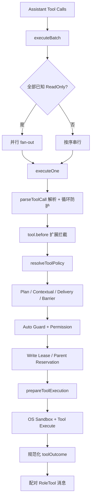

# Reasonix 工具与审批

## 一句话结论

Reasonix 把工具分成模型可见 Schema、注册可解析能力和实际副作用三层。每次调用先解析规范名称并做循环防护，再依次经过 Plan 模式、上下文可用性、交付门控、变更依赖屏障、Auto Guard、权限 Gate、写锁和 OS 沙箱；只读批次才并行，混合批次保持 Provider 顺序。

## 定位与核心契约

`internal/tool/tool.go` 定义了基础接口 `Tool`：

```go
Name() string
Description() string
Schema() json.RawMessage
Execute(ctx context.Context, args json.RawMessage) (string, error)
ReadOnly() bool
```

`ReadOnly()` 是并发控制信号：一批中所有已知只读工具才允许并行；混合批次保持串行，避免写入与读取顺序被改变。`bash` 和插件工具必须返回 false，因为宿主无法从参数静态推断全部效果。

可选接口继续细分能力：

| 可选契约 | 用途 |
| --- | --- |
| `ContextualTool.ProviderVisible(ctx)` | 执行时判断当前工作流阶段是否可用；Provider Schema 保持静态以稳定缓存。 |
| `Previewer.Preview(ctx, args)` | 写入前计算 diff，不触碰磁盘；用户批准的差异必须与最终执行一致。 |
| `ImageTool.ExecuteWithImages` | 图片独立于文本传输，避免 base64 被文本截断破坏。 |
| `PlanModeClassifier.PlanModeSafe()` | 声明是否可在计划阶段运行；它与 `ReadOnly()` 分离。 |
| MCP metadata 接口 | 保留 server、raw tool name、visible name 和 capability ID。 |

## Registry 与模型可见面

内置工具通过包初始化进入全局 builtins；每个 Run 构造独立 `Registry`，合并启用项和插件/MCP 工具。Agent 只看见 Registry，不直接访问全局集合。

`Registry` 有两个关键投影：

- **Provider 投影**：`Schemas()` 按 Provider-visible allowlist 输出稳定排序的工具定义；隐藏工具仍可通过内部 capability dispatch 执行。
- **Host / diagnostics 投影**：`SchemasForContext(ctx)` 会应用 `ContextualTool` 的阶段判断，供宿主和诊断使用。

`ResolveCall` 负责把模型给出的名称解析为规范目标。未知工具返回错误；MCP 别名可能映射到同一个真实工具，歧义引用会被拒绝而不是随机选择。

## 执行链路图



### 批处理调度

`executeBatch` 先复制 calls，避免预览刷新修改已入 Session 的共享切片；随后按原始顺序发布 `ToolDispatch` 事件。连续已知只读调用可以并行，writer 或未知目标串行。某个 writer 运行后，后续 writer 的 diff 预览会刷新，防止批准时看到的文件状态过期。

批处理还维护两类停止标记：

1. **取消标记**：context 取消后，未执行的调用补齐“cancelled before execution”结果。
2. **恢复停止**：Auto Recovery Episode 耗尽后，剩余未执行调用补齐 blocked 结果，保证每个 tool call 都有配对 result。

### 变更依赖屏障

如果本批中较早的变更失败或被阻止，后续变更和验证会被跳过，只读诊断仍可运行。原因是防止“改文件失败但测试仍然通过”这类假阳性验证。代理工具在解析出真实目标后会再次检查该屏障。

## 单次调用管线

`executeOne` 是一次调用的完整生命周期：

1. **解析**：`ResolveCall` 处理未知、歧义、MCP 连接提示、重复成功/失败和 stale anchor edit。
2. **效果分类**：普通工具依据 `ReadOnly()` 分类；bash 先解析命令，若能证明具体调用是只读，可在不改 Provider Schema 的情况下按 reader 进入权限检查。
3. **扩展前置**：`tool.before` 在任何策略前生效；合法替换会重新解析。
4. **策略序列**：依次应用 Plan/proxy、Contextual gate、execution preflight、delivery gates、mutation barrier、Auto Guard、permission 和 write access。权限完成前不获取写租约。
5. **执行准备与收尾**：准备沙箱和执行环境，调用工具；无论成功失败都释放 mutation write、parent write reservation 和 workspace lease，并记录 workspace mutation。

## 权限与审批

`permission.Policy` 由 mode、allow、ask、deny 和 session allow 组成。`Gate.Check` 的核心优先级是：

```text
Deny > SessionAllow > Ask > Allow > fallback
```

fallback 对 reader 放行，对 writer 采用配置 mode。多个 subject 的操作（例如 move 的源路径和目标路径）必须全部安全才放行。Bash 有专门分类：可复用的只读命令、需要精确匹配的命令和要求人工确认的命令走不同路径；动态 shell 形式默认不允许被宽泛 allow rule 打开。

Ask 决策交给 `Approver`。拒绝会生成明确反馈：不要原样重试，应换方案或询问用户。非交互模式下 Approver 为 nil 时保留自主性；这一取舍由宿主显式配置，不是静默绕过。

## Auto Guard、沙箱与审计

Auto Guard 位于权限之前：对状态变更、verification command、plan transition 或 Episode 已停止后的调用提出建议或阻断。它不把执行风险转成用户决定；权限、沙箱和工具自身策略仍拥有最终边界。等待恢复卡片时不持有写租约，减少阻塞。

Sandbox 提供平台实现（如 macOS sandbox-exec、Linux bubblewrap）、writable roots 和 escape approver。沙箱启动失败时可请求用户批准逃逸重跑，但这是显式决策；配置也可关闭 bash 执行。工具结果包含有界输出、完整原始输出、图片、截断信息、工作区变更和本地 shell 元数据；UI 与模型看到不同投影。

## 扩展点与设计取舍

| 扩展点 | 说明 |
| --- | --- |
| 内置工具 | 编译期自注册，重复名会在启动期暴露。 |
| 插件 / MCP | 加入 Run 级 Registry，可携带别名、元数据和授权身份。 |
| Hook | `tool.before` 等阶段可替换或阻断调用。 |
| 权限 | Policy、Approver、SessionAllow 和 Bash 分类组合成可配置治理。 |
| 沙箱 | Writable roots、平台 profile 和 Escape Approver 决定执行环境。 |

优点是把静态声明、动态分类和强制边界分开：缓存稳定的 Schema 不妨碍阶段控制；只读证明可以加速并行；失败批次的调用/结果仍然完整。代价是管线长、概念多，Bash 和 capability proxy 的动态解析尤其依赖正确分类。适合强治理编码场景；极简运行时可裁剪 Auto Guard 和多层投影。

## 自检问题

1. 为什么 `ReadOnly()` 不能用于 bash 的最终权限判断？
2. 一个 use_capability 代理如何在解析后才受变更依赖屏障约束？
3. Deny、SessionAllow、Ask 和 Allow 同时匹配时应采用哪条规则？
4. Auto Guard 阻断和权限拒绝在审计语义上有何不同？

## 相关页面

- [教材目录](../../TOC.md)
- [Reasonix Run 生命周期](./run-lifecycle.md)
- [Tool Schema 与调用协议](../../02-harness-mechanics/tool-schema.md)
- [术语表](../../09-glossary/glossary.md)
