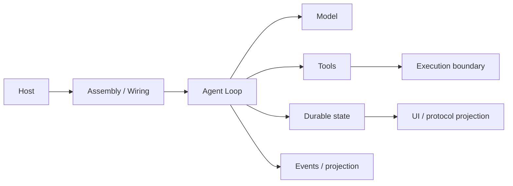
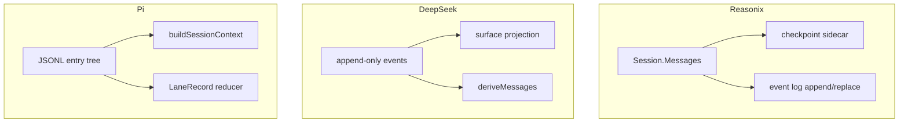

## 一句话结论

三家都解决"宿主→循环→工具→持久化"问题，但控制权归属截然不同：Reasonix 把控制集中在 Controller（厚控制面），DeepSeek Harness 把事实放进 append-only 事件日志（服务容器），Pi 把通用执行抽象与编码产品分成两层（内核/产品分离）。选择时应看变更频率最高的维度——模型和工具经常变就优先看工具边界，隔离经常变就优先看沙箱服务。

## 上一章遗留问题

F-P3 完成 Pi 簇后，所有机制和架构章节都已按 v0.3 重写。本章不再引入新锚点，而是把第三章已核对的结论横向对齐。

## 本章解决什么矛盾

读单个框架容易产生"所有 Harness 都差不多"或"完全不可比"的错觉。统一观察框架要求回答五个问题：

1. 哪一层是所有前端的必经入口？
2. 装配发生在启动期还是请求期？
3. 权威状态保存在消息、事件还是树状记录里？
4. 工具通过什么上下文获得文件、Shell 和审批能力？
5. 新增一个 UI 或协议要复用核心还是重新编排？

## 统一观察模型

## 三种风格

| 维度 | Reasonix | DeepSeek Harness | Pi |
| --- | --- | --- | --- |
| 风格概括 | 厚控制面 + 薄前端 | 服务容器 + 可重放会话日志 | 通用内核 + 编码产品双层 |
| 主要宿主 | CLI/TUI、桌面、Bot、ACP | CLI、Web、ACP、headless 示例 | Coding Agent CLI/TUI 与 server |
| 装配入口 | boot.BuildRuntime / Build | profile boot + Cordis loader | createAgentSession 或 createCodingAgentHarness |
| 控制中心 | Controller | AgentRegistry + ReactLoopAgent | AgentSession 或 AgentHarness |
| 权威状态 | Session.Messages + checkpoint/sidecar | 带 seq 的 append-only Session events | 树状 JSONL entry，通用侧另有 LaneRecord |
| 生命周期归属 | BuildResult.RuntimeSet/Owner 绑定 Controller 代次 | Cordis service scope + SessionStore | AgentSession 生命周期 / AgentHarness 独立 create |
| 扩展重心 | Hook、插件、MCP、技能、事件 Sink | Profile patch、Cordis 服务、guard、事件消费者 | Extension API、Harness tool、ExecutionEnv |

## 控制面对比

### Reasonix：Controller 命令面

Controller 是所有前端的唯一入口。Send/Cancel/Approve/NewSession 都是命令方法；前端不实现回合循环。Controller 聚合了权限策略、预算、Guardian、技能、Hook 和记忆管理。生命周期由 runtimeGeneration 配对清理，BuildResult.RuntimeSet 的 Close 链入 Controller cleanup。

优势：多端体验一致，新增前端只需消费 Sink 和调命令。
代价：Controller 体量大；裁剪困难。
锚点：F-R1 `internal/control/controller.go:93-95,104-146`。

### DeepSeek Harness：服务容器 + 工厂反转

AgentRegistry（ctx.agents）是创建/resume 门面；AgentFactory 由 agent-loop 包实现。消费方只编程于 ctx.agents，不 import 具体 loop。服务通过 Cordis inject 声明依赖，profile patch 可声明式替换。事件日志是唯一权威；surface 和 deriveMessages 都是投影。

优势：声明式替换、审计/replay/fork 天然支持。
代价：包边界多、事件粒度细、存储治理要求高。
锚点：F-D1 `packages/core/agent/src/index.ts:183-214,244-255`。

### Pi：内核抽象 + 产品装配

AgentSession 聚合 Agent 循环、SessionManager、ExtensionRunner 等产品协作对象；AgentHarness 实现 AgentLane 接口供 server 使用。ExecutionEnv 把文件/Shell 副作用提升为一等接口。SessionManager 的 leaf 指针让分支成为元数据操作。

优势：执行环境可替换、多宿主可组合、分支是元数据操作。
代价：AgentSession 体量大；AgentHarness 与 AgentSession 概念并存；AgentHarness.restore 未实现。
锚点：F-P1 `agent-session.ts:310-314`、`agent-harness.ts:305-345`。

## 状态所有权对比

| 问题 | Reasonix | DeepSeek Harness | Pi |
| --- | --- | --- | --- |
| 写入口 | Session.Add（锁保护） | Session.append（seq 连续） | SessionManager appendEntry（leaf 推进） |
| 流式 chunk | deferredStreamSink 缓冲后一次性提交 | assistant/chunk 逐条 append | message_update 事件（不持久 chunk） |
| 恢复单位 | 消息 + checkpoint | 事件序列 + header | 树节点 + leaf |
| 分支 | rewriteVersion + recoveryLane | fork + seedLength | leaf 指针移动 |
| 压缩 | compactToProjection + receipt | compaction replace + surface | compaction entry + firstKeptEntryId |
| 并发写保护 | CAS + writeAuth + lease | SESSION_FORMAT_VERSION 拒旧档 | 单写者假设 + file lock |

## 工具与安全对比

| 问题 | Reasonix | DeepSeek Harness | Pi |
| --- | --- | --- | --- |
| 工具注册 | 全局 builtins + per-run Registry | Cordis tools service + scope | baseToolDefinitions + custom + extension |
| 并发分类 | ReadOnly() 接口 | isConcurrencySafe 精确 true | executionMode sequential/parallel |
| 审批 | Policy.Decide + Gate + Approver | pre-execute waterfall + serviceAsk 四态 | beforeToolCall block/reason |
| 沙箱 | OS jail（Seatbelt/bwrap）+ confineWrite | runner chain probe + SANDBOX_UNAVAILABLE | 无内置沙箱；ExecutionEnv 抽象 |
| 写入保护 | mutation barrier + parent write reservation | mutation barrier + post-execute 约束 | file mutation queue realpath keying |
| 注入防护 | ClassifierTaskText 受信通道 + boundary notice | monotonic guard deny 单调 | beforeToolCall validated args |

## 生命周期对比

| 阶段 | Reasonix | DeepSeek Harness | Pi |
| --- | --- | --- | --- |
| 启动 | BuildRuntime → BuildResult → Controller | profile-boot → Cordis → AgentLoop.create | createAgentSession → AgentSession |
| 输入 | Controller.Send/Submit | ctx.agents.create/resume + inbox | AgentSession.prompt |
| 采样 | streamWithSamplingRecovery（frozen request） | buildRequest + stream + BlockAssembler | streamAssistantResponse |
| 工具 | executeBatch → executeOne | executeToolCalls → scheduler | executeToolCalls |
| 取消 | Controller.Cancel → ctx cancel → killProcessTree | AbortController → fuse signals → quiescence | signal → killProcessTree |
| 结束 | gracePause / FinalReadinessError / taskBudgetPause | turn/end reason（completed/aborted/error/max-tokens/blocked） | turn_end → agent_end |

## 反例与故障模式

1. **只看"有没有 CLI"判断相似性**
   - 触发：认为 Reasonix 和 Pi 都有 CLI 所以架构相同。
   - 因果：忽略 Controller 聚合 vs AgentSession 聚合的本质差异，错误估计迁移成本。
   - 正确边界：用五个观察问题逐一对比。
2. **假设三家的事件持久化粒度一致**
   - 触发：在 Reasonix 中期待 chunk 级重放。
   - 因果：Reasonix 的 deferredStreamSink 只在干净终态后提交，不存中间 chunk。
   - 正确边界：DeepSeek 保存 raw chunks；Reasonix 和 Pi 不保存。
3. **在 Pi 的 AgentHarness 上期待 restore**
   - 触发：server 路径调用 create 恢复旧会话。
   - 因果：抛 HarnessNotImplemented。
   - 正确边界：restore 走 AgentSession/SessionManager 路径。
4. **把 Reasonix planMode 当安全边界**
   - 触发：以为 Plan 模式禁写了。
   - 因果：readOnlyExecution 才是构造期安全边界。
   - 正确边界：区分协作态与安全态。
5. **DeepSeek guard 允许 force-allow**
   - 触发：自定义 guard 实现 override 语义。
   - 因果：打破 monotonic deny，注入内容解锁已拒绝调用。
   - 正确边界：deny 单调是框架约束不是约定。
6. **Pi 无内置沙箱被当作遗漏**
   - 触发：批评 Pi 不如 Reasonix 安全。
   - 因果：忽略 Pi 的 ExecutionEnv 抽象和三种部署模式是有意取舍。
   - 正确边界：安全是部署决策不是框架默认。
7. **在 Reasonix 中绕过 BuildResult 管理插件**
   - 触发：使用 Build 后自行管理插件进程。
   - 因果：sidecar 泄漏或被 stale cleanup 误杀。
   - 正确边界：generation + CloseIfGeneration 配对。

## 一条完整因果链

同一个"修改配置文件并运行测试"的任务在三家中的路径：

1. **Reasonix**：Controller.Send → Agent.Run → beginRunTurn（分类器受信通道）→ streamWithSamplingRecovery（冻结请求）→ executeBatch → executeOne（confineWrite + mutation barrier）→ gracePause（预算触顶）。恢复时 checkpoint + writeAuth 确保不双写。
2. **DeepSeek Harness**：ctx.agents.resume（header 校验 delegationDepth/agentPreset）→ turn() → preStep（pre-step waterfall）→ step（chunk append + sourceEventSeqs）→ executeToolCalls（ordered commit + mutation barrier）→ turn/end（max-tokens sticky）。恢复时 SessionHeader 治理字段确保身份/深度/能力一致。
3. **Pi**：AgentSession.prompt → runAgentLoop（双层循环）→ streamAssistantResponse → executeToolCalls（mutation queue + killProcessTree）→ turn_end → agent_end（等订阅者完成）。恢复时 SessionManager 打开 JSONL 树并迁移版本。

同一条因果链在三家中的差异不在步骤数，而在每步的控制权归属和状态写入格式。理解这些差异后，才能针对自己的部署场景做出正确的框架选择或混合设计。

## 设计取舍

| 取舍 | Reasonix 选择 | DeepSeek Harness 选择 | Pi 选择 |
| --- | --- | --- | --- |
| 控制权 | 集中 Controller | 分散 Cordis 服务 | 双层内核/产品 |
| 状态格式 | 消息 + checkpoint + event log | append-only event log | JSONL entry tree |
| 并发安全 | ReadOnly 接口 + scheduler | isConcurrencySafe + scheduler | executionMode + mutation queue |
| 沙箱 | OS jail（多平台） | runner chain（多平台 probe） | 无内置；ExecutionEnv 抽象 |
| 扩展模型 | Hook + plugin + MCP | Cordis service + guard + waterfall | ExtensionRunner + Harness tool |
| 适用场景 | 多端桌面强治理 | 服务化长会话审计 | 多宿主可替换执行环境 |

## 自检与面试追问

1. 如果你的团队要选一个框架作为基座，决策矩阵应该包含哪些维度？权重如何分配？
2. 三家的沙箱方案各缺什么？如果要构建一个跨平台的统一沙箱层，应该抽象哪些接口？
3. 如果要给三家都加"多租户"支持，各需要改哪些层？哪家改动最小？
4. 三家的 compaction 策略有何本质差异？各自的"不可压缩最小集"是什么？
5. 如果要构建一个评测基准来比较三家的工具调用正确率，应该控制哪些变量？
6. 你自己的 Harness 更接近哪一家？哪些设计决策你会保留，哪些会替换？

## 交给下一章的问题

本章比较了架构风格。X-02《Context 组装与压缩对比》将把 M-01/M-02 的机制差异按三家逐项对齐：组装入口、预算轴、压缩触发和摘要质量。

## 相关页面

- [教材目录](../TOC.md)
- [Reasonix 架构总览](../03-frameworks/reasonix/overview.md)
- [DeepSeek Harness 架构总览](../03-frameworks/deepseek-harness/overview.md)
- [Pi 架构总览](../03-frameworks/pi/overview.md)
- [术语表](../09-glossary/glossary.md)
