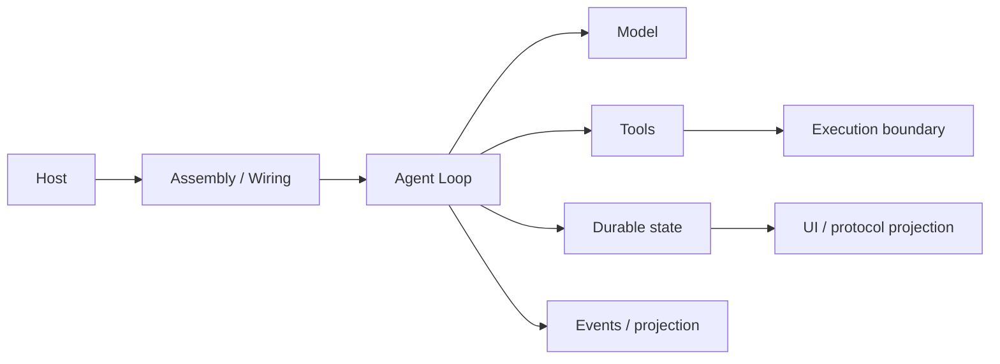

# 架构风格对比

## 一句话结论

三家用不同位置安放权威状态：Reasonix 把控制集中在 `Controller`，DeepSeek Harness 把事实放进 Session 事件日志，Pi 把通用执行抽象和编码产品分成两层。它们的共同骨架都是“宿主 → 装配 → Agent 循环 → 工具副作用 → 持久化/事件投影”；差异在于谁拥有控制权、谁能替换能力，以及新增宿主要复制多少逻辑。

## 统一观察模型

读架构时先问五个问题：

1. 哪一层是所有前端的必经入口？
2. 装配发生在启动期还是请求期？
3. 权威状态保存在消息、事件还是树状记录里？
4. 工具通过什么上下文获得文件、Shell 和审批能力？
5. 新增一个 UI 或协议要复用核心，还是要重新编排？

## 三种风格

| 维度 | Reasonix | DeepSeek Harness | Pi |
| --- | --- | --- | --- |
| 风格概括 | 厚控制面 + 薄前端。 | 服务容器 + 可重放会话日志。 | 通用内核 + 编码产品双层。 |
| 主要宿主 | CLI/TUI、桌面、Bot、ACP。 | CLI、Web、ACP、headless 示例。 | Coding Agent CLI/TUI 与 server。 |
| 装配入口 | `boot.BuildRuntime` / `boot.Build`。 | profile boot + Cordis loader。 | `createAgentSession` 或 `createCodingAgentHarness`。 |
| 控制中心 | `Controller`。 | `AgentRegistry` + `ReactLoopAgent`。 | `AgentSession` 或通用 `AgentHarness`。 |
| 权威状态 | `Session.Messages` 加 checkpoint/sidecar。 | 带 `seq` 的 append-only Session events。 | 树状 JSONL entry，通用侧另有 LaneRecord。 |
| 扩展重心 | Hook、插件、MCP、技能和事件 Sink。 | Profile patch、Cordis 服务、工具和事件消费者。 | Extension API、Harness tool 和 ExecutionEnv。 |

### Reasonix：集中控制面

Reasonix 让多个前端调用同一个 `Controller`。启动期先由 `BuildRuntime` 组装 Provider、工具、Hook、MCP 和系统提示，再返回带 Runtime Owner 的 `BuildResult`。前端只发送输入、取消或审批，不重复实现回合管理。

这种结构适合多端体验一致的产品。代价是 `Controller` 很厚：它同时处理命令、权限、租约、清理和重建。要把 Reasonix 改造成多租户服务，必须重新评估本地会话、插件子进程和 Runtime Owner 的归属。

### DeepSeek Harness：服务容器与日志中心

DeepSeek Harness 用 Cordis 组织服务。CLI 只负责装载 profile 和 patch；Agent 身份、循环、LLM、工具和系统提示分别进入服务容器。`ReactLoopAgent` 从 Session 日志派生请求，回合、步骤、流式片段和工具结果都追加成事件。

这种结构天然利于审计、fork、resume和多投影。代价是包边界和服务配置更多，读者需要穿过 Agent Registry、Agent Loop、Session Store 和派生投影才能看到一次 Run。事件粒度细也要求存储和索引更谨慎。

### Pi：内核抽象与产品装配分离

Pi 把低层 Agent 循环、Lane、Session reducer 和 `ExecutionEnv` 放进通用内核，把编码工具、TUI、资源和 `SessionManager` 放进 coding-agent。CLI 使用高层 `AgentSession`；server 可以走通用 `AgentHarness`。两条路径共享底层抽象，但上层状态桥接不同。

这种结构便于替换执行环境和接入第二个宿主。代价是概念分层更多：`AgentSession`、`AgentHarness`、Lane 和 SessionManager 各有职责，初学者容易把它们误当成重复实现。

## 状态所有权

三家都不把流式界面当作权威状态。

- **Reasonix** 在内存 Session 中维护消息历史，用版本号区分普通追加和压缩重写，并用 checkpoint 辅助恢复。
- **DeepSeek Harness** 以事件为权威历史；模型可见消息和界面 surface 都是派生视图。
- **Pi** 把稳定消息写入树状 JSONL；entry 的父子链让分支显式，通用 Lane 再用记录加 reducer 支持恢复。

关键区别不在“是否持久化”，而在恢复单位：Reasonix 围绕消息与 checkpoint，DeepSeek 围绕事件序列，Pi 围绕树节点与当前 leaf。

## 扩展点对比

| 扩展目标 | Reasonix | DeepSeek Harness | Pi |
| --- | --- | --- | --- |
| 模型 | Provider 抽象。 | LLM 服务与 provider route。 | Model Runtime 与 `packages/ai`。 |
| 工具 | 全局 builtins 加 per-run Registry。 | Tools 服务与注册表。 | Extension tool 与 Harness tool。 |
| 执行环境 | 通过工具策略与外部进程约束。 | fs、host/apiproxy、landlock-run。 | `ExecutionEnv` 显式抽象。 |
| 配置 | Boot options、skills、commands、hooks。 | Profile、bundle、patch、overlay。 | Settings、resources、extensions。 |
| 宿主集成 | 类型化事件 Sink。 | ACP/headless/JSONRPC 协议示例。 | CLI SDK 与 server 协议。 |

Reasonix 把多数变化挡在控制面外；DeepSeek 允许声明式替换服务；Pi 把执行环境提升为一等接口。选择时应看变更频率：模型和工具经常变，就优先看工具/Provider 边界；隔离经常变，就优先看 `ExecutionEnv` 或沙箱服务。

## 设计取舍

- **优点**：厚控制面降低前端重复；事件日志提高审计与恢复能力；内核/产品分离让多宿主和执行环境可组合。
- **代价**：集中控制器难以裁剪；服务与事件粒度增加调试成本；双层抽象增加学习曲线。
- **适用判断**：多端桌面产品可借鉴 Reasonix 的统一控制面；服务化长会话可参考 DeepSeek 的事件溯源；需要多种宿主或沙箱形态时可学习 Pi 的内核边界。

## 自检问题

1. 为什么不能只凭“是否有 CLI”判断两个 Harness 是否相似？
2. 三家分别把哪个对象作为权威状态的写入口？
3. 如果要新增 Web 前端，哪家的宿主改动可能最小？为什么仍需验证？
4. `Controller`、Cordis 服务和 Pi 双层装配分别用什么方式避免前端重写循环？

## 相关页面

- [教材目录](../TOC.md)
- [Reasonix 架构总览](../03-frameworks/reasonix/overview.md)
- [DeepSeek Harness 架构总览](../03-frameworks/deepseek-harness/overview.md)
- [Pi 架构总览](../03-frameworks/pi/overview.md)
- [术语表](../09-glossary/glossary.md)
