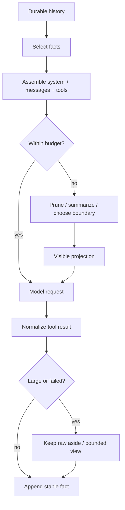

# Context 策略对比

## 一句话结论

三家的共同原则是"权威历史不变，按请求生成模型可见投影"。Reasonix 在消息历史上建立可缓存的压缩投影（receipt 审计）；DeepSeek Harness 把压缩做成可替换服务，用 surface replace 改写可见范围；Pi 在树状 JSONL 上选安全切点折叠成 compaction entry。真正的分歧不在是否压缩，而在**压缩结果写到哪里**以及**如何保证可恢复**。

## 上一章遗留问题

X-01 对齐了架构风格。X-02 把 M-01/M-02 的机制差异按五个维度横向对齐：组装入口、预算控制、压缩触发、切点选择与摘要质量。

## 本章解决什么矛盾

读单家容易产生"我的方案就是标准"的错觉。统一比较要求回答：

1. 组装的入口在循环内还是独立服务？
2. 预算是单轴还是多轴？unpriced 怎么处理？
3. 压缩是自动的还是显式命令？
4. 切点如何保证不拆散 tool call/result 配对？
5. 摘要丢失关键信息后能否从原始日志恢复？

## 统一生命周期

## 组装与预算对比

| 维度 | Reasonix | DeepSeek Harness | Pi |
| --- | --- | --- | --- |
| 权威历史 | Session 消息加版本化 checkpoint | 带 seq 的 append-only Session events | 树状 JSONL entry 与当前 leaf |
| 模型可见来源 | compactToProjection 的压缩投影 | deriveMessages() 遍历 surface 节点 | root 到 leaf 的 context messages 加 compaction entry |
| 压缩位置 | Agent 内部 ContextManager | 可替换 compaction-basic 服务 | coding-agent AgentSession 调用 compaction 模块 |
| 默认压力线 | compactRatio 触发 fold；hard ceiling 触发 overflow | basic 后端默认 80% 窗口 | 超过 contextWindow - reserveTokens 时触发 |
| 近期保留 | 约 16% 窗口的 verbatim tail | basic 后端 retainTokens 或显式 token 数 | 按 keepRecentTokens 从最新 entry 回溯找切点 |
| 扩展入口 | PreCompact Hook 与压缩指令链 | 可替换 compaction backend 与 pruner | before-compact hook、自定义指令 |

### Reasonix：缓存友好的消息投影

Reasonix 把 prompt 视为 append-only 前缀。到达压缩比例后，ContextManager.Prepare 先做压力期工具输出修剪（pruneToolResultsToProjectionLocked），再把最多两个缓存对齐区间折叠成结构化摘要。摘要有固定标题覆盖长期约束、目标、决策、文件代码、命令结果、错误修复和下一步。

关键设计是 canonical transcript 不被普通自动压缩改写；改写的是下一次请求使用的投影。receipt 记录 input/output hash 和 saved tokens 用于审计。若压缩后的可见请求没有变小，或受保护内容超过窗口，流程中止而非伪造成功。

### DeepSeek Harness：事件日志上的可选能力

DeepSeek Harness 不把压缩放进 agent loop 主干。compaction-basic 是一个可替换服务：step 边界测量压力，先尝试 tool result pruner，再选择可摘要区间；provider 报告 context overflow 时走独立恢复路径并可有限重试。

压缩产生三类日志事件：compaction/start 加锁，compaction/summary 保存范围/token/provider 调用/摘要，compaction/end 释放锁。真正进入模型的是带 surfaceOp replace 的 user message。原始事件仍在日志中，因此人类转录和模型可见 surface 可以分开恢复。

### Pi：JSONL 树上的安全切点

Pi 由 AgentSession._checkCompaction 检查 threshold、context overflow 和可恢复 length。threshold 压缩在超过 contextWindow 减 reserveTokens 时启动；overflow 或可恢复截断会移除失败助手消息、压缩一次并重试。

压缩模块从当前分支选择切点。它不切在 tool result 上以避免拆散调用与结果；回溯累计到 keepRecentTokens 后，把较早 entries 摘要成 compaction entry。摘要模板覆盖目标、约束、进度、决策、下一步和关键上下文，并要求保留路径、函数名和错误文本。

## 工具结果与大输出

| 框架 | 进入 Session 前 | 历史中的 prune | 分页/取回 |
| --- | --- | --- | --- |
| Reasonix | truncateToolOutputFor 32KiB head/tail + marker | pruneToolResultsToProjection durable receipt | RawContent + resultRef |
| DeepSeek Harness | 工具自身定义 output schema | ToolResultPruner surface replace + shadow price | sourceEventSeqs 回溯原始事件 |
| Pi | truncateHead/truncateTail 行字节元数据 | threshold compaction 折叠旧 entry | temp file fullOutputPath |

共同启发式是给模型稳定有界可行动的结果；完整原始数据留在可寻址位置。失败结果不能因为太短而被丢弃——它常常解释下一步为什么改路线。

## 反例与故障模式

1. **Reasonix unpriced 当免费**
   - 触发：自定义 provider 无 pricing。
   - 因果：cost 轴永不触发预算暂停。
   - 正确边界：unpricedTurns 保护使 cost 轴跳过判定。
2. **DeepSeek pruner 破坏 tool pairing**
   - 触发：surface replace 只改一个 result 但未引用 shadowed seq。
   - 因果：assertProvenance 拒绝，防止拆散调用/结果配对。
   - 正确边界：sourceEventSeqs 必须包含所有 shadowed nodes。
3. **Pi 切在 toolResult 上**
   - 触发：findCutPoint 未排除 toolResult 角色。
   - 因果：provider 看到 assistant tool call 无 result，拒绝请求。
   - 正确边界：isCutPointMessage 排除 toolResult。
4. **压缩后 cache 全失效无归因**
   - 触发：静默重写 prompt prefix。
   - 因果：费用上升但无法定位原因。
   - 正确边界：Reasonix CacheBreak 标记 + DeepSeek header change 事件。
5. **摘要美化失败**
   - 触发：prompt 只要求"总结进展"。
   - 因果："多次尝试后完成"掩盖了两次部分写入。
   - 正确边界：结构化模板强制 failed attempts/partial effects/verification status。
6. **Pi stale usage 触发循环压缩**
   - 触发：上次 compaction 后 usage 未更新就检查阈值。
   - 因果：旧的大上下文用量导致刚压缩完又触发。
   - 正确边界：usageMsg.timestamp <= compactionEntry.timestamp 则 return false。
7. **Reasonix fixed prefix 本身超窗**
   - 触发：系统提示过大导致 fold region 无法缩小到目标。
   - 因果：返回 checkpoint rejected 而非伪造成功。
   - 正确边界：acceptCheckpointCandidate 要求真正节省且低于 physical ceiling。

## 一条完整因果链

同一个 120 轮编码会话在第 119 轮触发压缩：

1. **Reasonix**：Prepare 检测 est >= fold → pruneToolResultsToProjectionLocked 写 durable receipt → foldToSummary 单次调用生成 prefix+digest+kept messages → acceptCheckpointCandidate 确认节省 → commitSummaryProjection 更新 projectionVersion 并 emit CompactionDone。canonical transcript 不变。
2. **DeepSeek Harness**：selectCompactableRange 从尾回溯 retainTokens 并回退到 toolPairingBalancedBefore → compactSurfaceRegion append start lock → summarize → assertSelectedSpanStable → commit summary/replacement/end → user/message replacement 引用 start/summary/shadowed seqs。失败也补 end 带 errorChain。
3. **Pi**：shouldCompact(contextTokens > window - reserve) → findCutPoint 反向累计 keepRecentTokens 且不切 toolResult → generateSummaryWithUsage 用结构化 checkpoint 模板 → compaction entry 写入 firstKeptEntryId/tokensBefore/usage → 后续 buildSessionContext 从 firstKeptEntryId 开始重建。

同一条因果链在三家中的差异不在步骤数而在每步的控制权归属和状态写入格式。理解这些差异后才能针对自己的部署场景做出正确的框架选择或混合设计。

## 设计取舍

| 取舍 | Reasonix 选择 | DeepSeek Harness 选择 | Pi 选择 |
| --- | --- | --- | --- |
| 压缩位置 | Agent 内部 ContextManager | 可替换服务 | coding-agent 模块 |
| 压缩产物 | durable projection + receipt | surface replace events | compaction entry in tree |
| canonical 保护 | transcript never rewritten by auto | append-only log + surface shadowing | append-only entries + leaf move |
| 缓存策略 | CacheBreak 标记 + promptCacheKey | request/header reason=change | 无显式标记 |
| 多次尝试限制 | pressure 最多两次 summary | 单次 transaction | maxRetries 设置 |
| 失败处理 | ErrCompactionRequired 或维持旧投影 | SurfaceChangedError + error end event | 返回 false 不压缩 |

## 自检与面试追问

1. 如果你的团队要选一个框架作为基座，压缩策略的哪些维度应该纳入决策矩阵？
2. 三家的"不可压缩最小集"分别是什么？各自的保护机制是否充分？
3. 如果要构建一个评测基准来比较三家的压缩质量，应该控制哪些变量？评分维度是什么？
4. Reasonix 的 receipt 和 DeepSeek 的 shadow price 各自解决什么审计问题？如果合并到一个系统会怎样？
5. 你自己的 Harness 目前在哪一层做压缩？如果要迁移到"投影分离"模式，最小改动是什么？

## 交给下一章的问题

本章对齐了 Context 策略。X-03《工具协议与安全对比》将把 M-03 到 M-07 的机制差异按注册、调度、审批和沙箱逐项对齐。

## 相关页面

- [教材目录](../TOC.md)
- [架构风格对比](./architecture.md)
- [Context 组装与分层](../02-harness-mechanics/context-assembly.md)
- [Context 压缩与截断](../02-harness-mechanics/context-compression.md)
- [术语表](../09-glossary/glossary.md)
