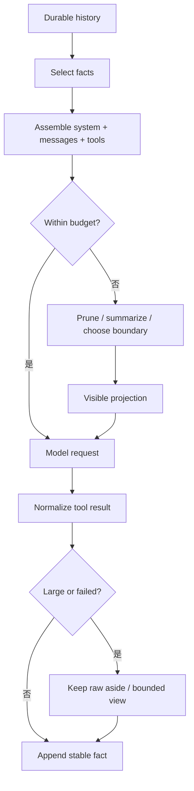

# Context 策略对比

## 一句话结论

三家的共同原则是“权威历史不变，按请求生成模型可见投影”。Reasonix 在消息历史上建立可缓存的压缩投影；DeepSeek Harness 把压缩做成可选服务，用事件日志里的 surface replace 改写可见范围；Pi 在树状 JSONL 上选择安全切点，把早期上下文折叠成 compaction entry。真正的分歧不在是否压缩，而在压缩结果写到哪里，以及如何保证可恢复。

## 统一生命周期

Context 有两个不同问题。**组装**决定这次请求看到什么：系统提示、历史、项目资料、运行时状态和工具声明要分层排序。**压缩**决定超出窗口时牺牲什么：先保留目标、约束和未决项，再摘要过程，最后裁剪低相关内容。

## 组装与预算对比

| 维度 | Reasonix | DeepSeek Harness | Pi |
| --- | --- | --- | --- |
| 权威历史 | Session 消息加版本化 checkpoint。 | 带 `seq` 的 append-only Session events。 | 树状 JSONL entry 与当前 leaf。 |
| 模型可见来源 | 从 canonical transcript 派生的压缩投影。 | `deriveMessages()` 遍历 surface 节点。 | root 到 leaf 的 context messages 加 compaction entry。 |
| 压缩位置 | Agent 内部维护投影。 | 可选 compaction service。 | coding-agent `AgentSession` 调用压缩模块。 |
| 默认压力线 | 默认 80% 窗口。 | basic 后端默认 80%。 | 超过窗口减去保留 token 时触发。 |
| 近期保留 | 约 16% 窗口的 verbatim tail。 | basic 后端默认约 16%，或显式 token 数。 | 按 token 预算从最新 entry 回溯找切点。 |
| 扩展入口 | Pre/Compact Hook 与压缩指令链。 | 可替换 compaction backend 与 pruner。 | before-compact hook、自定义指令和 extension details。 |

### Reasonix：缓存友好的消息投影

Reasonix 把 prompt 视为 append-only 前缀。到达压缩比例后，系统先做压力期工具输出修剪，再把最多两个缓存对齐区间折叠成结构化摘要。摘要有固定标题：长期约束、目标、决策、文件代码、命令结果、错误修复和下一步。

关键设计是 canonical transcript 不被普通自动压缩改写；改写的是下一次请求使用的投影。摘要指令追加在字节稳定的前缀后，尽量复用 provider KV cache。若压缩后的可见请求没有变小，或受保护内容超过窗口，流程会中止而不是伪造成功。

### DeepSeek Harness：事件日志上的可选能力

DeepSeek Harness 不把压缩放进 agent loop 主干。`compaction-basic` 是一个可替换服务：step 边界测量压力，先尝试 tool result pruner，再选择可摘要区间；provider 报告 context overflow 时走独立恢复路径，并可有限重试。

压缩产生三类日志事件：`compaction/start` 加锁，`compaction/summary` 保存范围、token、provider 调用和摘要，`compaction/end` 释放锁。真正进入模型的是带 `surfaceOp: replace` 的 user message。原始事件仍在日志中，因此人类转录和模型可见 surface 可以分开恢复。

### Pi：JSONL 树上的安全切点

Pi 由 `AgentSession` 检查 threshold、context overflow 和可恢复 length。threshold 压缩在超过 `contextWindow - reserveTokens` 时启动；overflow 或可恢复截断会移除失败助手消息、压缩一次并重试。

压缩模块从当前分支选择切点。它不会切在 tool result 上，避免拆散调用与结果；回溯累计到 `keepRecentTokens` 后，把较早 entries 摘要成 compaction entry。摘要模板覆盖目标、约束、进度、决策、下一步和关键上下文，并要求保留路径、函数名和错误文本。

## 工具结果与大输出

| 框架 | 大结果处理线索 |
| --- | --- |
| Reasonix | Provider 结果保持有界形式；原始大输出放在本地 raw 内容，显式分页时才进入上下文。 |
| DeepSeek Harness | 可选 tool-result pruner 先于摘要执行；surface replace 可以只替换工具结果内容，原始事件仍留日志。 |
| Pi | Bash 超限输出保存临时文件，模型只看尾部和提示；压缩摘要跟踪已读和已修改文件。 |

共同启发式是：给模型稳定、有界、可行动的结果；把完整原始数据留在可寻址位置。失败结果不能因为太短而被丢弃，它常常解释下一步为什么要改路线。

## 设计取舍

- **优点**：分离权威历史和投影让压缩可撤销或重建；固定预算和切点规则减少静默丢信息；结构化摘要保住目标和未决项。
- **代价**：Reasonix 的投影状态、DeepSeek 的多事件锁和 Pi 的树切点都增加实现复杂度；摘要本身可能丢反例或过期事实。
- **适用判断**：长编码任务优先保留命令、错误、文件路径和未决项；审计型任务应学 DeepSeek 的日志与 surface 分离；强缓存敏感任务可参考 Reasonix 的稳定前缀设计。

## 自检问题

1. 为什么压缩不能直接修改权威历史？
2. 三家分别用什么结构表示“模型看到的范围”？
3. 为什么不能在任意 tool result 前切断上下文？
4. 如果摘要丢失了一个测试失败原因，应该从哪层记录恢复？

## 相关页面

- [教材目录](../TOC.md)
- [架构风格对比](./architecture.md)
- [Context 组装与分层](../02-harness-mechanics/context-assembly.md)
- [Context 压缩与截断](../02-harness-mechanics/context-compression.md)
- [术语表](../09-glossary/glossary.md)
