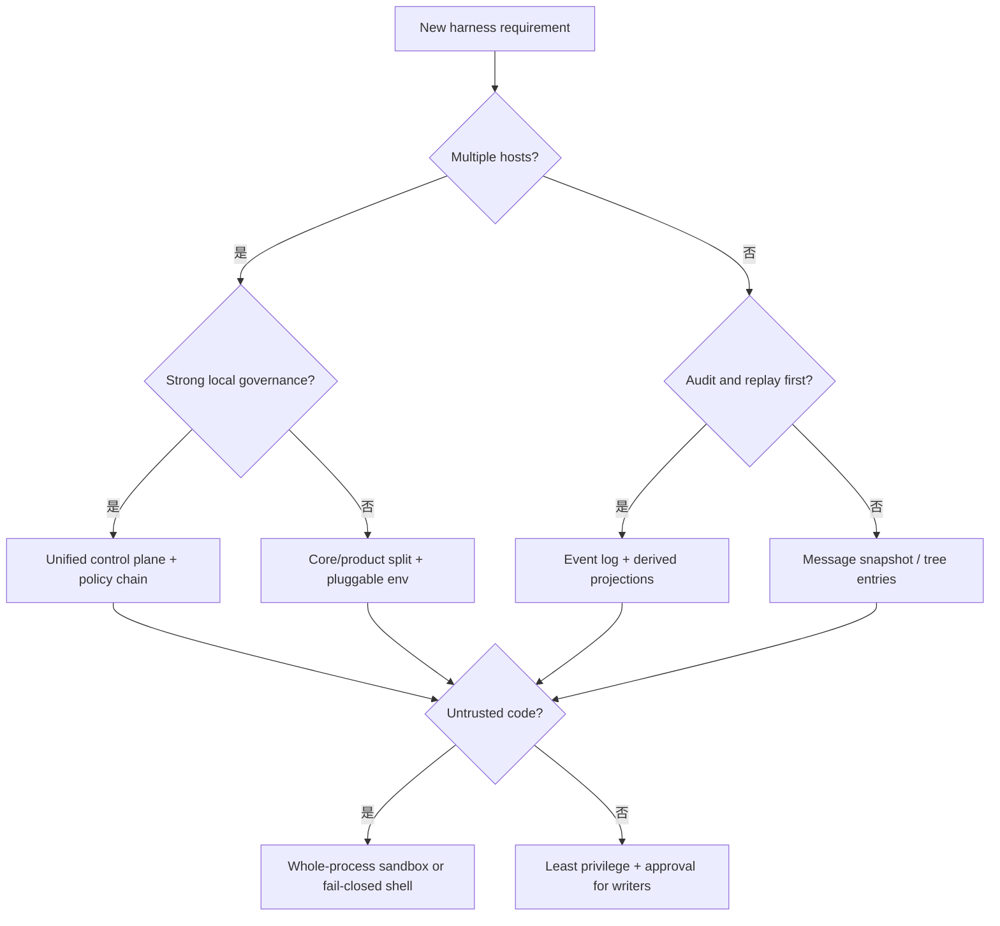

# 设计模式与反模式

## 一句话结论

不要问“Reasonix、DeepSeek Harness 和 Pi 哪个最好”，先问任务把哪个约束推到极限。前端数量决定控制面形状，审计要求决定事件粒度，隔离需求决定执行环境位置，恢复要求决定持久化单元，成本上限决定压缩与并发策略。本章把这些取舍整理成选择规则、可复用模式和应避免的反模式。

## 决策起点

| 首要约束 | 更适合的模式 | 关键原因 |
| --- | --- | --- |
| 多端一致体验 | 集中控制面 | 回合、取消、审批和租约只实现一次。 |
| 服务化审计 | 事件日志加派生投影 | chunk、工具结果和边界都可追溯。 |
| 多宿主/沙箱组合 | 内核抽象加显式执行环境 | CLI 与 server 可共享低层能力。 |
| 本地编码回退 | 消息历史加文件 checkpoint | 用户能理解“回到某个回合”。 |
| 轻量 SDK | 小工具接口加宿主装配 | 产品层自行选择存储和安全边界。 |

## 可迁移模式

### 模式一：权威状态与投影分离

**问题**：流式草稿、界面卡片、模型请求和审计记录经常互相污染。

**做法**：先定义权威单元——消息、事件或 entry；再把 UI 投影、模型可见上下文和统计报表声明为派生数据。压缩只改变投影，不重写权威源。

**收益**：刷新、resume、fork 和事后审计都有共同答案。

**代价**：需要版本、来源范围和重建规则；查询可能比直接读内存慢。

**失效信号**：同一消息在不同界面长度不同；无法解释某条工具输出为何消失；摘要被当成原始事实。

### 模式二：提交边界配对

**问题**：取消或失败后出现 assistant tool call 没有 result，或数据库成功但工作区未变更。

**做法**：把“用户输入闭合、assistant message 完成、tool call/result 配对、审批生效”设为逻辑提交点。中断时要么等待已启动任务静止，要么补齐 synthetic result。

**收益**：重放有效，模型不会基于悬空调用编造结果。

**代价**：取消延迟增加；需要区分“未开始”“进行中”“已完成”“状态未知”。

**失效信号**：恢复后出现空 tool result；外部服务显示已执行但 Session 无观察；重试删除了上一次错误。

### 模式三：最小权限加单调拒绝

**问题**：一个扩展解锁了另一个扩展明确禁止的动作。

**做法**：权限按资源、动作和范围表达；多个 guard 只能追加拒绝理由，不能覆盖 deny。ask 在审批服务不可用时失败关闭。

**收益**：安全策略可以分层组合，审计能找到第一个拒绝原因。

**代价**：策略链更长；用户体验依赖清晰的 diff 和拒绝反馈。

**失效信号**：allow 规则能绕过 deny；审批超时自动放行；动态命令被宽泛规则打开。

### 模式四：显式执行环境

**问题**：工具库散落调用 `fs`、`child_process` 或网络 API，测试和沙箱都难以替换。

**做法**：把文件、Shell、进程和网络注入成环境对象。宿主可以传本地实现、容器路由或远端沙箱；工具只描述意图。

**收益**：同一工具可在测试假件、本地工作区和微虚拟机中运行。

**代价**：环境对象成为公共契约；替换实现必须保持路径、取消和错误语义。

**失效信号**：`ExecutionEnv` 被当成安全边界；部分自定义工具绕过路由留在宿主；挂载凭证进入隔离环境。

### 模式五：预算驱动的降级阶梯

**问题**：长任务在接近 token、时间或费用上限时突然失败。

**做法**：为 Session、Run 和调用设置软/硬限制。软限制触发裁剪检索窗口、减少候选、切换小模型或总结当前进度；硬限制保存恢复锚点并暂停。

**收益**：用户得到可续跑状态，而不是无证据的错误。

**代价**：需要用量归因到调用 ID；降级质量必须可见。

**失效信号**：静默截断关键约束；子任务继承完整预算；并行没有全局上限。

### 模式六：分支而不篡改历史

**问题**：回退会覆盖早期结论，或两个入口同时修改同一 Session。

**做法**：新路径指向旧节点，leaf/指针表示当前位置；checkpoint 只作为锚点和 pre-image 存储。并发访问使用单一写入者、CAS 或租约。

**收益**：可以比较方案、恢复代码和会话，并保留完整审计链。

**代价**：存储增长；UI 必须清楚当前 leaf 和分叉来源。

**失效信号**：rewind 后旧分支消失；两个 resume 同时写入；checkpoint 恢复了代码但丢失审批证据。

## 反模式清单

| 反模式 | 症状 | 修正方向 |
| --- | --- | --- |
| UI 即真源 | 刷新后丢过程，无法证明请求发生过。 | 从权威日志重建投影。 |
| 提示词当防火墙 | 注入文本能让模型尝试越权。 | 加资源白名单、审批和运行时隔离。 |
| 工具名一刀切 | 读文件和发布包共用同一授权。 | 按参数、资源和副作用分级。 |
| 静默压缩 | 模型说没看到约束，但没人知道删了什么。 | 记录保留范围、丢弃项和取回方式。 |
| 为并发而并发 | 任务有依赖，结果乱序且重复副作用。 | 先建模因果，再决定 barrier 或 pool。 |
| 子 Agent 直写父历史 | 两个写入者破坏提交点。 | 子任务返回报告，由父 Run 提交。 |
| 审批缺失即继续 | 服务异常时高危命令仍执行。 | ask/unavailable 失败关闭。 |
| 只存最终答案 | 无法调试失败、审计注入或恢复中途工作。 | 保存输入、调用、拒绝和恢复锚点。 |
| 缓存忽略权限 | 租户 A 看到租户 B 的结果。 | 缓存键包含身份、范围和版本。 |
| 部署配置漂移 | 生产比开发少一层沙箱或多一把密钥。 | 把隔离和凭证策略纳入启动检查。 |

## 迁移检查单

新增或重构 Harness 时按顺序确认：

1. **状态**：权威单元、schema 版本、派生投影和保留期是否明确？
2. **生命周期**：每个 tool call 是否都有配对结果或结构化失败？
3. **治理**：deny、ask、allow 的优先级和审批缺失默认是否写进测试？
4. **隔离**：文件、Shell、网络和凭据分别由谁限制？降级路径是什么？
5. **恢复**：最新有效锚点如何发现？外部副作用如何对账？旧进程如何失效？
6. **成本**：token、时间、工具和人工等待能否归因？硬限制触发后是否有续跑入口？
7. **演进**：新宿主、新工具和新沙箱能否在不重写循环的情况下接入？

如果第 1、2、3 项不能回答，先不要优化性能；如果第 4、5 项不能回答，不要接入不可信仓库；如果第 6、7 项不能回答，至少要把缺口记录成产品限制。

## 自检问题

1. 你的系统里哪一层是唯一可写入权威历史的组件？
2. 一个工具调用取消后，你的持久层会出现几种终态？
3. 如果审批服务宕机 30 秒，哪些动作会继续？
4. 新增第二个宿主时，哪些逻辑必须复制？这暴露了哪个抽象缺口？
5. 最近一次上下文截断是否记录了丢失内容和取回方式？

## 相关页面

- [教材目录](../TOC.md)
- [架构风格对比](./architecture.md)
- [Context 策略对比](./context.md)
- [工具协议对比](./tools.md)
- [安全与审批对比](./security.md)
- [持久化与恢复对比](./persistence.md)
