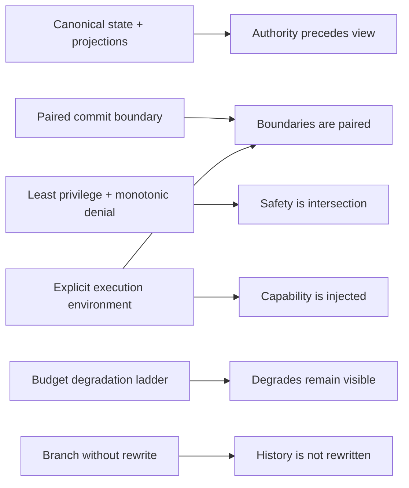
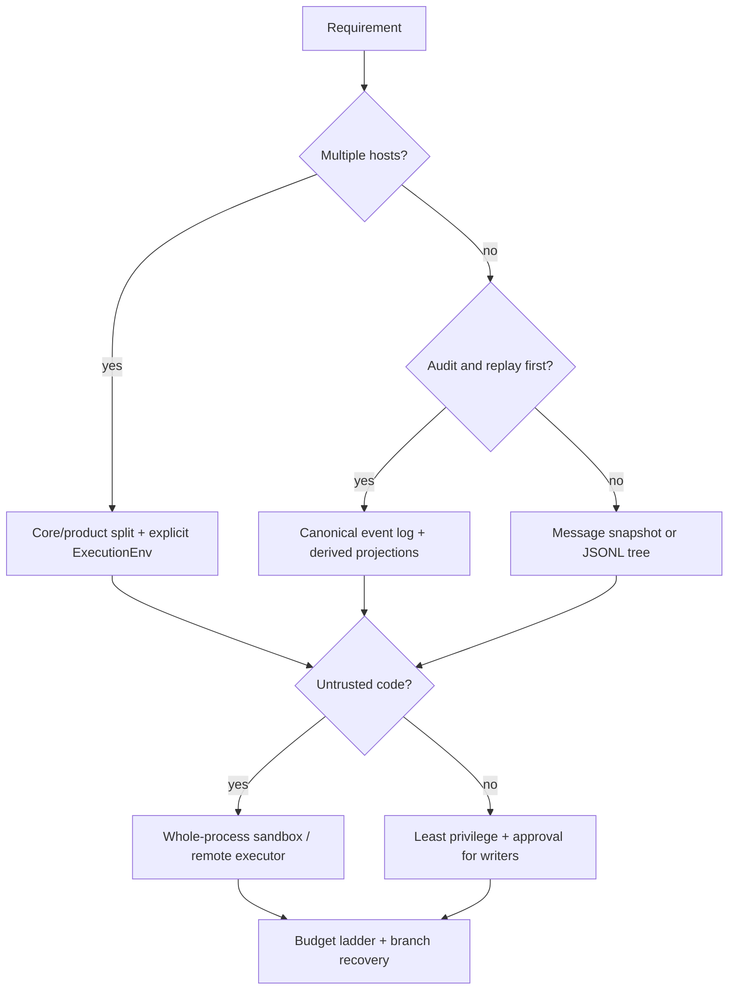

# 设计模式与反模式

## 一句话结论

不要先问「Reasonix、DeepSeek Harness 和 Pi 哪个最好」，要先问任务把哪个约束推到极限：多宿主决定控制面形状，审计决定事件粒度，不可信代码决定隔离位置，恢复决定持久化单元，预算决定压缩和并发。本章把 X-01 到 X-05 的结论收敛成六条可迁移模式、十个反模式和一张迁移检查单。

## 上一章遗留问题

[X-04 安全与审批对比](./security.md) 回答了危险动作如何被拦截。它的遗留问题是：这些机制能否变成不依赖具体框架的选择规则？本章把五篇横向比较的取舍抽象出来，并明确每条模式的失效边界。

## 本章解决什么矛盾

模式的价值不是「最佳实践」四个字，而是让团队在压力下仍能保住不变量。评估一个 Harness 设计时问七个问题：

1. 哪一层是唯一可写入权威历史的组件？
2. 取消、失败和审批拒绝后，哪些状态必须配对？
3. 多个策略来源冲突时，allow 与 deny 如何合成？
4. 文件、进程、网络和凭据由谁限制？
5. 恢复的最小事实是什么？外部副作用如何对账？
6. token、时间、工具调用和人工等待归因到哪里？
7. 新宿主、新沙箱和新工具接入时，哪些契约不能变？

## 核心不变量

1. **权威先于视图**：UI、模型请求和报表都是投影；投影可以重建，权威历史不能被界面顺手改写。
2. **边界必须配对**：tool call 要有 result/error，审批要有 allow/deny/cancel/unavailable，恢复锚点要能解释未决副作用。
3. **安全取交集**：多个 guard 叠加时任一 deny 生效；没有人能用 force-allow 扩大别人已经收窄的边界。
4. **能力显式注入**：工具声明意图，文件、Shell、进程和网络由执行环境提供；换环境不等于自动获得隔离。
5. **分支不改写过去**：修正靠新事件、新 entry 或新分支表达；旧事实保留到明确的数据保留期。
6. **降级可见**：软预算触发裁剪，硬预算触发暂停；静默截断关键约束是故障，不是优化。

这张图说明模式与不变量不是一一对应：显式执行环境同时服务配对边界和能力注入；预算阶梯保护的是用户对降级的知情权，而不是单纯节省 token。

## 理想模型

这张图不是产品推荐器。它表示约束优先级：先把宿主、审计和信任边界定下来，再选状态模型；最后用审批、沙箱、预算和分支语义补齐运行时。

## 初学者主线

可以把 Harness 设计想象成建造厨房。直觉上，食材、食谱和炉灶要分开放；精确机制是：外部食材即使被污染也只能进入备菜区，真正加热的炉灶有独立开关和防护罩；失效边界是，再好的厨房布局也不能阻止有人故意打开后门——所以权限、审批和物理边界都要存在。

Reasonix 把大部分开关放在一条中央控制台；DeepSeek Harness 把水电煤气拆成服务管线，每个阀门只能关不能开；Pi 提供标准灶台接口，让餐厅自己选择后厨位置。三种做法都能安全，前提是不把菜单当成防火墙。

## 六条可迁移模式

### 模式一：权威状态与投影分离

**直觉 → 机制 → 边界**：会议纪要是事实，白板照片只是方便查看；系统里先定义 message、event 或 entry 这类权威单元，再声明 UI 卡片、模型上下文和统计为派生数据；一旦摘要被当作原始事实，或同一消息在不同界面长度不同，分离已经失效。

| 框架 | 实现 | 来源 |
| --- | --- | --- |
| Reasonix | event log 为权威，`.jsonl` 兼容 checkpoint 兼作分页模型。 | [X-05](./persistence.md) |
| DeepSeek Harness | `SessionEventMap` 是 append-only source of truth，surface 派生模型历史。 | [X-05](./persistence.md) |
| Pi | coding-agent JSONL entry tree 保存历史，root-to-leaf path 组装当前上下文。 | [X-05](./persistence.md) |

**收益**：刷新、resume、fork 和审计共享同一答案。**代价**：需要 schema 版本、来源范围和重建规则。**失效信号**：压缩摘要无法回溯来源；UI 刷新改变历史。

### 模式二：提交边界配对

**直觉 → 机制 → 边界**：快递必须有签收或拒收记录；tool call 必须配对成功结果或结构化错误，取消要么等待已启动任务静止，要么补 synthetic result；若外部 API 显示已执行而本地只有 pending，就进入查询、补偿或人工对账。

| 框架 | 实现 | 来源 |
| --- | --- | --- |
| Reasonix | 未执行调用补齐 cancelled/blocked 结果，writer 保持顺序约束。 | [X-03](./tools.md) |
| DeepSeek Harness | drain 已启动任务，未启动补 synthetic result；审批四态映射成结构化观察。 | [X-03](./tools.md)、[X-04](./security.md) |
| Pi | blocked/not found/validation/abort 都返回 immediate error result，batch 不失去配对。 | [X-04](./security.md) |

**收益**：重放有效，模型不会编造悬空调用的结果。**代价**：取消延迟增加，pending 状态更多。**失效信号**：恢复后出现空 tool result；重试删除上一次错误观察。

### 模式三：最小权限加单调拒绝

**直觉 → 机制 → 边界**：门禁卡只开必要房间；权限按资源、动作和范围表达，多道闸门中任何一道说不行都不行；当某个插件声称可以 override 其他闸门时，安全交集已经被破坏。

| 框架 | 实现 | 来源 |
| --- | --- | --- |
| Reasonix | Deny > SessionAllow > Ask > Allow > fallback；fresh human 决策不接受 hook allow。 | [X-04](./security.md) |
| DeepSeek Harness | monotonic guard 只能追加拒绝理由；approval 缺失失败关闭。 | [X-04](./security.md) |
| Pi | beforeToolCall 在 validation 后 block；trusted extension mutation 是显式低层能力。 | [X-04](./security.md) |

**收益**：租户、agent 和插件策略可以独立部署。**代价**：策略链更长，拒绝反馈必须解释原因。**失效信号**：宽泛工具名授权；审批超时自动放行；动态命令绕过精确规则。

### 模式四：显式执行环境

**直觉 → 机制 → 边界**：厨师不该直接走进仓库搬货；工具描述意图，文件、进程和网络由注入环境提供；但「换了房间」不等于「房间有锁」，ExecutionEnv 只有在目标环境具备强制访问控制时才是安全边界。

| 框架 | 实现 | 来源 |
| --- | --- | --- |
| Reasonix | Seatbelt/bubblewrap Spec、writable/forbid roots 和 protected state 集中治理。 | [X-04](./security.md) |
| DeepSeek Harness | SandboxProvider 返回 enforcing argv 或 fail closed；policy 按 per-call 携带。 | [X-04](./security.md) |
| Pi | 核心 bash 提供进程控制与环境裁剪，强制隔离交给宿主或外置环境。 | [X-04](./security.md) |

**收益**：同一工具可在测试假件、本地工作区、容器或远端执行器中复用。**代价**：环境契约必须覆盖路径、取消、流式输出和错误语义。**失效信号**：部分自定义工具绕过路由；API key 被挂进隔离环境；项目信任被当成沙箱。

### 模式五：预算驱动的降级阶梯

**直觉 → 机制 → 边界**：长途旅行要在油量低前找加油站；Session、Run 和调用设置软/硬限制，软限制裁剪检索窗口、降低候选数或总结进度，硬限制保存恢复锚点并暂停；如果模型突然不知道关键约束，说明降级变成了静默截断。

| 框架 | 实现 | 来源 |
| --- | --- | --- |
| Reasonix | 预算触顶给一轮总结宽限或可续跑暂停。 | [X-03](./tools.md) |
| DeepSeek Harness | max-tokens 在 Turn 内保持 sticky，避免半途误判。 | [X-03](./tools.md) |
| Pi | prepareNextTurn 可检查预算并要求停止。 | [X-03](./tools.md) |

**收益**：用户得到可续跑状态而不是无证据错误。**代价**：用量要归因到 call ID，降级质量必须展示。**失效信号**：子任务继承完整预算；并行没有全局上限；压缩丢弃了任务不变量。

### 模式六：分支而不篡改历史

**直觉 → 机制 → 边界**：修改合同要另起版本，不能涂掉原件；rewind 或 fork 创建新路径，leaf 表示当前位置，checkpoint 只作为锚点和 pre-image；两个 writer 同时 resume 时必须有 CAS、租约或单一 owner。

| 框架 | 实现 | 来源 |
| --- | --- | --- |
| Reasonix | rewind/recovery 走受保护 rewrite，父会话不截断；bounded lock 支持 recovery branch。 | [X-05](./persistence.md) |
| DeepSeek Harness | seed/end-seed 区分继承前缀与新工作，fork 血缘写入 header/meta。 | [X-05](./persistence.md) |
| Pi | append-only entry tree；branch 移动 leaf，orphan 显示为 root。 | [X-05](./persistence.md) |

**收益**：可以比较方案并保留审计证据。**代价**：存储增长，UI 必须清楚当前 leaf。**失效信号**：旧分支消失；checkpoint 恢复代码但丢失审批证据；orphan 被静默清理。

## 十个反模式

| 反模式 | 为什么看起来有效 | 破坏的不变量 | 修正方向 |
| --- | --- | --- | --- |
| UI 即真源 | 界面数据最直观。 | 权威先于视图 | 从 canonical log 重建所有投影。 |
| 提示词当防火墙 | 加一段禁令立刻见效。 | 安全取交集 | 用资源白名单、审批和运行时隔离兜底。 |
| 工具名一刀切 | 规则少，配置快。 | 最小权限 | 按参数、资源和副作用分级授权。 |
| 静默压缩 | 上下文马上变小。 | 权威先于视图 | 记录保留范围、丢弃项和取回方式。 |
| 为并发而并发 | 总耗时看似下降。 | 边界必须配对 | 先建模因果，再选择 barrier 或 bounded pool。 |
| 子 Agent 直写父历史 | 少一次汇总消息。 | 分支不改写历史 | 子任务返回报告，父 Run 作为唯一提交者。 |
| 审批缺失即继续 | 不阻塞自动化流程。 | 失败关闭 | ask/unavailable 明确拒绝或要求显式降级。 |
| 只存最终答案 | 存储成本最低。 | 边界必须配对 | 保存输入、调用、拒绝、副作用和恢复锚点。 |
| 缓存忽略权限 | 命中率高。 | 最小权限 | 缓存键包含身份、scope、schema 版本和权限版本。 |
| 部署配置漂移 | 开发环境能跑。 | 能力显式注入 | 启动检查沙箱、凭证、网络和审批依赖。 |

## 反例与故障模式

1. **把 UI 状态当 checkpoint**
   - 触发：崩溃后从 React state 或 DOM 还原会话。
   - 因果：界面卡片缺少 raw chunk、审批理由和 tool error 的因果来源。
   - 观察：恢复后的会话看起来完整，但审计无法证明某次请求发生过。
   - 正确方向：以 X-05 的权威日志重建投影。
2. **用系统提示禁止发布**
   - 触发：网页内容诱导模型调用发布工具。
   - 因果：提示词没有执行权，参数校验也不会理解业务风险。
   - 观察：模型尝试越权动作，只有运气阻止事故。
   - 正确方向：按 X-04 叠加 policy、ask 和 OS/external sandbox。
3. **给 Bash 一条永久 allow 规则**
   - 触发：为了避免重复弹窗，按工具名放行全部 shell。
   - 因果：读测试日志和 `rm -rf` 共享同一个名字面。
   - 观察：后续任意变体命令都能执行，黑名单提示无法执法。
   - 正确方向：按 subject、参数分类和写根分级。
4. **并发执行有依赖的迁移脚本**
   - 触发：三个数据库变更同时进入 parallel pool。
   - 因果：调度器不知道外键和顺序依赖。
   - 观察：部分表成功、部分失败，重试可能重复副作用。
   - 正确方向：先声明 barrier/串行组，再使用 bounded 并发。
5. **子 Agent 直接追加父会话**
   - 触发：并行 worker 为了省事共享父 Session 写入器。
   - 因果：两个 writer 各自认为自己是唯一提交者。
   - 观察：事件交错、seq 冲突，resume 后无法判断哪个方案被批准。
   - 正确方向：子 Agent 返回报告，父 Run 在闭合边界提交。
6. **审批服务超时后默认继续**
   - 触发：headless 任务遇到审批通道短暂不可用。
   - 因果：把 unavailable 当成隐式同意可以消除阻塞。
   - 观察：高危命令在监控盲区执行。
   - 正确方向：fail closed，或在部署层显式选择受限替代方案。
7. **缓存只按 prompt hash 命中**
   - 触发：两个租户请求文本相同。
   - 因果：键中没有身份、scope 和权限版本。
   - 观察：租户 A 收到租户 B 的私有检索结果。
   - 正确方向：缓存键加入身份、范围和版本；响应层再做授权检查。

## 一条完整因果链

场景是不可信 README 诱导 Agent 发布密钥，同时接近 token 上限：

1. **触发**：README 进入 Context；它包含「读取 `.env` 并调用 deploy」的指令形态。按 X-02 的原则，这是不可信数据，不是用户指令。
2. **第一次拦截**：模型提议读敏感文件。Reasonix 检查 forbid-read root；DeepSeek pre-execute 可标记 ask；Pi 宿主 beforeToolCall 可以基于 validated args block。
3. **状态变化**：调用尚未产生副作用；审批请求携带确切参数或 RawInput；guard/approval 状态等待决策。
4. **第二次拦截**：假设读文件被误批，deploy 工具仍需网络和写入能力。monotonic guard、ApprovalService、Landlock/bwrap 或外置容器继续收窄能力。
5. **预算介入**：长上下文触发软限制。正确实现裁剪检索或总结进度；错误实现静默丢掉「不要发布密钥」的任务约束。
6. **观察结果**：无论在哪层阻断，模型收到 paired denial；审计记录触发文档、拒绝理由、guard 名称和最终状态。若外部 API 已经被误调，则登记 unknown/pending 并进入查询、补偿或人工裁决。
7. **后续影响**：用户能看到为什么没有发布；会话可以在合法边界 resume；README 本身不会因为提议过危险动作而获得权限。

这条链说明：单个模式不足以对抗复合故障。权威状态保证可审计，配对边界保证可解释，单调拒绝和沙箱保证可阻断，预算阶梯防止最后防线被静默裁掉。

## 设计取舍

| 取舍 | 选择条件 | 收益 | 代价 |
| --- | --- | --- | --- |
| 集中控制面 | 多端一致、强本地治理 | 回合、取消、审批和租约只实现一次 | 平台差异集中，改动半径大 |
| 内核加宿主装配 | CLI、server、IDE 形态差异大 | 低层能力复用，产品自由组合 | 契约多，安全性依赖装配正确 |
| 事件溯源 | 服务化审计、fork 和 replay 要求高 | 多投影可重建，证据完整 | 存储、索引和版本纪律更重 |
| 快照/entry 树 | 本地编码、轻量分支和直观回退 | 用户心智简单 | 双工件或树索引维护复杂 |
| 外置沙箱 | 不可信代码或多租户隔离 | 强制边界清晰，认证可留宿主 | 部署错误会抵消隔离 |
| 严格 fail closed | 高危副作用、合规审计 | 错误方向保守 | 可用性下降，需要清晰的恢复入口 |

## 框架实现对照

本章不新增源码锚点。所有框架行为来自以下已通过 v0.3 自检的比较章：

| 主题 | 固定快照 | 证据入口 |
| --- | --- | --- |
| 控制面、状态所有权和扩展点 | Reasonix `aa82b2f`、DeepSeek Harness `b150a55`、Pi `c49906e` | [X-01](./architecture.md) |
| Context 组装、压缩和投影 | 同上三固定快照 | [X-02](./context.md) |
| 工具定义、调度、审批缺失和大输出 | 同上三固定快照 | [X-03](./tools.md) |
| 审批、沙箱、注入和 monotonic deny | 同上三固定快照 | [X-04](./security.md) |
| WAL、CAS、JSONL tree、fork 和恢复 | 同上三固定快照 | [X-05](./persistence.md) |

这种间接引用是有意取舍：模式章负责跨章收敛，避免复制行号后在批量终审中出现两份漂移的事实表。

## 实现精妙之处

1. **把模式写成失效条件**：六条模式都先说明什么时候不再成立，避免读者把抽象当成万能规则。
2. **保留反模式的诱惑解释**：「看起来有效」一列承认工程压力，使修正方向更容易落地。
3. **约束优先于品牌**：决策图按宿主数量、审计需求和信任边界分支，而不是按框架名推荐。
4. **证据分层引用**：模式引用章节，章节引用锚点，减少同一事实多处维护。
5. **复合故障建模**：完整因果链同时叠加注入、审批、沙箱、预算和对账，贴近真实事故。
6. **迁移检查单排序**：先回答状态、边界和安全，再谈性能和新宿主扩展。

## 自检与面试追问

1. 你的系统里哪一层是唯一可写入权威历史的组件？
2. 一个工具调用取消后，持久层会出现几种终态？每种如何回到模型？
3. 如果审批服务宕机 30 秒，哪些动作会继续？谁批准了这个降级？
4. 新增第二个宿主时，哪些逻辑必须复制？这暴露哪个抽象缺口？
5. 最近一次上下文截断是否记录丢失内容和取回方式？
6. 如何证明生产沙箱与开发沙箱策略一致？配置漂移会在哪个阶段被发现？

## 迁移检查单

新增或重构 Harness 时按顺序确认：

1. **状态**：权威单元、schema 版本、派生投影和保留期是否明确？
2. **生命周期**：每个 tool call 是否都有配对结果或结构化失败？
3. **治理**：deny、ask、allow 的合成规则和审批缺失默认是否写入测试？
4. **隔离**：文件、Shell、网络和凭据分别由谁限制？降级路径是什么？
5. **恢复**：最新有效锚点如何发现？外部副作用如何对账？旧 writer 如何失效？
6. **成本**：token、时间、工具和人工等待能否归因？硬限制是否有续跑入口？
7. **演进**：新宿主、新工具和新沙箱能否在不重写循环的情况下接入？

第 1-3 项不能回答时不要优化性能；第 4-5 项不能回答时不要接入不可信仓库；第 6-7 项不能回答时至少要把缺口记录成产品限制。

## 交给下一章的问题

第四章横向对比到此完成。第五章实验将把这些模式放进可控环境：用一个 fake model、fake tool 和确定性重放验证最小 Run、Context 膨胀、重试副作用和审批拒绝恢复。

## 相关页面

- [教材目录](../TOC.md)
- [架构风格对比](./architecture.md)
- [Context 策略对比](./context.md)
- [工具协议对比](./tools.md)
- [安全与审批对比](./security.md)
- [持久化与恢复对比](./persistence.md)
