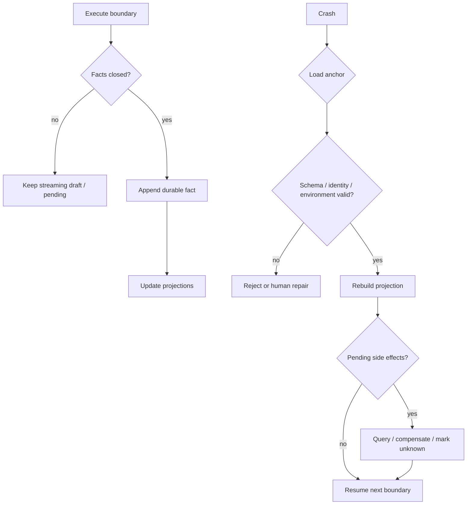
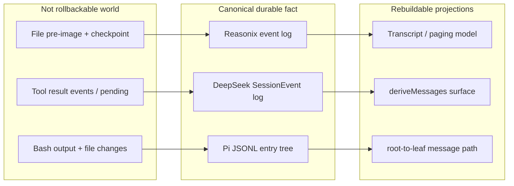

# 持久化与恢复对比

## 一句话结论

持久化的核心不是保存 UI 状态，而是保存足够回答「已经发生过什么」的权威事实。Reasonix 用 CAS 保护的兼容快照加 append-only event log 承接 rewind 和崩溃恢复；DeepSeek Harness 用带连续 `seq` 的事件日志做唯一事实源，模型历史只是派生 surface；Pi 用树状 JSONL entry 表达不可变历史，分支就是移动 leaf。三家的共同门槛是：恢复前先验证格式、身份和环境，再对账未决副作用。

## 上一章遗留问题

[X-03 工具协议对比](./tools.md) 回答了模型意图如何变成受控执行。本章解决它的尾部问题：执行产生的闭合事实存到哪里？崩溃后哪些事实能作为恢复起点？

## 本章解决什么矛盾

评估持久化和恢复时看八个问题：

1. 权威单元是消息、事件还是 entry？
2. 哪个操作完成后状态才算提交？
3. 模型历史是原始数据，还是可以重建的投影？
4. 半行日志、损坏 meta 和超大对象图分别怎么处理？
5. 恢复时如何防止旧进程和新进程双写？
6. 分支是复制、追加新事件，还是移动指针？
7. schema 变化后旧运行时会静默读错吗？
8. 文件已改、远端已调用、审批已通过这类外部世界如何对账？

## 核心不变量

1. **权威先于投影**：UI 转录和模型请求可以从权威日志重建；反过来不行。
2. **只保存闭合事实**：完整消息、配对工具结果和审批决定可入恢复锚点；流式草稿不能伪装成已发生事实。
3. **失败必须关闭**：不认识的必需结构要拒绝重建；不能用旧 checkpoint 覆盖可能更新的日志。
4. **身份与环境显式**：session ID、writer 身份、schema 版本、cwd 和 fork 血缘必须能检查。
5. **副作用有账**：本地文件 pre-image、远端调用结果和 unknown 状态要有独立记录；宇宙不会随 checkpoint 回滚。

## 理想模型

理想模型把「写日志」、「改视图」和「作用于外部世界」分开。提交完成指权威事实落盘并可解释；投影可以在之后重建；外部动作必须登记，不能假设它随内存消失。

## 初学者主线

可以把持久化想成会议纪要，而不是白板照片。直觉上，纪要让缺席者知道已经决定了什么；精确机制是：只有结束发言、形成决定并写入纪要的事实才能成为下一步依据；失效边界是，纪要不能撤回已经发出的邮件，只能记录「邮件已发出」这个事实。

Reasonix 同时维护「正式纪要」和「便于翻阅的摘要」。DeepSeek 只承认一条按序号排列的事件流水，所有视图都由它派生。Pi 把每条纪要写成带父指针的节点，换分支时不擦旧节点，只把当前指针移到另一条链。

## 统一存储模型

这张图强调三类数据的所有权：权威事实只能追加或受保护重写；投影可以删除后重建；外部世界只能被记录和对账，不能被恢复操作回滚。

| 维度 | Reasonix | DeepSeek Harness | Pi |
| --- | --- | --- | --- |
| 权威单元 | event log 为权威，`.jsonl` 是兼容 checkpoint 和分页读取模型 | 带 `seq` 的 append-only `SessionEvent` 日志 | coding-agent JSONL header 加 entry tree |
| 提交边界 | append/replace 写入后按语义 fsync；CAS 保护 snapshot/rewrite | 事件进入 canonical log 后成立；持久化后端负责 durability checkpoint | 完整 JSONL 行解析成功后进入 entries；迁移后重写文件再建索引 |
| 模型投影 | canonical transcript 加压缩投影 | `deriveMessages()` 遍历 surface | root 到 leaf 的 message path |
| 分支方式 | rewind/recovery 走受保护 rewrite 或 recovery branch | seed/end-seed 区分继承前缀与新工作；fork 由血缘和 `seedLength` 说明 | append 子节点；branch 移动 leaf |
| 版本策略 | event schema v1；重放预算防资源爆炸 | writer-centric format version；unknown required event 拒绝 | `CURRENT_SESSION_VERSION=3`；逐级迁移 |
| 主要风险 | 快照、meta sidecar 和 WAL 三件套复杂 | 事件量大，索引和投影必须高效 | 低层 Lane 与产品 Session 桥接必须一致 |

## 机制深拆

### Reasonix：CAS、双工件和安全 WAL

Reasonix 的 `Save` 明确禁止 force-overwrite。`.jsonl` 是兼容 checkpoint、发现锚点和 history paging 模型；event log 存在后才是权威（`external/DeepSeek-Reasonix/internal/agent/save.go:190-198`）。autosave 使用 `SaveSnapshot`，rewind、compaction 和 cancel recovery 必须走 `SaveRewrite`，redaction 再用 compact 折叠 WAL（`external/DeepSeek-Reasonix/internal/agent/save.go:200-218`）。

跨进程保存有 bounded lock wait，避免 CLI、旧 writer 或停滞进程让 UI 永久卡住；即将终止的 caller 可以利用 `ErrSessionFileLockHeld` 写 recovery branch（`external/DeepSeek-Reasonix/internal/agent/save.go:50-75`）。`sessionPersistState` 记录 digest、version、revision、`revisionKnown` 和 `saveVerified`。load 时 meta 可能落后于 transcript，所以只有本进程完成过一次完整 save 并确认两者一致的 baseline 才能启用 snapshot 快速路径；load 后第一次 save 必须全量执行并修复 stale ledger（`external/DeepSeek-Reasonix/internal/agent/save.go:83-104`）。

event log 只有 replace 和 append 两类。重放前限制 bytes、records、messages 和 collection items 四重预算，因为 compact JSON 解码后的对象图可能远大于字节数；超过预算时宁可拒绝，也不能退回旧 checkpoint（`external/DeepSeek-Reasonix/internal/agent/session_events.go:21-48`）。append 打开 `O_APPEND`，replace 强制 fsync，防止断电丢失整份转录（`external/DeepSeek-Reasonix/internal/agent/session_events.go:711-783`）。

### DeepSeek Harness：事件溯源和 resume barrier

DeepSeek Harness 把用户消息、assistant chunk、完整消息、usage、turn 边界、surface 操作和工具结果都写成事件。`SessionEventMap` 是 merge-extensible、append-only source of truth；message history derived from this log；每个事件都是无损 JSON，`seq` 连续，包括 raw chunk（`external/deepseek-harness/packages/core/session/src/types.ts:230-235`）。因此 UI 转录、模型请求和审计可以分别重建。

format version 由 writer 语义决定，不由 newer reader 能否 parse 决定。header shape、event envelope、core event semantics 或 surface mechanism 变化必须 bump；普通新增事件类型可用 per-event `ignorable` 覆盖；不确定时就 bump（`external/deepseek-harness/packages/core/session/src/types.ts:33-51`）。`ignorable` 缺席表示必需，unknown required event 必须拒绝重建，宁可过度拒绝也不恢复被删空的历史（`external/deepseek-harness/packages/core/session/src/types.ts:416-424`）。

resume 不是复制内存。`AgentLoop.resume()` 发现没有 `sessionPersistence` 就直接报错（`external/deepseek-harness/packages/core/agent-loop/src/index.ts:653-658`）。加载会被 caller cancellation、owner unload 和 factory teardown 融合成同一个 abort signal；永不返回的 prepare 不能 pin 住 identity（`external/deepseek-harness/packages/core/agent-loop/src/index.ts:662-703`）。seed/meta 携带完整存储事件、cwd、parent session、`seedLength` 和 delegation 信息（`external/deepseek-harness/packages/core/session/src/types.ts:108-135`），后续用 `session/end-seed` 分隔继承前缀和新工作。

### Pi：JSONL 树、迁移和恢复环境

Pi coding-agent 把会话写成 header 加 entry tree。entries append-only，不能修改或删除；branch 改变 leaf pointer，而不是删除历史（`external/pi/packages/coding-agent/src/core/session-manager.ts:1296-1300`）。坏父链不会被静默删除，orphan 会作为 root 出现在树视图中（`external/pi/packages/coding-agent/src/core/session-manager.ts:1305-1335`）。

loader 按 newline 流式解析，并用 `StringDecoder` 处理 UTF-8 chunk 边界；最后一段 pending 尾部单独尝试。因此断电留下的 torn final line 不会污染前面的完整 entry（`external/pi/packages/coding-agent/src/core/session-manager.ts:514-545`）。版本从 v1 到 v2 给每个 entry 生成 id/parentId，并把 compaction 的数组下标转换成 entry id，因为树化后下标不再是稳定身份；v2 到 v3 把 hookMessage role 改名 custom（`external/pi/packages/coding-agent/src/core/session-manager.ts:230-291`）。

resume 分两层。runtime 先发可取消的 before-switch，再打开 SessionManager，检查记录 cwd 是否存在，teardown 当前实例后才创建 reason 为 resume 的新 runtime（`external/pi/packages/coding-agent/src/core/agent-session-runtime.ts:203-223`）。文件层负责格式与迁移；runtime 层负责环境信任和扩展取消。

## 反例与故障模式

1. **把 `.jsonl` 当成 Reasonix 权威**
   - 触发：直接读兼容 checkpoint 判断最新状态。
   - 因果：event log 已存在且包含更新 turn，checkpoint 只是随机读取模型。
   - 观察：UI 显示旧对话，下一次写入又把旧投影当成基线。
   - 正确做法：event log 存在时以它重建，checkpoint 只作发现和分页辅助。
2. **load 后立刻走 snapshot no-op**
   - 触发：看到磁盘 transcript 存在就跳过保存。
   - 因果：meta sidecar 可能在上次保存中断后落后，baseline 未经本进程验证。
   - 观察：stale ledger 让 CAS 误判，真实更新被隐藏或冲突。
   - 正确做法：只有 `saveVerified` baseline 能快速返回；load 后首次 save 全量执行。
3. **超预算后回退旧 checkpoint**
   - 触发：Reasonix replay 超过 bytes/messages/items 预算时尝试降级。
   - 因果：旧 checkpoint 缺少 event log 中的较新 turns。
   - 观察：用户看到时间倒流，随后基于过期历史重复决策。
   - 正确做法：保持 session untouched，交给人工修复或扩大安全预算。
4. **用「能 parse」判断 DeepSeek 新日志可读**
   - 触发：新增必需字段后只测试 JSON parser。
   - 因果：parser 成功不代表重建语义正确，unknown required event 可能改变后续解释。
   - 观察：老 runtime 恢复出残缺会话并继续执行。
   - 正确做法：writer-centric bump；required-by-default；无法识别就拒绝。
5. **把 Pi orphan 当垃圾清理**
   - 触发：构建树时丢弃找不到 parent 的 entry。
   - 因果：坏父链可能是中断或迁移产物，也是诊断证据。
   - 观察：审计缺口被掩盖，后续 branch 选择失去事实。
   - 正确做法：按 Pi 语义把 orphan 显示为 root，交给人诊断。
6. **忽略 Pi 记录的 cwd**
   - 触发：目录被改名后仍自动 resume。
   - 因果：相对路径和工作区信任都建立在原环境上。
   - 观察：工具读到错误项目，或把新目录当作可信工作区。
   - 正确做法：`assertSessionCwdExists` 失败时要求人工选择迁移或放弃。
7. **把外部 API 调用记为「待执行」**
   - 触发：请求发出后、响应落盘前崩溃，重启后重试。
   - 因果：checkpoint 只知道意图，不知道远端是否已生效。
   - 观察：支付、部署或发送消息被执行两次。
   - 正确做法：登记 attempt ID 和 unknown 状态，resume 后查询、补偿或人工裁决。

## 一条完整因果链

任务是在长会话中修改配置并继续开发，进程在工具结果落盘前崩溃：

1. **触发**：编辑器写入配置文件成功，但进程在记录 tool result 前停止。
2. **本地状态**：文件系统出现新内容；权威日志缺少配对 result；恢复层只知道一个 open tool call。
3. **加载**：Reasonix 校验 CAS/baseline 并回放有效 WAL；DeepSeek 验证 seed、格式和 unknown required event；Pi 只接受完整 JSONL 行并迁移到当前版本。
4. **环境检查**：Reasonix 验证 baseline 所有权；DeepSeek 检查 persistence backend 和 owner signal；Pi 检查记录 cwd。
5. **对账**：三家都不能凭 checkpoint 回滚文件。Harness 应把该调用标成 unknown/pending；M-09/M-10 定义的原则是查询结果、补偿或交人工，具体业务接口由宿主实现。
6. **观察结果**：合法前缀保留，torn tail 不进入历史；open call 得到明确状态，而不是被静默当作成功。
7. **后续影响**：用户批准恢复后，新进程在闭合边界追加新事实；旧进程若仍持有租约，必须被拒绝或引导写 recovery branch。

这条链说明：持久化保证的是可解释性，不是外部世界事务。恢复安全的最后一公里永远是对账。

## 设计取舍

| 取舍 | Reasonix | DeepSeek Harness | Pi |
| --- | --- | --- | --- |
| 直观恢复 | rewind 对编码用户直观，但要维护快照、meta 和 WAL | 事件粒度最利于审计，但索引和投影成本更高 | 树状分支轻量直观，但两层 Session 概念易混淆 |
| 安全方向 | 宁可拒载也不退回旧 checkpoint；bounded lock 防 UI 卡死 | 宁可过度拒绝也不恢复残缺历史；不确定就 bump version | 宁可显示 orphan 也不悄悄修复；非法文件不改写 |
| 适用场景 | 桌面/CLI 编码工具需要回合级 rewind | 企业服务需要多投影、协议桥和严格演进 | 本地 SDK 需要轻量分支、压缩和环境检查 |

## 框架实现对照

以下结论继承 M-10 和 M-11；固定快照为 Reasonix `aa82b2f`、DeepSeek Harness `b150a55`、Pi `c49906e`。

| 框架 | 关键行为 | 锚点 |
| --- | --- | --- |
| Reasonix | `Save` 无 force-overwrite；snapshot/rewrite/compact 分离；bounded file lock 与 recovery branch；meta lag 后禁用快速路径；WAL 有四重重放预算，append/replace 控制同步强度。 | `internal/agent/save.go:50-104,190-218`、`internal/agent/session_events.go:21-48,92-103,711-783` |
| DeepSeek Harness | resume 必须配置 persistence backend；prepare 受融合 abort signal 保护；canonical SessionEventMap 含连续 seq；writer-centric version bump；unknown required event 拒绝重建。 | `packages/core/agent-loop/src/index.ts:653-703`、`packages/core/session/src/types.ts:33-56,108-135,230-235,408-436` |
| Pi | runtime resume 发可取消 before-switch、检查 cwd 后替换实例；SessionManager 打开/校验/迁移/建索引；JSONL loader 只接受完整行；entry tree append-only，branch 移动 leaf。 | `packages/coding-agent/src/core/agent-session-runtime.ts:203-223`、`packages/coding-agent/src/core/session-manager.ts:30,230-291,514-545,1296-1345` |

## 实现精妙之处

1. **Reasonix 的双工件分工诚实**：`.jsonl` 不冒充权威，而是承担兼容、发现和分页职责。
2. **Reasonix 的 save intent 显式化**：snapshot、rewrite 和 redaction 是不同 API，降低误用概率。
3. **DeepSeek 的 abort fusion**：慢存储加载也服从 caller、owner 和 factory 任一取消信号。
4. **DeepSeek 的 end-seed marker**：用位置和时间表达继承边界，避免每次 pickup 复制额外数据。
5. **Pi 的 index-to-id migration**：主动承认树化后数组下标不再是稳定引用。
6. **Pi 的 orphan-as-root**：把异常暴露成可见节点，给修复留证据。
7. **三家共同点**：canonical log 与投影分离；修正历史靠新事实或新分支，不靠覆盖记忆。

## 自检与面试追问

1. 你的系统里哪份文件不可重建？如果它损坏，RPO 是多少？
2. 为什么新增普通事件类型不一定 bump format version？举一个必须 bump 的结构变化。
3. 如何设计 JSONL loader，既容忍 torn tail，又不吞掉中间行的损坏？
4. 两个设备离线各自 append 同一逻辑会话，冲突的审批决定该如何合并？
5. 为一个外部支付 API 设计 outbox 字段和状态机，使 resume 后不会重复扣款。
6. v2 到 v3 迁移中途崩溃后，下次启动应如何继续而不产生混合格式？

## 交给下一章的问题

X-04《安全与审批对比》将接着回答：危险工具在执行前后由谁拦截？缺省审批应 allow 还是 deny？注入内容和越权副作用如何在权限层兜底？

## 相关页面

- [教材目录](../TOC.md)
- [Checkpoint 与 Resume](../02-harness-mechanics/checkpoint-resume.md)
- [Persistence](../02-harness-mechanics/persistence.md)
- [Retry 与幂等](../02-harness-mechanics/retry-idempotency.md)
- [Timeout 与 Cancellation](../02-harness-mechanics/timeout-cancellation.md)
- [工具协议对比](./tools.md)
- [术语表](../09-glossary/glossary.md)
