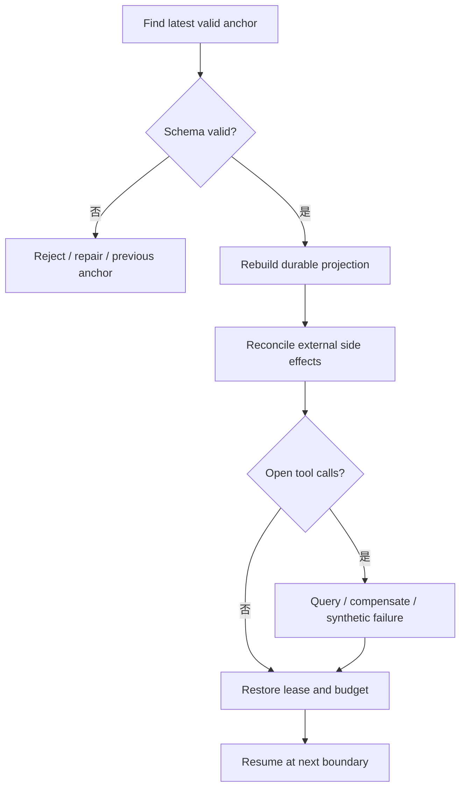

# 持久化与恢复对比

## 一句话结论

恢复的关键不是保存 UI，而是保存足够回答“已经发生过什么”的事实。Reasonix 以消息历史加文件快照 checkpoint 为中心；DeepSeek Harness 以带序号的事件日志为中心，模型历史只是派生 surface；Pi 以树状 JSONL entry 为中心，leaf 指针决定当前分支。三家的共同不变量是：工具调用必须有配对结果或明确失败，恢复前必须重建权威投影。

## 统一恢复流程

持久化要回答五个问题：

1. 权威单元是消息、事件还是树节点？
2. 什么时刻算提交完成？
3. 哪些投影可以重建，哪些必须单独保存？
4. 崩溃后如何处理半写日志和未闭合调用？
5. 恢复时如何防止旧进程和新进程双写？

## 存储模型对比

| 维度 | Reasonix | DeepSeek Harness | Pi |
| --- | --- | --- | --- |
| 权威单元 | Session 消息、版本化重写和 checkpoint。 | 带 `seq` 的 append-only Session events。 | coding-agent JSONL entry；通用侧另有 LaneRecord。 |
| 模型投影 | canonical transcript 加压缩投影。 | `deriveMessages()` 遍历 surface。 | root 到当前 leaf 的 entry path。 |
| 分支方式 | rewind 显式分叉，父会话不截断。 | fork 校验边界，seedLength 区分父历史。 | 新 entry 指向 parent；分支移动 leaf。 |
| 恢复辅助 | checkpoint sidecar 与损坏修复。 | 事件日志、header 和 flush。 | JSONL header、追加行、torn-tail 修复。 |
| 主要风险 | 快照与事件日志双轨复杂。 | 事件量大，投影和索引要高效。 | 两层 Session 概念需要正确桥接。 |

## Reasonix：消息快照与文件 checkpoint

Reasonix 的 Session 保存消息历史、版本号、rewrite 版本、持久化进度和损坏标记。Run 循环是消息历史的唯一写入者；跨 goroutine 读取走锁保护。失败采样不进入历史，干净采样才提交，因此恢复时不会把畸形模型输出当成事实。

checkpoint 独立于 git，是会话 sidecar。每个用户回合创建一个 checkpoint；编辑工具执行前保存 pre-image。同一回合内按路径去重，只保存第一次触碰前内容。Bash 副作用不进入 checkpoint，因为无法静态判断它改了哪些文件；高风险 Bash 由权限层拦截。

恢复时用户可以恢复代码、会话或两者，也可以从锚点分叉。父会话不被截断。事件日志损坏时可回放有效前缀，checkpoint 作为兼容兜底；具体 CAS、迁移和 recovery fork 细节保留待审。

## DeepSeek Harness：事件日志与 surface

DeepSeek Harness 把用户消息、assistant chunk、完整消息、usage、turn/step 边界和工具结果都追加成事件。`Session.append` 同步进入日志后才算提交；持久化插件异步缓冲，并通过 `session/flush` 提供显式 durability checkpoint。header 保存格式版本、cwd、fork lineage、seedLength、delegation depth 和 agent preset。

模型可见历史来自 `deriveMessages()`。它遍历 surface 节点，跳过 turn 边界等不产生消息的事件；压缩通过 `surfaceOp: replace` 遮蔽旧范围，但原始事件仍在日志中。因此 UI 转录、模型请求和审计可以分别重建。

取消和失败也被事件化。abort 时保留稳定前缀，工具调度器 drain 已启动任务并为未启动调用补写 synthetic result；内部调度器失败不伪造结果。Turn 终态包括 completed、blocked、aborted、error、max-tokens 和 interrupted。

## Pi：树状 JSONL 与安全切点

Pi coding-agent 的 SessionManager 把会话保存为 append-only JSONL 树。每个 entry 有 `id` 和 `parentId`；追加创建当前 leaf 的子节点并推进 leaf，分支把 leaf 移到较早节点，之后的新工作形成新子链。`buildSessionContext()` 沿 root 到 leaf 重组消息，并处理 compaction summary。

通用 agent 包另有 JSONL Session Storage 和 LaneRecord。低层存储会原子发布完整文件；加载时遇到最后一行 torn tail 会丢弃未确认的部分追加，并原子发布有效前缀。编码产品的 `AgentSession` 负责把稳定消息桥接到 SessionManager，同时维护压缩、重试和 Bash abort controller。

这个模型让分支显式、历史不可变。恢复单位是 entry 与 leaf，而不是整份快照；但两层 Session 概念要求宿主正确区分低层 Lane 状态和编码产品 entry 树。

## 取消、重试与外部副作用

| 场景 | Reasonix | DeepSeek Harness | Pi |
| --- | --- | --- | --- |
| 模型流中断 | 保存稳定前缀、估算 usage 和恢复记录。 | append interrupted assistant message。 | streaming draft 只在 `message_end` 进入内存历史。 |
| 工具取消 | 先写入本批结果，再返回错误，保持配对。 | drain 已启动任务，未启动补 synthetic result。 | abort 停止后续执行；已稳定结果继续收尾。 |
| 模型重试 | 失败采样不改 Session。 | request-error waterfall 可返回 retry。 | AgentSession 处理压缩、重试或继续。 |
| 预算暂停 | 给一轮总结宽限或可续跑暂停。 | max-tokens 在 Turn 内保持 sticky。 | prepareNextTurn 可检查预算并要求停止。 |
| 外部世界 | checkpoint 不覆盖 Bash 副作用。 | 工具结果事件可审计，但外部对账接口待审。 | Bash 输出和文件副作用由工具与会话层记录。 |

共同规则是：重试不是删除错误，而是追加新观察；无法确认结果的外部动作必须标记状态未知，恢复后查询、补偿或交给人工。

## 设计取舍

- **优点**：Reasonix 的 rewind 对编码用户直观；DeepSeek 的事件溯源最适合审计和多投影；Pi 的树状 entry 天然支持分支和不可变历史。
- **代价**：Reasonix 要同时维护快照、事件日志和 sidecar；DeepSeek 的事件粒度和锁协议较细；Pi 需要在低层 Lane 与产品 SessionManager 之间保持语义一致。
- **适用判断**：需要“回到某个用户回合”的编码工具可借鉴 Reasonix；需要长会话审计、fork 和协议桥时选 DeepSeek 风格；需要轻量本地分支和压缩时可学习 Pi 的树状 JSONL。

## 自检问题

1. 三家分别把什么作为恢复的最小事实？
2. 为什么 assistant chunk 在 DeepSeek 中可以持久化，而在 Pi 低层只是流式草稿？
3. Bash 副作用为什么不能自动进入文件快照？
4. 恢复时发现一个未闭合 tool call，应该先查询还是先补偿？
5. 两个进程同时 resume 同一 Session 时，缺少什么会双写？

## 相关页面

- [教材目录](../TOC.md)
- [安全与审批对比](./security.md)
- [Persistence](../02-harness-mechanics/persistence.md)
- [Checkpoint 与 Resume](../02-harness-mechanics/checkpoint-resume.md)
- [Retry 与幂等](../02-harness-mechanics/retry-idempotency.md)
