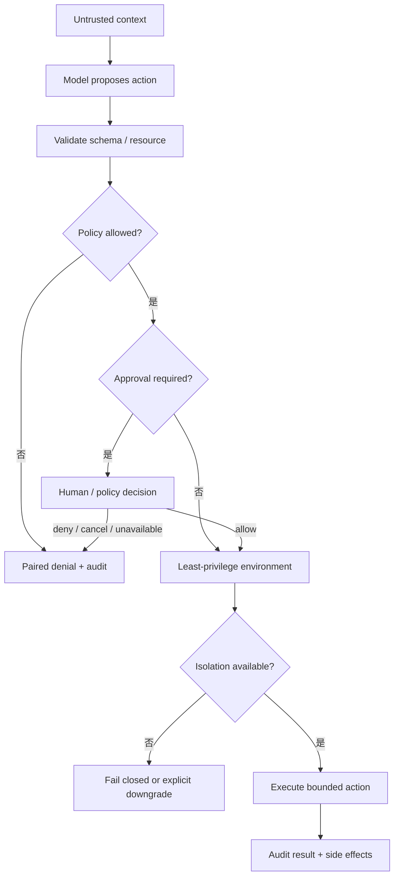

# 安全与审批对比

## 一句话结论

三家的共同底线是“模型请求不是执行许可”。Reasonix 用长策略链加操作系统沙箱治理本地副作用；DeepSeek Harness 用 pre-execute 瀑布、单调 guard、可注入 ApprovalService 和 Landlock 组合边界；Pi 把项目信任当资源加载闸门，真正的隔离交给 Gondolin、Docker 或 OpenShell。差异集中在三个问题：无审批者时是否继续、隔离失败时是否降级，以及批准的证据保存到哪一层。

## 统一安全决策链



安全设计必须区分三类内容：

| 内容 | 示例 | 正确处理 |
| --- | --- | --- |
| 可信指令 | 用户任务、系统策略 | 明确来源和变更方式 |
| 不可信数据 | README、网页、工具输出 | 可进入上下文，不能自动改变权限 |
| 执行能力 | 文件写、网络、进程 | Schema 校验后仍要策略、审批或沙箱 |

## 框架对照

| 维度 | Reasonix | DeepSeek Harness | Pi |
| --- | --- | --- | --- |
| 默认执行面 | 本地进程权限，但调用经过长治理链。 | 服务管线内执行；Shell 可进 Landlock。 | Pi 进程权限；无内置沙箱。 |
| 输入信任闸门 | Plan mode 与 Contextual visibility 分阶段限制。 | Code collapse 在策略前确定性拒绝被折叠调用。 | 项目信任决定是否加载项目资源。 |
| 权限表达 | mode、allow、ask、deny、session allow。 | pre-execute 决策、scope restrict、monotonic guard。 | before hook block；外部边界由宿主装配。 |
| 审批通道 | `Approver` 与 Controller 审批面。 | 注入式 ApprovalService。 | Extension API 与宿主 UI 能力。 |
| 隔离技术 | macOS sandbox-exec、Linux bubblewrap、writable roots。 | Linux landlock-run 及平台 shell 后端。 | Gondolin micro-VM、Plain Docker、OpenShell。 |
| 失败默认 | reader fallback 放行；writer 由配置模式决定。 | ask 无服务、不可路由或不可用时拒绝。 | 官方文档明确要求用外部边界隔离不可信任务。 |

## Reasonix：策略链与显式逃逸

Reasonix 把治理放在单次调用管线中。名称解析后依次经过扩展前置、Plan/proxy、Contextual gate、交付门控、变更屏障、Auto Guard、权限 Gate、写租约和 OS 沙箱。权限优先级是：

```text
Deny > SessionAllow > Ask > Allow > fallback
```

fallback 对只读工具放行；writer 使用宿主配置模式。多个 subject 必须全部安全，例如 move 的源路径和目标路径都要通过检查。Bash 有单独分类：可复用只读命令、需要精确匹配的命令和需要人工确认的命令走不同路径；动态 shell 形式不会被宽泛 allow rule 自动放行。

Auto Guard 位于权限前，可以建议或阻断状态变更、验证命令和恢复期后的动作，但它不替代权限和沙箱。沙箱提供 writable roots 和 Escape Approver；启动失败时可以请求用户显式批准逃逸重跑，也可以配置为不运行 Bash。非交互模式没有 Approver 时保持自主性，这是宿主必须显式选择的取舍。

## DeepSeek Harness：失败关闭的策略瀑布

DeepSeek Harness 的安全点分散在可组合层中。`tools/pre-execute` 可以 allow、deny 或 ask；ask 只在 ApprovalService 返回 `allowed-once` 后执行。服务缺失、不可用或没有 agent 可路由时都拒绝。pre-execute 后的 monotonic guard 只能追加拒绝理由，不能覆盖前面的 deny。

Linux Shell 使用 `landlock-run`。启动器先限制自身，再 `exec` 目标命令；Landlock 规则跨 `execve` 继承，因此子进程也被约束。未授予路径默认拒绝，内核无法强制时按失败闭合处理。退出码 `125` 是启动器失败约定信号，但消费方还要结合诊断，不能只看退出码。

这个设计的优点是策略、guard、body 和 post-execute 职责清晰；代价是宿主必须正确提供 approval、sandbox 和 code runtime。Code Mode 还会改变直接工具面，调试时要同时检查父调用与子 dispatch 是否共享同一安全假设。

## Pi：信任闸门加外部边界

Pi 官方文档明确说明没有内置沙箱。项目信任只是资源加载闸门，决定是否加载 `.pi/settings.json`、扩展、技能、提示、主题等项目资源；它不限制已加载工具后续能做什么。内置工具和 TypeScript 扩展都以 Pi 进程权限运行。

Pi 提供三种外置模式。Gondolin 扩展把内置工具和 `!` 命令路由进本地 Linux micro-VM，认证留在宿主，工作目录写回宿主；自定义工具若未被替换仍在宿主。Plain Docker 包住整个 Pi，简单但 API key 进入容器，读写挂载仍能改宿主文件。OpenShell 通过 gateway 提供文件、进程、网络、凭证和推理策略；远端模式不自动 bind mount，配置推理路由后原始 provider key 可以留在沙箱外。

因此 `ExecutionEnv` 是依赖注入接口，不是安全边界。把工具移到另一个环境只是改变执行位置；只有环境本身具备强制访问控制时才形成隔离。

## 审批语义

| 问题 | Reasonix | DeepSeek Harness | Pi |
| --- | --- | --- | --- |
| 审批对象 | 工具、参数、路径、命令分类和 diff 预览。 | execution 快照与 pre-execute ask。 | 由扩展或宿主决定请求投影。 |
| 批准结果 | SessionAllow 或本次决策进入策略。 | `allowed-once` 放行当前调用。 | 取决于扩展实现的决策与记忆逻辑。 |
| 拒绝结果 | 生成明确反馈，提示换方案而不是原样重试。 | denied/cancelled/unavailable 都成为结构化错误。 | hook block 生成错误 tool result。 |
| 缺失审批 | 非交互 nil Approver 显式保留自主性。 | 失败关闭。 | 无统一框架级审批服务；由宿主装配决定。 |

可靠审批至少要回答四个问题：批准的是哪个确切动作？证据是否包含 diff、目标资源和不可撤回性？决策能否绑定到这次执行？拒绝和取消是否会回到模型？

## Prompt Injection 兜底

Prompt Injection 应该被当作必然风险，而不是靠系统提示消除的异常。三家的可用防线相同：

1. 外部文档和工具结果可以进入上下文，但不能自动提升权限。
2. 参数中的路径、URL、命令和嵌套 JSON 要重新校验。
3. 高危动作必须有策略、审批或沙箱兜底。
4. 拒绝、越界和异常输出都要留下可审计观察。

框架差异在于兜底的强度。Reasonix 有多层本地治理；DeepSeek 对未知、折叠、审批缺失和 Landlock 失败采取确定性拒绝；Pi 更依赖用户正确选择容器化模式，并避免挂载不必要的凭证和目录。

## 设计取舍

- **优点**：Reasonix 适合强治理桌面/CLI 场景；DeepSeek 的单调 guard 和失败关闭便于企业组合策略；Pi 的外置边界选择灵活，能把认证、工作区和推理路由分开管理。
- **代价**：Reasonix 管线复杂且平台差异多；DeepSeek 需要宿主完整提供服务；Pi 的安全性高度依赖部署配置，误用读写挂载或加载恶意扩展会抵消隔离。
- **适用判断**：不可信代码优先选择 DeepSeek 式失败关闭或 Pi/OpenShell 整进程边界；本地可信项目可用 Reasonix 的细粒度策略提高效率；任何场景都不应把项目信任或提示词当成唯一防线。

## 自检问题

1. 为什么项目信任不是沙箱？
2. DeepSeek 的 guard 为什么只能拒绝而不能放行？
3. Reasonix 的 Escape Approver 为什么必须是显式决策？
4. 一个网页诱导 Agent 发送密钥时，三家的哪几层应该阻断？
5. 审批服务超时时，哪种默认对不可信仓库更安全？

## 相关页面

- [教材目录](../TOC.md)
- [工具协议对比](./tools.md)
- [Sandbox 与权限](../02-harness-mechanics/sandbox.md)
- [审批模型](../02-harness-mechanics/approval.md)
- [Prompt Injection 与工具安全](../02-harness-mechanics/prompt-injection.md)
