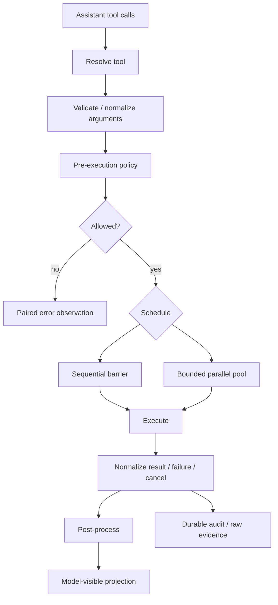
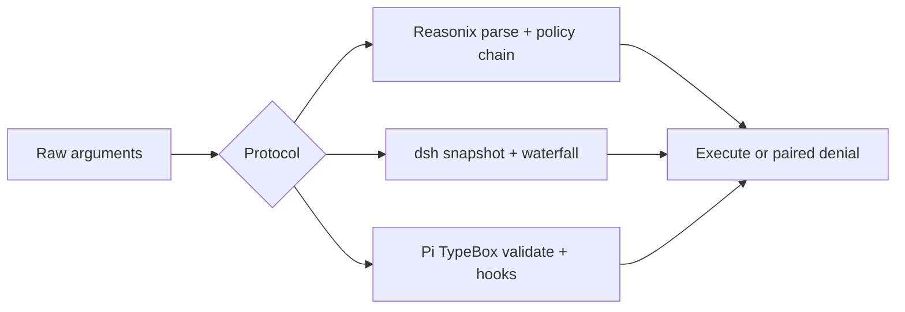

## 一句话结论

三家的共同骨架是"定义面→参数校验→调度→治理→执行→结果投影"。Reasonix 用 Go 接口把静态 Schema 和运行时效果分类分开，用长管线叠加七道门；DeepSeek Harness 把注册表、策略瀑布和输出契约放进一个可组合的 Tools Service，用 monotonic deny 保证安全取交集；Pi 用低层 AgentTool 加宿主扩展定义工具，并用显式 ExecutionEnv 承接副作用。关键分歧是：谁判断能否并行、缺审批时是否失败关闭，以及原始大输出存在哪一层。

## 上一章遗留问题

X-02 对齐了 Context 策略。X-03 把 [Tool Schema 与调用协议](../02-harness-mechanics/tool-schema.md)、[Tool 执行与副作用](../02-harness-mechanics/tool-execution.md)、[Tool 结果处理与截断](../02-harness-mechanics/tool-results.md)、[审批模型](../02-harness-mechanics/approval.md) 和 [Sandbox 与权限](../02-harness-mechanics/sandbox.md) 的机制差异横向对齐到七个维度。

## 本章解决什么矛盾

评估一个工具协议时看七个问题：

1. 模型看到的名字和描述如何进入请求？
2. 参数在哪里校验？校验后还能否被改写？
3. 一批调用的并行与串行由什么决定？
4. 审批缺失或用户拒绝时的安全默认是什么？
5. 取消后每个 tool call 是否都有配对 result？
6. 大输出的完整证据保存在哪里？
7. 新工具能否携带自己的 UI 投影和执行环境？

## 统一调用生命周期

## 协议对照

| 维度 | Reasonix | DeepSeek Harness | Pi |
| --- | --- | --- | --- |
| 定义核心 | Tool 接口加可选能力接口 | defineTool 产生 ToolDefinition | AgentTool 加 coding-agent ToolDefinition |
| 参数契约 | JSON Schema 原始消息 | JSON Schema 要求无损序列化 | TypeBox Schema |
| 输出契约 | 文本为主图片走独立通道 | 强制 output schema render presentation meta | content 加 details 支持文本和图片 |
| 并发信号 | ReadOnly() | isConcurrencySafe(args) 精确 true | 工具级或全局 executionMode |
| 治理中心 | Hook Gate Guard 写锁沙箱长管线 | pre-execute approval ask monotonic guard post-execute | before after hook 加 ExecutionEnv 外部边界 |
| 大结果 | 有界 Provider 内容完整原文放本地 raw | canonical value 与模型 UI 投影分离 | 模型内容与 UI details 分离 Bash 超限保存临时文件 |
| 主要扩展 | 插件 MCP Hook Previewer 事件 Sink | scope waterfall pruner approval service Code Mode | registerTool 自定义渲染 Harness tool ExecutionEnv |

## 定义面与名称解析

### Reasonix：静态缓存与动态可见性分离

Reasonix 的基础接口包含 Name Description Schema Execute 和 ReadOnly。内置工具编译期自注册；每个 Run 再构造独立 Registry 合并启用项插件和 MCP 工具。

Provider 请求使用稳定排序的 Schema 投影；隐藏工具仍可通过内部 capability dispatch 执行。ContextualTool.ProviderVisible 可以按阶段改变宿主可见性但不让 Provider Schema 随阶段频繁变化。MCP 别名会解析到规范目标；歧义引用被拒绝而不是随机选择。

### DeepSeek Harness：注册表即服务管线

dsh-tools 同时负责注册 Schema 投影 scope 隔离和执行流水线。工具用 defineTool 声明名称描述参数 Schema 执行函数和可选展示方法。参数必须是无损 JSON；成功结果还要符合工具声明的 output schema。

Registry 支持 Code Mode：模型可以调用 run_code 程序内部再桥接已声明工具。子调用有独立日志事件但不会重新作为顶层消息进入模型上下文。

### Pi：低层工具加宿主装配

低层 AgentTool 包含名称描述 TypeBox 参数执行函数和可选 executionMode。coding-agent 层扩展 ToolDefinition 再增加 prompt snippet prompt guidelines custom rendering 和 registerTool 装配点。

## 校验与前置治理

三家都在执行前校验参数但治理粒度不同。

Reasonix 先解析规范名称和参数再经过 Plan 模式上下文可用性交付门控变更屏障 Auto Guard 权限 Gate 写锁和沙箱。权限优先级 Deny 大于 SessionAllow 大于 Ask 大于 Allow 大于 fallback。

DeepSeek Harness 在创建 execution 时快照并冻结参数。tools/pre-execute 可返回 allow deny 或 ask；ask 交给可注入 ApprovalService 服务缺失或不可用时拒绝。pre-execute 后的 monotonic guard 只能追加拒绝不能解锁前面的 deny。

Pi 先查找工具再做 TypeBox 校验和兼容转换。beforeToolCall 返回 block 时生成错误 result；afterToolCall 能整体替换 content details error flag 等字段不做深合并。真正的文件和进程边界由 ExecutionEnv 决定 Pi 本身不提供内置沙箱。

## 并发与取消

| 行为 | Reasonix | DeepSeek Harness | Pi |
| --- | --- | --- | --- |
| 默认倾向 | 已知只读才并行 writer 或未知保持顺序 | 只有精确 true 进入 parallel pool 否则 exclusive | 全局默认 parallel 任一 sequential 让整批串行 |
| 并发上限 | 只读批量和 writer 顺序约束控制 | rolling pool 默认上限 10 | Promise 并发无固定 rolling pool 上限 |
| 重分类 | writer 运行后刷新后续写入预览 | 后续 call 启动前重新读取 execution mode | 批开始时决定 sequential parallel |
| 提交顺序 | 保持 Provider 顺序 | dispatch 可重叠 policy result context 按模型顺序提交 | end event 按完成序 tool result artifact 按源顺序 |
| 取消语义 | 未执行调用补齐 cancelled blocked 结果 | drain 已启动任务未启动补 synthetic result | abort 后停止后续执行已稳定结果继续收尾 |

共同不变量是不能留下悬空 tool call。取消不是删除记录；系统要么等待已开始工作静止要么为未执行调用补齐明确结果。

## 结果与大输出

Reasonix 给模型的是第一层有界输出；截断发生时完整原文保存在本地 raw output 只有显式分页才进入模型上下文。图片与文本分开传输。

DeepSeek Harness 把 canonical value 模型内容和展示 meta 分开。output schema 约束成功结果；post-execute 可以接受替换投影附加下一轮上下文或把 corrective feedback 变成错误结果。所有失败仍转成结构化 isError 观察。

Pi 把模型可见 content 与 UI details 分开。Bash 输出按行数和字节数截断超限完整输出保存到临时文件并在模型可见尾部说明截断信息。工具可通过 partial update 流式报告进度；全部 finalized result 都带 terminate hint 时当前工具批提前结束。

## 反例与故障模式

1. **隐藏但仍可执行的工具被遗忘**
   - 触发：Reasonix provider-visible allowlist 移除了某工具但 capability dispatch 仍可达。
   - 因果：注入内容通过 use_capability 调用被隐藏的危险工具。
   - 正确边界：executeOne 在 proxy 解析后重查 contextual gate。
2. **DeepSeek collapse 直接调用消耗审批资源**
   - 触发：把 collapse 检查放到 approval 后。
   - 因果：每次误调用都弹一次审批用户疲劳后乱批。
   - 正确边界：确定性拒绝前置并携带 run_code 路由提示。
3. **Pi 任一 sequential 不影响其他并行**
   - 触发：以为 sequential 只约束自身。
   - 因果：一个 sequential 工具让整批变 serial 其他并行工具也被拖慢。
   - 正确边界：这是有意设计保证写入顺序。
4. **Reasonix glob 绕过 danger warning**
   - 触发：rm 变体不匹配 rm -rf* pattern。
   - 因果：UI 未高亮用户误批。
   - 正确边界：pattern 仅提示 enforcement 在 policy/shellsafe。
5. **DeepSeek guard force-allow**
   - 触发：租户插件实现 override。
   - 因果：打破 monotonic deny 注入内容解锁已拒绝调用。
   - 正确边界：deny 单调是框架约束不是约定。
6. **取消后丢弃 body promise**
   - 触发：abort 直接 return。
   - 因果：后台任务继续写共享状态结果丢失。
   - 正确边界：await quiescence 再标 ABORTED。
7. **审批服务不可用默认 allow**
   - 触发：headless 部署忘配 ApprovalService。
   - 因果：应询问的操作静默执行。
   - 正确边界：degrade to deny reason 注明 not yet supported。

## 一条完整因果链

同一个"修改配置文件并运行测试"的任务在三家中的路径：

1. **Reasonix**：Controller.Send → Agent.Run → executeBatch → executeOne（parse → confineWrite → mutation barrier → permission gate）→ gracePause（预算触顶）。恢复时 checkpoint + writeAuth 确保不双写。
2. **DeepSeek Harness**：ctx.agents.resume → turn() → preStep → step → executeToolCalls（pre-execute ask → serviceAsk 四态 → guard → ordered commit）→ turn/end（max-tokens sticky）。恢复时 SessionHeader 确保身份/深度/能力一致。
3. **Pi**：AgentSession.prompt → runAgentLoop（双层循环）→ executeToolCalls（mutation queue + killProcessTree）→ turn_end → agent_end（等订阅者完成）。恢复时 SessionManager 打开 JSONL 树并迁移版本。

同一条因果链在三家中的差异不在步骤数而在每步的控制权归属和状态写入格式。

## 设计取舍

| 取舍 | Reasonix 选择 | DeepSeek Harness 选择 | Pi 选择 |
| --- | --- | --- | --- |
| 控制权 | 集中 Controller 七道门 | Cordis waterfall + monotonic guard | 低层 hook + ExecutionEnv |
| 状态格式 | 有界 Content + raw + receipt | append-only event + surface replace | JSONL entry tree |
| 并发安全 | ReadOnly 接口 + scheduler | isConcurrencySafe + rolling pool | executionMode + mutation queue |
| 审批缺失 | nil Approver 由宿主取舍 | degrade to deny 四态 | block immediate error |
| 适用场景 | 多端桌面强治理 | 服务化企业策略 | 多宿主轻量 SDK |

## 自检与面试追问

1. 如果你的团队要选一个框架作为基座，工具安全维度应该比较哪些子项？
2. 三家的"不可绕过最小集"分别是什么？哪家的最少？
3. 如果要构建一个跨平台的统一沙箱层应该抽象哪些接口？三家各自缺什么？
4. Reasonix 的七道门和 DeepSeek 的五层瀑布哪个更容易正确配置？为什么？
5. 你自己的 Harness 目前在哪个维度最弱？参照三家补齐的最小改动是什么？

## 交给下一章的问题

本章对齐了工具协议与安全。X-04《持久化与恢复对比》将把 M-10/M-11 的机制差异按存储格式、崩溃一致性和版本迁移逐项对齐。

## 相关页面

- [教材目录](../TOC.md)
- [Tool Schema 与调用协议](../02-harness-mechanics/tool-schema.md)
- [Tool 执行与副作用](../02-harness-mechanics/tool-execution.md)
- [Tool 结果处理与截断](../02-harness-mechanics/tool-results.md)
- [审批模型](../02-harness-mechanics/approval.md)
- [Sandbox 与权限](../02-harness-mechanics/sandbox.md)
- [架构风格对比](./architecture.md)
- [Context 策略对比](./context.md)
- [Reasonix 工具与审批](../03-frameworks/reasonix/tools-approval.md)
- [DeepSeek Harness 工具与沙箱](../03-frameworks/deepseek-harness/tools-sandbox.md)
- [Pi 工具与容器化](../03-frameworks/pi/tools-containerization.md)
- [术语表](../09-glossary/glossary.md)
