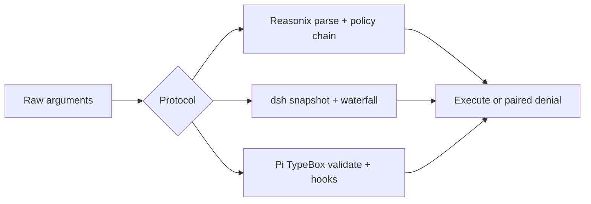

# 工具协议对比

## 一句话结论

三家的共同骨架是“定义面 → 参数校验 → 调度 → 治理 → 执行 → 结果投影”。Reasonix 用 Go 接口把静态 Schema 和运行时效果分类分开；DeepSeek Harness 把注册表、策略瀑布和输出契约放进一个可组合的 Tools Service；Pi 用低层 `AgentTool` 加宿主扩展定义工具，并用显式 `ExecutionEnv` 承接副作用。关键分歧是：谁判断能否并行、缺审批时是否失败关闭，以及原始大输出存在哪一层。

## 统一调用生命周期

评估一个工具协议时看七个问题：

1. 模型看到的名字和描述如何进入请求？
2. 参数在哪里校验？校验后还能否被改写？
3. 一批调用的并行与串行由什么决定？
4. 审批缺失或用户拒绝时的安全默认是什么？
5. 取消后每个 tool call 是否都有配对 result？
6. 大输出的完整证据保存在哪里？
7. 新工具能否携带自己的 UI 投影和执行环境？

## 协议对照

| 维度 | Reasonix | DeepSeek Harness | Pi |
| --- | --- | --- | --- |
| 定义核心 | `Tool` 接口加可选能力接口。 | `defineTool` 产生 `ToolDefinition`。 | `AgentTool` / coding-agent `ToolDefinition`。 |
| 参数契约 | JSON Schema 原始消息。 | JSON Schema 要求无损序列化。 | TypeBox Schema。 |
| 输出契约 | 文本为主，图片走独立通道。 | 强制 output schema、render 和 presentation meta。 | `content` 加 `details`，支持文本和图片。 |
| 并发信号 | `ReadOnly()`。 | `isConcurrencySafe(args)` 只认精确 `true`。 | 工具级或全局 `executionMode`。 |
| 治理中心 | Run 内长管线：Hook、Gate、Guard、写锁、沙箱。 | pre-execute、approval ask、monotonic guard、post-execute。 | before/after hook 加 `ExecutionEnv` 外部边界。 |
| 大结果 | 有界 Provider 内容，完整原文放本地 raw。 | canonical value 与模型/UI 投影分离。 | 模型内容与 UI details 分离；Bash 超限保存临时文件。 |
| 主要扩展 | 插件/MCP、Hook、Previewer、事件 Sink。 | scope、waterfall、pruner、approval service、Code Mode。 | `registerTool`、自定义渲染、Harness tool、ExecutionEnv。 |

## 定义面与名称解析

### Reasonix：静态缓存与动态可见性分离

Reasonix 的基础接口包含 `Name`、`Description`、`Schema`、`Execute` 和 `ReadOnly`。内置工具编译期自注册；每个 Run 再构造独立 Registry，合并启用项、插件和 MCP 工具。

Provider 请求使用稳定排序的 Schema 投影；隐藏工具仍可通过内部 capability dispatch 执行。`ContextualTool.ProviderVisible(ctx)` 可以按阶段改变宿主可见性，但不让 Provider Schema 随阶段频繁变化。MCP 别名会解析到规范目标；歧义引用被拒绝，而不是随机选择。

### DeepSeek Harness：注册表即服务管线

`@deepseek-ai/dsh-tools` 同时负责注册、Schema 投影、scope 隔离和执行流水线。工具用 `defineTool` 声明名称、描述、参数 Schema、执行函数和可选展示方法。参数必须是无损 JSON；成功结果还要符合工具声明的 output schema。

Registry 支持 Code Mode。模型可以调用 `run_code`，程序内部再桥接已声明工具；子调用有独立日志事件，但不会重新作为顶层消息进入模型上下文。这个设计降低多次往返成本，也让调试必须同时看父调用和子 dispatch。

### Pi：低层工具加宿主装配

低层 `AgentTool` 包含名称、描述、TypeBox 参数、执行函数、UI label 和可选 `prepareArguments`。执行函数接收 `toolCallId`、已验证参数、abort signal、partial update 回调，返回内容、details、usage 和 terminate hint。

coding-agent 的扩展 `ToolDefinition` 再增加 prompt snippet、prompt guidelines、custom rendering 和 `registerTool` 装配点。server 路径可以把编码工具包装成通用 Harness tool，并把 `ExecutionEnv` 作为文件与 Shell 的统一上下文传入。

## 校验与前置治理

三家都在执行前校验参数，但治理粒度不同。

Reasonix 先解析规范名称和参数，再经过 Plan 模式、上下文可用性、交付门控、变更屏障、Auto Guard、权限 Gate、写锁和沙箱。权限优先级可概括为 `Deny > SessionAllow > Ask > Allow > fallback`。

DeepSeek Harness 在创建 execution 时快照并冻结参数。`tools/pre-execute` 可返回 allow、deny 或 ask；ask 交给可注入 ApprovalService，服务缺失或不可用时拒绝。pre-execute 后的 monotonic guard 只能追加拒绝，不能解锁前面的 deny。

Pi 先查找工具，再做 TypeBox 校验和兼容转换。`beforeToolCall` 返回 block 时生成错误 result；`afterToolCall` 能整体替换 content、details、error flag 等字段，不做深合并。真正的文件和进程边界由 `ExecutionEnv` 决定，Pi 本身不提供内置沙箱。

## 并发与取消

| 行为 | Reasonix | DeepSeek Harness | Pi |
| --- | --- | --- | --- |
| 默认倾向 | 已知只读才并行；writer 或未知保持顺序。 | 只有精确 `true` 进入 parallel pool；否则 exclusive。 | 全局默认 parallel；任一 sequential 工具让整批串行。 |
| 并发上限 | 由只读批量和 writer 顺序约束控制。 | rolling pool 默认上限 10。 | Promise 并发；无固定 rolling pool 上限的证据保留待审。 |
| 重分类 | writer 运行后刷新后续写入预览。 | 后续 call 启动前重新读取 execution mode。 | 批开始时决定 sequential/parallel。 |
| 提交顺序 | 保持 Provider 顺序。 | dispatch 可重叠，policy、result 和 context 按模型顺序提交。 | end event 按完成序；tool result artifact 按源顺序。 |
| 取消语义 | 未执行调用补齐 cancelled/blocked 结果。 | drain 已启动任务；未启动补 synthetic result。 | abort 后停止后续执行，已稳定结果继续收尾。 |

共同不变量是：不能留下悬空 tool call。取消不是删除记录；系统要么等待已开始工作静止，要么为未执行调用补齐明确结果。

## 结果与大输出

Reasonix 给模型的是第一层有界输出；截断发生时，完整原文保存在本地 raw output，只有显式分页才进入模型上下文。图片与文本分开传输。UI 和事件可以额外看到 shell 元数据和工作区变更。

DeepSeek Harness 把 canonical value、模型内容和展示 meta 分开。output schema 约束成功结果；post-execute 可以接受、替换投影、附加下一轮上下文，或把 corrective feedback 变成错误结果。所有失败仍转成结构化 `isError` 观察。

Pi 把模型可见 `content` 与 UI `details` 分开。Bash 输出按行数和字节数截断，超限完整输出保存到临时文件，并在模型可见尾部说明截断信息。工具可通过 partial update 流式报告进度；全部 finalized result 都带 terminate hint 时，当前工具批提前结束。

## 设计取舍

- **优点**：Reasonix 适合强治理本地编码；DeepSeek Harness 的服务化管线便于替换策略、审批和压缩式工具编排；Pi 的低层工具简单直接，执行环境可替换。
- **代价**：Reasonix 管线和概念最多；DeepSeek 的 Code Mode 与多层 waterfall 增加调试路径；Pi 的安全更多依赖宿主正确装配，而不是框架内建边界。
- **适用判断**：需要精细 diff、写锁和多平台沙箱时可借鉴 Reasonix；需要企业级策略组合和服务化审计时参考 DeepSeek；需要轻量 SDK 和多宿主工具面时学习 Pi 的双层设计。

## 自检问题

1. 为什么“隐藏但仍可执行”的工具不能出现在普通 Schema 中？
2. DeepSeek 为什么只接受精确 `true` 作为并发安全信号？
3. Pi 任一 sequential 工具为什么能让整批串行？
4. 三家分别用什么字段区分模型可见内容和完整证据？
5. 审批服务不可用时，哪种默认更安全？

## 相关页面

- [教材目录](../TOC.md)
- [架构风格对比](./architecture.md)
- [Context 策略对比](./context.md)
- [Reasonix 工具与审批](../03-frameworks/reasonix/tools-approval.md)
- [DeepSeek Harness 工具与沙箱](../03-frameworks/deepseek-harness/tools-sandbox.md)
- [Pi 工具与容器化](../03-frameworks/pi/tools-containerization.md)
