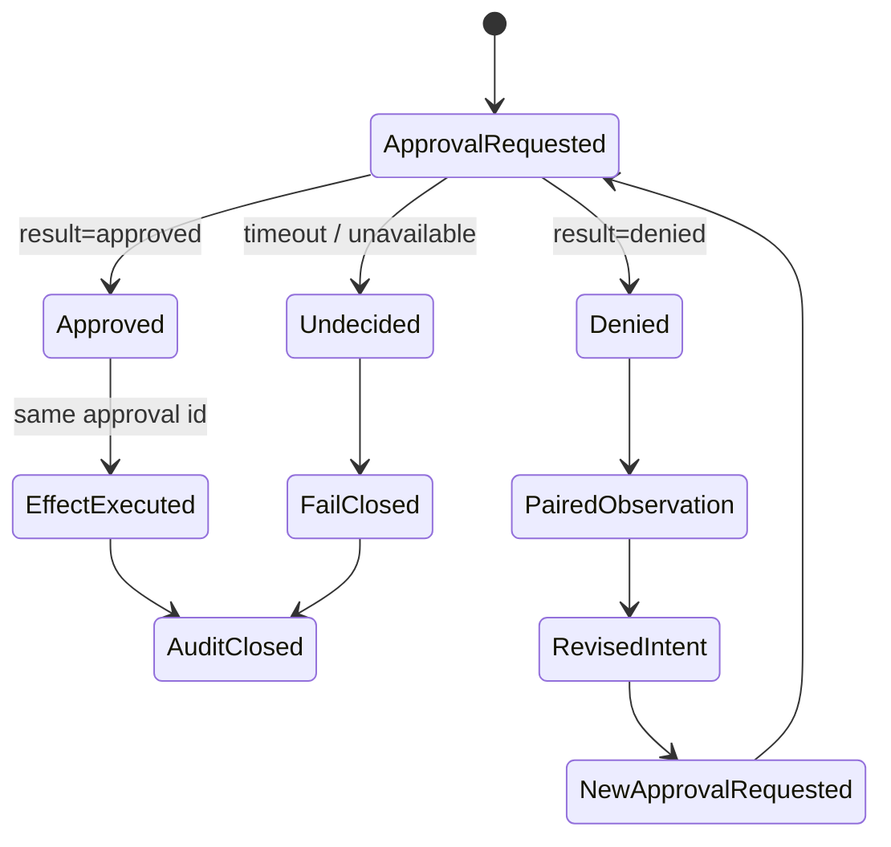
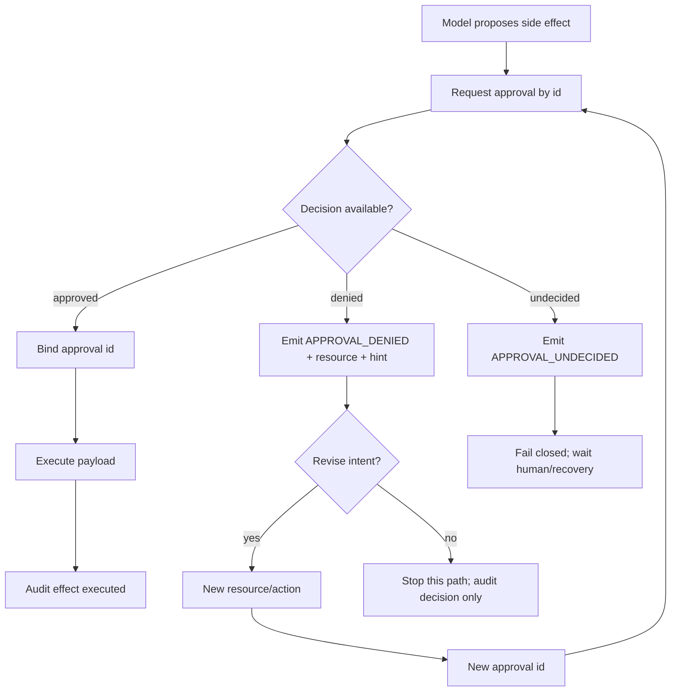

## 一句话结论

审批拒绝不是 Run 的终点，而是模型可见的约束反馈。`labs/approval-rejection` 验证四种状态：批准后副作用绑定 `approve-public` 或 `approve-alternative` 执行；`private/draft` 被拒后返回 `APPROVAL_DENIED`，改用 `public/summary` 和新 ID 后成功；无法决策返回独立的 `APPROVAL_UNDECIDED` 且不执行。审计序列交替记录 decision 和 effect，能重建每次副作用的授权来源。

## 上一章遗留问题

[Tool 重试副作用实验](./retry-side-effects.md) 回答了失败后能否重试。本章回答执行前的问题：用户说不之后，Run 如何继续？说不清能不能决定时又该怎么办？

## 本章解决什么矛盾

审批系统如果只返回布尔值，模型只能猜下一步：静默失败像工具故障；超时像拒绝；修改参数后旧许可可能被滥用。真实 Harness 必须同时满足三件事：给模型可解释的拒绝原因；让新方案获得新授权；在缺少决策时保持失败关闭。

本实验把矛盾压缩成四个问题：

1. 哪个状态才允许进入副作用执行器？
2. 拒绝观察要包含什么，模型才能修正而不是重复？
3. 替代方案为什么必须重新申请？
4. 无法决策与明确拒绝为什么必须分开？

## 核心不变量

1. **approved 是唯一通行证**：`execute()` 只接受 `approval.result === "approved"`；其他状态即使调用 execute 也会 blocked。
2. **拒绝配对**：denied 返回稳定 code、resource 和修正提示，成为模型可见 observation。
3. **undecided 失败关闭**：它不是 denied，也不是 allow；返回独立 code 并暂停自动路径。
4. **授权绑定意图**：审批 ID 绑定 action/resource/result；资源变化必须用新 ID。
5. **账本同序**：decision 与 effect 进入同一个 audit 数组，时间线不拆成两条互相对不上的日志。

失效边界：假件没有过期时间、撤销、条件批准、并发弹窗去重和多租户 scope。它验证恢复协议的最小骨架。

## 理想模型



理想模型的关键是三条出边：approved 才能到 effect；denied 只产生 observation 并允许构造新意图；undecided 停止自动执行。所有路径最终都能在审计中找到证据。

## 初学者主线

可以把审批想象成门禁卡。直觉上，刷卡失败可以换一扇有权限的门；精确机制是，每张卡绑定具体房间和时间，换房间必须重新制卡，读卡器故障时门不会自动打开；失效边界是，如果有人的万能卡能覆盖所有房间，前面的绑定就全部作废。

代码对应关系：

1. `request()` 把每条 decision 写入 audit 并存入 decisions Map（`labs/approval-rejection/src/service.mjs:13-22`）。
2. `execute()` 只放行 approved，否则追加 `{type:"effect",result:"blocked"}` 并抛错（`labs/approval-rejection/src/service.mjs:23-28`）。
3. runner 把非 approved 分成 undecided 和 denied 两类 observation（`labs/approval-rejection/src/run.mjs:5-23`）。
4. 替代申请使用新 ID `approve-alternative` 和新资源 `public/summary`（`labs/approval-rejection/src/run.mjs:49-53`）。

## 实验布局与运行

```text
labs/approval-rejection/
  package.json
  README.md
  src/service.mjs
  src/run.mjs
  test/approval-rejection.test.mjs
```

| 文件 | 职责 |
| --- | --- |
| `src/service.mjs:1-35` | 维护 decisions、effects 和同序 audit。 |
| `src/run.mjs:2-31` | 包装请求、分类 denied/undecided、绑定执行。 |
| `src/run.mjs:33-70` | 驱动批准、拒绝、替代申请和未决四个场景。 |
| `test/approval-rejection.test.mjs:1-24` | 断言状态码、payload、executedIds 和审计数量关系。 |

在仓库根目录运行：

```bash
cd labs/approval-rejection
npm start
npm test
```

2026-08-23 在 Node.js v26.7.0 中验证：

| 场景 | 结果 |
| --- | --- |
| `approve-public` | executed，effect payload bytes 为 128 |
| `deny-private` | denied，observation 为 `APPROVAL_DENIED` 加 resource/message |
| `approve-alternative` | executed，payload bytes 为 64 |
| `timeout-public` | undecided，observation 为 `APPROVAL_UNDECIDED` |
| `executedIds` | `["approve-public","approve-alternative"]` |

完整 audit 有 6 条，顺序为：

1. decision `approve-public` approved。
2. effect `approve-public` executed。
3. decision `deny-private` denied。
4. decision `approve-alternative` approved。
5. effect `approve-alternative` executed。
6. decision `timeout-public` undecided。

`npm test` 输出：

```text
approval rejection lab: 4 paths passed
```

额外边界实测：

- 重复使用审批 ID 抛出 `Approval id already exists: x`。
- 对 denied approval 直接 execute 会抛错，并在 audit 追加 `{type:"effect",id:"y",result:"blocked"}`。
- 因此主流程的 6 条审计中只有 2 条 effect，正好比 4 条 decision 少 2。

## 决策流



这张图强调恢复不是「再问一次」：denied 之后先改变意图，再用新 ID 请求。undecided 则根本不该由模型继续推进。

## 机制深拆

### 正常路径

`requestAndExecute()` 先调用 service.request。若结果是 approved，runner 把同一 approval 对象传给 execute；service 再次检查 `result !== "approved"` 后创建 effect，写入 effects 和 audit（`labs/approval-rejection/src/service.mjs:23-32`）。双重检查看似冗余，实际防止调用方绕过 runner 手工传入伪造对象。

### 拒绝路径

`private/draft` 的 decision 结果是 denied。runner 不调用 execute，而是返回：

```json
{
  "status": "denied",
  "observation": {
    "code": "APPROVAL_DENIED",
    "resource": "private/draft",
    "message": "Choose an allowed resource or revise the request."
  }
}
```

这个观察回答了三件事：动作没有执行；原因是审批策略；下一步应修改资源或请求范围。它没有暗示服务故障，也没有提供旧的审批 ID。

### 替代申请

第二次尝试的资源变为 `public/summary`，审批 ID 变为 `approve-alternative`。二者都变化的原因是：审批对象绑定的是确切 action/resource，不只是“发布”这个动词。新 ID 保证 decisions Map 不会冲突，也让 audit 可以清楚区分两次授权。

### 未决路径

`timeout-public` 的 decision 是 undecided。runner 返回独立状态和 `APPROVAL_UNDECIDED`。audit 只有一条 decision，没有 effect。这模拟审批服务超时、通道不可用或人工尚未响应；正确行为是等待恢复、升级或显式取消，而不是把缺答案当成 no 或 yes。

### 参数与环境

- Node.js 原生 ESM，无第三方依赖和网络访问。
- `request()` 要求唯一 ID，重复 ID 直接抛错。
- 测试通过显式 decision 控制结果；生产系统通常由 UI、policy service 或 guard 决定。
- audit/effects getter 使用 structuredClone，外部读取不会污染内部账本。

## 反例与故障模式

1. **把 undecided 当 denied**
   - 触发：简化错误处理，只保留 allow/deny。
   - 因果：超时或审批服务不可用被解读成人拒绝。
   - 观察：模型放弃本来可能批准的方案；用户不知道任务卡在哪。
   - 本实验防线：独立 status/code，且没有 effect。
2. **把 undecided 当 allow**
   - 触发：为避免阻塞，超时后默认执行。
   - 因果：缺少有效决策却进入副作用层。
   - 观察：审批离线的几分钟内任意 publish 都被执行。
   - 本实验防线：execute 只认 approved。
3. **复用旧审批 ID 执行新资源**
   - 触发：模型把 `approve-public(public/report)` 当成“以后都可发布”。
   - 因果：授权从单一意图扩大成能力集合。
   - 观察：私有资源借旧 ID 发布，审计难以发现漂移。
   - 本实验防线：新资源必须新 ID；重复 ID 会抛异常。
4. **拒绝观察只返回 false**
   - 触发：工具接口只暴露 allowed boolean。
   - 因果：模型无法区分资源越权、参数错误和服务故障。
   - 观察：反复原样重试，或误判为工具坏掉。
   - 本实验防线：code/resource/message 三元组构成可修正反馈。
5. **审计拆成两条无关联流**
   - 触发：decision 存审批库，effect 存业务库，没有共同 ID。
   - 因果：无法证明某次副作用来自哪个决定。
   - 观察：事后只能按时间猜测，权限放大难以追责。
   - 本实验防线：decision 与 effect 共享 approval.id 并进入同一 audit 序列。
6. **绕过 runner 手工调用 execute**
   - 触发：插件直接拿一个 `{result:"approved"}` 对象执行。
   - 因果：伪造对象未经过 request 和 Map 校验。
   - 观察：未授权副作用发生，但看起来有 approval 字段。
   - 本实验防线：execute 内部仍检查 approved；更严格的实现还应校验 ID 是否存在于 decisions。
7. **重复处理同一 denial**
   - 触发：多个 hook 对同一次拒绝各自生成补偿动作。
   - 因果：denial 没有 dedupe key 或 owner。
   - 观察：用户收到多份“已阻止”通知，甚至触发互相矛盾的回滚。
   - 本实验边界：假件未实现 denial dedupe；迁移时需补齐。

## 一条完整因果链

场景：Agent 想发布报告，用户拒绝私有草稿后给出公开摘要方向：

1. **触发**：第一次请求是 `publish private/draft`，审批 ID 为 `deny-private`，decision 为 denied。
2. **状态变化**：audit 记录一条 decision；effects 不变；runner 构造 `APPROVAL_DENIED` observation。
3. **模型推理**：observation 包含 resource 和修正提示，模型知道不能发布私有路径，应选择允许资源。
4. **新意图**：下一轮提议 `publish public/summary`；这不是旧请求的重试，而是新的 action/resource 组合。
5. **新授权**：runner 用 `approve-alternative` 请求；decision approved 进入 audit。
6. **受控执行**：execute 用同一 ID 创建 effect，payload bytes 为 64；effects 与 audit 同时更新。
7. **审计闭环**：时间线上可以看到 denied decision 后没有 effect，随后新的 approved decision 紧跟 executed effect；`executedIds` 不包含 `deny-private`。
8. **后续影响**：用户能解释为何第一次没有发布；安全评审能确认第二次授权没有继承第一次；模型收到的是约束反馈而非系统故障。

## 设计取舍

| 取舍 | 选择 | 收益 | 代价 |
| --- | --- | --- | --- |
| denied vs undecided 分离 | 保留两个终态和错误码 | 用户拒绝与系统故障不被混淆 | 错误面更大，UI 要分别处理 |
| 新意图新 ID | 不复用旧 approval | 防止权限扩大 | 需要稳定的意图规范化 |
| 双重 approved 检查 | runner 与 execute 都检查 | 降低绕过风险 | 更严格实现还要校验 ID 来源 |
| 单一 audit 数组 | decision/effect 同序 | 易重建因果 | 高吞吐下需要分区和索引 |
| 显式修正提示 | denied 带 message | 模型可改路径 | 文案必须与策略一致 |

## 框架实现对照

本实验是最小恢复协议，不是任何框架审批器的复刻。真实机制见 [审批模型](../02-harness-mechanics/approval.md)：

| 维度 | 最小实验 | Reasonix `aa82b2f` | DeepSeek Harness `b150a55` | Pi `c49906e` |
| --- | --- | --- | --- | --- |
| 审批对象 | id/action/resource/result | RawInput/Fresh/kind/recovery/write access | execution 快照加 ask reason | validated args 前置 block |
| 决策终态 | approved/denied/undecided | once/session/persistent/deny 等 | allowed-once/rejected/cancelled/unavailable | block/reason/terminate |
| 缺失决策 | fail closed | fresh human 不能被 hook allow 取代 | unavailable degrade to deny | abort/block immediate error |
| 审计 | 同序 decision/effect | approval event 与 controller 状态 | pre-execute/guard/tool result 观察链 | loop error tool result 保持配对 |

差异在于：实验把业务副作用也放进同一账本；三家框架主要治理模型调用前的审批面，业务审计通常由宿主和工具服务补充。

## 实现精妙之处

1. **execute 的第二道检查**：即使调用方拿到非 approved 对象也无法执行。
2. **重复 ID 快速失败**：防止旧授权被覆盖或同名决策混淆因果。
3. **blocked 也入账**：非法 execute 不只是抛错，还留下 effect/blocked 证据。
4. **克隆读取**：audit/effects getter 防止外部修改内部历史。
5. **四条测试对应四类语义**：执行、拒绝、替代、未决各有一个断言锚点。

## 自检与面试追问

1. 为什么不能把 `undecided` 当作 `denied` 返回给模型？
2. 用户拒绝私有目录后，模型应携带哪些字段重新申请？哪些字段必须改变？
3. 一个批准在执行前过期，系统应记录哪些事件？effect 应该处于什么状态？
4. 你的框架能否从审计日志重建每次副作用的授权来源？
5. 如何防止多个组件重复消费同一次 denial？
6. 如果 execute 支持部分完成，approval、effect 和对账状态该如何扩展？

## 交给下一章的问题

L-01 到 L-04 已覆盖最小 Run、Context 收缩、副作用重试和审批恢复。第六章 CS-01《长任务中断恢复》将把这些机制组合起来：进程崩溃后如何找到最新有效 checkpoint、对账副作用并恢复用户可见进度。

## 相关页面

- [教材目录](../TOC.md)
- [审批模型](../02-harness-mechanics/approval.md)
- [Sandbox 与权限](../02-harness-mechanics/sandbox.md)
- [Tool 执行与副作用](../02-harness-mechanics/tool-execution.md)
- [Tool 重试副作用实验](./retry-side-effects.md)
