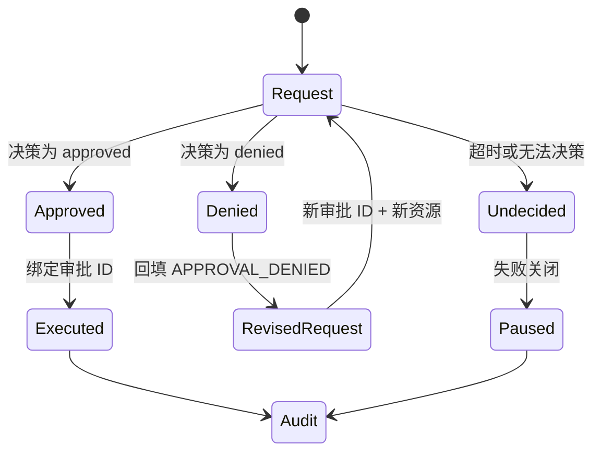

# 审批拒绝恢复实验

## 一句话结论

审批拒绝不是 Run 的终点，而是模型可见的约束反馈。这个实验用同一套确定性服务验证四种状态：批准后才执行副作用；拒绝返回 `APPROVAL_DENIED` 并支持修改资源后重新申请；越权请求继续被拒；无法决策返回 `APPROVAL_UNDECIDED` 并保持失败关闭。

## 实验目录

```text
labs/approval-rejection/
  package.json
  README.md
  src/service.mjs
  src/run.mjs
  test/approval-rejection.test.mjs
```

| 文件 | 职责 |
| --- | --- |
| `src/service.mjs` | 维护审批决策、副作用和同序审计账本。 |
| `src/run.mjs` | 驱动批准、拒绝、替代申请和未决路径。 |
| `test/approval-rejection.test.mjs` | 验证状态码、执行 ID 和审计数量。 |

## 运行与测试

```bash
cd labs/approval-rejection
npm start
npm test
```

`npm start` 输出一个 JSON 对象，包含四个结果、完整审计序列和已执行 ID。测试会验证：

1. `public/report` 批准后执行一次。
2. `private/draft` 拒绝后不产生副作用，并得到可修正观察。
3. 拒绝后改用 `public/summary` 的新审批可以执行。
4. `undecided` 不映射为批准；Run 收到独立失败关闭代码，且没有副作用。

## 状态机



每个终态的契约：

| 状态 | 观察或动作 | Run 影响 |
| --- | --- | --- |
| `approved` | 绑定审批 ID 后执行 payload。 | 副作用进入 effects。 |
| `denied` | 返回稳定分类、资源和修正提示。 | 模型选择替代方案。 |
| 替代申请 | 使用新审批 ID 和新资源。 | 不复用旧决定。 |
| `undecided` | 返回 `APPROVAL_UNDECIDED`。 | 暂停自动执行。 |

## 观察点

### 拒绝必须可解释

`denied` 路径不只返回布尔值，还带资源、分类和“选择允许资源”的提示。这样模型知道当前动作没有执行，也知道下一步应该改变目标或范围，而不是把静默失败误判成工具故障。

### 新方案需要新授权

第一次申请的是 `private/draft`，第二次是 `public/summary`。两者资源不同，因此不能复用旧审批对象或旧 ID。审批绑定的是确切意图；如果参数漂移后仍沿用旧许可，就会把“批准 A”扩大成“批准 A 及任意相似动作”。

### 无法决策要失败关闭

`undecided` 与 `denied` 是不同状态：前者表示缺少有效决策，后者表示明确不允许。实验为二者保留不同错误码，并且只有 `approved` 能进入执行器。这防止超时、离线或审批服务异常被误解成放行。

### 审计顺序揭示因果关系

审计序列交替保存 decision 和 effect：先有 `approve-public`，再有执行事件；随后拒绝记录只保存决策，不伪造副作用。人类可以用这一条时间线回答“谁决定了什么、执行了什么、哪些请求没有继续”。

## 迁移到真实 Harness

把实验迁移到真实框架前检查：

1. **审批对象**：是否绑定工具、规范化参数、资源范围、风险和过期时间？
2. **决策投影**：用户看到的差异预览与机器可读意图是否都能留存？
3. **终态建模**：批准、条件批准、拒绝、撤销和无法决策是否分开？
4. **执行绑定**：执行器能否证明副作用使用了已批准的确切意图？
5. **恢复边界**：拒绝后如何生成新请求？未决后由谁恢复？

如果第 1、2 项不足，用户会在信息不完整时授权；如果第 3、4 项缺失，权限会被放大或绕过；如果第 5 项缺失，任务会卡在不可恢复的弹窗或静默失败中。

## 自检问题

1. 为什么不能把 `undecided` 当作 `denied` 返回给模型？
2. 用户拒绝私有目录后，模型应携带什么信息重新申请？
3. 一个批准在执行前过期，系统应记录哪些事件？
4. 你的框架能否从审计日志重建每次副作用的授权来源？

## 相关页面

- [教材目录](../TOC.md)
- [审批模型](../02-harness-mechanics/approval.md)
- [Tool 执行与副作用](../02-harness-mechanics/tool-execution.md)
- [Sandbox 与权限](../02-harness-mechanics/sandbox.md)
- [术语表](../09-glossary/glossary.md)
