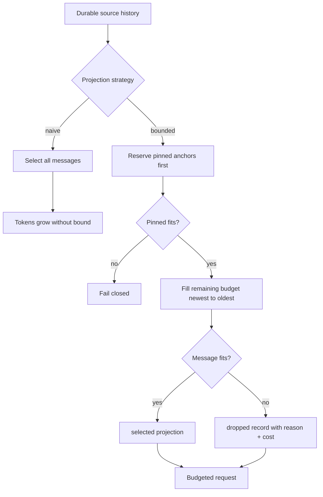
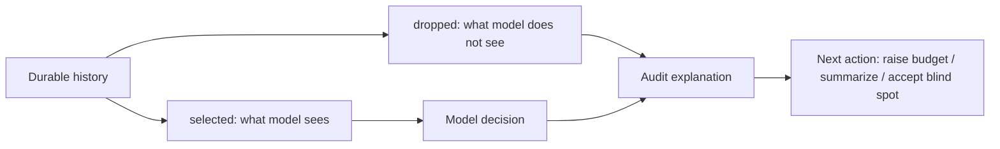

# Context 膨胀实验

## 一句话结论

Context 膨胀的根源不是消息数量本身，而是把全部历史当成下一次请求。`labs/context-bloat` 用同一条权威历史构造两种投影：无界追加达到 114 个估算 token；64-token 预算内的投影只花 56 个，保留 system、任务、用户纠正和最新观察 `obs-5`，并把四条较早观察记成可审计的 dropped 记录。

## 上一章遗留问题

[最小 Agent Run 实验](./minimal-run.md) 验证了闭合输入和配对工具观察。本章回答下一层问题：当合法历史继续增长时，下一次请求该保留什么、能丢什么、如何证明丢了什么？

## 本章解决什么矛盾

长会话里会出现重复日志、检索片段和探索性尝试。直接追加会让请求超过窗口；简单截断尾部又会删掉最新证据，简单截断头部可能删掉安全规则或用户纠正。这个实验把矛盾缩小到三个决定：度量成本、选择保留顺序、记录丢弃事实。

## 核心不变量

1. **权威不改写**：`sourceMessages` 是完整事实来源；naive 或 bounded 投影都不修改它。
2. **锚点优先**：`system` 规则、任务目标和用户纠正先进入预算投影。
3. **新证据有优先权**：普通消息从新到旧装入剩余空间，因此 `obs-5` 留下。
4. **丢弃可审计**：被移出的消息记录 id、role、`reason:"budget"` 和自身 token 成本。
5. **溢出失败关闭**：如果 pinned 内容本身超过预算，抛出 `Pinned messages exceed context budget`，不静默删除规则或纠正。

失效边界是：本实验只处理文本估算和静态优先级，没有 Provider 实际计数器、多轮压缩摘要、并发写入和恢复事务。

## 理想模型



理想模型区分三层：durable history 回答「发生过什么」；projection 回答「这次模型看到什么」；dropped record 回答「这次模型没看到什么」。三者合起来才能解释一次推理。

## 初学者主线

可以把上下文想象成登机行李。直觉上，护照、机票和钱包必须随身带，其他行李按重要性取舍；精确机制是，先固定不可托运的 pinned 物品，再从最近需要的物品往箱子里装，装不下就写一张「留在酒店」清单；失效边界是，如果护照本身就塞不进随身包，不能撕掉护照页，只能换更大的包或改行程。



这张图强调 dropped 不是垃圾输出。它与 selected 共同构成一次请求的完整解释：模型只根据 selected 推理，但维护者必须结合 dropped 才能判断结论是否受视图收缩影响。

代码中的对应关系：

1. `estimateTokens(text)` 用 Unicode code point 数除以 4 并向上取整（`labs/context-bloat/src/context.mjs:1-3`）。
2. `messageTokens` 把 `role: content` 整体计入成本（`labs/context-bloat/src/context.mjs:4-6`）。
3. naive 投影克隆全部消息并累计成本（`labs/context-bloat/src/context.mjs:8-13`）。
4. bounded 先装 pinned，再倒序装普通消息，最后按原顺序排序 selected（`labs/context-bloat/src/context.mjs:15-51`）。

## 实验布局与运行

```text
labs/context-bloat/
  package.json
  README.md
  src/context.mjs
  src/run.mjs
  test/context-bloat.test.mjs
```

| 文件 | 职责 |
| --- | --- |
| `src/context.mjs:1-51` | 估算 token、构造 naive/bounded 投影和 dropped 记录。 |
| `src/run.mjs:3-12` | 定义 8 条事故调查历史，其中 3 条 pinned。 |
| `src/run.mjs:14-29` | 运行默认预算 64 的对比并输出布尔结果。 |
| `test/context-bloat.test.mjs:1-23` | 断言预算、锚点、最新证据、丢弃原因和小样本顺序。 |

在仓库根目录运行：

```bash
cd labs/context-bloat
npm start
npm test
```

2026-08-23 在 Node.js v26.7.0 中验证：

```json
{"type":"experiment","naiveExceedsBudget":true,"boundedFitsBudget":true,"pinnedRetained":true}
{"type":"naive","tokens":114,"selected":8,"dropped":0}
{"type":"bounded","tokens":56,"budget":64,"selected":["system","task","correction","obs-5"],"dropped":[{"id":"obs-4","role":"assistant","reason":"budget","tokens":15},{"id":"obs-3","role":"toolResult","reason":"budget","tokens":15},{"id":"obs-2","role":"toolResult","reason":"budget","tokens":14},{"id":"obs-1","role":"toolResult","reason":"budget","tokens":14}]}
```

`npm test` 输出：

```text
context bloat lab: 4 checks passed
```

## 机制深拆

### 正常路径

示例历史的单条成本是：

| id | 成本 | 是否 pinned |
| --- | ---: | --- |
| `system` | 15 | yes |
| `task` | 14 | yes |
| `obs-1` | 14 | no |
| `obs-2` | 14 | no |
| `correction` | 12 | yes |
| `obs-3` | 15 | no |
| `obs-4` | 15 | no |
| `obs-5` | 15 | no |

naive 全选合计 114。bounded 先用 41 个 token 装三条 pinned，再倒序遇到 `obs-5`，加上 15 后正好是 56；后续 `obs-4`、`obs-3`、`obs-2`、`obs-1` 都无法放入，依次写入 dropped。最后 selected 按源数组顺序恢复为 `["system","task","correction","obs-5"]`（`labs/context-bloat/src/context.mjs:49`）。

### 参数与环境

- Node.js 原生 ESM；无第三方依赖，不需要网络或模型密钥。
- 默认 `budget=64`（`labs/context-bloat/src/run.mjs:14`），测试也显式传入 64。
- token 估算是 code point/4 向上取整；中文 emoji、Provider tokenizer 和计费口径都可能不同。
- `pinned` 是消息上的布尔字段；真实系统通常还要来源、版本、过期时间和冲突解决规则。

### 失败路径

pinned 溢出走独立分支：只要当前累计成本加当前 pinned 成本超过预算，立即 throw，不会继续装入普通消息（`labs/context-bloat/src/context.mjs:20-28`）。实测 300 字符的 pinned system 加 10-token 预算得到：

```text
Pinned messages exceed context budget
```

普通消息溢出不抛错，而是生成 dropped 记录。这个差别很重要：前者说明配置无法满足最高约束，后者说明本次请求有意收缩视图。

### 小样本对照

测试还使用三条消息验证算法语义（`labs/context-bloat/test/context-bloat.test.mjs:16-22`）：

| id | 内容角色 | 成本 |
| --- | --- | ---: |
| `system` | pinned rule | 5 |
| `old` | old observation | 7 |
| `new` | new step | 3 |

8-token 预算下的结果是 selected `["system","new"]`、dropped `old`、总成本 8。它证明两点：pinned 先占位；普通消息从新到旧判断后仍按原始顺序输出。

## 反例与故障模式

1. **修改权威历史来腾空间**
   - 触发：压缩函数 splice 掉 sourceMessages。
   - 因果：把「本次不发送」变成「从未发生」，fork/resume 和审计失去基础。
   - 观察：回放时找不到被删观察，也无法解释模型为什么改变结论。
   - 本实验防线：两个 builder 都操作 structuredClone 后的 selected，不返回改写的源数组。
2. **让用户纠正参与普通淘汰**
   - 触发：忘记给 correction 设置 pinned。
   - 因果：倒序装入时旧的过程日志可能挤占预算，纠正被 dropped。
   - 观察：模型重新提出用户明确禁止的数据库重启。
   - 本实验防线：`correction` 属于 pinned，先于所有普通观察保留。
3. **只返回 selected，不返回 dropped**
   - 触发：API 只想暴露干净的消息数组。
   - 因果：调试者看不到本次请求的盲区。
   - 观察：「模型没看到日志」被误判为「工具没采集日志」或「模型忽略指令」。
   - 本实验防线：bounded 结果携带每条 dropped 的 id、role、原因和成本。
4. **pinned 超预算时静默降级**
   - 触发：为了不让请求失败，把放不下的安全规则截断或转成摘要。
   - 因果：最高优先级约束失去完整语义。
   - 观察：系统在看似正常的一次请求中违反安全边界。
   - 本实验防线：pinned 溢出立即抛错。
5. **把字符估算当成计费真相**
   - 触发：只用 `/4` 估算就做硬截断。
   - 因果：不同 tokenizer、图片、工具 schema 和 provider overhead 会造成偏差。
   - 观察：本地显示 63 token，provider 报 context length exceeded。
   - 正确方向：估算用于策略预判，关键路径要用 Provider usage 或保守余量复核。
6. **倒序选择但按完成时间输出**
   - 触发：selected 不映射回 source index，直接 push 顺序返回。
   - 因果：对话协议通常要求逻辑顺序，乱序 user/toolResult 可能非法。
   - 观察：provider 校验失败，或模型误解因果。
   - 本实验防线：selected 最后按源数组 index 排序。
7. **丢弃记录不含成本**
   - 触发：dropped 只存 id。
   - 因果：无法复盘为什么某条重要观察没进上下文，也不能调优预算。
   - 观察：只知道少了内容，不知道差多少 token。
   - 本实验防线：每条 dropped 带 `tokens`。

## 一条完整因果链

场景：事故调查会话增长到 8 条消息，预算为 64 个估算 token：

1. **触发**：runner 准备下一次模型请求；naive 投影需要 114，超出预算 50。
2. **状态变化**：权威历史保持 8 条；组装器切换到 bounded 策略。
3. **锚点保留**：`system`(15)、`task`(14)、`correction`(12) 先入选，累计 41。
4. **新到旧装载**：倒序检查普通消息；只有最新的 `obs-5`(15) 能放入，累计 56；`obs-4`、`obs-3`、`obs-2`、`obs-1` 分别以 15/15/14/14 成本进入 dropped。
5. **观察结果**：请求包含安全规则、任务目标、「不要重启数据库」的纠正和最新 owner 信息；模型知道 rollback window 由 Alice 验证。
6. **审计能力**：如果后续结论遗漏早期 retry storm，调试者可以查看 dropped 中 `obs-2`，判断这是视图收缩导致的信息缺口，而不是工具未采集。
7. **后续影响**：用户可以选择提高预算、生成带来源的摘要或接受当前盲区；权威历史仍可用于 fork 和重放。

这条链说明压缩的正确问题不是「删掉什么」，而是「这次决策允许不知道什么，以及如何留下证据」。

## 设计取舍

| 取舍 | 选择 | 收益 | 代价 |
| --- | --- | --- | --- |
| 字符估算 vs Provider counter | code point/4 上取整 | 无依赖，离线稳定 | 与真实 tokenizer 有偏差 |
| pinned-first vs recency-only | 固定安全、任务和纠正 | 防止关键约束被挤出 | 需要 priority 元数据 |
| newest-to-oldest vs oldest-to-newest | 新证据优先 | 保留最新状态 | 可能丢掉早期根因 |
| fail closed vs truncate pinned | pinned 溢出抛错 | 不破坏最高约束 | 配置错误会阻断请求 |
| dropped detail vs only selected | 记录原因和成本 | 可审计、可调优 | 输出结构更复杂 |

## 框架实现对照

本实验是教学基线，不是任何框架的复刻。真实机制见 [Context 压缩与截断](../02-harness-mechanics/context-compression.md)：

| 维度 | 最小实验 | Reasonix `aa82b2f` | DeepSeek Harness `b150a55` | Pi `c49906e` |
| --- | --- | --- | --- | --- |
| 权威保护 | builder 不改 source array | prune projection + receipt/hash 保护 canonical | append-only surface + sourceEventSeqs | entry tree 不因 compaction 重写 |
| 保留优先级 | 显式 pinned 字段 | prefix/digest/kept messages 组合 | bracket replacement 与 stability check | keepRecentTokens + 合法 cut point |
| 大结果处理 | 不覆盖 | durable prune projection | shadow price/content-only replacement | 工具层行/字节截断元数据 |
| 失败语义 | pinned overflow throw | 并发安全和恢复流程 | transaction/stability check | threshold/cut point 约束 |

方向性差异是：实验用一次性静态投影演示不变量；三家框架要处理持久化、并发、增量更新、摘要来源和恢复。不要把 `estimateTokens/4` 当成它们的生产算法。

## 实现精妙之处

1. **同一份历史测两种策略**：naive 与 bounded 共享输入，使差异只来自投影策略。
2. **pinned 溢出单独失败**：最高约束放不下时抛错，而不是静默截断。
3. **dropped 记录带成本**：既支持调试，也支持预算调优。
4. **selected 恢复原序**：选择过程可以倒序，输出协议保持稳定。
5. **零依赖小样本测试**：额外验证了 pinned-first、newest-first 和 original-order 三个语义。

## 自检与面试追问

1. 为什么不能直接修改权威历史来腾出上下文空间？
2. 如果用户纠正不是 pinned，本实验会发生什么？生产系统还需要哪些优先级元数据？
3. 你的 token 度量、Provider usage 和计费窗口是否一致？不一致时谁应该赢？
4. 如何向用户展示「模型这次没看到 obs-2」，而不暴露敏感全文？
5. pinned 总和超过硬窗口时，除了报错还能有哪些显式流程？
6. 若两条 pinned 规则冲突，应该在组装前还是组装中发现？

## 交给下一章的问题

L-03《Tool 重试副作用实验》将处理另一个失败面：当工具调用超时或失败后自动重试，哪些动作可以重复，哪些会二次扣款、重复发布或污染文件？

## 相关页面

- [教材目录](../TOC.md)
- [Context 组装与分层](../02-harness-mechanics/context-assembly.md)
- [Context 压缩与截断](../02-harness-mechanics/context-compression.md)
- [最小 Agent Run 实验](./minimal-run.md)
- [Tool 重试副作用实验](./retry-side-effects.md)
