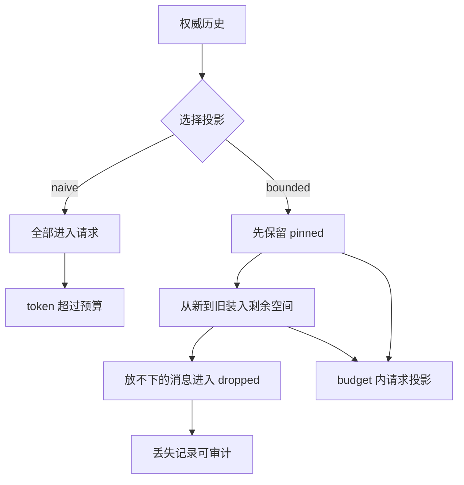

# Context 膨胀实验

## 一句话结论

Context 膨胀的根源不是消息数量本身，而是把所有历史都当成下一次请求的输入。这个实验用同一条权威历史构造两种请求投影：无界追加让 token 持续增长；预算内投影保留安全约束、任务目标、用户纠正和最近证据，同时为移出内容生成可审计记录。

## 实验目录

```text
labs/context-bloat/
  package.json
  README.md
  src/context.mjs
  src/run.mjs
  test/context-bloat.test.mjs
```

| 文件 | 职责 |
| --- | --- |
| `src/context.mjs` | 估算字符成本，实现 naive 与 bounded 两种投影。 |
| `src/run.mjs` | 提供确定性事故调查历史并输出实验结果。 |
| `test/context-bloat.test.mjs` | 验证预算、固定锚点、最新观察和丢弃记录。 |

## 运行与测试

```bash
cd labs/context-bloat
npm start
npm test
```

默认预算是 64 个估算 token。`npm start` 输出三行 JSONL：总结果、无界投影和预算内投影。测试会验证四个条件：

1. naive 投影包含全部消息，并且超过预算。
2. bounded 投影不超过预算。
3. system、任务、纠正等 pinned 消息继续保留。
4. 移出请求的消息带有 `budget` 原因和 token 成本。

## 数据流



实验刻意区分两个概念：

| 概念 | 本实验中的含义 |
| --- | --- |
| 权威历史 | `sourceMessages` 的完整事实来源，不因投影被删除。 |
| 请求投影 | 本次发送给模型的 `selected` 消息集合。 |
| pinned | 必须进入投影的约束、目标和用户纠正。 |
| dropped | 因预算被移出投影的消息及其原因。 |

## 观察点

### 无界追加必然越过边界

示例历史只有 8 条消息，naive 投影已经达到约 114 个估算 token；64-token 预算下无法全部发送。真实工程中工具日志、检索片段和多轮探索会让增长更快，所以压缩必须在组装前发生，而不是等待 Provider 返回超限错误。

### 固定锚点先于普通历史

bounded 策略先装入 system 规则、任务目标和用户纠正，再从新到旧利用剩余空间。最终投影包含 `system`、`task`、`correction` 和最新的 `obs-5`，而较早的四条观察被记入 `dropped`。这体现一个基本顺序：约束和纠正不能被普通过程细节挤出。

### 丢弃不等于遗忘

每条移出消息都有 ID、角色、原因和成本。这样下一次请求仍能说明“模型没有看到什么”。如果只返回裁剪后的数组，不留下丢弃记录，调试时会把上下文残缺误判成推理错误或工具故障。

### pinned 也需要预算检查

如果 pinned 内容本身就超过预算，实验抛出异常，而不是静默丢掉安全规则或用户纠正。真实 Harness 应把这个信号转成显式配置错误、升级预算或强制摘要流程；不能让最高优先级信息无声消失。

## 迁移到真实 Harness

把实验迁移到真实框架前检查：

1. **度量口径**：token 数如何计算？字符估算、Provider 计数器和计费窗口是否一致？
2. **优先级来源**：系统约束、当前目标、用户纠正和最近失败如何标记？
3. **触发时机**：组装前、请求前还是收到超限错误后触发压缩？
4. **降级策略**：超大工具结果是摘要、引用文件路径，还是硬截断？
5. **审计边界**：能否根据事件日志重建哪些内容进入了每次请求？

如果第 1、2 项不确定，优先级会漂移；如果第 3 项太晚，会浪费一次失败请求；如果第 4、5 项缺失，系统会在节省 token 的同时制造不可追溯的决策风险。

## 自检问题

1. 为什么不能直接修改权威历史来腾出上下文空间？
2. 如果用户纠正不是 pinned，会发生什么？
3. 一个 20,000 字符的工具结果应该怎样进入请求？
4. 你的框架能否回答“上一次请求为什么没看到某条消息”？

## 相关页面

- [教材目录](../TOC.md)
- [Context 压缩与截断](../02-harness-mechanics/context-compression.md)
- [Context 策略对比](../04-comparisons/context.md)
- [最小 Agent Run 实验](./minimal-run.md)
- [术语表](../09-glossary/glossary.md)
