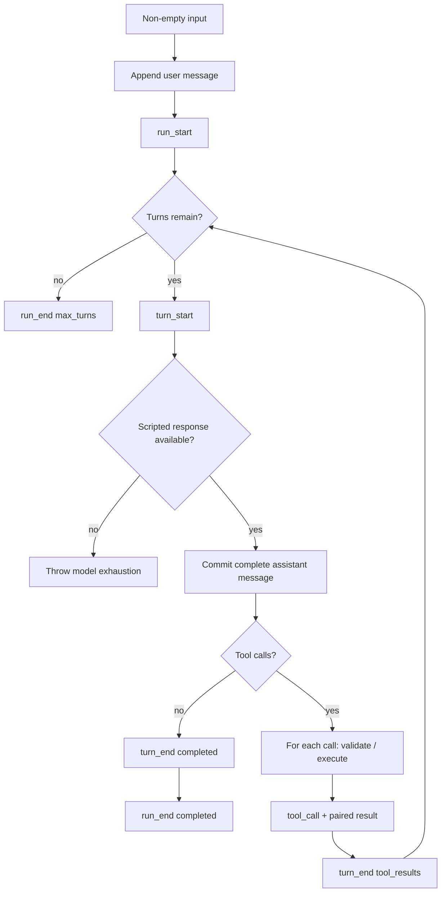

## 一句话结论

这个实验把 Agent 循环压缩到四个不变量：输入闭合、assistant message 完成、tool call 与 result/error 配对、run 以明确原因结束。`labs/minimal-run` 用 fake model 和 fake tool 离线重放成功、工具成功和工具失败三条路径，因此失败只能来自循环逻辑，而不是网络、密钥或模型波动。

## 上一章遗留问题

[一次 Agent Run 的完整生命周期](../01-core-concepts/agent-run-lifecycle.md) 解释了状态所有权和终止原因。本章回答：去掉流式、审批、沙箱和持久化后，一个仍值得相信的最小循环长什么样？

## 本章解决什么矛盾

初学者常把「调用一次模型」当成 Agent。这个实验逼你看清中间层：谁拥有消息历史？什么时候 assistant 草稿变成事实？失败观察是否进入上下文？没有 tool result 时下一轮请求合法吗？`max_turns` 和错误有何不同？用确定性假件可以反复打断这些边界，而不用先搭建真实 Provider。

## 核心不变量

1. **闭合输入**：非空用户输入先成为第一条 user message，然后才发 `run_start`。
2. **完整响应才提交**：fake model 返回的是完整 assistant message；没有 chunk 会提前进入历史。
3. **观察必须配对**：每个 `toolCall` 都要产生 `tool_call` 和带 `isError` 的 `tool_result`。
4. **失败也是事实**：参数校验或执行异常转成 `isError: true` 观察并进入 messages。
5. **终态显式**：有最终文本时 `completed`；脚本耗尽且循环达到上限时 `max_turns`。

失效边界同样重要：本实验没有流式草稿、取消信号、审批、沙箱、重试预算和磁盘持久化。它能证明循环协议，不能证明生产 Harness 的崩溃恢复。

## 理想模型



理想模型把「模型提议」、「工具观察」和「Run 终态」分开。assistant message 是模型事实；tool result 是宿主观察；只有两者都闭合后才能开始下一个决策回合。

## 初学者主线

可以把最小 Run 想成问答游戏。直觉上，主持人先念题，选手再作答；精确机制是：题目写入题板（messages），答案完整落板后才判定是否要求动手操作；失效边界是，如果选手要求操作但裁判弄丢回执，下一轮就会基于幻觉继续推理。

代码里的对应关系很直接：

1. `input` 先进入 `messages`。
2. fake model 按脚本返回完整 assistant message。
3. runner 从 content 中筛出 `type === "toolCall"`。
4. 每个调用先 emit `tool_call`，再校验并执行，最后 emit `tool_result`。
5. 没有 tool call 的响应触发 `completed`；10 个 turn 用尽触发 `max_turns`。

## 实验布局与运行

```text
labs/minimal-run/
  package.json
  README.md
  src/model.mjs
  src/tools.mjs
  src/run.mjs
  test/minimal-run.test.mjs
```

| 文件 | 职责 |
| --- | --- |
| `src/model.mjs:1-10` | 按脚本返回 structured clone；脚本耗尽时抛错。 |
| `src/tools.mjs:1-27` | 定义 echo Schema、执行函数和 validation helper。 |
| `src/run.mjs:8-70` | 驱动最多 10 turn、发布事件和维护 messages。 |
| `test/minimal-run.test.mjs:1-38` | 断言直接完成、工具成功和工具失败。 |

在仓库根目录运行：

```bash
cd labs/minimal-run
npm start
npm test
```

2026-08-23 在 Node.js v26.7.0 中验证：

- `npm start` 打印 10 条 JSONL 事件，最后一条是 `run_end`，原因为 `completed`。
- 事件计数是 `run_start:1`、`turn_start:2`、`assistant_message:2`、`tool_call:1`、`tool_result:1`、`turn_end:2`、`run_end:1`。
- `npm test` 输出 `minimal agent run lab: 3 paths passed`。

## 机制深拆

### 正常路径

`runAgent({ input, responses })` 先拒绝空输入（`labs/minimal-run/src/run.mjs:9-11`）。随后创建 events 数组、fake model 和只含 user message 的历史（`labs/minimal-run/src/run.mjs:14-25`）。每个 turn 先发 `turn_start`，取回完整 assistant message，克隆后推入历史并发 `assistant_message`（`labs/minimal-run/src/run.mjs:29-33`）。

如果没有 tool call，当前 turn 以 `completed` 结束，Run 发出带 output 的 `run_end` 并立即返回（`labs/minimal-run/src/run.mjs:35-40`）。如果有调用，runner 对每个 call 先发布意图，再查找工具、校验参数并执行（`labs/minimal-run/src/run.mjs:42-49`）。

### 参数与环境

- Node.js 使用原生 ESM 和 `structuredClone`；不需要安装依赖。
- `tools` 默认是 `[echoTool]`，调用方可以注入自己的假件数组。
- `responses` 是脚本队列；`createFakeModel` 每次返回克隆并在耗尽时抛错（`labs/minimal-run/src/model.mjs:1-10`）。
- 上限硬编码为 10 个 turn（`labs/minimal-run/src/run.mjs:29`）；这是教学边界，不是生产预算策略。

### 失败路径

工具查找失败、Schema 校验失败和 execute 抛错都进入同一个 catch；runner 构造 `{ error: error.message }`，置 `isError=true`，把观察推入 messages 并 emit `tool_result`（`labs/minimal-run/src/run.mjs:50-62`）。因此失败不会中断批处理中后续调用，也不会留下悬空 call。

模型脚本耗尽的路径不同：`createFakeModel.respond()` 直接抛错，当前 `runAgent` 不捕获它。这是有意区分——工具失败是模型应看到的领域观察，假件脚本耗尽是实验装配错误。

### 事件协议

```mermaid
sequenceDiagram
  participant U as Caller
  participant R as Runner
  participant M as Fake Model
  participant T as Fake Tool
  U->>R: non-empty input + scripted responses
  R->>R: append user message; emit run_start
  loop each turn up to 10
    R->>M: respond()
    M-->>R: complete assistant message
    R->>R: commit message; emit assistant_message
    alt has tool calls
      R->>T: validate + execute
      T-->>R: value or thrown error
      R->>R: emit tool_call + paired tool_result
    else no tool calls
      R->>R: emit completed run_end
    end
  end
  R->>U: events + messages
```

demo 输出的顺序是：`run_start`、`turn_start`、`assistant_message`、`tool_call`、`tool_result`、`turn_end`，然后第二个 turn 以文本完成。事件数组是内存审计日志；messages 是下一轮模型可见历史。二者在本实验中同进程生成，但职责不同。

## 反例与故障模式

1. **只记录成功的 tool result**
   - 触发：catch 里直接 `continue`，不构造 observation。
   - 因果：assistant 历史中有 `toolCall`，但没有配对结果。
   - 观察：下一轮 provider 请求非法，或模型假设工具已成功。
   - 本实验防线：所有异常都转为 `isError: true` 观察并入历史。
2. **把流式 chunk 提前入历史**
   - 触发：为了尽快显示，把 partial text 直接 push 进权威 messages。
   - 因果：本实验的 fake model 只返回完整对象；真实系统若混淆 draft 和 committed message，resume 后会保存半句话。
   - 观察：刷新或恢复后出现不完整指令。
   - 正确方向：投影可以流式更新，权威历史等待完整边界。
3. **让 max_turns 静默退出**
   - 触发：循环结束后只 return，不发 `run_end` 或把原因写成普通完成。
   - 因果：调用方无法区分「任务完成」和「脚本/预算耗尽」。
   - 观察：UI 显示成功但没有任何 output。
   - 本实验防线：第 10 turn 后显式发出 `reason: "max_turns"`。
4. **捕获模型耗尽并伪装成工具失败**
   - 触发：把整个 turn body 包进 try/catch，统一转成 isError observation。
   - 因果：脚本耗尽是 harness fixture 错误，不是模型可选择补救的工具结果。
   - 观察：测试掩盖了错误装配，失败原因从代码 bug 变成假工具反馈。
   - 正确方向：保留两类失败的边界。
5. **共享可变 response 对象**
   - 触发：fake model 直接返回脚本里的同一个对象，工具又修改 arguments。
   - 因果：下一次重放看到被污染的脚本，测试不再确定。
   - 观察：同一命令两次输出不同。
   - 本实验防线：model、validator 和 event emitter 都使用 `structuredClone`。
6. **把 echo 改成写文件但不登记副作用**
   - 触发：想演示“真实能力”，直接在 execute 里写仓库文件。
   - 因果：实验失去离线安全性，也没有 attempt ID、pre-image 或 unknown 状态。
   - 观察：测试污染工作区，崩溃后无法对账。
   - 正确方向：保持 fake tool 无副作用；副作用对账交给 X-05 讨论的恢复模式。

## 一条完整因果链

场景：模型第一轮请求 `echo { text: "hello" }`，第二轮返回文本：

1. **触发**：caller 提供 `input="Echo hello"` 和两条 scripted responses。
2. **输入闭合**：runner 校验非空字符串，把 user message 放入历史，发 `run_start`。
3. **模型提议**：turn 1 取回完整 assistant message；克隆后入历史，发 `assistant_message`。
4. **受控执行**：runner 发现一个 toolCall，先发 `tool_call`，再通过 validator 克隆参数并执行 echo。
5. **观察回填**：echo 返回 `{ text: "hello" }`；runner 把 `role:"toolResult"` 写进 messages，同时发 `tool_result`。
6. **回合收束**：turn 1 以 `tool_results` 结束；turn 2 的响应没有 tool call，因此以 `completed` 收束。
7. **Run 终止**：runner 发出带最终 output 的 `run_end(completed)`，返回 10 条 events 和 4 条 messages。
8. **可重放性**：因为输入、脚本和工具都是确定性的，重复执行得到相同 JSONL 序列；测试据此断言成功路径。

如果把第二条 response 删除，链条会在 turn 2 的 `respond()` 抛错。这不会产生伪观察，而是暴露 fixture 耗尽；这正是模型错误与实验错误的分界。

## 设计取舍

| 取舍 | 选择 | 收益 | 代价 |
| --- | --- | --- | --- |
| fake model vs real API | 按脚本返回完整消息 | 离线稳定，失败归因到循环 | 无法测试 streaming、usage 和 provider 错误 |
| 同步执行 vs async/stream | 所有 execute 同步返回 | 状态迁移一目了然 | 不能表达取消竞争和部分进度 |
| 内存事件 vs durable log | events 数组随返回值交付 | 易断言，无 IO | 不证明 fsync、torn tail 或多进程安全 |
| 固定 10 turns | 教学护栏 | 避免无限循环 | 不是可配置生产预算 |
| 单一 echo 工具 | 最小 schema 和 failure path | 协议清晰 | 未覆盖多工具并发和审批 |

## 框架实现对照

本章实验不是任何一家框架的复刻。它与三个固定快照实现的关系如下；具体锚点见 [C-02](../01-core-concepts/agent-run-lifecycle.md)：

| 维度 | 最小实验 | Reasonix `aa82b2f` | DeepSeek Harness `b150a55` | Pi `c49906e` |
| --- | --- | --- | --- | --- |
| 循环所有权 | `runAgent` 函数内联驱动 | Controller 编排 Run 与工具批 | AgentLoop turn/step 生命周期 | runtime 创建 activeRun 并处理事件 |
| 提交单位 | 完整 assistant 对象 | 干净采样才进入 Session 历史 | 完整 assistant message 连 usage 事件化 | 稳定消息经产品层桥接持久化 |
| 工具观察 | 内存 `toolResult` | 配对 result 与治理管线 | tool result 事件与 synthetic result | error result 保持 batch 配对 |
| 终态 | `completed` / `max_turns` | 取消、暂停、恢复等宿主状态 | completed/aborted/blocked/error/max-tokens/interrupted | run 事件与订阅者收束语义 |

结论是方向性对照，不是说实验实现了这些框架。它的价值在于提供一个可改坏的基线：当你给真实 Harness 加功能时，先问哪条最小不变量会被影响。

## 实现精妙之处

1. **失败即观察**：工具异常不逃逸出批处理，而是成为模型可见事实。
2. **三处克隆**：model 返回、参数校验和事件载荷都复制，隔离脚本、历史和审计。
3. **事件与消息分离**：events 是审计序列，messages 是下一步上下文，字段不完全相同。
4. **显式 max_turns**：预算耗尽有自己的终态，而不是假装成功。
5. **无依赖运行**：只用 Node 内置能力，降低环境漂移。

## 自检与面试追问

1. 为什么 fake tool 失败时仍要进入消息历史？
2. `max_turns` 保护了什么？它和超时、取消有什么区别？
3. 如果把 echo 改成写文件，实验需要增加哪些记录和对账分支？
4. 你的框架能否在禁网环境中运行同等实验？哪个边界不可替换？
5. 如果 assistant 返回两个 toolCall 且第一个失败，你的事件序和历史是什么？

## 交给下一章的问题

L-02《Context 膨胀实验》将保持同样的确定性风格，观察历史增长如何触发裁剪：哪些内容能丢、哪些任务约束不能丢，以及膨胀如何影响成本和正确性。

## 相关页面

- [教材目录](../TOC.md)
- [一次 Agent Run 的完整生命周期](../01-core-concepts/agent-run-lifecycle.md)
- [Retry 与幂等](../02-harness-mechanics/retry-idempotency.md)
- [设计模式与反模式](../04-comparisons/patterns.md)
- [Context 膨胀实验](./context-bloat.md)
