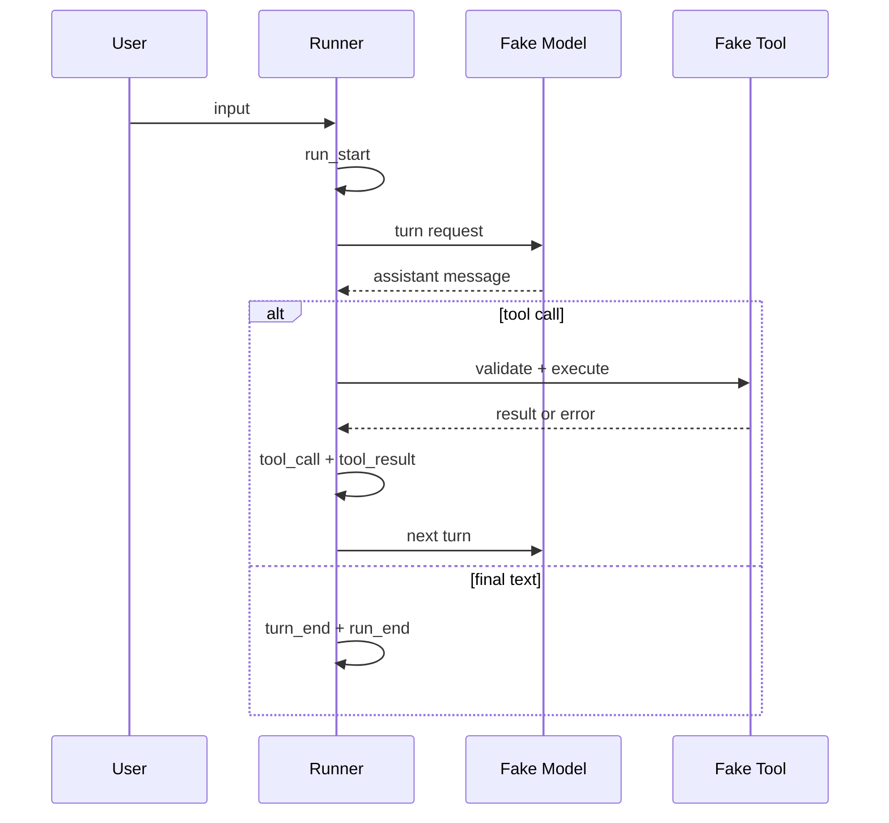

# 最小 Agent Run 实验

## 一句话结论

这个实验把 Agent 循环压缩到四个不变量：输入闭合、assistant message 完成、tool call 与 result 配对、run 以明确原因结束。它使用 fake model 和 fake tool，因此可以离线重复运行，用来观察框架必须保护的最小状态。

## 实验目录

```text
labs/minimal-run/
  package.json
  README.md
  src/model.mjs
  src/tools.mjs
  src/run.mjs
  test/minimal-run.test.mjs
```

| 文件 | 职责 |
| --- | --- |
| `src/model.mjs` | 按脚本顺序返回 assistant message。 |
| `src/tools.mjs` | 提供 echo 工具、参数校验和失败路径。 |
| `src/run.mjs` | 驱动最多 10 个 turn，发布事件并维护消息历史。 |
| `test/minimal-run.test.mjs` | 验证直接完成、工具成功和工具失败。 |

## 运行与测试

```bash
cd labs/minimal-run
npm start
npm test
```

`npm test` 会检查三条路径：

1. 模型直接返回文本，Run 以 `completed` 结束。
2. 模型请求 `echo`，实验产生配对 `tool_call` 和 `tool_result`。
3. 参数校验失败，`tool_result.isError` 为 `true`，失败观察仍进入历史。

## 事件模型



最小事件集如下：

| 事件 | 必须回答的问题 |
| --- | --- |
| `run_start` | 这次 Run 的输入是什么？ |
| `turn_start` / `turn_end` | 当前回合从哪里开始，为什么结束？ |
| `assistant_message` | 模型的完整响应是什么？ |
| `tool_call` / `tool_result` | 请求了什么，观察到了什么，是否失败？ |
| `run_end` | Run 是成功、达到上限，还是其他原因？ |

## 观察点

### 配对比成功更重要

工具失败也要生成 `tool_result`。如果只记录成功，恢复时会出现悬空 tool call；模型可能重复执行，或假设失败没有发生。

### 确定性先于真实感

fake model 不调用网络，fake tool 不写文件。这样失败一定来自循环逻辑，而不是模型波动、密钥或环境差异。先让最小基座稳定，再替换真实模型和工具。

### 结束原因要显式

实验区分 `completed` 和 `max_turns`。真实 Harness 还要区分用户取消、预算暂停、审批拒绝和不可重试错误。没有稳定结束原因，恢复逻辑就无法选择续跑、重试或交给人工。

## 迁移到真实 Harness

把实验迁到真实框架前检查：

1. **模型边界**：能否注入 fake `streamFn`、Provider 或模型适配器？
2. **工具边界**：Schema 校验、审批、沙箱和执行环境能否分别替换？
3. **事件边界**：内部事件能否导出为 JSONL、trace 或测试断言？
4. **持久化边界**：稳定消息、工具观察和结束原因在哪个提交点落盘？
5. **取消边界**：abort 后是否保留已发生副作用和配对结果？

如果第 1、2 项不能替换，测试会依赖外部服务；如果第 3、4 项缺失，失败无法归因；如果第 5 项缺失，取消会制造不可恢复状态。

## 自检问题

1. 为什么 fake tool 失败时仍要进入消息历史？
2. `max_turns` 保护了什么？它和超时有什么区别？
3. 如果把 echo 改成写文件，实验还需要增加哪些记录？
4. 你的框架能否在不停用网络的情况下运行这个实验？

## 相关页面

- [教材目录](../TOC.md)
- [一次 Agent Run 的完整生命周期](../01-core-concepts/agent-run-lifecycle.md)
- [设计模式与反模式](../04-comparisons/patterns.md)
- [术语表](../09-glossary/glossary.md)
