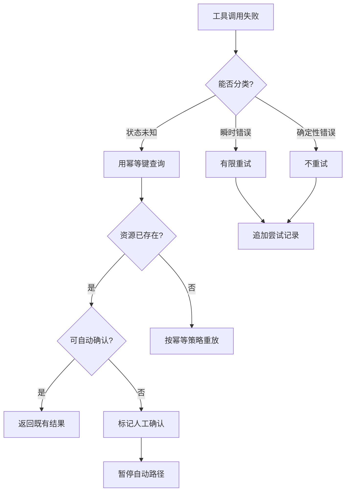

# Tool 重试副作用实验

## 一句话结论

工具重试的安全性取决于副作用状态，而不是调用是否抛出异常。这个实验用确定性工单服务比较三种处理：无键重试创建两张工单；相同幂等键只创建一张；首次提交后确认超时进入状态未知，系统查询结果并标记人工确认，而不是再次创建。

## 实验目录

```text
labs/retry-side-effects/
  package.json
  README.md
  src/service.mjs
  src/run.mjs
  test/retry-side-effects.test.mjs
```

| 文件 | 职责 |
| --- | --- |
| `src/service.mjs` | 提供工单账本、幂等去重和状态未知异常。 |
| `src/run.mjs` | 驱动无键、幂等和未知状态三条路径。 |
| `test/retry-side-effects.test.mjs` | 验证重复副作用、去重重放和人工升级。 |

## 运行与测试

```bash
cd labs/retry-side-effects
npm start
npm test
```

`npm start` 输出一个 JSON 对象，包含三条路径的尝试次数、返回值、账本和判定。测试会验证：

1. 两次无键调用产生 `ticket-1` 和 `ticket-2`。
2. 相同 `deploy-2026-08-23` 键调用两次，账本只有一张工单，第二次带 `deduplicated: true`。
3. `unknown-state` 首次调用只尝试一次；服务已提交工单，但调用方收到 `UNKNOWN_STATE`，随后查询并标记 `requiresHuman: true`。

## 决策流



三条路径对应不同契约：

| 路径 | 输入 | 结果 |
| --- | --- | --- |
| 无键重试 | 相同参数，无幂等键 | 两次提交，两个副作用 |
| 幂等重放 | 相同语义幂等键 | 一次提交，第二次返回既有结果 |
| 状态未知 | 提交后确认超时 | 不自动重试；查询、标记并等待人工 |

## 观察点

### 异常不等于失败

状态未知路径在服务端创建工单后抛出 `UNKNOWN_STATE`。对调用方来说，异常只说明“本次确认没有完成”，不说明“业务没有发生”。如果把所有异常都当成可重试失败，就会把一次成功提交变成两次副作用。

### 幂等键是语义契约

实验使用固定的 `deploy-2026-08-23`，两次调用得到同一个 ID。真实系统应由 Run ID、Step ID、目标资源和参数摘要等稳定信息生成键，并在超时、进程重启和恢复后保持不变。随机数或当前时间会让重试看起来像新请求。

### 审计先于重试

每次尝试都进入 `attempts`，每次提交都留在 `tickets`。这样即使调用失败，系统也能回答：发起了什么、提交了什么、返回了什么、还缺什么确认。重试不是覆盖上一次错误，而是在完整历史后追加新观察。

### 状态未知要显式升级

实验查询到既有工单后不自动宣布成功，而是标记 `requiresHuman`。这是因为假件无法证明业务验收条件已经满足。真实 Harness 应把人工确认、补偿或业务查询建模成独立状态；不能让模型根据一句“再试一次”决定资金、部署或删除类操作。

## 迁移到真实 Harness

把实验迁移到真实框架前检查：

1. **错误分类**：工具能否返回瞬时、确定性、部分完成和状态未知？
2. **键生命周期**：重试、超时、进程重启和 checkpoint 恢复是否复用同一键？
3. **副作用账本**：每次尝试和每次提交能否分开审计？
4. **查询接口**：状态未知时能否按幂等键查询远端结果？
5. **补偿路径**：不能自动确认的动作是否有取消、回滚或人工队列？

如果第 1、2 项缺失，重试会放大副作用；如果第 3、4 项缺失，失败无法归因；如果第 5 项缺失，系统只能在不安全和不可恢复之间选择。

## 自检问题

1. 为什么 `UNKNOWN_STATE` 不能直接映射成 `failed`？
2. 你的工具键在进程重启后还会一样吗？
3. 批量写入完成 3/8 后，重试应携带哪些记录？
4. 哪些工具可以自动重试，哪些必须进入人工队列？

## 相关页面

- [教材目录](../TOC.md)
- [Retry 与幂等](../02-harness-mechanics/retry-idempotency.md)
- [Tool 执行与副作用](../02-harness-mechanics/tool-execution.md)
- [Tool 结果与观察](../02-harness-mechanics/tool-results.md)
- [术语表](../09-glossary/glossary.md)
