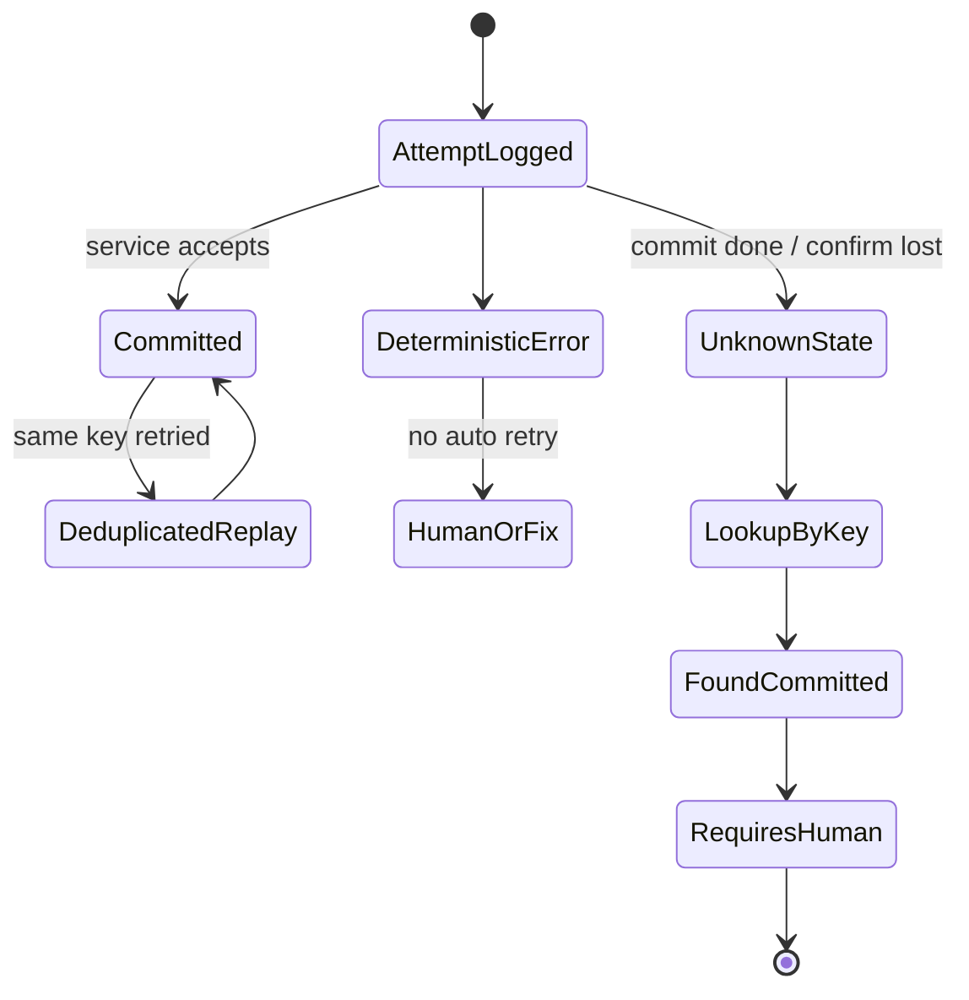
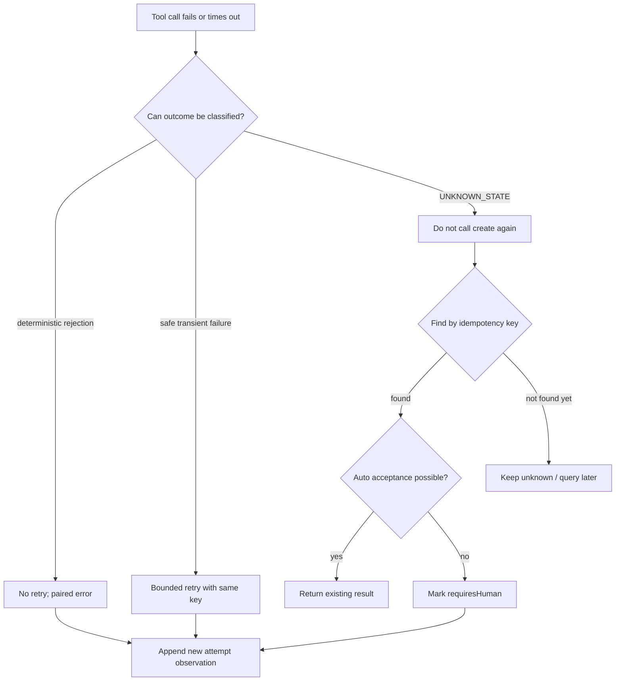

## 一句话结论

工具重试的安全性取决于副作用状态，而不是调用是否抛出异常。`labs/retry-side-effects` 用确定性工单服务比较三种处理：无键重试创建 `ticket-1` 和 `ticket-2`；同一幂等键重放只保留一张工单并返回 `deduplicated:true`；提交后确认超时抛出 `UNKNOWN_STATE`，系统不再次创建，而是把既有工单标记为 `requiresHuman:true`。

## 上一章遗留问题

[Context 膨胀实验](./context-bloat.md) 解决了「这次让模型看到什么」。本章解决执行尾部问题：如果调用抛错或超时，能否安全地再试一次？

## 本章解决什么矛盾

HTTP 异常只是传输层观察。远端可能在响应返回前已经提交工单、扣款或发布版本。因此 Harness 不能用统一的「失败就重试」规则；它需要区分确定性错误、瞬时错误、部分完成和状态未知，还要保证重试用同一个业务身份。

这个实验把矛盾压到三个问题：

1. 同一个意图被调用两次时，服务端看到几次请求？
2. 第二次请求如何知道第一次已生效？
3. 第一次结果不可见时，系统应查询、重试还是交给人工？

## 核心不变量

1. **先分类后重试**：只有确认安全或可去重的动作才自动重试；确定性错误不重试。
2. **键是业务身份**：相同语义动作使用相同 `idempotencyKey`；无键的重复参数是两个新请求。
3. **尝试与提交分离**：`attempts` 记录每次调用；`tickets` 记录每次真实提交。
4. **追加不覆盖**：失败、重放和人工标记都成为新观察，不删除前一次错误。
5. **未知不等于未发生**：`UNKNOWN_STATE` 触发查询和人工升级，不触发第二次 create。

失效边界：本假件没有网络分区恢复、TTL、并发同键竞争、补偿事务和跨进程租约。它能证明协议形状，不能证明分布式一致性。

## 理想模型



理想模型的关键分岔不是 success/failure，而是「远端状态是否可知」。只有已知未提交且动作安全才走自动重试；已知提交但不能自动验收时进入人工；未知先按键查询。

## 初学者主线

可以把工单系统想象成寄挂号信。直觉上，没收到回执不代表信没寄到；精确机制是，每封信有唯一编号，第二次寄送前先用编号查询签收记录；失效边界是，如果编号每次都变，邮局无法识别这是重复投递。

代码对应关系：

1. `createTicketService()` 内部维护 `committed` Map 和 `attempts` 数组（`labs/retry-side-effects/src/service.mjs:1-11`）。
2. 无键调用直接生成 `ticket-N`；带键调用先查 Map，命中就返回 `deduplicated:true`（`labs/retry-side-effects/src/service.mjs:12-27,35-37`）。
3. 带键的 unknown-state 先提交 `{ id:key }` 再抛 `UNKNOWN_STATE` 并携带 ticketId（`labs/retry-side-effects/src/service.mjs:29-33`）。
4. runner 的 catch 用 ticketId 立即 `markRequiresHuman`，而不是再次 create（`labs/retry-side-effects/src/run.mjs:2-13`）。

## 实验布局与运行

```text
labs/retry-side-effects/
  package.json
  README.md
  src/service.mjs
  src/run.mjs
  test/retry-side-effects.test.mjs
```

| 文件 | 职责 |
| --- | --- |
| `src/service.mjs:1-50` | 提供账本、幂等去重、unknown-state 注入和人工标记。 |
| `src/run.mjs:2-13` | 包装单次 attempt，把 UNKNOWN_STATE 转成 unknown + 升级。 |
| `src/run.mjs:15-52` | 驱动无键、带键和未知状态三组独立服务实例。 |
| `test/retry-side-effects.test.mjs:1-21` | 断言两张票、一张去重票、一次未知尝试和 requiresHuman。 |

在仓库根目录运行：

```bash
cd labs/retry-side-effects
npm start
npm test
```

2026-08-23 在 Node.js v26.7.0 中得到：

- `withoutKey`: attempts 2，tickets 为 `ticket-1`、`ticket-2`，`duplicated:true`。
- `withKey`: attempts 2；first 与 replay 的 id 都是 `deploy-2026-08-23`；replay 带 `deduplicated:true`；tickets 只有一张。
- `unknownState`: attempts 1；first.status 是 `"unknown"`；ticket `ticket-incident` 的 `requiresHuman:true`；后续 lookup 只是确认读取。
- `npm test` 输出：

```text
retry side effects lab: 3 paths passed
```

## 决策流



这张图强调：UNKNOWN_STATE 的下一步是查询，不是重放 create。只有查询证明资源不存在，且动作本身安全，才回到受控重试分支。

## 机制深拆

### 正常路径：无键 vs 幂等

无键路径两次调用 `{ title:"deploy" }`。service 每次都 push 一条 attempt，然后按 `committed.size + 1` 生成新 ID，所以账本出现两张票（`labs/retry-side-effects/src/service.mjs:16-22`）。这模拟了「参数一样但业务身份不同」的错误重试。

带键路径两次传入 `deploy-2026-08-23`。第一次写入 Map 并返回普通结果；第二次命中 Map，返回克隆结果加 `deduplicated:true`（`labs/retry-side-effects/src/service.mjs:25-27`）。attempts 是 2，tickets 是 1——这正是重试想要的形态：允许多次尝试，限制一次效果。

### 失败路径：提交成功但确认丢失

带键 unknown-state 按顺序发生四件事：

1. attempt 记录进数组。
2. service 创建 `{ id:"ticket-incident" }` 并放入 committed。
3. 抛出带 `code:"UNKNOWN_STATE"` 和 `ticketId` 的错误（`labs/retry-side-effects/src/service.mjs:29-32`）。
4. runner 的 catch 识别 code，调用 `markRequiresHuman(ticketId)`，返回 `{ status:"unknown", code, result }`（`labs/retry-side-effects/src/run.mjs:6-12`）。

因此实际输出中 `first.result.requiresHuman` 已经是 true。`runExperiment()` 后面的 lookup 读到同样状态；由于条件要求 `!lookup.requiresHuman` 才再次升级，`recovery` 保持为 first 结果。这不是 bug，而是幂等的防御式收尾：不会因为重复处理同一错误而翻转状态。

### 参数与环境

- Node.js 原生 ESM，无第三方依赖和网络访问。
- 每个 scenario 使用独立 `createTicketService()`，避免三个案例互相污染账本。
- unknown-state 只在 `title === "unknown-state"` 时注入；这是一个教学开关，不是通用 API。
- 无键 unknown-state 也会抛 `UNKNOWN_STATE`，但没有 ticketId，runner 返回 `result:null`。该路径未被主流程使用，但说明没有业务身份时连查询都无法进行。

### 审计结构

| 数据 | 回答的问题 |
| --- | --- |
| `attempts` | 发起过哪些调用？是否有无键重复？ |
| `tickets` | 远端真实提交了什么？ |
| `result.deduplicated` | 本次调用是新提交还是重放？ |
| `status:"unknown"` | 调用方未能确认结果，而非确定失败。 |
| `requiresHuman` | 已知存在副作用，但自动路径不应宣布成功。 |

## 反例与故障模式

1. **把所有异常当可重试失败**
   - 触发：catch 里统一 sleep 后重新调用 create。
   - 因果：unknown-state 的第一次提交已经成功，第二次 create 是新副作用。
   - 观察：账本出现两张工单，用户被扣款或部署两次。
   - 本实验防线：UNKNOWN_STATE 分支不再 create，而是按 ticketId 标记人工。
2. **每次重试生成新 UUID 键**
   - 触发：把幂等键写在 retry 循环内部。
   - 因果：服务端把每次尝试视为不同业务请求。
   - 观察：即使服务支持幂等，也无法去重。
   - 本实验防线：同一场景复用 `deploy-2026-08-23`。
3. **把 deduplicated 重写为全新成功**
   - 触发：重放命中后丢弃 `deduplicated` 标记，还发通知说“新建完成”。
   - 因果：混淆了「效果已存在」和「这次创建了效果」。
   - 观察：审计多出一次虚假创建事件。
   - 本实验防线：replay 结果显式携带 `deduplicated:true`。
4. **UNKNOWN_STATE 直接映射成 failed**
   - 触发：简化错误模型，只保留 ok/error。
   - 因果：模型收到“失败”后会尝试替代方案，例如换标题再建一张票。
   - 观察：旧票仍在，又出现规避性的新副作用。
   - 本实验防线：status 单独保留 `"unknown"`。
5. **人工标记被重复翻转**
   - 触发：每个看到 UNKNOWN_STATE 的组件都调用 mark/clear。
   - 因果：升级状态没有 owner 或幂等保护。
   - 观察：工单一会儿进入人工队列，一会儿被自动关闭。
   - 本实验防线：lookup 发现已是 `requiresHuman` 时不再改状态。
6. **attempts 被最新结果覆盖**
   - 触发：只保存最后一次 response/error。
   - 因果：无法回答“到底调用了几次、每次参数是什么”。
   - 观察：重复副作用难以归因，重试策略无法评估。
   - 本实验防线：attempts 数组只追加。
7. **无键未知仍尝试自动查询**
   - 触发：UNKNOWN_STATE 后想 find，但没有稳定业务键。
   - 因果：没有键就没有查询入口，只能靠非幂等的列表猜测。
   - 观察：可能误认别人的工单，或漏掉自己的提交。
   - 本实验边界：该路径返回 `result:null`，提醒键是查询前提。

## 一条完整因果链

场景：Agent 要创建部署工单，第一次请求超时：

1. **触发**：runner 调 `create({ idempotencyKey:"ticket-incident", title:"unknown-state" })`。
2. **远端提交**：service 把工单写入 committed；模拟响应在网络中丢失。
3. **异常上抛**：调用方收到 `UNKNOWN_STATE` 和 `ticketId:"ticket-incident"`。
4. **状态变化**：runner 不再 create；立即调用 `markRequiresHuman("ticket-incident")`。
5. **观察结果**：attempt 数量是 1，ticket 数量是 1；返回值是 `{ status:"unknown", code:"UNKNOWN_STATE", result:{...,requiresHuman:true} }`。
6. **确认读取**：后续 `find("ticket-incident")` 读到同一张票；因为它已被标记，防御分支不再二次升级。
7. **后续影响**：模型收到明确的 unknown 观察，可以解释等待原因；用户在队列里看到待确认工单；无论进程重启还是重放，同一键都不会造成第二张票。

这条链的核心是：异常处理的第一步不是恢复执行，而是弄清外部世界现在处于哪个状态。

## 设计取舍

| 取舍 | 选择 | 收益 | 代价 |
| --- | --- | --- | --- |
| 自动重放 vs 查询先行 | unknown 先查键 | 避免二次副作用 | 需要服务端查询接口 |
| 固定业务键 vs 新随机键 | 语义动作固定键 | 服务端可去重 | 键生命周期设计更难 |
| requiresHuman vs 自动验收 | 已知提交但不验收 | 不伪造业务成功 | 任务暂停，依赖人工队列 |
| attempts 数组 vs 最新状态 | 追加全部尝试 | 可归因、可测试 | 存储更多 |
| 独立 service 实例 | 三条路径互不影响 | 断言简单 | 无法演示跨场景共享状态 |

## 框架实现对照

本实验不是任何一家框架的重试模块复刻。真实机制见 [Retry 与幂等](../02-harness-mechanics/retry-idempotency.md)：

| 维度 | 最小实验 | Reasonix `aa82b2f` | DeepSeek Harness `b150a55` | Pi `c49906e` |
| --- | --- | --- | --- | --- |
| 重试对象 | 工具副作用 create | frozen sampling request / stream replay | agent/request-error waterfall | model auto retry + backoff |
| 安全约束 | 幂等键 + UNKNOWN_STATE 不重放 | attempt 上限、精确重放、usage 合并 | 只有 retry action 才 continue，失败不污染历史 | maxRetries/base delay、abortable wait |
| 记账 | attempts/tickets 分开 | sampling attempt 记录 | chunk/message 提交边界 | attempt 计数与 session 保留错误消息 |
| 未知处理 | 查键 + requiresHuman | 取决于具体副作用层，框架不假设业务接口 | 终态显式建模 | 错误消息保留但 live state 移除 |

方向性差异是：三家框架主要治理模型调用与流协议；业务副作用幂等通常要由工具作者、服务端和宿主策略共同提供。本实验补上的正是这一层。

## 实现精妙之处

1. **错误携带 ticketId**：UNKNOWN_STATE 不是空泛字符串，而是给出对账入口。
2. **升级内嵌在 catch 中**：第一次发现未知时就固化 requiresHuman，避免竞态重复处理。
3. **deduplicated 是一等字段**：调用方能区分新提交与既有效果。
4. **三实例隔离**：无键污染、幂等成功和未知升级互不覆盖证据。
5. **无键未知暴露缺口**：`result:null` 明确提示没有业务键就无法安全查询。

## 自检与面试追问

1. 为什么 `UNKNOWN_STATE` 不能直接映射成 `failed`？
2. 你的工具键由哪些字段组成？进程重启、fork 和 resume 后还会一样吗？
3. 如果批量写入完成 3/8 后超时，attempt、commit 和 partial 状态分别怎么记？
4. 哪些工具可以自动重试，哪些必须进入人工队列？判断依据来自哪一层？
5. 如何测试两个并发请求同时携带相同幂等键？
6. 补偿操作自身失败时，你的状态机会停在何处？

## 交给下一章的问题

L-04《审批拒绝恢复实验》将处理另一个控制点：审批被拒绝或取消后，Run 如何记录拒绝事实、恢复对话，又不把「人说不」误当成系统故障。

## 相关页面

- [教材目录](../TOC.md)
- [Retry 与幂等](../02-harness-mechanics/retry-idempotency.md)
- [Tool 执行与副作用](../02-harness-mechanics/tool-execution.md)
- [Tool 结果与观察](../02-harness-mechanics/tool-results.md)
- [Context 膨胀实验](./context-bloat.md)
- [审批拒绝恢复实验](./approval-rejection.md)
