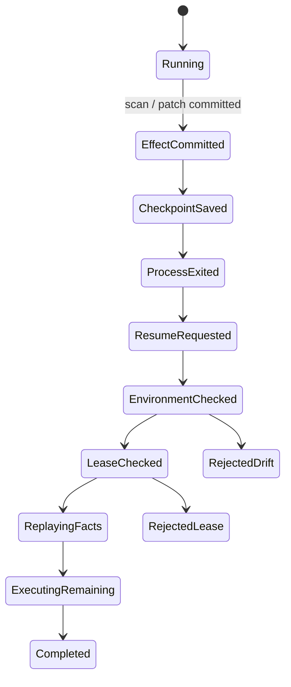
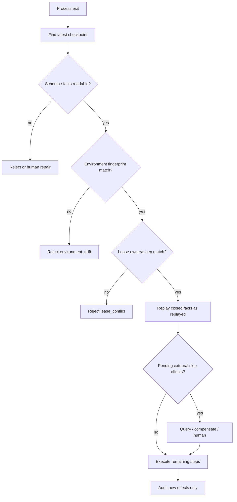

## 一句话结论

长任务恢复的关键不是记住「做到第几步」，而是在安全边界保存闭合事实和继续条件。`labs/long-task-recovery` 用扫描、修改、测试、发布四步模拟进程退出：无状态重跑产生 3 个重复副作用；检查点恢复只执行 `test` 和 `publish`，并把 `scan`、`patch` 标成 `replayed`；revision 从 `abc123` 变为 `def456` 时返回 `environment_drift`，租约不匹配返回 `lease_conflict`。

## 上一章遗留问题

[审批拒绝恢复实验](../05-labs/approval-rejection.md) 处理了执行前的控制权。本章处理更坏的情况：Run 正常推进到一半，进程消失了。新进程从哪里接手？哪些历史只能重放？哪些条件不允许自动继续？

## 本章解决什么矛盾

进度条会说「已完成 2/4」，但它不能回答：这两个副作用真的提交了吗？代码还是同一个 revision 吗？旧进程真的死了吗？如果新进程只凭屏幕状态续跑，可能重复 patch 文件、重复测试错误版本，甚至重复发布。案例必须把「事实」「意图」和「资格」分开。

## 核心不变量

1. **checkpoint 只含闭合事实**：只有已提交的 effect 才进入 `completedSteps`。
2. **恢复先验证资格**：workspace/revision 指纹和 lease owner/token 必须匹配。
3. **replayed 不等于 executed**：历史步骤重建为新 Run 的 `replayed` 事件，不计入 effects。
4. **next step 显式**：检查点保存 `test`，而不是让新进程猜测第几步。
5. **失败关闭**：环境漂移或租约冲突返回 rejected，不自动选择近似环境续跑。

失效边界：假件没有崩溃中途的 torn log、外部 API 对账、租约 TTL 和文件系统回滚。它验证协议形状，不证明分布式事务。

## 理想模型



理想模型先区分两类记录：effect 是外部世界已经改变的事实；checkpoint 是这些事实加继续条件的快照。恢复不是倒放时间，而是带着证据换一个执行者。

## 初学者主线

可以把长任务想象成搬家。直觉上，打包完的箱子要贴清单，搬运工换人时要核对地址和工单；精确机制是：封箱（effect 提交）后才写进清单，新工人必须出示相同工单号和地址指纹才能接手；失效边界是，清单不能证明箱子里的东西没有被房主又拿出来——所以真实系统还需要外部对账。

本实验的对应关系：

1. 第一次 Run 执行 `scan`、`patch` 后创建 checkpoint。
2. checkpoint 记录 fingerprint `/workspace/demo@abc123`、lease `{owner:"agent-a",token:"lease-1"}`、completedSteps 和 nextStep。
3. 新进程先比较指纹和租约，通过后 replay 历史步骤。
4. 只有剩余步骤会调用 execute。

## 实验布局与运行

```text
labs/long-task-recovery/
  package.json
  README.md
  src/recovery.mjs
  src/run.mjs
  test/long-task-recovery.test.mjs
```

| 文件 | 职责 |
| --- | --- |
| `src/recovery.mjs:1-23` | 维护 events/effects 账本并提供 execute。 |
| `src/recovery.mjs:31-53` | 构造无状态对照路径。 |
| `src/recovery.mjs:55-65` | 从闭合 effect 创建 checkpoint。 |
| `src/recovery.mjs:67-89` | 校验指纹/租约，replay 事实并执行剩余步骤。 |
| `src/run.mjs:3-27` | 组装无状态、有效恢复和环境漂移三组结果。 |
| `test/long-task-recovery.test.mjs:1-24` | 断言重复数、续跑入口、事件类型和拒绝原因。 |

在仓库根目录运行：

```bash
cd labs/long-task-recovery
npm start
npm test
```

2026-08-23 在 Node.js v26.7.0 中验证：

- 无状态对照：firstRunEffects 是 `scan,patch,test`，恢复 Run 再执行全部四步；`duplicatedSteps` 为 `["scan","patch","test"]`，`duplicateEffects` 是 3。
- checkpoint：schemaVersion 1，fingerprint `/workspace/demo@abc123`，completedSteps `["scan","patch"]`，nextStep `"test"`。
- 有效恢复：status resumed，executedSteps 只有 `["test","publish"]`；events 前 2 条是 replayed，随后是两条 effect 和 completed run_end。
- 漂移恢复：revision 改成 `def456` 后 status rejected，reason environment_drift。
- `npm test` 输出：

```text
long task recovery lab: 3 paths passed
```

额外边界实测：

- 租约改为 `{owner:"b",token:"other"}` 时返回 rejected/`lease_conflict`。
- 若四步都已闭合，checkpoint 的 nextStep 字段即使写成 `"unknown"`，恢复仍按 completedSteps 全部 replay，executedSteps 为空并以 completed 结束；这说明本实验以 `completedSteps` 数组为准，nextStep 是教学标注而非独立权威。

## 恢复决策流



这张图把恢复分成两段资格检查和一段对账。任何一段失败都不应自动放宽条件；正确动作通常是暂停、迁移工作区、接管租约或新建分支。

## 机制深拆

### 正常路径

第一次受控 Run 只执行 `scan` 和 `patch`。`createCheckpoint()` 过滤 `type === "effect"` 的事件，因此未发生的步骤不可能进入 completedSteps；nextStep 由闭合数量推出（`labs/long-task-recovery/src/recovery.mjs:55-65`）。

`resume()` 先比较 `${workspace}@${revision}`，再比较 lease 的 owner 和 token；两者都通过才创建新 Run（`labs/long-task-recovery/src/recovery.mjs:67-73`）。历史步骤逐条 append 成 `type:"replayed"`，剩余步骤才调用 execute（`labs/long-task-recovery/src/recovery.mjs:75-81`）。最终事件序列是：

1. replayed scan
2. replayed patch
3. effect test
4. effect publish
5. run_end completed

### 对照路径

`runWithoutState()` 刻意在新进程中重新执行所有步骤。结果是 firstRunEffects 与 recoveryEffects 有三个交集。这不是效率问题：patch 可能基于旧内容再次改写，test 可能测的是另一个 revision，scan 也可能覆盖现场日志。

### 参数与环境

- Node.js 原生 ESM，无第三方依赖和网络访问。
- fingerprint 目前只包含 workspace 路径和 revision 字符串；真实系统还应纳入依赖锁、容器镜像、策略版本和工具版本。
- lease 比较 owner/token，但没有 TTL 或心跳；旧进程是否死亡需要生产租约服务判断。
- 步骤列表固定为四步；真实 Harness 应把剩余计划作为可校验数据，而不是硬编码数组切片。

### 拒绝路径

漂移路径只改 revision，不动租约，因此在环境检查处停止并返回原 checkpoint 作为证据。租约边界实测中 owner/token 任一不匹配都会返回 `lease_conflict`。两个拒绝分支都不产生 events/effects，避免「拒绝恢复」本身污染账本。

## 反例与故障模式

1. **把 UI 进度当恢复状态**
   - 触发：前端显示 2/4，重启后直接从第 3 步开始。
   - 因果：界面不知道 effect 是否真正提交，也不知道环境是否变化。
   - 观察：看起来接着做，实际重复 patch 或在旧代码上测试。
   - 本实验防线：checkpoint 由闭合 effect 推导，不由显示比例推导。
2. **把进行中步骤写入 completedSteps**
   - 触发：为了减少丢失，在工具返回前就写 checkpoint。
   - 因果：半完成动作变成「已发生事实」。
   - 观察：恢复跳过该步骤，留下部分写入或未知远端状态。
   - 本实验防线：closedEvents 只取 effect 类型。
3. **忽略 revision 漂移**
   - 触发：用户 rebase 后自动 resume。
   - 因果：checkpoint 的事实来自 `abc123`，新代码是 `def456`。
   - 观察：旧 patch 结论被应用到不同代码，publish 发布错误版本。
   - 本实验防线：fingerprint 不匹配即 environment_drift。
4. **绕过租约双写**
   - 触发：旧进程只是卡顿并未退出，新进程直接接管。
   - 因果：两个 writer 都认为自己拥有 Run。
   - 观察：同一 Session 出现交错事件或重复发布。
   - 本实验防线：owner/token 不匹配返回 lease_conflict。
5. **把 replayed 当成新副作用**
   - 触发：恢复逻辑统一调用 execute 以“保证幂等”。
   - 因果：审计无法区分读取历史和再次修改世界。
   - 观察：账本出现两次 patch，成本和风险翻倍。
   - 本实验防线：历史步骤 append replayed，不计入 effects。
6. **信任 nextStep 字段而忽视事实数组**
   - 触发：手工编辑 checkpoint 把 nextStep 写错。
   - 因果：继续位置与闭合事实脱节。
   - 观察：跳步或死循环。
   - 本实验边界：实测 resume 按 completedSteps 计算；但生产 schema 应校验 nextStep 与事实一致。
7. **崩溃中的远端副作用没有对账**
   - 触发：publish 请求发出后响应丢失，checkpoint 没有 publish。
   - 因果：本地认为未执行，远端可能已成功。
   - 观察：恢复后第二次发布。
   - 正确方向：登记 attempt/unknown 状态，按 L-03 的键查询、补偿或人工裁决。

## 一条完整因果链

场景：迁移脚本在 patch 提交后、test 开始前进程崩溃：

1. **触发**：first Run 已执行 `scan` 和 `patch` 并各产生一条 effect；进程随即消失。
2. **状态变化**：checkpoint 记录 completedSteps `["scan","patch"]`、nextStep `"test"`、fingerprint `/workspace/demo@abc123` 和 lease `agent-a/lease-1`。
3. **恢复请求**：新进程载入 checkpoint，先比较 workspace/revision。
4. **资格确认**：revision 仍是 abc123，租约仍是 agent-a/lease-1，两道检查通过。
5. **事实重建**：新 Run append 两条 replayed 事件，表示「这些已发生，不再执行」。
6. **剩余执行**：execute 只作用于 test 和 publish；executedSteps 为 `["test","publish"]`。
7. **观察结果**：events 序列清楚显示 2 个 replayed、2 个 effect、1 个 completed 终态；effects 数组不含历史步骤。
8. **后续影响**：审计能回答恢复后新增了什么；若此时 revision 变成 def456，同样的请求会在资格检查处 rejected，不会拿新代码继续旧计划。

这条链的核心是：恢复不是「从第 N 步继续」这个数字，而是「携带哪些闭合事实、满足哪些接管条件」。

## 设计取舍

| 取舍 | 选择 | 收益 | 代价 |
| --- | --- | --- | --- |
| 无状态 vs checkpoint | checkpoint 只存闭合事实 | 避免重复副作用 | 需要持久化和 schema 管理 |
| fingerprint 范围 | workspace + revision | 能挡住演示级漂移 | 生产需扩展镜像/依赖/策略 |
| lease 校验 | owner/token 精确匹配 | 防双写 | 需要 TTL 和接管协议 |
| replayed/effect 分离 | 历史只重放记账 | 审计清晰 | UI 需要解释两种事件 |
| nextStep 标注 | 教学可读性优先 | 人能看懂继续点 | 必须防止与事实数组不一致 |

## 框架实现对照

本案例是最小恢复协议，不是三家框架的复刻。真实机制见 [Checkpoint 与 Resume](../02-harness-mechanics/checkpoint-resume.md) 与 [Persistence](../02-harness-mechanics/persistence.md)：

| 维度 | 最小案例 | Reasonix `aa82b2f` | DeepSeek Harness `b150a55` | Pi `c49906e` |
| --- | --- | --- | --- | --- |
| 权威事实 | closed effects 数组 | append-only event log，jsonl 兼容分页 | SessionEventMap 连续 seq source of truth | JSONL entry tree |
| 恢复门槛 | fingerprint + lease | CAS/saveVerified baseline/bounded lock | persistence.prepare + fused abort signal | cwd 断言 + 可取消 before-switch |
| 版本演进 | schemaVersion 字段 | WAL 重放预算，超限不得退回旧 checkpoint | writer-centric format bump，required event fail closed | v1→v3 迁移，orphan 显示为 root |
| 历史与新工作 | replayed vs effect | recovery branch / SaveRewrite | seed/end-seed 分隔继承前缀 | branch 移动 leaf，append-only entries |

差异在于：案例用内存对象演示不变量；三家要处理磁盘一致性、并发写者、torn tail 和迁移。不要把这个四步数组当成它们的存储模型。

## 实现精妙之处

1. **checkpoint 从 effect 过滤生成**：结构上杜绝把计划当事实。
2. **先验指纹再验租约**：环境错误和所有权错误分别报告，便于人工选择不同修复。
3. **replayed 事件显式存在**：恢复过程自身也进入审计序列。
4. **拒绝不写账**：rejected 返回携带 checkpoint 证据，但不制造新 effects。
5. **完成态自然收敛**：全部步骤闭合时 replay 全部、执行为零，不需要特殊分支。

## 自检与面试追问

1. 为什么不能把 UI 进度条当作唯一恢复状态？
2. 一个后台部署 ID 应保存在哪个字段组？恢复后先查询还是先补偿？
3. 如果 `patch` 已提交但文件被手工回滚，Resume 应该做什么？
4. 你的系统能否区分 replayed fact 和 new effect？
5. 租约持有者失联后，TTL、心跳和人工接管如何协同？
6. 如果 schemaVersion 升级且 checkpoint 含未知必需字段，应该拒绝还是迁移？

## 交给下一章的问题

CS-02《多 Agent 委派失败》将把所有权问题推进一步：父 Agent、子 Agent 和共享工作区同时存在时，谁有权提交状态？委派失败后如何隔离责任与恢复？

## 相关页面

- [教材目录](../TOC.md)
- [Checkpoint 与 Resume](../02-harness-mechanics/checkpoint-resume.md)
- [Persistence](../02-harness-mechanics/persistence.md)
- [Retry 与幂等](../02-harness-mechanics/retry-idempotency.md)
- [审批拒绝恢复实验](../05-labs/approval-rejection.md)
