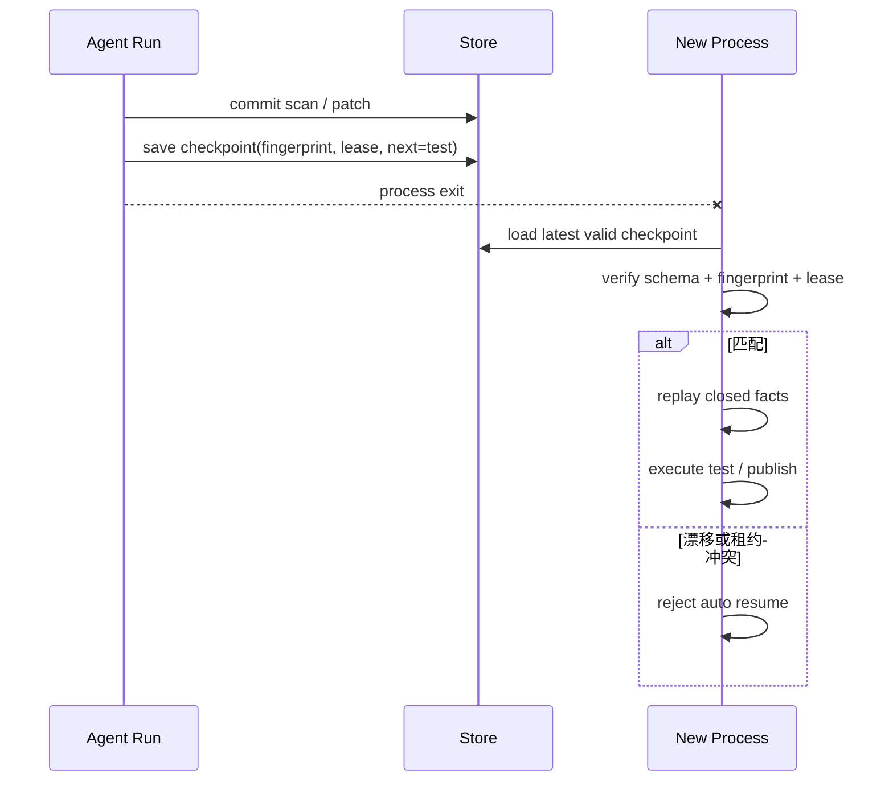

# 长任务中断恢复

## 一句话结论

长任务恢复的关键不是记住“做到第几步”，而是在安全边界保存已闭合事实和继续条件。这个案例用扫描、修改、测试、发布四个步骤模拟进程退出：无状态重跑重复执行三个副作用；检查点恢复只执行 `test` 和 `publish`；代码版本漂移时直接拒绝自动续跑。

## 案例目录

```text
labs/long-task-recovery/
  package.json
  README.md
  src/recovery.mjs
  src/run.mjs
  test/long-task-recovery.test.mjs
```

| 文件 | 职责 |
| --- | --- |
| `src/recovery.mjs` | 维护事件与副作用账本，创建检查点并执行 Resume 校验。 |
| `src/run.mjs` | 组装无状态重跑、有效恢复和环境漂移三条路径。 |
| `test/long-task-recovery.test.mjs` | 验证重复面、续跑入口、重放事件和拒绝原因。 |

## 运行与测试

```bash
cd labs/long-task-recovery
npm start
npm test
```

`npm start` 输出一个 JSON 对象。测试会验证：

1. 无状态路径第一次执行 `scan`、`patch`、`test`；新 Run 再执行四步，其中三步重复。
2. 检查点只记录两次闭合副作用，`completedSteps` 是 `["scan", "patch"]`，下一步是 `test`。
3. 相同环境和租约恢复时，旧步骤只标记为 `replayed`，新副作用只有 `test` 和 `publish`。
4. revision 从 `abc123` 变成 `def456` 后返回 `environment_drift`，不自动执行。

## 恢复流程



检查点字段分成两类：

| 类别 | 字段 | 作用 |
| --- | --- | --- |
| 已提交事实 | `completedSteps` | 说明哪些副作用已经发生，恢复时只重放为事实。 |
| 继续条件 | `schemaVersion`、`runId`、`fingerprint`、`lease`、`nextStep` | 判断新进程能否安全接手。 |

## 观察点

### 无状态重跑会放大副作用

第一次 Run 已经完成扫描、修改和测试，中断后从零启动又执行全部四步。三次重复不只是浪费：扫描可能覆盖日志，修改可能二次改写文件，测试结果也可能属于不同代码状态。长任务必须假设“上次可能已完成一部分”。

### Checkpoint 是边界而不是屏幕快照

实验在两个副作用闭合后生成检查点，不把未发生的步骤写入 `completedSteps`。这样恢复逻辑能明确区分三种记录：已提交的 effect、需要重放的 closed fact 和待执行的 next step。界面进度可以重建，权威恢复依据不能靠内存猜测。

### Resume 先验证再执行

有效路径匹配 `/workspace/demo@abc123` 和租约后才开始；漂移路径即使检查点存在也返回 `environment_drift`。真实系统还要校验 schema、依赖版本、容器镜像和工作区清理状态。验证失败的默认动作是暂停并交给人工选择迁移、放弃或新建分支。

### 重放与执行必须分开记账

恢复 Run 中，`scan` 和 `patch` 是 `replayed` 事件，`test` 和 `publish` 才是新 effect。这样审计者不会把“读取历史”误认为“再次执行”，也能准确回答恢复后新增了哪些副作用。

## 迁移到真实 Harness

把案例迁移到真实框架前检查：

1. **提交边界**：哪些工具结果、审批决定和后台任务可以进入检查点？
2. **外部对账**：崩溃时的部署、上传或写文件如何查询最终状态？
3. **指纹范围**：工作区、代码修订、容器镜像、依赖锁和策略版本是否纳入？
4. **租约协议**：旧进程死亡后租约何时过期？新进程如何接管？
5. **失败关闭**：版本漂移、损坏日志和冲突租约是否都能阻止自动续跑？

如果第 1、2 项缺失，恢复会重复副作用；如果第 3、4 项不足，错误环境会伪装成同一任务；如果第 5 项缺失，系统会在不确定状态下继续发布或删除。

## 自检问题

1. 为什么不能把 UI 进度条当作唯一恢复状态？
2. 一个后台部署 ID 应保存在哪个字段组？
3. 如果 `patch` 提交了但文件被手工回滚，Resume 应该做什么？
4. 你的系统能否区分 `replayed fact` 和 `new effect`？

## 相关页面

- [教材目录](../TOC.md)
- [Checkpoint 与 Resume](../02-harness-mechanics/checkpoint-resume.md)
- [Persistence](../02-harness-mechanics/persistence.md)
- [Retry 与幂等](../02-harness-mechanics/retry-idempotency.md)
- [术语表](../09-glossary/glossary.md)
