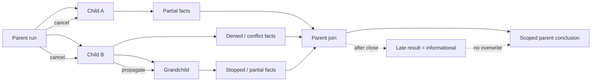
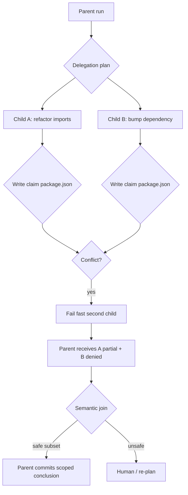

# 多 Agent 委派失败

## 一句话结论

多 Agent 失败的常见根因不是「模型错了」，而是所有权不清。本案例让两个子 Agent 同时修复同一模块：Reasonix 的写路径预留会让第二个 claim fail fast；DeepSeek Harness 用持久父子会话隔离历史并要求经活体父级路由；Pi 的文件变更队列把同一路径串行化，批次终止需要全员 terminate。共同底线是：子结果只能作为报告汇合，父 Run 才能提交最终状态。

## 上一章遗留问题

[长任务中断恢复](./long-task-recovery.md) 解决了单执行流的接管问题。CS-02 把复杂度推到多个执行流：如果两个子 Agent 都声称拥有 `package.json`，谁该停？父级收到一个成功和一个失败时，应提交哪个结论？

## 本章解决什么矛盾

串行委派安全但慢；完全并行快但会互相覆盖。工程上必须同时回答四个问题：

1. 谁批准分支启动？容量不足时排队还是快速失败？
2. 子 Agent 能继承哪些权限？能否读到父凭据？
3. 重叠写路径是等待、合并还是立即冲突？
4. 一个分支取消或超时后，其他分支和父级结论怎么办？

## 核心不变量

1. **权限取交集**：子 Agent 只继承父授权的子集，不自动获得凭据原文或新网络范围。
2. **写权唯一**：重叠路径的 writer claim 冲突必须 fail fast；父级写入可临时阻塞重叠子任务。
3. **会话有界**：子 Agent 拥有独立历史；浏览子 transcript 不等于激活子 Agent。
4. **汇合单向**：子任务返回报告；只有父 Run 在闭合边界提交最终结论。
5. **取消全树传播**：父级 abort 必须到达所有子孙分支；部分完成保留 partial 事实。
6. **迟到不覆盖**：join 完成后的迟来结果不能改写已经发布的父级结论。

这张图把失败传播分成两类：运行中的取消必须沿树下行；已经关闭的 join 只能接收 informational 迟到结果。两条路径都不能让子分支直接改写父级结论。

## 理想模型

理想模型把启动资格、执行隔离、冲突处理和语义汇合分开。fail fast 不是失败，而是把不可判定冲突交回父级。

## 初学者主线

可以把子 Agent 当作外包维修工。直觉上，两人不能同时改同一根水管；精确机制是，开工前领取工单和区域锁，第二个人发现锁被占用就停下汇报；失效边界是，即使两人改的是不同房间，最后都要由屋主验收——外包报告不能直接变成房产证。

对应到框架：

| 框架 | 类比机制 |
| --- | --- |
| Reasonix | 工头发放并发槽位和房间钥匙；嵌套请求没钥匙时立即退回。 |
| DeepSeek Harness | 每个外包组有独立工作日志，联系必须通过原介绍人。 |
| Pi | 本地工具队列保证同一文件按顺序改；全队同意提前收工才提前收工。 |

## 事故场景

任务：「重构导入语句并把测试依赖升到 v2」。

1. 父 Agent 创建 Child A：修改 `src/**` 导入，允许写 `src` 与 `package.json`。
2. 父 Agent 同时创建 Child B：更新 `package.json` dependencies。
3. Child A 先获得写路径 claim，随后也修改 dependencies 字段。
4. Child B 尝试获取同一文件 claim。
5. 父级在 join 时收到 A 的部分成功与 B 的冲突拒绝。

这个场景故意让资源声明过于宽泛。它测试的不是模型智力，而是 Harness 是否能在声明冲突时阻止第二次写入。

## 三家机制对照

### Reasonix：调度器与路径预留

M-14 已验证 Reasonix `aa82b2f` 的 `SubagentScheduler` 是 session-scoped controller，服务 task/fleet/parallel_tasks/profile skills/nested，维护 maxTotal/maxWriters（`external/DeepSeek-Reasonix/internal/agent/scheduler.go:36-55,78-107,305-333,199-226`）。

在本事故中：

- Child B 的 `package.json` claim 会命中 path overlap 或 whole-workspace conflict 检查。
- nested acquire 容量不足时 fail fast，不会排队等待父槽造成死锁。
- 若父级正在写重叠路径，ReserveParentWrite 可阻塞重叠子 claim 且不占子槽。

因此损害被限制在调度层：Child B 得到明确冲突原因，父级可以缩小 Child A 权限或拆分字段级协议后再重试。

### DeepSeek Harness：持久父子会话域

M-14 已验证 DeepSeek Harness `b150a55` 将子 Agent 建模为 durable parent-child session 域；SubagentAddress 由 parentSessionId、childSessionId 和 mode 组成；persisted transcript reads never activate an Agent，continuable prompt 经 live direct parent 进入 child inbox（`external/deepseek-harness/packages/host/apiproxy/src/api/subagents.ts:1-63`）。

在本事故中：

- A/B 有独立 child session，B 的失败历史不会被混入 A。
- 父级读取 B transcript 只用于诊断，不会意外唤醒 B。
- 若要给 B 新指令，必须经活体 direct parent 路由，防止跨树注入或孤儿唤醒。
- one-shot/continuable mode 决定失败后是否可以续派。

因此失败证据保留在 B 的会话中；父级汇合时能看到结构化失败，而不是丢失现场。

### Pi：mutation queue 与批次终止

M-14 已验证 Pi `c49906e` 的本地并行写保护由 per-file mutation queue 提供，使用 realpath key，同文件串行；不同文件仍可并行。BeforeToolCallResult.terminate 参与批内 early termination，但只有每个 finalized tool result 都 terminate 才提前结束批次（`external/pi/packages/coding-agent/src/core/tools/file-mutation-queue.ts:16-61`、`external/pi/packages/agent/src/types.ts:61-69,371-374`）。

在本事故中：

- 两个子任务的 realpath 相同，写操作进入同一队列串行化。
- 第二个写不会覆盖第一个的中间状态，但也不会自动合并语义冲突。
- 若 B 被 block 且设置 terminate，而 A 未 finalize terminate，批次不会因单个拒绝提前结束。
- 核心没有通用 subagent scheduler；跨流编排需宿主组合多个 AgentSession。

因此 Pi 把竞争降到进程内顺序问题，把业务合并决策留给宿主。

## 反例与故障模式

1. **资源声明过宽导致假冲突**
   - 触发：Child A 只需改 `src`，却被授予 `package.json` 写权。
   - 因果：宽泛 claim 与 B 的合法依赖更新重叠。
   - 观察：B fail fast，任务看似失败，实际只是授权计划错误。
   - 正确方向：先拆分资源范围，再重新委派；不要放宽冲突检查。
2. **用旧许可执行新意图**
   - 触发：B 失败后，父级复用 B 的旧审批去改 scripts 字段。
   - 因果：审批绑定原 action/resource，不是“以后都能改此文件”。
   - 观察：权限从一次修复扩大成持续写入能力。
   - 正确方向：新意图新 ID；参照 L-04 的替代申请流程。
3. **读取子 transcript 误触发子 Agent**
   - 触发：诊断系统为了总结失败直接向持久子会话发送 prompt。
   - 因果：把 persisted read 当成活体路由。
   - 观察：已结束或损坏的分支被意外唤醒，产生迟到副作用。
   - 正确方向：遵守 DeepSeek Harness 的 read-vs-route 分离。
4. **迟到结果覆盖父结论**
   - 触发：join 已发布「采用 A 方案」，B 的慢结果随后到达且显示成功。
   - 因果：join 层没有关闭窗口或没有 late-result 状态。
   - 观察：用户看到结论反转，审计无法判断哪次是权威。
   - 正确方向：迟到结果标记 informational/reopen request，不改写已提交结论。
5. **把 exit code 当语义成功**
   - 触发：A 进程退出码为 0，父级直接宣布依赖升级完成。
   - 因果：A 只改了 imports，dependencies 目标属于 B。
   - 观察：发布缺少依赖变更，运行时崩溃。
   - 正确方向：join contract 按 task goal 校验产物，不只看退出码。
6. **单个 block 提前杀死整个批次**
   - 触发：Pi 宿主误以为任一 terminate 就能结束批次。
   - 因果：破坏 batch early termination 的全员一致条件。
   - 观察：其他合法调用被丢弃，配对观察缺失。
   - 正确方向：等待全部 finalized result 都 terminate。
7. **取消只停在第一层**
   - 触发：父 cancel 后只 abort 直接子 Agent。
   - 因果：孙级分支仍持有租约或写句柄。
   - 观察：孤儿分支继续写文件，恢复时出现双写。
   - 正确方向：取消沿 delegation tree 全量传播，partial 结果入账。

## 一条完整因果链

场景延续上文：Child A 与 Child B 同时委派，B 撞上写路径：

1. **触发**：A 获得 `package.json` writer claim 并开始修改 imports；B 请求同路径 claim。
2. **状态变化**：
   - Reasonix：scheduler 判定 overlap/nested capacity 问题，B fail fast。
   - DeepSeek Harness：B 的 child session 记录失败，父 transcript 只保存引用与结论。
   - Pi：B 的 mutation 排队或被宿主策略 block，A 先完成。
3. **父级观察**：join 输入不是两个 success，而是 A partial success + B denied/conflict。
4. **语义审查**：父级核对 task goal，发现依赖更新未完成；不能把 A 的 imports 重构冒充完整任务。
5. **修正路径**：父级缩小 A 的未来资源范围，或拆出字段级协议；若继续委派，使用新审批 ID 和新的 child session/mode。
6. **观察结果**：最终父 Run 只提交「imports 已重构，依赖待处理」这一可证实结论。
7. **后续影响**：B 的失败留在独立会话中供诊断；迟到的 A 补充结果不能再翻转已发布结论；用户看到的是诚实部分完成，而不是虚假全绿。

这条链说明多 Agent 安全的关键不在并行本身，而在 claim、路由、join 和提交四层契约是否闭合。

## 设计取舍

| 取舍 | 收益 | 代价 | 适用条件 |
| --- | --- | --- | --- |
| fail fast 写冲突 | 阻止覆盖，错误清晰 | 任务可能频繁重试 | 路径可静态声明 |
| 同文件串行 queue | 实现简单，保序 | 吞吐下降 | 单机高频小写操作 |
| durable child session | 诊断完整，可续聊 | 存储/GC 成本高 | 服务化长任务 |
| 全员 terminate 批次规则 | 不误杀合法调用 | 批尾等待可能增加延迟 | 并行工具批 |
| 父级唯一提交者 | 结论权威单一 | 子 Agent 自治受限 | 所有生产委派 |

## 框架实现对照

以下行为继承 M-14 的 Implementation Review；固定快照为 Reasonix `aa82b2f`、DeepSeek Harness `b150a55`、Pi `c49906e`。

| 框架 | 关键机制 | 锚点 |
| --- | --- | --- |
| Reasonix | SubagentScheduler 配额、nested fail fast、path/whole-workspace conflict、ReserveParentWrite。 | `internal/agent/scheduler.go:36-55,78-107,305-333,199-226` |
| DeepSeek Harness | durable parent-child sessions、SubagentAddress、read-vs-route 分离、one-shot/continuable。 | `packages/host/apiproxy/src/api/subagents.ts:1-63` |
| Pi | per-file mutation queue、realpath key、terminate 需全员 finalized。 | `packages/coding-agent/src/core/tools/file-mutation-queue.ts:16-61`、`packages/agent/src/types.ts:61-69,371-374` |

补充对照见 [X-03 工具协议对比](../04-comparisons/tools.md)：Pi 任一 sequential 工具会让整批串行，这是有意保证写入顺序的设计，而不是 bug。

## 实现精妙之处

1. **Reasonix 的 parentClaims 不占子槽**：区分父级临时持锁与子任务并发额度，避免父写饿死计数。
2. **Reasonix 的 whole-workspace claim**：给不可静态分析的副作用一条保守通道，而不是假装安全并行。
3. **DeepSeek 的 diagnostic entry**：corrupt/unavailable 子会话仍在 catalog 中可见，便于清理而非神秘消失。
4. **DeepSeek 的 live direct parent 路由**：降低跨树注入和孤儿唤醒。
5. **Pi 的 realpath 归一化**：避免 symlink 让同文件绕过队列。
6. **Pi 的一致 terminate 条件**：保护批次中尚未完成调用的配对观察。

## 自检与面试追问

1. 你的 scheduler 如何处理路径声明错误的 opaque 工具？
2. 两个子 Agent 分别写同一 JSON 文件的不同字段，是否允许？需要什么协议？
3. 如何证明 nested fail fast 能避免死锁？画出一个会死锁的反例时序。
4. 孤儿 child session 何时归档？GC 会不会删除尚需对账的失败证据？
5. join 如何比较两个候选方案？评分函数包含哪些正确性与风险维度？
6. 父级取消后，如何在有限时间内通知所有子孙分支？

## 交给下一章的问题

第六章案例到此完成。第七章 Q-01《概念与架构题》将把这些机制转化为可考核的问题链：每个答案都要能追溯到概念、机制或源码锚点，而不是停留在名词解释。

## 相关页面

- [教材目录](../TOC.md)
- [Subagent 与并发](../02-harness-mechanics/subagent-concurrency.md)
- [审批模型](../02-harness-mechanics/approval.md)
- [工具协议对比](../04-comparisons/tools.md)
- [长任务中断恢复](./long-task-recovery.md)
