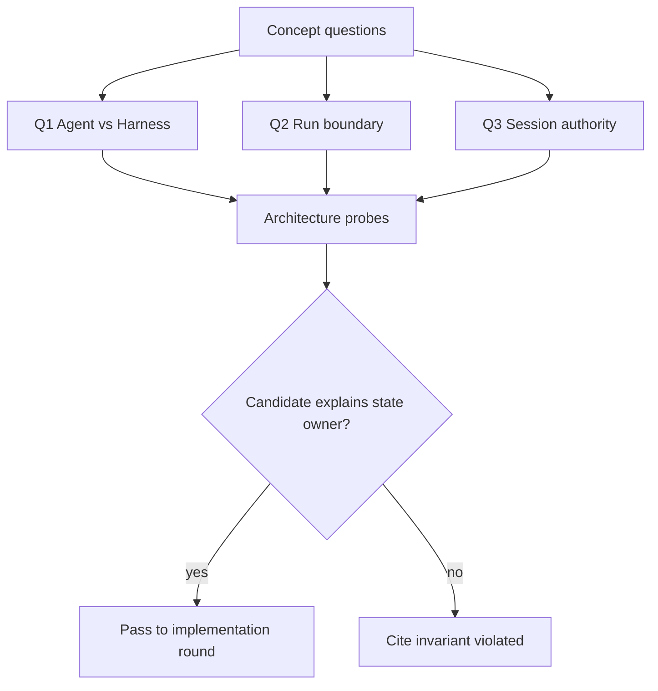
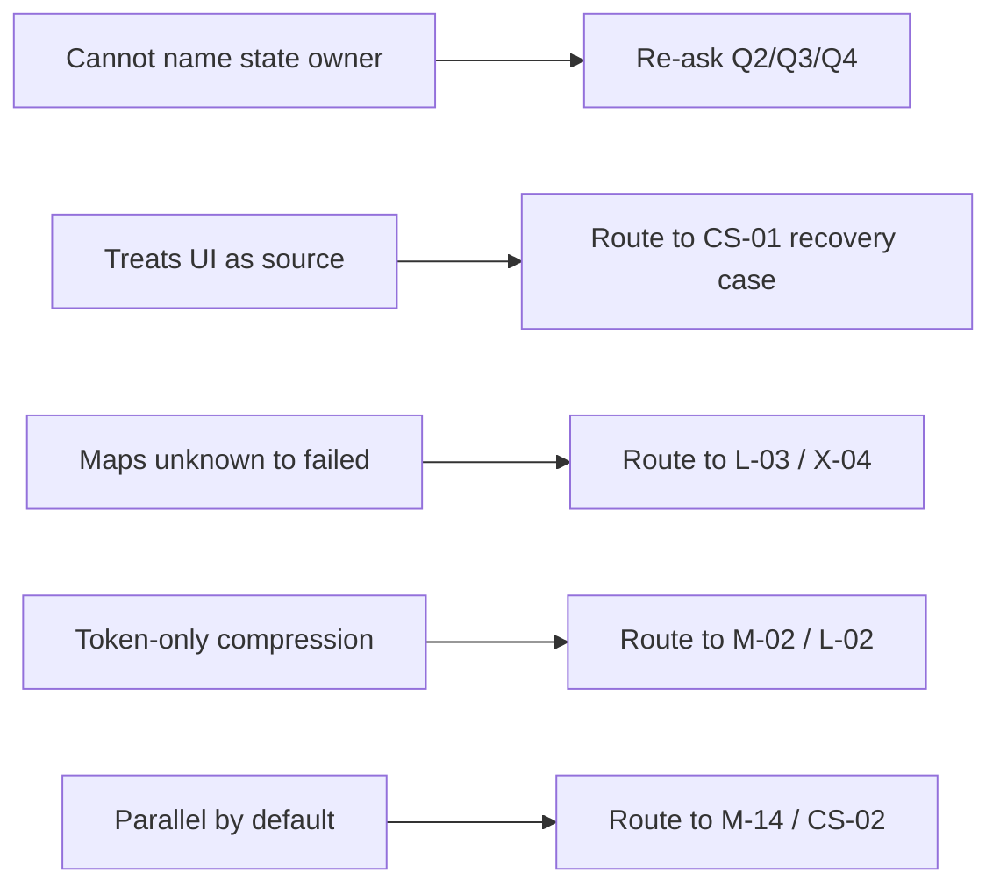

## 一句话结论

这一章不是名词表，而是 10 个可练习的判断题：每个问题都要求候选人指出状态归谁、失败走哪条分支、错误设计破坏了哪条不变量。参考答案采用「直觉 → 精确机制 → 失效边界」三层结构，并链接回已验证章节。

## 使用方法

1. 先遮住「参考答案」，只看问题和考察点作答。
2. 对照答案检查是否说出中间因果，而不是只给结论。
3. 用「常见错误」定位自己混淆的概念。
4. 面试官可用「追问」升级到系统设计或调试场景。

## 核心不变量

1. **Agent 提议，Harness 裁决**：模型输出是意图；副作用需要策略、审批和环境边界。
2. **权威先于投影**：UI、模型请求和报表都从权威历史派生。
3. **闭合才提交**：完整 assistant message 和配对 tool result 才是恢复依据。
4. **事件不等于事实**：过程观测可以缓冲或丢弃策略化处理，durable 记录必须可解释。
5. **压缩只作用于投影**：安全约束、用户纠正和任务前提不能被静默删除。

## 题目总览

这张图可作为面试路线：前三题测概念分层，后续题目沿生命周期推进；任何一题只要说不出状态所有者，就应引用对应不变量继续追问。

这张图是面试官的分流器：概念答错时不要直接给答案，而是按错误类型路由到对应章节或下一轮问题，检验候选人能否在证据链中自我修正。

## 十道核心题

### Q1：Agent 和 Harness 的职责边界是什么？

**考察点**：能否把「模型生成」与「受控执行」分开。

**参考答案**：

1. 直觉：Agent 是会提出方案的实习生，Harness 是拥有门禁和预算的主管。
2. 精确机制：模型输出 tool call 只是提议；Harness 负责 Schema 校验、权限策略、审批、沙箱、结果投影和审计。
3. 失效边界：如果提示词被当成防火墙，外部内容仍可能诱导越权动作。

**常见错误**：把 Agent 定义成“带工具的 LLM”，忽略状态所有权和治理层。

**追问**：用户消息可信吗？README 内容进入上下文后属于哪类输入？

**证据入口**：[Agent 与 Harness 的边界](../01-core-concepts/agent-vs-harness.md)。

### Q2：一次 Run 从哪里开始，到哪里结束？

**考察点**：Run 边界、终态建模和崩溃孤儿。

**参考答案**：

1. 直觉：Run 是一次有编号的任务执行，不是一次 HTTP 请求。
2. 精确机制：以非空用户输入开启 Run；经过采样、工具批、steering 和预算控制；以显式原因结束，例如 completed、aborted、blocked、error、max-tokens 或 interrupted。DeepSeek Harness `b150a55` 甚至把崩溃孤儿建模为持久化后端补写的 interrupted（`packages/core/session/src/types.ts:155-173`）。
3. 失效边界：没有稳定终态时，恢复逻辑无法区分成功、取消和预算耗尽。

**常见错误**：认为 UI 关闭就是 Run 终止；忽略进程死亡后的历史仍然有效。

**追问**：max-tokens 为什么通常要保持 sticky？它和普通 error 有何不同？

**证据入口**：[一次 Agent Run 的完整生命周期](../01-core-concepts/agent-run-lifecycle.md)。

### Q3：为什么 assistant 流式草稿不能直接写入 Session？

**考察点**：partial output、committed fact 和 durable record 的区别。

**参考答案**：

1. 直觉：白板上的半句话还不是会议纪要。
2. 精确机制：chunk 可用于投影和重连；完整 message 才携带 usage、终止原因并可成为下一轮请求依据。Pi `c49906e` 在 coding-agent 层等到 `message_end` 后才追加 SessionManager entry（`packages/coding-agent/src/core/session-manager.ts:1020-1067`）。
3. 失效边界：若把 draft 写入权威历史，刷新、resume 或 fork 会保存半句话，后续请求基于残缺指令推理。

**常见错误**：把“低延迟显示”和“状态提交”混成一个动作。

**追问**：如果用户在流式中途 steer，旧草稿应如何处置？

**证据入口**：[事件与流式](../01-core-concepts/events-and-streaming.md)。

### Q4：Session 应该保存消息数组还是事件日志？

**考察点**：权威状态模型和多投影需求。

**参考答案**：

1. 直觉：会议纪要按时间追加，摘要可以重写，但不能涂改原始纪要。
2. 精确机制：DeepSeek Harness `b150a55` 用 append-only SessionEventMap 作为 source of truth，连续 seq 连 raw chunk 都保留；模型历史由 surface 派生（`packages/core/session/src/types.ts:230-436`）。Reasonix 则以锁保护的消息历史加 CAS 快照为中心，event log 作为 WAL。
3. 失效边界：若压缩直接改写权威日志，fork、resume 和审计失去共同答案。

**常见错误**：只比较性能，不讨论谁能重建 UI、请求和审计三类投影。

**追问**：surface replacement 为什么必须记录 sourceEventSeqs？

**证据入口**：[Session、Turn 与状态模型](../01-core-concepts/session-and-state.md)。

### Q5：Context 组装时哪些内容必须来自 durable facts？

**考察点**：投影来源、请求头和临时注入边界。

**参考答案**：

1. 直觉：答卷只能引用已经写进档案的事实。
2. 精确机制：M-01 要求上下文从已提交事实派生；system sections、dynamic contexts、tool declarations 可组合，但扩展拦截不能污染权威日志。Reasonix 在每次采样前 Prepare 并冻结 Request（`internal/agent/sampling_request.go:88-155,157-174`）。
3. 失效边界：临时 prompt 改写若无审计，事后无法解释模型为何看到某条约束。

**常见错误**：认为 system prompt 不属于 Context 审计范围。

**追问**：extension override 本次 system prompt 时，应该留下什么证据？

**证据入口**：[Context 组装与分层](../02-harness-mechanics/context-assembly.md)。

### Q6：压缩器可以丢弃什么？绝不能丢什么？

**考察点**：保留优先级和不可重建信息。

**参考答案**：

1. 直觉：行李超重时丢替换品，护照不能丢。
2. 精确机制：M-02 的不变量是权威不改写、tool call/result 不拆散、摘要必须带来源。L-02 进一步验证 pinned 安全规则、任务目标、用户纠正优先于普通过程细节。
3. 失效边界：静默删掉「不要重启数据库」会让模型重复被禁止动作。

**常见错误**：用 token 数作为唯一排序键，忽略语义风险。

**追问**：超大 tool result 应该截断、摘要还是落盘分页？各自丢失什么？

**证据入口**：[Context 压缩与截断](../02-harness-mechanics/context-compression.md)、[Context 膨胀实验](../05-labs/context-bloat.md)。

### Q7：事件流中的 raw chunk 为什么要保留？

**考察点**：诊断、缓存失效和协议演进。

**参考答案**：

1. 直觉：监控录像比剪辑版更能还原事故。
2. 精确机制：DeepSeek Harness 的事件日志连 raw chunks 也占 seq，保证 sequence 连续且 persistence 可以 verbatim 存储；assistant/message 再用 sourceEventSeqs 引用来源（`packages/core/session/src/types.ts:230-436`）。
3. 失效边界：只保存最终 message 时，无法回答某个字符何时出现、重连从哪里续传，也难以审计 provider 行为。

**常见错误**：认为 raw chunk 只影响存储成本，不影响正确性。

**追问**：如果要脱敏 raw chunk，如何同时保住审计能力？

**证据入口**：[事件与流式](../01-core-concepts/events-and-streaming.md)。

### Q8：架构上如何防止子 Agent 直接改写父级结论？

**考察点**：委派所有权和汇合契约。

**参考答案**：

1. 直觉：外包报告交给屋主验收，而不是直接改房产证。
2. 精确机制：CS-02 归纳的不变量是父 Run 唯一提交者；子 Agent 返回报告，父级在闭合边界做语义 join。M-14 还要求重叠写路径 fail fast、父级写权可阻塞重叠子任务。
3. 失效边界：迟到子结果若能覆盖已发布结论，会产生两个权威版本。

**常见错误**：把并行度当作主要目标，忽略 claim/route/join/commit 四层契约。

**追问**：两个子 Agent 分别写同一 JSON 文件的不同字段，需要什么协议？

**证据入口**：[多 Agent 委派失败](../06-case-studies/multi-agent-failure.md)。

### Q9：恢复时 checkpoint 应包含什么？不应包含什么？

**考察点**：闭合事实、环境资格和接管条件。

**参考答案**：

1. 直觉：搬家清单只登记封箱完成的东西，还要核对地址和工单。
2. 精确机制：CS-01 验证 checkpoint 由 closed effects 推导 completedSteps，并保存 workspace/revision fingerprint 与 lease；恢复先验证资格再 replay 历史。
3. 失效边界：把进行中步骤写成已完成会导致跳步；revision 变化后继续旧计划会发布错误版本。

**常见错误**：把 UI 进度条当唯一状态；忘记租约冲突也是拒绝理由。

**追问**：后台部署已发出但响应丢失，checkpoint 应如何登记？

**证据入口**：[Checkpoint 与 Resume](../02-harness-mechanics/checkpoint-resume.md)、[长任务中断恢复](../06-case-studies/long-task-recovery.md)。

### Q10：审批服务超时应返回 denied 还是独立状态？

**考察点**：决策终态建模和失败关闭。

**参考答案**：

1. 直觉：考官没来不代表考生不及格。
2. 精确机制：M-06/X-04 区分 rejected、cancelled、unavailable 等终态；DeepSeek Harness `b150a55` 对 unavailable degrade to deny，并用 distinct reason 让模型知道没有审批通道而非人说不（`packages/core/tools/src/index.ts:1678-1729`）。
3. 失效边界：统一映射成 failed 会让模型换路径绕过审批；默认 allow 更危险。

**常见错误**：为了可用性把 undecided 当 allow；或为了安全把它伪装成人拒绝，导致误判用户体验。

**追问**：审批通道恢复后，pending 请求应由谁重新发起？

**证据入口**：[审批模型](../02-harness-mechanics/approval.md)、[安全与审批对比](../04-comparisons/security.md)。

## 反例与故障模式

1. **名词式答题**
   - 触发：只会说“Harness 管工具”。
   - 因果：没有说明状态所有者和裁决顺序。
   - 后果：无法设计审批、沙箱和恢复接口。
   - 修正方向：每句结论补上「谁拥有状态、失败走哪条分支」。
2. **把 UI 当真源**
   - 触发：进度条决定 resume 起点。
   - 因果：界面不知道 effect 是否提交、环境是否漂移。
   - 后果：跳步或重复副作用。
   - 修正方向：从权威日志推导恢复锚点。
3. **把异常统一当失败**
   - 触发：UNKNOWN_STATE 也自动重试。
   - 因果：远端可能已提交。
   - 后果：二次扣款、重复部署。
   - 修正方向：先分类，再查询或人工对账。
4. **压缩只看 token**
   - 触发：从最老消息开始删。
   - 因果：安全规则和用户纠正可能被挤出。
   - 后果：模型重复禁止动作。
   - 修正方向：pinned 语义优先，dropped 记录审计。
5. **把并行当默认**
   - 触发：所有 tool call 同时执行。
   - 因果：写路径冲突和依赖顺序失控。
   - 后果：文件覆盖、乱序观察、批次配对缺失。
   - 修正方向：显式并发分类和调度契约。

## 一条完整因果链

面试题「用户在长会话中纠正了数据库不能重启，后来上下文超限」：

1. **触发**：correction 进入历史，但未标 priority；后续日志和检索片段使请求超过预算。
2. **状态变化**：压缩器选择 recency-only 策略；correction 因较老被 dropped，且没有 dropped 记录。
3. **观察结果**：下一次请求看不到禁令；模型提议重启数据库；UI 显示正常执行。
4. **审计缺口**：因为无 dropped 记录，团队先怀疑模型幻觉，再怀疑工具故障。
5. **根因定位**：对照 M-02/L-02 的不变量，发现压缩破坏了「用户纠正不可静默删除」。
6. **修正方案**：correction 设为 pinned；bounded projection 保留约束；dropped 记录 id/reason/tokens。
7. **后续影响**：同预算下模型不再提议重启；审计能解释本次视图盲区；权威历史可用于复盘。

## 设计取舍

| 取舍 | 收益 | 代价 |
| --- | --- | --- |
| 10 题主线 | 覆盖第一、二章主干，避免碎片化 | 不含第三章源码细节，留给 Q-02 |
| 三层答案 | 训练因果表达 | 准备成本高于背名词 |
| 错误答案归因 | 定位概念混淆 | 需要维护与章节同步 |
| 追问升级 | 连接系统设计 | 面试官需熟悉后续章节 |

## 框架实现对照

本章不自建新结论。涉及三家行为时只复述以下章节中已验证的固定快照结论：

| 主题 | 固定快照 | 证据入口 |
| --- | --- | --- |
| Run 终态 / interrupted | Reasonix `aa82b2f`、DeepSeek Harness `b150a55`、Pi `c49906e` | [C-02](../01-core-concepts/agent-run-lifecycle.md) |
| Session 权威与事件日志 | 同上三固定快照 | [C-03](../01-core-concepts/session-and-state.md)、[C-04](../01-core-concepts/events-and-streaming.md) |
| 组装 / 冻结请求 | 同上三固定快照 | [M-01](../02-harness-mechanics/context-assembly.md) |
| 压缩不变量 | 同上三固定快照 | [M-02](../02-harness-mechanics/context-compression.md) |
| 审批四态示例 | DeepSeek Harness `b150a55` 等 | [X-04](../04-comparisons/security.md) |

这种间接引用让题库保持稳定；批量终审只需复核被链接章节，不必维护第二份行号表。

## 实现精妙之处

1. **每题绑定不变量**：错误答案不只是错，而是指明破坏了哪条保护。
2. **追问分级**：概念题可直接升级为系统设计和调试题。
3. **证据分层**：题库引用章节，章节引用锚点，避免多处漂移。
4. **常见错误来自真实故障模式**：UI-as-truth、unknown-retry、token-only compression 都是前文验证过的事故形态。
5. **一条跨题因果链**：把 Q5/Q6/Q9 的知识串成同一事故，检验迁移能力。

## 自检与面试追问

1. 你能否在不看答案的情况下说出 Q1-Q10 各自的状态所有者？
2. 哪些题最适合作为 30 分钟电话面的主轴？
3. 如果候选人只答出结论，你会先追哪个中间步骤？
4. 本题库缺哪类概念题？是否应补充评测或多语言路由？
5. 你的产品术语与本教程不一致时，应如何映射？

## 交给下一章的问题

Q-02《实现与调试题》将进入第三章和实验细节：给定一段失败 transcript 或 JSONL，如何定位工具校验、流式中断、取消配对和恢复锚点问题。

## 相关页面

- [教材目录](../TOC.md)
- [Agent 与 Harness 的边界](../01-core-concepts/agent-vs-harness.md)
- [一次 Agent Run 的完整生命周期](../01-core-concepts/agent-run-lifecycle.md)
- [Session、Turn 与状态模型](../01-core-concepts/session-and-state.md)
- [事件与流式](../01-core-concepts/events-and-streaming.md)
- [Context 组装与分层](../02-harness-mechanics/context-assembly.md)
- [Context 压缩与截断](../02-harness-mechanics/context-compression.md)
