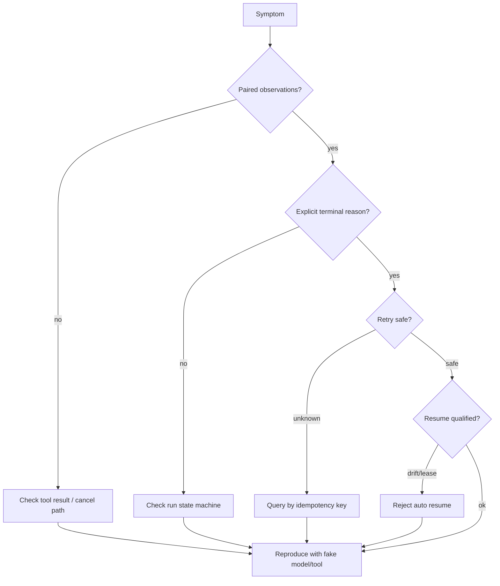
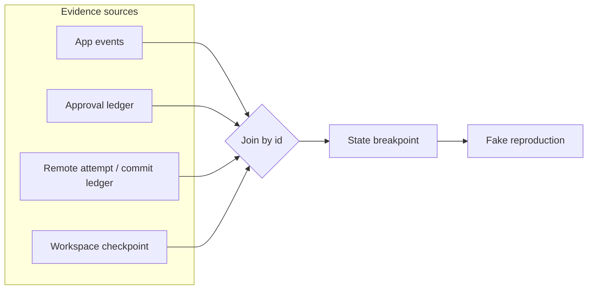

# 实现与调试题

## 一句话结论

调试 Harness 不是读报错文案，而是回答四个问题：哪条不变量断了？状态停在哪一层？哪些证据能证明？修复会不会引入新副作用？本章给出 10 个场景化题目，每题都要求从 symptom 推到 state breakpoint，再给出可用测试验证的修复。

## 使用方法

1. 面试官先给 symptom 和最小日志，不给章节链接。
2. 候选人按「假设 → 证据 → 状态断点 → 修复 → 回归测试」作答。
3. 参考答案只作为评分链，不替代候选人自己列出证据顺序。
4. 追问用于区分「背过机制」和「能定位线上事故」。

## 核心不变量

1. **观察配对**：tool call 必须有 result 或结构化 error；取消也不能留下悬空调用。
2. **失败分类**：deterministic、transient、partial、unknown 是不同分支，不能统一 retry。
3. **流式与提交分层**：chunk 是投影，完整 message 才是 durable fact。
4. **取消全树传播**：abort 要到达进程树和所有子任务，且保留 partial 事实。
5. **恢复先验资格**：schema/fingerprint/lease 通过后才 replay，replayed 不计入新 effect。

## 故障排查路线

这张图是答题顺序：先检查最便宜的协议缺口（配对、终态），再进入成本更高的重试和恢复分析，最后用确定性假件复现。

这张图提醒候选人：单一日志流无法定位跨层事故。必须按 approval id、attempt id 或 run id 把四类证据 join 起来，才能指出状态断点并用假件复现。

## 十个调试场景

### D1：日志里 assistant 有 toolCall，但没有对应 toolResult

**症状**：崩溃后 transcript 出现悬空 call；下一轮 provider 报非法消息序列。

**参考答案链**：

1. 断点：工具批的配对写入没有完成，或 catch 分支只记录了异常没构造 observation。
2. 正确行为：即使 execute 抛错也要生成 `isError:true` 的 result 并入历史（L-01 已验证该路径）。
3. 修复：在 runner 层补 synthetic result；对已发生的远端动作另建 unknown 对账记录。
4. 回归：构造 fake tool throw + process restart，断言无悬空 call。

**常见错误**：直接删除悬空 toolCall；这会掩盖已发生副作用。

**证据入口**：[Tool 执行与副作用](../02-harness-mechanics/tool-execution.md)、[最小 Agent Run 实验](../05-labs/minimal-run.md)。

### D2：参数通过了 JSON.parse，但工具仍然越权写文件

**症状**：Schema 校验成功，安全审计发现路径在工作区外。

**参考答案链**：

1. 断点：把「语法合法」当成「语义授权」。
2. 正确行为：Reasonix `aa82b2f` 在 executeOne 中 parse 后还有 policy/confineWrite 等治理（`internal/agent/execute_one.go:21-66,137-178`）；Pi 在 validated args 后才调用 beforeToolCall（`packages/agent/src/agent-loop.ts:600-668`）。
3. 修复：策略基于规范化 realpath 和资源范围判断；为越权尝试增加审计事件。
4. 回归：symlink 指向外部目录的 fixture 必须被拒。

**常见错误**：只在 UI 层提示危险命令，以为黑名单是执法器。

**追问**：opaque 工具无法声明路径时，默认 claim 应该是什么？

**证据入口**：[Tool Schema 与调用协议](../02-harness-mechanics/tool-schema.md)、[Sandbox 与权限](../02-harness-mechanics/sandbox.md)。

### D3：用户看到流式文本，重启后这段话消失

**症状**：前端渲染了 chunk，Session 里没有 message。

**参考答案链**：

1. 断点：投影与 durable 提交混淆。
2. 正确行为：Pi `c49906e` 只有 `message_end` 后追加 entry 才 queryable（`packages/coding-agent/src/core/session-manager.ts:1020-1067`）；DeepSeek Harness 用连续 seq 保留 raw chunks 再派生 message（`packages/core/session/src/types.ts:230-436`）。
3. 修复：UI 明示 streaming/durable 两态；重连使用 snapshot+buffer，而不是把草稿当历史。
4. 回归：中断流后 reload，断言权威历史不含半句。

**常见错误**：为了省事把 partial text 直接 append 进 Session。

**证据入口**：[事件与流式](../01-core-concepts/events-and-streaming.md)。

### D4：取消后远端 API 已执行，本地却标记 success 缺失

**症状**：调用方 abort，服务端创建了工单，本地只有 timeout 错误。

**参考答案链**：

1. 断点：把传输层异常映射成业务失败。
2. 正确行为：L-03 验证 UNKNOWN_STATE 必须独立建模，用幂等键查询并标记 requiresHuman，而不是再次 create。DeepSeek Harness `b150a55` 也区分 caller cancellation 与 approval cancellation（`packages/core/tools/src/index.ts:1510-1545,1678-1729`）。
3. 修复：attempt/commit 分账；unknown 状态接查询接口。
4. 回归：模拟 commit 后丢响应，断言 attempts=1、tickets=1。

**常见错误**：catch 里 sleep 后原样重试。

**证据入口**：[Retry 与幂等](../02-harness-mechanics/retry-idempotency.md)、[Tool 重试副作用实验](../05-labs/retry-side-effects.md)。

### D5：自动重试成功了，但资源出现两份

**症状**：第二次请求返回新 ID，账本多一条记录。

**参考答案链**：

1. 断点：幂等键在 retry 循环内重新生成。
2. 正确行为：相同语义动作必须复用键；DeepSeek request-error waterfall 只在显式 retry action 时 continue（`packages/core/agent-loop/src/agent.ts:372-389`）；Pi 的错误 assistant message 从 live state 移除但 session 保留（`packages/coding-agent/src/core/agent-session.ts:2807-2860`）。
3. 修复：key 由 Run ID+Step ID+目标资源摘要组成，并在 checkpoint 中持久化。
4. 回归：两次相同 key 调用，tickets 必须为 1 且 replay 带 deduplicated。

**常见错误**：把 deduplicated 结果通知成“新建完成”。

**证据入口**：同 D4。

### D6：父级取消后，子 Agent 还在写文件

**症状**：Run 显示 cancelled，工作区文件继续变化。

**参考答案链**：

1. 断点：取消只停在第一层，没有沿委派树传播。
2. 正确行为：M-09 要求取消传播到子任务和进程树。Pi `c49906e` 的 bash 工具用 timeoutHandle 与 abort listener 都调用 killProcessTree（`packages/coding-agent/src/core/tools/bash.ts:115-151`）；Reasonix 取消会 clearAll approvals 并填充剩余结果（`internal/control/controller.go:2052-2119`、`internal/agent/execute_batch.go:250-340`）。
3. 修复：delegation tree 广播 abort；孙级持有租约必须释放。
4. 回归：三层嵌套任务中取消父级，断言所有分支 stopped 且 partial 入账。

**常见错误**：只 abort 直接 child，忽略 detached descendant。

**证据入口**：[Timeout 与 Cancellation](../02-harness-mechanics/timeout-cancellation.md)。

### D7：并行批次中一个调用被 block，其他结果消失

**症状**：用户看到整批失败，但其中三个调用本应成功。

**参考答案链**：

1. 断点：误把单个 terminate 当成批次终止条件。
2. 正确行为：Pi `c49906e` 只有每个 finalized tool result 都 terminate 才提前结束（`packages/coding-agent/src/types.ts:61-69,371-374`）。
3. 修复：调度器等待 finalized 状态；block 的调用生成 error result，不影响其他配对。
4. 回归：混合 allow/block 批次，断言全部有 observation。

**常见错误**：fail fast 用在只读批上，浪费已完成计算。

**证据入口**：[Subagent 与并发](../02-harness-mechanics/subagent-concurrency.md)。

### D8：恢复后重复执行了 scan 和 patch

**症状**：checkpoint 显示 completedSteps 包含这两步，但 effects 又出现同名步骤。

**参考答案链**：

1. 断点：resume 把 replayed fact 当成待执行任务。
2. 正确行为：CS-01 验证正确序列是 replayed scan/patch + effect test/publish；executedSteps 只含剩余步骤。
3. 修复：恢复器区分 event type；effects 计数排除 replayed。
4. 回归：伪造 completedSteps 与 nextStep 不一致的 checkpoint，应拒绝或修正。

**常见错误**：为了“保证幂等”统一再跑一遍。

**证据入口**：[Checkpoint 与 Resume](../02-harness-mechanics/checkpoint-resume.md)、[长任务中断恢复](../06-case-studies/long-task-recovery.md)。

### D9：revision 变了但系统继续旧计划

**症状**：Git rebase 后自动 resume，发布了基于旧代码的产物。

**参考答案链**：

1. 断点：缺少环境指纹校验，或指纹范围太窄。
2. 正确行为：CS-01 验证 `/workspace/demo@abc123` 与 `def456` 不匹配时返回 environment_drift。
3. 修复：fingerprint 纳入依赖锁、镜像和策略版本；漂移默认拒绝并要求人工迁移。
4. 回归：改 revision 字段必须 rejected，不产生 events/effects。

**常见错误**：只比较路径字符串，忽略内容身份。

**证据入口**：同 D8。

### D10：审批服务短暂宕机期间高危命令被执行

**症状**：监控显示 approval unavailable，但 deploy 工具照常运行。

**参考答案链**：

1. 断点：unavailable 被映射成 allow，或者根本没有接入 pre-execute。
2. 正确行为：DeepSeek Harness `b150a55` serviceAsk 在无服务/无 agent/unavailable 时 deny，并用 distinct reason（`packages/core/tools/src/index.ts:1678-1729`）；monotonic guard 之后仍只能追加拒绝（`:1100-1128`）。
3. 修复：pre-execute 强制接线；unavailable 返回独立错误码并暂停队列。
4. 回归：拔掉 approval service，高危调用必须在 dispatch 前失败。

**常见错误**：把“提高可用性”实现成超时后默认放行。

**证据入口**：[审批模型](../02-harness-mechanics/approval.md)、[安全与审批对比](../04-comparisons/security.md)。

## 反例与故障模式

1. **只读报错文案**
   - 触发：看到 timeout 就改 timeout 数值。
   - 因果：没有区分连接、提交和确认阶段。
   - 后果：重复副作用或更长的无效等待。
   - 修正：先画出状态机断点，再调参。
2. **在生产环境试修复**
   - 触发：没有假件就重放真实流量。
   - 因果：无法控制变量，也无法安全制造取消。
   - 后果：二次污染数据。
   - 修正：用 fake model/fake tool 复现最小序列。
3. **相信单一日志流**
   - 触发：只看应用日志，不看审批库和远端账本。
   - 因果：decision 与 effect 分离存储却未关联 ID。
   - 后果：无法证明副作用授权来源。
   - 修正：跨账本按 approval id / attempt id join。
4. **把重试当万能恢复**
   - 触发：任何非 200 都 retry。
   - 因果：忽略 deterministic 与 unknown 分类。
   - 后果：放大副作用、烧预算。
   - 修正：错误分类表进代码评审。
5. **修复不改回归**
   - 触发：手动测试一次就上线。
   - 因果：竞态和恢复路径难以手工触发。
   - 后果：同一事故复发。
   - 修正：每个修复必须带确定性复现测试。

## 一条完整因果链

场景：发布工具第一次请求超时，值班工程师直接点了重试：

1. **触发**：provider 网关 30s 超时；服务端实际已在 28s 时创建部署。
2. **状态变化**：本地 attempt 记录 timeout；远端 ticket 已存在但没有回执。
3. **第一次错误**：重试使用新生成的 UUID，服务端视为新请求，创建第二个部署。
4. **观察结果**：两个部署同时运行，配置互相覆盖；用户看到“重试成功”。
5. **诊断**：按 D4/D5 检查 attempt/commit 分账，发现无幂等键且 UNKNOWN_STATE 未建模。
6. **修复**：key 固定为 `deploy:{env}:{revision}`；timeout 映射 unknown；按键查询到既有部署后标 requiresHuman，不再 create。
7. **后续影响**：回归测试覆盖“commit 后丢响应”；同类支付/发布工具复用同一契约；值班手册新增“先查询再重试”。

这条链说明：调试终点不是让当前请求成功，而是让下一次同类故障在协议层不可能发生。

## 设计取舍

| 取舍 | 收益 | 代价 |
| --- | --- | --- |
| 场景题而非笔试题 | 接近线上事故推理 | 准备日志样例成本高 |
| 先协议后性能 | 保住不变量 | 可能显得“优化不够” |
| 假件优先复现 | 安全、确定性强 | 需要维护 fixture |
| 证据链评分 | 区分背题与实战 | 评分标准更细 |

## 框架实现对照

以下行为继承第二、三章已通过的 Implementation Review；固定快照为 Reasonix `aa82b2f`、DeepSeek Harness `b150a55`、Pi `c49906e`。

| 调试域 | 关键锚点 |
| --- | --- |
| 工具 Schema/校验 | Reasonix `internal/tool/tool.go:20-43,279-330`；DSH `packages/core/tools/src/index.ts:211-288`；Pi `packages/agent/src/agent-loop.ts:586-668` |
| 执行治理 | Reasonix `internal/agent/execute_one.go:21-66,137-178`；DSH `index.ts:1329-1505`；Pi `agent-loop.ts:670-700,713-790` |
| 重试 | Reasonix `run_loop.go:340-459`；DSH `agent.ts:372-389`；Pi `settings-manager.ts:878-905` |
| 取消 | Reasonix `controller.go:2052-2119`；DSH `tools/index.ts:1510-1545`；Pi `tools/bash.ts:115-151` |
| 流式提交 | Pi `session-manager.ts:1020-1067`；DSH `types.ts:230-436` |

面试中不要求背诵行号；要求能说明这些机制分别挡住哪类事故。

## 实现精妙之处

1. **symptom-first 出题**：每题从可见现象开始，模拟值班情境而非教科书定义。
2. **修复必须带回回归**：把“如何证明修好了”纳入评分。
3. **反模式来自真实事故**：token-only compression、unknown-retry、single-layer cancel 都是前文验证过的故障形态。
4. **跨章证据分层**：答案链引用章节，章节绑定锚点，避免题库复制行号。
5. **一条端到端事故链**：从错误操作到协议修复，展示调试的最终交付物是约束而非补丁。

## 自检与面试追问

1. 你能否在不看答案的情况下说出 D1-D10 各自的状态断点？
2. 哪些题适合 60 分钟现场 coding？哪些适合口头架构面？
3. 如果候选人坚持“先加监控”，你会如何引导他先描述状态机？
4. 你的团队事故复盘是否产出新的回归 fixture？
5. 本题库缺哪类调试域？（例如 MCP 连接、评测噪声）

## 交给下一章的问题

Q-03《安全与系统设计题》将从单点故障转向对抗性场景：如何在有限预算下设计沙箱、注入防护、审批降级和多 Agent 成本控制？

## 相关页面

- [教材目录](../TOC.md)
- [Tool Schema 与调用协议](../02-harness-mechanics/tool-schema.md)
- [Tool 执行与副作用](../02-harness-mechanics/tool-execution.md)
- [Retry 与幂等](../02-harness-mechanics/retry-idempotency.md)
- [Timeout 与 Cancellation](../02-harness-mechanics/timeout-cancellation.md)
- [概念与架构题](./concepts.md)
