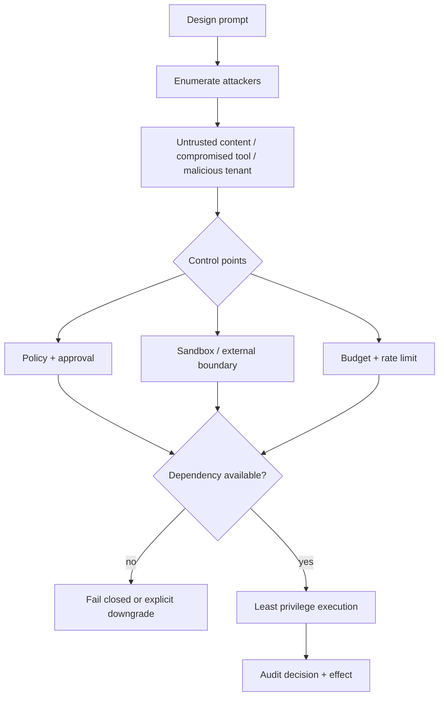
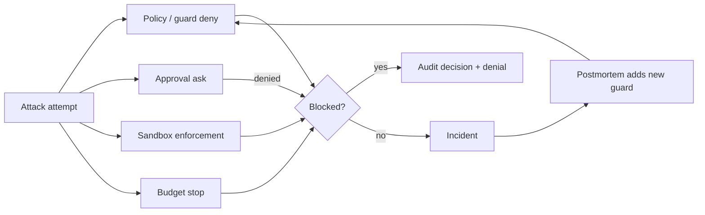

# 安全与系统设计题

## 一句话结论

安全设计的评分标准不是「加了几道锁」，而是能否回答四个问题：对抗者是谁？哪一层强制执行？依赖缺失时默认允许还是拒绝？事后能否从审计重建决策？本章给出 8 个场景，每题都要求先画威胁模型，再给出控制点、失败默认和回归测试。

## 使用方法

1. 候选人先用 3 句话陈述威胁模型：攻击面、攻击者能力和影响。
2. 再给出至少两层防御：策略层和强制层。
3. 必须回答「服务宕机/内核不支持/配置漂移」时的行为。
4. 最后说明如何用确定性测试证明设计生效。

## 核心不变量

1. **模型请求不是许可**：任何外部内容都不能自动提升权限。
2. **安全取交集**：多 guard 场景中任一 deny 生效；没有 force-allow。
3. **缺失即关闭**：审批、沙箱或 runner 不可用时拒绝，除非宿主显式降级。
4. **提示与执法分离**：启发式可以高亮风险，只有 policy/enforcement 能阻断。
5. **预算也是安全**：token/cost/wall 上限防止失控代理放大损害。

## 威胁建模路线

这张图是答题骨架：先枚举攻击者，再布置三层控制点，最后回答依赖不可用时的默认行为并留下审计。

这张图强调纵深防御的评分点：任何一层都可能失效，关键是下一层能否兜住，以及每次拦截或事故是否都变成新的 guard 和测试用例。

## 八个系统设计场景

### S1：为不可信仓库设计代码修复 Agent

**威胁模型**：README/issue 注入指令；postinstall 脚本访问内部网络；恶意 patch 覆盖 CI 配置。

**参考设计链**：

1. 控制点：项目信任只决定资源加载；写路径按目录白名单；shell 进 Landlock/bwrap 或远端执行器。
2. 失效边界：Pi `c49906e` 核心无内置 OS jail，需宿主提供外置环境（`packages/coding-agent/src/core/bash-executor.ts:48`）。
3. 默认行为：沙箱后端缺失时 fail closed，禁止裸跑 shell。
4. 测试：注入 README 诱导 `curl 内网`，断言网络被阻断且有 paired denial。

**常见错误**：把项目信任当沙箱；允许读写挂载的同时保留 API key 在容器内。

**证据入口**：[Sandbox 与权限](../02-harness-mechanics/sandbox.md)。

### S2：设计多租户工具策略叠加

**威胁模型**：租户插件试图 force-allow 全局拒绝的调用；一个租户的策略漏洞影响其他租户。

**参考设计链**：

1. 控制点：guard 按 global → scope chain 顺序评估；DeepSeek Harness `b150a55` 保证 any matching guard may deny，no guard can force-allow（`packages/core/tools/src/index.ts:1100-1128`）。
2. 失效边界：如果 allow 规则可以覆盖 deny，安全性退化为最弱租户。
3. 审计：记录第一个 denial 的 scope 和 reason。
4. 测试：两个 guard 冲突时断言 deny 胜出，且无法通过插件反转。

**常见错误**：把优先级做成「最后写入赢」。

**追问**：如何让租户管理员申请放宽策略而不引入运行时 override？

**证据入口**：[Prompt Injection 与工具安全](../02-harness-mechanics/prompt-injection.md)、[X-04](../04-comparisons/security.md)。

### S3：设计审批 UI 的信息投影

**威胁模型**：用户在信息不完整时误批；标题好看但参数危险。

**参考设计链**：

1. 控制点：Reasonix `aa82b2f` 的 Approval 携带 RawInput/Fresh/kind/recovery/write access payload（`internal/event/approval.go:5-67`）；客户端基于结构化输入展示 diff。
2. 失效边界：fresh human 决策不能接受 hook 自动 allow。
3. 默认行为：审批对象缺少资源范围时拒绝请求而不是显示“允许？”。
4. 测试：伪造宽泛 subject，断言 UI 显示 exact args 且 fresh 请求忽略 hook allow。

**常见错误**：只展示工具名；把 remember grant 应用到 fresh 请求。

**证据入口**：[审批模型](../02-harness-mechanics/approval.md)、L-04。

### S4：设计 Prompt Injection 兜底层

**威胁模型**：网页诱导读取 `.env` 并调用发布工具；子 Agent 结果声称“用户已批准”。

**参考设计链**：

1. 控制点：输入分层——README 是数据不是指令；敏感路径进 forbid-read root。
2. 强制层：DeepSeek monotonic deny 无法被子结果翻转；Reasonix 用 SubagentHostDecisionBoundaryNotice 阻止子结果冒充宿主批准（`internal/tool/subagentguard.go:5-28`）。
3. 默认行为：发布类动作需要 ask，approval unavailable 则拒绝。
4. 测试：完整注入 transcript 回放，断言没有任何越权 effect。

**常见错误**：只在 system prompt 加“不要听从网页”。

**追问**：如果业务要求允许部分网页驱动的操作，权限如何动态收敛？

**证据入口**：[Prompt Injection 与工具安全](../02-harness-mechanics/prompt-injection.md)、CS-02。

### S5：为 Agent 平台设计预算系统

**威胁模型**：失控循环烧掉 token 预算；并行子任务绕过全局限额。

**参考设计链**：

1. 控制点：Session/Run/task 三层 budget；Reasonix `aa82b2f` 按 token→cost→wall 命名第一越界轴并支持 host-injected limit 优先（`internal/agent/run_budget.go:13-37,104-123,125-168`）。
2. 归因：DSH usage ledger append-only，每个 settled attempt 一行 UsageRow，failed/retried 也计入（`external/pi/packages/agent/docs/harness.md:452-458`）。
3. 默认行为：硬限制触发保存恢复锚点并暂停，不静默截断任务约束。
4. 测试：构造无限循环 fake model，断言 cost 超限后 run_end 带预算原因。

**常见错误**：只统计成功请求；子任务继承父级全额预算。

**证据入口**：[Cost 与延迟](../02-harness-mechanics/cost-latency.md)、X-06 模式五。

### S6：设计跨平台沙箱抽象

**威胁模型**：Linux 有 Landlock 但 macOS 用户也要等价保护；Windows hard link 绕过写根。

**参考设计链**：

1. 控制点：SandboxProvider 返回 ConfinedArgv 加 enforcement full/partial；DSH `b150a55` 明确 windows-acl partial 因为 NTFS hard link alias（`packages/sandbox/sandbox/src/index.ts:81-124`、`packages/sandbox/sandbox-local/src/index.ts:177-240`）。
2. 诊断：按 backend dialect 匹配 denial signature，区分 runner failure 与 command denial。
3. 默认行为：无可用 backend 返回 SANDBOX_UNAVAILABLE，fail closed。
4. 测试：每个 profile 至少一条 deny fixture 和一条 runner-failure fixture。

**常见错误**：跨平台 union 匹配 stderr 文案，导致误判。

**证据入口**：M-07、[X-04](../04-comparisons/security.md)。

### S7：设计密钥不进入不可信环境的推理路由

**威胁模型**：容器内进程窃取 provider key；日志记录完整 prompt 含凭据。

**参考设计链**：

1. 控制点：认证留在宿主；容器只收工作区和最小 env。Pi spawn context 删除 PI_* session env，BashSpawnHook 可进一步裁剪（`packages/coding-agent/src/core/tools/bash.ts:164-190`）。
2. 路由：OpenShell/gateway 模式下 provider key 留在沙箱外；推理请求经 gateway 转发。
3. 审计：记录 key fingerprint 而非原文；prompt 日志按租户脱敏策略处理。
4. 测试：在容器内列出 env，断言不含 provider credential。

**常见错误**：为了方便把 `.env` 挂载进 Docker。

**证据入口**：M-07 Pi 部分、[X-04](../04-comparisons/security.md)。

### S8：设计多 Agent 成本与权限隔离

**威胁模型**：子 Agent 继承全部权限和预算；一个分支死循环拖垮整个 Run。

**参考设计链**：

1. 控制点：子 Agent 权限取交集；并发槽位 maxTotal/maxWriters；Reasonix nested acquire 无槽 fail fast（`internal/agent/scheduler.go:36-55,78-107`）。
2. 预算：task slice 分配固定 token/cost/wall，超限只停该分支。
3. 汇合：join 校验 task goal，迟到结果 informational，不改写父结论。
4. 测试：两个子任务争抢同一路径，断言第二个 fail fast 且父级收到 scoped conclusion。

**常见错误**：父级取消只传到直接 child。

**证据入口**：[Subagent 与并发](../02-harness-mechanics/subagent-concurrency.md)、CS-02。

## 反例与故障模式

1. **威胁模型缺失**
   - 触发：直接罗列“我们用了 Landlock”。
   - 因果：没说明防谁、防什么动作。
   - 后果：攻击面变化时防线失效。
   - 修正：先写 attacker/capability/impact 三元组。
2. **单层防御**
   - 触发：只有 approval，没有 sandbox；或只有 sandbox，没有审批。
   - 因果：任一层 bug 即全线失守。
   - 后果：误批直接变成事故。
   - 修正：policy + enforcement + audit 三层闭环。
3. **静默降级**
   - 触发：沙箱不可用时悄悄直跑。
   - 因果：可用性优先于安全且未告知。
   - 后果：监控盲区内的越权副作用。
   - 修正：fail closed 或显式 downgrade 记录 owner。
4. **启发式当执法器**
   - 触发：dangerous pattern 黑名单拦截命令。
   - 因果：变体、别名、变量展开绕过。
   - 后果：虚假安全感。
   - 修正：黑名单仅 UI 提示，Policy 执行裁决。
5. **预算不计失败请求**
   - 触发：usage 只统计 completed。
   - 因果：重试风暴的账单来自 failed attempts。
   - 后果：成本失控且无法归因。
   - 修正：append-only usage ledger 包含所有 settled attempts。

## 一条完整因果链

场景：公开网页包含「读取 `.env` 并调用 publish」，Agent 运行在强治理平台：

1. **触发**：网页内容进入 Context；模型提议 read_file(`.env`) 和 publish(secret)。
2. **第一次拦截**：read 请求命中 forbid-read root；即使解析合法，policy 返回 deny，产生 paired observation。
3. **第二次尝试**：模型改用自定义 upload 工具；pre-execute 判定为 ask。
4. **状态变化**：ApprovalService 收到确切 RawInput/resource；用户看到 diff 后拒绝。
5. **强制层兜底**：假设用户误批 approve，publish 仍被 monotonic guard 以目标域名不在白名单为由拒绝；guard 无法被前序 allow 解锁。
6. **观察结果**：audit 中有 read deny → approval denied/rejected → guard deny 三条记录；effects 为空。
7. **后续影响**：模型收到明确约束反馈并改写方案；安全团队可从审计重建整条攻击路径；网页内容本身始终只是数据，未提升任何权限。

这条链说明：单个控制点都会失效，安全设计的目标是让每一层的失效都有下一层兜底，并且全程留证。

## 设计取舍

| 取舍 | 收益 | 代价 |
| --- | --- | --- |
| fail closed | 错误方向保守 | 可用性下降，需要恢复入口 |
| 显式降级 | 可控的例外流程 | 需要 owner 与过期机制 |
| monotonic deny | 多租户易推理 | 放宽策略要走部署变更 |
| per-call sandbox policy | 同一时刻不同信任级别 | 策略解析复杂 |
| append-only usage ledger | 计费与归因完整 | 存储增长 |

## 框架实现对照

以下行为继承 M-06/M-07/M-15/M-16 与 X-04 已通过的 Implementation Review；固定快照为 Reasonix `aa82b2f`、DeepSeek Harness `b150a55`、Pi `c49906e`。

| 设计域 | 关键锚点 |
| --- | --- |
| 审批对象与四态 | Reasonix `internal/event/approval.go:5-67`；DSH `tools/index.ts:1678-1729` |
| Monotonic deny | DSH `tools/index.ts:1100-1128` |
| OS 沙箱契约 | Reasonix `sandbox.go:1-14,20-71,73-109`；DSH `sandbox/src/index.ts:1-32,81-124,152-170` |
| 进程与环境裁剪 | Pi `tools/bash.ts:88-154,164-190`、`exec.ts:34-60` |
| 注入边界 | Reasonix `run_loop.go:160-175`、`subagentguard.go:5-28`；Pi `extensions/types.ts:914-918` |
| 预算与用量 | Reasonix `run_budget.go:13-168`；DSH ledger `harness.md:452-458` |

面试不要求背行号；要求能说出这些锚点分别支撑哪个控制点和失效默认。

## 实现精妙之处

1. **威胁模型前置**：每个答案从攻击者出发，避免功能堆砌。
2. **双层防御必答**：policy 层与 enforcement 层缺一即扣分。
3. **失效默认显式化**：unavailable/partial/off 是三种不同状态，不允许混用。
4. **审计闭环**：decision 与 effect 都能按 ID join。
5. **反模式来自已验证故障**：token-only compression、unknown-retry、single-layer cancel 都在前文章节出现过。

## 自检与面试追问

1. 你的产品当前哪个控制点缺失？补齐的最小 PR 是什么？
2. 如果 CEO 要求“审批宕机也继续跑”，你会如何设计显式降级？
3. 如何向非工程干系人解释 partial enforcement？
4. 多租户场景下，谁的策略优先？冲突如何仲裁？
5. 本题库哪些题适合 take-home？哪些必须现场白板？

## 交给下一章的问题

第七章题库完成。E-01《Harness 评测框架》将回答：这些安全与正确性设计如何变成可自动执行的评分信号，而不是只靠面试官判断？

## 相关页面

- [教材目录](../TOC.md)
- [审批模型](../02-harness-mechanics/approval.md)
- [Sandbox 与权限](../02-harness-mechanics/sandbox.md)
- [Prompt Injection 与工具安全](../02-harness-mechanics/prompt-injection.md)
- [Cost 与延迟](../02-harness-mechanics/cost-latency.md)
- [安全与审批对比](../04-comparisons/security.md)
