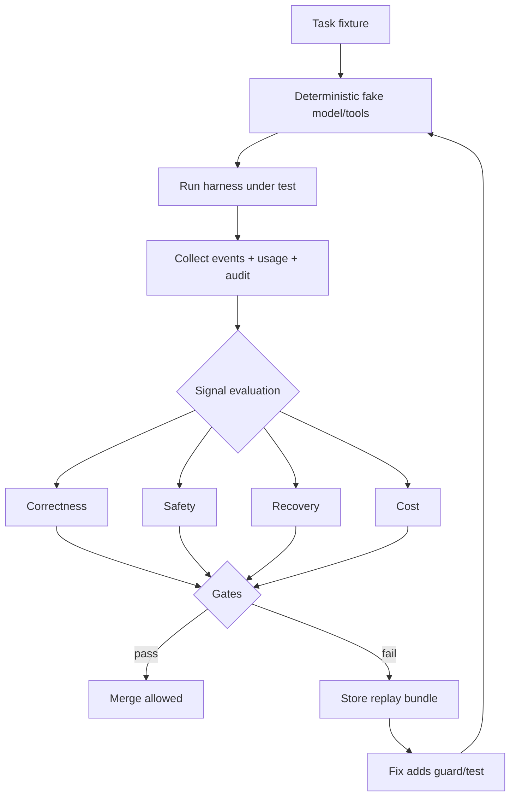
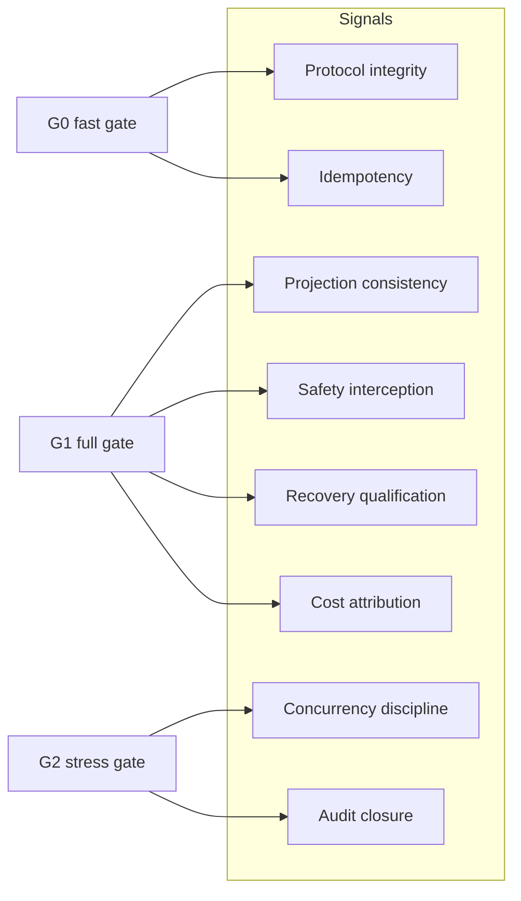

## 一句话结论

评测 Harness 的目标不是给模型打分，而是证明机器的不变量在压力下仍然成立。本章把前文机制收敛成 8 类信号、3 级门禁和一条回归闭环：每个失败样本必须能用固定假件重放，每个修复必须新增一个 guard 或测试，成本按每次 settled attempt 归因。

## 上一章遗留问题

[Q-03 安全与系统设计题](../07-interview/security-design.md) 要求人工判断威胁模型。本章回答：这些判断如何变成自动执行的信号，让 CI 在合并前发现不变量破坏？

## 本章解决什么矛盾

团队常见的评测困境是三个极端：

1. 只跑 happy path：无法发现取消、压缩和恢复缺陷。
2. 全靠人工 eval：主观、不可重复、无法进 CI。
3. 指标大杂烩：分数上升但线上事故率不变。

解决方案是把「不变量」作为一等公民：每个信号声明它保护哪条不变量，失败时能定位到哪个状态断点。

## 核心不变量

1. **配对完整**：tool call 必须有 result/error，取消后无悬空调用。
2. **投影可重建**：UI 与模型请求都能从权威日志派生。
3. **失败关闭**：审批、沙箱或 runner 缺失时不产生副作用。
4. **副作用唯一**：幂等键复用，unknown 不二次 create。
5. **恢复资格**：fingerprint/lease 校验通过才 replay。
6. **预算归因**：每次 settled attempt（含 failed）都有 usage 行。

## 评测流水线



这张图强调闭环：失败不是终点，而是生成 replay bundle 的入口；修复必须让同一个 bundle 从红变绿。

## 八类评测信号

| # | 信号族 | 保护的不变量 | 判定方式 | 证据来源 |
| --- | --- | --- | --- | --- |
| 1 | 协议完整性 | 配对完整 | 每个 toolCall 有 result/error；run 有显式终态 | L-01 事件序列 |
| 2 | 投影一致性 | 投影可重建 | UI 视图与 deriveMessages 输出语义等价 | M-01/M-02 锚点 |
| 3 | 安全拦截 | 失败关闭 | 注入样本零越权 effect；denial 带 reason | M-16/X-04 |
| 4 | 幂等性 | 副作用唯一 | 同键 N 次调用 tickets=1 且 deduplicated 标记 | L-03 输出 |
| 5 | 恢复资格 | 恢复先验证 | drift/lease 冲突 rejected 且零 effect | CS-01 输出 |
| 6 | 成本归因 | 预算归因 | failed attempts 计入 usage；超限轴命名 | M-15 锚点 |
| 7 | 并发纪律 | 写权唯一 | 重叠路径第二个 claim fail fast | M-14 锚点 |
| 8 | 可观测性 | 审计闭环 | decision/effect 按 ID join 成功 | M-12 锚点 |



这张图展示信号与门禁的映射：G0 只保留秒级可判定的协议类信号；涉及持久化和账本的信号放 G1；需要压力矩阵的并发与审计闭环放 G2。

## 三级门禁

| 门禁 | 触发时机 | 包含信号 | 失败动作 |
| --- | --- | --- | --- |
| G0 快速 | 每次 commit | 信号 1、4（最小 fixture） | 阻止 push |
| G1 完整 | PR / nightly | 信号 1-6 | 阻止合并，生成 replay bundle |
| G2 压力 | weekly | 信号 1-8 加并发/恢复压力矩阵 | 创建 issue 并指派 owner |

分级的原因是反馈延迟：G0 必须秒级，G1 允许分钟级，G2 可以接受小时级。把所有信号塞进 G0 会让开发者绕过检查。

## 机制深拆

### 信号如何从章节结论导出

- 信号 1 直接来自 L-01 的三条路径断言：completed、tool success、tool failure 都有终态和配对。
- 信号 3 来自 X-04 的 monotonic deny 和 L-04 的 approved-only execute：注入样本的通过标准是 effects 为空且 denial reason 非空。
- 信号 5 来自 CS-01 的实测：revision 漂移返回 `environment_drift`，租约不匹配返回 `lease_conflict`，两者都不写 events/effects。
- 信号 6 来自 M-15 的账本设计：DSH `b150a55` 的 UsageRow 覆盖 failed/retried/synthetic/aborted（`external/pi/packages/agent/docs/harness.md:452-458`）；Reasonix `aa82b2f` 按 token→cost→wall 命名第一越界轴（`internal/agent/run_budget.go:104-123`）。

### Replay bundle 的最小字段

```text
replay-bundle/
  fixture.json        # 输入、脚本响应、工具配置
  expected.jsonl      # 断言的事件序列
  actual.jsonl        # 失败时的实际输出
  signals.json        # 每个信号的 pass/fail 与证据指针
  meta.json           # harness version、commit、时间、runner 环境
```

判定标准是：任何人拿到 bundle 后，不访问生产系统即可复现失败。缺少 actual.jsonl 或 meta.json 的 bundle 视为无效。

### 噪声控制

1. **低基数错误分类**：Pi `c49906e` 的 telemetry schema 用 error.type 低基数属性（`packages/agent/src/harness/telemetry.ts:93-113`），评测聚合同理。
2. **固定随机种子**：fake model 按脚本返回，禁止真实网络。
3. **环境指纹**：runner 版本进入 meta.json，避免跨版本比较失真。
4. **波动预算**：非确定信号必须声明置信区间，否则降级为 G2 观察项。

## 反例与故障模式

1. **Happy-path only**
   - 触发：只测「模型回答正确」。
   - 因果：取消、压缩和恢复路径从未执行。
   - 后果：线上第一次中断即丢数据。
   - 修正：G0 强制包含 tool-failure 与 cancel fixture。
2. **评分不看效果**
   - 触发：用字符串相似度评判发布任务。
   - 因果：相似文本可能缺关键依赖变更。
   - 后果：事故复发但分数绿色。
   - 修正：以 task goal 的可执行验收为准（D5 教训）。
3. **成本漏计失败**
   - 触发：usage 只统计 completed。
   - 因果：重试风暴的账单来自 failed attempts。
   - 后果：预算失控且无法归因。
   - 修正：signal 6 校验 every settled attempt has a row。
4. **不可重放的失败报告**
   - 触发：issue 只贴截图和描述。
   - 因果：缺少 fixture/actual/meta。
   - 后果：修复无法验证，问题反复出现。
   - 修正：bundle 无效则 gate 不放行修复 PR。
5. **评测被游戏化**
   - 触发：模型学会输出评测偏好的措辞。
   - 因果：信号依赖表面文本而非协议行为。
   - 后果：分数升、事故升。
   - 修正：信号 1/3/4/5 全部基于结构化事件而非文本相似度。
6. **并发信号缺失**
   - 触发：所有 fixture 单线程。
   - 因果：写冲突和批次终止规则未覆盖。
   - 后果：多 Agent 上线即互相覆盖。
   - 修正：G2 加入 overlap-path 与 mixed-batch 矩阵。

## 一条完整因果链

场景：工程师提交了一个“优化上下文压缩”的 PR，静默丢弃了用户纠正消息：

1. **触发**：G1 运行 signal 2 的 pinned-anchor fixture——correction 标记为 pinned，历史超过预算。
2. **状态变化**：新压缩器把 correction 当普通消息淘汰；bounded projection 的 selected 中没有 correction。
3. **观察结果**：signal 2 失败，signals.json 显示 `pinned_retained=false`，并附 actual.jsonl 中被 dropped 的记录。
4. **证据定位**：reviewer 无需复现——bundle 内 fixture/expected/actual 三件套直接指出淘汰顺序错误。
5. **修复要求**：作者改回 pinned-first 策略，并为「多条 pinned 超预算」补一个 fail-closed 测试。
6. **门禁结果**：同一 bundle 重跑变绿；G0/G1 通过；PR 合并。
7. **后续影响**：该 fixture 进入永久回归集；下一次任何压缩改动都会被同一信号保护。

这条链说明评测框架的价值不在跑分，而在把一次审查意见固化成永久约束。

## 设计取舍

| 取舍 | 收益 | 代价 |
| --- | --- | --- |
| 不变量驱动信号 | 分数与事故相关 | 需要前期机制分析 |
| 三级门禁 | 反馈速度与覆盖率平衡 | 维护三套运行环境 |
| replay bundle 强制 | 修复可验证 | 存储 bundle 有成本 |
| 结构化事件判分 | 抗游戏化 | 无法评估文风类目标 |
| 固定假件优先 | 确定性、离线可用 | 覆盖不了真实 provider 波动 |

## 框架实现对照

以下能力继承对应章节已通过的 Implementation Review；固定快照为 Reasonix `aa82b2f`、DeepSeek Harness `b150a55`、Pi `c49906e`。

| 评测域 | 关键锚点 |
| --- | --- |
| 可观测事件 | Reasonix `projection.go:80-130`、`context_receipt.go:54-64`；DSH `types.ts:372-436` |
| Telemetry schema | Pi `harness/telemetry.ts:42-118,193-256`；content/secret-free 默认见 `docs/harness.md:2477` |
| 成本账本 | Reasonix `run_budget.go:13-168`；DSH ledger `docs/harness.md:452-458`；Pi `usage-totals.ts:22-69` |
| 注入拦截 | Reasonix `subagentguard.go:5-28`；DSH `tools/index.ts:1100-1128` |
| 并发纪律 | Reasonix `scheduler.go:36-107,199-333`；Pi `file-mutation-queue.ts:16-61` |

面试或评审中不要求背行号；要求能说明某信号失败时应打开哪个锚点文件。

## 实现精妙之处

1. **信号绑定不变量**：每条失败都能翻译成「破坏了哪条保护」。
2. **bundle 即门票**：无效报告不能启动修复流程，倒逼可复现文化。
3. **三级门禁分频**：秒级反馈与深度压测各得其所。
4. **结构化判分**：抗 prompt 游戏化，聚焦协议行为。
5. **成本全量归因**：failed attempts 也入账，防止重试风暴隐形。

## 自检与面试追问

1. 你的 CI 里哪个信号最弱？补齐它需要哪些 fixture？
2. 如果评测分数涨了但线上事故没降，你会先审计哪个环节？
3. replay bundle 应保留多久？涉及敏感数据时如何脱敏且保持可复现？
4. G2 压力矩阵如何选择并发度与分支深度组合？
5. 哪些产品目标本质上不适合自动化评测？如何显式标注？

## 交给下一章的问题

E-01 完成了机制到信号的转化。最后一章 G-01《术语表》将统一全书语言：每个术语给出定义、首次出现章节和常见混用辨析，成为批量终审的词汇基准。

## 相关页面

- [教材目录](../TOC.md)
- [Observability 与 Replay](../02-harness-mechanics/observability.md)
- [Cost 与延迟](../02-harness-mechanics/cost-latency.md)
- [Prompt Injection 与工具安全](../02-harness-mechanics/prompt-injection.md)
- [Subagent 与并发](../02-harness-mechanics/subagent-concurrency.md)
- [Tool 重试副作用实验](../05-labs/retry-side-effects.md)
- [长任务中断恢复](../06-case-studies/long-task-recovery.md)
