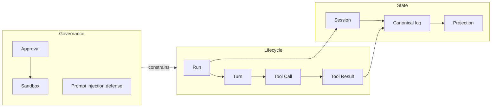
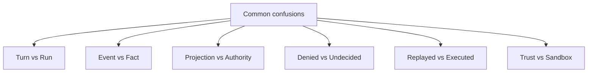

## 一句话结论

本表是全书的词汇基准：每个术语给出定义、权威章节和失效边界。批量终审时，若某章用词与本表冲突，应修改该章或在本表追加带日期的修订，不允许两处各说各话。

## 上一章遗留问题

[Harness 评测框架](../08-evaluation/evaluation-framework.md) 把机制转成了信号。本章解决最后一个问题：当不同章节说「提交」「恢复」「事件」时，它们指的是同一个东西吗？

## 使用规则

1. **权威章节唯一**：每个术语只在一个章节深入定义，本表链接过去，不复制论证。
2. **失效边界必填**：不知道术语什么时候不适用，等于没理解它。
3. **混用必须辨析**：易混术语成对出现，说明差异和误用后果。
4. **修订留痕**：改变定义需在本表追加日期决策，不允许静默替换。

## 术语地图

这张图展示术语的主从关系：生命周期产生事实，事实进入状态层，治理层约束生命周期。查术语时先定位它属于哪一层。

## 生命周期术语

| 中文 | 英文 | 定义 | 权威章节 | 失效边界 |
| --- | --- | --- | --- | --- |
| 智能体 | Agent | 提出动作意图的决策主体；输出是请求而非许可。 | [Agent 与 Harness 的边界](../01-core-concepts/agent-vs-harness.md) | 离开 Harness 治理时只是普通 LLM 调用。 |
| 线束 | Harness | 编排模型、工具、状态、安全和审计的运行时层。 | 同上 | 不拥有状态所有权的编排库只是 SDK。 |
| 运行 | Run | 从用户输入到显式终态的完整执行，可跨多 Turn。 | [Run 生命周期](../01-core-concepts/agent-run-lifecycle.md) | 没有终态建模时无法区分完成、取消与崩溃孤儿。 |
| 回合 | Turn | 一次模型采样及后续工具批的交互单元。 | 同上 | Turn 边界因框架而异，不能当通用时间单位。 |
| 工具调用 | Tool Call | 模型请求执行工具的结构化意图。 | [Tool Schema](../02-harness-mechanics/tool-schema.md) | 校验通过不等于获得执行许可。 |
| 工具结果 | Tool Result | 宿主观察到的执行输出，成功与失败都必须配对。 | [Tool 执行](../02-harness-mechanics/tool-execution.md) | 缺 result 即悬空调用，恢复协议失效。 |
| 流式输出 | Streaming | 逐步返回的 partial 投影。 | [事件与流式](../01-core-concepts/events-and-streaming.md) | draft 不是事实，不能直接入权威历史。 |
| 取消 | Cancellation | 主动终止并沿树传播，保留 partial 事实。 | [Timeout 与 Cancellation](../02-harness-mechanics/timeout-cancellation.md) | 只停第一层会留下孤儿分支。 |

## 状态术语

| 中文 | 英文 | 定义 | 权威章节 | 失效边界 |
| --- | --- | --- | --- | --- |
| 会话 | Session | 跨 Turn 的持久身份与状态容器。 | [Session 状态模型](../01-core-concepts/session-and-state.md) | 无 schema 版本时跨版本恢复不安全。 |
| 权威日志 | Canonical log | append-only 的事实来源；投影由它派生。 | [Persistence](../02-harness-mechanics/persistence.md) | 直接改写它会让 fork/审计失去基准。 |
| 投影 | Projection | 从权威日志派生的 UI/模型请求/报表视图。 | 同上 | 投影不可反向写入权威；压缩只作用于投影。 |
| 检查点 | Checkpoint | 闭合事实加继续条件的可恢复快照。 | [Checkpoint 与 Resume](../02-harness-mechanics/checkpoint-resume.md) | 含未闭合步骤的 checkpoint 会造成跳步。 |
| 恢复 | Resume | 校验资格后从锚点继续，历史步骤只 replay。 | 同上 | fingerprint/lease 校验失败必须拒绝。 |
| 重放 | Replay | 用已记录输入重新执行以验证行为。 | 同上 | replayed 事件不是新 effect。 |
| 事件 | Event | 按序记录的过程观测，含 raw chunk。 | [事件与流式](../01-core-concepts/events-and-streaming.md) | 事件是证据，不自动等于业务成功。 |

## 治理术语

| 中文 | 英文 | 定义 | 权威章节 | 失效边界 |
| --- | --- | --- | --- | --- |
| 审批 | Approval | 对确切意图的人工/策略决策，含 once/session/persistent 等终态。 | [审批模型](../02-harness-mechanics/approval.md) | undecided ≠ denied；缺审批服务必须失败关闭。 |
| 权限 | Permission | 决定 allow/ask/deny 的策略规则。 | 同上 | 多 guard 叠加时任一 deny 生效。 |
| 沙箱 | Sandbox | 限制文件/进程/网络的强制执行层。 | [Sandbox 与权限](../02-harness-mechanics/sandbox.md) | 项目信任、ExecutionEnv 本身不是沙箱。 |
| 提示注入 | Prompt Injection | 外部内容诱导越权动作的攻击。 | [Prompt Injection](../02-harness-mechanics/prompt-injection.md) | 提示词不是防火墙；需要策略与强制层兜底。 |
| 预算 | Budget | token/cost/wall 上限及越界后的降级路径。 | [Cost 与延迟](../02-harness-mechanics/cost-latency.md) | failed attempts 也消耗预算，必须入账。 |
| 幂等键 | Idempotency key | 绑定语义动作的业务身份，用于去重重放。 | [Retry 与幂等](../02-harness-mechanics/retry-idempotency.md) | 每次重试生成新键等于没有幂等。 |
| 子智能体 | Sub-agent | 拥有独立会话和交集权限的委派分支。 | [Subagent 与并发](../02-harness-mechanics/subagent-concurrency.md) | 子结果只能报告，不能直接提交父级结论。 |

## 易混术语辨析

| 混用 | 差异 | 误用后果 |
| --- | --- | --- |
| Turn vs Run | Turn 是采样单元；Run 是带终态的完整执行。 | 把 Turn 计数当恢复进度，跳过未闭合步骤。 |
| Event vs Fact | Event 是过程观测；Fact 是闭合的 durable 记录。 | 把 raw chunk 当已提交消息，恢复出半句话。 |
| Projection vs Authority | 投影可重建；权威不可改写。 | 压缩直接改权威日志，审计断裂。 |
| Denied vs Undecided | denied 是人/策略说不；undecided 是缺少有效决策。 | 超时被当拒绝，任务误放弃；或被当允许，越权执行。 |
| Replayed vs Executed | replayed 是重建历史；executed 是新副作用。 | 统一再跑导致重复 patch/发布。 |
| Trust vs Sandbox | trust 控制资源加载；sandbox 强制运行时边界。 | 信任项目后以为工具被隔离，恶意扩展直通。 |
| Retry vs Replay | retry 发起新 attempt；replay 重建已有事实。 | unknown 状态盲目 retry，产生第二副作用。 |
| Checkpoint vs UI state | checkpoint 是闭合事实+资格；UI 是投影。 | 按进度条恢复，环境漂移后继续旧计划。 |

## 反例与故障模式

1. **跨章术语漂移**
   - 触发：A 章把「提交」定义为事件落盘，B 章定义为业务生效。
   - 因果：没有唯一词汇基准。
   - 后果：终审时同一结论被误判为矛盾。
   - 修正：以本表为准，冲突章节必须改词或加限定。
2. **英文直译替代机制**
   - 触发：把 checkpoint 翻成「存档点」就当理解了。
   - 因果：缺少闭合事实与资格校验语义。
   - 后果：设计出只存进度号的伪 checkpoint。
   - 修正：术语必须链接权威章节。
3. **把框架专名当通用概念**
   - 触发：把 surface、seed 等框架内部词直接用于跨框架比较。
   - 因果：不同框架同名不同义。
   - 后果：对比表出现假等价。
   - 修正：跨章比较用本表通用词，框架专名留在框架章。
4. **失效边界缺失**
   - 触发：术语只有正面定义。
   - 因果：不知道何时不再适用。
   - 后果：把教学模型当生产保证。
   - 修正：本表每行强制 boundary 列。
5. **静默改义**
   - 触发：某章修订悄悄改变术语含义。
   - 因果：没有在本表留决策记录。
   - 后果：引用旧章的读者被误导。
   - 修正：改义必须追加带日期的修订条目。

## 一条完整因果链

场景：新维护者审阅 PR，看到「压缩后 resume 正确」的描述：

1. **触发**：描述中出现 compression、resume、correct 三个词。
2. **查表**：compression 权威在 M-02——只作用于投影；resume 权威在 M-10——先验资格再 replay；correct 需要指明对哪个信号正确。
3. **发现歧义**：PR 未说明 compression 是否改写 canonical log，也未说明 resume 是否校验 fingerprint。
4. **状态判断**：按本表，若改写权威则违反「投影 vs Authority」；若未验资格则违反恢复不变量。
5. **审查动作**：要求作者明确两点并补充对应 fixture。
6. **观察结果**：PR 修改为「压缩只更新 projection；resume 校验 workspace@revision 与 lease 后 replay」。
7. **后续影响**：描述与本表一致，批量终审可直接引用该 PR 作为正面样例。

这条链说明术语表的实际用途：把模糊形容词转换成可检查的状态命题。

## 设计取舍

| 取舍 | 收益 | 代价 |
| --- | --- | --- |
| 三栏结构（定义/权威/边界） | 查询快、防误用 | 表格较宽 |
| 混用成对辨析 | 直击高频错误 | 无法穷尽所有组合 |
| 权威章节唯一 | 避免多处维护 | 查定义需跳转 |
| 通用词与框架专名分离 | 对比表不失真 | 阅读框架章需额外映射 |

## 框架实现对照

本表不绑定行号。框架专名与通用术语的映射由各权威章节维护：

| 通用术语 | 框架专名示例 | 权威章节 |
| --- | --- | --- |
| Canonical log | Reasonix event log；DSH SessionEventMap；Pi JSONL entry tree | [Persistence](../02-harness-mechanics/persistence.md) |
| Projection | Reasonix paging model；DSH deriveMessages surface；Pi root-to-leaf path | 同上 |
| Approval states | Reasonix once/session/persistent；DSH allowed-once/rejected/cancelled/unavailable | [审批模型](../02-harness-mechanics/approval.md) |
| Sandbox | Reasonix Seatbelt/bubblewrap；DSH SandboxProvider profiles；Pi external env | [Sandbox 与权限](../02-harness-mechanics/sandbox.md) |
| Terminal reason | DSH completed/aborted/blocked/error/max-tokens/interrupted | [Run 生命周期](../01-core-concepts/agent-run-lifecycle.md) |

固定快照为 Reasonix `aa82b2f`、DeepSeek Harness `b150a55`、Pi `c49906e`；具体锚点见各权威章节。

## 实现精妙之处

1. **每词三问**：是什么？谁定义？何时失效？缺一即不收录。
2. **混用表来自真实故障**：每对辨析都对应前文章节验证过的事故形态。
3. **修订协议**：改义必须留日期记录，保护跨章引用稳定性。
4. **通用/专名分层**：横向对比不被框架内部命名绑架。
5. **终审接口**：批量 Implementation Review 可把本表当作 diff 词汇检查表。

## 自检与面试追问

1. 你能否不看本表说出 8 组易混术语的差异？
2. 你的团队文档里哪些词与本表定义冲突？打算改哪边？
3. 新术语进入本表的准入标准是什么？
4. 中英对照在多语言站点中如何保持同步？
5. 哪些术语的失效边界最常被忽略？

## 交给下一章的问题

全部公开章节的 v0.3 初稿升级到此完成。下一步不是新章节，而是批量 Implementation Review：按本表词汇基准逐章核对锚点、结论与引用一致性，等待维护者启动。

## 相关页面

- [教材目录](../TOC.md)
- [Agent 与 Harness 的边界](../01-core-concepts/agent-vs-harness.md)
- [一次 Agent Run 的完整生命周期](../01-core-concepts/agent-run-lifecycle.md)
- [Session、Turn 与状态模型](../01-core-concepts/session-and-state.md)
- [Persistence](../02-harness-mechanics/persistence.md)
- [审批模型](../02-harness-mechanics/approval.md)
- [Sandbox 与权限](../02-harness-mechanics/sandbox.md)
