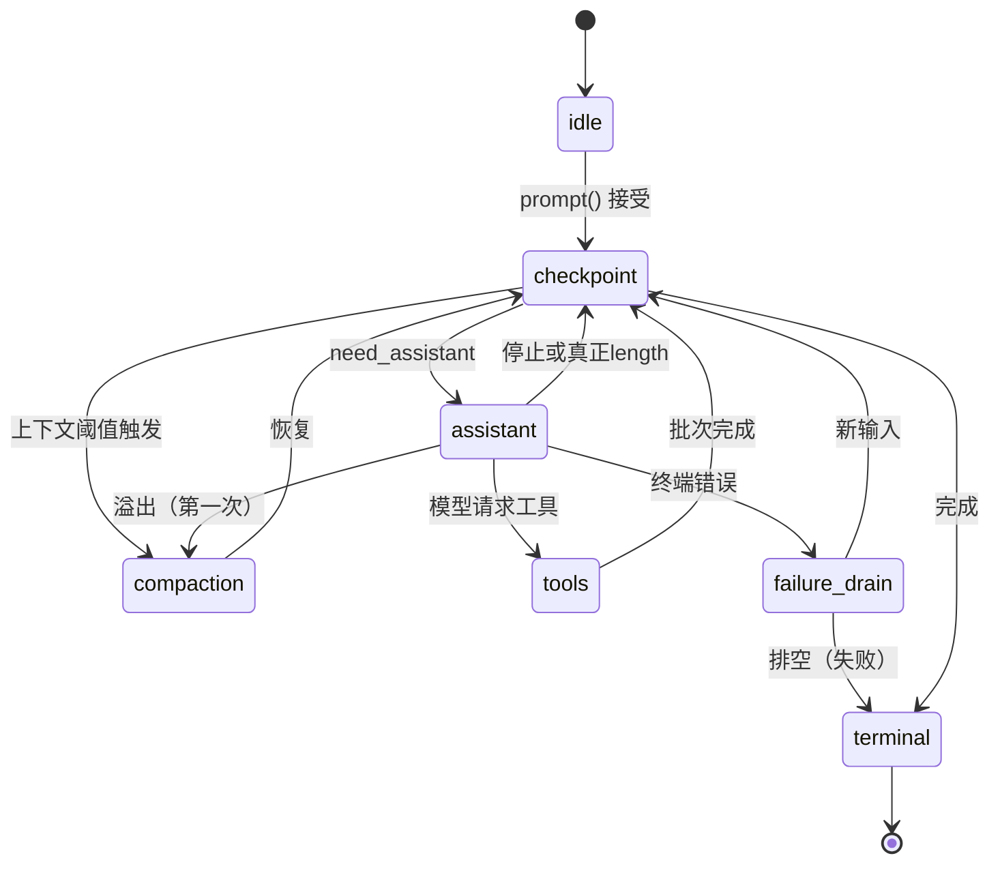

# Pi AgentHarness v1 深度解析

这篇文章带你从零理解 Pi AgentHarness v1 的设计。不是摘要，而是逐层拆解每个机制——为什么存在、解决什么问题、怎么工作。读完你应该能自己画出整个系统的状态图。

## 1. 从一个崩溃场景开始

假设你在写一个 Coding Agent，用户输入：

```text
"删除 src/old-migrations/ 目录，然后运行 npm test"
```

模型决定分两步：

1. 调用 `bash("rm -rf src/old-migrations/")`
2. 调用 `bash("npm test")`

现在假设第 1 步执行到一半——文件删了一半——进程崩溃了。重启后你面对什么？

- 文件删了一半，不知道哪些删了哪些没删
- 不知道 `rm` 命令是否已经完成
- 不知道是否应该重新执行 `rm`（重新执行可能报错，因为目录已经不存在）
- 测试还没跑

如果你只是把对话历史重新发给模型，模型可能会说"让我重新删除"——但文件可能已经全删了。或者模型说"跳过删除，直接跑测试"——但你不知道删除是否完整。

这就是 AgentHarness 要解决的核心问题：**崩溃后，系统必须能精确知道发生了什么、没发生什么，然后做出正确的恢复决策。**

:::note
这个问题的本质是：外部副作用（文件系统、网络、进程）没有事务性。你不能"回滚"一个已经执行的 `rm -rf`。你只能在副作用前后留下足够的痕迹，让恢复逻辑做出正确的判断。
:::

## 2. 三个存储：系统的骨架

AgentHarness v1 把所有持久数据分为三种存储。理解这三种存储及其规则，就理解了整个系统的骨架。

### 2.1 条目（Entry）：不可变的对话树

条目是会话树中的节点，用 `parentId` 链接成树：

```text
a ── b ── c ── d          ← main 分支
      └── e ── f          ← 从 b 分叉的分支
```

四种条目类型：

| 类型 | 存什么 | 举例 |
|---|---|---|
| `message` | 用户消息、助手消息、工具结果 | "删除旧迁移" / `tool_call: bash` / `tool_result: success` |
| `compaction` | 压缩摘要 | "之前的对话讨论了数据库迁移方案..." |
| `branch_summary` | 分支摘要 | 导航到树的早期位置时生成的摘要 |
| `custom` | 应用自定义数据 | 代码审查结果、权限决策记录 |

每条消息的存储形式：

```ts
interface MessageEntry {
  id: string;           // UUIDv7，前 48 位是时间戳
  parentId: string;     // 父条目 id，构成树
  seq: number;          // 全局递增序列号
  timestamp: number;    // Unix 毫秒
  type: "message";
  message: AgentMessage; // 实际的消息内容
}
```

**关键规则：条目写一次，从不修改或删除。**

为什么？因为条目是**权威事实**。如果助手说"我调用了 bash 工具"，这条记录就是事实。你不能事后修改它——修改了就不是事实了。如果需要更正，追加一条新条目。

### 2.2 寄存器（Register）：唯一的可变状态

寄存器是带命名空间的键值对，保存**当前**状态：

| 命名空间 | 键 | 值 | 生命周期 |
|---|---|---|---|
| `lane.leaf` | Lane 名 | 条目 id | 会话 |
| `lane.config` | Lane 名 | 模型、思考级别、活跃工具 | 会话 |
| `lane.state` | Lane 名 | 当前操作 id | 会话 |
| `op.meta` | 操作 id | 操作元数据（意图、源叶子） | 操作 |
| `op.state` | 操作 id | **程序计数器**（完整状态） | 操作 |
| `op.tool_args` | `{opId}:{stepId}:{i}` | 工具有效参数 | 操作 |
| `pending.entry` | 保留的条目 id | 排队内容载荷 | 直到放置或取消 |
| `fact.name` | `""` | 会话名称 | 会话 |
| `fact.label` | 条目 id | 条目标签 | 会话 |

注意两种生命周期：

- `lane.*` 和 `fact.*`：会话级，永远存在（除非显式删除）
- `op.*`：操作级，操作结束时被终态事务删除

**`op.state` 是整个系统最重要的寄存器。** 它保存操作的完整当前状态，每次状态转换时原子覆盖。恢复时读这一个寄存器就知道操作进行到哪一步了。

:::tip
把 `op.state` 想象成程序计数器（Program Counter）。CPU 不需要重放指令历史来知道执行到哪——它只看 PC 寄存器。同样，Harness 不需要重放日志来知道操作进行到哪——它只看 `op.state`。
:::

### 2.3 用量台账：成本独立于编排

每次 provider 请求结算时写一行：

```json
{
  "id": "u_7",
  "seq": 815,
  "entryId": "e_51",
  "adjustment": false,
  "usage": { "input": 12000, "output": 431, "cost": { "amount": 0.03, "currency": "USD" } }
}
```

关键设计：**即使请求失败、被重试、甚至整个操作后来被中止，台账行也不会被删除。**

为什么？想象一个场景：模型请求花了 $0.50 但失败了，系统重试又花了 $0.50，最终成功了。如果你只记录成功请求的成本，用户看到的是 $0.50。但实际花费是 $1.50。成本是**已经发生的事实**，不因为编排结果而改变。

### 2.4 一个不变量统治一切

:::note
**每个载荷恰好存在于一个地方**——条目、寄存器或台账。没有第三种存储，没有数据可以藏在两个地方。
:::

这个不变量消除了一个常见 bug：数据在缓存和数据库之间不一致。这里没有缓存，没有"源数据库"和"副本"之分。每个字节都有一个明确的归属。

## 3. 原子事务：唯一的写原语

所有写入通过事务提交：

```
TX[
  insert entry n1 (user message),
  upsert op.meta/op_9 = { intent: run, sourceLeafId: e_41 },
  upsert op.state/op_9 = { phase: checkpoint, continuation: need_assistant },
  upsert lane.leaf/main = n1,
  upsert lane.state/main = { currentOperationId: op_9 }
]
```

这个事务做了五件事：

1. 把用户消息追加到树
2. 创建操作的元数据（意图是什么、从哪个叶子开始）
3. 设置操作的初始状态（程序计数器归零）
4. 移动 Lane 的叶子到新条目
5. 标记 Lane 正在执行这个操作

五件事**要么全部成功，要么全部不发生**。不存在"条目追加了但操作没创建"的中间状态。

### 事务的六条规则

1. **全有或全无**——不存在部分提交
2. **严格递增的 seq**——写入按顺序获得序列号，跨所有 Lane 全局单调
3. **事务内有序**——后面的写入可以引用前面创建的条目
4. **id 唯一**——在任何现有 id 下写入都是损坏
5. **寄存器无历史**——覆盖就没了，没有 undo log
6. **单写者**——一个会话只有一个进程在写

:::caution
规则 6 至关重要。如果两个进程同时写一个会话，seq 会冲突、寄存器会互相覆盖、树会分叉出不可预期的形状。整个系统假设单写者，SQLite 后端用围栏租约强制执行。
:::

## 4. 操作状态机：系统的心脏

### 4.1 什么是操作

操作（Operation）是 Lane 上一单位持久工作。三种：

| 操作 | 触发 | 做什么 |
|---|---|---|
| **Run** | 用户发 prompt | 执行完整的 Agent 循环：生成→工具→生成→...直到没有更多工作 |
| **Compaction** | 阈值触发或手动 | 把旧上下文替换为摘要条目 |
| **Navigation** | 手动导航 | 移动 Lane 叶子到树中的另一个位置 |

### 4.2 Run 的内部状态机

一个 Run 的状态机：



每个状态转换对应一次 `commit()`——一个原子事务覆盖 `op.state`。

### 4.3 走一遍完整的 Run

让我们跟踪一个具体的例子：

```text
用户："删除旧迁移，然后跑测试"
```

**步骤 1：接受**

```text
TX[
  insert e_50 (user message "删除旧迁移..."),
  upsert op.meta/op_9 = { intent: run, sourceLeafId: e_49 },
  upsert op.state/op_9 = { phase: checkpoint, continuation: need_assistant(false), trigger: e_50 },
  upsert lane.leaf/main = e_50,
  upsert lane.state/main = { currentOperationId: op_9 }
]
```

现在操作已持久化。崩溃后恢复，系统知道"有一个 Run 从 e_50 开始，需要助手响应"。

**步骤 2：助手生成——意图**

```text
TX[
  upsert op.state/op_9 = {
    phase: assistant effect_pending,
    attempt: 1,
    responseEntryId: "e_51",
    usageId: "u_7",
    context: { model: {...}, retryPolicy: { maxAttempts: 3 } }
  }
]
```

注意：**还没有发送任何请求给 provider。** 我们只是说"我即将发送请求，响应会写到 e_51，用量会写到 u_7"。这两个 id 现在就确定了。

**步骤 3：Provider 请求（不确定窗口）**

流式传输发生。这是唯一不持久的部分。

**步骤 4：结算**

假设模型返回了一个工具调用：

```text
TX[
  insert e_51 (assistant message with tool call),
  insert u_7 (usage row),
  upsert lane.leaf/main = e_51,
  upsert op.state/op_9 = {
    phase: tools,
    batch: { calls: [{ planned, resultEntryId: "e_52" }] }
  }
]
```

响应、用量和下一个状态**一起提交**。不存在"响应追加了但用量没记录"的状态。

**步骤 5：工具放行**

```text
TX[
  upsert op.tool_args/op_9:s1:0 = { command: "rm -rf src/old-migrations/" },
  upsert op.state/op_9 = { phase: tools, call_0: effect_pending, replay: "never" }
]
```

工具参数持久化。`replay: "never"` 表示这个工具不可安全重放——如果崩溃了，不能重新执行。

**步骤 6：工具执行（不确定窗口）**

`rm -rf` 正在删除文件...

**步骤 7：工具结算**

```text
TX[
  insert e_52 (tool result "deleted 5 files"),
  upsert lane.leaf/main = e_52,
  upsert op.state/op_9 = { phase: tools, call_0: completed }
]
```

**步骤 8：继续循环**

模型收到工具结果，决定调用 `npm test`...重复步骤 2-7。

**步骤 9：终态**

当模型最终返回纯文本（没有工具调用），且收件箱为空：

```text
TX[
  delete op.meta/op_9,
  delete op.state/op_9,
  delete op.tool_args/op_9:s1:0,
  upsert lane.lastResult/main = { outcome: "completed", leafId: e_55 },
  upsert lane.state/main = { currentOperationId: null }
]
```

操作的所有寄存器被删除。剩下的只有：对话条目、台账行、和 Lane 的四个寄存器。**没有死状态需要垃圾回收。**

## 5. 崩溃恢复：核心机制

### 5.1 恢复过程

进程崩溃后重新打开，恢复一个 Lane：

```text
读取 1: lane.state/main  → { currentOperationId: "op_9" }
读取 2: op.meta/op_9     → { intent: run, sourceLeafId: e_49 }
读取 3: op.state/op_9    → { phase: assistant effect_pending, attempt: 1, ... }
读取 4: lane.leaf/main   → "e_50"
读取 5: lane.config/main → { model: {...}, ... }
```

五次点查找，O(1)。没有日志重放，没有树遍历，没有历史扫描。

然后验证状态命名的所有实体：

```text
e_50 存在？  ✓（已放置的 prompt）
e_51 存在？  ✗（保留的响应 id，尚未结算——预期的）
u_7  存在？  ✗（保留的用量 id，尚未结算——预期的）
```

### 5.2 不确定窗口的恢复策略

`op.state` 显示 `phase: assistant effect_pending`——我们提交了意图但可能没有收到响应。三种可能：

1. 请求根本没发出去
2. 请求发出去了但 provider 没处理
3. Provider 处理了但响应没到达我们这里

我们**不知道**是哪种。这就是"不确定窗口"。

恢复策略：

| 条件 | 动作 |
|---|---|
| `attempt 1 < maxAttempts 3` | 用**捕获的**配置开始 attempt 2（即使用户换了模型） |
| `attempt >= maxAttempts` | 在保留 id e_51 下合成错误响应 |
| `control = cancel_requested` | 在 e_51 下合成 aborted 响应，不重试 |

:::danger
关键：恢复使用**捕获的**配置，不是当前配置。如果用户在崩溃后换了模型，恢复仍然用崩溃前的模型重试。这保证了一致性。
:::

### 5.3 工具崩溃的恢复

如果崩溃发生在工具执行中（步骤 6）：

```text
op.state 显示 call_0: effect_pending, replay: "never"
op.tool_args 显示 { command: "rm -rf src/old-migrations/" }
```

`replay: "never"` 告诉我们**不能重新执行这个命令**。文件可能已经删了。恢复动作：

```text
TX[
  insert e_52 (synthetic result "interrupted: process crashed during execution"),
  upsert lane.leaf/main = e_52,
  upsert op.state/op_9 = { phase: tools, call_0: completed }
]
```

合成一个错误结果，标记调用完成，继续处理下一个调用。对话保持连贯——每个工具调用都有结果。

如果 `replay: "safe"`（比如 `ls` 命令），恢复会**重新执行**：

```text
用持久化的参数重新执行工具
用真实结果结算
```

### 5.4 恢复从不做的事

```text
✗ 读寄存器历史（不存在历史）
✗ 折叠任何东西
✗ 扫描表
✗ 构建 provider 上下文
✗ 审计已完成的操作
✗ 从缺失的内容推断状态
```

恢复只做一件事：**读当前状态，执行恢复策略。**

## 6. Lane：并行工作的隔离

### 6.1 为什么需要 Lane

想象一个 Slack 集成：一个频道是一个会话，每个线程是一个独立的对话。你不想让线程 A 的回复出现在线程 B 中。但你可能想让它们共享频道级别的历史。

Lane 就是解决方案：

```text
树（共享）：  a ── b ── c ── d
                    └── e ── f

Lane main:         → d（主对话）
Lane slack:123:    → f（线程对话，从 b 分叉）
```

两个 Lane 共享树的历史（a, b），但各自有独立的叶子（d vs f）、独立的操作状态、独立的队列。

### 6.2 Lane 的规则

1. **每 Lane 至多一个打开操作**——第二个操作收到 `LaneBusy`
2. **Lane 之间无协调**——它们通过共享树间接交互
3. **同一叶子上的两个 Lane**——下次追加时自然分叉
4. **Lane 从不删除或重命名**——名称是永久的应用键

### 6.3 Lane 变更线

当两个并发调用竞争同一个 Lane 时（比如同时 `prompt()` 和 `abort()`），需要一个序列化机制：

```text
Lane 变更线 = 一个 FIFO 队列

每个依赖状态的变更必须：
1. 排队
2. 验证（当前状态是否允许？）
3. 至多一个原子提交
4. 更新内存状态
5. 下一个变更才能开始
```

结果：每对竞争调用恰好有**两种**可能的历史（A 先或 B 先），不存在第三种交错。

:::tip
这是可测试性的关键。如果你知道只有两种可能结果，你只需要测试两种顺序。
:::

## 7. 队列：管理输入流

### 7.1 三种队列

| 队列 | 何时消费 | 中止时 |
|---|---|---|
| `steer` | 下一个检查点（回合之间） | 载荷返回给调用者 |
| `followUp` | steering 耗尽后 | 载荷返回给调用者 |
| `nextRun` | 下一次 `prompt()` 接受时 | **存活** |

### 7.2 入队流程

当用户调用 `steer("换个方向")`：

```text
TX[
  upsert pending.entry/e_q1 = { type: "message", payload: "换个方向" },
  upsert op.state/op_9 = { ... inbox.steer += "e_q1" ... }
]
```

注意：**树还没有被修改。** 内容存在 `pending.entry` 寄存器中。条目在检查点消费时才追加。

为什么要延迟？因为如果在回合中途直接追加到树，provider 的 KV 缓存会失效（上下文在尾部之前插入了一个新条目）。

### 7.3 消费流程

检查点时：

```text
TX[
  insert e_q1 (user message "换个方向"),
  delete pending.entry/e_q1,
  upsert lane.leaf/main = e_q1,
  upsert op.state/op_9 = { continuation: need_assistant(false), trigger: e_q1 }
]
```

寄存器和条目的关系是**排他的**：在每个提交边界，恰好存在其一。从不同时存在，也从不都不存在。

## 8. 压缩：管理上下文大小

### 8.1 追加式上下文不变量

> 在一个 Lane 的请求之间，provider 上下文只在尾部增长。

为什么？Provider（如 OpenAI、Anthropic）使用 KV 缓存加速重复前缀的处理。如果你在之前的请求尾部之前插入新内容，缓存从那个点开始失效，整个后续上下文需要重新处理。

### 8.2 压缩的两种触发

**阈值触发**：上下文超过 `reserveTokens` 时，在检查点自动压缩。

**溢出触发**：Provider 返回的错误表明请求超过窗口时：

```text
1. 响应以 stopReason "error" 提交（规范化）
2. 构建压缩准备（从普通投影规则，排除 error 响应）
3. 压缩执行
4. 恢复 need_assistant(overflowRecoveryUsed: true)
5. 用更小的上下文重试
```

**溢出只允许恢复一次。** 第二次溢出直接失败。这防止了无限压缩循环。

### 8.3 压缩条目的自包含性

```ts
interface CompactionEntry {
  type: "compaction";
  summary: string;               // 旧上下文的摘要
  retainedTail: AgentMessage[];  // 保留的最近消息（完整副本）
  tokensBefore: number;          // 压缩前的 token 数
}
```

上下文构建规则：

```text
从叶子向根扫描，遇到第一个压缩条目就停。

上下文 = summary + retainedTail + 压缩之后的新条目
```

**永远不需要越过压缩读取更早的内容。** 这使压缩成为自包含的检查点，而不是指向历史的指针。

## 9. 中止：控制标志而非阶段

### 9.1 中止的语义

中止**不是回滚**。它是一个控制标志：

```text
第一次 abort():
  TX[ S(control = cancel_requested, drainedSteer, drainedFollowUp) ]
  → 拉取 AbortSignal
  → 运行中的副作用收到信号
  → 对账在后台运行
```

已完成的副作用保留。文件已删就是删了。

### 9.2 信号所有权

只有 Harness 能拉取 `AbortSignal`。Provider 实现必须当且仅当信号被拉取时才设置 `stopReason: "aborted"`。

这保证了一个不变量：

> 如果一个响应的 stopReason 是 `aborted`，那么在它提交时 `control.status` 必须是 `cancel_requested`。

超时、网络错误、provider 拒绝都以 `error` 结算，走普通重试路径。`aborted` 意味着用户确实中止了。

## 10. 测试策略：为什么能确信它是正确的

### Tier A：状态和恢复

对状态机中的**每个状态**：

```text
1. 持久构造该状态
2. 关闭进程
3. 重新打开
4. 断言恢复后的下一个动作正确
```

关键规则：对每个恢复前缀，必须**关闭→重开→恢复→比较**。从初始前缀调用恢复两次不够，因为第二次恢复可能面对第一次恢复修改过的状态。

### Tier B：写者一致性

用插装存储装饰器记录每个事务的精确写入顺序：

```ts
class SpyStorage implements Storage {
  commits: Transaction[] = [];
  async commit(tx: Transaction) {
    this.commits.push(deepCopy(tx));
    return realStorage.commit(tx);
  }
}
```

然后断言：`commits[0]` 恰好是接受事务、`commits[1]` 恰好是意图事务...

这捕获的回归类：副作用在意图之前开始、响应因某个停止原因被省略、分类在用量持久之前开始。

### Tier C：确定性交错

`drive: "manual"` 模式让 Harness 在每个副作用前停靠：

```ts
const harness = await AgentHarness.create({ drive: "manual", ... });
harness.prompt("do something");

// Harness 停靠在第一个副作用前
const action = await harness.peekAction();

await harness.executeAction();  // 释放一个副作用
```

在每两个副作用之间，你可以：

- 注入输入（steer、abort）
- 关闭进程（模拟崩溃）
- 重新打开并恢复

每个竞争的两种顺序都必须测试。

## 11. 设计决策回顾

| 决策 | 选择 | 替代方案 | 为什么选这个 |
|---|---|---|---|
| 恢复方式 | 读寄存器 | 重放日志 | O(1) 恢复，无归约器 bug |
| 崩溃状态 | 只在事务之间 | 任意点 | 可枚举，可穷举测试 |
| 清理方式 | 删除寄存器 | 垃圾回收 | 简单，无泄漏 |
| 并发控制 | Lane 变更线 | 分布式锁 | 单进程内足够，可测试 |
| 上下文管理 | 追加式 + 压缩 | 每次重建 | 保护 KV 缓存 |
| 中止语义 | 控制标志 | 两阶段回滚 | 外部副作用不可回滚 |
| 信号所有权 | Harness 独占 | 调用者提供 | `aborted` 无歧义 |
| 溢出恢复 | 一次机会 | 无限重试 | 防止压缩循环 |
| 工具重放 | 显式声明 | 自动判断 | 只有工具作者知道是否安全 |
| 成本记录 | 独立于编排 | 只记成功的 | 计费是事实 |

## 12. 什么时候不该用这个设计

AgentHarness v1 为**长时间运行的、有副作用的 Agent** 设计。如果你的场景不同，可能不需要这么重的机制：

| 场景 | 是否需要 | 原因 |
|---|---|---|
| 聊天机器人（无工具） | 不需要 | 没有副作用，崩溃只丢失一条回复 |
| 代码执行 Agent | 需要 | 文件系统副作用不可回滚 |
| API 调用 Agent | 需要 | 网络请求可能已执行但结果未收到 |
| 纯推理/分析 | 不需要 | 无副作用，可以重新运行 |
| 多租户服务 | 需要，但需额外工作 | 需要处理租户隔离和并发 |

:::note
这个设计的代价是复杂度。如果你只是构建一个简单的聊天应用，直接把消息存在数据库里就够了。AgentHarness 的价值在于**有副作用的、长时间运行的、必须崩溃安全的** Agent 场景。
:::
