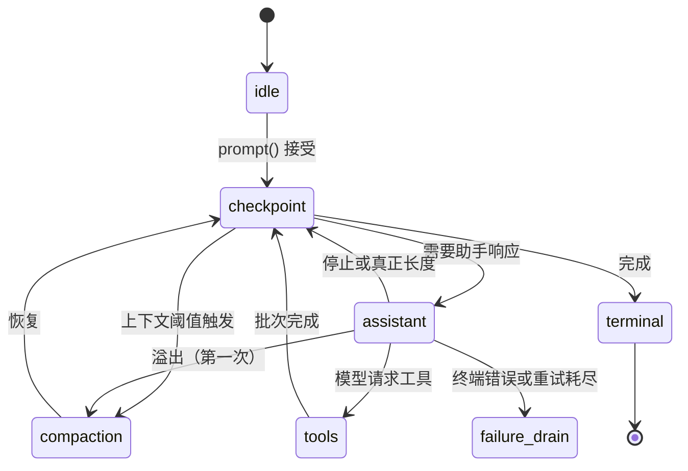

# Pi AgentHarness v1 深度解析

Pi 的 AgentHarness v1 是一份约 2900 行的实现规范，描述了一个**持久化 Agent 运行时**的完整设计。它解决的核心问题是：当 Agent 执行到一半崩溃了，如何保证不重复副作用、不丢失输入、不产生不一致状态？

这篇文章逐层拆解它的设计，帮助你理解每一个机制为什么存在。

## 1. 核心问题：崩溃安全

想象一个 Agent 正在执行任务：

1. 用户说"删除旧迁移文件，然后跑测试"
2. 模型返回两个工具调用：`delete_file` 和 `run_tests`
3. `delete_file` 开始执行，删除了几个文件
4. 进程崩溃了

重启后，系统面临什么状态？文件已经删了，但测试还没跑。如果直接重新执行整个任务，`delete_file` 会再次运行——但文件已经不在了。如果跳过 `delete_file` 只跑测试，系统怎么知道删除已经完成了？

AgentHarness v1 的答案是：**在副作用之前写一条意图记录，在副作用之后写一条结算记录。崩溃后读寄存器就知道该做什么。**

## 2. 三个存储，一个不变量

整个系统建立在三种存储之上：

```text
entries        会话树 — 写一次，追加式
registers      当前可变状态 — 键值对，覆盖或删除
usage ledger   成本历史 — 追加式行
```

:::note
关键不变量：**每个载荷恰好存在于一个地方**。没有第三种存储。这消除了"数据到底存在哪"的歧义。
:::

### 2.1 条目（Entry）：不可变的对话记录

条目是会话树中的节点，代表对话中的一条信息：

```ts
interface MessageEntry {
  id: string;          // UUIDv7
  parentId: string;    // 指向树中的父节点
  type: "message";
  message: AgentMessage;  // 用户消息、助手消息或工具结果
}
```

四种类型：

| 类型 | 用途 | 特点 |
|---|---|---|
| `message` | 用户消息、助手消息、工具结果 | 对话的核心内容 |
| `compaction` | 压缩摘要 | 替换旧上下文，保留 `retainedTail` |
| `branch_summary` | 分支摘要 | 导航时生成，标记分支分叉点 |
| `custom` | 应用自定义数据 | 通过 `entryProjectors` 投影到上下文 |

关键规则：

- 条目**写一次**，从不修改或删除
- 每个条目的 `parentId` 链接到树中的父节点，形成树结构
- 压缩条目存储完整的 `retainedTail`，使上下文**永远不需要越过压缩读取更早的内容**

### 2.2 寄存器（Register）：唯一的可变状态

寄存器是带命名空间的键值对，保存当前状态：

```text
lane.leaf/{name}     = 条目 id     → Lane 的当前位置
lane.config/{name}   = 配置        → 模型、思考级别、活跃工具
lane.state/{name}    = 状态        → 当前操作 id
op.meta/{opId}       = 操作元数据   → 写入一次，从不覆盖
op.state/{opId}      = 操作状态     → 程序计数器，每次转换覆盖
op.tool_args/{key}   = 工具参数     → 放行时写入一次
pending.entry/{id}   = 待处理载荷   → 排队内容等待放置
fact.name            = 会话名称
fact.label/{entryId} = 条目标签
```

:::tip
`op.state` 就是**程序计数器**。恢复时不需要重放日志或推断位置——直接读这个寄存器就知道操作进行到哪一步了。
:::

### 2.3 用量台账：追加式的成本记录

每次 provider 请求结算时写一行：

```json
{ "id": "u_7", "seq": 815, "entryId": "e_51", "usage": { "input": 12000, "output": 431 } }
```

关键设计：**失败尝试的成本也记录**。即使请求失败、被重试、甚至整个操作后来被中止，台账行不会被删除。计费独立于编排状态。

## 3. 原子事务：唯一的写原语

所有写入通过原子事务提交：

```
TX[ insert entry n1, upsert op.meta/O, upsert op.state/O = checkpoint ]
```

规则：

1. **全有或全无**——不存在部分提交
2. **严格递增的 seq**——写入按顺序获得序列号，跨所有 Lane 全局单调
3. **事务内有序**——条目可以引用同一事务中较早创建的父节点
4. **单写者**——一个会话只有一个进程在写

:::caution
事务内部没有崩溃状态。崩溃只能发生在两个事务之间。这就是为什么恢复可以枚举所有可能的崩溃位置。
:::

## 4. 操作状态机

### 4.1 操作的生命周期

一个操作（Operation）是 Lane 上的一单位持久工作：



### 4.2 程序计数器

`op.state` 寄存器保存操作的**完整当前状态**：

```ts
interface RunState {
  kind: "run";
  control: Control;         // running 或 cancel_requested
  settings: { ... };        // 接受时快照的配置
  phase: RunPhase;          // checkpoint | assistant | tools | compaction | deferred
  inbox: { steer: string[]; followUp: string[]; writes: string[] };
  latestAssistantEntryId: string | null;
}
```

每次状态转换覆盖整个寄存器。这意味着：

- **恢复不需要重放日志**——读一个寄存器就够了
- **状态是自包含的**——不依赖之前的状态
- **崩溃状态可枚举**——只可能在两个事务之间崩溃

### 4.3 副作用三明治

Provider 请求和工具调用被两次提交包裹：

```
TX[ "即将执行 X；输出将使用 id R 和 U" ]     ← 意图
   执行 X                                    ← 不确定窗口
TX[ 输出 + 用量 + 下一个状态 ]               ← 结算
```

:::danger
**整个系统唯一的不确定区间是：意图持久，结算缺失。** 在这个窗口内崩溃，系统不知道副作用是否已经发生。
:::

三条恢复策略覆盖这个窗口：

| 恢复的状态 | 策略 |
|---|---|
| 助手生成 `effect_pending` | 捕获的重试策略允许则开始新尝试；否则在保留 id 下合成错误 |
| 工具 `effect_pending` | 存储声明和当前声明都说 `safe` 才重新执行；否则合成 interrupted |
| 延迟 `effect_pending` | running 控制等待应用 resume；cancelled 控制合成 aborted |

## 5. 恢复：五次点查找

崩溃后重新打开，恢复过程是：

```
lane.state/{lane} → currentOperationId
op.meta/{opId}    → 操作元数据
op.state/{opId}   → 程序计数器
lane.leaf/{lane}  → 当前位置
lane.config/{lane} → 配置
```

:::note
恢复是**五次寄存器点查找**加精确 id 解引用。没有日志重放，没有历史扫描，没有树遍历。这就是"写一次加寄存器"设计的回报。
:::

然后验证当前状态命名的所有实体：

```ts
// 条目：触发条目、最新助手、批次助手、已完成结果...
// 寄存器：工具参数、结构准备、待处理载荷...
// 全部存在且类型正确
```

恢复**从不做的事**：

- 读寄存器历史（不存在历史）
- 折叠任何东西
- 扫描表
- 构建 provider 上下文
- 审计已完成的操作

## 6. Lane：并行工作的隔离单元

Lane 是树上的命名游标，拥有：

- **叶子**——新条目链接到它
- **操作日志**——至多一个打开操作
- **队列**——steer、followUp、nextRun
- **配置**——模型、思考级别、活跃工具

每个会话有 `main` Lane。应用可以创建更多：

```
harness.createLane("slack:1719432.0021", at: currentLeafId)
```

:::tip
Lane 的概念类似 git 分支：名字附加到位置，由新工作推进，可以移动到任何条目。但 Lane 可以移到**任何**条目（不只是向前）。
:::

两个 Lane 可以在同一叶子分叉，各自独立工作，互不干扰。它们共享树的历史但拥有独立的操作状态。

## 7. 队列与输入

三种输入机制，中止行为不同：

| 机制 | 用途 | 中止时 |
|---|---|---|
| `steer` | 纠正当前运行 | 载荷返回给调用者，条目不追加 |
| `followUp` | 运行结束后追加工作 | 同上 |
| `nextRun` | 播种下一次运行 | **存活**——下次运行接受时消费 |

所有输入在接受时持久化到 `pending.entry` 寄存器。树条目在**消费时**写入——模型第一次看到它的位置。崩溃后恢复从记录重建。

### 检查点过程

回合之间，Lane 经过检查点：

1. 应用延迟写入
2. 消费 steering 消息
3. 如果需要，压缩
4. 开始下一个助手生成
5. 消费 follow-up 消息
6. 如果没有更多工作，完成

:::note
检查点的顺序很重要：steering 优先于生成，生成优先于 follow-up。`"one-at-a-time"` 模式每次只消费最旧的一项。
:::

## 8. 压缩与上下文管理

### 追加式上下文不变量

> 在一个 Lane 的请求之间，provider 上下文只在尾部增长。

这是为了保护 provider 的 KV 缓存。在尾部之前插入会使缓存失效并倍增成本。

### 压缩的两种触发

1. **阈值触发**——上下文超过阈值时，在检查点自动压缩
2. **溢出触发**——provider 响应揭示请求不适合时，丢弃响应并压缩重试

溢出只允许恢复**一次**（`overflowRecoveryUsed` 标志）。第二次溢出直接失败。

### 压缩条目的自包含性

每个压缩条目存储：

- `summary`——旧上下文的摘要
- `retainedTail`——保留的最近消息（完整的，不是引用）

上下文构建规则：**从叶子向根扫描，遇到压缩就停。** 压缩之后的内容 = summary + retainedTail + 压缩之后的新条目。更早的内容永远不读。

## 9. 中止与关闭

### 中止（Abort）

中止不是阶段，是控制标志：

1. 第一次 `abort()` 提交 `cancel_requested`，排空 steer/follow-up 队列
2. 已在运行的副作用收到信号
3. 对账：未解析工具调用得到合成结果

:::danger
中止**不是回滚**。已经发生的副作用保留。文件已删就是删了。
:::

信号所有权保证 `aborted` 无歧义：只有 Harness 能拉取 AbortSignal，所以 `aborted` 响应意味着用户确实中止了，而不是超时或网络错误。

### 关闭（Close）

关闭是**受控崩溃**：

- 不写取消标记
- 不写终态
- 只拉信号停止进行中的副作用
- 排空已接受的提交
- 释放写者租约

重新打开后发现 `effect_pending`，应用标准恢复策略。打开的操作保持可恢复。

## 10. 存储后端

三种后端，同一模型，同一一致性测试：

| 后端 | 特点 | 适用场景 |
|---|---|---|
| Memory | 内存映射，无日志 | 测试、开发 |
| JSONL | 每提交一行，重放构建状态 | 单机文件存储 |
| SQLite | 每会话一个文件，事务性 | 生产单机 |

### JSONL 的快照压缩

JSONL 每次写入都追加一行。30 轮运行会留下约 10 条死掉的 `op.state` 行。快照压缩将文件重写为 `header + 活跃条目 + 活跃寄存器 + 台账`：

```text
压缩前：~10 条事务行，~27 次写入
压缩后：header + 4 条条目行 + 2 条用量行 + 4 条 Lane 寄存器行
```

### SQLite 的写者租约

SQLite 用 `writer_lease` 表强制单写者：

```sql
writer_lease(owner_id TEXT, fence INTEGER, expires_at_ms INTEGER);
```

过期所有者不能释放成功替代它的租约（fence 计数器保证）。

:::caution
每个 SQLite 事务必须以 `BEGIN IMMEDIATE` 打开。延迟 `BEGIN` 在并发写入时会以 `database is locked` 失败且无法恢复。
:::

## 11. 测试策略

三层测试，每层验证不同的声明：

### Tier A — 状态和恢复

对 Part 3 中的**每个状态**：持久构造它 → 关闭 → 重新打开 → 断言下一个动作正确。

关键规则：对每个恢复前缀，必须**关闭→重开→恢复→比较**。从初始前缀调用恢复两次不够。

### Tier B — 写者一致性

用插装存储装饰器（包装 `Storage.commit()` 的 spy）记录每个事务的精确写入顺序。对照规范断言。

捕获的回归类：副作用在意图之前开始、响应因某个停止原因被省略、分类在用量持久之前开始。

### Tier C — 确定性交错

每个竞争的两种顺序，手动驱动测试。`drive: "manual"` 让 Harness 在每个副作用前停靠，测试逐个释放。

## 12. 设计哲学总结

:::tip
AgentHarness v1 的核心洞察：**把易变的编排状态做成临时的，把持久的对话状态做成结构上无聊的。**
:::

- **编排状态**（`op.*` 寄存器）：构造上临时，操作结束就删除，允许在版本间变动
- **对话状态**（entries）：写一次追加式，永远读兼容，结构极简

Schema 演化的难度恰好等于无聊部分的难度——这是最好的可用结果。

## 13. 关键设计决策回顾

| 决策 | 选择 | 为什么 |
|---|---|---|
| 恢复方式 | 读寄存器 | 不需要日志重放或归约器 |
| 崩溃状态 | 只在事务之间 | 可枚举，可测试 |
| 清理方式 | 删除寄存器 | 不需要垃圾回收 |
| 并发控制 | Lane 变更线 | 每个竞争恰好两种历史 |
| 上下文管理 | 追加式 + 压缩 | 保护 KV 缓存 |
| 中止语义 | 控制标志 | 不回滚已发生的副作用 |
| 信号所有权 | Harness 独占 | `aborted` 无歧义 |
| 测试策略 | 三层 | 状态、写者、竞争分别验证 |
