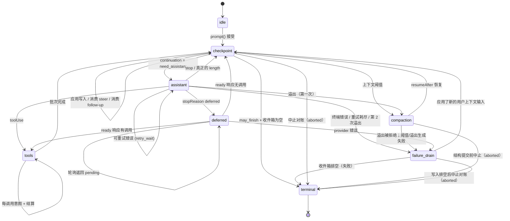

# AgentHarness — 实现规范

> 本文档是 Pi AgentHarness v1（`main` 分支 `packages/agent/docs/harness.md`）的完整中文翻译。原文约 2941 行，涵盖 9 个 Part 和 3 个附录。

## 目录

- [Part 0 — 概述](#part-0--概述)
  - [0.1 这是什么](#01-这是什么)
  - [0.2 系统模型](#02-系统模型)
  - [0.3 三个存储](#03-三个存储)
  - [0.4 实例演练 — Slack 线程](#04-实例演练--slack-线程)
  - [0.5 实例演练 — 工具执行中崩溃](#05-实例演练--工具执行中崩溃)
  - [0.6 非目标](#06-非目标)
  - [0.7 记号与源码类型](#07-记号与源码类型)
- [Part 1 — 存储](#part-1--存储)
  - [1.1 模型](#11-模型)
  - [1.2 身份](#12-身份)
  - [1.3 寄存器命名空间](#13-寄存器命名空间)
  - [1.4 事务](#14-事务)
  - [1.5 查询](#15-查询)
  - [1.6 用量台账](#16-用量台账)
  - [1.7 后端](#17-后端)
  - [1.8 为什么是写一次加寄存器](#18-为什么是写一次加寄存器)
- [Part 2 — 会话树](#part-2--会话树)
  - [2.1 条目](#21-条目)
  - [2.2 放置](#22-放置)
  - [2.3 Lane](#23-lane)
  - [2.4 事实](#24-事实)
  - [2.5 分支查询与上下文](#25-分支查询与上下文)
  - [2.6 分支索引](#26-分支索引)
  - [2.7 Fork](#27-fork)
  - [2.8 会话与仓库边界](#28-会话与仓库边界)
  - [2.9 精确重写](#29-精确重写)
- [Part 3 — 操作状态机](#part-3--操作状态机)
  - [3.1 操作](#31-操作)
  - [3.2 操作状态 — 程序计数器](#32-操作状态--程序计数器)
  - [3.3 Lane 状态与当前状态有效性](#33-lane-状态与当前状态有效性)
  - [3.4 原子转换规则](#34-原子转换规则)
  - [3.5 状态图](#35-状态图)
  - [3.6 接受](#36-接受)
  - [3.7 助手生成](#37-助手生成)
  - [3.8 工具](#38-工具)
  - [3.9 摘要生成 — 压缩与导航摘要](#39-摘要生成--压缩与导航摘要)
  - [3.10 导航](#310-导航)
  - [3.11 收件箱、队列、延迟写入](#311-收件箱队列延迟写入)
  - [3.12 检查点过程](#312-检查点过程)
  - [3.13 终态事务](#313-终态事务)
- [Part 4 — 执行、恢复、中止、关闭](#part-4--执行恢复中止关闭)
  - [4.1 解释器](#41-解释器)
  - [4.2 副作用边界](#42-副作用边界)
  - [4.3 Lane 变更线](#43-lane-变更线)
  - [4.4 恢复](#44-恢复)
  - [4.5 崩溃位置与恢复策略](#45-崩溃位置与恢复策略)
  - [4.6 中止](#46-中止)
  - [4.7 关闭 — 受控崩溃](#47-关闭--受控崩溃)
  - [4.8 故障](#48-故障)
  - [4.9 外部终结](#49-外部终结)
- [Part 5 — 公共表面](#part-5--公共表面)
  - [5.1 Lane 表面](#51-lane-表面)
  - [5.2 Harness](#52-harness)
  - [5.3 SessionTree](#53-sessiontree)
  - [5.4 快照与订阅](#54-快照与订阅)
  - [5.5 事件](#55-事件)
  - [5.6 钩子](#56-钩子)
  - [5.7 Agent 循环构建块](#57-agent-循环构建块)
  - [5.8 遥测](#58-遥测)
- [Part 6 — 未来：分区保留（Postgres）](#part-6--未来分区保留postgres)
- [Part 7 — Schema 演化](#part-7--schema-演化)
- [Part 8 — 构建顺序](#part-8--构建顺序)
- [Part 9 — 不变量与测试](#part-9--不变量与测试)
- [附录 A — 术语表](#附录-a--术语表)
- [附录 B — Coding-agent v3 格式兼容](#附录-b--coding-agent-v3-格式兼容)
- [附录 C — 开放问题](#附录-c--开放问题)

# Part 0 — 概述

## 0.1 这是什么

一个面向 Agent 对话的持久运行时。它持久化会话和操作状态，使被中断的工作可以在不重复已确定副作用的情况下恢复。

## 0.2 系统模型

### 会话（Session）

会话将相关的工作组织在一起，由四个部分组成：

- **条目树（Entry tree）。** 条目是一条消息、一次压缩、一个分支摘要或应用定义的自定义条目。条目不可变。每个分支是一个对话线程；共享树支持分支、压缩、Fork 和并行工作，同时保留历史。

  ```text
  a ── b ── c ── d
        └── e ── f
  ```

- **事实（Facts）。** 可变的、带命名空间的键值状态。内置包括会话名称和条目标签；应用可以存储自定义事实。
- **Lane。** 树上的命名游标。每个会话都有 `main`。一个 Lane 拥有自己的叶子、模型配置、队列和至多一个操作。额外的 Lane 支持 Slack 线程、子 Agent 和其他基于共享历史的并行工作。
- **用量台账（Usage ledger）。** 会话的追加式 token 和成本事件。

### Harness 与操作

会话层管理持久数据并暴露类型化的树视图。Harness 驱动 Lane：接受 prompt、执行模型和工具步骤、管理队列、压缩或导航树、恢复被中断的工作。它还拥有 harness 级别的可用工具和 prompt 资源注册表、拦截和转换执行的钩子、报告活动和持久变化的被动事件，以及运行时配置。

一个**操作（Operation）**是一个被接受的 Lane 工作单元：一次运行（run）、压缩（compaction）或导航（navigation）。它的不可变元数据记录其身份、意图和起始点；它的完整当前状态记录其阶段、控制、队列和恢复数据。每次持久转换替换当前状态。完成时删除操作状态并记录 Lane 的结果。

### 存储

在会话和 Harness 之下，`Storage` 暴露原子事务和查询，覆盖三种持久形式：不可变条目、可变寄存器和追加式用量行。寄存器构成一个可变的、带命名空间的键值存储。事实存放在那里；内部 harness 命名空间持久存储崩溃恢复所需的待放置内容和 Lane 及操作状态。特别是，`op.meta` 在操作元数据时写入一次，而 `op.state` 在每次转换后被替换为完整当前状态。终态事务删除两者并写入 `lane.lastResult`。不会看到部分事务。

## 0.3 三个存储

第 1–5 部分的一切都源于此。

**1. 三个存储，一个不变量。** 一切持久的东西都是以下之一：

```text
entries        会话树 — 写一次，追加式
registers      当前可变状态 — 带命名空间的类型化单元，覆盖或删除
usage ledger   成本历史 — 追加式行
```

*每个载荷都在一个条目、一个寄存器或台账中；没有第三个地方。* 条目是完整的会话记录 — 放置和载荷在一行中。寄存器直接保存其当前类型化值；覆盖丢弃旧值，删除移除键。在树中有位置之前持久存在的内容（排队输入、延迟写入）等待在 `pending.entry` 寄存器中，并在放置它的事务中成为条目。每个后端的投影 — 分支索引、全文搜索、统计 — 都可以从三个存储重建，不具有权威性。

**2. 原子事务。** 事务是一组条目插入、用量插入和寄存器写入（设置或删除），以全有或全无的方式提交，序列号严格递增。事务内部不存在崩溃状态。这是唯一的写原语。

**3. 持久程序计数器。** 每一步之后，Harness 用操作的*完整*当前状态覆盖一个寄存器 — `op.state/{operationId}`。恢复不重放日志，也不从缺失的内容推断位置；它读取该寄存器并据此切换。状态是*完备的* — 它从不依赖先前的状态。小的捕获值（配置、流选项、重试策略）内联；大的稳定载荷存在于同级的 `op.*` 寄存器中或通过 id 命名。操作结束时，终态事务删除其寄存器：一个已完成的会话恰好保存会话、台账和少数 Lane 与事实寄存器。没有死状态需要收集。

**4. 副作用三明治。** Provider 请求和真实工具调用被两次提交包裹：

```
commit:  "即将执行 X；其输出将使用 id R 和 U"     ← 意图
         执行 X                                   ← 不确定的部分
commit:  输出 + 用量 + 下一个状态                  ← 结算
```

钩子遵循其重放契约：结果在消费它的事务中变为持久，在该事务之前的崩溃可能重新运行钩子。因此每个外部副作用仍然可能在没有持久结算的情况下发生。Provider/工具意图在重放策略依赖的地方明确这种不确定性；幂等钩子将其接受为非目标。

## 0.4 实例演练 — Slack 线程

用户在一个已有 400 条历史条目的频道中发帖。应用为该线程创建一个 Lane，锚定在频道的当前叶子。条目 id 是 UUIDv7（§1.2）；示例缩写它们。

```
harness.createLane("slack:1719432.0021", at: "0195c8d1-4a2e-7b31-…")
lane.prompt("上周 auth 有什么变化？")
```

按顺序发生的事情：

1. **接受。** Harness 验证、运行 `before_run` 钩子并提交一个事务：用户消息条目、操作的 `op.meta` 寄存器及其第一个 `op.state` — *"我在一个检查点，我需要一个助手响应。"*
2. **意图。** 内部就绪状态提交后，提交请求意图：*"我即将发出 provider 请求。响应将是条目 `0195c8d1-53a0-7c44-…`，用量行将是 `0195c8d1-53a0-7d18-…`。"* 两个 id 现在就已生成；尚未发送任何内容。
3. **请求。** 流式传输发生。这是唯一不持久的部分。
4. **结算。** 一个事务提交响应条目、其用量行和下一个状态：*"响应包含工具调用；这是批次计划，结果 id 已分配。"*
5. 工具调用遵循相同的意图 → 副作用 → 结算形态，每对一个提交对。
6. 当模型在没有工具调用时停止，终态事务删除操作的寄存器，在 `lane.lastResult` 中记录结果，Lane 进入空闲。

作为追踪（id 缩写；每个 `TX[...]` 是一个原子提交）：

```text
TX[ insert entry n1 (user msg), upsert op.meta/O, upsert op.state/O = checkpoint,
    upsert lane.leaf = n1, upsert lane.state = { currentOperationId: O } ]
TX[ upsert op.state/O = assistant ready (config snapshot) ]
TX[ upsert op.state/O = effect_pending (reserves response n2, usage u1) ]
… provider 流式传输 …                                ← 不确定窗口
TX[ insert entry n2, insert usage u1, upsert lane.leaf = n2,
    upsert op.state/O = tools (result id n3 reserved) ]
TX[ upsert op.tool_args/O:s1:0, upsert op.state/O = call 0 effect_pending ]
… 工具运行 …
TX[ insert entry n3, upsert lane.leaf = n3, upsert op.state/O = checkpoint ]
… 第二轮：ready · intent · stream · settle (n4, u2) …
TX[ delete op.meta/O, op.state/O, op.tool_args/O:*,
    upsert lane.lastResult = { O, completed, n4 },
    upsert lane.state = { currentOperationId: null } ]
```

在这些事务之间的任意两点杀死进程并重启。Harness 读取 Lane 的寄存器，确切看到哪些句子是最后一个已提交的，然后继续。如果它在第 3 步死亡，它知道一个请求可能已被计费且可能产生也可能没有产生输出 — 这是整个系统中唯一真正不确定的窗口，并且有明确的策略处理它。

同时，同一频道中的第二个线程在相同的 400 条共享历史之上运行自己的 Lane，两者之间没有协调。

## 0.5 实例演练 — 工具执行中崩溃

```
lane.prompt("删除过时的迁移并运行测试套件")
```

模型返回两个工具调用。Harness 提交批次计划，然后提交 `call 0 即将执行，使用这些确切参数，且它声明自身不可安全重放`。工具开始删除文件。进程被杀死。

```text
TX[ insert entry n2 (assistant, 2 calls), insert usage u1, upsert lane.leaf = n2,
    upsert op.state/O = tools (result ids n3, n4 reserved) ]
TX[ upsert op.tool_args/O:s1:0, upsert op.state/O = call 0 effect_pending,
                                                    replay: "never" ]
… 工具删除文件 …  ← 崩溃
```

重启后 Harness 读取一个寄存器，发现 `calls[0].status = "effect_pending", replay = "never"`。它不会重新运行删除。它在副作用开始前保留的结果 id 下追加一个合成错误结果，标记调用完成，继续调用 1：

```text
TX[ insert entry n3 (synthetic "interrupted" result), upsert lane.leaf = n3,
    upsert op.state/O = call 0 completed ]
```

会话保持连贯 — 每个工具调用都有结果 — 并且没有运行两次。

如果工具声明了 `replay: "safe"`（读取、查询），Harness 会用持久化的参数重新执行它。

## 0.6 非目标

- **恰好一次的外部副作用。** 见上文。有自己副作用的钩子必须幂等，以操作 id 为键。
- **Provider 流恢复。** 部分流是进程本地的，从不持久化。已结算的响应在任何分类之前*完整地*持久化。
- **多写者。** 每个会话一个进程。服务层相应路由，SQLite 后端用围栏租约强制执行（§1.7）。Lane 覆盖看起来像多写者的工作负载。
- **复制。** 会话只存在于一处。
- **持久写历史。** 寄存器只保存当前值：被覆盖的寄存器消失，没有 API 或表暴露写历史。测试中的写顺序断言使用 `commit()` 周围的插装存储装饰器（Part 9）；生产审计属于遥测层（§5.8）。
- **删除作为运行时特性。** 条目和用量行从不删除：压缩改变 provider 上下文，不改变存储，终态清理只删除寄存器。注意 `retainedTail` 将旧消息向前复制到较新的压缩条目中，摘要从旧内容派生，所以压缩也不是擦除。合规级的"删除这个"是管理性的精确重写（§2.9），是唯一被批准的例外。

## 0.7 记号与源码类型

- `TX[ a, b, c ]` — 一个包含写入 `a`、`b`、`c`（按此顺序）的原子提交。写入词汇是 `insert entry`、`insert usage`、`upsert namespace/key = value` 和 `delete namespace/key`。
- id 是 UUIDv7（§1.2）。示例缩写它们：短标签 — `e_*` 条目 id、`u_*` 用量 id、`op_*` 操作 id — 在时间前缀无关时替代完整 id；前缀重要时，示例显示它（`0195c8d1-4a2e-7b31-…`）。
- `S(next)` — 用下一个完整操作状态覆盖 `op.state/{operationId}` 寄存器。`L(next)` — 对 `lane.state/{lane}` 同理。
- **must / must not** 是规范性的。其余都是解释。

源码类型出处：

- `AgentMessage`、`AgentTool`、`AgentToolResult`、`QueueMode` 和 `ThinkingLevel`：`packages/agent/src/types.ts`。
- `AgentEventSink`：`packages/agent/src/agent-loop.ts`。
- `Skill`、`PromptTemplate`、`AgentHarnessResources`（下文 `Resources`）、`AgentHarnessTool`、`AgentHarnessStreamOptions` 和 `AgentHarnessStreamOptionsPatch`：`packages/agent/src/harness/types.ts`。
- `Model`、`Models`、`Usage`、`RetryPolicy`、`StopReason`、`AssistantMessage`、`ImageContent`、provider 消息、流选项和延迟句柄：`packages/ai`。
- `CompactionSettings`、`CompactionPreparation`、`CompactResult`、`BranchPreparation` 和 `BranchSummaryResult`：`packages/agent/src/harness/compaction/`。现有的准备和拆分回合算法仍是实现的起点，除非本文档明确更改它们。
- `TelemetryContext` 和类型化 schema 辅助：`packages/telemetry`；Agent 拥有的 schema 保留在 `packages/agent/src/harness/telemetry.ts` 中。
- 持久自定义消息注册的 `TSchema`：typebox。

公共 `QueueMode` 保持 `"all" | "one-at-a-time"`。公共 `RetryPolicy` 保持 pi-ai 形状 `{ enabled, maxRetries, baseDelayMs }`；操作状态存储其规范化后的 `{ maxAttempts, baseDelayMs }` 等价物。`maxRetries` 和 `baseDelayMs` 必须是有限非负安全整数，且 `maxRetries + 1` 必须保持安全；禁用重试规范化为一次尝试。指数延迟和 `notBefore` 算术在 `Number.MAX_SAFE_INTEGER` 处饱和。公共 `CompactionSettings` 保持 `{ enabled, reserveTokens, keepRecentTokens }`；两个 token 计数必须是有限非负安全整数。构造函数和设置器在发布前拒绝无效设置。本设计在 `AgentHarnessStreamOptions` 及其补丁类型中添加 `deferred?: boolean | { window?: "15m" | "1h" | "24h" }`；结构请求始终强制其为 false。

```ts
type SettledAssistantMessage = AssistantMessage & {
  stopReason: Exclude<StopReason, "pending">;
};

// Provider 分发在请求时通过 Models 解析持久的 { provider, modelId } 身份，
// 同时应用认证。缺失或被替换的注册表条目像未知工具一样带内失败该请求。
```

---

# Part 1 — 存储

存储对 Agent、Lane 或会话一无所知。它存储条目和用量行，更新寄存器，并回答一小组固定查询。第 2–4 部分完全建立在此之上。

## 1.1 模型

```ts
type JsonValue = null | boolean | number | string | JsonValue[] | { [k: string]: JsonValue };

/** 写一次。完整的会话记录：放置和载荷在一行中。
    在恰好一个事务中创建，从不修改或删除。扩展此基类的
    四个具体条目类型在 §2.1 中定义。 */
interface EntryBase {
  id: string;                // UUIDv7 (§1.2)
  parentId: string | null;
  seq: number;               // 提交时由存储分配
  timestamp: number;         // Unix 毫秒，提交时由存储分配
  type: EntryType;
  customType?: string;       // 当 type === "custom" 时
  // ...每个条目类型的载荷字段 (§2.1)
}

type EntryType = "message" | "compaction" | "branch_summary" | "custom";

/** 唯一的可变存储。一个带命名空间的键，直接保存其当前类型化值。
    覆盖替换值；删除移除键。 */
interface Register<N extends RegisterNamespace = RegisterNamespace> {
  namespace: N;
  key: string;
  value: RegisterValues[N];
  seq: number;               // 最后设置此寄存器的写入的 seq
}

/** 追加式成本台账行。从不修改，从不删除 (§1.6)。 */
interface UsageRow {
  id: string;                // UUIDv7 (§1.2)
  seq: number;               // 提交时由存储分配
  usage: Usage;
  entryId?: string;          // 此成本所属的条目（如果有）
  adjustment: boolean;       // true = 调用者提供的对账，不是 provider 报告
  details?: JsonValue;
}
```

## 1.2 身份

每个 id — 条目、用量和每个保留的 id — 都是来自会话 id 生成器的 **UUIDv7**（§2.8）；遗留导入重新生成以符合规范（附录 B）。前 48 位是生成时间，所以每个引用都是自描述的且按时间可排序。接受的成本：id 泄露创建时间。（未来的分区 Postgres 后端将建立在此前缀上 — 信息性 Part 6。）

生成规则：

1. id 在**保留时**用 `now()` 生成。直接追加在同一事务中放置；助手/工具 id 的放置比请求时长至多多一个尾随。
2. **工具结果 id 继承其助手 id 的时间戳**（`idGenerator.next(timestampMs?)`，新的随机尾部），所以调用和结果组在 id 顺序下是时间连贯的，甚至跨午夜边界。
3. 合成结算在已保留的 id 下写入（§4.5）— 没有特殊情况。

**不透明载荷** — 自定义条目 `data`、`details`、`fact.custom` 值、消息文本、钩子 `resumeData` — 可以嵌入条目 id。Harness 从不跟踪这些引用，它们可能过期；复制内容，不要引用它。

**绝对规则。** 在会话内，条目和用量行从不删除 — 精确重写（§2.9）是唯一例外。缺失的父节点总是损坏。

## 1.3 寄存器命名空间

```ts
interface RegisterValues {
  "lane.leaf":       string | null;                // 条目 id；null = Lane 在根
  "lane.config":     LaneConfiguration;            // §2.3
  "lane.state":      LaneState;                    // §3.3
  "lane.lastResult": LaneLastResult;               // §3.13
  "op.meta":         Operation;                    // §3.1
  "op.state":        OperationState;               // §3.2 — 程序计数器
  "op.tool_args":    Record<string, JsonValue>;    // 有效工具参数 (§3.8)
  "op.preparation":  DurableStructuralPreparation; // §3.9
  "pending.entry":   PendingEntry;                 // §2.2
  "fact.name":       string;
  "fact.label":      string;
  "fact.custom":     JsonValue;                    // JSON null 是合法值
}
type RegisterNamespace = keyof RegisterValues;

/** 未放置的内容：当前可变状态，直到放置事务写入完整条目
    并删除此寄存器 (§2.2)。 */
interface PendingEntry {
  type: "message" | "custom";
  customType?: string;
  payload?: JsonValue;       // 变成条目载荷的内容；
                             // 缺失 = 没有数据的自定义条目
}

interface DurableFileOperations {
  read: string[]; written: string[]; edited: string[];
}
type DurableStructuralPreparation =
  | { kind: "compaction"; messagesToSummarize: AgentMessage[];
      turnPrefixMessages: AgentMessage[]; retainedTail: AgentMessage[];
      isSplitTurn: boolean; tokensBefore: number; previousSummary?: string;
      fileOps: DurableFileOperations; settings: CompactionSettings }
  | { kind: "branch_summary"; messages: AgentMessage[];
      fileOps: DurableFileOperations; totalTokens: number };
```

| 命名空间 | 键 | 值 | 含义 |
|---|---|---|---|
| `lane.leaf` | lane 名称 | 条目 id 或 `null` | 此 Lane 下次追加的位置 |
| `lane.config` | lane 名称 | `LaneConfiguration` | 完整 Lane 配置 |
| `lane.state` | lane 名称 | `LaneState` (§3.3) | `currentOperationId`、`pendingNextRun` |
| `lane.lastResult` | lane 名称 | `LaneLastResult` (§3.13) | Lane 最近操作的终态结果 |
| `op.meta` | 操作 id | `Operation` (§3.1) | 接受数据；写入一次，从不覆盖 |
| `op.state` | 操作 id | `OperationState` (§3.2) | 完整操作状态 — **程序计数器** |
| `op.tool_args` | `{opId}:{stepId}:{sourceIndex}` | 有效参数 | 工具放行时写入一次 (§3.8) |
| `op.preparation` | `{opId}:{taskId}` | `DurableStructuralPreparation` | 决策钩子之前写入一次 (§3.9) |
| `pending.entry` | 保留的条目 id | `PendingEntry` | 等待放置的排队内容 (§2.2) |
| `fact.name` | `""` | string | 会话名称 |
| `fact.label` | 条目 id | string | 条目标签 |
| `fact.custom` | 应用键 | `JsonValue` | 应用状态 |

这就是完整的集合。键形状中可见两种生命周期：

```text
lane.*  fact.*     会话生命周期；事实只通过显式应用操作删除
op.*               操作生命周期；由终态事务删除 (§3.13)
pending.entry      存活到其内容被放置或取消
```

- `op.meta` 和 `op.preparation` 键恰好写入一次；`op.tool_args` 键每个键写入一次，以产生它的步骤为键，所以批次从不冲突。所有这些最迟在终态事务中删除；只有 `op.state` 在操作期间被覆盖。
- 操作拥有的 `pending.entry` 寄存器在结束时仍未消费的（剩余收件箱项和中止排空项）由终态事务删除 — 已消费项的寄存器在其放置事务中死亡；Lane 拥有的（`pendingNextRun`）比操作存活更久，在消费或取消时死亡（§3.11）。
- `lane.lastResult` 只由终态事务写入，并被其 Lane 上的下一个终态事务覆盖 — 每个 Lane 一个有界寄存器，永远。恢复从不读取它；它的存在是为了让接受了一个操作、崩溃并重新打开的应用仍然可以了解其结果（§3.13）。
- 删除事实移除其寄存器。在 `fact.custom` 中存储 JSON `null` 是一个不同的、合法的状态；没有墓碑。
- 取消不留下痕迹：`cancelQueued` 分类为 pending → `cancelled`，条目存在 → `already_consumed`，否则 → `not_found`（§3.11）。重试丢失取消的客户端将 `not_found` 视为成功。

## 1.4 事务

```ts
/** 映射判别联合：命名空间强制值类型。 */
type RegisterSetWrite = {
  [N in RegisterNamespace]: { kind: "register"; op: "set"; namespace: N;
                              key: string; value: RegisterValues[N] }
}[RegisterNamespace];

type Write =
  | { kind: "entry"; entry: Omit<Entry, "seq" | "timestamp"> }
  | { kind: "usage"; row: Omit<UsageRow, "seq"> }
  | RegisterSetWrite
  | { kind: "register"; op: "delete"; namespace: RegisterNamespace; key: string };

interface Transaction { writes: Write[] }

interface CommitResult { firstSeq: number; seqs: number[]; timestamp: number }
```

规则：

1. 事务**全有或全无**提交。不存在其中某些写入存在而其他不存在的可观察状态。
2. 写入按给定顺序获得**严格递增**的 `seq` 值；间隙是合法的，事务内和事务间都是。`seq` 在所有 Lane 和所有写入类型中是会话级单调的。寄存器 `set` 用其分配的 `seq` 标记寄存器。
3. 在事务内，写入按顺序应用：条目可以命名在同一事务中较早创建的父节点；寄存器值可以引用同一事务中较早创建的条目或用量 id。放置事务插入完整条目并删除其 `pending.entry` 寄存器（§2.2）— 从不存在两者同时存在的时刻。
4. 条目和用量 id 共享一个会话级 id 命名空间。在任何现有 id 下写入任一类型都是**损坏**，不是更新。
5. 具有相同 `(namespace, key)` 的寄存器 `set` 替换当前值；`delete` 移除键；后来的 `set` 重新创建它。不保留历史。命名不存在键的 `delete` 是无操作，所以清除未设置标签等公共删除保持合法。
6. 一个会话上的事务是**序列化的**。有一个写者和一个队列。

会话在存储准入之前验证完整事务，包括 JSON 序列化和运行时 schema。已准入提交的失败**使 Harness 故障**：所有副作用停止，所有调用拒绝，进程必须重启。不容忍部分应用的事务。

## 1.5 查询

一个 `Storage` 实例服务一个会话。仓库发现和生命周期在此接口之外（§2.8）。

```ts
interface Storage {
  commit(tx: Transaction): Promise<CommitResult>;

  getEntries(ids: string[]): Promise<ReadonlyMap<string, Entry>>;

  getRegister<N extends RegisterNamespace>(namespace: N, key: string):
    Promise<Register<N> | undefined>;
  /** keyPrefix 是 (namespace, key) 上的索引前缀列表；终态
      清理的 op.* 前缀扫描使用它 (§3.13)。 */
  listRegisters<N extends RegisterNamespace>(namespace: N, keyPrefix?: string):
    Promise<Register<N>[]>;

  scanBranch(q: BranchScan): Promise<Entry[]>;            // §2.5
  scanBranchStructure(q: BranchScan): Promise<EntryStructure[]>;
  scanEntries(q: EntryScan): Promise<Entry[]>;            // 会话级树清单
  scanUsage(q: UsageScan): Promise<UsageRow[]>;           // seq 范围台账读取 (§1.6)
  getStats(): Promise<SessionStats>;                      // 维护的投影 (§1.6)

  close(): Promise<void>;
}

/** 没有载荷字段的放置元数据。 */
type EntryStructure = Pick<Entry, "id" | "parentId" | "seq" | "timestamp" | "type" | "customType">;

interface EntryScan {
  type?: EntryType; customType?: string;
  fromSeq?: number; toSeq?: number;
  order?: "asc" | "desc"; limit?: number;
}

interface UsageScan {
  fromSeq?: number; toSeq?: number;
  order?: "asc" | "desc"; limit?: number;
}
```

刻意没有跨命名空间的寄存器扫描，也没有持久写日志。恢复、事实、Fork 和执行跟随精确的 id 和键；条目清单使用 `scanEntries`；台账读取使用 `scanUsage`；总计使用统计投影（§1.6）；测试顺序断言用插装存储装饰器包装 `commit()`（Part 9）；生产审计属于遥测（§5.8）。

恢复和执行读取必须是索引驱动且有界的。它们不得从缺失值推断状态，也没有寄存器历史可折叠。允许精确解引用：一个当前状态可以命名一组有界的条目和寄存器，在一次批次中获取，无需依赖顺序的归约。公共清单和调试 API 可能有意读取比热路径更多的内容；它们的 `limit`/分页行为在 `SessionTree` 层是显式的。

`close()` 是幂等的。它封闭准入，拒绝该实例上的后续读取/提交，排空封闭前准入的提交，然后释放资源和写者声明。持久数据通过仓库重新打开。

## 1.6 用量台账

每次已结算的 provider 尝试写入一个 `UsageRow` — 成功、失败、重试和合成尝试都一样，包括其操作后来中止的尝试。结算事务一起写入响应条目及其用量行（§3.7）；合成结算在保留的用量 id 下写入零用量。行是追加式的：终态清理删除操作的寄存器但从不删除其台账行，所以计费在编排状态可能发生的一切中存活。

```jsonc
{ "id": "u_7", "seq": 815, "entryId": "e_51", "adjustment": false,
  "usage": { "input": 12000, "output": 431, "cost": { ... } } }
```

- `entryId` 命名成本所属的条目（如果有）。在产生条目之前失败的结构（摘要）尝试和独立对账没有。
- `adjustment: true` 标记调用者提供的对账（`recordUsage`，§5.1），而不是 provider 报告。格式 3 导入写一行聚合调整行（附录 B）。
- Provider 尝试用量 id 是在意图提交中保留的 UUIDv7（§1.2），所以结算在恰好其意图承诺的 id 下写入。调整行、工具报告的用量行、钩子提供的压缩/导航用量行（§3.9、§3.10）和导入聚合在提交时生成 id；没有保留。
- `getStats()` 是对台账和消息条目计数的维护投影 — `messageCount` 只计算 `message` 条目，不计算压缩、摘要或自定义条目。每次提交后它等于台账总和；一致性套件断言这一点（Part 9）。单行在提交时通过 `usage` 事件到达应用（§5.5），`scanUsage`（§1.5）按 seq 范围读回 — 持久化其已应用的最大事件 `seq` 的消费者在停机后用 `scanUsage({ fromSeq })` 追上。恢复从不读取台账。

## 1.7 后端

一个模型的三种编码现在发布 — Memory、JSONL、SQLite — 三者都通过相同的一致性套件（Part 9）。每个后端记录会话的 `storageVersion`（Part 7）：JSONL 头字段、SQLite 目录列。Memory 会话始终是当前的。可能的第四个后端 — 分区 Postgres — 在 Part 6 中信息性勾勒；这里没有东西依赖它。

### Memory

```ts
entries:   Map<string, Entry>
registers: Map<string, Register>       // 键：`${namespace}\u0000${key}`
usage:     Map<string, UsageRow>
children:  Map<string, string[]>       // parentId → 条目 id，用于树遍历
```

一个队列序列化提交。提交验证并将写入应用到临时事务状态，然后一起发布映射。寄存器删除是映射删除。读取是映射查找；`scanBranch` 遍历 `parentId` 并在 RAM 中过滤。没有日志：Memory 精确保存活跃状态，别无其他。

### JSONL

文件不是状态；它是上述 Memory 映射的**重放配方**。每个 `commit()` 一条物理行。存储先分配序列/时间戳字段，然后将一个已提交的写入编码为一条 JSON 对象行，或多个写入作为一条**数组行**。

```jsonl
{"v":4,"kind":"header","id":"s_1","storageVersion":1,"createdAt":1700000000000,"cwd":"..."}
[{"kind":"entry","seq":101,"timestamp":1700000000000,"id":"e_50","parentId":"e_41","type":"message","message":{"role":"user","content":[...]}},
 {"kind":"register","op":"set","seq":102,"namespace":"op.meta","key":"op_9","value":{...}},
 {"kind":"register","op":"set","seq":103,"namespace":"op.state","key":"op_9","value":{...}},
 {"kind":"register","op":"set","seq":104,"namespace":"lane.leaf","key":"main","value":"e_50"},
 {"kind":"register","op":"set","seq":105,"namespace":"lane.state","key":"main","value":{...}}]
{"kind":"usage","seq":110,"id":"u_7","entryId":"e_51","adjustment":false,"usage":{...}}
{"kind":"register","op":"delete","seq":131,"namespace":"op.state","key":"op_9"}
```

- 这是格式 4。源码树中当前不兼容的格式 4 代码未完成并被就地替换；不需要为它迁移。Coding-agent 格式 3 保持支持（附录 B）。
- 打开按顺序将行重放到 Memory 映射中：条目和用量行累积；后来的寄存器 `set` 覆盖键，`delete` 移除它。这是*解码*，不是恢复逻辑。打开验证持久化的序列单调性 — 严格递增，间隙合法（§1.4）— 和时间戳，从不重新生成已提交的时间戳。所有查询然后在 RAM 中运行。
- **损坏的最后一行被整体丢弃**，包括数组的每个元素，并在新写入准入前截断。这就是"事务内没有崩溃前缀"在这里为真的原因。
- 损坏的*内部*行或完整但无效的事务是损坏。一个例外：schema 迁移之前被取代的旧形状寄存器行在重放期间作为键控原始 JSON 宽松解码（Part 7）；压缩淘汰它们。
- 持久性是进程崩溃级别：已解析的 `commit()` 在进程死亡后存活。不承诺 fsync。
- 可选：每个条目保留 `(offset, length)` 并延迟加载载荷，只保持结构和寄存器驻留。只在性能分析需要时才这样做。

**快照压缩。** 在 SQLite 中寄存器 `set` 是就地 upsert — 30 轮运行留下一个 `op.state` 行然后零个。在 JSONL 中每次 `set` 都追加，所以同样的运行追加约 10 条完整 `op.state` 行，在终态 `delete` 行落地时全部死亡：文件随*写历史*增长，即使逻辑状态不会。修复方法是将文件重写为 `header + 当前条目 + 当前寄存器 + 用量行`，通过临时文件 + 原子重命名；存活的行保持其原始 `seq` 值，被丢弃行留下的间隙是合法的（§1.4），所以压缩不需要重新编号机制。对于一次四条目的运行：

```text
压缩前：  ~10 条事务行，~27 次写入 — op.state 修订、
          工具参数、待处理载荷，全部在终态行之后死亡
压缩后：  header + 4 条条目行 + 2 条用量行 + 4 条 lane 寄存器行
```

何时压缩：打开时死字节比例超过阈值时；可选地在终态事务之后；总是在 schema 迁移之后（Part 7）。压缩之间，正常操作是追加式的，每次提交 O(1)。值得陈述的一个后果：已删除的待处理载荷和被取代的状态修订**作为字节存留**直到压缩 — 逻辑删除是立即的，物理删除是延迟的。需要及时物理移除敏感已取消内容的部署在终态边界积极压缩。

### SQLite

**每个会话一个数据库文件。** 文件就是会话，正如 JSONL 文件一样。损坏被限制在一个会话内，删除就是 unlink 一个文件，SQLite 的每文件单写者规则与设计的每会话单写者规则在构造上一致。

```sql
entries(id TEXT PRIMARY KEY, parent_id TEXT, seq INTEGER, type TEXT,
        custom_type TEXT, timestamp INTEGER, payload TEXT) WITHOUT ROWID;
CREATE INDEX ix_entry_parent ON entries(parent_id);
CREATE INDEX ix_entry_seq ON entries(seq, type);

registers(namespace TEXT, key TEXT, seq INTEGER, value TEXT,
          PRIMARY KEY (namespace, key));

usage_ledger(id TEXT PRIMARY KEY, seq INTEGER, entry_id TEXT, adjustment INTEGER,
             usage TEXT, details TEXT) WITHOUT ROWID;
CREATE INDEX ix_usage_seq ON usage_ledger(seq);

-- 私有分支索引 (§2.6)。不是寄存器；其他后端没有等价物。
branch_entries(branch_id TEXT, entry_id TEXT, entry_seq INTEGER, entry_type TEXT,
               PRIMARY KEY (branch_id, entry_id)) WITHOUT ROWID;
-- 有序扫描。entry_seq 必须紧跟 branch_id 否则 ORDER BY 需要
-- 临时 b-tree；entry_id 和 entry_type 尾随以便索引覆盖纯 id 读取。
CREATE INDEX ix_be_seq  ON branch_entries(branch_id, entry_seq, entry_id, entry_type);
-- 类型过滤扫描。
CREATE INDEX ix_be_type ON branch_entries(branch_id, entry_type, entry_seq, entry_id);
CREATE INDEX ix_be_entry ON branch_entries(entry_id);
branch_meta(branch_id TEXT PRIMARY KEY, tip_entry_id TEXT, tip_seq INTEGER,
            base_branch_id TEXT, base_seq INTEGER);
CREATE UNIQUE INDEX ix_bm_tip ON branch_meta(tip_entry_id);

-- 各一行：文件就是会话。
session(created_at, parent_session_id, storage_version, metadata,
        message_count, usage_payload, next_seq);
writer_lease(owner_id TEXT, fence INTEGER, expires_at_ms INTEGER);
```

一个 `commit()` 是一个 SQL 事务：插入条目、插入台账行、upsert 或删除寄存器、维护分支索引、更新 `session_stats`。从不对条目或台账行执行 UPDATE 或 DELETE；可变性局限于寄存器、分支索引（`branch_meta` 的 tips 和 bases）、统计、序列、会话目录行和租约。

**每个事务必须以 `BEGIN IMMEDIATE` 打开。** 在写入之前先读取的延迟 `BEGIN` 获取读快照，之后必须升级到写锁；如果另一个写者在中间提交，SQLite 使该升级失败 — 而 `busy_timeout` **不能**拯救它，因为等待无法刷新过期快照。唯一的恢复是回滚并完全重试。

每个提交都有这个形状，不只是少数几个。分配序列范围读取会话行的 `next_seq` 然后写入它，所以系统执行的每个事务中读取先于写入。分支创建（§2.6）添加第二个实例，在插入之前读取最新压缩。`BEGIN IMMEDIATE` 预先获取写锁并避免不可恢复的过期快照升级，所以这里不存在延迟 `BEGIN` 是正确选择的情况。

**`writer_lease` 强制单写者规则。** WAL 很乐意让两个进程交替写入一个文件，这正是设计禁止的交错 — 所以每会话文件并不能消除对租约的需求。过期的围栏所有权：`open()` 获取声明，存储在追加时和空闲时续约它，关闭在队列排空后停止续约并只删除其匹配的 `(owner_id, fence)` 对 — 所以过期所有者不能释放成功替代它的那个。这就是"一个进程拥有一个会话"成为强制属性而不是信任服务层维护的约定的原因。Memory 和 JSONL 没有等价物，依赖进程所有权；被打开两次的 JSONL 会话是损坏的且未被检测。

原子性本身不需要特殊处理。多写事务按文件格式是全有或全无的：WAL 帧只在提交记录落地时可见，所以并发读者要么看到事务的所有写入，要么看不到任何写入。

`scanBranch` 的每个物理段使用一个 JOIN；§2.6 组合段范围：

```sql
SELECT e.id, e.parent_id, e.seq, e.type, e.custom_type, e.timestamp, e.payload
FROM branch_entries b
CROSS JOIN entries e ON e.id = b.entry_id
WHERE b.branch_id = ? AND b.entry_seq > ? AND b.entry_seq <= ?
ORDER BY b.entry_seq;
```

`CROSS JOIN` 是承重的：它强制 `branch_entries` 作为外层循环。放任不管的话规划器可能从 `entries` 驱动、扫描表并通过临时 b-tree 排序。在测试中断言计划：

```
SEARCH b USING COVERING INDEX ix_be_seq (branch_id=? AND entry_seq>?)
SEARCH e USING PRIMARY KEY (id=?)
```

任何包含 `USE TEMP B-TREE FOR ORDER BY` 或扫描 `entries` 的计划都是回归。

`scanBranchStructure` 是不带载荷列的同一查询。`getEntries` 是以 `e.id IN (...)` 为键的主键查找。

因为文件就是会话，精确重写（§2.9）和 Fork 是文件操作：构建一个新数据库（`VACUUM INTO` 或在一个读快照上行复制）并且，对于重写，原子地将它交换到旧路径上 — 与 JSONL 使用的形状相同。

## 1.8 为什么是写一次加寄存器

- **恢复是读取。** 每个 Lane 五次寄存器点查找，然后精确 id 解引用（§4.4）。不存在可能有 bug 的归约器。
- **崩溃状态可枚举。** 在事务之间，从不在事务内部。
- **清理是删除，不是收集。** 30 轮运行覆盖一个 `op.state` 寄存器约 30 次然后删除它。剩下的恰好是会话、台账和少数 Lane 与事实寄存器 — 没有死状态值、没有历史行、没有需要垃圾回收的东西。（JSONL 将*物理*回收延迟到快照压缩；逻辑状态相同。）
- **没有通过重写的修复。** 恢复追加条目并只覆盖它拥有的寄存器，使用正常执行会提交的相同转换；中断它并重新运行会得到相同的结果。
- **并发是平凡的。** 读者从不看到部分状态；没有什么需要锁。
- **唯一刻意双重写入。** 排队内容被序列化两次：入队时进入其 `pending.entry` 寄存器，放置时进入其条目。只有排队项支付它 — 助手和工具结算（热路径）只写入一次条目。作为交换，每个队列项是一个 id，取消直接删除内容，任何载荷从不存在没有所有者的情况。

---

# Part 2 — 会话树

## 2.1 条目

**条目**是完整的存储行（§1.1）：放置字段和载荷在一起。`getEntries` 和扫描返回的恰好是已提交的内容 — 没有物化步骤也没有 join。

```ts
interface MessageEntry       extends EntryBase { type: "message"; message: AgentMessage;
                                                 terminate?: true }
interface CompactionEntry    extends EntryBase { type: "compaction"; summary: string;
                                                 retainedTail: AgentMessage[]; tokensBefore: number;
                                                 details?: JsonValue; usage?: Usage; fromHook: boolean }
/** fromId 是被摘要分支的导航前叶子：产生它的
    操作的 sourceLeafId (§3.10)。 */
interface BranchSummaryEntry extends EntryBase { type: "branch_summary"; fromId: string;
                                                 summary: string; details?: JsonValue;
                                                 usage?: Usage; fromHook: boolean }
interface CustomEntry        extends EntryBase { type: "custom"; customType: string; data?: JsonValue }

type Entry = MessageEntry | CompactionEntry | BranchSummaryEntry | CustomEntry;
```

规则：

- `type` 和 `customType` 是结构字段：分支查询在它们上过滤，分支索引对它们反规范化（§2.6）。`customType` 恰好在自定义条目上设置；载荷字段从不驱动结构。
- 助手条目始终包含 `SettledAssistantMessage`。写入前拒绝 `pending`。
- 工具结果条目携带 `terminate?: true`。这是 `ToolResultMessage` 没有字段的编排状态。
- 每个压缩和分支摘要携带 `fromHook`：钩子输出为 `true`，生成为 `false`。
- 每个压缩存储完整的 `retainedTail`（为空时 `[]`）。**上下文从不越过压缩读取。** 这使压缩成为自包含的检查点而不是指向历史的指针。
- 自定义条目可以不携带 `data`。条目要么按其类型的运行时 schema 解码，要么是损坏。
- 载荷是内联的，所以两个条目从不共享存储内容；没有去重层。

## 2.2 放置

树的中心规则：

> **条目**在放置发生时被创建、完整。在放置*之前*持久的内容是当前可变状态，等待在 `pending.entry` 寄存器中；放置事务写入条目并删除寄存器。之后两者都不会被修改。

三种情况，都是机械的：

**出生即放置** — 助手响应、工具结果、对空闲 Lane 的直接追加。内容和放置一起到达；一个事务：

```
TX[ insert e_a4 = { parent: e_q1, type: "message", message: <助手响应> },
    upsert lane.leaf/main = "e_a4" ]
```

**内容先行，放置在后** — 排队输入（`steer`、`followUp`、`nextRun`）和延迟树写入。条目 id 在入队时生成并兼任寄存器键；队列状态通过这一个 id 引用内容。两个事务，可能相距很远：

```
t0  TX[ upsert pending.entry/e_q1 = { type: "message", payload: <200KB 消息> },
        S(next){ ...inbox.steer += "e_q1" } ]

t1  TX[ insert e_q1 = { parent: e_a3, type: "message", message: <来自寄存器> },
        delete pending.entry/e_q1,
        upsert lane.leaf/main = "e_q1",
        S(next){ ...inbox.steer -= "e_q1" } ]
```

寄存器在放置条目的事务中死亡。`t1` 之前崩溃：该项仍在排队。之后崩溃：它已放置且寄存器消失。**没有第三种状态** — 直到放置或取消，在每个提交边界恰好存在寄存器和条目之一，从不同时存在也从不都不存在。取消是另一个出口：`cancelQueued` 删除寄存器，内容直接消失，从未触及树（§3.11）。

**内容存在之前 id 已保留** — 助手响应和工具结果。保留的 id 是 `op.state` 内的一个普通生成的字符串；在结算插入完整条目之前没有寄存器也没有行。保留不花任何成本。

这些是**两种保留机制**：结算族 id（响应、工具结果、用量行）是操作状态中的字符串；排队内容 id 是 `pending.entry` 寄存器。"保留的 id 只是一个字符串"只对第一族为真。

可以依赖的后果：

- 待处理项**对树查询不可见**（没有条目）但**在快照中可见**：拥有状态列出其 id，载荷从其寄存器解引用。
- "这已被放置了吗？"由拥有队列列表和寄存器的存在来回答 — 从不由条目的缺失来回答。
- 双重写入是模型唯一刻意的冗余（§1.8）。SQLite 和 Postgres 可以在放置事务内实现从寄存器行 `INSERT … SELECT` 的放置；在 JSONL 中两个副本作为字节持久存在直到快照压缩（§1.7）。只有排队项支付它；结算从不支付。

## 2.3 Lane

一个已配置的 Lane 是三个寄存器 — 加上其第一个操作结束后（§3.13）的 `lane.lastResult`。新鲜或规范化 v3 的 `main` 可能暂时缺少 `lane.config`，直到第一次 Harness 附着：

```
lane.leaf/{name}    = 条目 id 或 null
lane.config/{name}  = LaneConfiguration      // 仅未配置的 main 缺失
lane.state/{name}   = LaneState
```

```ts
interface LaneConfiguration {
  model: { provider: string; modelId: string };
  thinkingLevel: ThinkingLevel;
  activeToolNames: string[];
}
```

- Lane 的叶子以恰好两种方式移动：Lane 追加一个条目（叶子变成该条目），或 Lane 导航（叶子跳到现有条目）。
- `LaneConfiguration` 是**完备的**。设置器覆盖整个寄存器；它从不是补丁，也从不是树条目。
- 创建 Lane 不复制任何树内容、历史或来自其锚点的配置：

```
TX[ upsert lane.config/{name} = <种子配置>,
    upsert lane.leaf/{name}   = anchorEntryId,
    upsert lane.state/{name}  = { currentOperationId: null, pendingNextRun: [] } ]
```

- Lane 从不删除或重命名。名称是永久的应用键。
- 每个会话都有 `main`。
- 同一叶子上的两个 Lane 只是在下一次追加时分叉。

## 2.4 事实

会话范围、最新者胜、不属于树。

```
fact.name/""          = string
fact.label/{entryId}  = string
fact.custom/{key}     = JsonValue
```

将事实设置为 `undefined` 删除其寄存器 — 真正的删除，不是墓碑；删除未设置的事实是无操作（§1.4）。JSON `null` 是合法的自定义值，直接存储，并且因为寄存器本身存在或不存在而与删除可区分。内置和自定义命名空间从不重叠。事实写入立即提交且从不移动叶子。

## 2.5 分支查询与上下文

```ts
interface BranchScan {
  start?: string;               // 在 Storage 层必填；Session
                                // 树视图默认为视图的 Lane 叶子
  stopAtType?: EntryType;       // 扫描在第一个匹配后结束，包含
  stopAtId?: string;
  type?: EntryType;
  customType?: string;
  order?: "newestFirst" | "oldestFirst";   // 默认 newestFirst
  limit?: number;
  cursor?: EntryCursor;
}
type EntryCursor = { seq: number };
```

语义：取从 `start` 到根的路径，排序（默认 `newestFirst`），在第一个 `stopAt` 匹配处**包含性地**停止，按 `type`/`customType` 过滤，应用排他游标，然后应用 `limit`。对于 `newestFirst`，游标保留 `seq < cursor.seq`；对于 `oldestFirst`，保留 `seq > cursor.seq`。只有 `stopAt` 条目也通过过滤时才返回。

**上下文投影** — provider 请求如何构建：

1. `scanBranch({ start: leaf, order: "newestFirst", stopAtType: "compaction" })`。
2. 反转为最旧优先。如果压缩终止了扫描，上下文是：其 `summary`，然后其 `retainedTail`，然后其后的每个条目。**不读取更早的内容。**
3. 丢弃停止原因为 `error`、`aborted` 或 `deferred` 的助手响应。保留真正的输出限制 `length`。
4. 通过 `entryProjectors` 运行自定义条目。未投影的自定义条目从不进入上下文。
5. 运行 `transform_context`，然后 `toProviderMessages`。

溢出响应不需要专门的省略规则：它以停止原因 `error` 提交（§3.7），因此像任何其他错误一样被规则 3 丢弃，也被任何以相同方式过滤的下游 `transformMessages` 丢弃。

**追加式上下文不变量。** 在一个 Lane 的请求之间，provider 上下文必须只在尾部增长。在先前请求尾部之前的插入会使 provider 的 KV 缓存失效并倍增成本。这就是*为什么*运行中写入延迟到检查点，在那里它们在尾部追加。压缩是唯一刻意的缓存失效，用它交换更小的上下文。

## 2.6 分支索引

Memory 和 JSONL 在 RAM 中遍历父指针。SQLite 维护一个私有的分段分支缓存，使分歧追加不复制无界的根前缀。

`branch_entries` 存储一个段中物理存在的条目。`branch_meta` 存储其 tip 和可选的 `{ baseBranchId, baseSeq }`。一个段逻辑上包含其在 `baseSeq` 之上的自身行加上通过 `baseSeq` 引用的基础前缀。

追加：

1. 如果分支 tip 等于 Lane 叶子，追加一行并移动该 tip。
2. 否则解析实际覆盖叶子的分支，通过完整段链找到叶子处或之下的最新压缩，只复制该压缩之后到叶子的行，并将较旧的前缀设置为新段的 base。
3. 追加新条目并使其成为新段 tip。

先读最新段。如果请求范围跨越 `baseSeq`，通过基础链继续，上限封顶在该边界。在过滤/限制之前将段结果合并为请求的顺序。

两条正确性规则是强制性的：

- 基础分支必须自身在其逻辑范围内覆盖叶子；仅在祖先中包含叶子不够。
- 最新压缩搜索必须遍历基础链；只检查最新物理段可能错过它。

缓存必须保持：

- 跟随段链产生精确的根路径，没有间隙或重复；
- 包含一个条目的所有链在它之下一致；
- 运行时读取从不退化为表扫描或父遍历；
- 过期分支保持有效的缓存历史；
- 只有显式修复操作从条目重建缓存。

测试断言这些不变量和所需的查询计划。没有墙钟阈值是规范性的。

## 2.7 Fork

Fork 是对一致源会话快照的仓库操作。它复制选定的条目、最新事实、Lane 叶子和完整配置；它从不复制 `op.*`、`pending.entry` 或 `lane.lastResult` 寄存器或台账行 — 目标 Lane 以新鲜的空 `LaneState` 开始。

```ts
type ForkOptions =
  | { scope?: "branch"; entryId?: string; position?: "before" | "at" }
  | { scope: "tree" };
```

- Memory 和 JSONL 在源存储队列上将快照作为一个作业获取。SQLite 使用一个读事务。
- 分支范围复制一条路径并只创建目标 `main`。树范围复制整棵树和每个 Lane 叶子/配置。
- 目标是空闲的，其 token/成本台账从零开始。条目本地显示用量保留在复制的条目上。
- 事实跟随选定范围：名称/自定义事实总是复制；标签只在目标被复制时复制，除非树范围复制所有目标。
- 任何消息可以是 Fork 点。请求构建治愈孤立的工具调用。
- 复制的条目保留其 id。
- 目标元数据记录 `parentSessionId`。

只有新鲜/未配置 `main` 的源 — 新格式 4 或只读规范化 v3 — 可能没有配置。任一 Fork 范围然后创建一个未配置的目标 `main`，第一次 Harness 附着正常播种。Fork 复制的每个已配置格式 4 Lane 保持其当前的完整配置。

## 2.8 会话与仓库边界

`Storage` 刻意只服务一个会话。`Session` 提供类型化验证、Lane 绑定视图和类型化条目/寄存器解码。`SessionRepo` 拥有发现和存储实例生命周期：

```ts
interface SessionMetadata {
  id: string;
  createdAt: number;
  /** 当前存储 schema 版本 (Part 7)。 */
  storageVersion: number;      // 新格式 4 会话从 1 开始
  cwd?: string;                // 工作目录，当应用记录时
  parentSessionId?: string;
  /** 仅当 v3 父路径无法解析为可用的 header id 时。 */
  legacyParentSessionPath?: string;
}

interface SessionCodecOptions {
  /** 内置 provider 消息角色默认注册。 */
  customMessageSchemas?: Record<string, TSchema>;  // 以自定义 `role` 为键
}

interface SessionRepo<M extends SessionMetadata = SessionMetadata,
                      C extends { id?: string; parentSessionId?: string } =
                        { id?: string; parentSessionId?: string },
                      L = void> {
  create(options: C): Promise<Session<M>>;
  open(metadata: M): Promise<Session<M>>;
  list(options?: L): Promise<M[]>;
  delete(metadata: M): Promise<void>;
  fork(source: M, options: ForkOptions & C): Promise<Session<M>>;
}

interface Session<M extends SessionMetadata = SessionMetadata> extends SessionTree {
  readonly metadata: M;
  /** 生成 UUIDv7 id；提供时间戳生成 follower id (§1.2)。 */
  readonly idGenerator: { next(timestampMs?: number): string };
  view(lane: string): SessionTree;

  /** 包内部 harness 存储表面；在委托给 Storage 之前验证。 */
  commit(tx: Transaction): Promise<CommitResult>;
  getEntries(ids: string[]): Promise<ReadonlyMap<string, Entry>>;
  getRegister<N extends RegisterNamespace>(namespace: N, key: string):
    Promise<Register<N> | undefined>;
  listRegisters<N extends RegisterNamespace>(namespace: N, keyPrefix?: string):
    Promise<Register<N>[]>;

  close(): Promise<void>;
}
```

仓库构造函数接受 `SessionCodecOptions`。每个声明合并的自定义 `AgentMessage` 必须有字符串 `role` 和注册的运行时 schema；未知自定义角色在持久化之前和解码时被拒绝。新的仓库会话创建 `main`，叶子为 null，`LaneState` 为空，但没有配置；第一次 Harness 附着写入其种子配置。

`open()` 将存储的 `storageVersion` 与二进制的比较：相等则继续；更旧则在写者租约下运行链式迁移后返回（Part 7）；更新则拒绝打开。旧的 coding-agent v3 JSONL 会话通过同一仓库打开并在加载时规范化（附录 B — 那里的"v3"命名遗留 JSONL 会话格式，不是本文档）。

仓库实现将 `fork(source, ...)` 解析为源的序列化快照边界：活跃的 Memory/JSONL 存储将快照与提交排队；非活跃的 JSONL 文件作为一个不可变前缀读取；SQLite 使用会话文件的一个读快照。仓库可以为此目的按会话 id 保留活跃存储注册表。这是仓库协调，不是单会话 `Storage` 契约的一部分。

仓库如何组织其会话是它自己的选择，只受存储后端约束：JSONL 和 SQLite 存储是每会话一个文件，所以它们的仓库基于文件；Postgres 存储可以在一个数据库中保存每个会话。

### 搜索

搜索是**仓库之上的独立服务**，有自己的存储。依赖单向：服务消费 `repo.list()` 和只读会话打开；仓库对搜索一无所知，不暴露搜索方法，也没有一致性测试覆盖这些。想要搜索的应用构造服务并直接查询它：

```ts
const search = createSqliteSearchService({ repo, dbPath });    // 参考实现
await search.sync();                                           // 追上游标
events.on("entry_added", (e) => search.notify(e.sessionId));   // 可选的新鲜度

const hits = await search.searchSessions({ text: "auth migration", limit: 10 });
```

```ts
interface SessionSearchService {
  /** 按最佳匹配排名的会话。必填。 */
  searchSessions(query: SearchQuery): Promise<SessionSearchHit[]>;
  /** 按匹配排名的条目。可选能力。 */
  searchEntries?(query: SearchQuery): Promise<EntrySearchHit[]>;

  sync(): Promise<void>;              // 枚举会话，追上所有游标
  notify(sessionId: string): void;    // 新鲜度提示；去抖的单会话拉取
  remove(sessionId: string): Promise<void>;
  close(): Promise<void>;
}

interface SearchQuery { text: string; limit?: number }  // limit 计算方法的单位

interface SessionSearchHit {
  sessionId: string;
  score?: number;
  top?: { entryId: string; snippet?: string; timestamp: number };  // 最佳匹配，用于显示
}

interface EntrySearchHit {
  sessionId: string; entryId: string; timestamp: number;
  snippet?: string; score?: number;
}
```

应用拥有生命周期：启动或按计划 `sync()`，想要新鲜度时将 `notify()` 接到其事件流，`remove()` 与 `repo.delete()` 并行（或留给下一个 `sync()`，它对照 `repo.list()` 对账）。命中携带 `sessionId`；调用者通过它们已持有的仓库 join 元数据。

**索引是基于拉的；事件只是提示。** 服务为每个会话保持一个持久游标 — 它已索引的最高条目 `seq`。`sync()` 通过仓库枚举会话（旧的、新的、通过复制到达的文件都一样），对每个读取 `scanEntries({ fromSeq: cursor + 1 })`，按 `(sessionId, entryId)` 幂等地索引消息条目文本，并推进游标。批次中途崩溃将几行重新索引到相同状态；针对多年现有会话部署的服务从空开始并用同一循环追上。`notify()` 从不携带内容 — 它是一个触发单会话去抖拉取的戳；丢失的戳被下一次扫描捕获。索引是零权威的可重建投影：索引失败从不影响 Harness 或提交。

两个机械说明。读取另一个进程正在写的会话是合法的 — 写者租约限制写者，WAL 提供跨进程快照读取 — 但扫描可以跳过持有租约的会话作为优化，因为 `notify()` 覆盖热会话。精确重写（§2.9）交换会话的存储并可能重新编号 seq，所以游标以 `(sessionId, storeGeneration)` 为键；重写在元数据中递增代计数器，不匹配触发该会话的完整重新索引。

参考实现是一个独立 SQLite 数据库 — 一个覆盖 `(session_id, entry_id, text)` 的 FTS5 表加游标表 — 并且在 JSONL 会话文件上不变工作。多个进程可以在常规纪律下共享它（WAL、`busy_timeout`、`BEGIN IMMEDIATE`、幂等行、单调游标更新）；写者序列化。

**开放问题 — 元数据过滤。** Coding-agent 的恢复流程按 `cwd` 过滤会话；其他仓库根本没有 cwd 概念。仓库已经通过其 `L` options 泛型（`list(options?: L)`）建模实现特定的列表，但 `SearchQuery` 刻意通用 — 仓库特定的过滤器如何到达索引？候选方案，由将要为此争论的人决定：

```ts
// (a) 类型化过滤器透传 — 服务对过滤器类型泛型化
await search.searchSessions({ text: "auth", filter: { cwd: "/repo" } });

// (b) 通过仓库自己的列表预限制；传入候选 id 集合
const local = await repo.list({ cwd: "/repo" });
await search.searchSessions({ text: "auth", within: local.map((m) => m.id) });

// (c) 应用内后过滤 — 如下所示不健全：limit 在过滤之前应用
const all = await search.searchSessions({ text: "auth", limit: 10 });
const hits = all.filter((h) => byId.get(h.sessionId)?.cwd === "/repo");

// (d) sync 时索引选定的元数据字段；在索引中原生过滤
createSqliteSearchService({ repo, dbPath, metadataFields: ["cwd"] });
await search.searchSessions({ text: "auth", where: { cwd: "/repo" } });
```

(a) 保持一次往返但使服务对每个仓库的过滤词汇泛型化；(b) 与任何仓库组合不变但可能将巨大的 id 集合送入查询；(c) 如上所示不健全 — 在 `limit` 之后过滤丢弃结果；(d) 是索引最擅长的但将服务耦合到 sync 时选定的元数据字段，并且它们更改时需要重新 `sync`。

## 2.9 精确重写

条目和用量行从不删除（§1.2）。唯一被批准的例外是**精确重写**：一个管理性的仓库操作，将保留集合 — 条目、用量行、事实、Lane 寄存器 — 复制到一个一致快照之上的新鲜会话存储中，与 Fork 完全一样（§2.8），然后原子地将它替换旧存储。它的保留谓词可以表达任何运行时机制都不允许表达的：合规级擦除（包括被向前复制到 `retainedTail` 和摘要中的内容）、修剪废弃分支、重新生成遗留格式 id（附录 B）。它是 Harness 之上的工具 — 没有 Harness 表面暴露它，也没有核心规则依赖它。

---

# Part 3 — 操作状态机

## 3.1 操作

```ts
interface Operation {
  operationId: string;
  lane: string;
  sourceLeafId: string | null;
  startedAt: number;
  intent:
    | { kind: "run"; promptEntryIds: string[];
        systemPromptOverride?: string; resumeData?: Record<string, JsonValue> }
    | { kind: "compaction"; customInstructions?: string }
    | { kind: "navigation"; targetId: string | null; summarize: boolean;
        label?: string; customInstructions?: string };
}
```

接受数据保存在 `op.meta/{operationId}` 寄存器中：接受时写入一次，从不覆盖，由终态事务删除（§3.13）。`sourceLeafId` 是操作*之前*的 Lane 叶子；操作自身追加的条目在它之后。`promptEntryIds` 命名调用者规范化的 prompt 条目，在接受事务中出生即放置（§3.6）。

## 3.2 操作状态 — 程序计数器

`op.state/{operationId}` 直接保存一个完整 `OperationState`。每次转换覆盖整个寄存器；终态事务删除它（§3.13）。联合中没有 finished 成员 — 已结束的操作完全没有状态，其结果保存在 `lane.lastResult` 中。

```ts
type OperationState = RunState | CompactionState | NavigationState;

type Control =
  | { status: "running" }
  | { status: "cancel_requested"; requestedAt: number;
      /** 已排空的队列 id。它们的 pending.entry 寄存器在排空后
          存活，只由终态事务删除 (§3.11, §3.13)。 */
      drainedSteer: string[]; drainedFollowUp: string[] };

interface RunState {
  kind: "run";
  control: Control;
  /** 接受时原子捕获；设置器影响后续操作。 */
  settings: {
    compaction: CompactionSettings;
    steeringMode: QueueMode;
    followUpMode: QueueMode;
    toolExecution: "sequential" | "parallel";
  };
  phase: RunPhase;
  inbox: Inbox;
  /** 此操作中最新持久助手生成/获取响应。 */
  latestAssistantEntryId: string | null;
}

interface CheckpointPhase {
  kind: "checkpoint";
  continuation: Continuation;
  /** 下一个生成步骤的持久关联源。 */
  triggerEntryId: string;
  /** 阈值压缩每个触发边界至多尝试一次。 */
  thresholdCheckedTriggerEntryId?: string;
  /** 一次一个排空后，在排空另一个排队输入之前先生成。 */
  skipInboxOnce?: boolean;
}

type RunPhase =
  | CheckpointPhase
  | { kind: "assistant"; generation: Generation }
  | { kind: "tools"; batch: ToolBatch }
  | { kind: "compaction"; reason: "threshold" | "overflow";
      structural: StructuralDecision; resumeAfter: CheckpointPhase }
  | { kind: "deferred"; deferred: Deferred }
  | { kind: "failure_drain"; error: OperationError; provenance:
      | { kind: "response"; entryId: string }
      | { kind: "structural"; taskId: string } };

type Continuation =
  | { kind: "need_assistant"; overflowRecoveryUsed: boolean }
  | { kind: "may_finish"; includeFinalAssistant: boolean };

interface Inbox {
  /** 保留的条目 id。载荷 — 以及写入的条目类型和
      customType — 保存在每个 id 的 pending.entry 寄存器中 (§1.3, §2.2)。 */
  steer: string[];
  followUp: string[];
  writes: string[];
}

interface OperationError { code: string; message: string; details?: JsonValue }
```

一个队列项是一个条目 id；其他一切 — 载荷、写入类型、`customType` — 从其 `pending.entry` 寄存器解引用。

`latestAssistantEntryId` 在与每个助手生成或延迟获取响应相同的结算事务中更新。它让完成和恢复无需分支扫描即可构建结果/事件。工具批次在工具工作保持活跃时保留其产生回合的 id。

任何追加会话输入或工具结果且需要另一个助手的转换，写入一个 `need_assistant(false)` 的检查点，追加的条目作为 `triggerEntryId`。`may_finish` 检查点将 `triggerEntryId` 设置为引起边界的条目：`stop`/真正 `length` 结算的已结算响应（§3.7），全部终止的工具批次的最新结果条目（§3.8）— 所以阈值去重（§3.12）和恢复验证（§3.3）总是命名一个现有条目。未投影的自定义写入保留当前检查点，包括触发和溢出标志。进入阈值压缩首先将检查点复制到 `resumeAfter`，设置 `thresholdCheckedTriggerEntryId = triggerEntryId`；因此拒绝、空准备、成功和崩溃不能重新检查同一边界。

### 生成

```ts
interface NormalizedRetryPolicy { maxAttempts: number; baseDelayMs: number }

interface GenerationContext {
  stepId: string;
  triggerEntryId: string;
  /** 步骤开始时 Lane 配置的内联快照。 */
  configuration: LaneConfiguration;
  streamOptions: AgentHarnessStreamOptions;
  retryPolicy: NormalizedRetryPolicy;
  /** 从产生检查点的 need_assistant continuation 复制，
      使崩溃恢复后分类的结算仍知道溢出恢复是否已用掉 (§3.7, §3.9)。 */
  overflowRecoveryUsed: boolean;
}

type Generation =
  | { status: "ready"; context: GenerationContext; nextAttempt: number }
  | { status: "effect_pending"; context: GenerationContext; attempt: number;
      responseEntryId: string; usageId: string;
      intendedOutputLimit: number; contextWindow: number }
  | { status: "retry_wait"; context: GenerationContext; nextAttempt: number;
      notBefore: number; errorMessage: string };
```

上下文**内联**快照配置、流选项和重试策略；`LaneConfiguration` 很小。因此恢复可以精确报告缺少什么而无需解析任何东西（§4.4）。对于每次尝试，`before_request` 钩子聚合在意图提交之前运行；`before_payload` 和 `after_response` 挂载在 provider 流上。意图保留响应条目 id 和用量行 id（§1.2 的 follower id）；结算写入在恰好这些 id 之下。有效参数以 `operationId` 加 `sourceIndex` 为键；大的有效参数在 `op.tool_args/{operationId}:{stepId}:{sourceIndex}` 寄存器中保存一次 — 产生生成的 `stepId` 消除跨回合批次的歧义 — 在放行时写入（§3.8）并通过该确定性键定位 — 状态不携带每次调用的参数引用。无条件持久化它们，因为 `prepareArguments` 而不仅是 `before_tool` 可能更改它们。并行调用可以一起处于 effect-pending；结果条目按源顺序提交。

### 延迟

```ts
type Deferred =
  | { status: "suspended"; stepId: string; sourceEntryId: string; poll: number;
      configuration: LaneConfiguration; streamOptions: AgentHarnessStreamOptions }
  | { status: "effect_pending"; stepId: string; sourceEntryId: string; poll: number;
      responseEntryId: string; usageId: string;
      configuration: LaneConfiguration; streamOptions: AgentHarnessStreamOptions };
```

一次 `resume()` 至多执行一次 `fetchDeferred(handle, { wait: 0 })`。Suspended 的 `poll` 是已完成的轮询数；新意图使用 `poll + 1`，该 1 基值是 `before_request.attempt` 和轮询回合 id 后缀。轮询从原始生成复制的基准流选项开始，强制 `deferred:false`，运行 `before_request`，挂载 `before_payload`/`after_response`，然后提交其新意图并像助手生成一样分发。当前全局流设置不影响它。没有轮询重试上限、退避或内部循环。pending 响应必须具有完全相等的句柄并成为下一个源。不匹配的 pending 句柄被规范化为解释不匹配的持久 `error` 响应；响应、用量、`latestAssistantEntryId` 和响应来源 `failure_drain` 原子提交。

完整转换表 — 每行是一个 `commit()`；分类顺序（§3.7）适用于每次轮询结算，取消优先：

| 从 | 触发 | 事务 | 到 |
|---|---|---|---|
| assistant `effect_pending` | 结算分类为 `deferred` 且句柄有效 | §3.7 的 deferred 行 | suspended, `poll: 0`, `sourceEntryId: R` |
| suspended, poll *k* | `resume()`：轮询的 `before_request` 结算提交其意图，消耗调用的单个轮询许可 | 生成新 R′ 和 U′，然后 `TX[ S(deferred{effect_pending, poll k+1, responseEntryId R′, usageId U′}) ]` | effect_pending, poll *k*+1 |
| effect_pending, poll *k*+1 | fetch 返回**pending**且句柄完全相等 | `TX[ insert response entry R′, upsert lane.leaf = R′, insert usage U′, S(latestAssistantEntryId=R′, deferred{suspended, sourceEntryId R′, poll k+1}) ]` — pending 响应成为下一个源，操作重新挂起；本次调用不再轮询 | suspended, poll *k*+1 |
| effect_pending | fetch 返回**pending**且句柄不匹配 | 规范化为解释不匹配的持久 `error` 响应：`TX[ insert normalized response R′, upsert lane.leaf = R′, insert usage U′, S(latestAssistantEntryId=R′, failure_drain{error, provenance:response R′}) ]` | failure_drain |
| effect_pending | fetch 返回**ready**且有工具调用 | `TX[ insert response R′, upsert lane.leaf = R′, insert usage U′, S(latestAssistantEntryId=R′, tools{plan with reserved result ids}) ]` — 结果 id 作为 R′ 的 follower 生成（§1.2） | tools |
| effect_pending | fetch 返回**ready**且无工具调用 | `TX[ insert response R′, upsert lane.leaf = R′, insert usage U′, S(latestAssistantEntryId=R′, checkpoint{may_finish, includeFinalAssistant:true}) ]` | checkpoint |
| effect_pending | fetch 以 provider `error` 结算 | `TX[ insert response R′, upsert lane.leaf = R′, insert usage U′, S(latestAssistantEntryId=R′, failure_drain{error, provenance:response R′}) ]` — 轮询没有重试路径 | failure_drain |
| effect_pending, restored, running control | 崩溃使轮询结果未知；下一次 `resume()` 替换它 | 生成新 R″/U″ 并在**相同**轮询号提交新意图 — 未知结果的轮询从未完成，所以 `poll` 不递增；旧的保留 id 字符串被放弃，从未物化 | effect_pending, poll *k*+1 |
| effect_pending, cancelled control | 对账，活跃或恢复（§4.5, §4.6） | 在**现有**保留 id 下的合成结算：`TX[ insert synthetic aborted response R′, upsert lane.leaf = R′, insert zero usage U′, S(latestAssistantEntryId=R′, cancelled checkpoint{may_finish}) ]` | cancelled checkpoint → aborted finish |
| suspended, cancelled control | 对账 | 不开始 fetch；尽力 `cancel_deferred` 目标最新源（§4.6），操作通过 aborted 终态事务结束 | terminal |

### 结构工作

```ts
type StructuralDecision = { taskId: string } & (
  | { status: "deciding" }
  | { status: "generating"; generation: SummaryGeneration }
);

type SummaryGeneration =
  | { status: "ready"; context: SummaryContext; nextAttempt: number }
  | { status: "effect_pending"; context: SummaryContext; attempt: number;
      request?: { index: 0 | 1; usageId: string } }
  | { status: "retry_wait"; context: SummaryContext; nextAttempt: number;
      notBefore: number; errorMessage: string };

interface CompactionState {
  kind: "compaction";
  control: Control;
  customInstructions?: string;
  structural: StructuralDecision;
}

type NavigationState =
  | { kind: "navigation"; control: Control; targetId: string | null; label?: string;
      summarize: false; phase: { kind: "ready_to_commit" } }
  | { kind: "navigation"; control: Control; targetId: string; label?: string;
      customInstructions?: string; summarize: true;
      phase: { kind: "summary"; structural: StructuralDecision } };
```

结构准备从保留的源叶子和设置快照构建，规范化（`Set<string>` 文件操作字段变为排序数组），并在决策钩子之前与 `deciding` 状态在同一个事务中写入一次到 `op.preparation/{operationId}:{taskId}` 寄存器（§3.9）。状态只携带 `taskId`；确定性键定位寄存器，钩子/生成器将数组水合回源准备类型。重新打开从不从当前设置重建它，所以 provider 看到钩子批准的相同摘要输入。

一次结构尝试可能使用现有压缩实现发出一个或两个 provider 请求。其请求回调先提交 `request:{index,usageId}`，然后通过嵌套的 Effects 动作执行该 provider 请求，然后原子写入用量并清除/推进请求字段。中间内容保持进程本地；任何恢复的 `effect_pending` 尝试被视为完全不确定，在捕获的策略下开始更晚的尝试，而不是继续请求二。持久的 `generating` 决策阻止其决策钩子重新运行。

## 3.3 Lane 状态与当前状态有效性

```ts
interface LaneState {
  currentOperationId: string | null;
  /** 保留的条目 id；载荷在 pending.entry 寄存器中 (§2.2)。 */
  pendingNextRun: string[];
}
```

恢复只验证当前 Lane 和操作寄存器以及它们直接命名的条目/寄存器；没有历史可审计，也不存在历史。必需检查：

- `lane.state/{lane}` 保存一个 `LaneState`；当它命名操作 O 时，`op.meta/O` 保存该 Lane 的一个 `Operation`，`op.state/O` 保存与 O 的意图种类兼容的 `OperationState`；
- 当前状态或 `op.meta` 命名的每个条目 id — 触发、最新助手、批次助手、延迟源、已完成结果、prompt 条目、非空 `sourceLeafId`、导航意图的非空 `targetId`、Lane 叶子 — 解析为预期类型的现有条目；
- 保留的响应/结果/用量 id（如果已物化）包含预期的种类和身份；未物化的保留 id 解析为空，这是预期的结算前条件，从不是错误；
- `inbox.*`、`control.drained*` 和 `pendingNextRun` 中的每个 id 有一个带有效载荷的 `pending.entry` 寄存器；每个 effect-pending 调用有其 `op.tool_args` 寄存器；每个结构决策有其 `op.preparation` 寄存器；
- 工具源索引完整、有序、唯一、在范围内，并使用唯一的结果 id；已完成的结果条目匹配其源调用；
- 取消、导航源/目标和结构源组合满足状态判别。

运行时 schema 在发布前验证每个解码的寄存器值。`lane.lastResult` 在其公共读取路径上验证 — outcome/error/`runCompletion` 组合对操作种类必须合法，已完成的 run 只在 `runCompletion: "terminated_tools"` 时省略其最终助手 — 但它从不是恢复输入（§3.13）。这些有界检查拒绝 TypeScript 转换函数不可能产生的损坏/导入状态。

## 3.4 原子转换规则

> 在内存中计算下一个完整状态，然后原子提交使该状态为真的每个条目插入、用量插入和寄存器写入。

写入完整 `LaneState` 的事务在 Lane 变更线内重读最新寄存器值，只更改该转换拥有的字段。特别是，终态事务清除 `currentOperationId` 同时保留并发接受的 `pendingNextRun`。条件转换通过寄存器 `seq` 识别它们扩展的状态 — `op.state` seq、`lane.state` seq，以及转换快照配置时预期的 `lane.config` seq（§4.1）— 从不通过值 id；CAS token 变了，线性化没有。下面的每条边恰好是一个 `commit()`。

## 3.5 状态图



`terminal` 不是一个状态。它是终态事务（§3.13）：提交后，操作完全没有 `op.state` 寄存器。

独立操作：

```
compaction:  deciding ──钩子拒绝────────────→ 终态 TX（declined）
                      ──钩子提供结果────────→ 终态 TX（completed）
                      ──钩子选择生成───────→ generating ──→ 终态 TX（completed|failed）

navigation:  ready_to_commit ────────────────→ 终态 TX（completed）
             summary.deciding ──钩子拒绝────→ 终态 TX（declined；不移动）
                              ──→ generating ──→ 终态 TX（completed|failed）
```

被拒绝的带摘要导航不移动任何东西：叶子保持在源，终态事务记录结果 `declined`。在任何结构提交之前中止以 `aborted` 结束，同样不移动（§4.6）。

## 3.6 接受

| 从 | 触发 | 事务 |
|---|---|---|
| 空闲 Lane | `before_run` 之后的 `prompt()` | `TX[ 按顺序插入捕获的 nextRun 项的条目（载荷来自其 pending.entry 寄存器）和新消息（调用者 prompt、钩子注入），删除捕获的 pending.entry 寄存器，upsert lane.leaf = 最新条目，upsert op.meta/O，S(run{捕获的设置, checkpoint need_assistant(false), trigger = 最新条目, skipInboxOnce, 空 inbox})，L({currentOperationId: O, 捕获的 id 从 pendingNextRun 移除}) ]` |
| 保留的空闲 Lane | 带非空准备的 `compact()` | `TX[ upsert op.preparation/O:{taskId} = P, upsert op.meta/O, S(compaction{deciding, taskId}), L({currentOperationId: O}) ]` |
| 空闲 Lane | 验证后无摘要的 `navigateTree()` | `TX[ upsert op.meta/O, S(navigation{ready_to_commit}), L ]` |
| 保留的空闲 Lane | 带准备的带摘要 `navigateTree()` | `TX[ upsert op.preparation/O:{taskId} = P, upsert op.meta/O, S(navigation{summary.deciding, taskId}), L ]` |

捕获的 `nextRun` 项已有其载荷在 `pending.entry` 寄存器中；接受从那些载荷插入它们的条目，删除寄存器，并从 `pendingNextRun` 中移除 id — 唯一刻意双重写入的放置一半（§1.8）。晚捕获的项保持其入队生成的 id（§1.2）。

手动压缩首先分配其操作 id 并获取进程本地 Lane 准入保留，然后读取准备。带摘要的导航在收集/构建分支准备时使用相同的保留；无摘要的导航不需要，因为验证和接受共享一个 Lane 线作业。保留期间，竞争操作收到命名该临时 id/种类的 `LaneBusy`，空闲树写入等待；`nextRun` 和配置更改仍然可以提交，因为它们不移动叶子。空压缩准备释放保留并返回 `NothingToCompact`，无操作写入。非空准备只对未更改的保留源叶子接受。进程死亡丢弃保留并使 Lane 空闲。

接受前拒绝**不写任何东西**：`LaneBusy`、`NothingToCompact`、`InvalidNavigation`（目标是当前叶子、根目标上的标签、从根摘要、或带摘要的空目标）、`UnknownTarget`（非空目标缺失）、`MissingIdentities`（模型、provider 或活跃工具名无法解析），以及当接受将追加零条目时的 `InvalidMessage` — 没有钩子注入和捕获 `nextRun` 项的空规范化 prompt 没有最新条目来锚定检查点的触发。Prompt 在 `before_run` 之前分配其操作 id，使钩子幂等键稳定。钩子仍在接受之前运行；如果并发调用者赢得 Lane，其输出和临时 id 被丢弃，操作不存在。

**接受必须观察到 `currentOperationId === null`。** 因为接受在 Lane 变更线上，这是验证，不是比较并交换。

## 3.7 助手生成

| 从 | 触发 | 事务 | 到 |
|---|---|---|---|
| checkpoint `need_assistant` | drive | 条件性地将当前 Lane 配置、流选项和规范化重试策略内联快照到上下文中，在 `TX[ S(assistant{ready, nextAttempt:1}) ]` | ready |
| assistant `ready` | `before_request` 聚合完成 | 生成 R 和 U，然后 `TX[ S(assistant{effect_pending, attempt=nextAttempt, responseEntryId R, usageId U, intendedOutputLimit, contextWindow}) ]` | effect_pending |
| effect_pending | 以工具调用结算 | `TX[ insert response entry R, upsert lane.leaf = R, insert usage U, S(latestAssistantEntryId=R, tools{plan with reserved result ids}) ]` | tools |
| effect_pending | 可重试错误，尝试次数未用完 | `TX[ insert response entry R, upsert lane.leaf = R, insert usage U, S(latestAssistantEntryId=R, assistant{retry_wait, nextAttempt k+1, notBefore}) ]` | retry_wait |
| effect_pending | 第一次溢出，准备非空 | `TX[ insert response entry R **规范化为 error**, upsert lane.leaf = R, insert usage U, upsert op.preparation/O:{taskId} = P, S(latestAssistantEntryId=R, compaction{reason:overflow, structural:{deciding, taskId}, resumeAfter:{checkpoint, prior trigger, need_assistant(true)}}) ]` | compaction |
| effect_pending | 第一次溢出，准备为空 | `TX[ insert normalized response entry R, upsert lane.leaf = R, insert usage U, S(latestAssistantEntryId=R, failure_drain{error, provenance:response R}) ]` | failure_drain |
| effect_pending | `stopReason: "deferred"` | `TX[ insert response entry R, upsert lane.leaf = R, insert usage U, S(latestAssistantEntryId=R, deferred{suspended, sourceEntryId R, poll 0, configuration/options copied}) ]` | deferred |
| effect_pending | `stop` 或真正的 `length` | `TX[ insert response entry R, upsert lane.leaf = R, insert usage U, S(latestAssistantEntryId=R, checkpoint{may_finish, includeFinalAssistant:true}) ]` | checkpoint |
| effect_pending | 终端错误、重试耗尽或第 2 次溢出 | `TX[ insert response entry R, upsert lane.leaf = R, insert usage U, S(latestAssistantEntryId=R, failure_drain{error, provenance:response R}) ]` | failure_drain |
| retry_wait | `notBefore` 已过 | `TX[ S(assistant{ready, nextAttempt:k+1}) ]` | ready |

**永远不存在"没有用量的响应"或"没有决策的响应和用量"。** 三者一起落地或都不落地。`R` 和 `U` 在意图时生成，在结算插入完整行之前只作为状态中的字符串存在（§2.2）。计划工具的结算将每个 `resultEntryId` 生成为 `R` 的 follower，继承其 48 位时间戳（§1.2），所以助手及其结果在构造上形成一个 id 连贯的组。

### 分类顺序

纯函数，在结算事务之前在内存中计算。首次匹配获胜。

| 条件 | 结果 |
|---|---|
| `control.status === "cancel_requested"` | 将停止原因规范化为 `aborted`；在 cancelled 控制下提交 `checkpoint{may_finish, includeFinalAssistant:true}`，然后对账写入/完成 |
| 溢出：适配器报告的，或消息匹配上下文限制模式的 `error`，或输出低于 `intendedOutputLimit` 的 `length` | **将停止原因规范化为 `error`**；压缩（第一次）或 `failure_drain`（第二次） |
| 带有效句柄的 `deferred` | deferred suspended |
| 可重试 `error`，尝试未用完 / 否则 | retry_wait / failure_drain |
| `toolUse`，或带调用的已接受响应 | tools |
| `stop` 或真正的输出限制 `length` | checkpoint `may_finish` |

两种规范化发生在提交时，都是刻意的。已取消的响应以 `aborted` 提交。溢出分类的响应以 `error` 提交。两种情况下原始停止原因被覆盖，原因以人类可读形式保存在 `errorMessage` 中。

因为已提交的响应是 `error`，§2.5 规则 3 自动将它从上下文中丢弃 — 压缩和操作状态不携带对它的引用，也不存在专门的省略规则。响应作为持久历史留在树中，因为 provider 请求发生了并被计费。

**溢出检测是启发式的，必须标记为启发式。** 三个来源，可靠性递减：

1. **适配器报告。** 能在结算时计算 `usage.input + usage.cacheRead > contextWindow` 的 provider 适配器设置 `stopReason: "error"`，消息匹配上下文限制模式。这不需要新的停止原因，也不需要更改任何适配器的停止原因映射，这很重要因为这些映射通常在未知值上抛出异常。这样做的适配器还应该要求输出可忽略不计，所以仅仅触发计数器的实质性答案不会被丢弃。
2. **错误消息匹配。** Provider 通常以 HTTP 错误返回上下文限制失败，以带消息的 `error` 到达。匹配它是字符串匹配，无论放在哪里都很脆弱。
3. **低于 `intendedOutputLimit` 的 `length`。** 输出限制是调用者意图的 `maxTokens`，或模型的最大值 — 在任何上下文截断*之前*。实际发送的值永远不能作为参考：某些 provider 完全拒绝显式输出上限，而 Pi 将其他限制截断到剩余上下文。这覆盖了上下文截断的请求返回 16 个推理 token 而意图是 128k（恢复）、小米/Qwen 风格的零输出 `length`（恢复）以及完全用尽的显式 1,024 上限（真正停止）— 没有上下文百分比启发式。

可恢复的响应被**丢弃**：像可重试错误一样，它从不成为条目，所以重试时不需要从上下文中清除任何东西，无论是活跃还是崩溃后。其保留的结果 id 保持未满足；其成本已经在请求结算时写入的 `usage` 行中持久化。

**每次会话输入一次溢出恢复。** 只有当没有溢出原因的压缩比此运行的最新已消耗会话消息更新时，溢出压缩才可能开始。该窗口内的第二次可恢复响应追加放弃错误条目并通过排空路径失败运行 — `length` 响应从不重置守卫；只有已消耗的会话输入会重置。这将压缩并重试循环限制在每次用户操作一次尝试。`before_compaction` 拒绝或空压缩准备对原因 `overflow` 同样是终端的：没有压缩请求就无法容纳。钩子提供的溢出压缩在条目之前写入其压缩尝试，所以守卫计算它 — 这是写入尝试记录的唯一钩子提供的摘要。

## 3.8 工具

| 从 | 触发 | 事务 | 到 |
|---|---|---|---|
| 调用 *i* `planned` | 放行通过（`before_tool`、查找、参数验证） | `TX[ upsert op.tool_args/O:{stepId}:{i} = 有效参数, S(call i = effect_pending, replay) ]` | dispatch |
| 调用 *i* `effect_pending` | 副作用已结算，`after_tool` 已应用 | `TX[ insert result entry, upsert lane.leaf, insert tool usage row (如果报告了), S(call i = completed, terminate) ]` | tools 或 checkpoint |
| 调用 *i* `planned` | 未知工具 / 无效参数 / `before_tool` 阻止或抛出 / 控制已取消 | `TX[ insert synthetic error result entry, upsert lane.leaf, S(call i = completed, terminate 来自有意阻止，否则 false) ]` | tools |
| 所有调用完成 | — | 折叠进最后一个结算，它还删除批次的 `op.tool_args/{O}:{stepId}:*` 寄存器 | checkpoint |

批次的完成转换是：

- **每个**已完成的调用设置 `terminate: true` → `checkpoint{may_finish, includeFinalAssistant: false}`
- 否则 → `checkpoint{need_assistant(overflowRecoveryUsed: false)}`

`terminate` 的存在使工具可以在没有另一个 provider 回合的情况下结束运行。动机案例是替代结构化输出的"提交最终结果"工具：模型调用它，Harness 提交结果，运行以那些工具结果作为最终条目完成 — `run_end` 然后不携带 `finalMessage`。没有这个，每个这样的运行都要为另一个模型回合付费，其唯一工作就是停止。

模式：

- **Sequential**（选项，或任何被调用工具声明 `executionMode: "sequential"`）：放行 → 意图 → 执行 → 终结 → 提交，一次一个调用。
- **Parallel**（默认）：放行和意图提交按源顺序发生；分发不等待较早的调用；副作用并发结算；阶段 3、结果消息生命周期和结果提交按源顺序等待和终结。

被阻止和无效的调用跳过意图提交和副作用，但仍在其源位置提交结果。它们的 `op.tool_args` 寄存器从不写入。

调用内部通过 `sourceIndex` 跟踪。钩子、事件和工具上下文看到 provider 的 `toolCallId` 和工具名称 — 从不看到索引。

## 3.9 摘要生成 — 压缩与导航摘要

两种操作通过相同的 `deciding → generating → result` 机制生成摘要，这就是它们一起规范的原因。各轴：

| | compaction | navigation |
|---|---|---|
| **独立操作** | `lane.compact()` — 原因 `manual` | `lane.navigateTree(target)` |
| **运行内的阶段** | 原因 `threshold`、`overflow` | — |
| **准备** | 压缩准备：要摘要的消息、保留尾部、拆分回合标志、token 统计、文件操作 | 分支准备：要摘要的分支消息、token 统计、文件操作 |
| **决策钩子** | `before_compaction` | `before_navigation` |
| **结果条目** | `compaction`（parent = 源叶子） | `branch_summary`（parent = 目标；fromId = 源叶子） |

| 从 | 触发 | 事务 | 到 |
|---|---|---|---|
| `deciding` | 钩子拒绝 | 独立：终态事务，结果 `declined` · 运行内：`TX[ S(failure_drain{provenance:structural taskId}) ]` | terminal / failure_drain |
| `deciding` | 钩子提供结果 | 独立：终态事务，结果 `completed` · 运行内：结果发布写入加 `S(resumeAfter)` | terminal / checkpoint |
| `deciding` | 钩子选择生成 | 条件性内联快照当前配置/策略在 `TX[ S(generating{ready}) ]` — **决策钩子将永远不会再次运行** | generating ready |
| generating ready / 重试已过 | drive | `TX[ S(effect_pending, attempt k) ]` | effect_pending |
| generating effect_pending | 一个嵌套请求返回 | `TX[ insert usage row under request.usageId, S(effect_pending, request cleared, usageIds += id) ]`；在请求二之前提交另一个请求意图 | effect_pending |
| generating effect_pending | 可重试尝试结果 | 用量已持久；`TX[ S(retry_wait) ]` | retry_wait |
| generating effect_pending | 终端或尝试耗尽 | 独立：结果 `failed` 的终态事务（§3.13） · 运行内：`TX[ S(failure_drain{provenance:structural taskId}) ]` | terminal / failure_drain |
| generating effect_pending | 压缩成功 | 独立：`TX[ insert result entry, upsert lane.leaf, terminal writes (§3.13) ]` · 运行内：结果发布写入加 `S(resumeAfter)` | terminal / checkpoint |

结构 provider 流是内部的：它们**不**发出公共助手消息生命周期。现有摘要生成器保留，但其一/两请求回调使用 §3.2 和 §4.2 的嵌套请求意图/副作用/用量边界。中间内容不持久化；最终事务之前的崩溃使整个尝试未知，更晚编号的尝试只在捕获的重试策略下开始。失败尝试的用量无论如何留在台账中 — 终态清理删除寄存器，从不删除台账行（§1.6）。

### 实例演练 — 溢出

`e_40` 是一个等待助手回合的工具结果。请求不适合。

```
… e_38 ── e_39 ── e_40                     phase: assistant, effect_pending
                                           continuation 是 need_assistant(false)
```

**1. 结算。** 分类说是溢出。准备针对将来的分支构建；因为已知响应规范化为 `error`，普通投影排除它。响应和准备然后一起提交：

```
TX[ insert e_41 = { …助手响应, stopReason: "error",
                    errorMessage: "context window exceeded: …" },
    upsert lane.leaf/main = "e_41", insert usage u_41,
    upsert op.preparation/op_9:t_1 = <结构准备>,
    S(compaction{ reason: overflow,
                  structural: { deciding, taskId: "t_1" },
                  resumeAfter: { checkpoint, triggerEntryId: "e_40",
                                 continuation: need_assistant(true) } }) ]

… e_38 ── e_39 ── e_40 ── e_41
```

**2. 压缩。** 持久准备由 §2.5 的普通规则构建。`e_41` 是 `error` 响应，所以规则 3 丢弃它 — 从摘要输入和 `retainedTail` 中都一样，没有特殊情况：

```
… e_40 ── e_41 ── e_42 (压缩)
                  retainedTail: [e_39, e_40]        ← e_41 按规则 3 缺失
```

尾部结束在 `e_40`，一个工具结果，这是即将请求助手回合的请求的正确形状。

**3. 恢复。** `resumeAfter` 恢复 `need_assistant(overflowRecoveryUsed: true)`。上下文现在是摘要 + 尾部 + `e_42` 之后的任何内容，很小：

```
… e_41 ── e_42 ── e_43        对 e_40 的回答
   ✗ (error, out of context)
```

`e_41` 作为持久历史永远留在树中 — 一个请求发生了并被计费。如果重试*再次*溢出，`overflowRecoveryUsed` 已经是 `true`，运行进入 `failure_drain` 而不是循环压缩。消耗新的用户输入追加到树并将标志重置为 `false`。

## 3.10 导航

无摘要和带摘要都在**一个**事务中完成 — 导航的终态事务（§3.13）内联其结果发布写入：

```
TX[ insert 钩子报告的用量行（仅钩子提供的摘要）,
    upsert lane.leaf = 目标,
    insert 摘要条目带其显示用量快照（当 summarize 时；
      parent 是目标；fromId = 操作的 sourceLeafId —
      导航前源叶子）,
    upsert lane.leaf = 摘要条目（当 summarize 时）,
    upsert fact.label（当有标签时）,
    delete 操作的 op.* 寄存器,
    upsert lane.lastResult = { kind: "navigation", outcome: "completed", leafId },
    L({ currentOperationId: null }) ]
```

写入在事务内按顺序应用。生成的 provider 用量已在 §3.9 中按请求写入，这里不再写入；摘要载荷只快照其产生尝试的用量。摘要条目显式命名目标为父节点，后续寄存器写入使该摘要成为已完成的 Lane 叶子。崩溃看到的是仍在源处的未触及导航，或完全完成的导航。**不存在准备好的摘要状态和移动后恢复状态。** 此事务之前的中止以无条目追加的 aborted 终态事务结束；之后的中止意味着操作已完成。

## 3.11 收件箱、队列、延迟写入

每个排队的准入生成该项的条目 id（§1.2）并将其载荷一次写入 `pending.entry/{id}`；队列列表只携带 id。

| 公共输入 | 何时准入 | 事务 |
|---|---|---|
| `nextRun(msg)` | 任何状态，包括空闲 | `TX[ upsert pending.entry/{id} = payload, L(pendingNextRun += id) ]` — 从不开始运行 |
| `steer(msg)` | 打开的运行且控制为 running — 包括延迟挂起；在 `cancel_requested` 下 → `NoActiveRun` | `TX[ upsert pending.entry/{id} = payload, S(inbox.steer += id) ]` |
| `followUp(msg)` | 打开的运行且控制为 running — 包括延迟挂起；在 `cancel_requested` 下 → `NoActiveRun` | `TX[ upsert pending.entry/{id} = payload, S(inbox.followUp += id) ]` |
| 树写入，运行活跃 | 包括挂起和取消中 | `TX[ upsert pending.entry/{id} = payload, S(inbox.writes += id) ]` — 在中止中存活 |
| 树写入，Lane 空闲 | 空闲 | `TX[ insert entry, upsert lane.leaf ]` |
| 树写入，结构操作打开 | — | 等待操作结束，然后重新评估 |
| `cancelQueued(id)` | 项仍待处理 | `TX[ S 或 L 移除该 id, delete pending.entry/{id} ]` |
| 检查点消耗输入 | 符合条件 | `TX[ 从寄存器载荷插入条目, 删除其 pending.entry 寄存器, upsert lane.leaf, S(ids 移除, continuation → need_assistant(false), triggerEntryId = 最新条目, skipInboxOnce = true) ]` |
| 第一次 `abort()` | 运行活跃 | `TX[ S(control = cancel_requested, requestedAt, drainedSteer, drainedFollowUp, steer/followUp 清空) ]` — 已排空的 pending.entry 寄存器**不**删除 |
| 完成 | 收件箱为空，无必需 continuation | 终态事务（§3.13） |

`cancelQueued` 分类，按顺序：id 仍在队列列表中待处理 → 移除它并在一个事务中删除其 `pending.entry` 寄存器；内容消失，从未触及树，调用返回 `cancelled`。该 id 下存在条目 → `already_consumed`。都不是 → `not_found` — 之前已取消、被中止清除、或从未存在。重试丢失取消的客户端将 `not_found` 视为成功。没有处置寄存器，这里没有任何东西是恢复输入。

第一次 `abort()` 将 steer/follow-up id 移入 `control.drainedSteer`/`control.drainedFollowUp` 但不删除它们的任何 `pending.entry` 寄存器：`AbortResult` 和崩溃后的 `SuspendedOperation.aborting` 从那些寄存器解引用已排空的载荷。它们在终态事务中死亡（§3.13），从不更早。延迟写入留在 `inbox.writes` 中并在对账期间应用。

因为接受、取消、消耗、中止和完成都在 Lane 变更线上序列化，每个竞争恰好有两种可能的历史，并且**没有任何项在持久状态中既是待处理又是已应用**：在每个提交边界，排队的 id 有其寄存器（待处理或已排空）、其条目（已消耗）或两者都没有（已取消）— 从不两者都有。

## 3.12 检查点过程

顺序很重要。在每个队列排空点，`"all"` 按接受顺序消耗每个当前符合条件的项；`"one-at-a-time"` 只消耗最旧的并保留其余。任何投影性排空设置持久的 `skipInboxOnce`；在那次下一遍中，规划器跳过步骤 1–2，开始生成，并在就绪状态转换中清除该标志。因此崩溃不能把一次一个变成全部排空。

1. 除非 `skipInboxOnce`，原子应用已接受的延迟写入。
2. 除非 `skipInboxOnce`，按 steering 模式原子消耗符合条件的 steering。
3. 只在 `thresholdCheckedTriggerEntryId !== triggerEntryId` 时运行阈值压缩，将标记的检查点保留在 `resumeAfter` 中。
4. 如果 continuation 是 `need_assistant`，开始生成并清除 `skipInboxOnce`。
5. 一旦助手和工具 continuation 耗尽，原子消耗符合条件的 follow-up。
6. 如果 continuation 是 `may_finish` 且收件箱为空，调用 `before_run_end`。
7. 条件性完成 — 终态事务（§3.13）。

已消耗的 steer/follow-up 和投影性消息写入进入 `need_assistant(false)`，设置 `triggerEntryId` 为最新追加的条目，并设置 `skipInboxOnce`。工具结果做同样的事，除非每个结果都终止。未投影的自定义写入被追加并从收件箱移除，但保留先前的 continuation、失败来源和溢出标志。在 cancelled 控制下，每个延迟写入被追加并移除，不更改阶段/continuation 或开始工作；对账在写入排空后以 aborted 终态事务结束。

`before_run_end` 可能返回一个 follow-up。它**只在**控制仍在运行且操作仍在同一完成边界时提交；否则过期的钩子结果被丢弃。Follow-up 出生即放置 — 其条目和 `need_assistant` 状态一起提交，没有待处理寄存器。

`failure_drain` 应用已接受的延迟写入并消耗符合条件的会话输入；如果没有任何消耗开始新工作，它进入终端失败。如果消耗的输入开始新工作，它进入 `checkpoint{need_assistant}`，失败成为树中的持久历史但不再驱动编排。

## 3.13 终态事务

终态事务删除操作拥有的每个寄存器，将结果记录在 `lane.lastResult` 中，并清除 Lane 的 `currentOperationId`。提交后，操作唯一的持久足迹是它产生的会话条目和台账行。

结果在内存中、提交前、从最终操作状态计算 — 与调用者的 promise 解析相同的值。持久化的是其寄存器形式：

```ts
type LaneLastResult = {
  operationId: string;
  kind: "run" | "compaction" | "navigation";
  leafId: string | null;
  /** 最新已结算助手（当结果包含时，仅 runs）。 */
  finalAssistantEntryId?: string;
} & (
  | { outcome: "failed"; error: OperationError; runCompletion?: never }
  | { outcome: "completed"; error?: never;
      runCompletion?: "assistant" | "terminated_tools" }
  | { outcome: "declined" | "aborted"; error?: never; runCompletion?: never }
);
```

正常运行的完成复制 `RunState.latestAssistantEntryId` 并在 `may_finish.includeFinalAssistant` 为 true 时记录 `runCompletion: "assistant"`。全部终止的工具批次记录 `runCompletion: "terminated_tools"` 并省略最终助手。失败和中止的运行结果在非空时包含最新已结算助手，否则省略该字段。结构操作省略 `runCompletion` 和最终助手。只有终端转换构造 `LaneLastResult`。

每个终态事务，对每个操作种类和结果，有一个形状：

```
TX[ <结果发布写入，当终端转换也发布内容时：
     §3.9 的独立摘要条目和叶子移动，§3.10 的导航写入>,
    delete op.meta/{O},
    delete op.state/{O},
    delete op.tool_args/{O}:*        防御性前缀扫描 — 用 keyPrefix 的
                                     listRegisters (§1.5)；批次完成已经
                                     原子删除这些 (§3.8)，
    delete op.preparation/{O}:*      前缀扫描；运行内压缩在恢复后
                                     留下其准备，
    delete pending.entry/{id}        每个操作拥有的待处理 id，
    upsert lane.lastResult/{lane} = <计算的结果>,
    L({ currentOperationId: null }) ]
```

操作拥有的待处理 id 是剩余的 `inbox.steer ∪ inbox.followUp ∪ inbox.writes` 加 `control.drainedSteer ∪ control.drainedFollowUp` — 在中止排空中存活的寄存器在这里死亡（§3.11）。**从不 `lane.state.pendingNextRun`**：那些寄存器是 Lane 拥有的，比操作存活更久，只在消费或取消时死亡。台账行从不删除（§1.6）。`L` 写入在 Lane 变更线上重读最新 `LaneState` 并只清除 `currentOperationId`，保留并发接受的 `pendingNextRun`（§3.4）。

对于 §0.4 形状的已完成运行 — prompt `e_50`，工具调用 `e_51`/`e_52`，最终答案 `e_53`：

```
TX[ delete op.meta/op_9,
    delete op.state/op_9,
    delete op.tool_args/op_9:s_1:0,   ← 通常在批次完成时已消失
    upsert lane.lastResult/main = { operationId: "op_9", kind: "run",
                                    outcome: "completed", leafId: "e_53",
                                    finalAssistantEntryId: "e_53",
                                    runCompletion: "assistant" },
    upsert lane.state/main = { currentOperationId: null, pendingNextRun: [] } ]
```

之后，会话精确保存会话条目、台账行和 Lane 的寄存器（`lane.leaf`、`lane.config`、`lane.state`、`lane.lastResult`）。运行的约 10 个 `op.state` 修订、其工具参数寄存器和任何待处理载荷只作为寄存器覆盖存在，然后消失 — 没有需要收集的东西（§1.8）。

**观察契约。** 终端结果通过活跃调用者的 promise（和对应的 `run_end`/`compaction_end`/`navigation_end` 事件）观察一次，它携带完整的内存结果；之后通过 `lane.lastResult` 观察，直到同一 Lane 上的下一个终态事务覆盖它。`lane.lastResult` 只由终态事务写入 — 每个 Lane 一个有界寄存器，永远。恢复从不读取它：恢复将 `currentOperationId: null` 的 Lane 视为空闲，不管寄存器的内容。它的存在是为了让接受了一个操作、丢失了进程并重新打开的应用仍然可以回答"`op_9` 发生了什么？" — 包括树单独无法重建的结果：结构失败的错误、`declined`，以及叶子移动的 `aborted` 与 `completed` 歧义。

本节携带的不变量（Part 9 中重述）：`op.*` 寄存器和操作拥有的 `pending.entry` 寄存器存在**当且仅当**其操作打开，因为终态事务在清除 `currentOperationId` 的同时原子删除它们。不存在需要观察或修复的部分清理状态。

---

# Part 4 — 执行、恢复、中止、关闭

## 4.1 解释器

运行时从完整持久状态加一个小型进程本地调度器进行规划。状态命名的条目和稳定寄存器值在规划前批量加载。驱动还将当前设置修订快照到 `RuntimeSnapshot` 中；这不执行 provider 请求。Provider 和工具在**分发时**从其注册表中按状态捕获的持久身份解析 — 缺失或被替换的条目带内失败该分发（合成错误结算），与未知工具完全一样。当工具批次首次变为当前时，驱动解析一次 `toolContext` 并将其保留在 `DriveState.toolBatches` 中供该批次中的每个顺序/并行调用使用。`nextAction` 然后在这些输入上是纯函数。

```ts
interface CurrentOperation {
  operation: Operation;
  state: OperationState;
  /** 加载时的寄存器 seq；条件提交比较这些 (§3.4)。 */
  operationStateSeq: number;
  laneState: LaneState;
  laneStateSeq: number;
  leafId: string | null;
  configuration: LaneConfiguration;
  configurationSeq: number;
}

type EffectKey = string; // 从持久步骤/尝试或 assistant/sourceIndex 确定性派生

interface LiveEffect { plan: EffectPlan; promise: Promise<EffectOutput> }

interface DriveState {
  deferredPollsRemaining: 0 | 1;
  running: Map<EffectKey, LiveEffect>;
  /** 每个活跃或恢复批次的一个上下文/工具定义快照。 */
  /** toolContext 每批次解析一次；键：assistantEntryId。 */
  toolBatches: Map<string, unknown>;
  /** 进程本地尽力尝试；重新打开可能再次尝试。 */
  deferredCancellations: Set<string>;
}

type EffectPlan = { telemetryContext: TelemetryContext } & (
  | { kind: "assistant"; key: EffectKey;
      generation: Extract<Generation, { status: "effect_pending" }>;
      streamOptions: AgentHarnessStreamOptions }
  | { kind: "summary"; key: EffectKey;
      generation: Extract<SummaryGeneration, { status: "effect_pending" }> }
  | { kind: "tool"; key: EffectKey; assistantEntryId: string;
      sourceIndex: number;
      /** 完整 op.tool_args 寄存器键：{opId}:{stepId}:{sourceIndex} (§3.8)。 */
      argsKey: string }
  | { kind: "deferred"; key: EffectKey;
      deferred: Extract<Deferred, { status: "effect_pending" }>;
      streamOptions: AgentHarnessStreamOptions }
  | { kind: "cancel_deferred"; key: EffectKey; sourceEntryId: string;
      handle: DeferredHandle }
  | { kind: "hook"; key: EffectKey; name: keyof HookMap; event: unknown }
);

type SummaryAttemptOutcome =
  | { kind: "success"; result: CompactResult | BranchSummaryResult }
  | { kind: "retry" | "failure"; error: OperationError };

type EffectOutput =
  | { kind: "not_started"; key: EffectKey }
  | { kind: "assistant" | "deferred"; key: EffectKey;
      message: SettledAssistantMessage }
  | { kind: "summary"; key: EffectKey; outcome: SummaryAttemptOutcome }
  | { kind: "tool_raw"; key: EffectKey;
      result: AgentToolResult<unknown>; isError: boolean }
  | { kind: "hook"; key: EffectKey; result: unknown }
  | { kind: "cancel_deferred"; key: EffectKey };

type SettlementOutput = Exclude<EffectOutput, { kind: "tool_raw" }> |
  { kind: "tool"; key: EffectKey; result: AgentToolResult<unknown>;
    isError: boolean; terminate: boolean };

interface SettlementResult {
  current: CurrentOperation;
  /** 成功的前置意图钩子准备的立即活跃分发。 */
  dispatch?: EffectPlan;
  /** 持久状态仍可安全分发时身份解析失败。 */
  suspend?: OperationResult;
  /** 轮询意图已提交；消耗此恢复调用的唯一许可。 */
  consumeDeferredPoll?: true;
}

interface RuntimeSnapshot {
  settingsRevision: number;
  streamOptions: AgentHarnessStreamOptions;
  retryPolicy: NormalizedRetryPolicy;
}

type PlannerInputs = {
  /** 精确的进程本地计划；从持久 id 重建活跃计划。 */
  running: ReadonlyMap<EffectKey, EffectPlan>;
  deferredPollsRemaining: 0 | 1;
  deferredCancellations: ReadonlySet<string>;
  /** 条目加上已加载的 op.tool_args/op.preparation/pending.entry 寄存器
      值 — 每键写入一次或消费前稳定，所以作为不可变规划器输入是安全的。
      以条目 id 或寄存器键为键。 */
  loaded: ReadonlyMap<string, Entry | Register>;
  runtime: RuntimeSnapshot;
  context?: AgentMessage[];
  now: number;
};

type OperationResult = RunOutcome | CompactionOutcome | NavigationOutcome;

type Action =
  | { kind: "transition"; next: OperationState; telemetryContext: TelemetryContext;
      /** 此转换快照当前可变请求状态时必需。 */
      expectedConfigurationSeq?: number;
      expectedSettingsRevision?: number }
  | { kind: "dispatch"; intent?: OperationState; effect: EffectPlan;
      consumeDeferredPoll?: true }
  | { kind: "await_effect"; key: EffectKey }
  | { kind: "wait"; until: number; telemetryContext: TelemetryContext }
  | { kind: "suspend"; result: OperationResult }
  | { kind: "finish"; result: OperationResult };
```

解释器主循环（简化）：

```ts
while (true) {
  const action = nextAction(plannerInputs());
  switch (action.kind) {
    case "transition":
      current = await fx.commitTransition(current, action.next,
        action.telemetryContext, action.expectedConfigurationSeq,
        action.expectedSettingsRevision);
      if (!current) return; // 外部终结
      break;

    case "dispatch": {
      if (action.intent) {
        current = await fx.commitTransition(current, action.intent,
          action.telemetryContext, action.expectedConfigurationSeq,
          action.expectedSettingsRevision);
        if (!current) return;
      }
      const liveEffect = { plan: action.effect, promise: fx.run(action.effect) };
      live.running.set(action.effect.key, liveEffect);
      break;
    }

    case "await_effect": {
      const liveEffect = live.running.get(action.key)!;
      const { plan } = liveEffect;
      const output = await liveEffect.promise;
      live.running.delete(action.key);
      if (plan.kind === "cancel_deferred") {
        current = await reloadCurrent(current.operation.operationId); // 无持久写入
        break;
      }
      let settlement: SettlementOutput;
      if (output.kind === "tool_raw") {
        if (plan.kind !== "tool") throw new Error("tool output/plan mismatch");
        settlement = await fx.finalizeTool(plan, output); // 源顺序的 after_tool
      } else {
        settlement = output; // not_started 无钩子地合成结算
      }
      const settled = await commitEffectSettlement(
        current, plan, settlement, plan.telemetryContext);
      current = settled.current;
      if (settled.suspend) return settled.suspend;
      if (settled.consumeDeferredPoll) live.deferredPollsRemaining = 0;
      if (settled.dispatch)
        live.running.set(settled.dispatch.key,
          { plan: settled.dispatch, promise: fx.run(settled.dispatch) });
      break;
    }

    case "wait":
      await fx.sleep(
        Math.max(0, action.until - Date.now()), action.telemetryContext);
      current = await reloadCurrent(current.operation.operationId);
      break;

    case "finish":
      current = await fx.commitTerminal(current, action.result) ?? current;
      return action.result;

    case "suspend":
      return action.result;
  }
}
```

意图/普通转换要求 `op.state` 寄存器仍携带其预期的 `operationStateSeq`；否则返回 `undefined`，循环重新规划而不分发。如果条件提交或 `reloadCurrent` 发现操作的寄存器消失 — 它不再是 Lane 的当前操作 — 驱动通过外部终结停止（§4.9）。成功的 `before_request`/`before_tool` 钩子结算原子提交副作用意图（和有效 `op.tool_args` 寄存器）并返回完整的进程本地分发计划；驱动立即安装该 promise。剩余仅进程间隙中的崩溃保守地是普通未知副作用情况。创建 generation/summary `ready` 状态的转换还提供它读取的 `lane.config` 寄存器 seq 和 harness 设置修订；设置/Lane 提交要求两者仍然匹配，给出设置器优先或步骤开始优先排序。产生的上下文持久捕获内联配置、规范化重试策略和基准流选项。在普通外部执行之前，`fx.run` 再一次进入 Lane 变更线：取消优先返回 `not_started`，而开始优先注册活跃副作用/控制器使后来的中止可以信号它。分发按捕获的持久身份从注册表解析 provider 或工具；解析失败带内结算。因此没有副作用在意图之后的间隙中开始而不属于两个序列化顺序之一。结算重载最新的完整状态，验证同一副作用键仍待处理，将输出合并到该状态，并应用当前取消控制。因此 steer/write 接受、中止和其他并行工具意图不能擦除活跃结果或覆盖更新的收件箱/控制状态。

并行工具调用按源顺序将阶段二分发到 `DriveState.running`。规划器可以在较早的 promise 运行时分发后面的调用，但它只为第一个未完成的源位置发出 `await_effect`。该原始结果然后经过源顺序的 `fx.finalizeTool`/`after_tool` 再结算。后来结算的原始 promise 保持进程本地直到轮到它。重启后 `running` 为空，所以持久 `effect_pending` 遵循恢复策略而不是被误认为活跃副作用。

恢复规则：

- cancelled 控制下的 `not_started` 将助手/获取在保留 id 下结算为 `aborted`，用计划的 aborted 结果结算工具而不 `after_tool`，丢弃未提交的钩子决策，在完成 aborted 之前丢弃结构工作，丢弃过期的延迟取消动作而不结算；
- ready generation/summary 和已清除工具在 `dispatch` 之前提交 `effect_pending`；
- 恢复的没有活跃键的 generation/summary pending 在捕获的重试策略下推进或在上限处合成结算；
- 恢复的工具只在持久化和当前声明都是 `safe` 时重放，否则结算为 interrupted；
- 恢复的 deferred pending 正常挂起直到应用的 `resume()` 用一个新鲜轮询意图替换它；cancelled 控制改为在完成前将现有保留的响应/用量 id 合成结算为 `aborted`；
- 通过其 `before_request` 结算提交延迟意图返回 `consumeDeferredPoll:true`；驱动在安装分发之前清除调用的唯一许可，所以 pending 响应重新挂起而不是再次轮询。

## 4.2 副作用边界

每个操作过程提交、provider 请求、工具调用、钩子调用和计时器恰好经过一个注入的 `Effects`（`fx`）方法。过程接收 `fx`、其遥测上下文和只读运行时视图 — 从不直接接收 `Session`、`Models`、工具注册表或钩子运行器。非门控的 Lane 表面提交 — 接受、队列/配置调用、事实、Lane 创建和空闲写入 — 直接使用相同的 Lane 变更线和类型化 `Session` 事务 API。

```ts
type SummaryRequestOutput =
  | { kind: "response"; message: SettledAssistantMessage }
  | { kind: "not_started" };

interface Effects {
  commitTransition(current: CurrentOperation, next: OperationState,
                   telemetry: TelemetryContext,
                   expectedConfigurationSeq?: number,
                   expectedSettingsRevision?: number):
    Promise<CurrentOperation | undefined>;
  commitEffectSettlement(current: CurrentOperation, plan: EffectPlan,
                         output: SettlementOutput, telemetry: TelemetryContext):
    Promise<SettlementResult>;
  /** 终态事务 (§3.13)：寄存器删除、lane.lastResult、
      lane.state 清除 — 加结果携带的任何最终条目/标签写入
      (§3.10)。条件是 op.state 在其预期 seq 仍存在；
      undefined = 先被外部终结 (§4.9)。转换提交以相同方式
      从状态差异派生其条目/用量写入。 */
  commitTerminal(current: CurrentOperation, result: OperationResult):
    Promise<CurrentOperation | undefined>;
  /** 按源顺序为选定的原始阶段二结果运行 after_tool。 */
  finalizeTool(plan: Extract<EffectPlan, { kind: "tool" }>,
               output: Extract<EffectOutput, { kind: "tool_raw" }>):
    Promise<Extract<SettlementOutput, { kind: "tool" }>>;
  /** 复合摘要计划对每个 provider 请求可重入地使用它。 */
  runSummaryRequest(plan: { taskId: string; attempt: number; requestIndex: number;
                            usageId: string; configuration: LaneConfiguration;
                            messages: AgentMessage[];
                            telemetryContext: TelemetryContext }):
    Promise<SummaryRequestOutput>;
  settleSummaryRequest(current: CurrentOperation,
                       plan: { taskId: string; attempt: number; requestIndex: number;
                               usageId: string },
                       response: SettledAssistantMessage,
                       telemetry: TelemetryContext): Promise<CurrentOperation>;
  /** 执行前在 Lane 变更线上重新验证/注册副作用开始。 */
  run(plan: EffectPlan): Promise<EffectOutput>;
  sleep(delayMs: number, telemetry: TelemetryContext): Promise<void>;
}
```

§4.1 中展示的提交辅助方法委托给这些方法。预期的 provider、工具、结构和延迟取消失败返回带内 `EffectOutput` 变体；`run` 只对关闭、harness 故障或不变量缺陷拒绝。`cancel_deferred` 是普通开始/结算的显式例外：其开始检查要求相同的打开已取消操作和 `abort()` 注册的进程本地源目标（持久阶段可能已经推进），使用仅关闭信号而不是已拉取的操作信号，其等待的输出绕过 `commitEffectSettlement` 且无持久写入。自动副作用直接执行；手动副作用门控相同的调用。被动事件监听器传递是观察，不是解释器副作用：它在发布后被隔离并遥测包装，但从不被手动驱动停靠。`sleep` 在 harness 信号被拉取时提前解析，之后循环重载取消控制。对于拆分回合摘要工作，请求意图 `commitTransition`、`runSummaryRequest` 和用量/状态 `settleSummaryRequest` 是三个不同的嵌套门控动作。`runSummaryRequest` 执行与 `run` 相同的序列化开始检查；中止优先返回 `not_started`，不留下用量，并使外层摘要计划返回其自己的 `not_started` 结算，在 cancelled 控制下丢弃结构工作。外层摘要编排动作只是进程本地组合；手动驱动和崩溃测试仍在每个嵌套边界之间停止。这些方法是完整的过程崩溃点目录；非门控的公共变更是 Part 9 中的竞争边界。

**Provider 信号是 Harness 拥有的。** `fx` 提供传递给每个 provider 请求的 `AbortSignal`。没有调用者可以提供一个：`signal` 在每个公共表面的选项类型中缺失（§5.2），Harness 在分发之前从 `streamOptions` 补丁中剥离任何信号。只有 `abort()` 和 `close()` 可以拉取它。这就是使 §4.6 的保证成立的原因。

**手动驱动。** 使用 `drive: "manual"` 时，Harness 在每个副作用之前停靠并一次暴露一个 JSON 安全动作：

```ts
peekAction(): Promise<ActionInfo | undefined>;      // 稳定，无副作用
executeAction(): Promise<ActionInfo | undefined>;   // 精确释放一个
runToCompletion(): Promise<void>;
```

Lane 表面调用 — 包括操作接受、`steer`、`abort`、配置设置器和树写入 — 保持**非门控**，使测试可以驱动任何竞争的两种顺序。手动模式下，`before_run` 处理器在接受之前停靠；没有处理器时，接受立即提交，第一个停靠动作是运行的第一个过程转换。门是可重入的：嵌套 `fx` 调用（特别是流内的请求钩子）独立停靠，驱动在其父级继续之前释放它们。停靠动作时关闭会拒绝它未执行；持久状态恰好是已提交前缀。

由构造和测试强制：手动模式驱动的操作在停靠时执行零存储写入和零 provider 或工具调用。

## 4.3 Lane 变更线

Lane 上每个依赖状态的变更是线性化的：验证、至多一个原子提交，以及内存中更新在下一个变更开始之前完成。Provider、工具、钩子和重试工作从不占用该线。

在这里序列化的：操作接受、队列入队和取消、队列消耗、延迟写入接受和应用、中止、Lane 配置设置器、完成、Lane 创建。Harness 全局流/重试/压缩/队列设置使用第二条变更线，带单调递增的进程修订。操作接受和生成/摘要开始通过在 Lane 线之前获取设置线并条件性提交两个预期 token 来快照设置；全局设置器只获取设置线。没有代码以相反顺序获取它们。

后果：两个公共调用之间的每个竞争恰好有**两种**可能的持久历史，两者都必须测试（Part 9）。

## 4.4 恢复

恢复是对寄存器的点查找。没有历史、没有折叠、没有日志重放、没有树遍历。每个 Lane：

```ts
async function restore(lane: string): Promise<
  { kind: "idle"; lane: string } | { kind: "suspended"; current: CurrentOperation }
> {
  const config = await storage.getRegister("lane.config", lane);
  const state  = await storage.getRegister("lane.state", lane);
  const leaf   = await storage.getRegister("lane.leaf", lane);

  const opId = state.value.currentOperationId;
  const meta    = opId ? await storage.getRegister("op.meta", opId) : undefined;
  const opState = opId ? await storage.getRegister("op.state", opId) : undefined;

  // 空闲 Lane 也被验证：叶子存在性和每个 pendingNextRun
  // id 的 pending.entry 寄存器 (§3.3)。只有操作检查
  // 以打开的操作为条件。
  const entryIds     = directEntryIds(opState?.value, meta?.value, state.value, leaf.value);
  const registerKeys = directRegisterKeys(opState?.value, state.value);
  const [entries, registers] = await Promise.all([
    storage.getEntries(entryIds), getRegisters(registerKeys),
  ]);
  validateCurrent({ config, state, leaf, meta, opState }, entries, registers); // §3.3
  // …构建 CurrentOperation 或返回 idle…
}
```

五次寄存器点查找：三个 Lane 寄存器，然后 — 只在操作打开时 — `op.meta` 和 `op.state`。`op.state` **就是**程序计数器：解释器选择下一个动作所需的一切要么在其中，要么可以通过精确条目 id 或确定性寄存器键从它到达。

**有界水合和验证。** 从加载的状态，收集它直接命名的内容并在一个批次中获取：

- **条目：** `triggerEntryId`、`latestAssistantEntryId`、`batch.assistantEntryId`、延迟 `sourceEntryId`、已完成 `resultEntryId`、Lane 叶子，以及来自 `op.meta` 的 — `meta.value` 是水合输入，不仅仅是存在检查 — `promptEntryIds`、非空 `sourceLeafId`、导航意图的非空 `targetId`；
- **寄存器：** effect-pending 调用的 `op.tool_args/…`、结构工作的 `op.preparation/…`、每个 `inbox.*`、`control.drained*` 和 `pendingNextRun` id 的 `pending.entry/…`。

然后是 §3.3 对恰好该集合的有界验证：每个命名的东西存在且具有正确的形状；*已*物化的保留 id 包含意图承诺的内容；工具调用索引完整且唯一。配置、流选项和重试策略完全不需要查找 — 它们内联在状态本身中。

恢复从不做的事：读取寄存器历史（不存在）、折叠任何东西、扫描表、构建 provider 上下文、探测缺失的计划条目、审计已完成的操作、或从缺失的内容推断状态。

恢复已经为验证获取了直接命名的条目和寄存器。驱动重用/缓存它们并延迟构建下一个动作需要的派生 provider 上下文或额外分支投影；`nextAction` 本身切换标量和提供的已加载映射（§4.1）。

### 实例演练 — 不确定窗口中的崩溃

进程在助手意图之后的流中途死亡（§3.7 的 `effect_pending` 行；§0.4 的运行）。重新打开：

```
lane.state/main -> { currentOperationId: "op_9" }
op.meta/op_9    -> { intent: run, sourceLeafId: "e_41" }
op.state/op_9   -> { phase: assistant effect_pending, attempt: 1,
                     responseEntryId: "e_51", usageId: "u_7",
                     context: { configuration: { model: {...}, ... },
                                retryPolicy: { maxAttempts: 3, ... } } }

getEntries(["e_50"]) -> 存在 ✓        已放置的 prompt
getEntries(["e_51"]) -> 缺失          已保留，未结算 — 预期的
```

Harness 不开始任何副作用地恢复，并将操作报告为挂起。当应用调用 `resume()` 时，解释器看到没有活跃键的 `effect_pending`（进程本地 `running` 映射随进程死亡）并应用 §4.5 的不确定窗口策略 — 从捕获的状态本身：

- attempt 1 < `maxAttempts` 3 → 在**捕获的**配置和策略下开始新的 attempt 2，即使用户昨天更改了模型；
- 在上限处 → 合成错误响应：插入条目 `e_51` `{ stopReason: "error", … }`，插入零用量 `u_7`，进入失败排空 — 使用意图中保留的精确 id；
- 控制是 `cancel_requested` → 改为在 `e_51` 下合成 `aborted`，从不重试。

工具的相同形状（只有捕获**和**当前声明都说 `safe` 时重放，否则在保留结果 id 下合成 interrupted 结果）和延迟（等待应用的下次 `resume()`；每次轮询保留新 id）。

### 按后端

- **Memory：** 映射就是状态；无需做什么。
- **JSONL：** 将文件重放到条目/寄存器/用量映射中 — 这是*解码*，不是恢复逻辑（§1.7）；损坏的最后一行被整体丢弃。解码后，恢复是相同的寄存器读取。
- **SQLite**（和未来的 Postgres）：字面上的上述点查找。

### 缺失身份

准入解析配置的身份并在写入之前任何缺失时返回 `Err(MissingIdentities)`。之后，分发信任环境：provider 和工具在使用时按其捕获的持久身份查找，失败的查找带内结算为错误 — 与未知工具相同的契约。如果解析在状态仍可安全分发时失败（`ready`、`planned` 或摘要请求之间），接受的调用解析 `Ok({kind:"suspended", reason:"missing_identities", ...})` 而不是消耗一次尝试；状态不变，操作保持打开。后来的 `resume()` 预检查在相同条件下返回 `Err(MissingIdentities)`。注册缺失的部分不会自动驱动。因为捕获的配置是内联的，恢复精确报告缺少什么而无需解析任何东西。恢复的 `effect_pending` 遵循未知副作用恢复而不是声称副作用从未开始。合成结算、用量修复、队列应用、完成和非重放对账不需要身份。

## 4.5 崩溃位置与恢复策略

原子事务没有内部前缀，所以对任何重复敏感的副作用恰好有这些持久位置：

| 崩溃点 | 持久的内容 | 恢复 |
|---|---|---|
| 意图提交之前 | 先前的状态 | 正常计划该副作用，好像什么都没发生 |
| 意图之后，分发之前 | `effect_pending`；副作用没有运行，或无法判断 | 应用下面的策略 |
| 副作用期间或之后，结算之前 | `effect_pending`；结果未知 | 相同 |
| 结算提交之后 | 输出 + 用量 + 下一个状态 | 继续；从不重新结算 |
| 队列应用提交之前/之后 | 该项完全待处理 / 条目存在且其寄存器消失 | 稍后应用 / 从不应用两次 |
| 最终结构提交之前 | 源叶子完整，生成的工作未提交 | 按当前状态和策略重新计算 |
| 最终结构提交之后 | 移动 + 摘要条目 + 标签 + 用量 + 终态清理 | 完成 |
| 第一次中止提交之后 | 取消和已排空 id 持久；已排空载荷仍在其待处理寄存器中 | 不开始新的普通副作用；对账 |
| 终态提交之后 | op 寄存器已删除，`lane.lastResult` 已写入，`currentOperationId` 为 null | Lane 空闲 |

**整个系统中唯一的不确定区间是：意图持久，结算缺失。** 三条策略覆盖它：

| 恢复的状态 | 策略 |
|---|---|
| generation `effect_pending` | 只有当**捕获的**重试策略允许时才开始更晚编号的尝试。否则在已保留的响应 id 下持久化合成错误。如果取消是持久的，改为在该 id 下持久化合成 `aborted`，从不重试。 |
| tool `effect_pending` | 只有当存储的声明**和**当前工具声明都说 `safe` 时才重新执行持久化的 `op.tool_args` 参数。否则在保留的结果 id 下追加合成 `interrupted` 错误。 |
| deferred `effect_pending` | running 控制，等待应用的下次 `resume()`，它保留新的轮询/响应/用量 id；cancelled 控制，将现有保留的响应/用量 id 合成结算为 `aborted`。无上限。 |

## 4.6 中止

中止不是一个阶段。它是 `control`。

- **第一次 `abort()`**：一个提交设置 `control = cancel_requested`，记录 `requestedAt`，将确切的已排空 steer 和 follow-up id 移入 `control.drained*`，保持 `phase` 不变。已排空项的 `pending.entry` 寄存器**不**删除：`AbortResult` 和崩溃后的 `SuspendedOperation.aborting` 从它们解引用确切载荷，它们存活到终态事务（§3.11、§3.13）。提交后，Harness 拉取信号并取消未释放的门控副作用。标记持久后调用解析；对账在后台运行（自动驱动）或在其下一个动作处停靠（手动驱动）。
- **后来的 `abort()`** 操作打开时：不追加任何东西，不信号任何东西，返回相同的已排空载荷。终态之后：`NoActiveOperation`。
- **取消后仍然允许**：结算已经意图的副作用、写入其用量、应用已接受的延迟写入、提交配置更改、完成取消。
- **禁止**：开始任何新的 provider 请求、工具、决策钩子或重试。
- **副作用后钩子**：中止和尚未开始的 `after_response`/`after_tool` 在副作用开始检查上序列化。中止优先跳过钩子；助手/获取结算使用原始响应然后规范化为 `aborted`，而活跃工具保持其原始结果带 `terminate:false`。钩子优先让它完成并使用其转换后的值。已经在运行的钩子不被强制中断。
- **按输出对账**：计划的工具调用得到 aborted 错误结果；恢复的已开始调用得到 `interrupted`；活跃的已开始调用按上述保持其终结或原始结果；取消后的助手或获取结算以停止原因 `aborted` 存储在保留的响应 id 下并移动到 cancelled 检查点状态。

**信号所有权使 `aborted` 无歧义。** Provider 实现必须当且仅当给它们的信号被拉取时设置 `stopReason: "aborted"`，且 Harness 独占拥有该信号（§4.2）。由于 `abort()` 在拉取之前提交 `control`，已结算的 `aborted` 响应总是已有持久的取消。超时、传输失败、格式错误的流和 provider 侧拒绝都以 `error` 结算并走普通重试路径 — 这是正确的，因为那些应该重试而用户中止不应该。带 `control.status === "running"` 的 `aborted` 响应不可达；如果存在一个，会话是损坏的（Part 9）。

在延迟源上，`abort()` Lane 作业将最新持久句柄注册为进程本地取消目标并立即安装 `Effects` 动作；取消是尽力而为的，从不重试。缺失 provider 身份跳过取消但不跳过持久对账。

没有通用的助手关闭。Harness 从不为了制造一个而开始请求或追加助手消息。步骤之间、工具工作期间或挂起时的中止因此可能完全不产生中止特定的助手事件。

对结构操作，提交点决定竞争：先提交的标记丢弃内存中生成的工作并以 `aborted` 完成；如果结构提交赢了，过程完成那个已提交的压缩或导航并以 `completed` 完成。

## 4.7 关闭 — 受控崩溃

**关闭不是中止。** 关闭不写任何东西：没有取消、没有终态、没有结算。

```
close()
  → 停止准入新工作
  → 拉取信号，使进行中的 provider 请求和协作工具停止
  → 拒绝停靠的手动动作和未解析的本地 promise
  → 让存储已接受的提交排空
  → 关闭存储，释放写者租约 (§1.7)
```

Harness 级别的准入屏障将关闭与每个操作和表面提交线性化。先获取准入的提交允许完成，关闭等待它；先封闭准入的关闭阻止提交进入存储。封闭后切断的流在本地以 `aborted` 结算，但其结算事务从不被准入。持久状态因此停止在 `effect_pending`，与进程死亡后完全一样。

所以关闭不需要自己的恢复机制：重新打开发现 `effect_pending` 并应用 §4.5 策略 — 捕获的重试策略下更晚编号的尝试，或上限处的合成错误。打开的操作保持打开且可恢复。

这也保持 aborted 蕴含 cancelled 的不变量（Part 9）为真。关闭拉取与中止相同的信号，但封闭的准入屏障阻止那个本地中止的响应以 running 控制提交。

## 4.8 故障

失败的存储提交使整个 Harness 故障。故障的 Harness 停止所有副作用并以 `HarnessFault` 拒绝待处理和未来的调用；它从不是 `Err` 结果。故障关闭观察之前获得的快照中出现 `faulted: true`。原因修复后，重新打开从其寄存器恢复每个 Lane。关闭同样以 `HarnessClosed` 拒绝已接受的本地操作 promise；尚未接受的调用返回 `Err(Closed)`。没有 `Result` 通道的表面 — 返回 `Promise<void>` 的配置和事实设置器、返回 id 字符串的 `SessionTree` 追加 — 在关闭时和之后以 `HarnessClosed` 拒绝。Provider、工具和隔离的钩子失败保持每 Lane 和带内。受信任的确定性应用计算（`systemPrompt`、`toolContext`、`toProviderMessages` 或 `entryProjector`）的抛出/拒绝是应用缺陷并使 Harness 故障；它从不会作为未声明的操作错误逃逸。`AgentTool.prepareArguments` 是由工具管线作为合成工具错误处理的刻意例外。

## 4.9 外部终结

操作可以从其自己的驱动之外结束：管理性强杀工具 — 或任何未来的修复器（Part 6）— 可以提交终态事务（§3.13），带或不带保留 id 下的合成结算，而活跃驱动仍在内存中持有该操作。驱动以恰好一种方式发现这一点：条件提交或 `reloadCurrent` 发现操作不再是 Lane 的当前操作 — 其寄存器缺失。

规则：**驱动停止。** 它拉取操作信号使进行中的副作用取消，不写入地丢弃每个内存结果 — 没有寄存器留下拥有结算 — 发出操作的结束事件，并从 `lane.lastResult`（终结事务写入的）解析活跃调用者的 promise（当存在时解引用 `finalAssistantEntryId` 重建 `finalMessage`）。

在发布的后端上，终结器要么在进程内 — 像任何其他作业一样在 Lane 变更线上提交的管理表面 — 要么是在关闭/崩溃后首先接管写者租约的独立进程。每个终态事务，包括驱动自己的，都以 `op.state` 在其预期 seq 仍存在为条件，这就是使不变量 21（每个操作至多一个终态事务）在竞争中成立的原因。它从不重新创建寄存器，从不提交竞争的终态事务，也从不把缺失视为损坏：缺失的 `op.*` 寄存器带已清除的 `currentOperationId` 是普通的终态后形状（§3.13）。

挂起的操作不需要驱动停止。终结器的终态事务使 Lane 空闲；后来的 `resume()` 发现 `currentOperationId: null` 并返回 `NothingToResume`，应用从 `getLastResult()` 读取结果（§5.1）— 与任何崩溃后结果相同的对账路径。

---

# Part 5 — 公共表面

## 5.1 Lane 表面

预期的拒绝返回 `Result.err`。已接受的操作返回 `Result.ok`，包括失败、中止和挂起的结果。存储故障、已接受工作期间的关闭和不变量缺陷拒绝 promise。

```ts
interface AgentLane {
  readonly name: string;
  getLeafId(): Promise<string | null>;
  /** Lane 最近一次终端结果 (§3.13)；第一次终态事务之前 undefined。
      恢复从不查询它。 */
  getLastResult(): Promise<LaneLastResult | undefined>;

  prompt(text: string, images?: ImageContent[]): Promise<RunResult>;
  prompt(message: AgentMessage | AgentMessage[]): Promise<RunResult>;
  skill(name: string, additionalInstructions?: string): Promise<RunResult>;
  promptFromTemplate(name: string, args?: string[]): Promise<RunResult>;
  compact(options?: { customInstructions?: string }): Promise<CompactionResult>;
  navigateTree(targetId: string | null, options?: NavigateOptions): Promise<NavigationResult>;
  resume(): Promise<ResumeResult>;
  abort(): Promise<AbortResult>;

  steer(message: string | AgentMessage, images?: ImageContent[]): Promise<QueueResult>;
  followUp(message: string | AgentMessage, images?: ImageContent[]): Promise<QueueResult>;
  nextRun(message: string | AgentMessage, images?: ImageContent[]): Promise<NextRunResult>;
  cancelQueued(entryId: string): Promise<CancelQueuedResult>;

  recordUsage(usage: Usage, options?: { entryId?: string; details?: JsonValue }):
    Promise<RecordUsageResult>;
  waitForIdle(): Promise<void>;
  runWhenIdle(callback: () => void | Promise<void>): Promise<void>;

  peekAction(): Promise<ActionInfo | undefined>;
  executeAction(): Promise<ActionInfo | undefined>;
  runToCompletion(): Promise<void>;

  /** 持久 provider/model 身份未注册时 undefined。 */
  getModel(): Promise<Model | undefined>;
  setModel(model: Model): Promise<void>;
  getThinkingLevel(): Promise<ThinkingLevel>; setThinkingLevel(l: ThinkingLevel): Promise<void>;
  getActiveTools(): Promise<string[]>;        setActiveTools(names: string[]): Promise<void>;

  session: SessionTree;
  watch(): Promise<WatchHandle<LaneSnapshot>>;
}

interface NavigateOptions { summarize?: boolean; label?: string; customInstructions?: string }
interface ActionInfo { kind: string; description: string; details?: JsonValue }
interface WatchHandle<T> { snapshot: T; start(listener: EventListener): void; unsubscribe(): void }
```

Skill/模板展开在存储之前。Prompt 意图只命名规范化的调用者消息，排除捕获的 `nextRun` 和钩子注入。

`getLastResult()` 是崩溃后对账路径：接受了一个操作、丢失了进程并重新打开的应用读取 `lane.lastResult` 寄存器以获取其 promise 从未交付的结果（§3.13）。它也是调用者了解外部终结操作结果的方式（§4.9）。

`waitForIdle()` 在 Lane 变更线上注册，当所有更早准入的 Lane 作业已结算、`currentOperationId` 为 null 且没有进程本地操作/准入保留时解析。后来的操作可以在它解析后立即开始。多个等待者一起解析；close/fault 拒绝待处理的等待者。

`runWhenIdle(callback)` 按相同规则等待，然后为回调获取进程本地 Lane 准入保留。保留在返回或抛出时释放；回调拒绝传播。回调不得在同一 Lane 上调用状态变更方法，那会在其自己的保留后面死锁。关闭拒绝尚未开始的回调并等待已在运行的回调，它不能被强制中断。

### 结果与错误

```ts
type Result<T, E> = { ok: true; value: T } | { ok: false; error: E };
type Tagged<Tag extends string, P extends object = Record<never, never>> =
  Error & { readonly _tag: Tag } & Readonly<P>;

type OptionalFinalAssistant =
  | { finalEntryId: string; finalMessage: AssistantMessage }
  | { finalEntryId?: never; finalMessage?: never };

type MissingIdentitySuspension = {
  kind: "suspended"; reason: "missing_identities";
  missing: { tools: string[]; models: string[] };
};

type RunOutcome =
  | ({ kind: "completed"; leafId: string } & OptionalFinalAssistant)
  | ({ kind: "aborted"; leafId: string } & OptionalFinalAssistant)
  | ({ kind: "failed"; leafId: string; error: OperationError } & OptionalFinalAssistant)
  | { kind: "suspended"; reason: "deferred"; leafId: string;
      finalEntryId: string; deferred: DeferredHandle }
  | (MissingIdentitySuspension & { leafId: string });

type CompactionOutcome =
  | { kind: "completed"; leafId: string; entry: CompactionEntry }
  | { kind: "declined" | "aborted"; leafId: string }
  | { kind: "failed"; leafId: string; error: OperationError }
  | (MissingIdentitySuspension & { leafId: string });

type NavigationOutcome =
  | { kind: "completed"; oldLeafId: string | null; newLeafId: string | null;
      summaryEntry?: BranchSummaryEntry }
  | { kind: "declined" | "aborted"; oldLeafId: string | null; newLeafId: string | null }
  | { kind: "failed"; oldLeafId: string | null; newLeafId: string | null;
      error: OperationError }
  | (MissingIdentitySuspension & { oldLeafId: string | null; newLeafId: string | null });
```

## 5.2 Harness

```ts
class AgentHarness<TContext extends object | undefined = object | undefined>
  implements AgentLane {
  /** 在需要时初始化未配置的 main，然后恢复每个 Lane
      而不开始 provider、工具、钩子或计时器副作用。每个有打开操作的
      Lane 一个挂起描述符。 */
  static create<TContext extends object | undefined>(options: AgentHarnessOptions<TContext>): Promise<{
    harness: AgentHarness<TContext>;
    suspended: SuspendedOperation[];
  }>;

  lane(name: string): Promise<AgentLane | undefined>;      // 查找，从不创建
  createLane(name: string, at: string | null): Promise<Result<AgentLane, LaneExists | InvalidLane | UnknownTarget | Closed>>;
  lanes(): Promise<LaneInfo[]>;                            // 总是包含 "main"

  // Harness 全局。工具实现是代码，不能持久化；活跃
  // 名称保存在每个 Lane 的配置中。setTools 只替换注册表。
  getTools(): Promise<AgentHarnessTool<TContext>[]>;
  setTools(t: AgentHarnessTool<TContext>[]): Promise<void>;
  getResources(): Promise<Resources>;            setResources(r: Resources): Promise<void>;
  getStreamOptions(): Promise<AgentHarnessStreamOptions>;
  setStreamOptions(o: AgentHarnessStreamOptions): Promise<void>;
  getRetryPolicy(): Promise<RetryPolicy>;        setRetryPolicy(p: RetryPolicy): Promise<void>;
  getCompactionSettings(): Promise<CompactionSettings>;
                                                 setCompactionSettings(s: CompactionSettings): Promise<void>;
  getSteeringMode(): Promise<QueueMode>;         setSteeringMode(m: QueueMode): Promise<void>;
  getFollowUpMode(): Promise<QueueMode>;         setFollowUpMode(m: QueueMode): Promise<void>;

  watchSession(): Promise<{ snapshot: SessionSnapshot;
                            start: (l: EventListener) => void; unsubscribe: () => void }>;

  hooks: Hooks;
  events: Events;

  /** 干净分离 (§4.7)。打开的操作保持可恢复。 */
  close(): Promise<void>;
}

interface LaneInfo {
  name: string;
  leafId: string | null;
  operation: null | { id: string; kind: "run" | "compaction" | "navigation";
                      status: "running" | "suspended" | "aborting" };
}

interface SuspendedOperation {
  lane: string; operationId: string;
  kind: "run" | "compaction" | "navigation";
  reason: "crash" | "deferred" | "missing_identities";
  startedAt: number;
  prompt?: AgentMessage[];
  deferred?: DeferredHandle;
  /** 从已排空项存活的 pending.entry 寄存器解引用的载荷 (§4.6)。 */
  aborting?: { steer: AgentMessage[]; followUp: AgentMessage[] };
  missing: { tools: string[]; models: string[] };
}

// QueueMode、RetryPolicy 和 CompactionSettings 使用 §0.7 命名的源类型。
```

### 选项

```ts
/** AgentHarnessStreamOptions 是 §0.7 的精选源类型。它排除
    信号和 provider 生命周期回调，Harness 拥有这些。 */
interface AgentHarnessOptions<TContext extends object | undefined = object | undefined> {
  session: Session;
  models: Models;

  // create() 捕获的不可变 Lane 种子。会话首次附着时初始化 main，
  // 以及此 Harness 后来创建的每个 Lane。从不是已有配置的
  // Lane 的后备。
  model: Model;
  thinkingLevel?: ThinkingLevel;          // 默认 "off"
  activeToolNames?: string[];             // 默认：初始工具名称

  tools?: AgentHarnessTool<TContext>[];
  toolContext?: TContext | (() => TContext | Promise<TContext>);
  systemPrompt?: string | ((ctx: TContext) => string | Promise<string>);  // 每请求
  resources?: Resources;                  // 技能、prompt 模板

  streamOptions?: AgentHarnessStreamOptions;
  retry?: RetryPolicy;
  compaction?: CompactionSettings;
  steeringMode?: QueueMode;
  followUpMode?: QueueMode;
  toolExecution?: "sequential" | "parallel";   // 默认 parallel
  drive?: "automatic" | "manual";              // 默认 automatic

  toProviderMessages?: (m: AgentMessage[]) => Message[] | Promise<Message[]>;
  entryProjectors?: Record<string, EntryProjector>;
  /** 现有类型化遥测契约；默认 no-op。 */
  telemetryContext?: TelemetryContext;
}

type Resources = AgentHarnessResources<Skill, PromptTemplate>;
type EntryProjector = (entry: CustomEntry) =>
  AgentMessage[] | undefined | Promise<AgentMessage[] | undefined>;
```

`create()` 将三个种子字段复制到一个不可变的 `LaneConfiguration` 中，将模型存储为 `{ provider, modelId }`。恢复之前，它将该种子作为新鲜或规范化 v3 `main` 的第一个 `lane.config` 提交。现有 Lane 只使用其当前配置；种子从不覆盖它们。格式 4 会话中没有配置的 Lane 是损坏。

`createLane(name, at)` 原子写入其寄存器和原始捕获的种子，不管后来的更改。设置器只替换其 Lane 的寄存器值。重新打开选项可以播种新 Lane 但不能在没有设置器的情况下更改现有 Lane。应用通过 `setStreamOptions({ deferred: ... })` 或初始 `streamOptions` 选择延迟生成；`before_request` 可以每次尝试修补相同的精选字段。

初始、替换和钩子修补的流选项在发布前规范化为分离的 JSON 安全值，因为 ready 状态持久化它们。元数据中的函数、符号、bigint 值、循环、非有限数字和不支持的原型在不更改设置的情况下拒绝构造/设置器；无效钩子补丁被隔离为 `handler_error` 并忽略而不更改操作状态。补丁删除语义在此验证之前应用。

`systemPrompt`、`toolContext`、`toProviderMessages` 和 `entryProjectors` 是确定性/幂等计算回调，可能在崩溃后重复；有效果的拦截属于钩子。`before_run` 接收一次 `systemPrompt` 的预览评估。钩子覆盖固定在 `Operation` 中；没有覆盖时，回调按每个 provider 请求再次评估。

## 5.3 SessionTree

```ts
interface SessionTree {
  getLeafId(): Promise<string | null>;
  getEntry(id: string): Promise<Entry | undefined>;
  getStats(): Promise<SessionStats>;

  // 全局事实。最新者胜；不按分支范围。undefined 删除
  // 寄存器；JSON null 是合法的自定义值。自定义键不能
  // 与 name 或 labels 冲突。
  getName(): Promise<string | undefined>;
  setName(name: string | undefined): Promise<void>;
  getLabel(targetId: string): Promise<string | undefined>;
  setLabel(targetId: string, label: string | undefined): Promise<void>;
  getCustomFact(key: string): Promise<JsonValue | undefined>;
  setCustomFact(key: string, value: JsonValue | undefined): Promise<void>;

  /** 会话级，所有分支，序列顺序。 */
  findEntries(query?: EntryQuery): Promise<Entry[]>;
  findEntry(query?: EntryQuery): Promise<Entry | undefined>;

  /** 分支范围：从 start 到根的路径 (§2.5)。 */
  findEntriesOnBranch(query?: BranchScan): Promise<Entry[]>;
  findEntryOnBranch(query?: BranchScan): Promise<Entry | undefined>;

  // 写入在持久接受时解析；返回的 id 是条目 id，
  // 写入延迟时保留。
  appendMessage(message: AgentMessage): Promise<string>;
  appendCustomEntry(customType: string, data?: JsonValue): Promise<string>;
}

interface EntryQuery { type?: EntryType; customType?: string;
                       order?: "asc" | "desc"; limit?: number; cursor?: EntryCursor }
interface SessionStats { messageCount: number; usage: Usage }
```

全局查询先过滤，然后应用排他游标，然后 `limit`；默认顺序是 `"desc"`。降序游标保留 `seq < cursor.seq`，升序游标保留 `seq > cursor.seq`。

有用的模式：有效的扩展状态是 `findEntryOnBranch({ type: "custom", customType })`；集合是 `findEntriesOnBranch(...)`；全局清单是 `findEntries(...)`。注意扩展状态查找**没有** `stopAt`，因此会越过压缩 — 这正是 §2.6 分段而不是截断的原因。

`SessionTree` 没有导航；移动 Lane 是 Lane 上的 `navigateTree()`。查找器和 `getEntry` 只返回已提交的条目：延迟写入在这里不可见，直到应用，但通过其保留的 id 出现在快照中。

## 5.4 快照与订阅

```ts
const { snapshot, start, unsubscribe } = await lane.watch();
await send(client, { kind: "snapshot", snapshot });   // 快照先上线
start((event) => send(client, event));                // 按顺序刷新缓冲区，然后实时
```

`watch()` 原子快照并开始缓冲。`start(listener)` 按顺序刷新，然后实时交付；每个事件到达一次，按顺序，没有序列号或注册竞争。`unsubscribe()` 丢弃观察者及其缓冲区。从未开始的观察者无限缓冲。

```ts
interface QueuedItem { entryId: string; message: AgentMessage }

interface LaneSnapshot {
  lane: string;
  transcript: Entry[];       // 此 Lane 的上下文窗口加其压缩条目
  leafId: string | null;

  operation: null | {
    id: string;
    kind: "run" | "compaction" | "navigation";
    status: "running" | "suspended" | "aborting";
    startedAt: number;
    suspended?: SuspendedOperation;
    streamingMessage?: AssistantMessage;     // message_start 直到条目提交
    runningTools: { toolCallId: string; toolName: string; args: unknown;
                    partialResult?: AgentToolResult<unknown> }[];
    retry?: { attempt: number; maxAttempts: number; nextAttemptAt: number };
  };

  queues: { steer: QueuedItem[]; followUp: QueuedItem[]; nextRun: QueuedItem[] };
  pendingWrites: { entryId: string; type: EntryType; customType?: string;
                   message?: AgentMessage; data?: JsonValue }[];
  faulted: boolean;
}

interface SessionSnapshot {
  lanes: (LaneInfo & { suspended?: SuspendedOperation })[];
  faulted: boolean;
}
```

`operation.status` 从持久状态加进程本地挂起标记派生：延迟、恢复或缺失身份挂起为 `suspended`；`control.status === "cancel_requested"` 时为 `aborting`；否则 `running`。缺失身份标记存储确切的 `SuspendedOperation`，存活到本进程中成功的恢复尝试或中止，重新打开后重构为 `reason:"crash"`。它改变快照但从不改变持久恢复状态。`queues` 和 `pendingWrites` 从 `inbox` 和 `pendingNextRun` 派生，内容从每个 id 的 `pending.entry` 寄存器解引用；中止排空的项只通过 `AbortResult` 和 `SuspendedOperation.aborting` 暴露，从不作为仍在排队。`streamingMessage` 和 `runningTools` 是叠加在其上的进程本地额外内容。

规则：

- 配置**不在**快照中。Getter 返回当前值；`config_update` 事件告诉 UI 何时重新读取。单一事实来源。
- `streamingMessage` 不是 `transcript` 的一部分。`message_end` 用最终钩子后的值替换它但不清除它；匹配的 `entry_added` 确认追加，将条目添加到 `transcript`，并清除草稿。
- 直接消息和终结的工具结果使用相同的立即 `message_start` → `message_end` 生命周期并只在 `entry_added` 时进入 `transcript`。它们从不填充 `streamingMessage`。
- `aborting` 快照只报告实际存在的状态。它从不合成流式助手消息。
- 重新连接意味着新的 `watch()`。只有进程死亡丢失流状态；恢复的 Harness 显示挂起的操作。持久 transcript 中的每个条目是完整的 — 丢失的草稿从不是条目。
- Lane 观察者接收 `lane` 匹配的事件，加上没有 Lane 的事件。Harness 全局 `usage` 事件是显式例外：它携带其起源 Lane 但到达每个观察者，因为其总计是会话级的。

## 5.5 事件

一个扁平流。`events.on(type, listener)` 跨 Harness 匹配；Lane 观察者按上述过滤。事件是**被动的**：监听器不能改变执行，载荷与过程状态隔离，抛出产生 `handler_error` 加遥测而不影响执行。只有钩子拦截。

持久事实事件在**提交之后**触发 — `entry_added` 意味着可查询。多写事件等待完全成功，然后按变更顺序。进程本地生命周期事件不需要持久：`message_end` 先于条目插入。

```ts
type HarnessEventPayload =
  // 运行生命周期
  | { type: "run_start"; runId: string }
  | { type: "run_resume"; runId: string }
  | { type: "run_suspend"; runId: string; reason: "deferred";
      deferred: DeferredHandle }
  | { type: "run_suspend"; runId: string; reason: "missing_identities";
      missing: { tools: string[]; models: string[] } }
  | { type: "run_abort"; runId: string; steer: AgentMessage[]; followUp: AgentMessage[] }
  | ({ type: "run_end"; runId: string; leafId: string | null } & (
      | ({ outcome: "completed" | "aborted" } & OptionalFinalAssistant)
      | ({ outcome: "failed"; error: OperationError } & OptionalFinalAssistant)))
  | { type: "fault"; code: string; message: string }
  | ({ type: "handler_error"; error: string; stack?: string } &
     ({ kind: "hook"; hook: string } | { kind: "event"; event: string }))

  // 步骤和重试。首次尝试成功不发出重试事件。
  | { type: "turn_start"; runId: string; turnId: string }
  | { type: "turn_end"; runId: string; turnId: string;
      message: AssistantMessage; toolResults: ToolResultMessage[] }
  | { type: "retry_scheduled"; runId: string; step: string; attempt: number;
      maxAttempts: number; delayMs: number; errorMessage: string }
  | { type: "retry_start"; runId: string; step: string; attempt: number }
  | { type: "retry_end"; runId: string; step: string; attempt: number;
      success: boolean; finalError?: string }

  // 消息
  | { type: "message_start"; runId?: string; message: AgentMessage }
  | { type: "message_update"; runId: string; message: AgentMessage;
      event: AssistantMessageEvent }
  | { type: "message_end"; runId?: string; message: AgentMessage; entryId?: string }

  // 工具
  | { type: "tool_start"; runId: string; turnId: string; toolCallId: string;
      toolName: string; args: unknown }
  | { type: "tool_update"; runId: string; turnId: string; toolCallId: string;
      toolName: string; partialResult: AgentToolResult<unknown> }
  | { type: "tool_end"; runId: string; turnId: string; toolCallId: string;
      toolName: string; result: AgentToolResult<unknown>; isError: boolean; terminate: boolean }

  // 树、队列、事实
  | { type: "entry_added"; entry: Entry }
  | { type: "write_pending"; runId: string; entryId: string; entryType: EntryType }
  | { type: "queue_update"; steer: QueuedItem[]; followUp: QueuedItem[];
      nextRun: QueuedItem[] }
  | ({ type: "fact_update" } & (
      | { fact: "name"; name: string | undefined }
      | { fact: "label"; targetId: string; label: string | undefined }
      | { fact: "custom"; key: string; value: JsonValue | undefined }))

  // 配置
  | ({ type: "config_update" } & (
      | { property: "model"; value: { provider: string; modelId: string }; previous: unknown }
      | { property: "thinkingLevel"; value: ThinkingLevel; previous: ThinkingLevel }
      | { property: "activeTools"; value: string[]; previous: string[] }
      | { property: "tools" | "resources" | "streamOptions" | "retryPolicy"
                  | "compactionSettings" | "steeringMode" | "followUpMode" }))

  // 结构
  | { type: "compaction_start"; runId: string; reason: "manual" | "threshold" | "overflow" }
  | ({ type: "compaction_end"; runId: string; reason: "manual" | "threshold" | "overflow" } & (
      | { outcome: "completed"; entry: CompactionEntry; fromHook: boolean }
      | { outcome: "declined" | "aborted" }
      | { outcome: "failed"; error: OperationError }))
  | { type: "navigation_start"; runId: string; targetId: string | null }
  | ({ type: "navigation_end"; runId: string;
       oldLeafId: string | null; newLeafId: string | null } & (
      | { outcome: "completed"; summaryEntry?: BranchSummaryEntry }
      | { outcome: "declined" | "aborted"; summaryEntry?: never; error?: never }
      | { outcome: "failed"; error: OperationError; summaryEntry?: never }))

  // Lane 和成本
  | { type: "lane_created"; at: string | null }
  | { type: "usage"; lane: string; row: UsageRow; totals: Usage };

type SpecialEventPayload = Extract<HarnessEventPayload,
  { type: "fault" | "fact_update" | "usage" | "config_update" | "handler_error" }>;
type LaneEventPayload = Exclude<HarnessEventPayload, SpecialEventPayload>;
type ConfigEventPayload = Extract<HarnessEventPayload, { type: "config_update" }>;
type LaneConfigEventPayload = Extract<ConfigEventPayload,
  { property: "model" | "thinkingLevel" | "activeTools" }>;
type GlobalConfigEventPayload = Exclude<ConfigEventPayload, LaneConfigEventPayload>;
type HandlerErrorPayload = Extract<HarnessEventPayload, { type: "handler_error" }>;

type HarnessEvent =
  | (LaneEventPayload & { lane: string; recovery?: true })
  | (LaneConfigEventPayload & { lane: string; recovery?: true })
  | (Extract<HarnessEventPayload, { type: "fault" | "fact_update" }> &
      { lane?: never; recovery?: never })
  | (Extract<HarnessEventPayload, { type: "usage" }> & { recovery?: never })
  | (GlobalConfigEventPayload & { lane?: never; recovery?: never })
  | (HandlerErrorPayload & (
      | { lane: string; recovery?: true }
      | { lane?: never; recovery?: never }
    ));

type HarnessEventType = HarnessEvent["type"];
type EventListener<E extends HarnessEvent = HarnessEvent> =
  (event: E) => void | Promise<void>;

interface Events {
  on<T extends HarnessEventType>(
    type: T,
    listener: EventListener<Extract<HarnessEvent, { type: T }>>,
  ): () => void;
}
```

`lane` 在 run/turn/retry/message/tool、entry/write/queue、Lane model/thinking/active-tool 配置、结构和 lane-created 事件上必填。它在事实、故障和 harness 全局配置上缺失。`handler_error` 跟随失败处理器的范围。`usage` 是全局交付的例外：基础 `lane` 缺失，而其载荷携带起源 Lane 和完整台账行，包括其持久 `seq`（§1.6）。`recovery: true` 出现在 `resume()` 重新发出的进程本地生命周期上，从不出现在已存在持久条目的事件上。跨 Lane 事件是进程有序的，不是全局序列有序的。总计消费者保持其已应用的最大用量 `row.seq`，防止迟到的旧事件使总计倒退。

流式助手响应的排序，由一致性测试精确断言：

```
message_start → message_update* → after_response 钩子 → message_end（最终值，
可选保留 id）→ 原子响应 + 用量 + 分类状态提交
→ entry_added → usage
```

只有 `entry_added` 证明持久性。分类在事务之前计算并随之持久化；它不是单独的事件。中止和溢出分类可能在 `message_end` 之后规范化已提交的响应，所以 `entry_added` 对这两种情况是权威的。合成结算不执行 provider 副作用、更新或响应钩子：`message_start → message_end → 原子提交 → entry_added → usage`。

嵌套：

```
run_start
  message_start / message_end / entry_added         已消耗的 prompt 和队列消息
  turn_start
    message_start / message_update* / message_end    助手流完成
    entry_added                                     响应已提交
    tool_start / tool_update* / tool_end             每次真实调用
    message_start / message_end                      工具结果，源顺序
    entry_added                                     每个结果已提交
  turn_end
  compaction_start … entry_added … compaction_end   自动，在检查点
  turn_start … turn_end                              直到没有待处理
run_end
```

延迟和恢复括号是确定性的：

- 初始助手生成使用 `turnId = stepId`；持久的延迟响应结束该回合，然后发出 `run_suspend`；
- 每次应用 `resume()` 发出 `run_resume`；`recovery:true` 只在此 Harness 在进程丢失后恢复操作时出现，同进程延迟恢复不出现；
- 一次延迟轮询打开一个回合，其持久 id 为 `${stepId}:poll:${poll}`。Pending/错误/ready 结算和任何 ready 工具批次在该回合内完成，然后 `turn_end` 和 suspend/failure/checkpoint；
- 恢复的未解析工具以其 `recovery:true` 重新打开持久化的 `ToolBatch.turnId`，只发出新的重放/中断工具生命周期，然后关闭该恢复回合。现有消息/条目事件从不重放；
- 恢复的结构工作以其 `recovery:true` 重新发出其结构开始；结构流不发出消息生命周期，其类型化结果单独发出 `entry_added`。

延迟轮询不发出重试生命周期。事件可能包含敏感的会话和工具内容。服务层拥有授权和传输。

## 5.6 钩子

钩子是被等待的拦截点。注册是 harness 全局的；每个载荷携带 `lane`。

```ts
type BeforeResumePrepared =
  | { kind: "run"; prompt: AgentMessage[]; systemPromptOverride?: string }
  | { kind: "compaction"; sourceLeafId: string | null;
      customInstructions?: string }
  | { kind: "navigation"; sourceLeafId: string | null; targetId: string | null;
      summarize: boolean; label?: string; customInstructions?: string };

interface HookMap {
  before_run: {
    event: { prompt: AgentMessage[]; systemPrompt: string; resources: Resources };
    result: { messages?: AgentMessage[]; systemPrompt?: string; resumeData?: JsonValue } | undefined;
  };
  before_resume: {
    event: BeforeResumePrepared & { resumeData?: JsonValue };
    result: void;
  };
  before_run_end: {
    event: { runId: string; messages: AgentMessage[] };
    result: { followUp?: string } | undefined;
  };
  transform_context: {
    event: { messages: AgentMessage[] };
    result: { messages: AgentMessage[] } | undefined;
  };
  before_request: {
    event: { model: Model;
             step: "assistant" | "deferred" | "compaction" | "branch_summary";
             attempt: number; streamOptions: AgentHarnessStreamOptions };
    result: { streamOptions?: AgentHarnessStreamOptionsPatch } | undefined;
  };
  before_payload: {
    event: { model: Model; payload: unknown };
    result: { payload: unknown } | undefined;
  };
  after_response: {
    event: { status?: number; headers?: Record<string, string>;
             message: SettledAssistantMessage };
    result: { message?: SettledAssistantMessage } | undefined;
  };
  before_tool: {
    event: { toolCallId: string; toolName: string; args: Record<string, JsonValue> };
    result: { args?: Record<string, JsonValue>;
              block?: { reason: string; terminate?: boolean } } | undefined;
  };
  after_tool: {
    event: { toolCallId: string; toolName: string; args: Record<string, JsonValue>;
             content: AgentToolResult<unknown>["content"]; details?: JsonValue;
             isError: boolean; usage?: Usage };
    result: { content?: AgentToolResult<unknown>["content"]; details?: JsonValue;
              isError?: boolean; usage?: Usage; terminate?: boolean } | undefined;
  };
  before_compaction: {
    event: { reason: "manual" | "threshold" | "overflow";
             preparation: CompactionPreparation; customInstructions?: string };
    result: { decline?: boolean; compaction?: CompactResult } | undefined;
  };
  before_navigation: {
    event: { targetId: string; preparation: BranchPreparation;
             customInstructions?: string };
    result: { decline?: boolean; summary?: BranchSummaryResult } | undefined;
  };
}

type HookName = keyof HookMap;
type HookInvocation<K extends HookName> = HookMap[K]["event"] & {
  lane: string;
  /** 持久操作 id，接受前 before_run 为临时的。 */
  runId: string;
};
type HookHandler<K extends HookName> =
  (event: HookInvocation<K>) => Promise<HookMap[K]["result"]> | HookMap[K]["result"];

interface Hooks {
  on<K extends HookName>(name: K, handler: HookHandler<K>,
                         options?: { id?: string }): () => void;
}
```

统一语义：

- `before_run` 和 `before_resume` 需要一个稳定的 `id`，在每个钩子名称内唯一；重复同步拒绝。扩展跨两个钩子和跨重启重用其 id；运行器按 id 存储 `resumeData` 并给每个恢复处理器只给它自己的值。
- 处理器按注册顺序运行，每个看到先前的输出。`messages` 追加；`systemPrompt` 替换。
- 抛出发出 `handler_error`，跳过该处理器，让其余继续。**`before_tool` 改为失败关闭并阻止工具。**
- 持久钩子输出在执行继续之前提交。仅返回不是持久的；提交前崩溃可能重新运行钩子。
- 事件暴露钩子后的值。被动监听器不能转换它们。

一个 `EffectPlan{kind:"hook"}` 运行该钩子名称的完整注册管线并返回其最终聚合；单个处理器不是单独的持久/手动动作。运行器仍在内部隔离并遥测包装每个处理器。聚合是确定性的：

- `before_run` 追加消息并让最新定义的 system prompt 替换先前的；恢复数据按每个处理器 id 存储。
- context/request/payload/response 和 `after_tool` 转换按注册顺序运行，每个看到先前转换后的值；选项/结果补丁逐字段合并。
- `before_tool` 参数替换链式并重新验证；第一个阻止是终端的，后面的处理器不运行。
- `before_compaction`/`before_navigation` 在第一个拒绝或提供的结果处停止；如果所有处理器都不返回，选择生成。返回拒绝加结果是处理器错误，像抛出一样被忽略。
- `before_run_end` 使用最新定义的 follow-up。

| 钩子 | 何时 | 事件 | 结果 |
|---|---|---|---|
| `before_run` | 一次，接受之前，变更线之外 | `{ prompt, systemPrompt, resources }` | `{ messages?, systemPrompt?, resumeData? }` |
| `before_resume` | `resume()` 时，任何副作用之前；必须幂等 | `BeforeResumePrepared + { lane, runId, resumeData? }` | `void` |
| `before_run_end` | 正常完成边界 | `{ runId, messages }` | `{ followUp? }` |
| `transform_context` | 每请求，`AgentMessage` 级别，`toProviderMessages` 之前 | `{ messages }` | `{ messages }` |
| `before_request` | 每请求，provider 中立选项 | `{ model, step, attempt, streamOptions }` | `{ streamOptions? }` |
| `before_payload` | 每请求，provider 特定线上载荷 | `{ model, payload }` | `{ payload }` |
| `after_response` | 每响应，流式结算后，`message_end` 和提交之前 | `{ status, headers, message }` | `{ message? }`（必须保持 role） |
| `before_tool` | 验证之后，执行之前 | `{ toolCallId, toolName, args }` | `{ args?, block?: { reason: string; terminate?: boolean } }` |
| `after_tool` | 执行之后，结果提交之前；补丁语义 | `{ toolCallId, toolName, args, content, details, isError, usage? }` | `{ content?, details?, isError?, usage?, terminate? }` |
| `before_compaction` | 在 `deciding` 中 | `{ reason, preparation, customInstructions? }` | `{ decline?, compaction? }` |
| `before_navigation` | 在 `deciding` 中 | `{ targetId, preparation, customInstructions? }` | `{ decline?, summary? }` |

`before_request` 接收 `AgentHarnessStreamOptions` 并返回 `AgentHarnessStreamOptionsPatch`；两者都不能包含信号或 provider 生命周期回调。`after_response` 必须保持助手 role，且只在 harness 信号已中止时才可返回 `aborted`。`before_navigation` 只为带摘要导航运行；无摘要导航不能拒绝。

跨重试和恢复的重放：

| 钩子 | 新鲜 | 重试 | 恢复 |
|---|---|---|---|
| `before_run` | 一次 | 否 | 否（持久化在 `Operation` 中） |
| `before_resume` | 否 | 否 | 是，幂等 |
| `transform_context`、`before_request`、`before_payload` | 每请求 | 是 | 是 |
| `after_response` | 每响应，除非中止先于它开始 | 每响应 | 相同规则 |
| `before_tool` | 每调用 | — | 调用已是 `effect_pending` 时不运行 |
| `after_tool` | 每个已执行结果，除非中止先于它开始 | — | 只在安全重放时，带相同中止规则 |
| `before_compaction`、`before_navigation` | 一次，直到结构源提交 | 否 | `generating` 持久后从不 |
| `before_run_end` | 每个正常完成边界 | — | 在恢复到达的边界（可能重复）；中止、终端失败或自动压缩耗尽从不 |

`before_run_end` 可能在同一边界的崩溃后再次触发。不能重复触发的处理器保持自己的持久标记。这是恰好一次非目标（§0.6）在钩子层的体现。

## 5.7 Agent 循环构建块

现有 `agent-loop.ts` 保持行为兼容并重构为这些导出的阶段。`AgentTool`、`AgentToolResult` 和 provider 消息上的现有字段保留。向 `AgentTool` 添加恢复声明 `replay?: "never" | "safe"`；缺失意味着 `"never"`。`AgentHarnessTool` 继承它。下面的 `AgentEventSink` 是现有的 agent-loop sink，不是 harness 事件监听器；Harness 将 agent 事件适配为 §5.5 事件。

```ts
interface StreamAssistantConfig {
  model: Model;
  thinkingLevel: ThinkingLevel;
  systemPrompt?: string;
  tools?: AgentTool[];
  transformContext?: (messages: AgentMessage[], signal: AbortSignal) =>
    Promise<AgentMessage[]>;
  toProviderMessages: (messages: AgentMessage[]) => Message[] | Promise<Message[]>;
  models: Models;                           // 按请求解析身份 + 认证
  streamOptions?: AgentHarnessStreamOptions;
  /** Harness 拥有的 before_payload 适配器；undefined 保持载荷。 */
  transformPayload?: (payload: unknown, model: Model) =>
    unknown | undefined | Promise<unknown | undefined>;
  /** after_response 使用的最终已结算消息转换，在 message_end 之前。 */
  transformResponse?: (message: SettledAssistantMessage,
                       metadata: { status?: number; headers?: Record<string, string> }) =>
    Promise<SettledAssistantMessage>;
  telemetryContext: TelemetryContext;
  signal: AbortSignal;
}

function streamAssistant(messages: AgentMessage[], config: StreamAssistantConfig,
                         emit: AgentEventSink): Promise<SettledAssistantMessage>;
// 实现将精选 streamOptions 转换为 provider 选项并
// 安装 harness 拥有的载荷/响应回调；调用者不能替换它们。
// 现有摘要辅助方法保持其基于 Models 的请求路径。

type PreparedToolCall = { kind: "prepared"; toolCall: AgentToolCall;
  tool: AgentTool; args: Record<string, JsonValue> };
type ImmediateOutcome = { kind: "immediate"; result: AgentToolResult<unknown>;
  isError: true; terminate: boolean };
type FinalizedToolCall = { toolCall: AgentToolCall; result: AgentToolResult<unknown>;
  isError: boolean; terminate: boolean };

interface ToolCallbacks {
  beforeToolCall?(call: AgentToolCall, args: Record<string, JsonValue>):
    Promise<HookMap["before_tool"]["result"]>;
  afterToolCall?(call: AgentToolCall, args: Record<string, JsonValue>,
                 result: AgentToolResult<unknown>, isError: boolean):
    Promise<HookMap["after_tool"]["result"]>;
  executeTool?(call: PreparedToolCall):
    Promise<{ result: AgentToolResult<unknown>; isError: boolean }>;
  onToolStart?(call: AgentToolCall, effectiveArgs: Record<string, JsonValue>): Promise<void>;
  onToolResult?(call: AgentToolCall, message: ToolResultMessage,
                terminate: boolean): Promise<void>;
}

function prepareToolCall(call: AgentToolCall, tools: AgentTool[], callbacks: ToolCallbacks,
                         telemetry: TelemetryContext, signal: AbortSignal):
  Promise<PreparedToolCall | ImmediateOutcome>;
function executeToolCall(call: PreparedToolCall, emit: AgentEventSink,
                         telemetry: TelemetryContext, signal: AbortSignal):
  Promise<{ result: AgentToolResult<unknown>; isError: boolean }>;
function finalizeToolCall(call: PreparedToolCall,
                          executed: { result: AgentToolResult<unknown>; isError: boolean },
                          callbacks: ToolCallbacks, telemetry: TelemetryContext,
                          signal: AbortSignal): Promise<FinalizedToolCall>;
```

违反持久 JSON/schema 契约的外部输出在结算之前转换：无效的 provider 消息在保留的响应 id 下变成合成的助手 `error`；无效的工具结果在其计划的结果 id 下变成合成错误。有效报告的用量在可以独立验证时保留，否则合成条目报告零。无效钩子输出像抛出的处理器一样处理（`before_tool` 仍然失败关闭）；无效调用者输入在接受之前返回 `InvalidMessage`。没有无效载荷到达 `Storage.commit()`。

`AgentTool.prepareArguments` 是确定性/幂等计算并可能在意图之前重复；有效果的策略属于 `before_tool`。`ToolCallbacks` 包含现有的 before/after 回调加 §3.8 描述的 `executeTool`、`onToolStart` 和 `onToolResult` 持久回调。`onToolStart` 在 `prepareArguments`、验证和 `before_tool` 之后接收有效参数；`onToolResult` 接收终结的消息和 terminate 决策。被阻止的调用可以在 `before_tool.block.terminate` 为 true 时终止。替换参数再次验证。

对每个活跃工具批次，Harness 精确解析一次 `toolContext`，在 `DriveState.toolBatches` 中缓存绑定的 `AgentHarnessTool<TContext>` 适配器，并将该相同上下文作为第五个执行参数传递给每个调用。重启后的安全重放创建一个新的批次快照；上下文是环境的，从不持久化。

`executeToolBatch`（源的私有 `executeToolCalls` 的导出后继）保持现有的顺序/并行行为：源顺序的准备和分发、并行模式中的并发副作用、源顺序的终结/结果、对被阻止/无效/真正 length 调用无副作用，以及只在每个终结结果都终止时 `terminate: true`。兼容包装器保持现有的公共循环签名和事件。

## 5.8 遥测

使用现有的基于回调的 `TelemetryContext`、no-op/参考实现、类型化 schema 机制和 Agent 拥有的 schema。不要发明第二个契约。上下文显式传递；没有核心 `AsyncLocalStorage` 或全局活跃 span。

必需的 span 保持：

```text
pi.harness.run | compaction | navigation
pi.harness.checkpoint | turn | step | tool | hook | sleep | event_handler
pi.session.write
pi.ai.request
```

操作、步骤、工具、钩子、事件和写入父级跟随实际的解释器/副作用嵌套。Sleep span 允许 run、compaction、navigation、turn 和 checkpoint 父级。`stepId`/`taskId` 关联重试和恢复。每个 provider 请求/获取/取消使用 `pi.ai.request`；每个真实或安全重放的阶段二工具副作用使用一个工具 span。

每个存储事务使用一个 `pi.session.write`。其开始属性包括 `pi.session.item_count` 和 `pi.session.item_kinds`（`entry`、`usage`、`register`）。调用过程可以提供其 lane/operation id；存储从载荷中不推断它们。结束属性包括第一个和最后一个已提交的序列。将现有 schema 从旧的单变更词汇更新为此事务形状；条件性无写结果不发出 span。合成结算和被阻止/无效工具不发出 provider/工具副作用 span。

遥测属性可以包含声明的 id、名称、计数、持续时间、状态和用量。它们必须从不包含 prompt、补全、工具参数/结果、文件内容、provider 载荷、头部、句柄或凭证。事件和钩子可以包含此类内容。现有生成的 schema 文档和适配器/运行时一致性测试保持权威；实现切片只通过这些 schema 扩展插装。

---

# Part 6 — 未来：分区保留（Postgres）

**本部分是信息性的。** 其中没有任何内容约束发布的后端：Memory、JSONL 和 SQLite 从不分区，从不删除条目或用量行（§1.2），没有核心规则为正确性引用此部分。它的存在是为了证明 §1.2 中的身份选择对于最终会淘汰旧数据的后端 — 一个可能带 TTL 保留的 Postgres 部署 — 是足够的。这是我们到时再过的桥；这个草图是当前的最佳猜测，不是契约。

- **id 是分区键。** UUIDv7 按字节顺序按时间排序，所以大表 — 条目、用量台账 — 使用 `PARTITION BY RANGE (id)` 在 uuid id 列上，以周期边界 UUID（尾部清零）为界。任何地方都没有分区列；§1.2 的时间前缀是整个机制。寄存器、`branch_meta`、统计、租约和会话保持在热的未分区目录中。`branch_entries` 按相同边界的 `entry_id` 分区，所以删除一个周期免费清理分支索引；`branch_meta` 保持热，悬空到已删除周期的 base 指针在首次访问时延迟修剪。
- **预修复。** 在周期 P 被删除之前，在线修复器使活跃状态停止引用它：将通过 P 的边重新父级到最近的保留祖先，通过索引的 uuid 范围查询找到；通过寄存器 seq CAS 将解码到 P 的休眠 `lane.leaf` 置空；强制过期仍引用 P 的打开操作，仅寄存器 — §3.13 的终态事务写入 `lane.lastResult`，无合成条目，任何活跃驱动通过外部终结（§4.9）停止；用一个 uuid 范围删除键解码到 P 的 `fact.label` 寄存器。
- **提交屏障。** 修复与普通提交竞争，所以最后一步对所有提交是原子的：`BEGIN; LOCK entries, registers IN ACCESS EXCLUSIVE MODE; <对在线修复之后提交的任何内容的增量修复>; ALTER TABLE … DETACH PARTITION p; COMMIT;` — 普通 `DETACH`，不是 `CONCURRENTLY`，正是因为它在锁下是事务性的；`DROP TABLE` 稍后从容发生。屏障使修复加分离成为一个线性化点：每个提交看到完全附着的周期或完全修复后没有它的存储。
- **默认分区。** `DEFAULT` 分区吸收其 id 早于每个附着分区的杂散插入 — 一个在其生成多年后才被消费的古老 `pendingNextRun` 项仍然在其保留 id 下放置并直接落在那里。没有东西出错，没有东西丢失；默认分区保持小且从不删除。
- **外部修复器下的寄存器访问。** 准入外部修复器的后端必须在提交事务本身内执行寄存器读取和 CAS 检查，使持有屏障的修复器不能在 Harness 的读取和其依赖写入之间交错。发布的后端不需要这样的规则：单写者会话没有外部修复器。

真实部署需要的一切 — 保留策略、每会话与每部署周期、操作分区计数限制 — 在后端真实之前刻意不指定。

# Part 7 — Schema 演化

## 7.1 问题

完整持久化意味着快照进行中的状态，而进行中的状态具有*今天的*状态机的形状。发布一个带不同机器的新版本，旧版本写入的持久状态仍然存在 — 运行中途、批次中途、排空中途。大多数持久执行系统对这个问题回答得不好或根本不回答。这个设计不能：会话按意图是长生命周期的。

## 7.2 为什么这个设计缩小了问题

迁移成本与必须转换的内容成正比，这个设计保持可转换表面很小（§1.8）：

```text
升级时存在的东西                迁移负担
────────────────────────────    ────────────────
条目、用量行（数年）            不能重写 — 必须保持读兼容
lane/fact 寄存器（每 Lane 几个）  平凡：打开时一个 for 循环
op.* 寄存器                     只对打开的操作 — 通常为零
pending.entry 寄存器            打开操作的收件箱项加
                                Lane 拥有的排队 nextRun 项
```

因为不保留历史，整个可变表面是几十个当前寄存器 — 这正是使打开时迁移完全可行的原因。而且围栏单写者租约（§1.7）意味着打开的进程独占拥有会话 — 迁移没有需要解决的并发问题。

## 7.3 机制：存储版本加打开时迁移

一个会话级 `storageVersion` 保存在目录或头部中（§1.7、§2.8）。版本号优于带版本的命名空间后缀（`lane.state.v2`）：一个要检查的数字，链式 `v1→v2→v3` 迁移，不探测历史命名空间名称，寄存器键为点查找保持稳定。

```text
打开会话：
  version == current → 继续
  version  < current → 按顺序运行迁移，每个一个事务：
                         转换 lane/fact/pending 寄存器值
                         处理打开操作 (§7.4)
                         递增版本
  version  > current → 拒绝打开（更旧的二进制，更新的会话）
```

链式迁移在 `open()` 返回之前的写者租约下运行（§2.8）。每一步原子提交其转换和版本递增，所以链中途崩溃在记录的版本处恢复；转换必须对已转换的值幂等，字段映射在构造上是如此。

JSONL 在每个方向都有一个波折。重放必须宽松地解码被取代的旧形状寄存器行 — 作为键控原始 JSON，仅按键覆盖 — 因为迁移前的字节留在文件中（§1.7）。迁移必须触发快照压缩，其临时文件加重命名既原子持久化新头版本又淘汰旧形状字节。在崩溃和压缩之间，宽松重放加幂等转换使中间状态无害。

遗留 coding-agent 格式 3 完全早于 `storageVersion`；它在加载时通过附录 B 规范化并在其第一次格式 4 写入时获得当前版本。

## 7.4 迁移是完备的

寄存器转换是字段映射；状态机形状变更更多。如果下一个版本移除 `failure_drain`，或重构工具批次生命周期，坐在 `failure_drain` 中途的旧 `op.state` 在新机器中没有逐字段等价物。规则：**迁移是完备的。** vN→vN+1 迁移翻译每个寄存器值 — 包括 Lane 和事实寄存器、`pending.entry` 载荷，以及打开操作的 `op.meta` 和 `op.state`。状态机变更的作者在同一个变更中编写将每个可达的旧状态带入一个明确定义的新状态的映射，与它一起审查和测试。没有自然后继的状态映射到显式选择 — 通常是最接近的安全前置图状态，普通恢复（§4.5）从那里继续。没有强制结算路径，没有部分逃生舱。

这与打开时迁移可行（§7.2）的原因相同：整个可变表面是几十个当前寄存器，迁移在写者租约下打开时运行，所以它看到**静止的**寄存器 — 没有驱动在运行，没有副作用在飞行中，每个 `op.state` 恰好是某个事务提交的完整状态。迁移是对一个小的、完全可枚举的、完全类型化的值集合的纯函数。

## 7.5 三个层次，重述为策略

```text
entries + usage      稳定性预算在这里。载荷是 provider 形状的
                     消息加三个简单结构类型；变更必须永远
                     读兼容，因为数年的条目不能在打开时重写 —
                     精确重写 (§2.9) 存在，但它是管理性的，
                     不是打开时步骤。自定义条目载荷是应用的契约。

lane / fact          打开时机械迁移。每 Lane 几个寄存器，
registers            永远便宜。

op.* / pending.*     构造上临时且数量少。每个状态机变更
                     为其自己的状态发布完整寄存器映射 (§7.4)。
                     这是机器允许在版本间变动的
                     地方，因为映射成本以打开操作为界 — 通常为零。
```

设计结论：系统的易变部分 — 编排 — 被制作为临时的，持久部分 — 会话 — 被制作为结构上无聊的。Schema 演化恰好和无聊部分一样难，这是最好的可用结果。

# Part 8 — 构建顺序

一个共享切片落地完整的类型表面；之后的一切分成两个独立轨道。**Track S**（存储、搜索、开发 TUI）跨所有者并行化 — 其切片只依赖切片 1–2，从不互相依赖。**Track R**（运行时）是顺序的，完全针对 Memory 后端运行，从不等待 Track S。轨道不能互相阻塞。

每个切片端到端实现其命名行为并为其正常路径、它引入的每个状态、它拥有的每个崩溃边界和其拥有的竞争的两种顺序添加聚焦测试。通过那些测试和 `npm run check` 是其验收标准。如果实现暴露设计矛盾、缺失转换或实质上更简单的设计，停止并发送审查 — 不要在切片内静默即兴一个新的持久契约。

| # | 切片 | 实现 | 所需聚焦测试 |
|---|---|---|---|
| 1 | **类型** | 完整共享类型表面，无行为：`Entry`/`Register`/`UsageRow` 和 `RegisterValues` 包括完整 Part 3 状态树、`Write`/`Transaction`/`Storage`/`Session`/`SessionTree`/`SessionRepo`、扫描、id 生成器和 `SessionSearchService` 接口、`storageVersion`、以及 Part 5 表面类型（结果、错误、事件、快照、钩子）。直接删除 `packages/agent/src/harness/**` 及其测试；修补剩余消费者。仓库可能在切片中途不编译；它在结束时再次编译 — `npm run check` 干净。 | 仅类型级；无行为。 |
| 2 | **会话层、Memory、一致性** | 带内联载荷的条目物化、lane/config/state 寄存器、事实、分支/全局查询、上下文投影、`SessionTree`/视图、编解码加运行时条目/寄存器/自定义消息 schema、带 follower 生成的 UUIDv7 生成器、统计投影、带仓库生命周期/Fork 的 Memory 后端和打开时的 `storageVersion` 门、后端一致性套件、插装存储装饰器（Part 9）。 | 回滚、序列顺序、重复 id、寄存器设置/删除/重新创建、删除不存在键无操作、事实删除 vs JSON `null`、schema 验证、未知自定义角色、不可变读取、统计等于台账、follower 生成、放置、分歧、过滤器/游标/停止、带和不带数据的自定义条目、上下文投影、第一次附着前的 Fork、已配置的 Fork 快照/事实/零台账、关闭。 |
| S1 | **JSONL** | 格式 4：单项/数组事务行、寄存器设置/删除重放、头部 `storageVersion`、损坏尾部处理、快照压缩（GC 保留谓词）、基于文件的仓库、格式 3 读取规范化和第一次写入临时/重命名转换带 id 重新生成（附录 B）。无需迁移地替换未完成的当前 v4。 | 后端一致性、损坏内部/最终行、整个数组撕裂、压缩逻辑等价、每条格式 3 规则包括 id 重新生成和引用重映射、已解析/未解析父路径、聚合导入用量调整。 |
| S2 | **SQLite** | 每会话一个数据库文件：entries/registers/usage-ledger 表、单行 session/lease 行、事务、`storageVersion`、基于文件的仓库、分段分支缓存、基于 `VACUUM INTO` 的重写/Fork、显式修复。无 values 表、无 `slot_history`、无 `getLog`、无搜索投影、无迁移。 | 共享一致性、`BEGIN IMMEDIATE`、围栏、查询计划、段链健全性、寄存器 upsert/删除、Fork/统计/修复。 |
| S3 | **搜索** | 独立的 `SessionSearchService` (§2.8)：每会话持久游标、`sync()` 枚举和追上、去抖 `notify()`、`remove()`/对账、`(sessionId, storeGeneration)` 游标键，以及在任何后端的仓库上工作的参考 SQLite FTS5 实现。 | 针对现有会话从空追上游标、崩溃批次中途后的幂等重新索引、通知/扫描等价、会话对条目查询和排名、移除和对账、共享索引多进程纪律。 |
| S4 | **开发 TUI 和客户端** | 一个 Lane 上的最小 `AgentClient` — `LaneSnapshot` 加 `watch()` 事件、`prompt`/`steer`/`followUp`/`abort`/`resume`/`cancelQueued`、`lane.lastResult` 读取 — 和 `packages/tui` 上的一次性 alt-screen TUI：来自快照和事件的 transcript、输入框、状态/队列显示、中止键。先针对切片 1 类型上的脚本化假客户端构建；Track R 落地时绑定真实 Harness。非最终。 | 编译；假客户端冒烟测试。无持久性义务。 |
| R1 | **运行时外壳** | Lane/设置变更线、完整状态验证（包括空闲 Lane）、寄存器 seq CAS token、运行时快照、`Effects`、手动调度器/门、钩子/事件原语、恢复清单（五次寄存器读取加有界水合）、分发时身份解析、故障/关闭管道。公共操作可能仍报告未实现。 | 状态/动作穷尽性、seq token 结算、并行调度器顺序、钩子聚合、事件缓冲、门嵌套、停靠时零副作用、无历史读取的恢复、空闲 Lane 验证。 |
| R2 | **最小无工具运行** | Prompt 展开、`before_run`、带待处理捕获放置的原子接受、捕获的请求选项/思考内联、载荷/响应钩子、一个生成意图/副作用/结算、用量、终态事务（寄存器清理加 `lane.lastResult`）、结果、基本事件/遥测。 | 带最终助手字段的成功运行、无效调用者/provider/钩子输出、精确事务/事件顺序、终态清理完整性和 `lastResult`、自动/手动相同状态、每个边界的关闭。 |
| R3 | **生成恢复和重试** | 重试等待、未知副作用恢复、合成上限结算、普通 stop/error/deferred 分类、provider 兼容的 `aborted`、失败排空基础。溢出分类在 R9 之前保持显式未实现。 | 重新打开前后的每个生成状态、上限/退避、stop/error/aborted/deferred 分类、缺失身份。 |
| R4 | **工具** | 将现有循环重构为三个阶段、绑定 `AgentHarnessTool` 上下文、持久完整计划、带批次完成删除的 `op.tool_args/{opId}:{stepId}:{i}` 寄存器、重放、顺序/并行模式、阻止终止、真正 length 结果、工具事件/钩子/用量。 | 现有循环兼容性加内置上下文绑定工具、无效参数/结果、每个 planned/pending/completed 状态、工具参数寄存器生命周期包括崩溃泄漏前缀清理、安全/不安全重放、排序、终止、中止就绪状态。 |
| R5 | **收件箱、配置和写入** | 通过 `pending.entry` 寄存器的 `nextRun`/steer/follow-up、`cancelQueued` 分类（`not_found`）、持久排空标记、带寄存器删除的检查点消耗、立即完整配置设置器、延迟树写入、调整。 | 捕获/取消/消耗竞争、重复取消回答 `not_found`、一次排空后一次一个崩溃、每个边界的寄存器/条目排他性、自定义写入 continuation、配置步骤竞争、重启后存活的写入。 |
| R6 | **中止、关闭和失败排空** | 正交控制、控制中带存活待处理寄存器的已排空 id、信号、按阶段对账、当前延迟源的尽力取消、等待者/run-when-idle、受控崩溃关闭、收件箱和已排空寄存器的终端删除，以及在缺失操作寄存器上外部终结停止（§4.9）。 | 每个现有状态的中止、重复中止、延迟取消、活跃/恢复工具结果、完成前写入、已排空寄存器存活和终端删除、关闭竞争、外部终结的操作停止驱动不写入并从 `lastResult` 解析、失败只由投影输入复活。 |
| R7 | **延迟 provider 兑换** | 每次 resume 一次轮询、内联复制的配置/选项、每次轮询请求钩子、精确源谱系/相等、未知轮询后的新意图、不匹配转错误、ready 工具、以及 R6 取消推进到每个最新源。 | 重复 pending、ready/error/aborted/不匹配、崩溃位置、无上限/退避/循环、最新句柄取消。 |
| R8 | **手动压缩** | 保留 Lane 准入、`op.preparation/{opId}:{taskId}` 寄存器、完整结构状态、钩子/生成源、嵌套请求意图/用量、保留尾部、重试/恢复/中止。 | 空/保留竞争、钩子拒绝/结果、拆分回合生成的请求一之后崩溃、每个状态/崩溃、无公共摘要流消息。 |
| R9 | **阈值和溢出压缩** | 运行内结构决策、每触发一次的持久阈值标记、continuation 保留、所有溢出谓词、原子响应/准备发布、指定的规范化/投影、一个溢出恢复标志、有界的第二次失败。 | 跨重新打开的阈值拒绝/空、所有溢出分类器/准备输入、无溢出工具计划、真正 length、每个转换的崩溃/重新打开。 |
| R10 | **导航** | 验证、带摘要决策/生成，以及组合移动/摘要/叶子/标签与终端写入的一个最终事务；仅摘要导航钩子。 | 根/当前/未知拒绝、带摘要/无摘要路径、摘要处的最终叶子、中止竞争、包括寄存器清理的精确原子发布。 |
| R11 | **Schema 版本和迁移** | 写者租约下的链式打开时迁移、带完整寄存器映射的迁移注册表 — 包括打开操作的 `op.meta`/`op.state`（§7.4）、JSONL 宽松旧形状重放和迁移后强制压缩、拒绝更新。 | 版本门（相等/更旧/更新）、跨崩溃的链式幂等迁移、跨状态机变更映射并正确恢复的打开操作状态、被取代形状的宽松重放、压缩淘汰旧字节。 |
| R12 | **表面完成** | 完整快照/观察、事件目录/顺序/过滤、遥测插装/schema 新鲜度、公共导出、后端一致性，并移除任何剩余的死脚手架代码 — 包括 S4 假客户端。 | 快照/事件差距、每个活跃状态期间的附着、敏感事件/无内容遥测断言、所有后端上的完整竞争/崩溃矩阵。 |

现有源码指导：

- `packages/agent/src/harness/**` 及其所有测试在切片 1 中**可直接删除** — 没有义务适配任何东西。挽救部分（R8–R9 的压缩准备/拆分回合算法、会话/编解码片段）是可选的，从不需要。
- `packages/agent/src/agent-loop.ts`：保持行为；R4 提取其阶段。
- `packages/session-backends/sqlite-node`：S2 可以保留可用的事务和租约原语或从头开始。
- 遥测契约（`packages/telemetry`、Agent 拥有的 schema）保持权威。
- 现有测试是证据，不是权威。保留那些断言不变行为的；用它们测试的代码删除其余。

---

# Part 9 — 不变量与测试

## 9.1 不变量

存储：

1. 条目和用量行是**写一次的**并共享一个会话级 id 命名空间。在任何现有 id 下写入任一类型都是损坏。
2. 事务是全有或全无的，`seq` 按写入顺序严格递增；间隙合法。`seq` 会话级单调。
3. 寄存器是唯一可变状态。寄存器删除移除键；没有墓碑，JSON `null` 只在命名空间的类型允许的地方是合法值。
4. **每个载荷恰好存在于一个地方**：条目、寄存器或台账。没有第三个地方数据可以隐藏。
5. 热路径上的读取不得折叠历史或从缺失值推断状态 — 没有历史可折叠。执行、恢复和分支热路径必须是索引驱动的；清单和调试 API 通过索引分页。

树：

6. 条目的父链从不改变。分支共享前缀；没有东西被复制。
7. 条目要么按其类型的运行时 schema 解码，要么是损坏。只有自定义条目可以省略载荷数据。
8. 配置和编排从不进入树。删除每个 `op.*` 和 `pending.entry` 寄存器必须留下一个完整、有效的会话和台账。
9. Lane 的叶子只通过追加或导航移动。
10. 跟随到末尾的分支段链产生完整的根路径（§2.6）。
11. 缺失的父节点是损坏 — 总是（§1.2）。

操作：

12. `lane.state/{lane}` 授予 Lane 所有权，`op.state/{operationId}` 授予操作状态所有权。打开的 Lane 命名操作 O，`op.meta/O` 保存该 Lane 的兼容 `Operation`，`op.state/O` 保存与 O 的意图种类兼容的 `OperationState`；状态值不携带重复的所有者元数据。
13. `op.*` 寄存器和操作拥有的 `pending.entry` 寄存器存在**当且仅当**其操作打开：终态事务在清除 `currentOperationId` 的同时原子删除它们（§3.13）。Lane 拥有的 `pendingNextRun` 寄存器从不被它删除。
14. 接受必须观察到 `currentOperationId === null`。
15. 保留的 id 只能以其意图命名的内容存在。恰好有两种保留机制（§2.2）：结算族 id 是 `op.state` 中的字符串；排队内容 id 是 `pending.entry` 寄存器 — 直到放置或取消，寄存器和条目恰好存在其一。
16. 只有终端转换构造 `LaneLastResult`。终端结果通过活跃 promise 观察一次，之后通过 `lane.lastResult` 观察直到该 Lane 上的下一个终态事务；恢复从不读取它。
17. 每个 Lane 至多一个操作打开。两个是损坏。
18. `overflowRecoveryUsed` 只在溢出压缩后为 `true`。添加投影性会话输入或工具结果且需要助手的转换写入 `false`；未投影的自定义写入保留它。
19. **提交 `stopReason: "aborted"` 响应的结算事务必须在同一事务中写入 `control.status === "cancel_requested"` 的操作状态。** 不变量限定在提交事务 — 后来的终态清理或 Fork 可以移除状态而不违反它。Provider 必须遵守 harness 拥有的信号契约；违反是损坏。
20. 当前状态验证（§3.3）在执行前对每个解码的最新 Lane/操作状态运行 — 包括空闲 Lane（§4.4）。`lane.lastResult` 从不决定打开操作的下一个动作。
21. 每个操作至多一个终态事务提交。条件提交或重载发现其操作寄存器缺失的驱动停止而不写入并从 `lane.lastResult` 解析（§4.9）。

## 9.2 竞争目录

每个竞争恰好有两种持久历史。在手动驱动中测试两者，两种顺序。

| 竞争 | 顺序 |
|---|---|
| 一个 Lane 上 `prompt` vs `prompt` | 一个接受，一个得到 `LaneBusy` |
| `abort` vs 响应结算 | 标记优先 → 规范化的 `aborted`；响应优先 → 停止原因保留 |
| `abort` vs 工具结果提交 | 计划的结果被合成；或真实结果成立 |
| `abort` vs `before_run_end` follow-up | follow-up 被丢弃；或已提交且运行继续 |
| `cancelQueued` vs 检查点消耗 | `cancelled`；或 `already_consumed` |
| `setModel` vs 生成步骤开始 | 使用旧快照；或使用新快照 |
| `abort` vs 结构提交 | 无条目的 `aborted`；或 `completed` |
| `nextRun` vs 接受 | 被此运行捕获；或留给下一个 |
| 手动压缩保留 vs 空闲树写入 | 保留优先 → 写入等待；写入优先 → 准备使用新叶子 |
| 延迟写入 vs 中止 | 写入任一方式在中止中存活 |
| `close` vs 停靠的手动动作 | 动作被拒绝未执行；持久状态是已提交前缀 |
| `close` vs 结算 | 结算被放弃，状态保持 `effect_pending`；或它在标志设置之前已提交 |

## 9.3 测试层级

**Tier A — 状态和恢复。** 对 Part 3 中的每个状态，持久地构造它、关闭、重新打开，并断言下一个动作。覆盖必须包括：无分支遍历和无配置解引用的恢复；无结算的助手意图、低于和达到重试上限；结算后每个分类分支；除两个刻意规范化外每个已结算停止原因的存活；带复制配置的自包含延迟步骤、连续轮询、重复相等句柄 pending 响应、ready 和终端响应、句柄不匹配规范化为持久失败；每个工具状态包括 planned、effect_pending 安全和不安全、completed；每个调用设置 `terminate` 的批次以无进一步请求完成运行；真正 `length` 批次证明无执行且每次调用一个解释性结果；每个溢出崩溃位置，包括压缩的 `retainedTail` 按普通投影规则省略规范化 `error` 响应；每个导航状态且无移动后生成；每个位置的中止；接受和恢复时的缺失身份；每个终态事务证明完整寄存器删除（包括崩溃泄漏键的工具参数前缀扫描清理）、`lane.lastResult` 正确性和保留的 `pendingNextRun`；每个崩溃边界的每个排队 id 的寄存器/条目排他性；以及每个半完成的恢复前缀。

对每个恢复前缀：关闭、重新打开、恢复，并与不间断恢复比较。从初始前缀调用恢复两次**不够**。

一个损坏断言直接构造带 running 控制的 `aborted` 响应并要求加载拒绝。Provider 一致性单独证明实现只为提供的信号发出 `aborted`。

**Tier B — 写者一致性。** 对插装存储装饰器运行公共 Harness：一个包装 `Storage.commit()` 的 spy，按顺序记录每个事务的写入。对照 Part 3 事务表和 §5.5 排序规则断言精确的写入顺序和内容。没有持久日志可比较；装饰器是 oracle。假的 provider/工具/钩子 spy 将其开始事件与装饰器的提交记录交错，使副作用时间可观察。此层捕获关键的回归类：在意图提交之前开始的副作用、为一个停止原因省略的响应、在用量持久之前开始的分类、在放行开始之后保留的结果 id、或泄漏寄存器的终态事务。

**Tier C — 确定性交错。** §9.2 中的每个竞争、两种顺序、手动驱动。

**横切：**

- **后端一致性。** 一个套件、三个后端、相同结果 — 每个场景后相同的查询结果、寄存器状态和统计，包括寄存器设置/删除/重新创建语义和损坏事务处理。写入顺序断言使用插装装饰器，从不是持久日志。
- **驱动等价性。** 自动和手动驱动中的相同场景必须产生字节相同的持久状态。
- **信号所有权。** 没有公共表面接受信号；携带信号的 `before_request` 补丁被剥离。通过类型和测试断言。
- **台账完整性。** 每个已结算尝试提交其响应及其用量。失败的结构尝试保留其成本。`getStats()` 在每次提交后等于台账总和。Fork 从零开始。
- **查询计划守卫。** `scanBranch` 的 `EXPLAIN QUERY PLAN` 精确匹配 §1.7 — 无 `entries` 扫描或临时排序 b-tree。段测试断言复制的行以最新压缩间隔为界。
- **事务纪律。** 断言每个 SQLite 事务以 `BEGIN IMMEDIATE` 打开。添加一个读取、让第二个连接提交、然后写入的回归测试 — 它必须成功，在延迟 `BEGIN` 下会以 `database is locked` 失败。
- **段链健全性。** 通过跨几次压缩交替分支和追加构建链，然后断言通过链的完整到根扫描精确返回扁平分支会返回的条目，没有重复和间隙。§2.6 的两条规则 — 通过 base 解析覆盖和链搜索的最新压缩 — 在违反时使此测试失败，没有它则静默失败。

---

# 附录 A — 术语表

| 术语 | 含义 |
|---|---|
| **Entry** | 树中的一行：放置（id、父节点、seq、时间戳）和载荷。写一次，追加式。 |
| **Register** | 命名空间键值单元，保存当前值。唯一的可变状态。 |
| **Ledger** | 追加式的用量行。从不删除。 |
| **Provisioned id** | 在其内容存在之前生成的保留条目 id，直到放置或取消。 |
| **Session** | 一个会话：树、事实、台账、Lane。 |
| **Lane** | 树上的命名游标，有自己的配置、队列和一个操作。 |
| **Operation** | 一个被接受的工作单元：运行、压缩或导航。 |
| **Effect** | 任何不是纯计算的东西：提交、provider 请求、工具、钩子、计时器。 |
| **Repeat-sensitive effect** | 其重复在 Harness 之外可观察的副作用。 |
| **Operation state** | 一个操作在某一时刻的完整状态 — `op.state` 寄存器，程序计数器。 |
| **Reserved id** | 在其内容存在之前生成的 id：`op.state` 中的字符串（结算族）或 `pending.entry` 键（排队内容）。 |
| **Follower id** | 以其领导者的 48 位时间戳生成的 id，使调用/结果组共享一个时间前缀（§1.2）。 |
| **Lane mutation line** | 所有依赖状态的变更排队的每 Lane 序列化点。 |
| **Control** | 正交取消标志：`running` 或 `cancel_requested`。 |
| **Checkpoint** | 回合之间的状态，在那里决定队列、写入和完成。 |
| **Continuation** | "这个运行还欠一个助手回合吗？"的持久答案。 |
| **Terminal transaction** | 删除操作的寄存器、写入 `lane.lastResult` 并清除 `currentOperationId` 的提交。 |
| **Segment** | 引用较旧分支而不是复制它的分支索引范围。 |
| **External finalization** | 从活跃驱动之外提交的终态事务；驱动检测缺失的寄存器，不写入地停止，并从 `lane.lastResult` 解析（§4.9）。 |
| **Precise rewrite** | 管理性的复制保留并交换的会话存储重建 — 唯一被批准的移除条目或用量行的路径（§2.9）。 |

# 附录 B — Coding-agent v3 格式兼容

本附录中的"v3"命名遗留 coding-agent JSONL 会话格式，不是本文档。旧的 coding-agent v3 JSONL 文件必须不变打开并恢复为空闲。加载时规范化：

- `custom_message` 变成自定义 agent 消息。
- `label` 和 `session_info` 变成事实（按文件位置最新者胜）并离开树。标签以其最近的保留父节点为目标。
- 遗留 `model_change`、`thinking_level_change` 和 `active_tools_change` 节点消失。它们**不**初始化或更改 `LaneConfiguration`；规范化的 `main` 使用不可变的选项种子。
- 被丢弃节点的每个保留子节点被重新父级到其最近的保留祖先。
- `main` 的叶子是通过被丢弃节点解析到其最近保留祖先的最终物理节点。
- 旧压缩针对其自己的分支解析其遗留 `firstKeptEntryId` 字段并将该范围物化为 `retainedTail`。格式 4 从不暴露或持久化该字段。
- 现有 `details`、`usage` 和 `fromHook` 保留；缺失的 `fromHook` 规范化为 `false`。
- v3 ISO 时间戳转换为 Unix 毫秒。
- v3 `parentSession` 路径解析为可用的父 header id；否则元数据和第一次写入转换将其保留为 `legacyParentSessionPath`。
- 第一次格式 4 写入时，追加一行聚合调整用量行，`details: { source: "v3-import" }`，汇总 v3 节点用量使台账派生的总计保持不变。
- 遗留 v3 id 在导入时重新生成：每个条目得到一个 UUIDv7，其前缀是遗留条目自己的时间戳（随机尾以保证唯一），保持时间顺序和 §1.2 的每 id 带时间前缀属性。格式知道的所有引用被重映射 — 父链、`main` 的叶子、标签键、`fromId`、用量 `entryId`。嵌入在不透明载荷中的 id（自定义条目数据、`details`、消息文本）不被重写；不透明载荷契约（§1.2）已经覆盖它们。

只读打开不更改文件并从规范化条目快照计算统计。第一次格式 4 写入通过临时文件和原子重命名在原始路径上持久化规范化，包括聚合调整使后续统计是台账派生的，并标记当前 `storageVersion`（§7.3）。从未配置只读 v3 会话的 Fork 遵循 §2.7 并留下目标 `main` 供第一次 Harness 附着播种。

# 附录 C — 开放问题

1. **修复打开操作中捕获的缺失模型。** 注册相同的 provider/model 身份在不更改状态的情况下解除阻塞。用不同的持久身份替换它需要显式修复 API，`setModel` 不静默执行。
2. **溢出检测保持启发式。** §3.7 指定的规范化是权威的。在 `errorMessage` 中保留原始原因以供诊断。
3. **待处理载荷写放大。** 刻意双重写入（§1.8）只由排队项支付；在优化之前测量病态载荷（SQL 后端存在 `INSERT … SELECT` 放置，JSONL 上存在积极压缩）。
