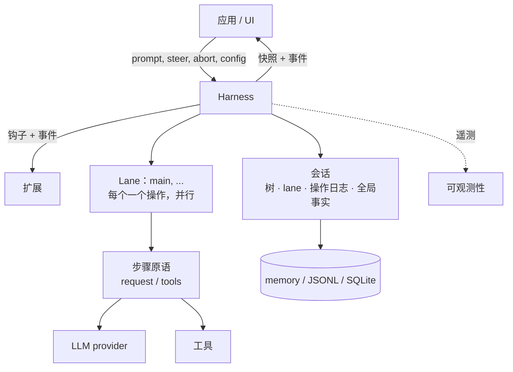
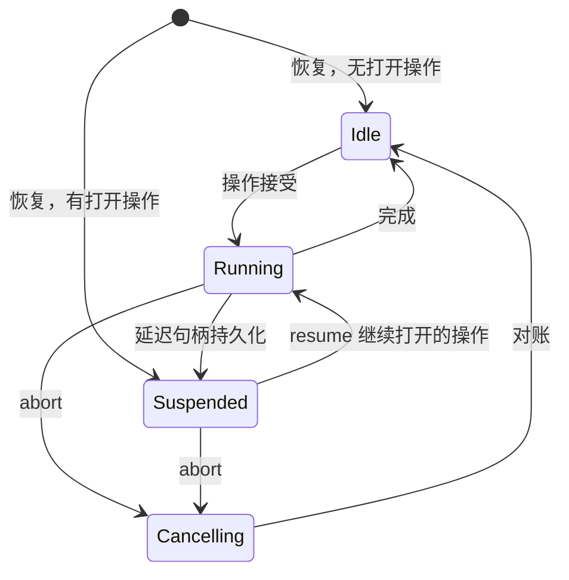

# Durable AgentHarness 设计

> 本文档是 Pi AgentHarness v2（`harness-v2` 分支 `j4/packages/agent/docs/harness-v2.md`）的完整中文翻译。原文约 3446 行，涵盖 21 个章节。

> **兼容性策略。** 旧的 coding-agent v3 JSONL 会话必须打开并恢复为空闲。这是唯一的向后兼容要求。`packages/agent/src/harness` 和 `packages/session-backends/sqlite-node`（及其各自的测试）中的所有其他格式和 API 可能破坏。我们不为其编写迁移、schema 版本控制或转换路径。



Harness 针对一个会话执行运行。会话保存四种状态（第 2 节）。Lane 在一个 harness 内并行执行（第 3 节）。存储后端编码会话（第三部分）。

# 第一部分 — 概念

## 1. 目标

- **持久运行。** 被接受的 prompt 是一个持久操作。崩溃后，新进程恢复会话。它从最后一个安全边界恢复运行。崩溃可以产生的每个状态都是可恢复的。
- **Lane。** 一个会话承载一个或多个 Lane。Lane 是会话树中的命名位置。每个 Lane 同时至多运行一个操作。Lane 并行运行。一个运行及其排队的消息属于接受它们的 Lane。示例：Slack 频道是一个会话；每个线程是一个 Lane。交互式 pi 使用一个 Lane 且不在其 UI 中显示该概念。扩展获得完整的 harness API，包括 Lane。示例：子 Agent 工具在其父会话的第二个 Lane 上运行。
- **无部分结果。** 任何操作内部 — 运行、压缩、导航 — 的崩溃留下两种状态之一：操作尚未发生，或恢复可以完成它。中间没有可观察的东西。
- **Harness API。** 事件观察执行且不能改变它。钩子拦截执行且可以改变它：上下文、请求、工具、运行边界。扩展构建在事件和钩子之上。
- **确定性步进。** 每个副作用 — 持久写入、provider 请求、工具执行、钩子、计时器 — 跨越一个注入的边界。在 `drive: "manual"` 中，harness 在每个副作用之前停靠，测试逐个调用驱动它：在任何边界停止、注入输入，或关闭并重新打开以模拟崩溃。生产和测试运行相同的过程；驱动模式只控制边界（第 15 节）。
- **可观测性。** 所有执行都可以插装用于日志和追踪，直到 provider 请求和响应内部。此通道与钩子系统分离。
- **UI 模型。** 客户端获得一个原子快照，然后是实时事件流。事件不重放。重新连接意味着新快照。
- **单一写者。** 一个 harness 一次写一个会话。服务层强制执行这一点。会话的所有 Lane 都在该 harness 中。恢复将单写者无法产生的状态视为损坏。
- **v3 会话可加载。** 旧的 coding-agent v3 JSONL 文件不变打开并恢复为空闲。

## 非目标

- **恰好一次的钩子副作用。** 钩子结果在消费它的记录或条目提交时变为持久。在该提交之前的崩溃可以再次运行钩子（第 11 节重放表）。钩子自己做的副作用对 harness 不可见：HTTP 调用、文件写入。需要崩溃安全外部副作用的钩子必须幂等，例如以操作 id 为键。
- **Provider 流恢复。** 部分流从不持久化。被中断的流式请求被重试或放弃。延迟请求不同且在范围内：provider 立即返回句柄并稍后提供结果（例如 Responses API 上的 `background: true`、批处理 API）。pi-ai 返回带停止原因 `deferred` 的助手消息，携带句柄；它像任何助手消息一样持久化。兑换句柄追加一条正常的助手消息。恢复看到未兑换的句柄并获取而不是为新请求付费。
- **多写者。** 一个会话上的两个进程超出范围。服务层将会话的所有流量路由到持有其 harness 的进程。Lane 覆盖看起来像多写者的工作负载：共享历史之上的并行线程。
- **复制。** 会话只存在于一处。分歧副本的无协调同步是不同的设计。没有什么排除它以后发生。
- **Coding-agent 迁移。** 将 coding-agent 迁移到 `AgentHarness` 超出范围。兼容性意味着新的 JSONL 仓库可以读取支持的 coding-agent v3 文件。

## 2. 会话是什么

会话是具有四个部分的持久状态：

1. **树** — 会话。带 `parentId` 链接的条目：消息、模型/思考/工具激活变更、压缩摘要、分支摘要、自定义条目。树是共享和被动的。它不属于任何 Lane。它只增长；条目从不被更改或删除。
2. **Lane** — 工作发生的地方。Lane 是一个名字加一个叶子：未来工作扩展的条目。每个会话都有 `main` Lane。应用创建更多，以外部身份为键（Slack 线程 id、邮件线程 id）。
3. **Lane 操作日志** — 发生了什么和必须发生什么。每个 Lane 一条扁平的、按时间顺序的记录序列：操作开始、步骤尝试、工具开始、消息排队、操作完成。这是持久性实现的地方：记录的存在使新进程可以在崩溃后继续 Lane 的工作。正常执行期间没有任何东西读取它们。
4. **全局事实** — 最新写入获胜的会话范围值：会话名称、条目标签。不是树的一部分。保持为追加式历史；读者看到最新的值。

四个部分的所有写入共享一个单调序列号。序列排序全局事实历史，并让 Lane 的操作日志引用树位置。

```text
tree (shared, append-only)          lanes
a ── b ── c ── d                    main            → d   (op log: …)
      └── e ── f                    slack:171943…   → f   (op log: …)

global facts: name = "Refactor auth", label(b) = "checkpoint-1"
```

### 活跃和被动

树和全局事实是被动的：共享数据，任何东西可读。

Lane 是活跃的。它拥有其叶子、其操作日志（至多一个打开的操作）、其队列和其待处理写入。两个 Lane 从不共享这些中的任何一个。Lane 的每个动作产生链接到其叶子的条目，或其自己操作日志中的记录。

### 不变量

- 树只是会话。没有 Lane 状态、编排状态或指针存在于其中。
- 条目的父链从不改变。分支共享前缀；没有东西被复制。
- Lane 的叶子以恰好两种方式移动：Lane 追加条目（叶子变成该条目），或 Lane 导航（叶子跳到现有条目）。
- 操作日志记录从不影响树。删除每个操作日志留下一个完整、有效的会话。
- 每个 Lane 至多一个操作打开。一个 Lane 有两个打开操作的状态是损坏。
- 条目是共享的；记录不是。两个 Lane 可能在其路径上有相同条目。一个记录恰好属于一个 Lane。

记录不是树条目，因为它们描述执行，不是会话：它们必须从不进入模型上下文、transcript、分支查询或 Fork，且在一个 Lane 内它们的顺序已经是它们的意义 — 父链接不会增加任何东西。

## 3. Lane

Lane 是树中的命名位置加上在其上序列化的工作。最接近的现有概念是在自己的 worktree 中检出的 git 分支：附加到位置的名称，由新工作推进，可以移动到任何条目而不重写历史，且从不检出两次。与 git 直觉的一个区别：导航将 Lane 移动到任何条目，不只是向前。

每个会话都有 `main` Lane。应用以名称和锚点条目创建更多 Lane。Lane 名称是永久的应用键：Slack 线程 id、邮件线程 id。没有 UI 抽象地列出 Lane；平台自己的 UI（线程列表）扮演该角色。

Lane 拥有：

- **其叶子。** 新条目链接到它并移动它。导航跳跃它。
- **其操作日志。** 至多一个打开的操作。繁忙 Lane 上的第二个操作被拒绝；其他 Lane 不受影响。
- **其队列。** Steering、follow-up 和 next-run 消息以一个 Lane 为目标。
- **其配置视图。** 模型、思考级别和活跃工具是 Lane 叶子后面路径上的条目。两个 Lane 可以运行不同模型而互不知晓。工具实现、资源和流选项是 harness 全局的；只有它们的激活是每 Lane 的。

规则：

- Lane 并行运行操作。Harness 保持单一写者；Lane 记录和条目在共享序列中交错。
- 创建 Lane 不复制任何东西。Lane 从不删除或重命名。
- 一个 Lane 上依赖状态的变更在该 Lane 的变更线上线性化：验证、至多一个持久写入，以及内存中更新在下一个变更开始之前完成（第 15 节）。Provider、工具、钩子和重试工作从不占用变更线。
- 同一叶子上的两个 Lane 在其下一次追加时分叉。树处理这个；Lane 之间不存在协调。
- 有未完成操作的 Lane 独立于其兄弟恢复为挂起。挂起有原因：崩溃，或延迟的 provider 请求（第 1 节）。

## 4. 工作如何执行

### 操作

操作是 Lane 上持久工作的单元。三种：

- **Run** — 被接受的 prompt，经过所有自动 continuation：工具调用、steering、follow-up、自动压缩。当没有待处理时结束。
- **Compaction** — 用摘要条目替换旧上下文。
- **Navigation** — 将 Lane 的叶子移动到现有条目，可选地带分支摘要。

操作在执行之前被接受。接受是持久的：崩溃后，被接受的操作要么由恢复完成，要么显式关闭。每个被接受的运行以 `completed`、`failed` 或 `aborted`（被中止停止）结束。压缩和导航还可以在决策钩子在其副作用之前否决被接受的结构操作时以 `declined` 结束。

### 运行、回合和步骤

运行是回合的序列。回合是一个助手步骤加该助手消息请求的完整工具批次。

步骤是操作内可重试的工作单元：产生助手消息、压缩摘要或分支摘要。步骤可以发出零个、一个或几个 provider 请求。失败的尝试重试同一步骤；尝试计数是持久的且在重启后存活。延迟的 provider 请求结束助手步骤：句柄在关闭步骤的持久化助手消息内到达，操作挂起，兑换稍后追加真实结果（第 1 节）。

每个开始副作用的工具调用也是一个步骤。`tool_started` 打开它；其工具结果条目关闭它。并行批次同时持有几个打开的工具步骤；它们的副作用并发运行并按源顺序终结（第 14 节）。

### 队列和延迟写入

两种机制将输入带入运行中的 Lane。它们在中止行为上不同：

- **队列**携带会话意图：`steer` 纠正当前工作，`followUp` 在模型将停止时添加工作，`nextRun` 播种 Lane 的下一次运行。Steering 和 follow-up 在中止时死亡；其载荷返回给调用者。Next-run 消息存活。
- **延迟写入**携带事实：在步骤飞行中请求的条目和配置变更。它们在中止中存活，甚至在取消期间应用。

两者在接受时持久：接受的调用将带完整载荷的记录写入 Lane 的操作日志，然后解析。树条目稍后写入，在该项被应用或消费时 — 模型第一次看到它的位置。如果进程在接受和树写入之间死亡，恢复读取记录并执行追加。被接受的输入从不丢失。

### 检查点

回合之间，Lane 通过一个检查点：

1. 应用待处理的延迟写入。
2. 消费排队的 steering 消息。
3. 如果下一个请求不适合，压缩。

压缩还有一个反应性触发器：揭示请求不适合的 provider 响应 — 溢出形式的错误，或低于预期输出上限的 `length` 停止。该响应被丢弃，运行压缩并重试一次（第 6 节，"助手步骤的上下文溢出"）。

带工具调用的回合强制另一个回合使模型看到其结果 — 有一个例外：每个终结的工具结果都持久化 `terminate: true` 的批次抑制自动工具 continuation（steering 或 follow-up 输入仍可以开始另一个回合）。Follow-up 消息只在工具 continuation 和 steering 耗尽时消耗。当检查点发现没有待处理时运行结束。

### 追加式上下文

> 在一个 Lane 的请求之间，provider 上下文只在尾部增长。在先前请求尾部之前的插入会使 provider 的 KV 缓存从该点起失效并倍增 token 成本。

这个不变量是回合中写入延迟到检查点的原因：检查点应用在尾部追加。压缩是唯一刻意的例外；它用一次完整的缓存失效交换更小的上下文。

### Lane 生命周期



- 状态是每 Lane 的。一个例外：失败的存储写入使整个 harness 故障。故障的 harness 停止所有副作用并拒绝所有调用；原因修复后，重新打开从其记录恢复每个 Lane。
- **挂起**意味着：操作打开，没有东西执行。崩溃后恢复到达，或在延迟句柄持久化时刻意到达。`resume()` 继续操作；`abort()` 关闭它而不进一步执行。
- **中止**持久记录取消、信号运行中的副作用并返回。对账跟随：未解析的工具调用得到合成结果，transcript 得到关闭的助手消息。自动驱动在后台运行它；手动驱动将其停靠在下一个动作。

### 恢复

恢复继续打开的操作。它从不开始新的。入口点是记录结束的地方：重试未完成的步骤、兑换延迟句柄、对账半完成的工具批次，或在下一个检查点继续。崩溃前接受的排队消息和延迟写入仍待处理并正常应用。

# 第二部分 — 执行如何记录

第二部分是后端中立的。它定义 Lane 写入的记录、何时写入，以及恢复如何读回。第三部分将其映射到 API 和存储。

## 5. 记录

### 持久性规则

> 副作用之前：写一条命名将发生什么及其将产生的 id 的意图记录。副作用之后：以恰好那些 id 将结果追加为条目。

没有多记录原子性，也不需要。每条记录和每个条目单独持久。意图和结果之间的崩溃留下未满足的意图；恢复按意图类型决定：完成它、重试它，或用合成结果关闭它。意图当且仅当带其 provisioned id 的条目存在时被满足。条目本身可以命名下一个持久状态：带 `stopReason: "deferred"` 的助手条目满足其尝试的 provisioned 追加并关闭步骤；仍然未决的是操作 — 持久化的句柄等待兑换（第 6 节）。存在但内容不同的 provisioned id 是损坏。

### Provisioned id

意图记录携带尚不存在的条目的 id：

```ts
/** 带预分配 id 的条目载荷。parentId、seq 和 timestamp
    由存储在条目追加时分配：它链接到 Lane 当时的叶子。 */
type ProvisionedEntry<T extends Entry = Entry> =
  T extends Entry ? Omit<T, "parentId" | "seq" | "timestamp"> : never;
```

### 记录目录

每条记录属于一个 Lane 的操作日志。属于操作的记录携带 `runId`：该操作的 `operation_started` 记录的 id。Next-run 队列记录（`queue_enqueued` 及其 `queue_cancelled`）和独立的 `adjustment` 用量记录不携带 `runId`。

```ts
interface RecordBase {
  id: string;
  seq: number;            // 共享序列，第 2 节
  lane: string;
  timestamp: number;      // Unix 毫秒
}

// 操作的接受边界。接受前决定的一切在此持久化。此记录自己的 id
// 就是该操作所有其他记录携带的 runId。
interface OperationStartedRecord extends RecordBase {
  type: "operation_started";
  sourceLeafId: string | null;        // 接受时 Lane 的叶子
  intent:
    | {
        kind: "run";
        /** 技能/模板展开后、before_run 之前的规范化调用者输入。
            为 SuspendedOperation 和 before_resume 保留。 */
        originalPrompt: AgentMessage[];
        /** 捕获的 nextRun 项，然后 prompt，然后 before_run
            注入。完整载荷，provisioned id。捕获发生在
            接受变更中 (第 15 节)：它运行时存在的项
            属于此运行；后来的项属于下一个。 */
        initialMessages: ProvisionedEntry[];
        /** 仅当钩子覆盖了 system prompt 时存在；整个运行固定。
            缺失：systemPrompt 回调按请求运行。 */
        systemPromptOverride?: string;
        /** 以稳定钩子注册 id 为键的不透明状态。每个
            before_resume 处理器只接收其 id 下的值。 */
        resumeData?: Record<string, JsonValue>;
      }
    | {
        kind: "compaction";
        customInstructions?: string;
        resultEntryId: string;          // provisioned 压缩条目
      }
    | {
        kind: "navigation";
        targetId: string | null;        // 目标条目；null = 根
        summarize: boolean;
        customInstructions?: string;
        label?: string;                 // 全局事实，完成时写入
        summaryEntryId?: string;        // provisioned 分支摘要条目
      };
}

// abort() 解析时写入。请求标记，不是终态：
// 对账跟随，然后 operation_finished 带结果 "aborted"。
// 杀死此操作的 steer/follow-up 队列项；next-run 项存活。
interface AbortRequestedRecord extends RecordBase {
  type: "abort_requested";
  runId: string;
}

// 关闭操作。failed = 有序持久失败（例如重试耗尽）。
// aborted = 被中止关闭。declined = 在任何副作用之前被钩子否决。
interface OperationFinishedRecord extends RecordBase {
  type: "operation_finished";
  runId: string;
  outcome: "completed" | "aborted" | "failed" | "declined";
  error?: { code: string; message: string };
}

// 每次可重试步骤的尝试之前写入。标记：我们要做这个，
// 第 n 次。步骤被记录因为它们是可重试的：持久计数
// 限制跨重启的重试 — 崩溃重启循环不能重置它。
// 每次尝试一条记录；一次尝试可以发出零个或几个 provider 请求
//（拆分回合压缩发出两个）。延迟结果不需要额外
// 记录：句柄保存在持久化的助手条目中（第 1 节）。
interface StepAttemptRecord extends RecordBase {
  type: "step_attempt";
  runId: string;
  step: "assistant" | "compaction" | "branch_summary";
  attempt: number;                     // 此步骤内的 1 基
  /** 此尝试成功时产生的条目。助手尝试每次提供新 id；
      一个结构步骤的所有尝试重用一个 id（手动：意图的；
      自动：第一次尝试的）。放弃的错误条目满足
      最后一次尝试的 id。 */
  resultEntryId: string;
  /** 恰好对压缩步骤必需。持久化为什么生成摘要，
      使恢复重新进入相同的结构工作而不重新派生上下文压力。 */
  compactionReason?: "manual" | "threshold" | "overflow";
}
// 恢复的请求的模型不从记录读取：Lane 的有效模型
// 从其路径派生，延迟句柄的模型
// 在持久化的助手条目中。

// before_tool 和验证通过后、工具执行之前写入。
// assistantEntryId + toolIndex 是持久调用身份。
interface ToolStartedRecord extends RecordBase {
  type: "tool_started";
  runId: string;
  assistantEntryId: string;
  toolIndex: number;
  toolCallId: string;
  toolName: string;
  effectiveArgs: Record<string, unknown>;   // before_tool 之后
  resultEntryId: string;                    // provisioned
  /** 执行时快照的工具声明的重放安全性。
      恢复只在此字段和当前工具声明都说 "safe" 时
      重新执行未完成的调用；否则写入合成 "interrupted" 结果。 */
  replay: "never" | "safe";
}

// 队列接受。载荷在此传输；条目出现在
// 消耗点。
interface QueueEnqueuedRecord extends RecordBase {
  type: "queue_enqueued";
  queue: "steer" | "followUp" | "nextRun";
  runId?: string;                      // nextRun 缺失
  target: ProvisionedEntry;
}

// 消费前对待处理队列项的持久撤回。没有
// 此记录崩溃会复活该项：恢复将没有其条目的
// queue_enqueued 视为待处理。
interface QueueCancelledRecord extends RecordBase {
  type: "queue_cancelled";
  runId?: string;                      // 匹配它杀死的 queue_enqueued
  entryId: string;                     // 排队目标的 provisioned id
}

// 延迟写入接受：步骤飞行中请求的条目或配置变更。
// 在下一个检查点应用。
interface WriteDeferredRecord extends RecordBase {
  type: "write_deferred";
  runId: string;
  target: ProvisionedEntry;
}

// 成本台账。无论用量报告还是调整时写入，
// 不管响应发生什么。纯会计：归约、
// 恢复和有效性检查从不读取它，所以它不增加恢复
// 状态和崩溃矩阵行。它记录报告的用量；传输
// 流中途死亡可以计费没有人报告的 token，结算和此写入之间的
// 崩溃丢失那一项 — 不可消除的窗口。
type UsageRecord = RecordBase & { type: "usage"; usage: Usage } & (
  // provider 请求已结算，不管结果。在任何分类、重试决策或
  // 丢弃之前写入。拆分回合压缩
  // 写两条记录共享一次尝试。报告无用量的 pending 延迟 fetch
  // 不写记录。
  | { cause: "assistant" | "compaction" | "branch_summary" | "deferred_fetch";
      runId: string; entryId: string; attempt: number; stopReason: TerminalStopReason }
  // 终结的工具结果报告嵌套 LLM 工作；不报告时跳过。
  // 安全重放为第二次执行写第二条记录：两者都被计费。
  | { cause: "tool"; runId: string; entryId: string; toolCallId: string }
  // 钩子提供的摘要携带钩子自己测量的用量。
  | { cause: "hook"; runId: string; entryId: string }
  // 应用提供的，任何时候（lane.recordUsage）：对账、
  // 估计、更正。负值合法。
  | { cause: "adjustment"; runId?: string; entryId?: string; details?: JsonValue }
);

type LaneRecord = OperationStartedRecord | AbortRequestedRecord | OperationFinishedRecord
  | StepAttemptRecord | ToolStartedRecord | QueueEnqueuedRecord | QueueCancelledRecord
  | WriteDeferredRecord | UsageRecord;

type NewRecord<T extends LaneRecord = LaneRecord> =
  T extends LaneRecord ? Omit<T, "seq" | "timestamp"> : never;
```

被阻止或无效的工具调用不写 `tool_started`。没有副作用开始，所以不需要意图：阻止作为带 `isError: true` 和阻止原因作为内容的工具结果条目持久。该条目之前的崩溃只丢失决策，恢复再次做出 — 对没有 `tool_started` 且没有结果的调用 `before_tool` 再次运行。

工具步骤不需要结果记录。其结果条目是完整的持久结果，包括批次控制决策：工具结果条目持久化 `terminate`（第 12 节）。执行后但结果条目之前的崩溃遵循重放策略（第 6 节）；重新终结再次运行 `after_tool`，第 1 节非目标显式允许。

成本是存在结果记录的一个关注点：**成本持久性不得依赖结果持久性**。可重试步骤恰恰是被设计为产生从不成为条目的响应的步骤 — 失败尝试、耗尽序列、被丢弃的溢出响应 — 它们的花费不能随它们消失。每个 provider 请求因此在任何分类、重试决策或丢弃之前以 `usage` 记录结算；工具报告和钩子报告的用量在其条目旁边获得记录；应用为 harness 看不到的任何东西追加 `adjustment` 记录。

Harness 写的 `usage` 记录总是将其 `entryId` 绑定到其测量所属条目的 provisioned id；该条目是否存在是单独的问题 — 失败尝试或被丢弃响应的 id 从不物化，这正是重点。三层干净分离：条目的 `usage` 字段是产生该条目的响应的**不可变快照**，追加时写入一次且不再触碰；**条目的有效成本**是读取时查询 — 绑定到其 id 的所有 Lane 的 `usage` 记录的总和，基础加调整；**会话的成本**是所有 `usage` 记录的总和。恢复可以诚实地计费两次 — 重试的步骤或重放的工具每次执行写一条记录 — 且条目快照等于其 id 的最新非调整记录（对压缩和分支摘要：成功尝试的）。

### 有效性

恢复在以下情况拒绝 Lane 的日志为损坏：

- 超过一个操作打开；
- 记录引用不存在的操作，或跟随其完成；
- 尝试编号在一个步骤内不连续；
- `compactionReason` 在压缩尝试中缺失或出现在其他步骤类型上；
- 运行的 steer 或 follow-up `queue_enqueued` 跟随其 `abort_requested`；
- `queue_cancelled` 以没有 `queue_enqueued` 的 id 或其条目已存在的 id 为目标；
- 一个结构步骤中的尝试在 `resultEntryId` 上不一致，或一个步骤的任何尝试在 `compactionReason` 上不一致；
- `tool_started.toolIndex` 未识别其原始助手条目中存储的 `toolCallId` 和 `toolName`；
- 两条 `tool_started` 记录共享一个调用身份；
- provisioned id 以不同内容存在。

## 6. 每个动作写什么

存储级别的追踪。所有追踪显示一个 Lane。图例：

```text
E   追加到树的条目（链接到 Lane 的叶子）
R   追加到 Lane 操作日志的记录
L   Lane 指针移动
G   全局事实写入
H   钩子（被等待；钩子是第一部分概念，其 API 在第三部分）
X   崩溃点
```

### 带一个工具调用的运行

```text
    prompt("修复 bug")
H   before_run                        可以注入条目、覆盖 system prompt
R   operation_started                 kind run；带 provisioned id 的初始消息
E   user message                      意图中 provisioned 的 id
R   step_attempt                      step assistant, attempt 1
E   assistant message [tool call]
H   before_tool                       可以更改参数或阻止
R   tool_started                      有效参数、provisioned 结果 id、重放
H   after_tool                        可以修补结果和终止
E   tool result                       provisioned 的结果 id；持久化 terminate 决策
R   step_attempt                      下一回合的助手步骤, attempt 1
E   assistant message "done"
H   before_run_end                    没有待处理，返回空
R   operation_finished                completed
```

任何两行之间的崩溃都是可恢复的。一般规则：没有其结果条目的意图由恢复完成、重试或以合成结果关闭；没有已消耗意图的结果条目不能存在。

### 重试

```text
R   step_attempt                      attempt 1
    请求失败
R   usage                             失败尝试的成本 — 从不丢失
R   step_attempt                      attempt 2 — 持久计数
R   usage
E   assistant message
```

每个 provider 请求以 `usage` 记录结算（第 5 节）；其他追踪为简洁省略它们。每请求钩子（`transform_context`、`before_request`、`after_response`）在每次请求内运行且到处省略；Tier B 记录它们（第 19 节）。

退避期间崩溃：恢复计数两次尝试；恢复从 attempt 3 开始。计数从不重置。上限以下可重试错误从不作为条目追加。尝试耗尽 — 或不可重试的终端错误 — 追加带错误的助手消息，然后 `operation_finished` failed：

```text
E   assistant message                 stop reason error；失败是持久的
X   crash                             操作仍然打开
R   operation_finished                恢复写入 failed — 从不 completed
```

错误条目是终端失败标记。发现它的恢复排空已接受的写入和排队输入；除非已消耗的 steering 或 follow-up 输入开始新工作，它以 failed 关闭运行（第 7 节）。最新自己消息是步骤产生的错误的运行永远不能被恢复完成。

### 助手步骤的上下文溢出

`length` 是歧义的：生成在某个输出边界停止，但该边界要么是预期的输出限制 — 压缩无帮助 — 要么是更小的上下文或 provider 限制，那里可以有帮助。分类将实际输出用量（包括推理 token）与**预期的**输出上限比较：

```ts
function isRecoverableLength(message: AssistantMessage, desiredMaxOutput: number): boolean {
  if (message.stopReason !== "length") return false;
  // 达到调用者或模型的预期上限是真正的输出限制停止。
  if (desiredMaxOutput > 0 && message.usage.output >= desiredMaxOutput) return false;
  // 低于预期上限停止：上下文压力或 provider 侧截断。
  return true;
}
```

`desiredMaxOutput` 是调用者提供的 `maxTokens`（设置时），否则 `model.maxTokens` — 在任何上下文截断**之前**的预期限制。实际发送的值永远不能作为参考：某些 provider 完全拒绝显式输出上限（OpenAI Codex 后端对 `max_output_tokens` 返回 HTTP 400），而 Pi 将其他限制截断到剩余上下文。这覆盖了上下文截断的请求返回 16 个推理 token 而意图是 128k（恢复）、小米/Qwen 风格的零输出 `length`（恢复）以及完全用尽的显式 1,024 上限（真正停止）— 没有上下文百分比启发式。溢出形式的错误 — 匹配溢出模式的 provider 拒绝，或 prompt 超过窗口的静默成功 — 以相同方式分类并走相同路径。

可恢复的响应被**丢弃**：像可重试错误一样，它从不成为条目，所以重试时不需要从上下文中清除任何东西，无论是活跃还是崩溃后。其 provisioned 结果 id 保持未满足；其成本已经在请求结算时写入的 `usage` 记录中持久化（第 5 节）。

```text
R   step_attempt                      step assistant, attempt 1
    响应：可恢复                       低于预期上限的 length，或溢出形式错误
R   usage                             被丢弃响应的成本 — 从不丢失
    没有其他追加                       响应本身被丢弃
H   before_compaction                 reason overflow
R   step_attempt                      step compaction, attempt 1
E   compaction entry
R   step_attempt                      step assistant, attempt 1 — 新步骤
E   assistant message
```

**每次会话输入一次恢复。** 溢出压缩只有在没有溢出原因的压缩 `step_attempt` 比此运行最新的已消耗会话消息（prompt、steering 或 follow-up）更新时才可能开始。该窗口内的第二次可恢复响应追加放弃错误条目并通过排空路径失败运行 — `length` 响应从不重置守卫；只有已消耗的会话输入会重置。这将压缩并重试循环限制在每次用户操作一次尝试。原因 `overflow` 的 `before_compaction` 拒绝或空压缩准备同样是终端的：没有压缩请求就无法容纳。钩子提供的溢出压缩在条目之前写入其压缩 `step_attempt` 使守卫计算它 — 这是写入尝试记录的唯一钩子提供的摘要。

每个崩溃点：

| 崩溃之后 | 持久状态 | 恢复 |
|---|---|---|
| `step_attempt`（assistant） | 未完成的助手步骤 | 恢复重试；可恢复的响应再次活跃分类 |
| `step_attempt`（compaction, overflow） | 未完成的压缩步骤 | 以记录的原因恢复压缩步骤 |
| 压缩条目 | 步骤被其条目关闭 | 检查点路径；新的助手步骤跟随 |

真正的 `length` 停止 — 输出达到预期上限 — 被追加并像之前一样处理：带工具调用时，截断的批次在不执行的情况下使每个调用失败；不带时，运行继续其正常完成。任何截断响应用户可见的措辞保持中性（"响应在完成前被截断"）而不是声称达到了配置的输出限制。

### 工具运行时的 steering

```text
E   assistant message [tool call]
R   tool_started
    steer("专注于测试")                调用者在此解析
R   queue_enqueued                    steer，完整载荷，provisioned id
E   tool result
E   user message                      检查点消耗队列项；provisioned id
R   step_attempt                      下一个请求看到 steering 消息
```

`queue_enqueued` 之前崩溃：steer 从未发生；调用者的 promise 从未解析。之后崩溃：恢复发现没有其条目的记录并在检查点本会追加的同一点追加它。

排队的项可以在消耗前被持久撤回：

```text
R   queue_enqueued                    steer，完整载荷，provisioned id
    cancelQueued(entryId)             调用者在此解析
R   queue_cancelled                   条目将从不被追加
```

两条记录之间崩溃：项仍待处理；取消 promise 从未解析。取消和消耗是 Lane 变更线上的作业，所以 `[cancel, consume]` 和 `[consume, cancel]` 是唯一的历史（第 15 节）。

### 完成边界的输入

同 Lane 决策有一个顺序：Lane 变更线（第 15 节）。最终待处理工作检查和终端追加是一个 `tryFinishRun` 变更，所以并发 steer 恰好有两种历史：

```text
steer 优先                           finish 优先
R   queue_enqueued                  R   operation_finished
    tryFinishRun → continue             steer() → NoActiveRun
E   user message
... 运行继续
R   operation_finished
```

延迟写入和中止使用相同排序。完成前接受的延迟写入必须在运行可以关闭之前应用；完成后接受的延迟写入观察空闲 Lane 并直接追加。完成前的 `abort_requested` 选择中止对账；完成后的中止返回 `NoActiveOperation`。没有第三种历史 — 这就是整个机制。

### 回合中途的延迟写入

```text
R   step_attempt                      请求飞行中，上下文结束在用户消息 U
    session.appendMessage(M)          调用者在此解析
R   write_deferred                    完整载荷，provisioned id
E   assistant message A               provider 缓存了 [.., U, A]
E   message M                         检查点应用写入；尾部追加
```

直接追加 M 会产生 [.., U, M, A]：一个有效的 provider 序列，使 KV 缓存从 M 起失效，以及一个声称 A 看到 M（实际没有）的 transcript。检查点阻止两者（追加式上下文，第 4 节）。

### 工具执行期间的中止

```text
E   assistant message [tool call]
R   tool_started
    abort()                           调用者在此解析
R   abort_requested                   steer/follow-up 队列死亡；载荷返回
E   tool result                       合成 "interrupted"，或完成时的真实结果
E   assistant message                 关闭消息，stop reason aborted
R   operation_finished                aborted
```

`abort_requested` 之后崩溃：恢复完成相同的对账。待处理的延迟写入即使在这里也应用；排队的 steer/follow-up 项不。

### 工具执行崩溃点

```text
E   assistant message, calls c1, c2
X1  before before_tool                c1 没有持久的东西
H   before_tool(c1)
X2  决策已做，没有写入                  与 X1 相同
R   tool_started(c1)
X3  工具执行中
H   after_tool(c1)
X4  钩子被中断                          与 X3 相同的持久状态
E   tool result c1
X5  结果持久                            c1 完成
```

| 崩溃点 | 持久状态 | 恢复 |
|---|---|---|
| X1, X2 | 无记录，无结果 | 完整正常路径；`before_tool`（再次）运行 |
| X3, X4 | `tool_started`，无结果 | 重放安全（记录和当前声明）：重新执行持久化参数，对新结果运行 `after_tool`。否则：合成 "interrupted" 结果，无钩子 |
| X5 | 结果条目存在 | 跳过 c1；c2 在 X1 |

对账按源顺序在各自的崩溃点处理批次的每个调用。步骤然后正常结束。

### 检查点处的自动压缩

```text
E   tool result                       步骤结束
    检查点：下一个请求不适合
H   before_compaction                 可以拒绝或提供摘要
R   step_attempt                      step compaction — 钩子提供时跳过
E   compaction entry
R   step_attempt                      step assistant；运行在压缩后的上下文上继续
```

自动压缩不写 `operation_started`；它属于运行。手动 `compact()` 是自己的操作：`operation_started`（kind compaction，provisioned 结果 id）→ 钩子 → 尝试 → 压缩条目 → `operation_finished`。

### 导航

```text
    navigateTree(target, { summarize: true, label: "before-refactor" })
R   operation_started                 kind navigation；目标、provisioned 摘要 id、标签
H   before_navigation                 可以拒绝或提供摘要
R   step_attempt                      step branch_summary — 钩子提供时跳过
    摘要文本生成                        仅在内存中
L   lane move → target                一个存储写入；提交点
E   branch summary entry              追加链接到 Lane 的叶子 — 现在是目标，
                                      所以摘要落在目标分支上
G   label                             来自意图；最新者胜，幂等
```

移动先提交；每个后续写入从持久状态链出。设计中任何地方都不存在多对象原子写入。接受拒绝 `target === sourceLeafId`，所以"移动是否已发生"总是可判定的：Lane 的叶子等于 `intent.targetId` 当且仅当移动已提交。每个崩溃点：

| 崩溃之后 | 恢复看到 | 动作 |
|---|---|---|
| `operation_started` | 叶子在 `sourceLeafId` | 重新运行钩子或摘要步骤，然后移动 |
| 摘要已生成 | 没有文本的持久内容 | 在相同的尝试上限下重新生成 |
| Lane 移动 | 叶子在 `intent.targetId` | 如果 `summaryEntryId` 缺失则追加摘要 |
| 摘要条目 | 条目存在 | 设置标签，完成 |
| 标签 | 事实已设置（幂等） | 完成 |

移动和 `operation_finished` 之间，读者看到 Lane 在目标处且有打开的导航 — 一个可恢复状态，不是无效状态。Lane 期间不运行任何其他东西；每 Lane 一个操作已经保证了这一点。

### 延迟 provider 请求

```text
R   step_attempt                      流选项请求延迟执行
E   assistant message                 stop reason deferred，携带句柄
    Lane 挂起；prompt() 以结果 "suspended" 解析
    ... 数小时过去，可能是不同的进程 ...
    resume()                          Lane 路径上最新的条目是延迟
                                      助手消息且无后继
                                      → 句柄未兑换，兑换它
    fetchDeferred(model, handle)      模型和句柄来自该条目
E   assistant message                 真实结果
    运行正常继续
```

挂起的 Lane 在存储中与崩溃的不可区分：一个打开的操作，其最新条目是无后继的延迟助手消息。恢复将其列为挂起；`resume()` 检查句柄。兑换不写意图记录：它不开始新的模型工作，且已提交的后继条目阻止另一次获取。

每次 `resume()` 执行一次获取。三种结果：

- **pending** — provider 再次返回停止原因 `deferred`。除了可能的 `usage` 记录外没有写入（第 15 节）；Lane 重新挂起。轮询节奏是应用策略。
- **ready** — 正常的助手消息。它作为后继追加，运行继续。
- **terminal** — provider 返回停止原因 `error`（过期、未知、已消费），或 fetch 本身拒绝；Harness 将拒绝转换为相同的错误消息形式。消息被追加，运行以 failed 完成。兑换失败从不开始自动替换请求；已为此运行接受的 steering 或 follow-up 输入仍可以开始以后的回合。

挂起 Lane 上的 `abort()`：`abort_requested` 记录、provider 处句柄的尽力取消，然后正常对账和 `operation_finished` aborted。延迟条目留在 transcript 中。

延迟助手消息携带句柄，不是内容；它们在 provider 上下文中投影为空。

## 7. 恢复

### 恢复（Restore）

打开会话独立恢复每个 Lane。恢复只读取；它从不追加且从不开始副作用。

恢复从索引发现开始，不是完整日志扫描：

1. `findOpenOperations(lane, { limit: 2 })` 以最新优先返回未完成的 `operation_started` 记录。零意味着空闲，一意味着挂起，二意味着损坏。后端必须从重放/索引的操作状态回答；调用者不能只从最新的开始推断。
2. 对空闲 Lane，一次索引查询找到最新的 run-kind `operation_started`，然后其上过滤的 `queue_enqueued` / `queue_cancelled` 查询重建待处理的 `nextRun` 项。没有先前运行时，相同类型过滤的查询只读运行前队列状态；无关的用量调整从不扫描。
3. 对挂起的 Lane，打开的操作选择两次有界载荷读取：
   - **该 Lane 的记录**，从那个 `operation_started` 开始。上一个操作完成之后的一切都是无关历史。
   - **该 Lane 自己的条目**：从其叶子回到操作的锚点（`sourceLeafId`）的路径。这些恰好是该操作追加的条目。

归约可以额外对 provisioned 条目 id 执行点查找，并在操作锚点处对有效模型、思考和活跃工具配置执行有界分支查找。这些是索引查找，不是额外的历史扫描。每个扫描以打开操作或仍相关的空闲队列为界，不以总会话历史或另一个 Lane 的活动为界。

空闲 Lane 的剩余状态是待处理的 next-run 队列项。Next-run 消息可以在任何时候入队；只有运行的接受消费它们 — 压缩和导航跳过队列。待处理项是 Lane 最近 run-kind `operation_started` 之后其 provisioned 条目不存在且没有被 `queue_cancelled` 撤回的 `queue_enqueued` 记录。运行捕获的项列在其意图的 `initialMessages` 中，所以捕获但未追加的项由该运行的恢复完成，从不提供给下一个运行。

### 归约

从那两次读取，Lane 的状态：

- **正在中止** — 存在 `abort_requested` 记录。
- **已用尝试** — 最新 `step_attempt`（当其 `resultEntryId` 没有条目时）是未完成的步骤；其 `attempt` 字段是持久计数，其 kind 和 `compactionReason` 选择恢复路径。关闭是点查找，不是邻接推断：步骤恰好在最新尝试的 provisioned 结果存在时关闭。较早尝试的未满足 id 属于已完成的工作，不需要检查。
- **溢出恢复已用** — 原因 `overflow` 的压缩 `step_attempt` 比此运行最新的已消耗会话消息更新（第 6 节，溢出守卫）。
- **工具批次** — 带工具调用的最新助手条目，每个调用对照 `tool_started` 记录和结果条目匹配（第 6 节，崩溃点表）。助手停止原因被保留：`length` 批次被截断且在恢复时从不执行。结果条目上持久化的 `terminate` 值决定已完成的批次是否强制另一个回合。
- **延迟句柄** — 最新自己的条目是无后继的延迟助手消息。
- **最新自己的条目** — 第二次读取的最后条目；纯谓词（`needsAssistant()`、终端失败、中止关闭）读取它。
- **待处理队列项** — provisioned 条目不存在的 `queue_enqueued` 记录，排除被 `queue_cancelled` 撤回的项和被此运行 `abort_requested` 杀死的 steer/follow-up 项。
- **待处理写入** — provisioned 条目不存在的 `write_deferred` 记录。
- **缺失初始消息** — 运行意图中没有条目的 provisioned id。
- **结构目标** — 对压缩和导航：provisioned 结果条目是否存在。

相同的规则活跃运行：正常执行期间 harness 在写入时更新内存中的状态；恢复从存储重新计算它。状态和记录不能不一致，因为状态被定义为它们的归约。`usage` 记录在这里不可见：它们是会计，从不是编排。

### 恢复（Resume）

`resume()` 从归约所说的继续打开的操作：

- 缺失初始消息 → 追加它们（被接受的输入从不丢失），即使正在中止。
- 正在中止 → 对账：合成工具结果、关闭的助手消息、`operation_finished` aborted。
- 未解析工具批次 → 每调用：跳过、重新执行，或合成（第 6 节）。
- 延迟句柄 → 兑换（第 6 节）。
- 终端失败 — 最新自己的消息是步骤产生的助手错误（放弃条目、不可重试的请求错误或失败的兑换；从不是任意的延迟写入消息）→ 应用已接受的写入并消耗排队的会话输入；如果没有消耗开始新工作，追加 `operation_finished` failed。恢复从不完成这样的运行。
- 未完成步骤 → 在消耗新检查点输入之前恢复那个确切的步骤：上限允许时下一次尝试，否则失败操作。压缩步骤以其记录的 `compactionReason` 恢复。
- 否则 → 在下一个检查点继续；待处理写入和队列项在那里正常应用。

恢复追加是普通追加，带一条额外规则：跳过任何已存在的 provisioned id。恢复期间的崩溃因此留下更少的待恢复内容；重新运行恢复总是安全的。恢复只在其策略允许时重复未知副作用：可重试步骤开始新的持久尝试，工具只在两个重放声明都说 `safe` 时重放。被中断的钩子处理器遵循第 11 节重放表。

旧的 v3 会话不包含记录。每个 Lane 问题回答"空闲"；第 12 节规范化在被丢弃的事实类条目通过其最近保留祖先解析后，在最终保留的逻辑条目处恢复 `main`。

# 第三部分 — API 与实现

## 8. 公共 API

### Lane 表面

`AgentLane` 是一个 Lane 的操作表面。`AgentHarness` 为 `main` 实现它：`harness.prompt(...)` 是 main 的 prompt。每个方法都是异步的，包括进程内实现从内存回答的 getter：接口必须可由远程代理实现，所以没有签名可以承诺只有本地实现能保持的同步性。同步例外：`name` 和监听器注册（`hooks.on`、`events.on`）— 服务器通过自己的传输桥接事件，不是注册。

```ts
interface AgentLane {
  readonly name: string;                 // harness 本身上为 "main"
  getLeafId(): Promise<string | null>;

  // 操作。从不抛出；每次调用以结果解析（见下文）。
  // 每 Lane 至多一个操作；其他 Lane 不受影响。
  prompt(text: string, images?: ImageContent[]): Promise<RunResult>;
  prompt(message: AgentMessage | AgentMessage[]): Promise<RunResult>;
  skill(name: string, additionalInstructions?: string): Promise<RunResult>;
  promptFromTemplate(name: string, args?: string[]): Promise<RunResult>;
  compact(options?: { customInstructions?: string }): Promise<CompactionResult>;
  navigateTree(targetId: string | null, options?: NavigateOptions): Promise<NavigationResult>;
  resume(): Promise<ResumeResult>;       // 继续此 Lane 的打开操作
  abort(): Promise<AbortResult>;         // 解析时持久；对账在后台运行

  // 队列。解析时持久（queue_enqueued 记录）；返回的
  // entryId 在消费之前标识该项。steer/followUp 需要
  // 活跃运行；nextRun 和 cancelQueued 任何时候可用。
  steer(text: string, images?: ImageContent[]): Promise<QueueResult>;
  steer(message: AgentMessage): Promise<QueueResult>;
  followUp(text: string, images?: ImageContent[]): Promise<QueueResult>;
  followUp(message: AgentMessage): Promise<QueueResult>;
  nextRun(text: string, images?: ImageContent[]): Promise<QueueResult>;
  nextRun(message: AgentMessage): Promise<QueueResult>;
  /** 持久撤回待处理队列项（queue_cancelled 记录）。 */
  cancelQueued(entryId: string): Promise<CancelQueuedResult>;
  /** 追加调整用量记录（第 5 节）：对账、估计、更正。
      任何时候允许；记录不是上下文。 */
  recordUsage(usage: Usage, options?: { entryId?: string; details?: JsonValue }):
    Promise<RecordUsageResult>;

  waitForIdle(): Promise<void>;
  runWhenIdle(callback: () => void | Promise<void>): Promise<void>;   // 仅运行时

  // 手动驱动控制。第 15 节定义其确切行为；它们
  // 只在 AgentHarnessOptions.drive === "manual" 时可用。
  peekAction(): Promise<ActionInfo | undefined>;
  executeAction(): Promise<ActionInfo | undefined>;
  runToCompletion(): Promise<void>;

  // 持久配置 — 此 Lane 叶子后面路径上的条目，
  // 通过点查询解析。设置器在持久接受时解析；
  // 运行打开时它们变为此 Lane 上的延迟写入。
  getModel(): Promise<Model>;                 setModel(model: Model): Promise<void>;
  getThinkingLevel(): Promise<ThinkingLevel>; setThinkingLevel(level: ThinkingLevel): Promise<void>;
  getActiveTools(): Promise<string[]>;        setActiveTools(names: string[]): Promise<void>;

  /** 此 Lane 对树的视图：读取默认为此 Lane 的叶子；
      运行打开时追加延迟，否则链接到叶子（第 12 节）。 */
  session: SessionTree;

  /** 范围化的：此 Lane 的 transcript、状态、队列和事件（第 9 节）。 */
  watch(): Promise<{ snapshot: LaneSnapshot; start: (listener) => void; unsubscribe: () => void }>;
}
```

所有 prompt 重载规范化为 `AgentMessage[]`。文本加图片变成一条用户消息；输入消息数组在验证后保持其顺序。技能和模板展开在规范化存储之前发生。这个规范化数组是 `OperationStartedRecord.intent.originalPrompt`；它排除捕获的 `nextRun` 项和钩子注入。

### Harness

```ts
class AgentHarness implements AgentLane {
  /** 打开会话、恢复每个 Lane、不开始副作用。
      每个有打开操作的 Lane 一个挂起条目。 */
  static create(options: AgentHarnessOptions): Promise<{
    harness: AgentHarness;
    suspended: SuspendedOperation[];
  }>;

  // Lane 管理。名称是永久的应用键
  //（"slack:1719432.0021"）。句柄是绑定到
  // 名称的无状态外观：任意数量可以存在，全部等价；身份是名称，
  // 从不是对象。Lane 不删除也不重命名。
  lane(name: string): Promise<AgentLane | undefined>;    // 查找，从不创建
  createLane(name: string, at: string | null): Promise<CreateLaneResult>;
  /** 清单。总是包含 "main"。 */
  lanes(): Promise<LaneInfo[]>;

  // Harness 全局配置：注册表和运行时能力。
  // 工具实现是代码，不能持久化；活跃集合
  //（名称）按 Lane 持久化。
  getTools(): Promise<AgentTool[]>;      setTools(tools: AgentTool[], activeNames?: string[]): Promise<void>;
  getResources(): Promise<Resources>;    setResources(r: Resources): Promise<void>;
  getStreamOptions(): Promise<StreamOptions>;  setStreamOptions(o: StreamOptions): Promise<void>;
  getRetryPolicy(): Promise<RetryPolicy>;      setRetryPolicy(p: RetryPolicy): Promise<void>;
  getCompactionSettings(): Promise<CompactionSettings>; setCompactionSettings(s): Promise<void>;
  getSteeringMode(): Promise<QueueMode>;       setSteeringMode(m): Promise<void>;
  getFollowUpMode(): Promise<QueueMode>;       setFollowUpMode(m): Promise<void>;

  watchSession(): Promise<{ snapshot: SessionSnapshot;
                            start: (listener) => void; unsubscribe: () => void }>;

  hooks: Hooks;
  events: Events;

  /** 干净分离 (§4.7)。打开的操作保持可恢复。 */
  close(): Promise<void>;
}

interface LaneInfo {
  name: string;
  leafId: string | null;
  operation: null | { id: string; kind: "run" | "compaction" | "navigation";
                      status: "running" | "suspended" | "aborting" };
}
```

### 选项

```ts
interface AgentHarnessOptions {
  // 身份和 provider
  session: Session;
  models: Models;                        // 所有请求的 provider 集合

  // 初始 Lane 配置 — 当 Lane 的路径没有持久化
  // 配置条目时使用；否则持久化配置获胜。
  model: Model;
  thinkingLevel?: ThinkingLevel;
  activeToolNames?: string[];

  // 运行时能力 — harness 全局，create() 时重建
  tools?: AgentTool[];
  toolContext?: TContext | (() => TContext | Promise<TContext>);
  systemPrompt?: string | ((ctx) => string | Promise<string>);   // 每请求评估
  resources?: Resources;                 // 技能、prompt 模板

  // 执行策略
  streamOptions?: StreamOptions;         // 传输、头部、超时、延迟
  retry?: RetryPolicy;                   // 步骤尝试上限；持久计数
  compaction?: CompactionSettings;
  steeringMode?: QueueMode;
  followUpMode?: QueueMode;
  /** 批次默认；声明 executionMode "sequential" 的被调用工具
      强制顺序，不管设置（第 14 节）。 */
  toolExecution?: "sequential" | "parallel";   // 默认 parallel
  /** automatic：操作方法驱动其过程到完成。
      manual：操作的副作用在门处停靠；peekAction() /
      executeAction() / runToCompletion() 驱动它们。确定性测试
      和调试器。第 15 节。 */
  drive?: "automatic" | "manual";       // 默认 automatic

  // 投影
  /** AgentMessage → provider 消息，每次请求之前。默认处理
      bash 执行、自定义消息、摘要；在接受时验证
      排队/提示消息转换为用户消息。 */
  toProviderMessages?: (messages: AgentMessage[]) => Message[] | Promise<Message[]>;
  /** 自定义条目 → 上下文消息，在上下文构建时。没有投影器的
      条目从不进入 provider 上下文。 */
  entryProjectors?: Record<string, EntryProjector>;

  // 遥测。默认上下文是 no-op。第 18 节。
  telemetryContext?: TelemetryContext;
}
```

### 结果和标记错误

公共 API 使用 `better-result` v3 模式的小型内嵌子集。`packages/agent` 不对 `better-result` 取运行时依赖。

子集只包含：

- 可序列化的 `Result.ok()` 和 `Result.err()` 值；
- `Result.isOk()` 和 `Result.isErr()` 守卫；
- 带字面 `_tag`、只读载荷、正常 `Error` 行为、`.toJSON()` 和类级 `.is()` 的 `TaggedError`；
- 穷举的 `matchError()`。

```ts
export type Result<T, E> =
  | { ok: true; value: T }
  | { ok: false; error: E };

export const Result = {
  ok<T>(value: T): Result<T, never> {
    return { ok: true, value };
  },
  err<E>(error: E): Result<never, E> {
    return { ok: false, error };
  },
  isOk<T, E>(result: Result<T, E>): result is { ok: true; value: T } {
    return result.ok;
  },
  isErr<T, E>(result: Result<T, E>): result is { ok: false; error: E } {
    return !result.ok;
  },
};

export interface TaggedErrorValue<Tag extends string> extends Error {
  readonly _tag: Tag;
  toJSON(): { _tag: Tag; message: string } & Record<string, unknown>;
}

export interface TaggedErrorFactory<Tag extends string> {
  new <Props extends { message: string }>(
    props: Props,
  ): TaggedErrorValue<Tag> & Readonly<Props>;
  is(value: unknown): value is TaggedErrorValue<Tag>;
}

export declare function TaggedError<Tag extends string>(tag: Tag): TaggedErrorFactory<Tag>;

export type ErrorMatchers<E extends TaggedErrorValue<string>, R> = {
  [Tag in E["_tag"]]: (error: Extract<E, { _tag: Tag }>) => R;
};

export declare function matchError<E extends TaggedErrorValue<string>, R>(
  error: E,
  matchers: ErrorMatchers<E, R>,
): R;
```

实现预期保持在约 80 行以内，不包括测试。它没有映射组合器、生成器组合、promise 包装器、重试辅助、集合辅助或 `Panic` 类。Promise 仍然是异步边界。`HarnessFault` 对缺陷使用原生抛出和 promise 拒绝。

每个预期拒绝是一个类。其 tag 是字符串字面量。其字段携带调用者需要的数据。使用下文展示的 v3 类形式；不要在属性类型后添加尾随 `()`：

```ts
class LaneBusy extends TaggedError("LaneBusy")<{
  lane: string;
  operationId: string;
  operationKind: "run" | "compaction" | "navigation";
  message: string;
}> {}

class MissingIdentities extends TaggedError("MissingIdentities")<{
  lane: string;
  tools: string[];
  models: string[];
  message: string;
}> {}
```

其余类使用相同基础：

| 类 | 除 `message` 外的载荷 |
|---|---|
| `NoActiveRun` | `lane` |
| `NoActiveOperation` | `lane` |
| `NothingToResume` | `lane` |
| `InvalidMessage` | `lane`、`reason` |
| `UnknownSkill` | `name` |
| `UnknownTemplate` | `name` |
| `UnknownTarget` | `targetId` |
| `UnknownQueueItem` | `lane`、`entryId` |
| `LaneExists` | `lane` |
| `InvalidLane` | `lane`、`reason` |
| `NothingToCompact` | `lane` |
| `Closed` | 无 |

传输层将错误序列化为 `{ _tag, message, ...payload }` 并在代理边界重建类。添加一个拒绝类会更改相应的错误联合。穷举的 `matchError` 调用在调用者处理新 tag 之前无法通过类型检查。

`Err` 意味着调用没有创建或接受请求的工作。Harness 保持打开和可写时，每个已接受的操作以 `Ok` 解析，包括 `aborted`、`failed` 和 `suspended`：

```ts
interface OperationError {
  code: string;
  message: string;
}

type RunOutcome =
  | { kind: "completed"; leafId: string; finalEntryId: string; finalMessage: AssistantMessage }
  | { kind: "aborted";   leafId: string; finalEntryId: string; finalMessage: AssistantMessage }
  | { kind: "failed";    leafId: string; error: OperationError;
                          finalEntryId?: string; finalMessage?: AssistantMessage }
  | { kind: "suspended"; leafId: string; finalEntryId: string; deferred: DeferredHandle };

type CompactionOutcome =
  | { kind: "completed"; leafId: string; entry: CompactionEntry }
  | { kind: "declined";  leafId: string }
  | { kind: "aborted";   leafId: string }
  | { kind: "failed";    leafId: string; error: OperationError };

type NavigationOutcome =
  | { kind: "completed"; newLeafId: string | null; summaryEntry?: BranchSummaryEntry }
  | { kind: "declined";  leafId: string | null }
  | { kind: "aborted";   leafId: string | null }
  | { kind: "failed";    leafId: string | null; error: OperationError };

type RunRejected = LaneBusy | InvalidMessage | UnknownSkill | UnknownTemplate | Closed;
type CompactionRejected = LaneBusy | NothingToCompact | Closed;
type NavigationRejected = LaneBusy | UnknownTarget | Closed;
type ResumeRejected = LaneBusy | NothingToResume | MissingIdentities | Closed;
type QueueRejected = NoActiveRun | InvalidMessage | Closed;
type CancelQueuedRejected = UnknownQueueItem | Closed;
type AbortRejected = NoActiveOperation | Closed;

type RunResult = Result<{ runId: string } & RunOutcome, RunRejected>;
type CompactionResult = Result<{ runId: string } & CompactionOutcome, CompactionRejected>;
type NavigationResult = Result<{ runId: string } & NavigationOutcome, NavigationRejected>;
type QueueResult = Result<{ entryId: string }, QueueRejected>;
type CancelQueuedResult = Result<{
  outcome: "cancelled" | "already_consumed" | "already_cleared";
}, CancelQueuedRejected>;
type RecordUsageResult = Result<void, Closed>;
type AbortResult = Result<{
  runId: string;
  steer: AgentMessage[];
  followUp: AgentMessage[];
}, AbortRejected>;

type ResumeOutcome =
  | ({ operation: "run"; runId: string } & RunOutcome)
  | ({ operation: "compaction"; runId: string } & CompactionOutcome)
  | ({ operation: "navigation"; runId: string } & NavigationOutcome);

type ResumeResult = Result<ResumeOutcome, ResumeRejected>;

type CreateLaneResult = Result<AgentLane, LaneExists | InvalidLane | UnknownTarget | Closed>;
```

`cancelQueued` 的结果镜像变更线历史：`cancelled` 意味着条目将从不被追加；`already_consumed` 意味着条目存在（模型已看到或将看到）；`already_cleared` 意味着中止排空了该项或更早的取消获胜。

存储写入失败不是 `Err`。它使 harness 故障并以 `HarnessFault` 拒绝 promise：

```ts
class HarnessFault extends Error {
  readonly cause: unknown;

  constructor(message: string, cause: unknown) {
    super(message);
    this.name = "HarnessFault";
    this.cause = cause;
  }
}

class HarnessClosed extends Error {
  constructor() {
    super("AgentHarness was closed while the operation was active");
    this.name = "HarnessClosed";
  }
}
```

故障 harness 上的调用以相同的 `HarnessFault` 实例拒绝，直到会话重新打开。`close()` 以 `HarnessClosed` 拒绝已接受操作的进程本地 promise；它们的持久操作保持打开且可恢复。`close()` 之后返回 `Result` 的调用返回 `Err(new Closed(...))`；其他调用以 `HarnessClosed` 拒绝。不变量违反也拒绝。因此 promise 拒绝意味着缺陷或已死的 harness，不是预期的操作结果。这些错误不属于公共 `Result` 错误联合。

`finalMessage` 是运行中投影为助手消息的最新条目；`finalEntryId` 是该条目的 id。`leafId` 是操作完成时 Lane 的叶子——分支查询的无竞争锚点。当最终助手消息之后应用了延迟写入时两者不同。完整 transcript 不复制到结果中；它们在会话中并已作为事件交付。

**类型出处。** 核心会话和工具类型（`AgentMessage`、`AgentTool`、`AgentToolResult`、`QueueMode`、`ThinkingLevel`）来自 `packages/agent/src/types.ts`。Provider 类型来自 `packages/ai`。通用遥测契约来自 `packages/telemetry`。会话、harness、钩子、事件、结果、快照、导航和持久记录类型定义在 `packages/agent/src/harness/` 下。

### 挂起的操作

```ts
interface SuspendedOperation {
  lane: string;
  kind: "run" | "compaction" | "navigation";
  id: string;
  startedAt: number;                             // Unix 毫秒
  reason: "crash" | "deferred";
  prompt?: AgentMessage[];                       // runs：规范化原始 prompt
  deferred?: DeferredHandle;                     // reason "deferred"
  aborting?: { steer: AgentMessage[]; followUp: AgentMessage[] };
  missing: { tools: string[]; models: string[] };
}
```

### 示例

```ts
// 交互式 pi。suspended 有 0 或 1 个条目，总是 "main"。
const { harness, suspended } = await AgentHarness.create({ session, models, model });
for (const s of suspended) await (await harness.lane(s.lane))!.resume();
await harness.prompt("fix the bug");
await harness.steer("focus on the tests");
await harness.setModel(opus);

// Slack bot。频道 = 会话 + main；线程 = Lane。
const key = `slack:${threadTs}`;
let thread = await harness.lane(key);
if (!thread) {
  const created = await harness.createLane(key, pingedEntryId);
  if (!created.ok) return handleLaneError(created.error);
  thread = created.value;
}
await thread.prompt("summarize this thread");
await thread.setModel(haiku);
await thread.session.appendMessage(msg);

// 线程渲染器：仅此 Lane。
const { snapshot, start } = await thread.watch();
render(snapshot.transcript);
start((event) => update(event));

// 延迟运行（批量计价）。
const result = await thread.prompt("analyze this mailbox");
if (result.ok && result.value.kind === "suspended") schedulePoll(thread);

// 仪表板。
const s = await harness.watchSession();
for (const lane of s.snapshot.lanes) {
  if (lane.operation?.status === "suspended") await (await harness.lane(lane.name))!.resume();
}
```

## 9. 快照与订阅

UI 需要当前状态加上之后的每个变更，没有间隙。这包括传输间隙：代理 harness 的服务器必须在任何事件到达线上之前向其客户端交付快照。`watch()` 在消费者启用交付之前缓冲：

```ts
const { snapshot, start, unsubscribe } = await lane.watch();
await send(client, { kind: "snapshot", snapshot });   // 快照先上线
start((event) => send(client, event));                // 按顺序刷新缓冲区，然后实时
```

`watch()` 原子快照并开始缓冲。`start(listener)` 按顺序刷新，然后实时交付；每个事件到达一次，按顺序，没有序列号或注册竞争。`unsubscribe()` 丢弃观察者及其缓冲区。

```ts
interface QueuedItem { entryId: string; message: AgentMessage }

interface LaneSnapshot {
  lane: string;
  transcript: Entry[];       // 此 Lane 的上下文窗口加其压缩条目
  leafId: string | null;

  operation: null | {
    id: string;
    kind: "run" | "compaction" | "navigation";
    status: "running" | "suspended" | "aborting";
    startedAt: number;
    suspended?: SuspendedOperation;
    streamingMessage?: AssistantMessage;     // message_start 直到条目提交
    runningTools: { toolCallId: string; toolName: string; args: unknown;
                    partialResult?: AgentToolResult<unknown> }[];
    retry?: { attempt: number; maxAttempts: number; nextAttemptAt: number };
  };

  queues: { steer: QueuedItem[]; followUp: QueuedItem[]; nextRun: QueuedItem[] };
  pendingWrites: { entryId: string; type: EntryType; customType?: string;
                   message?: AgentMessage; data?: JsonValue }[];
  faulted: boolean;
}

interface SessionSnapshot {
  lanes: (LaneInfo & { suspended?: SuspendedOperation })[];
  faulted: boolean;
}
```

规则：

- 配置**不在**快照中。Getter 返回当前值；`config_update` 事件告诉 UI 何时重新读取。
- `streamingMessage` 不是 `transcript` 的一部分。`entry_added` 确认追加并清除草稿。
- 直接消息和终结的工具结果使用相同的立即生命周期并只在条目提交时进入 `transcript`。
- `aborting` 快照只报告实际存在的状态。
- 重新连接意味着新的 `watch()`。

## 10. 事件

一个扁平流。`events.on(type, listener)` 接收一切；Lane 观察者接收其 Lane 的事件（第 9 节）。

保证：

- **被动。** 抛出异常的监听器被捕获并报告为 `handler_error` 事件加遥测；它从不影响执行。
- **有序。** 交付遵循进程顺序，对观察者和 `events.on` 相同。并发 Lane 不保证 `seq` 有序的被动交付；持久消费者使用 `getLog()`。
- **不持久化，不重放。** 重新连接意味着新的 `watch()`。
- 报告持久事实的事件在事实提交后触发；事件宣布的内容已经可查询。
- 事件报告钩子转换后的最终值。
- 载荷是 JSON 可序列化且无秘密的；服务器可以原样代理它们。活跃对象（模型、工具）通过名称引用，从不嵌入。
- Lane 范围的事件携带 `lane: string`（下文省略）；harness 全局事件省略它——除了 `usage`，它全局交付并在载荷中携带记录的 Lane。操作范围的事件携带 `runId`；回合范围的事件携带 `turnId`；恢复的工作携带 `recovery: true`。

### 目录

```ts
// 运行生命周期
{ type: "run_start";   runId }
{ type: "run_resume";  runId }
{ type: "run_suspend"; runId; deferred: DeferredHandle }
{ type: "run_abort";   runId; steer: AgentMessage[]; followUp: AgentMessage[] }
{ type: "run_end";     runId; outcome: "completed" | "aborted" | "failed";
                       leafId; finalEntryId?; finalMessage?; error? }
{ type: "fault";       code; message }
{ type: "handler_error"; error; stack? } & ({ kind: "hook"; hook } | { kind: "event"; event })

// 步骤和重试
{ type: "turn_start"; runId; turnId }
{ type: "turn_end";   runId; turnId; message; toolResults }
{ type: "retry_scheduled"; runId; step; attempt; maxAttempts; delayMs; errorMessage }
{ type: "retry_start";     runId; step; attempt }
{ type: "retry_end";       runId; step; attempt; success; finalError? }

// 消息
{ type: "message_start";  runId?; message }
{ type: "message_update"; runId; message; event }
{ type: "message_end";    runId?; message; entryId: string }

// 工具
{ type: "tool_start";  runId; turnId; toolCallId; toolName; args }
{ type: "tool_update"; runId; turnId; toolCallId; toolName; partialResult }
{ type: "tool_end";    runId; turnId; toolCallId; toolName; result; isError; terminate }

// 树、队列、事实
{ type: "entry_added";   entry }
{ type: "write_pending"; runId; entryId; entry }
{ type: "queue_update";  steer; followUp; nextRun }
{ type: "fact_update" } & (
  | { fact: "name";  name }
  | { fact: "label"; targetId; label })

// 配置
{ type: "config_update" } & (
  | { property: "model"; value; previous }
  | { property: "thinkingLevel"; value; previous }
  | { property: "activeTools"; value; previous }
  | { property: "tools" | "resources" | "streamOptions" | "retryPolicy"
              | "compactionSettings" | "steeringMode" | "followUpMode" })

// 结构操作
{ type: "compaction_start"; runId; reason }
{ type: "compaction_end";   runId; reason; outcome; entry?; fromHook; error? }
{ type: "navigation_start"; runId; targetId }
{ type: "navigation_end";   runId; outcome; oldLeafId; newLeafId; summaryEntry?; error? }

// Lane
{ type: "lane_created"; at }

// 成本。全局交付——每个观察者都收到——载荷中携带记录的 Lane。
{ type: "usage"; lane: string; record: UsageRecord; totals: Usage }
```

### 嵌套

```text
run_start
  turn_start
    message_start / message_update* / message_end     助手已提交
    tool_start / tool_update* / tool_end              每次调用
    message_end                                       工具结果，源顺序
  turn_end
  compaction_start ... compaction_end                 自动，在检查点
  turn_start ... turn_end                             直到没有待处理
run_end
```

UI 的忙碌指示器跨 `run_start`..`run_end`，以及独立操作的 `compaction_start`/`navigation_start` 括号。恢复的结构操作重新发出其开始事件（`recovery: true`）使括号始终平衡。

失败尝试发出 `retry_scheduled`，然后 `retry_start`，然后重试解决时 `retry_end`。`run_suspend` 结束停靠 Lane 的事件流；下一个 `run_resume` 继续它。

## 11. 钩子

钩子是被等待的拦截点。注册是 harness 全局的。

```ts
interface HookMap {
  before_run: {
    event: { prompt; systemPrompt; resources };
    result: { messages?; systemPrompt?; resumeData? } | undefined;
  };
  before_resume: {
    event: { kind; lane; runId; prompt?; customInstructions?; resumeData? };
    result: void;
  };
  before_run_end: {
    event: { runId; messages };
    result: { followUp? } | undefined;
  };
  transform_context: {
    event: { messages };
    result: { messages } | undefined;
  };
  before_request: {
    event: { model; step; attempt; streamOptions };
    result: { streamOptions? } | undefined;
  };
  before_payload: {
    event: { model; payload };
    result: { payload } | undefined;
  };
  after_response: {
    event: { status?; headers?; message };
    result: { message? } | undefined;
  };
  before_tool: {
    event: { toolCallId; toolName; args };
    result: { args?; block?: { reason; terminate? } } | undefined;
  };
  after_tool: {
    event: { toolCallId; toolName; args; content; isError; usage? };
    result: { content?; isError?; usage?; terminate? } | undefined;
  };
  before_compaction: {
    event: { reason; preparation; customInstructions? };
    result: { decline?; compaction? } | undefined;
  };
  before_navigation: {
    event: { targetId; preparation; customInstructions? };
    result: { decline?; summary? } | undefined;
  };
}

interface Hooks {
  on<K extends HookName>(name: K, handler: HookHandler<K>,
                         options?: { id?: string }): () => void;
}
```

统一语义：

- `before_run` 和 `before_resume` 需要一个稳定的 `id`，在每个钩子名称内唯一。
- 处理器按注册顺序运行，每个看到先前的输出。
- 抛出发出 `handler_error`，跳过该处理器，让其余继续。**`before_tool` 改为失败关闭并阻止工具。**
- 持久钩子输出在执行继续之前提交。仅返回不是持久的。
- 事件暴露钩子后的值。

### 重放表

| 钩子 | 新鲜 | 重试 | 恢复 |
|---|---|---|---|
| `before_run` | 一次 | 否 | 否（持久化在意图中） |
| `before_resume` | 否 | 否 | 是，幂等 |
| `transform_context`、`before_request`、`before_payload` | 每请求 | 是 | 是 |
| `after_response` | 每响应 | 每响应 | 每响应 |
| `before_tool` | 每调用 | — | `tool_started` 存在时不运行 |
| `after_tool` | 每个已执行结果 | — | 只在安全重放时 |
| `before_compaction`、`before_navigation` | 每操作 | 否 | 结果条目或任何 `step_attempt` 存在时不运行 |
| `before_run_end` | 每正常完成边界 | — | 恢复到达的边界（可能重复）；中止、终端失败或自动压缩耗尽从不 |
