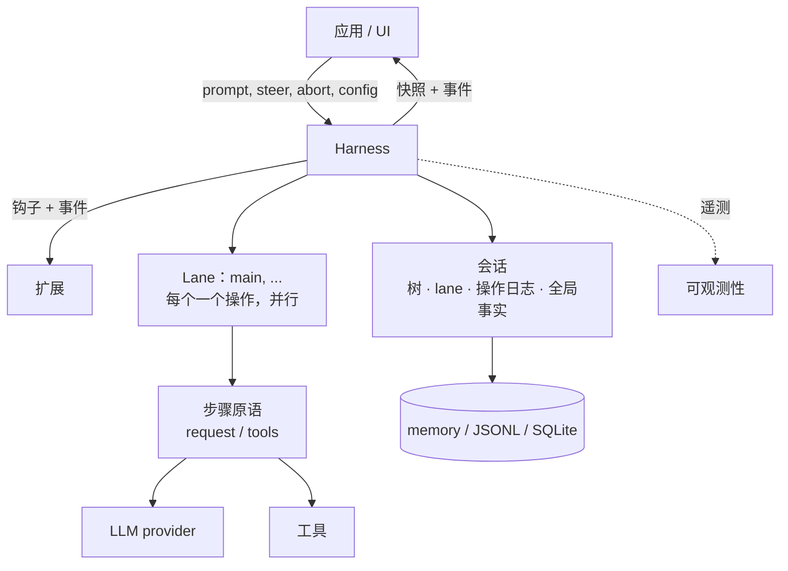
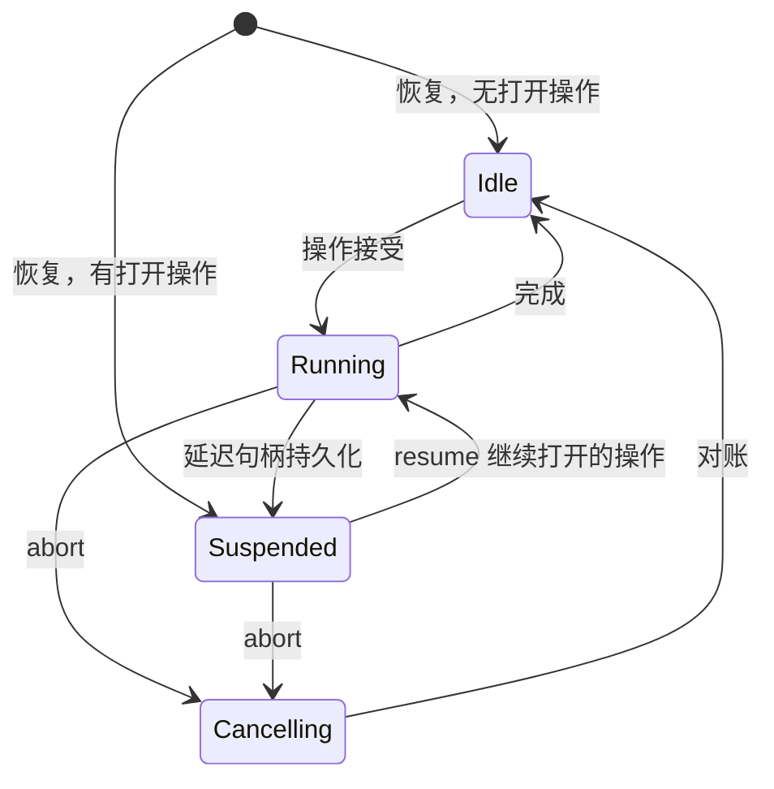

# Durable AgentHarness 设计

> 本文档是 Pi AgentHarness v2（`harness-v2` 分支 `j4/packages/agent/docs/harness-v2.md`）的完整中文翻译。原文约 3446 行，涵盖 21 个章节。

> **兼容性策略。** 旧的 coding-agent v3 JSONL 会话必须打开并恢复为空闲。这是唯一的向后兼容要求。`packages/agent/src/harness` 和 `packages/session-backends/sqlite-node`（及其各自的测试）中的所有其他格式和 API 可能破坏。我们不为其编写迁移、schema 版本控制或转换路径。



Harness 针对一个会话执行运行。会话保存四种状态（第 2 节）。Lane 在一个 harness 内并行执行（第 3 节）。存储后端编码会话（第三部分）。

# 第一部分 — 概念

## 1. 目标

- **持久运行。** 被接受的 prompt 是一个持久操作。崩溃后，新进程恢复会话。它从最后一个安全边界恢复运行。崩溃可以产生的每个状态都是可恢复的。
- **Lane。** 一个会话承载一个或多个 Lane。Lane 是会话树中的命名位置。每个 Lane 同时至多运行一个操作。Lane 并行运行。一个运行及其排队的消息属于接受它们的 Lane。示例：Slack 频道是一个会话；每个线程是一个 Lane。交互式 pi 使用一个 Lane 且不在其 UI 中显示该概念。扩展获得完整的 harness API，包括 Lane。示例：子 Agent 工具在其父会话的第二个 Lane 上运行。
- **无部分结果。** 任何操作内部 — 运行、压缩、导航 — 的崩溃留下两种状态之一：操作尚未发生，或恢复可以完成它。中间没有可观察的东西。
- **Harness API。** 事件观察执行且不能改变它。钩子拦截执行且可以改变它：上下文、请求、工具、运行边界。扩展构建在事件和钩子之上。
- **确定性步进。** 每个副作用 — 持久写入、provider 请求、工具执行、钩子、计时器 — 跨越一个注入的边界。在 `drive: "manual"` 中，harness 在每个副作用之前停靠，测试逐个调用驱动它：在任何边界停止、注入输入，或关闭并重新打开以模拟崩溃。生产和测试运行相同的过程；驱动模式只控制边界（第 15 节）。
- **可观测性。** 所有执行都可以插装用于日志和追踪，直到 provider 请求和响应内部。此通道与钩子系统分离。
- **UI 模型。** 客户端获得一个原子快照，然后是实时事件流。事件不重放。重新连接意味着新快照。
- **单一写者。** 一个 harness 一次写一个会话。服务层强制执行这一点。会话的所有 Lane 都在该 harness 中。恢复将单写者无法产生的状态视为损坏。
- **v3 会话可加载。** 旧的 coding-agent v3 JSONL 文件不变打开并恢复为空闲。

## 非目标

- **恰好一次的钩子副作用。** 钩子结果在消费它的记录或条目提交时变为持久。在该提交之前的崩溃可以再次运行钩子（第 11 节重放表）。钩子自己做的副作用对 harness 不可见：HTTP 调用、文件写入。需要崩溃安全外部副作用的钩子必须幂等，例如以操作 id 为键。
- **Provider 流恢复。** 部分流从不持久化。被中断的流式请求被重试或放弃。延迟请求不同且在范围内：provider 立即返回句柄并稍后提供结果（例如 Responses API 上的 `background: true`、批处理 API）。pi-ai 返回带停止原因 `deferred` 的助手消息，携带句柄；它像任何助手消息一样持久化。兑换句柄追加一条正常的助手消息。恢复看到未兑换的句柄并获取而不是为新请求付费。
- **多写者。** 一个会话上的两个进程超出范围。服务层将会话的所有流量路由到持有其 harness 的进程。Lane 覆盖看起来像多写者的工作负载：共享历史之上的并行线程。
- **复制。** 会话只存在于一处。分歧副本的无协调同步是不同的设计。没有什么排除它以后发生。
- **Coding-agent 迁移。** 将 coding-agent 迁移到 `AgentHarness` 超出范围。兼容性意味着新的 JSONL 仓库可以读取支持的 coding-agent v3 文件。

## 2. 会话是什么

会话是具有四个部分的持久状态：

1. **树** — 会话。带 `parentId` 链接的条目：消息、模型/思考/工具激活变更、压缩摘要、分支摘要、自定义条目。树是共享和被动的。它不属于任何 Lane。它只增长；条目从不被更改或删除。
2. **Lane** — 工作发生的地方。Lane 是一个名字加一个叶子：未来工作扩展的条目。每个会话都有 `main` Lane。应用创建更多，以外部身份为键（Slack 线程 id、邮件线程 id）。
3. **Lane 操作日志** — 发生了什么和必须发生什么。每个 Lane 一条扁平的、按时间顺序的记录序列：操作开始、步骤尝试、工具开始、消息排队、操作完成。这是持久性实现的地方：记录的存在使新进程可以在崩溃后继续 Lane 的工作。正常执行期间没有任何东西读取它们。
4. **全局事实** — 最新写入获胜的会话范围值：会话名称、条目标签。不是树的一部分。保持为追加式历史；读者看到最新的值。

四个部分的所有写入共享一个单调序列号。序列排序全局事实历史，并让 Lane 的操作日志引用树位置。

```text
tree (shared, append-only)          lanes
a ── b ── c ── d                    main            → d   (op log: …)
      └── e ── f                    slack:171943…   → f   (op log: …)

global facts: name = "Refactor auth", label(b) = "checkpoint-1"
```

### 活跃和被动

树和全局事实是被动的：共享数据，任何东西可读。

Lane 是活跃的。它拥有其叶子、其操作日志（至多一个打开的操作）、其队列和其待处理写入。两个 Lane 从不共享这些中的任何一个。Lane 的每个动作产生链接到其叶子的条目，或其自己操作日志中的记录。

### 不变量

- 树只是会话。没有 Lane 状态、编排状态或指针存在于其中。
- 条目的父链从不改变。分支共享前缀；没有东西被复制。
- Lane 的叶子以恰好两种方式移动：Lane 追加条目（叶子变成该条目），或 Lane 导航（叶子跳到现有条目）。
- 操作日志记录从不影响树。删除每个操作日志留下一个完整、有效的会话。
- 每个 Lane 至多一个操作打开。一个 Lane 有两个打开操作的状态是损坏。
- 条目是共享的；记录不是。两个 Lane 可能在其路径上有相同条目。一个记录恰好属于一个 Lane。

记录不是树条目，因为它们描述执行，不是会话：它们必须从不进入模型上下文、transcript、分支查询或 Fork，且在一个 Lane 内它们的顺序已经是它们的意义 — 父链接不会增加任何东西。

## 3. Lane

Lane 是树中的命名位置加上在其上序列化的工作。最接近的现有概念是在自己的 worktree 中检出的 git 分支：附加到位置的名称，由新工作推进，可以移动到任何条目而不重写历史，且从不检出两次。与 git 直觉的一个区别：导航将 Lane 移动到任何条目，不只是向前。

每个会话都有 `main` Lane。应用以名称和锚点条目创建更多 Lane。Lane 名称是永久的应用键：Slack 线程 id、邮件线程 id。没有 UI 抽象地列出 Lane；平台自己的 UI（线程列表）扮演该角色。

Lane 拥有：

- **其叶子。** 新条目链接到它并移动它。导航跳跃它。
- **其操作日志。** 至多一个打开的操作。繁忙 Lane 上的第二个操作被拒绝；其他 Lane 不受影响。
- **其队列。** Steering、follow-up 和 next-run 消息以一个 Lane 为目标。
- **其配置视图。** 模型、思考级别和活跃工具是 Lane 叶子后面路径上的条目。两个 Lane 可以运行不同模型而互不知晓。工具实现、资源和流选项是 harness 全局的；只有它们的激活是每 Lane 的。

规则：

- Lane 并行运行操作。Harness 保持单一写者；Lane 记录和条目在共享序列中交错。
- 创建 Lane 不复制任何东西。Lane 从不删除或重命名。
- 一个 Lane 上依赖状态的变更在该 Lane 的变更线上线性化：验证、至多一个持久写入，以及内存中更新在下一个变更开始之前完成（第 15 节）。Provider、工具、钩子和重试工作从不占用变更线。
- 同一叶子上的两个 Lane 在其下一次追加时分叉。树处理这个；Lane 之间不存在协调。
- 有未完成操作的 Lane 独立于其兄弟恢复为挂起。挂起有原因：崩溃，或延迟的 provider 请求（第 1 节）。

## 4. 工作如何执行

### 操作

操作是 Lane 上持久工作的单元。三种：

- **Run** — 被接受的 prompt，经过所有自动 continuation：工具调用、steering、follow-up、自动压缩。当没有待处理时结束。
- **Compaction** — 用摘要条目替换旧上下文。
- **Navigation** — 将 Lane 的叶子移动到现有条目，可选地带分支摘要。

操作在执行之前被接受。接受是持久的：崩溃后，被接受的操作要么由恢复完成，要么显式关闭。每个被接受的运行以 `completed`、`failed` 或 `aborted`（被中止停止）结束。压缩和导航还可以在决策钩子在其副作用之前否决被接受的结构操作时以 `declined` 结束。

### 运行、回合和步骤

运行是回合的序列。回合是一个助手步骤加该助手消息请求的完整工具批次。

步骤是操作内可重试的工作单元：产生助手消息、压缩摘要或分支摘要。步骤可以发出零个、一个或几个 provider 请求。失败的尝试重试同一步骤；尝试计数是持久的且在重启后存活。延迟的 provider 请求结束助手步骤：句柄在关闭步骤的持久化助手消息内到达，操作挂起，兑换稍后追加真实结果（第 1 节）。

每个开始副作用的工具调用也是一个步骤。`tool_started` 打开它；其工具结果条目关闭它。并行批次同时持有几个打开的工具步骤；它们的副作用并发运行并按源顺序终结（第 14 节）。

### 队列和延迟写入

两种机制将输入带入运行中的 Lane。它们在中止行为上不同：

- **队列**携带会话意图：`steer` 纠正当前工作，`followUp` 在模型将停止时添加工作，`nextRun` 播种 Lane 的下一次运行。Steering 和 follow-up 在中止时死亡；其载荷返回给调用者。Next-run 消息存活。
- **延迟写入**携带事实：在步骤飞行中请求的条目和配置变更。它们在中止中存活，甚至在取消期间应用。

两者在接受时持久：接受的调用将带完整载荷的记录写入 Lane 的操作日志，然后解析。树条目稍后写入，在该项被应用或消费时 — 模型第一次看到它的位置。如果进程在接受和树写入之间死亡，恢复读取记录并执行追加。被接受的输入从不丢失。

### 检查点

回合之间，Lane 通过一个检查点：

1. 应用待处理的延迟写入。
2. 消费排队的 steering 消息。
3. 如果下一个请求不适合，压缩。

压缩还有一个反应性触发器：揭示请求不适合的 provider 响应 — 溢出形式的错误，或低于预期输出上限的 `length` 停止。该响应被丢弃，运行压缩并重试一次（第 6 节，"助手步骤的上下文溢出"）。

带工具调用的回合强制另一个回合使模型看到其结果 — 有一个例外：每个终结的工具结果都持久化 `terminate: true` 的批次抑制自动工具 continuation（steering 或 follow-up 输入仍可以开始另一个回合）。Follow-up 消息只在工具 continuation 和 steering 耗尽时消耗。当检查点发现没有待处理时运行结束。

### 追加式上下文

> 在一个 Lane 的请求之间，provider 上下文只在尾部增长。在先前请求尾部之前的插入会使 provider 的 KV 缓存从该点起失效并倍增 token 成本。

这个不变量是回合中写入延迟到检查点的原因：检查点应用在尾部追加。压缩是唯一刻意的例外；它用一次完整的缓存失效交换更小的上下文。

### Lane 生命周期



- 状态是每 Lane 的。一个例外：失败的存储写入使整个 harness 故障。故障的 harness 停止所有副作用并拒绝所有调用；原因修复后，重新打开从其记录恢复每个 Lane。
- **挂起**意味着：操作打开，没有东西执行。崩溃后恢复到达，或在延迟句柄持久化时刻意到达。`resume()` 继续操作；`abort()` 关闭它而不进一步执行。
- **中止**持久记录取消、信号运行中的副作用并返回。对账跟随：未解析的工具调用得到合成结果，transcript 得到关闭的助手消息。自动驱动在后台运行它；手动驱动将其停靠在下一个动作。

### 恢复

恢复继续打开的操作。它从不开始新的。入口点是记录结束的地方：重试未完成的步骤、兑换延迟句柄、对账半完成的工具批次，或在下一个检查点继续。崩溃前接受的排队消息和延迟写入仍待处理并正常应用。

# 第二部分 — 执行如何记录

第二部分是后端中立的。它定义 Lane 写入的记录、何时写入，以及恢复如何读回。第三部分将其映射到 API 和存储。

## 5. 记录

### 持久性规则

> 副作用之前：写一条命名将发生什么及其将产生的 id 的意图记录。副作用之后：以恰好那些 id 将结果追加为条目。

没有多记录原子性，也不需要。每条记录和每个条目单独持久。意图和结果之间的崩溃留下未满足的意图；恢复按意图类型决定：完成它、重试它，或用合成结果关闭它。意图当且仅当带其 provisioned id 的条目存在时被满足。条目本身可以命名下一个持久状态：带 `stopReason: "deferred"` 的助手条目满足其尝试的 provisioned 追加并关闭步骤；仍然未决的是操作 — 持久化的句柄等待兑换（第 6 节）。存在但内容不同的 provisioned id 是损坏。

### Provisioned id

意图记录携带尚不存在的条目的 id：

```ts
/** 带预分配 id 的条目载荷。parentId、seq 和 timestamp
    由存储在条目追加时分配：它链接到 Lane 当时的叶子。 */
type ProvisionedEntry<T extends Entry = Entry> =
  T extends Entry ? Omit<T, "parentId" | "seq" | "timestamp"> : never;
```

### 记录目录

每条记录属于一个 Lane 的操作日志。属于操作的记录携带 `runId`：该操作的 `operation_started` 记录的 id。Next-run 队列记录（`queue_enqueued` 及其 `queue_cancelled`）和独立的 `adjustment` 用量记录不携带 `runId`。

```ts
interface RecordBase {
  id: string;
  seq: number;            // 共享序列，第 2 节
  lane: string;
  timestamp: number;      // Unix 毫秒
}

// 操作的接受边界。接受前决定的一切在此持久化。此记录自己的 id
// 就是该操作所有其他记录携带的 runId。
interface OperationStartedRecord extends RecordBase {
  type: "operation_started";
  sourceLeafId: string | null;        // 接受时 Lane 的叶子
  intent:
    | {
        kind: "run";
        /** 技能/模板展开后、before_run 之前的规范化调用者输入。
            为 SuspendedOperation 和 before_resume 保留。 */
        originalPrompt: AgentMessage[];
        /** 捕获的 nextRun 项，然后 prompt，然后 before_run
            注入。完整载荷，provisioned id。捕获发生在
            接受变更中 (第 15 节)：它运行时存在的项
            属于此运行；后来的项属于下一个。 */
        initialMessages: ProvisionedEntry[];
        /** 仅当钩子覆盖了 system prompt 时存在；整个运行固定。
            缺失：systemPrompt 回调按请求运行。 */
        systemPromptOverride?: string;
        /** 以稳定钩子注册 id 为键的不透明状态。每个
            before_resume 处理器只接收其 id 下的值。 */
        resumeData?: Record<string, JsonValue>;
      }
    | {
        kind: "compaction";
        customInstructions?: string;
        resultEntryId: string;          // provisioned 压缩条目
      }
    | {
        kind: "navigation";
        targetId: string | null;        // 目标条目；null = 根
        summarize: boolean;
        customInstructions?: string;
        label?: string;                 // 全局事实，完成时写入
        summaryEntryId?: string;        // provisioned 分支摘要条目
      };
}

// abort() 解析时写入。请求标记，不是终态：
// 对账跟随，然后 operation_finished 带结果 "aborted"。
// 杀死此操作的 steer/follow-up 队列项；next-run 项存活。
interface AbortRequestedRecord extends RecordBase {
  type: "abort_requested";
  runId: string;
}

// 关闭操作。failed = 有序持久失败（例如重试耗尽）。
// aborted = 被中止关闭。declined = 在任何副作用之前被钩子否决。
interface OperationFinishedRecord extends RecordBase {
  type: "operation_finished";
  runId: string;
  outcome: "completed" | "aborted" | "failed" | "declined";
  error?: { code: string; message: string };
}

// 每次可重试步骤的尝试之前写入。标记：我们要做这个，
// 第 n 次。步骤被记录因为它们是可重试的：持久计数
// 限制跨重启的重试 — 崩溃重启循环不能重置它。
// 每次尝试一条记录；一次尝试可以发出零个或几个 provider 请求
//（拆分回合压缩发出两个）。延迟结果不需要额外
// 记录：句柄保存在持久化的助手条目中（第 1 节）。
interface StepAttemptRecord extends RecordBase {
  type: "step_attempt";
  runId: string;
  step: "assistant" | "compaction" | "branch_summary";
  attempt: number;                     // 此步骤内的 1 基
  /** 此尝试成功时产生的条目。助手尝试每次提供新 id；
      一个结构步骤的所有尝试重用一个 id（手动：意图的；
      自动：第一次尝试的）。放弃的错误条目满足
      最后一次尝试的 id。 */
  resultEntryId: string;
  /** 恰好对压缩步骤必需。持久化为什么生成摘要，
      使恢复重新进入相同的结构工作而不重新派生上下文压力。 */
  compactionReason?: "manual" | "threshold" | "overflow";
}
// 恢复的请求的模型不从记录读取：Lane 的有效模型
// 从其路径派生，延迟句柄的模型
// 在持久化的助手条目中。

// before_tool 和验证通过后、工具执行之前写入。
// assistantEntryId + toolIndex 是持久调用身份。
interface ToolStartedRecord extends RecordBase {
  type: "tool_started";
  runId: string;
  assistantEntryId: string;
  toolIndex: number;
  toolCallId: string;
  toolName: string;
  effectiveArgs: Record<string, unknown>;   // before_tool 之后
  resultEntryId: string;                    // provisioned
  /** 执行时快照的工具声明的重放安全性。
      恢复只在此字段和当前工具声明都说 "safe" 时
      重新执行未完成的调用；否则写入合成 "interrupted" 结果。 */
  replay: "never" | "safe";
}

// 队列接受。载荷在此传输；条目出现在
// 消耗点。
interface QueueEnqueuedRecord extends RecordBase {
  type: "queue_enqueued";
  queue: "steer" | "followUp" | "nextRun";
  runId?: string;                      // nextRun 缺失
  target: ProvisionedEntry;
}

// 消费前对待处理队列项的持久撤回。没有
// 此记录崩溃会复活该项：恢复将没有其条目的
// queue_enqueued 视为待处理。
interface QueueCancelledRecord extends RecordBase {
  type: "queue_cancelled";
  runId?: string;                      // 匹配它杀死的 queue_enqueued
  entryId: string;                     // 排队目标的 provisioned id
}

// 延迟写入接受：步骤飞行中请求的条目或配置变更。
// 在下一个检查点应用。
interface WriteDeferredRecord extends RecordBase {
  type: "write_deferred";
  runId: string;
  target: ProvisionedEntry;
}

// 成本台账。无论用量报告还是调整时写入，
// 不管响应发生什么。纯会计：归约、
// 恢复和有效性检查从不读取它，所以它不增加恢复
// 状态和崩溃矩阵行。它记录报告的用量；传输
// 流中途死亡可以计费没有人报告的 token，结算和此写入之间的
// 崩溃丢失那一项 — 不可消除的窗口。
type UsageRecord = RecordBase & { type: "usage"; usage: Usage } & (
  // provider 请求已结算，不管结果。在任何分类、重试决策或
  // 丢弃之前写入。拆分回合压缩
  // 写两条记录共享一次尝试。报告无用量的 pending 延迟 fetch
  // 不写记录。
  | { cause: "assistant" | "compaction" | "branch_summary" | "deferred_fetch";
      runId: string; entryId: string; attempt: number; stopReason: TerminalStopReason }
  // 终结的工具结果报告嵌套 LLM 工作；不报告时跳过。
  // 安全重放为第二次执行写第二条记录：两者都被计费。
  | { cause: "tool"; runId: string; entryId: string; toolCallId: string }
  // 钩子提供的摘要携带钩子自己测量的用量。
  | { cause: "hook"; runId: string; entryId: string }
  // 应用提供的，任何时候（lane.recordUsage）：对账、
  // 估计、更正。负值合法。
  | { cause: "adjustment"; runId?: string; entryId?: string; details?: JsonValue }
);

type LaneRecord = OperationStartedRecord | AbortRequestedRecord | OperationFinishedRecord
  | StepAttemptRecord | ToolStartedRecord | QueueEnqueuedRecord | QueueCancelledRecord
  | WriteDeferredRecord | UsageRecord;

type NewRecord<T extends LaneRecord = LaneRecord> =
  T extends LaneRecord ? Omit<T, "seq" | "timestamp"> : never;
```

被阻止或无效的工具调用不写 `tool_started`。没有副作用开始，所以不需要意图：阻止作为带 `isError: true` 和阻止原因作为内容的工具结果条目持久。该条目之前的崩溃只丢失决策，恢复再次做出 — 对没有 `tool_started` 且没有结果的调用 `before_tool` 再次运行。

工具步骤不需要结果记录。其结果条目是完整的持久结果，包括批次控制决策：工具结果条目持久化 `terminate`（第 12 节）。执行后但结果条目之前的崩溃遵循重放策略（第 6 节）；重新终结再次运行 `after_tool`，第 1 节非目标显式允许。

成本是存在结果记录的一个关注点：**成本持久性不得依赖结果持久性**。可重试步骤恰恰是被设计为产生从不成为条目的响应的步骤 — 失败尝试、耗尽序列、被丢弃的溢出响应 — 它们的花费不能随它们消失。每个 provider 请求因此在任何分类、重试决策或丢弃之前以 `usage` 记录结算；工具报告和钩子报告的用量在其条目旁边获得记录；应用为 harness 看不到的任何东西追加 `adjustment` 记录。

Harness 写的 `usage` 记录总是将其 `entryId` 绑定到其测量所属条目的 provisioned id；该条目是否存在是单独的问题 — 失败尝试或被丢弃响应的 id 从不物化，这正是重点。三层干净分离：条目的 `usage` 字段是产生该条目的响应的**不可变快照**，追加时写入一次且不再触碰；**条目的有效成本**是读取时查询 — 绑定到其 id 的所有 Lane 的 `usage` 记录的总和，基础加调整；**会话的成本**是所有 `usage` 记录的总和。恢复可以诚实地计费两次 — 重试的步骤或重放的工具每次执行写一条记录 — 且条目快照等于其 id 的最新非调整记录（对压缩和分支摘要：成功尝试的）。

### 有效性

恢复在以下情况拒绝 Lane 的日志为损坏：

- 超过一个操作打开；
- 记录引用不存在的操作，或跟随其完成；
- 尝试编号在一个步骤内不连续；
- `compactionReason` 在压缩尝试中缺失或出现在其他步骤类型上；
- 运行的 steer 或 follow-up `queue_enqueued` 跟随其 `abort_requested`；
- `queue_cancelled` 以没有 `queue_enqueued` 的 id 或其条目已存在的 id 为目标；
- 一个结构步骤中的尝试在 `resultEntryId` 上不一致，或一个步骤的任何尝试在 `compactionReason` 上不一致；
- `tool_started.toolIndex` 未识别其原始助手条目中存储的 `toolCallId` 和 `toolName`；
- 两条 `tool_started` 记录共享一个调用身份；
- provisioned id 以不同内容存在。
