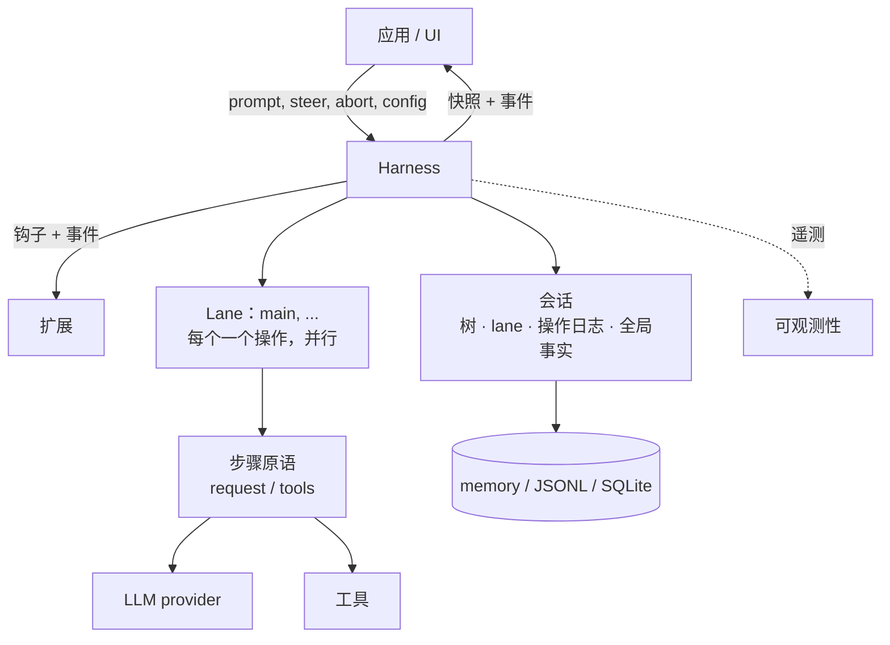
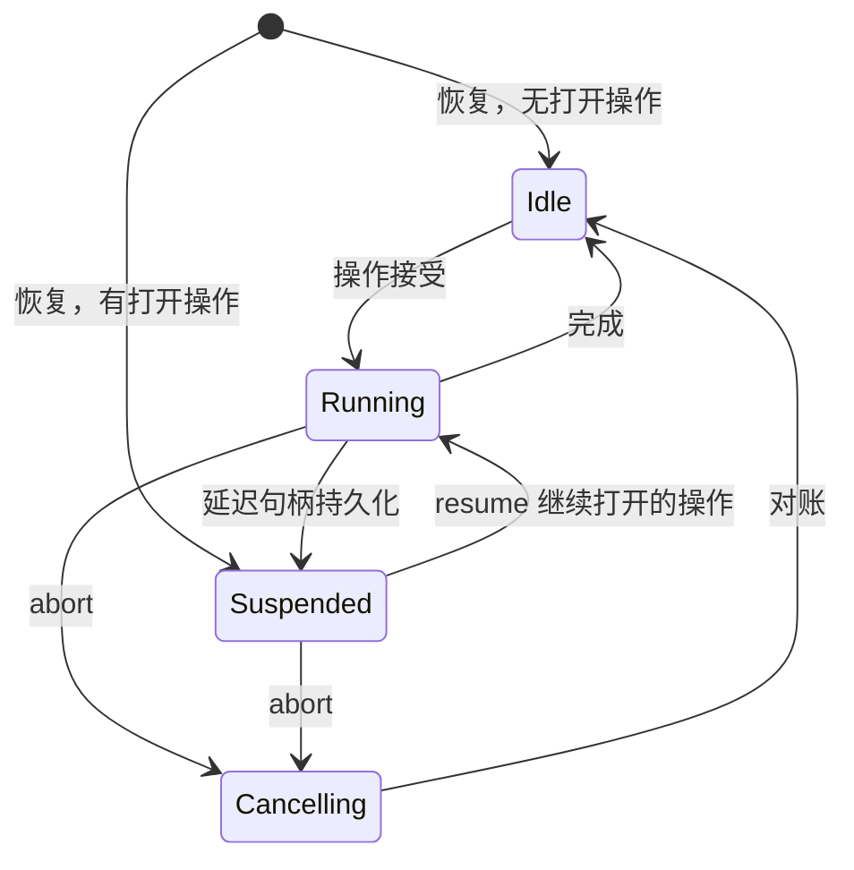

# Durable AgentHarness 设计

> 本文档是 Pi AgentHarness v2（`harness-v2` 分支 `j4/packages/agent/docs/harness-v2.md`）的完整中文翻译。原文约 3446 行，涵盖 21 个章节。

> **兼容性策略。** 旧的 coding-agent v3 JSONL 会话必须打开并恢复为空闲。这是唯一的向后兼容要求。`packages/agent/src/harness` 和 `packages/session-backends/sqlite-node`（及其各自的测试）中的所有其他格式和 API 可能破坏。我们不为其编写迁移、schema 版本控制或转换路径。



Harness 针对一个会话执行运行。会话保存四种状态（第 2 节）。Lane 在一个 harness 内并行执行（第 3 节）。存储后端编码会话（第三部分）。

# 第一部分 — 概念

## 1. 目标

- **持久运行。** 被接受的 prompt 是一个持久操作。崩溃后，新进程恢复会话。它从最后一个安全边界恢复运行。崩溃可以产生的每个状态都是可恢复的。
- **Lane。** 一个会话承载一个或多个 Lane。Lane 是会话树中的命名位置。每个 Lane 同时至多运行一个操作。Lane 并行运行。一个运行及其排队的消息属于接受它们的 Lane。示例：Slack 频道是一个会话；每个线程是一个 Lane。交互式 pi 使用一个 Lane 且不在其 UI 中显示该概念。扩展获得完整的 harness API，包括 Lane。示例：子 Agent 工具在其父会话的第二个 Lane 上运行。
- **无部分结果。** 任何操作内部 — 运行、压缩、导航 — 的崩溃留下两种状态之一：操作尚未发生，或恢复可以完成它。中间没有可观察的东西。
- **Harness API。** 事件观察执行且不能改变它。钩子拦截执行且可以改变它：上下文、请求、工具、运行边界。扩展构建在事件和钩子之上。
- **确定性步进。** 每个副作用 — 持久写入、provider 请求、工具执行、钩子、计时器 — 跨越一个注入的边界。在 `drive: "manual"` 中，harness 在每个副作用之前停靠，测试逐个调用驱动它：在任何边界停止、注入输入，或关闭并重新打开以模拟崩溃。生产和测试运行相同的过程；驱动模式只控制边界（第 15 节）。
- **可观测性。** 所有执行都可以插装用于日志和追踪，直到 provider 请求和响应内部。此通道与钩子系统分离。
- **UI 模型。** 客户端获得一个原子快照，然后是实时事件流。事件不重放。重新连接意味着新快照。
- **单一写者。** 一个 harness 一次写一个会话。服务层强制执行这一点。会话的所有 Lane 都在该 harness 中。恢复将单写者无法产生的状态视为损坏。
- **v3 会话可加载。** 旧的 coding-agent v3 JSONL 文件不变打开并恢复为空闲。

## 非目标

- **恰好一次的钩子副作用。** 钩子结果在消费它的记录或条目提交时变为持久。在该提交之前的崩溃可以再次运行钩子（第 11 节重放表）。钩子自己做的副作用对 harness 不可见：HTTP 调用、文件写入。需要崩溃安全外部副作用的钩子必须幂等，例如以操作 id 为键。
- **Provider 流恢复。** 部分流从不持久化。被中断的流式请求被重试或放弃。延迟请求不同且在范围内：provider 立即返回句柄并稍后提供结果（例如 Responses API 上的 `background: true`、批处理 API）。pi-ai 返回带停止原因 `deferred` 的助手消息，携带句柄；它像任何助手消息一样持久化。兑换句柄追加一条正常的助手消息。恢复看到未兑换的句柄并获取而不是为新请求付费。
- **多写者。** 一个会话上的两个进程超出范围。服务层将会话的所有流量路由到持有其 harness 的进程。Lane 覆盖看起来像多写者的工作负载：共享历史之上的并行线程。
- **复制。** 会话只存在于一处。分歧副本的无协调同步是不同的设计。没有什么排除它以后发生。
- **Coding-agent 迁移。** 将 coding-agent 迁移到 `AgentHarness` 超出范围。兼容性意味着新的 JSONL 仓库可以读取支持的 coding-agent v3 文件。

## 2. 会话是什么

会话是具有四个部分的持久状态：

1. **树** — 会话。带 `parentId` 链接的条目：消息、模型/思考/工具激活变更、压缩摘要、分支摘要、自定义条目。树是共享和被动的。它不属于任何 Lane。它只增长；条目从不被更改或删除。
2. **Lane** — 工作发生的地方。Lane 是一个名字加一个叶子：未来工作扩展的条目。每个会话都有 `main` Lane。应用创建更多，以外部身份为键（Slack 线程 id、邮件线程 id）。
3. **Lane 操作日志** — 发生了什么和必须发生什么。每个 Lane 一条扁平的、按时间顺序的记录序列：操作开始、步骤尝试、工具开始、消息排队、操作完成。这是持久性实现的地方：记录的存在使新进程可以在崩溃后继续 Lane 的工作。正常执行期间没有任何东西读取它们。
4. **全局事实** — 最新写入获胜的会话范围值：会话名称、条目标签。不是树的一部分。保持为追加式历史；读者看到最新的值。

四个部分的所有写入共享一个单调序列号。序列排序全局事实历史，并让 Lane 的操作日志引用树位置。

```text
tree (shared, append-only)          lanes
a ── b ── c ── d                    main            → d   (op log: …)
      └── e ── f                    slack:171943…   → f   (op log: …)

global facts: name = "Refactor auth", label(b) = "checkpoint-1"
```

### 活跃和被动

树和全局事实是被动的：共享数据，任何东西可读。

Lane 是活跃的。它拥有其叶子、其操作日志（至多一个打开的操作）、其队列和其待处理写入。两个 Lane 从不共享这些中的任何一个。Lane 的每个动作产生链接到其叶子的条目，或其自己操作日志中的记录。

### 不变量

- 树只是会话。没有 Lane 状态、编排状态或指针存在于其中。
- 条目的父链从不改变。分支共享前缀；没有东西被复制。
- Lane 的叶子以恰好两种方式移动：Lane 追加条目（叶子变成该条目），或 Lane 导航（叶子跳到现有条目）。
- 操作日志记录从不影响树。删除每个操作日志留下一个完整、有效的会话。
- 每个 Lane 至多一个操作打开。一个 Lane 有两个打开操作的状态是损坏。
- 条目是共享的；记录不是。两个 Lane 可能在其路径上有相同条目。一个记录恰好属于一个 Lane。

记录不是树条目，因为它们描述执行，不是会话：它们必须从不进入模型上下文、transcript、分支查询或 Fork，且在一个 Lane 内它们的顺序已经是它们的意义 — 父链接不会增加任何东西。

## 3. Lane

Lane 是树中的命名位置加上在其上序列化的工作。最接近的现有概念是在自己的 worktree 中检出的 git 分支：附加到位置的名称，由新工作推进，可以移动到任何条目而不重写历史，且从不检出两次。与 git 直觉的一个区别：导航将 Lane 移动到任何条目，不只是向前。

每个会话都有 `main` Lane。应用以名称和锚点条目创建更多 Lane。Lane 名称是永久的应用键：Slack 线程 id、邮件线程 id。没有 UI 抽象地列出 Lane；平台自己的 UI（线程列表）扮演该角色。

Lane 拥有：

- **其叶子。** 新条目链接到它并移动它。导航跳跃它。
- **其操作日志。** 至多一个打开的操作。繁忙 Lane 上的第二个操作被拒绝；其他 Lane 不受影响。
- **其队列。** Steering、follow-up 和 next-run 消息以一个 Lane 为目标。
- **其配置视图。** 模型、思考级别和活跃工具是 Lane 叶子后面路径上的条目。两个 Lane 可以运行不同模型而互不知晓。工具实现、资源和流选项是 harness 全局的；只有它们的激活是每 Lane 的。

规则：

- Lane 并行运行操作。Harness 保持单一写者；Lane 记录和条目在共享序列中交错。
- 创建 Lane 不复制任何东西。Lane 从不删除或重命名。
- 一个 Lane 上依赖状态的变更在该 Lane 的变更线上线性化：验证、至多一个持久写入，以及内存中更新在下一个变更开始之前完成（第 15 节）。Provider、工具、钩子和重试工作从不占用变更线。
- 同一叶子上的两个 Lane 在其下一次追加时分叉。树处理这个；Lane 之间不存在协调。
- 有未完成操作的 Lane 独立于其兄弟恢复为挂起。挂起有原因：崩溃，或延迟的 provider 请求（第 1 节）。

## 4. 工作如何执行

### 操作

操作是 Lane 上持久工作的单元。三种：

- **Run** — 被接受的 prompt，经过所有自动 continuation：工具调用、steering、follow-up、自动压缩。当没有待处理时结束。
- **Compaction** — 用摘要条目替换旧上下文。
- **Navigation** — 将 Lane 的叶子移动到现有条目，可选地带分支摘要。

操作在执行之前被接受。接受是持久的：崩溃后，被接受的操作要么由恢复完成，要么显式关闭。每个被接受的运行以 `completed`、`failed` 或 `aborted`（被中止停止）结束。压缩和导航还可以在决策钩子在其副作用之前否决被接受的结构操作时以 `declined` 结束。

### 运行、回合和步骤

运行是回合的序列。回合是一个助手步骤加该助手消息请求的完整工具批次。

步骤是操作内可重试的工作单元：产生助手消息、压缩摘要或分支摘要。步骤可以发出零个、一个或几个 provider 请求。失败的尝试重试同一步骤；尝试计数是持久的且在重启后存活。延迟的 provider 请求结束助手步骤：句柄在关闭步骤的持久化助手消息内到达，操作挂起，兑换稍后追加真实结果（第 1 节）。

每个开始副作用的工具调用也是一个步骤。`tool_started` 打开它；其工具结果条目关闭它。并行批次同时持有几个打开的工具步骤；它们的副作用并发运行并按源顺序终结（第 14 节）。

### 队列和延迟写入

两种机制将输入带入运行中的 Lane。它们在中止行为上不同：

- **队列**携带会话意图：`steer` 纠正当前工作，`followUp` 在模型将停止时添加工作，`nextRun` 播种 Lane 的下一次运行。Steering 和 follow-up 在中止时死亡；其载荷返回给调用者。Next-run 消息存活。
- **延迟写入**携带事实：在步骤飞行中请求的条目和配置变更。它们在中止中存活，甚至在取消期间应用。

两者在接受时持久：接受的调用将带完整载荷的记录写入 Lane 的操作日志，然后解析。树条目稍后写入，在该项被应用或消费时 — 模型第一次看到它的位置。如果进程在接受和树写入之间死亡，恢复读取记录并执行追加。被接受的输入从不丢失。

### 检查点

回合之间，Lane 通过一个检查点：

1. 应用待处理的延迟写入。
2. 消费排队的 steering 消息。
3. 如果下一个请求不适合，压缩。

压缩还有一个反应性触发器：揭示请求不适合的 provider 响应 — 溢出形式的错误，或低于预期输出上限的 `length` 停止。该响应被丢弃，运行压缩并重试一次（第 6 节，"助手步骤的上下文溢出"）。

带工具调用的回合强制另一个回合使模型看到其结果 — 有一个例外：每个终结的工具结果都持久化 `terminate: true` 的批次抑制自动工具 continuation（steering 或 follow-up 输入仍可以开始另一个回合）。Follow-up 消息只在工具 continuation 和 steering 耗尽时消耗。当检查点发现没有待处理时运行结束。

### 追加式上下文

> 在一个 Lane 的请求之间，provider 上下文只在尾部增长。在先前请求尾部之前的插入会使 provider 的 KV 缓存从该点起失效并倍增 token 成本。

这个不变量是回合中写入延迟到检查点的原因：检查点应用在尾部追加。压缩是唯一刻意的例外；它用一次完整的缓存失效交换更小的上下文。

### Lane 生命周期



- 状态是每 Lane 的。一个例外：失败的存储写入使整个 harness 故障。故障的 harness 停止所有副作用并拒绝所有调用；原因修复后，重新打开从其记录恢复每个 Lane。
- **挂起**意味着：操作打开，没有东西执行。崩溃后恢复到达，或在延迟句柄持久化时刻意到达。`resume()` 继续操作；`abort()` 关闭它而不进一步执行。
- **中止**持久记录取消、信号运行中的副作用并返回。对账跟随：未解析的工具调用得到合成结果，transcript 得到关闭的助手消息。自动驱动在后台运行它；手动驱动将其停靠在下一个动作。

### 恢复

恢复继续打开的操作。它从不开始新的。入口点是记录结束的地方：重试未完成的步骤、兑换延迟句柄、对账半完成的工具批次，或在下一个检查点继续。崩溃前接受的排队消息和延迟写入仍待处理并正常应用。

# 第二部分 — 执行如何记录

第二部分是后端中立的。它定义 Lane 写入的记录、何时写入，以及恢复如何读回。第三部分将其映射到 API 和存储。

## 5. 记录

### 持久性规则

> 副作用之前：写一条命名将发生什么及其将产生的 id 的意图记录。副作用之后：以恰好那些 id 将结果追加为条目。

没有多记录原子性，也不需要。每条记录和每个条目单独持久。意图和结果之间的崩溃留下未满足的意图；恢复按意图类型决定：完成它、重试它，或用合成结果关闭它。意图当且仅当带其 provisioned id 的条目存在时被满足。条目本身可以命名下一个持久状态：带 `stopReason: "deferred"` 的助手条目满足其尝试的 provisioned 追加并关闭步骤；仍然未决的是操作 — 持久化的句柄等待兑换（第 6 节）。存在但内容不同的 provisioned id 是损坏。

### Provisioned id

意图记录携带尚不存在的条目的 id：

```ts
/** 带预分配 id 的条目载荷。parentId、seq 和 timestamp
    由存储在条目追加时分配：它链接到 Lane 当时的叶子。 */
type ProvisionedEntry<T extends Entry = Entry> =
  T extends Entry ? Omit<T, "parentId" | "seq" | "timestamp"> : never;
```

### 记录目录

每条记录属于一个 Lane 的操作日志。属于操作的记录携带 `runId`：该操作的 `operation_started` 记录的 id。Next-run 队列记录（`queue_enqueued` 及其 `queue_cancelled`）和独立的 `adjustment` 用量记录不携带 `runId`。

```ts
interface RecordBase {
  id: string;
  seq: number;            // 共享序列，第 2 节
  lane: string;
  timestamp: number;      // Unix 毫秒
}

// 操作的接受边界。接受前决定的一切在此持久化。此记录自己的 id
// 就是该操作所有其他记录携带的 runId。
interface OperationStartedRecord extends RecordBase {
  type: "operation_started";
  sourceLeafId: string | null;        // 接受时 Lane 的叶子
  intent:
    | {
        kind: "run";
        /** 技能/模板展开后、before_run 之前的规范化调用者输入。
            为 SuspendedOperation 和 before_resume 保留。 */
        originalPrompt: AgentMessage[];
        /** 捕获的 nextRun 项，然后 prompt，然后 before_run
            注入。完整载荷，provisioned id。捕获发生在
            接受变更中 (第 15 节)：它运行时存在的项
            属于此运行；后来的项属于下一个。 */
        initialMessages: ProvisionedEntry[];
        /** 仅当钩子覆盖了 system prompt 时存在；整个运行固定。
            缺失：systemPrompt 回调按请求运行。 */
        systemPromptOverride?: string;
        /** 以稳定钩子注册 id 为键的不透明状态。每个
            before_resume 处理器只接收其 id 下的值。 */
        resumeData?: Record<string, JsonValue>;
      }
    | {
        kind: "compaction";
        customInstructions?: string;
        resultEntryId: string;          // provisioned 压缩条目
      }
    | {
        kind: "navigation";
        targetId: string | null;        // 目标条目；null = 根
        summarize: boolean;
        customInstructions?: string;
        label?: string;                 // 全局事实，完成时写入
        summaryEntryId?: string;        // provisioned 分支摘要条目
      };
}

// abort() 解析时写入。请求标记，不是终态：
// 对账跟随，然后 operation_finished 带结果 "aborted"。
// 杀死此操作的 steer/follow-up 队列项；next-run 项存活。
interface AbortRequestedRecord extends RecordBase {
  type: "abort_requested";
  runId: string;
}

// 关闭操作。failed = 有序持久失败（例如重试耗尽）。
// aborted = 被中止关闭。declined = 在任何副作用之前被钩子否决。
interface OperationFinishedRecord extends RecordBase {
  type: "operation_finished";
  runId: string;
  outcome: "completed" | "aborted" | "failed" | "declined";
  error?: { code: string; message: string };
}

// 每次可重试步骤的尝试之前写入。标记：我们要做这个，
// 第 n 次。步骤被记录因为它们是可重试的：持久计数
// 限制跨重启的重试 — 崩溃重启循环不能重置它。
// 每次尝试一条记录；一次尝试可以发出零个或几个 provider 请求
//（拆分回合压缩发出两个）。延迟结果不需要额外
// 记录：句柄保存在持久化的助手条目中（第 1 节）。
interface StepAttemptRecord extends RecordBase {
  type: "step_attempt";
  runId: string;
  step: "assistant" | "compaction" | "branch_summary";
  attempt: number;                     // 此步骤内的 1 基
  /** 此尝试成功时产生的条目。助手尝试每次提供新 id；
      一个结构步骤的所有尝试重用一个 id（手动：意图的；
      自动：第一次尝试的）。放弃的错误条目满足
      最后一次尝试的 id。 */
  resultEntryId: string;
  /** 恰好对压缩步骤必需。持久化为什么生成摘要，
      使恢复重新进入相同的结构工作而不重新派生上下文压力。 */
  compactionReason?: "manual" | "threshold" | "overflow";
}
// 恢复的请求的模型不从记录读取：Lane 的有效模型
// 从其路径派生，延迟句柄的模型
// 在持久化的助手条目中。

// before_tool 和验证通过后、工具执行之前写入。
// assistantEntryId + toolIndex 是持久调用身份。
interface ToolStartedRecord extends RecordBase {
  type: "tool_started";
  runId: string;
  assistantEntryId: string;
  toolIndex: number;
  toolCallId: string;
  toolName: string;
  effectiveArgs: Record<string, unknown>;   // before_tool 之后
  resultEntryId: string;                    // provisioned
  /** 执行时快照的工具声明的重放安全性。
      恢复只在此字段和当前工具声明都说 "safe" 时
      重新执行未完成的调用；否则写入合成 "interrupted" 结果。 */
  replay: "never" | "safe";
}

// 队列接受。载荷在此传输；条目出现在
// 消耗点。
interface QueueEnqueuedRecord extends RecordBase {
  type: "queue_enqueued";
  queue: "steer" | "followUp" | "nextRun";
  runId?: string;                      // nextRun 缺失
  target: ProvisionedEntry;
}

// 消费前对待处理队列项的持久撤回。没有
// 此记录崩溃会复活该项：恢复将没有其条目的
// queue_enqueued 视为待处理。
interface QueueCancelledRecord extends RecordBase {
  type: "queue_cancelled";
  runId?: string;                      // 匹配它杀死的 queue_enqueued
  entryId: string;                     // 排队目标的 provisioned id
}

// 延迟写入接受：步骤飞行中请求的条目或配置变更。
// 在下一个检查点应用。
interface WriteDeferredRecord extends RecordBase {
  type: "write_deferred";
  runId: string;
  target: ProvisionedEntry;
}

// 成本台账。无论用量报告还是调整时写入，
// 不管响应发生什么。纯会计：归约、
// 恢复和有效性检查从不读取它，所以它不增加恢复
// 状态和崩溃矩阵行。它记录报告的用量；传输
// 流中途死亡可以计费没有人报告的 token，结算和此写入之间的
// 崩溃丢失那一项 — 不可消除的窗口。
type UsageRecord = RecordBase & { type: "usage"; usage: Usage } & (
  // provider 请求已结算，不管结果。在任何分类、重试决策或
  // 丢弃之前写入。拆分回合压缩
  // 写两条记录共享一次尝试。报告无用量的 pending 延迟 fetch
  // 不写记录。
  | { cause: "assistant" | "compaction" | "branch_summary" | "deferred_fetch";
      runId: string; entryId: string; attempt: number; stopReason: TerminalStopReason }
  // 终结的工具结果报告嵌套 LLM 工作；不报告时跳过。
  // 安全重放为第二次执行写第二条记录：两者都被计费。
  | { cause: "tool"; runId: string; entryId: string; toolCallId: string }
  // 钩子提供的摘要携带钩子自己测量的用量。
  | { cause: "hook"; runId: string; entryId: string }
  // 应用提供的，任何时候（lane.recordUsage）：对账、
  // 估计、更正。负值合法。
  | { cause: "adjustment"; runId?: string; entryId?: string; details?: JsonValue }
);

type LaneRecord = OperationStartedRecord | AbortRequestedRecord | OperationFinishedRecord
  | StepAttemptRecord | ToolStartedRecord | QueueEnqueuedRecord | QueueCancelledRecord
  | WriteDeferredRecord | UsageRecord;

type NewRecord<T extends LaneRecord = LaneRecord> =
  T extends LaneRecord ? Omit<T, "seq" | "timestamp"> : never;
```

被阻止或无效的工具调用不写 `tool_started`。没有副作用开始，所以不需要意图：阻止作为带 `isError: true` 和阻止原因作为内容的工具结果条目持久。该条目之前的崩溃只丢失决策，恢复再次做出 — 对没有 `tool_started` 且没有结果的调用 `before_tool` 再次运行。

工具步骤不需要结果记录。其结果条目是完整的持久结果，包括批次控制决策：工具结果条目持久化 `terminate`（第 12 节）。执行后但结果条目之前的崩溃遵循重放策略（第 6 节）；重新终结再次运行 `after_tool`，第 1 节非目标显式允许。

成本是存在结果记录的一个关注点：**成本持久性不得依赖结果持久性**。可重试步骤恰恰是被设计为产生从不成为条目的响应的步骤 — 失败尝试、耗尽序列、被丢弃的溢出响应 — 它们的花费不能随它们消失。每个 provider 请求因此在任何分类、重试决策或丢弃之前以 `usage` 记录结算；工具报告和钩子报告的用量在其条目旁边获得记录；应用为 harness 看不到的任何东西追加 `adjustment` 记录。

Harness 写的 `usage` 记录总是将其 `entryId` 绑定到其测量所属条目的 provisioned id；该条目是否存在是单独的问题 — 失败尝试或被丢弃响应的 id 从不物化，这正是重点。三层干净分离：条目的 `usage` 字段是产生该条目的响应的**不可变快照**，追加时写入一次且不再触碰；**条目的有效成本**是读取时查询 — 绑定到其 id 的所有 Lane 的 `usage` 记录的总和，基础加调整；**会话的成本**是所有 `usage` 记录的总和。恢复可以诚实地计费两次 — 重试的步骤或重放的工具每次执行写一条记录 — 且条目快照等于其 id 的最新非调整记录（对压缩和分支摘要：成功尝试的）。

### 有效性

恢复在以下情况拒绝 Lane 的日志为损坏：

- 超过一个操作打开；
- 记录引用不存在的操作，或跟随其完成；
- 尝试编号在一个步骤内不连续；
- `compactionReason` 在压缩尝试中缺失或出现在其他步骤类型上；
- 运行的 steer 或 follow-up `queue_enqueued` 跟随其 `abort_requested`；
- `queue_cancelled` 以没有 `queue_enqueued` 的 id 或其条目已存在的 id 为目标；
- 一个结构步骤中的尝试在 `resultEntryId` 上不一致，或一个步骤的任何尝试在 `compactionReason` 上不一致；
- `tool_started.toolIndex` 未识别其原始助手条目中存储的 `toolCallId` 和 `toolName`；
- 两条 `tool_started` 记录共享一个调用身份；
- provisioned id 以不同内容存在。

## 6. 每个动作写什么

存储级别的追踪。所有追踪显示一个 Lane。图例：

```text
E   追加到树的条目（链接到 Lane 的叶子）
R   追加到 Lane 操作日志的记录
L   Lane 指针移动
G   全局事实写入
H   钩子（被等待；钩子是第一部分概念，其 API 在第三部分）
X   崩溃点
```

### 带一个工具调用的运行

```text
    prompt("修复 bug")
H   before_run                        可以注入条目、覆盖 system prompt
R   operation_started                 kind run；带 provisioned id 的初始消息
E   user message                      意图中 provisioned 的 id
R   step_attempt                      step assistant, attempt 1
E   assistant message [tool call]
H   before_tool                       可以更改参数或阻止
R   tool_started                      有效参数、provisioned 结果 id、重放
H   after_tool                        可以修补结果和终止
E   tool result                       provisioned 的结果 id；持久化 terminate 决策
R   step_attempt                      下一回合的助手步骤, attempt 1
E   assistant message "done"
H   before_run_end                    没有待处理，返回空
R   operation_finished                completed
```

任何两行之间的崩溃都是可恢复的。一般规则：没有其结果条目的意图由恢复完成、重试或以合成结果关闭；没有已消耗意图的结果条目不能存在。

### 重试

```text
R   step_attempt                      attempt 1
    请求失败
R   usage                             失败尝试的成本 — 从不丢失
R   step_attempt                      attempt 2 — 持久计数
R   usage
E   assistant message
```

每个 provider 请求以 `usage` 记录结算（第 5 节）；其他追踪为简洁省略它们。每请求钩子（`transform_context`、`before_request`、`after_response`）在每次请求内运行且到处省略；Tier B 记录它们（第 19 节）。

退避期间崩溃：恢复计数两次尝试；恢复从 attempt 3 开始。计数从不重置。上限以下可重试错误从不作为条目追加。尝试耗尽 — 或不可重试的终端错误 — 追加带错误的助手消息，然后 `operation_finished` failed：

```text
E   assistant message                 stop reason error；失败是持久的
X   crash                             操作仍然打开
R   operation_finished                恢复写入 failed — 从不 completed
```

错误条目是终端失败标记。发现它的恢复排空已接受的写入和排队输入；除非已消耗的 steering 或 follow-up 输入开始新工作，它以 failed 关闭运行（第 7 节）。最新自己消息是步骤产生的错误的运行永远不能被恢复完成。

### 助手步骤的上下文溢出

`length` 是歧义的：生成在某个输出边界停止，但该边界要么是预期的输出限制 — 压缩无帮助 — 要么是更小的上下文或 provider 限制，那里可以有帮助。分类将实际输出用量（包括推理 token）与**预期的**输出上限比较：

```ts
function isRecoverableLength(message: AssistantMessage, desiredMaxOutput: number): boolean {
  if (message.stopReason !== "length") return false;
  // 达到调用者或模型的预期上限是真正的输出限制停止。
  if (desiredMaxOutput > 0 && message.usage.output >= desiredMaxOutput) return false;
  // 低于预期上限停止：上下文压力或 provider 侧截断。
  return true;
}
```

`desiredMaxOutput` 是调用者提供的 `maxTokens`（设置时），否则 `model.maxTokens` — 在任何上下文截断**之前**的预期限制。实际发送的值永远不能作为参考：某些 provider 完全拒绝显式输出上限（OpenAI Codex 后端对 `max_output_tokens` 返回 HTTP 400），而 Pi 将其他限制截断到剩余上下文。这覆盖了上下文截断的请求返回 16 个推理 token 而意图是 128k（恢复）、小米/Qwen 风格的零输出 `length`（恢复）以及完全用尽的显式 1,024 上限（真正停止）— 没有上下文百分比启发式。溢出形式的错误 — 匹配溢出模式的 provider 拒绝，或 prompt 超过窗口的静默成功 — 以相同方式分类并走相同路径。

可恢复的响应被**丢弃**：像可重试错误一样，它从不成为条目，所以重试时不需要从上下文中清除任何东西，无论是活跃还是崩溃后。其 provisioned 结果 id 保持未满足；其成本已经在请求结算时写入的 `usage` 记录中持久化（第 5 节）。

```text
R   step_attempt                      step assistant, attempt 1
    响应：可恢复                       低于预期上限的 length，或溢出形式错误
R   usage                             被丢弃响应的成本 — 从不丢失
    没有其他追加                       响应本身被丢弃
H   before_compaction                 reason overflow
R   step_attempt                      step compaction, attempt 1
E   compaction entry
R   step_attempt                      step assistant, attempt 1 — 新步骤
E   assistant message
```

**每次会话输入一次恢复。** 溢出压缩只有在没有溢出原因的压缩 `step_attempt` 比此运行最新的已消耗会话消息（prompt、steering 或 follow-up）更新时才可能开始。该窗口内的第二次可恢复响应追加放弃错误条目并通过排空路径失败运行 — `length` 响应从不重置守卫；只有已消耗的会话输入会重置。这将压缩并重试循环限制在每次用户操作一次尝试。原因 `overflow` 的 `before_compaction` 拒绝或空压缩准备同样是终端的：没有压缩请求就无法容纳。钩子提供的溢出压缩在条目之前写入其压缩 `step_attempt` 使守卫计算它 — 这是写入尝试记录的唯一钩子提供的摘要。

每个崩溃点：

| 崩溃之后 | 持久状态 | 恢复 |
|---|---|---|
| `step_attempt`（assistant） | 未完成的助手步骤 | 恢复重试；可恢复的响应再次活跃分类 |
| `step_attempt`（compaction, overflow） | 未完成的压缩步骤 | 以记录的原因恢复压缩步骤 |
| 压缩条目 | 步骤被其条目关闭 | 检查点路径；新的助手步骤跟随 |

真正的 `length` 停止 — 输出达到预期上限 — 被追加并像之前一样处理：带工具调用时，截断的批次在不执行的情况下使每个调用失败；不带时，运行继续其正常完成。任何截断响应用户可见的措辞保持中性（"响应在完成前被截断"）而不是声称达到了配置的输出限制。

### 工具运行时的 steering

```text
E   assistant message [tool call]
R   tool_started
    steer("专注于测试")                调用者在此解析
R   queue_enqueued                    steer，完整载荷，provisioned id
E   tool result
E   user message                      检查点消耗队列项；provisioned id
R   step_attempt                      下一个请求看到 steering 消息
```

`queue_enqueued` 之前崩溃：steer 从未发生；调用者的 promise 从未解析。之后崩溃：恢复发现没有其条目的记录并在检查点本会追加的同一点追加它。

排队的项可以在消耗前被持久撤回：

```text
R   queue_enqueued                    steer，完整载荷，provisioned id
    cancelQueued(entryId)             调用者在此解析
R   queue_cancelled                   条目将从不被追加
```

两条记录之间崩溃：项仍待处理；取消 promise 从未解析。取消和消耗是 Lane 变更线上的作业，所以 `[cancel, consume]` 和 `[consume, cancel]` 是唯一的历史（第 15 节）。

### 完成边界的输入

同 Lane 决策有一个顺序：Lane 变更线（第 15 节）。最终待处理工作检查和终端追加是一个 `tryFinishRun` 变更，所以并发 steer 恰好有两种历史：

```text
steer 优先                           finish 优先
R   queue_enqueued                  R   operation_finished
    tryFinishRun → continue             steer() → NoActiveRun
E   user message
... 运行继续
R   operation_finished
```

延迟写入和中止使用相同排序。完成前接受的延迟写入必须在运行可以关闭之前应用；完成后接受的延迟写入观察空闲 Lane 并直接追加。完成前的 `abort_requested` 选择中止对账；完成后的中止返回 `NoActiveOperation`。没有第三种历史 — 这就是整个机制。

### 回合中途的延迟写入

```text
R   step_attempt                      请求飞行中，上下文结束在用户消息 U
    session.appendMessage(M)          调用者在此解析
R   write_deferred                    完整载荷，provisioned id
E   assistant message A               provider 缓存了 [.., U, A]
E   message M                         检查点应用写入；尾部追加
```

直接追加 M 会产生 [.., U, M, A]：一个有效的 provider 序列，使 KV 缓存从 M 起失效，以及一个声称 A 看到 M（实际没有）的 transcript。检查点阻止两者（追加式上下文，第 4 节）。

### 工具执行期间的中止

```text
E   assistant message [tool call]
R   tool_started
    abort()                           调用者在此解析
R   abort_requested                   steer/follow-up 队列死亡；载荷返回
E   tool result                       合成 "interrupted"，或完成时的真实结果
E   assistant message                 关闭消息，stop reason aborted
R   operation_finished                aborted
```

`abort_requested` 之后崩溃：恢复完成相同的对账。待处理的延迟写入即使在这里也应用；排队的 steer/follow-up 项不。

### 工具执行崩溃点

```text
E   assistant message, calls c1, c2
X1  before before_tool                c1 没有持久的东西
H   before_tool(c1)
X2  决策已做，没有写入                  与 X1 相同
R   tool_started(c1)
X3  工具执行中
H   after_tool(c1)
X4  钩子被中断                          与 X3 相同的持久状态
E   tool result c1
X5  结果持久                            c1 完成
```

| 崩溃点 | 持久状态 | 恢复 |
|---|---|---|
| X1, X2 | 无记录，无结果 | 完整正常路径；`before_tool`（再次）运行 |
| X3, X4 | `tool_started`，无结果 | 重放安全（记录和当前声明）：重新执行持久化参数，对新结果运行 `after_tool`。否则：合成 "interrupted" 结果，无钩子 |
| X5 | 结果条目存在 | 跳过 c1；c2 在 X1 |

对账按源顺序在各自的崩溃点处理批次的每个调用。步骤然后正常结束。

### 检查点处的自动压缩

```text
E   tool result                       步骤结束
    检查点：下一个请求不适合
H   before_compaction                 可以拒绝或提供摘要
R   step_attempt                      step compaction — 钩子提供时跳过
E   compaction entry
R   step_attempt                      step assistant；运行在压缩后的上下文上继续
```

自动压缩不写 `operation_started`；它属于运行。手动 `compact()` 是自己的操作：`operation_started`（kind compaction，provisioned 结果 id）→ 钩子 → 尝试 → 压缩条目 → `operation_finished`。

### 导航

```text
    navigateTree(target, { summarize: true, label: "before-refactor" })
R   operation_started                 kind navigation；目标、provisioned 摘要 id、标签
H   before_navigation                 可以拒绝或提供摘要
R   step_attempt                      step branch_summary — 钩子提供时跳过
    摘要文本生成                        仅在内存中
L   lane move → target                一个存储写入；提交点
E   branch summary entry              追加链接到 Lane 的叶子 — 现在是目标，
                                      所以摘要落在目标分支上
G   label                             来自意图；最新者胜，幂等
```

移动先提交；每个后续写入从持久状态链出。设计中任何地方都不存在多对象原子写入。接受拒绝 `target === sourceLeafId`，所以"移动是否已发生"总是可判定的：Lane 的叶子等于 `intent.targetId` 当且仅当移动已提交。每个崩溃点：

| 崩溃之后 | 恢复看到 | 动作 |
|---|---|---|
| `operation_started` | 叶子在 `sourceLeafId` | 重新运行钩子或摘要步骤，然后移动 |
| 摘要已生成 | 没有文本的持久内容 | 在相同的尝试上限下重新生成 |
| Lane 移动 | 叶子在 `intent.targetId` | 如果 `summaryEntryId` 缺失则追加摘要 |
| 摘要条目 | 条目存在 | 设置标签，完成 |
| 标签 | 事实已设置（幂等） | 完成 |

移动和 `operation_finished` 之间，读者看到 Lane 在目标处且有打开的导航 — 一个可恢复状态，不是无效状态。Lane 期间不运行任何其他东西；每 Lane 一个操作已经保证了这一点。

### 延迟 provider 请求

```text
R   step_attempt                      流选项请求延迟执行
E   assistant message                 stop reason deferred，携带句柄
    Lane 挂起；prompt() 以结果 "suspended" 解析
    ... 数小时过去，可能是不同的进程 ...
    resume()                          Lane 路径上最新的条目是延迟
                                      助手消息且无后继
                                      → 句柄未兑换，兑换它
    fetchDeferred(model, handle)      模型和句柄来自该条目
E   assistant message                 真实结果
    运行正常继续
```

挂起的 Lane 在存储中与崩溃的不可区分：一个打开的操作，其最新条目是无后继的延迟助手消息。恢复将其列为挂起；`resume()` 检查句柄。兑换不写意图记录：它不开始新的模型工作，且已提交的后继条目阻止另一次获取。

每次 `resume()` 执行一次获取。三种结果：

- **pending** — provider 再次返回停止原因 `deferred`。除了可能的 `usage` 记录外没有写入（第 15 节）；Lane 重新挂起。轮询节奏是应用策略。
- **ready** — 正常的助手消息。它作为后继追加，运行继续。
- **terminal** — provider 返回停止原因 `error`（过期、未知、已消费），或 fetch 本身拒绝；Harness 将拒绝转换为相同的错误消息形式。消息被追加，运行以 failed 完成。兑换失败从不开始自动替换请求；已为此运行接受的 steering 或 follow-up 输入仍可以开始以后的回合。

挂起 Lane 上的 `abort()`：`abort_requested` 记录、provider 处句柄的尽力取消，然后正常对账和 `operation_finished` aborted。延迟条目留在 transcript 中。

延迟助手消息携带句柄，不是内容；它们在 provider 上下文中投影为空。

## 7. 恢复

### 恢复（Restore）

打开会话独立恢复每个 Lane。恢复只读取；它从不追加且从不开始副作用。

恢复从索引发现开始，不是完整日志扫描：

1. `findOpenOperations(lane, { limit: 2 })` 以最新优先返回未完成的 `operation_started` 记录。零意味着空闲，一意味着挂起，二意味着损坏。后端必须从重放/索引的操作状态回答；调用者不能只从最新的开始推断。
2. 对空闲 Lane，一次索引查询找到最新的 run-kind `operation_started`，然后其上过滤的 `queue_enqueued` / `queue_cancelled` 查询重建待处理的 `nextRun` 项。没有先前运行时，相同类型过滤的查询只读运行前队列状态；无关的用量调整从不扫描。
3. 对挂起的 Lane，打开的操作选择两次有界载荷读取：
   - **该 Lane 的记录**，从那个 `operation_started` 开始。上一个操作完成之后的一切都是无关历史。
   - **该 Lane 自己的条目**：从其叶子回到操作的锚点（`sourceLeafId`）的路径。这些恰好是该操作追加的条目。

归约可以额外对 provisioned 条目 id 执行点查找，并在操作锚点处对有效模型、思考和活跃工具配置执行有界分支查找。这些是索引查找，不是额外的历史扫描。每个扫描以打开操作或仍相关的空闲队列为界，不以总会话历史或另一个 Lane 的活动为界。

空闲 Lane 的剩余状态是待处理的 next-run 队列项。Next-run 消息可以在任何时候入队；只有运行的接受消费它们 — 压缩和导航跳过队列。待处理项是 Lane 最近 run-kind `operation_started` 之后其 provisioned 条目不存在且没有被 `queue_cancelled` 撤回的 `queue_enqueued` 记录。运行捕获的项列在其意图的 `initialMessages` 中，所以捕获但未追加的项由该运行的恢复完成，从不提供给下一个运行。

### 归约

从那两次读取，Lane 的状态：

- **正在中止** — 存在 `abort_requested` 记录。
- **已用尝试** — 最新 `step_attempt`（当其 `resultEntryId` 没有条目时）是未完成的步骤；其 `attempt` 字段是持久计数，其 kind 和 `compactionReason` 选择恢复路径。关闭是点查找，不是邻接推断：步骤恰好在最新尝试的 provisioned 结果存在时关闭。较早尝试的未满足 id 属于已完成的工作，不需要检查。
- **溢出恢复已用** — 原因 `overflow` 的压缩 `step_attempt` 比此运行最新的已消耗会话消息更新（第 6 节，溢出守卫）。
- **工具批次** — 带工具调用的最新助手条目，每个调用对照 `tool_started` 记录和结果条目匹配（第 6 节，崩溃点表）。助手停止原因被保留：`length` 批次被截断且在恢复时从不执行。结果条目上持久化的 `terminate` 值决定已完成的批次是否强制另一个回合。
- **延迟句柄** — 最新自己的条目是无后继的延迟助手消息。
- **最新自己的条目** — 第二次读取的最后条目；纯谓词（`needsAssistant()`、终端失败、中止关闭）读取它。
- **待处理队列项** — provisioned 条目不存在的 `queue_enqueued` 记录，排除被 `queue_cancelled` 撤回的项和被此运行 `abort_requested` 杀死的 steer/follow-up 项。
- **待处理写入** — provisioned 条目不存在的 `write_deferred` 记录。
- **缺失初始消息** — 运行意图中没有条目的 provisioned id。
- **结构目标** — 对压缩和导航：provisioned 结果条目是否存在。

相同的规则活跃运行：正常执行期间 harness 在写入时更新内存中的状态；恢复从存储重新计算它。状态和记录不能不一致，因为状态被定义为它们的归约。`usage` 记录在这里不可见：它们是会计，从不是编排。

### 恢复（Resume）

`resume()` 从归约所说的继续打开的操作：

- 缺失初始消息 → 追加它们（被接受的输入从不丢失），即使正在中止。
- 正在中止 → 对账：合成工具结果、关闭的助手消息、`operation_finished` aborted。
- 未解析工具批次 → 每调用：跳过、重新执行，或合成（第 6 节）。
- 延迟句柄 → 兑换（第 6 节）。
- 终端失败 — 最新自己的消息是步骤产生的助手错误（放弃条目、不可重试的请求错误或失败的兑换；从不是任意的延迟写入消息）→ 应用已接受的写入并消耗排队的会话输入；如果没有消耗开始新工作，追加 `operation_finished` failed。恢复从不完成这样的运行。
- 未完成步骤 → 在消耗新检查点输入之前恢复那个确切的步骤：上限允许时下一次尝试，否则失败操作。压缩步骤以其记录的 `compactionReason` 恢复。
- 否则 → 在下一个检查点继续；待处理写入和队列项在那里正常应用。

恢复追加是普通追加，带一条额外规则：跳过任何已存在的 provisioned id。恢复期间的崩溃因此留下更少的待恢复内容；重新运行恢复总是安全的。恢复只在其策略允许时重复未知副作用：可重试步骤开始新的持久尝试，工具只在两个重放声明都说 `safe` 时重放。被中断的钩子处理器遵循第 11 节重放表。

旧的 v3 会话不包含记录。每个 Lane 问题回答"空闲"；第 12 节规范化在被丢弃的事实类条目通过其最近保留祖先解析后，在最终保留的逻辑条目处恢复 `main`。

# 第三部分 — API 与实现

## 8. 公共 API

### Lane 表面

`AgentLane` 是一个 Lane 的操作表面。`AgentHarness` 为 `main` 实现它：`harness.prompt(...)` 是 main 的 prompt。每个方法都是异步的，包括进程内实现从内存回答的 getter：接口必须可由远程代理实现，所以没有签名可以承诺只有本地实现能保持的同步性。同步例外：`name` 和监听器注册（`hooks.on`、`events.on`）— 服务器通过自己的传输桥接事件，不是注册。

```ts
interface AgentLane {
  readonly name: string;                 // harness 本身上为 "main"
  getLeafId(): Promise<string | null>;

  // 操作。从不抛出；每次调用以结果解析（见下文）。
  // 每 Lane 至多一个操作；其他 Lane 不受影响。
  prompt(text: string, images?: ImageContent[]): Promise<RunResult>;
  prompt(message: AgentMessage | AgentMessage[]): Promise<RunResult>;
  skill(name: string, additionalInstructions?: string): Promise<RunResult>;
  promptFromTemplate(name: string, args?: string[]): Promise<RunResult>;
  compact(options?: { customInstructions?: string }): Promise<CompactionResult>;
  navigateTree(targetId: string | null, options?: NavigateOptions): Promise<NavigationResult>;
  resume(): Promise<ResumeResult>;       // 继续此 Lane 的打开操作
  abort(): Promise<AbortResult>;         // 解析时持久；对账在后台运行

  // 队列。解析时持久（queue_enqueued 记录）；返回的
  // entryId 在消费之前标识该项。steer/followUp 需要
  // 活跃运行；nextRun 和 cancelQueued 任何时候可用。
  steer(text: string, images?: ImageContent[]): Promise<QueueResult>;
  steer(message: AgentMessage): Promise<QueueResult>;
  followUp(text: string, images?: ImageContent[]): Promise<QueueResult>;
  followUp(message: AgentMessage): Promise<QueueResult>;
  nextRun(text: string, images?: ImageContent[]): Promise<QueueResult>;
  nextRun(message: AgentMessage): Promise<QueueResult>;
  /** 持久撤回待处理队列项（queue_cancelled 记录）。 */
  cancelQueued(entryId: string): Promise<CancelQueuedResult>;
  /** 追加调整用量记录（第 5 节）：对账、估计、更正。
      任何时候允许；记录不是上下文。 */
  recordUsage(usage: Usage, options?: { entryId?: string; details?: JsonValue }):
    Promise<RecordUsageResult>;

  waitForIdle(): Promise<void>;
  runWhenIdle(callback: () => void | Promise<void>): Promise<void>;   // 仅运行时

  // 手动驱动控制。第 15 节定义其确切行为；它们
  // 只在 AgentHarnessOptions.drive === "manual" 时可用。
  peekAction(): Promise<ActionInfo | undefined>;
  executeAction(): Promise<ActionInfo | undefined>;
  runToCompletion(): Promise<void>;

  // 持久配置 — 此 Lane 叶子后面路径上的条目，
  // 通过点查询解析。设置器在持久接受时解析；
  // 运行打开时它们变为此 Lane 上的延迟写入。
  getModel(): Promise<Model>;                 setModel(model: Model): Promise<void>;
  getThinkingLevel(): Promise<ThinkingLevel>; setThinkingLevel(level: ThinkingLevel): Promise<void>;
  getActiveTools(): Promise<string[]>;        setActiveTools(names: string[]): Promise<void>;

  /** 此 Lane 对树的视图：读取默认为此 Lane 的叶子；
      运行打开时追加延迟，否则链接到叶子（第 12 节）。 */
  session: SessionTree;

  /** 范围化的：此 Lane 的 transcript、状态、队列和事件（第 9 节）。 */
  watch(): Promise<{ snapshot: LaneSnapshot; start: (listener) => void; unsubscribe: () => void }>;
}
```

所有 prompt 重载规范化为 `AgentMessage[]`。文本加图片变成一条用户消息；输入消息数组在验证后保持其顺序。技能和模板展开在规范化存储之前发生。这个规范化数组是 `OperationStartedRecord.intent.originalPrompt`；它排除捕获的 `nextRun` 项和钩子注入。

### Harness

```ts
class AgentHarness implements AgentLane {
  /** 打开会话、恢复每个 Lane、不开始副作用。
      每个有打开操作的 Lane 一个挂起条目。 */
  static create(options: AgentHarnessOptions): Promise<{
    harness: AgentHarness;
    suspended: SuspendedOperation[];
  }>;

  // Lane 管理。名称是永久的应用键
  //（"slack:1719432.0021"）。句柄是绑定到
  // 名称的无状态外观：任意数量可以存在，全部等价；身份是名称，
  // 从不是对象。Lane 不删除也不重命名。
  lane(name: string): Promise<AgentLane | undefined>;    // 查找，从不创建
  createLane(name: string, at: string | null): Promise<CreateLaneResult>;
  /** 清单。总是包含 "main"。 */
  lanes(): Promise<LaneInfo[]>;

  // Harness 全局配置：注册表和运行时能力。
  // 工具实现是代码，不能持久化；活跃集合
  //（名称）按 Lane 持久化。
  getTools(): Promise<AgentTool[]>;      setTools(tools: AgentTool[], activeNames?: string[]): Promise<void>;
  getResources(): Promise<Resources>;    setResources(r: Resources): Promise<void>;
  getStreamOptions(): Promise<StreamOptions>;  setStreamOptions(o: StreamOptions): Promise<void>;
  getRetryPolicy(): Promise<RetryPolicy>;      setRetryPolicy(p: RetryPolicy): Promise<void>;
  getCompactionSettings(): Promise<CompactionSettings>; setCompactionSettings(s): Promise<void>;
  getSteeringMode(): Promise<QueueMode>;       setSteeringMode(m): Promise<void>;
  getFollowUpMode(): Promise<QueueMode>;       setFollowUpMode(m): Promise<void>;

  watchSession(): Promise<{ snapshot: SessionSnapshot;
                            start: (listener) => void; unsubscribe: () => void }>;

  hooks: Hooks;
  events: Events;

  /** 干净分离 (§4.7)。打开的操作保持可恢复。 */
  close(): Promise<void>;
}

interface LaneInfo {
  name: string;
  leafId: string | null;
  operation: null | { id: string; kind: "run" | "compaction" | "navigation";
                      status: "running" | "suspended" | "aborting" };
}
```

### 选项

```ts
interface AgentHarnessOptions {
  // 身份和 provider
  session: Session;
  models: Models;                        // 所有请求的 provider 集合

  // 初始 Lane 配置 — 当 Lane 的路径没有持久化
  // 配置条目时使用；否则持久化配置获胜。
  model: Model;
  thinkingLevel?: ThinkingLevel;
  activeToolNames?: string[];

  // 运行时能力 — harness 全局，create() 时重建
  tools?: AgentTool[];
  toolContext?: TContext | (() => TContext | Promise<TContext>);
  systemPrompt?: string | ((ctx) => string | Promise<string>);   // 每请求评估
  resources?: Resources;                 // 技能、prompt 模板

  // 执行策略
  streamOptions?: StreamOptions;         // 传输、头部、超时、延迟
  retry?: RetryPolicy;                   // 步骤尝试上限；持久计数
  compaction?: CompactionSettings;
  steeringMode?: QueueMode;
  followUpMode?: QueueMode;
  /** 批次默认；声明 executionMode "sequential" 的被调用工具
      强制顺序，不管设置（第 14 节）。 */
  toolExecution?: "sequential" | "parallel";   // 默认 parallel
  /** automatic：操作方法驱动其过程到完成。
      manual：操作的副作用在门处停靠；peekAction() /
      executeAction() / runToCompletion() 驱动它们。确定性测试
      和调试器。第 15 节。 */
  drive?: "automatic" | "manual";       // 默认 automatic

  // 投影
  /** AgentMessage → provider 消息，每次请求之前。默认处理
      bash 执行、自定义消息、摘要；在接受时验证
      排队/提示消息转换为用户消息。 */
  toProviderMessages?: (messages: AgentMessage[]) => Message[] | Promise<Message[]>;
  /** 自定义条目 → 上下文消息，在上下文构建时。没有投影器的
      条目从不进入 provider 上下文。 */
  entryProjectors?: Record<string, EntryProjector>;

  // 遥测。默认上下文是 no-op。第 18 节。
  telemetryContext?: TelemetryContext;
}
```

### 结果和标记错误

公共 API 使用 `better-result` v3 模式的小型内嵌子集。`packages/agent` 不对 `better-result` 取运行时依赖。

子集只包含：

- 可序列化的 `Result.ok()` 和 `Result.err()` 值；
- `Result.isOk()` 和 `Result.isErr()` 守卫；
- 带字面 `_tag`、只读载荷、正常 `Error` 行为、`.toJSON()` 和类级 `.is()` 的 `TaggedError`；
- 穷举的 `matchError()`。

```ts
export type Result<T, E> =
  | { ok: true; value: T }
  | { ok: false; error: E };

export const Result = {
  ok<T>(value: T): Result<T, never> {
    return { ok: true, value };
  },
  err<E>(error: E): Result<never, E> {
    return { ok: false, error };
  },
  isOk<T, E>(result: Result<T, E>): result is { ok: true; value: T } {
    return result.ok;
  },
  isErr<T, E>(result: Result<T, E>): result is { ok: false; error: E } {
    return !result.ok;
  },
};

export interface TaggedErrorValue<Tag extends string> extends Error {
  readonly _tag: Tag;
  toJSON(): { _tag: Tag; message: string } & Record<string, unknown>;
}

export interface TaggedErrorFactory<Tag extends string> {
  new <Props extends { message: string }>(
    props: Props,
  ): TaggedErrorValue<Tag> & Readonly<Props>;
  is(value: unknown): value is TaggedErrorValue<Tag>;
}

export declare function TaggedError<Tag extends string>(tag: Tag): TaggedErrorFactory<Tag>;

export type ErrorMatchers<E extends TaggedErrorValue<string>, R> = {
  [Tag in E["_tag"]]: (error: Extract<E, { _tag: Tag }>) => R;
};

export declare function matchError<E extends TaggedErrorValue<string>, R>(
  error: E,
  matchers: ErrorMatchers<E, R>,
): R;
```

实现预期保持在约 80 行以内，不包括测试。它没有映射组合器、生成器组合、promise 包装器、重试辅助、集合辅助或 `Panic` 类。Promise 仍然是异步边界。`HarnessFault` 对缺陷使用原生抛出和 promise 拒绝。

每个预期拒绝是一个类。其 tag 是字符串字面量。其字段携带调用者需要的数据。使用下文展示的 v3 类形式；不要在属性类型后添加尾随 `()`：

```ts
class LaneBusy extends TaggedError("LaneBusy")<{
  lane: string;
  operationId: string;
  operationKind: "run" | "compaction" | "navigation";
  message: string;
}> {}

class MissingIdentities extends TaggedError("MissingIdentities")<{
  lane: string;
  tools: string[];
  models: string[];
  message: string;
}> {}
```

其余类使用相同基础：

| 类 | 除 `message` 外的载荷 |
|---|---|
| `NoActiveRun` | `lane` |
| `NoActiveOperation` | `lane` |
| `NothingToResume` | `lane` |
| `InvalidMessage` | `lane`、`reason` |
| `UnknownSkill` | `name` |
| `UnknownTemplate` | `name` |
| `UnknownTarget` | `targetId` |
| `UnknownQueueItem` | `lane`、`entryId` |
| `LaneExists` | `lane` |
| `InvalidLane` | `lane`、`reason` |
| `NothingToCompact` | `lane` |
| `Closed` | 无 |

传输层将错误序列化为 `{ _tag, message, ...payload }` 并在代理边界重建类。添加一个拒绝类会更改相应的错误联合。穷举的 `matchError` 调用在调用者处理新 tag 之前无法通过类型检查。

`Err` 意味着调用没有创建或接受请求的工作。Harness 保持打开和可写时，每个已接受的操作以 `Ok` 解析，包括 `aborted`、`failed` 和 `suspended`：

```ts
interface OperationError {
  code: string;
  message: string;
}

type RunOutcome =
  | { kind: "completed"; leafId: string; finalEntryId: string; finalMessage: AssistantMessage }
  | { kind: "aborted";   leafId: string; finalEntryId: string; finalMessage: AssistantMessage }
  | { kind: "failed";    leafId: string; error: OperationError;
                          finalEntryId?: string; finalMessage?: AssistantMessage }
  | { kind: "suspended"; leafId: string; finalEntryId: string; deferred: DeferredHandle };

type CompactionOutcome =
  | { kind: "completed"; leafId: string; entry: CompactionEntry }
  | { kind: "declined";  leafId: string }
  | { kind: "aborted";   leafId: string }
  | { kind: "failed";    leafId: string; error: OperationError };

type NavigationOutcome =
  | { kind: "completed"; newLeafId: string | null; summaryEntry?: BranchSummaryEntry }
  | { kind: "declined";  leafId: string | null }
  | { kind: "aborted";   leafId: string | null }
  | { kind: "failed";    leafId: string | null; error: OperationError };

type RunRejected = LaneBusy | InvalidMessage | UnknownSkill | UnknownTemplate | Closed;
type CompactionRejected = LaneBusy | NothingToCompact | Closed;
type NavigationRejected = LaneBusy | UnknownTarget | Closed;
type ResumeRejected = LaneBusy | NothingToResume | MissingIdentities | Closed;
type QueueRejected = NoActiveRun | InvalidMessage | Closed;
type CancelQueuedRejected = UnknownQueueItem | Closed;
type AbortRejected = NoActiveOperation | Closed;

type RunResult = Result<{ runId: string } & RunOutcome, RunRejected>;
type CompactionResult = Result<{ runId: string } & CompactionOutcome, CompactionRejected>;
type NavigationResult = Result<{ runId: string } & NavigationOutcome, NavigationRejected>;
type QueueResult = Result<{ entryId: string }, QueueRejected>;
type CancelQueuedResult = Result<{
  outcome: "cancelled" | "already_consumed" | "already_cleared";
}, CancelQueuedRejected>;
type RecordUsageResult = Result<void, Closed>;
type AbortResult = Result<{
  runId: string;
  steer: AgentMessage[];
  followUp: AgentMessage[];
}, AbortRejected>;

type ResumeOutcome =
  | ({ operation: "run"; runId: string } & RunOutcome)
  | ({ operation: "compaction"; runId: string } & CompactionOutcome)
  | ({ operation: "navigation"; runId: string } & NavigationOutcome);

type ResumeResult = Result<ResumeOutcome, ResumeRejected>;

type CreateLaneResult = Result<AgentLane, LaneExists | InvalidLane | UnknownTarget | Closed>;
```

`cancelQueued` 的结果镜像变更线历史：`cancelled` 意味着条目将从不被追加；`already_consumed` 意味着条目存在（模型已看到或将看到）；`already_cleared` 意味着中止排空了该项或更早的取消获胜。

存储写入失败不是 `Err`。它使 harness 故障并以 `HarnessFault` 拒绝 promise：

```ts
class HarnessFault extends Error {
  readonly cause: unknown;

  constructor(message: string, cause: unknown) {
    super(message);
    this.name = "HarnessFault";
    this.cause = cause;
  }
}

class HarnessClosed extends Error {
  constructor() {
    super("AgentHarness was closed while the operation was active");
    this.name = "HarnessClosed";
  }
}
```

故障 harness 上的调用以相同的 `HarnessFault` 实例拒绝，直到会话重新打开。`close()` 以 `HarnessClosed` 拒绝已接受操作的进程本地 promise；它们的持久操作保持打开且可恢复。`close()` 之后返回 `Result` 的调用返回 `Err(new Closed(...))`；其他调用以 `HarnessClosed` 拒绝。不变量违反也拒绝。因此 promise 拒绝意味着缺陷或已死的 harness，不是预期的操作结果。这些错误不属于公共 `Result` 错误联合。

`finalMessage` 是运行中投影为助手消息的最新条目；`finalEntryId` 是该条目的 id。`leafId` 是操作完成时 Lane 的叶子——分支查询的无竞争锚点。当最终助手消息之后应用了延迟写入时两者不同。完整 transcript 不复制到结果中；它们在会话中并已作为事件交付。

**类型出处。** 核心会话和工具类型（`AgentMessage`、`AgentTool`、`AgentToolResult`、`QueueMode`、`ThinkingLevel`）来自 `packages/agent/src/types.ts`。Provider 类型来自 `packages/ai`。通用遥测契约来自 `packages/telemetry`。会话、harness、钩子、事件、结果、快照、导航和持久记录类型定义在 `packages/agent/src/harness/` 下。

### 挂起的操作

```ts
interface SuspendedOperation {
  lane: string;
  kind: "run" | "compaction" | "navigation";
  id: string;
  startedAt: number;                             // Unix 毫秒
  reason: "crash" | "deferred";
  prompt?: AgentMessage[];                       // runs：规范化原始 prompt
  deferred?: DeferredHandle;                     // reason "deferred"
  aborting?: { steer: AgentMessage[]; followUp: AgentMessage[] };
  missing: { tools: string[]; models: string[] };
}
```

### 示例

```ts
// 交互式 pi。suspended 有 0 或 1 个条目，总是 "main"。
const { harness, suspended } = await AgentHarness.create({ session, models, model });
for (const s of suspended) await (await harness.lane(s.lane))!.resume();
await harness.prompt("fix the bug");
await harness.steer("focus on the tests");
await harness.setModel(opus);

// Slack bot。频道 = 会话 + main；线程 = Lane。
const key = `slack:${threadTs}`;
let thread = await harness.lane(key);
if (!thread) {
  const created = await harness.createLane(key, pingedEntryId);
  if (!created.ok) return handleLaneError(created.error);
  thread = created.value;
}
await thread.prompt("summarize this thread");
await thread.setModel(haiku);
await thread.session.appendMessage(msg);

// 线程渲染器：仅此 Lane。
const { snapshot, start } = await thread.watch();
render(snapshot.transcript);
start((event) => update(event));

// 延迟运行（批量计价）。
const result = await thread.prompt("analyze this mailbox");
if (result.ok && result.value.kind === "suspended") schedulePoll(thread);

// 仪表板。
const s = await harness.watchSession();
for (const lane of s.snapshot.lanes) {
  if (lane.operation?.status === "suspended") await (await harness.lane(lane.name))!.resume();
}
```

## 9. 快照与订阅

UI 需要当前状态加上之后的每个变更，没有间隙。这包括传输间隙：代理 harness 的服务器必须在任何事件到达线上之前向其客户端交付快照。`watch()` 在消费者启用交付之前缓冲：

```ts
const { snapshot, start, unsubscribe } = await lane.watch();
await send(client, { kind: "snapshot", snapshot });   // 快照先上线
start((event) => send(client, event));                // 按顺序刷新缓冲区，然后实时
```

`watch()` 原子快照并开始缓冲。`start(listener)` 按顺序刷新，然后实时交付；每个事件到达一次，按顺序，没有序列号或注册竞争。`unsubscribe()` 丢弃观察者及其缓冲区。

```ts
interface QueuedItem { entryId: string; message: AgentMessage }

interface LaneSnapshot {
  lane: string;
  transcript: Entry[];       // 此 Lane 的上下文窗口加其压缩条目
  leafId: string | null;

  operation: null | {
    id: string;
    kind: "run" | "compaction" | "navigation";
    status: "running" | "suspended" | "aborting";
    startedAt: number;
    suspended?: SuspendedOperation;
    streamingMessage?: AssistantMessage;     // message_start 直到条目提交
    runningTools: { toolCallId: string; toolName: string; args: unknown;
                    partialResult?: AgentToolResult<unknown> }[];
    retry?: { attempt: number; maxAttempts: number; nextAttemptAt: number };
  };

  queues: { steer: QueuedItem[]; followUp: QueuedItem[]; nextRun: QueuedItem[] };
  pendingWrites: { entryId: string; type: EntryType; customType?: string;
                   message?: AgentMessage; data?: JsonValue }[];
  faulted: boolean;
}

interface SessionSnapshot {
  lanes: (LaneInfo & { suspended?: SuspendedOperation })[];
  faulted: boolean;
}
```

规则：

- 配置**不在**快照中。Getter 返回当前值；`config_update` 事件告诉 UI 何时重新读取。
- `streamingMessage` 不是 `transcript` 的一部分。`entry_added` 确认追加并清除草稿。
- 直接消息和终结的工具结果使用相同的立即生命周期并只在条目提交时进入 `transcript`。
- `aborting` 快照只报告实际存在的状态。
- 重新连接意味着新的 `watch()`。

## 10. 事件

一个扁平流。`events.on(type, listener)` 接收一切；Lane 观察者接收其 Lane 的事件（第 9 节）。

保证：

- **被动。** 抛出异常的监听器被捕获并报告为 `handler_error` 事件加遥测；它从不影响执行。
- **有序。** 交付遵循进程顺序，对观察者和 `events.on` 相同。并发 Lane 不保证 `seq` 有序的被动交付；持久消费者使用 `getLog()`。
- **不持久化，不重放。** 重新连接意味着新的 `watch()`。
- 报告持久事实的事件在事实提交后触发；事件宣布的内容已经可查询。
- 事件报告钩子转换后的最终值。
- 载荷是 JSON 可序列化且无秘密的；服务器可以原样代理它们。活跃对象（模型、工具）通过名称引用，从不嵌入。
- Lane 范围的事件携带 `lane: string`（下文省略）；harness 全局事件省略它——除了 `usage`，它全局交付并在载荷中携带记录的 Lane。操作范围的事件携带 `runId`；回合范围的事件携带 `turnId`；恢复的工作携带 `recovery: true`。

### 目录

```ts
// 运行生命周期
{ type: "run_start";   runId }
{ type: "run_resume";  runId }
{ type: "run_suspend"; runId; deferred: DeferredHandle }
{ type: "run_abort";   runId; steer: AgentMessage[]; followUp: AgentMessage[] }
{ type: "run_end";     runId; outcome: "completed" | "aborted" | "failed";
                       leafId; finalEntryId?; finalMessage?; error? }
{ type: "fault";       code; message }
{ type: "handler_error"; error; stack? } & ({ kind: "hook"; hook } | { kind: "event"; event })

// 步骤和重试
{ type: "turn_start"; runId; turnId }
{ type: "turn_end";   runId; turnId; message; toolResults }
{ type: "retry_scheduled"; runId; step; attempt; maxAttempts; delayMs; errorMessage }
{ type: "retry_start";     runId; step; attempt }
{ type: "retry_end";       runId; step; attempt; success; finalError? }

// 消息
{ type: "message_start";  runId?; message }
{ type: "message_update"; runId; message; event }
{ type: "message_end";    runId?; message; entryId: string }

// 工具
{ type: "tool_start";  runId; turnId; toolCallId; toolName; args }
{ type: "tool_update"; runId; turnId; toolCallId; toolName; partialResult }
{ type: "tool_end";    runId; turnId; toolCallId; toolName; result; isError; terminate }

// 树、队列、事实
{ type: "entry_added";   entry }
{ type: "write_pending"; runId; entryId; entry }
{ type: "queue_update";  steer; followUp; nextRun }
{ type: "fact_update" } & (
  | { fact: "name";  name }
  | { fact: "label"; targetId; label })

// 配置
{ type: "config_update" } & (
  | { property: "model"; value; previous }
  | { property: "thinkingLevel"; value; previous }
  | { property: "activeTools"; value; previous }
  | { property: "tools" | "resources" | "streamOptions" | "retryPolicy"
              | "compactionSettings" | "steeringMode" | "followUpMode" })

// 结构操作
{ type: "compaction_start"; runId; reason }
{ type: "compaction_end";   runId; reason; outcome; entry?; fromHook; error? }
{ type: "navigation_start"; runId; targetId }
{ type: "navigation_end";   runId; outcome; oldLeafId; newLeafId; summaryEntry?; error? }

// Lane
{ type: "lane_created"; at }

// 成本。全局交付——每个观察者都收到——载荷中携带记录的 Lane。
{ type: "usage"; lane: string; record: UsageRecord; totals: Usage }
```

### 嵌套

```text
run_start
  turn_start
    message_start / message_update* / message_end     助手已提交
    tool_start / tool_update* / tool_end              每次调用
    message_end                                       工具结果，源顺序
  turn_end
  compaction_start ... compaction_end                 自动，在检查点
  turn_start ... turn_end                             直到没有待处理
run_end
```

UI 的忙碌指示器跨 `run_start`..`run_end`，以及独立操作的 `compaction_start`/`navigation_start` 括号。恢复的结构操作重新发出其开始事件（`recovery: true`）使括号始终平衡。

失败尝试发出 `retry_scheduled`，然后 `retry_start`，然后重试解决时 `retry_end`。`run_suspend` 结束停靠 Lane 的事件流；下一个 `run_resume` 继续它。

## 11. 钩子

钩子是被等待的拦截点。注册是 harness 全局的。

```ts
interface HookMap {
  before_run: {
    event: { prompt; systemPrompt; resources };
    result: { messages?; systemPrompt?; resumeData? } | undefined;
  };
  before_resume: {
    event: { kind; lane; runId; prompt?; customInstructions?; resumeData? };
    result: void;
  };
  before_run_end: {
    event: { runId; messages };
    result: { followUp? } | undefined;
  };
  transform_context: {
    event: { messages };
    result: { messages } | undefined;
  };
  before_request: {
    event: { model; step; attempt; streamOptions };
    result: { streamOptions? } | undefined;
  };
  before_payload: {
    event: { model; payload };
    result: { payload } | undefined;
  };
  after_response: {
    event: { status?; headers?; message };
    result: { message? } | undefined;
  };
  before_tool: {
    event: { toolCallId; toolName; args };
    result: { args?; block?: { reason; terminate? } } | undefined;
  };
  after_tool: {
    event: { toolCallId; toolName; args; content; isError; usage? };
    result: { content?; isError?; usage?; terminate? } | undefined;
  };
  before_compaction: {
    event: { reason; preparation; customInstructions? };
    result: { decline?; compaction? } | undefined;
  };
  before_navigation: {
    event: { targetId; preparation; customInstructions? };
    result: { decline?; summary? } | undefined;
  };
}

interface Hooks {
  on<K extends HookName>(name: K, handler: HookHandler<K>,
                         options?: { id?: string }): () => void;
}
```

统一语义：

- `before_run` 和 `before_resume` 需要一个稳定的 `id`，在每个钩子名称内唯一。
- 处理器按注册顺序运行，每个看到先前的输出。
- 抛出发出 `handler_error`，跳过该处理器，让其余继续。**`before_tool` 改为失败关闭并阻止工具。**
- 持久钩子输出在执行继续之前提交。仅返回不是持久的。
- 事件暴露钩子后的值。

### 重放表

| 钩子 | 新鲜 | 重试 | 恢复 |
|---|---|---|---|
| `before_run` | 一次 | 否 | 否（持久化在意图中） |
| `before_resume` | 否 | 否 | 是，幂等 |
| `transform_context`、`before_request`、`before_payload` | 每请求 | 是 | 是 |
| `after_response` | 每响应 | 每响应 | 每响应 |
| `before_tool` | 每调用 | — | `tool_started` 存在时不运行 |
| `after_tool` | 每个已执行结果 | — | 只在安全重放时 |
| `before_compaction`、`before_navigation` | 每操作 | 否 | 结果条目或任何 `step_attempt` 存在时不运行 |
| `before_run_end` | 每正常完成边界 | — | 恢复到达的边界（可能重复）；中止、终端失败或自动压缩耗尽从不 |

## 12. Session 与 SessionTree

### 条目

树内容。不存在其他条目类型；指针和全局事实不是条目（第 2 节）。

```ts
interface EntryBase {
  type: string;
  id: string;
  seq: number;                 // 共享序列；读取侧，存储分配
  parentId: string | null;     // 存储分配：追加 Lane 的叶子
  timestamp: number;           // Unix 毫秒，存储分配
}

interface MessageEntry           extends EntryBase { type: "message"; message; terminate? }
interface ModelChangeEntry       extends EntryBase { type: "model_change"; provider; modelId }
interface ThinkingLevelEntry     extends EntryBase { type: "thinking_level_change"; thinkingLevel }
interface ActiveToolsEntry       extends EntryBase { type: "active_tools_change"; activeToolNames }
interface CompactionEntry        extends EntryBase { type: "compaction"; summary;
                                                     retainedTail; tokensBefore; details?; usage?; fromHook }
interface BranchSummaryEntry     extends EntryBase { type: "branch_summary"; fromId; summary;
                                                     details?; usage?; fromHook }
interface CustomEntry            extends EntryBase { type: "custom"; customType; data? }

type Entry = MessageEntry | ModelChangeEntry | ThinkingLevelEntry | ActiveToolsEntry
           | CompactionEntry | BranchSummaryEntry | CustomEntry;
```

Harness 写的助手 `MessageEntry` 始终包含 `SettledAssistantMessage`；`pending` 在任何持久写入之前被拒绝。v4 工具结果 `MessageEntry` 额外在 `message` 旁边以 `terminate?: true` 持久化终结的批次控制决策。这是归约的编排状态（第 7 节），从不是模型上下文；到 provider 消息的投影忽略它。

对压缩和分支摘要条目，`fromHook: true` 意味着摘要由 `before_compaction` 或 `before_navigation` 提供；`false` 意味着 harness 生成。每个 v4 条目都必需此字段。这个持久来源也是 `details` 的所有权边界：harness 生成的摘要可以使用 harness 拥有的形状，而钩子提供的 details 是不透明的，harness 必须从不解释。

每个 v4 压缩——生成或钩子提供——存储完整的 `retainedTail`；空尾部是 `[]`，从不是缺失。压缩条目是自包含的检查点：上下文构建从不越过它读取。条目 `usage` 字段是产生该条目的响应的不可变显示快照。持久台账是 `usage` 记录；包括后续调整的有效成本是按 `entryId` 的读取时台账查询。

v3 文件额外包含 `custom_message`、`label` 和 `session_info` 条目。加载在暴露 v4 树之前规范化它们：

- `custom_message` 变成自定义 agent 消息
- `label` 和 `session_info` 变成全局事实并从逻辑树消失
- 被丢弃条目的保留子节点重新父级到最近的保留祖先
- 旧压缩将 `firstKeptEntryId` 解析为 `retainedTail`
- v3 ISO 时间戳转换为 Unix 毫秒

### SessionTree

面向树的契约。每个 Lane 暴露一个视图（`lane.session`）；`Session` 本身为 `main` 实现它。通过 Lane 视图的写入进入该 Lane 的变更线：运行打开时变成持久延迟写入；压缩或导航期间等待操作结束；空闲 Lane 上直接追加。

```ts
interface EntryQuery {
  type?: Entry["type"];
  customType?: string;
  order?: "newestFirst" | "oldestFirst";   // 默认 newestFirst
  limit?: number;
  cursor?: EntryCursor;
}

interface BranchBounds {
  start?: string;              // 默认：视图的 Lane 叶子
  stopAtType?: Entry["type"];  // 扫描在第一个匹配后结束，包含
  stopAtId?: string;
}

interface SessionTree {
  getLeafId(): Promise<string | null>;
  getEntry(id: string): Promise<Entry | undefined>;
  getStats(): Promise<SessionStats>;

  getName(): Promise<string | undefined>;
  setName(name: string): Promise<void>;
  getLabel(targetId: string): Promise<string | undefined>;
  setLabel(targetId: string, label: string | undefined): Promise<void>;

  findEntries(query?: EntryQuery): Promise<Entry[]>;
  findEntry(query?: EntryQuery): Promise<Entry | undefined>;

  findEntriesOnBranch(query?: EntryQuery & BranchBounds): Promise<Entry[]>;
  findEntryOnBranch(query?: EntryQuery & BranchBounds): Promise<Entry | undefined>;

  appendMessage(message: AgentMessage): Promise<string>;
  appendCustomEntry(customType: string, data?: unknown): Promise<string>;
}
```

查询语义：分支扫描取从 `start` 到根的路径，按 `order` 方向遍历，在 `stopAt` 匹配后停止（包含），过滤，然后应用 `limit` 和 `cursor`。

- `newestFirst` 加 `stopAtType: "compaction"` 在最新压缩处结束：上下文窗口。
- 扩展模式：有效状态 = `findEntryOnBranch({ type: "custom", customType })`；集合 = `findEntriesOnBranch(...)`；全局清单 = `findEntries(...)`。
- 上下文构建是带 `stopAtType: "compaction"` 的分支扫描。
- `SessionTree` 没有导航；移动 Lane 是 Lane 上的 `navigateTree()`。

读取一致性：查找器和 `getEntry` 只返回已提交的条目。延迟写入在应用之前不在树中。待处理写入在快照中可见，通过 provisioned id 关联。

### Session

`Session` 添加 Lane 表面和记录日志。它可以独立使用——不需要 harness。生产中 harness 写记录；恢复 fixture 和 Tier A 测试通过同一 API 预填充。Lane、条目和事实是 Session 级的。

```ts
class Session implements SessionTree {          // 绑定到 "main"
  constructor(storage: SessionStorage, options?: { idGenerator?: IdGenerator });
  readonly idGenerator: IdGenerator;

  view(lane: string): SessionTree;
  // ... SessionTree 方法 ...
  // ... Lane 方法（prompt, steer, abort, resume 等）...
  // ... 记录方法（appendRecord, findRecords, findOpenOperations, getLog）...
  // ... Lane 管理（createLane, moveLane, getLanes）...
}
```

## 13. Storage

### 契约

一个存储实例对应一个 session。Storage 负责持久化和回答查询；`Session` 拥有校验和视图绑定。Storage 从不执行操作、维护队列，也不执行恢复。除了被索引的列和恢复所需的未完成操作投影外，record payload 是不透明的。

```ts
interface SessionStorage {
  getMetadata(): Promise<SessionMetadata>;

  // Lane
  getLanes(): Promise<{ lane: string; leafId: string | null }[]>;
  createLane(lane: string, at: string | null): Promise<void>;
  moveLane(lane: string, to: string | null): Promise<void>;

  /** Promise resolve 时已经持久化。输入不携带 parentId、seq 或时间戳；
      三者都由 storage 分配。parentId 是 Lane 当前叶子；条目会在同一个
      事务中成为该 Lane 的新叶子。调用方不可能传入过期 parent，
      因为它们从不传 parent。 */
  appendEntry<T extends Entry>(entry: ProvisionedEntry<T>, lane: string): Promise<T>;
  appendRecord<T extends LaneRecord>(record: NewRecord<T>): Promise<T>;

  // 读操作
  getEntry(id: string): Promise<Entry | undefined>;
  findEntries(query?: EntryQuery): Promise<Entry[]>;
  /** 这里 start 是必需项；默认取 Lane 叶子只是视图层的糖。 */
  findEntriesOnBranch(query: EntryQuery & BranchBounds & { start: string }): Promise<Entry[]>;
  findRecords<K extends LaneRecord["type"]>(
    query: RecordQuery & { type: K },
  ): Promise<Extract<LaneRecord, { type: K }>[]>;
  findRecords(query?: RecordQuery): Promise<LaneRecord[]>;
  findOpenOperations(lane: string, options?: { limit?: number }): Promise<OperationStartedRecord[]>;
  getLog(options?): Promise<LogItem[]>;

  // 全局事实
  getName(): Promise<string | undefined>;      setName(name: string): Promise<void>;
  getLabel(id: string): Promise<string | undefined>;  setLabel(id, label): Promise<void>;
  getStats(): Promise<SessionStats>;
}
```

所有后端都必须遵守以下契约规则：

- 条目、记录、事实和 lane 移动共享同一个单调递增 `seq`。
- Storage 线性化同一 session 所有 Lane 的并发写入，并在每次写入的原子提交中分配 `seq`；调用方从不读取、预留或递增序列。写入 promise 按提交顺序 resolve。Lane 变更线（第 15 节）串行化决策；这条规则串行化其下方的写入——两者都需要，谁也不能替代谁。
- 写入 promise resolve 时即为持久化完成；事件在其后触发。
- `Session` 和 harness 使用 `session.idGenerator` 分配 id；storage 在追加时强制保证 session 内唯一。
- 每个持久 payload 必须可 JSON 序列化。`Session` 在分发前校验，因此 Memory、JSONL 和 SQLite 接受相同的值；Memory 不会保留 JSONL 会拒绝的值。
- 读操作返回不可变数据。
- `findOpenOperations` 是必需的恢复投影：Memory 用记录状态维护它，JSONL 在回放文件时推导它，SQLite 从 Lane 当前的未完成操作投影回答它。它按最新在前返回未完成的 start，并且当回放或导入型后端观察到多个未完成操作时必须暴露第二个结果，让恢复流程可以拒绝损坏。具备条件性当前状态投影的后端也可以在正常写入 API 中直接拒绝第二个 `operation_started` 追加，而不是制造这种损坏。
- 不存在通用条件写。单写者加 Lane 变更线使普通追加、指针更新和事实更新不需要 compare-and-set。唯一窄例外是 Lane 未完成操作投影：启动操作会条件性地把该 Lane 的未完成操作从 `null` 设置为 run id，更新失败表示该 Lane 已经忙。
- 每个 session 一个写者，由服务层强制执行；SQLite 自身也会拒绝第二个写者。这是按 session 划分，而不是按后端划分：一个 SQLite 数据库可以容纳多个 session，每个 session 有自己的单写者。
- 任何写入失败都会使 harness fault（第 4 节）。存储中留下的是一个有效前缀。
- 全局事实和 lane 移动历史只追加，从不重写；最新 `seq` 生效。历史是更便宜的实现方式（只插入，不更新），而 lane 移动历史将来也能当作 reflog 使用。
- 对 format-4 session 来说，`getStats()` 返回的 token 和成本字段是所有 Lane 的 `usage` 记录之和——一条规则、没有按条目推导的账单，也不会重复计数。`messageCount` 统计 session 树中的全部消息条目，包括复制进 fork 的条目。fork 会用复制来的条目初始化计数，然后为新增消息条目递增。后端把两者作为持续投影维护，因此读取和 `usage` 事件的总值都是 O(1)。Format-3 session 没有 record，其 usage 统计仍由条目推导。一次性的 v4 转换会写入一条聚合 `adjustment` 记录（`details: { source: "v3-import" }`），汇总 v3 条目的 usage，所以总量能跨转换保存。台账声明之外仍然存在这些缺口：settle 到写入之间的崩溃窗口、流中未上报的费用、没有上报就死掉的 tool，以及扩展私有的 LLM 调用（第 1 节非目标）——不过 `adjustment` 记录允许应用事后补齐这些数据。

### Memory

Memory 使用普通结构：entry map、record list、lane map、fact list、一个 seq 计数器和一个 session 级写队列。追加时先校验、克隆，在该队列头部分配 `seq`，然后提交；读取时向外克隆。它是参考实现：一致性测试套件首先针对它运行。

### JSONL

具体仓库类型是 `JsonlSessionRepo`。它的 metadata 和 options 扩展了后端中立契约：

```ts
interface JsonlSessionMetadata extends SessionMetadata {
  cwd: string;
  path: string;
  modifiedAt: number;                 // 文件系统 mtime，用于列表排序
  sourceFormat: 3 | 4;
  /** 仅当 v3 父路径尚未解析成 id 时存在。 */
  legacyParentSessionPath?: string;
}
interface JsonlSessionCreateOptions extends SessionCreateOptions {
  cwd: string;
  metadata?: Record<string, JsonValue>;
}
interface JsonlSessionListOptions { cwd?: string; }
```

v3 的 `parentSession` 路径在对应文件可用时会解析为父 header 的 id。如果暂时不可用，metadata 保留 `legacyParentSessionPath`；首次写入转换会保留这个可选 header 字段，而不是悄悄丢弃关系。Format-4 代码使用 `parentSessionId` 表示仓库关系。`modifiedAt` 从文件系统读取，不是带序号的 session 变更。

仓库布局与 coding-agent v3 一致。在 `sessionsRoot` 下，每个已解析 cwd 使用名为 `--${resolvedCwd.replace(/^[/\\]/, "").replace(/[/\\:]/g, "-")}--` 的目录。新文件命名为 `${createdAtIso.replace(/[:.]/g, "-")}_${sessionId}.jsonl`。`list({ cwd })` 扫描该 cwd 目录；`list()` 扫描每个直接子目录。列目录只读每个文件的 header 和文件系统 metadata，不打开或回放 session。缺少 header 或格式错误的文件会被排除。首次写入时的 v3 转换原地替换原文件，从不改变目录或文件名。

每个 session 一个文件：一行 header，随后每行一个 JSON 对象，按 `seq` 排序。每个逻辑变更正好是一行；一行就是原子单元。

```text
{"kind":"header", "version":4, id, createdAt, cwd, parentSessionId?, legacyParentSessionPath?, metadata?}
{"kind":"entry",  "lane":"main", id, parentId, type, timestamp, ...}  // 追加并推进 main
{"kind":"entry",  id, parentId, type, timestamp, ...}                    // fork 导入；不推进任何 lane
{"kind":"record", "lane":"main", id, runId?, type, timestamp, ...}
{"kind":"lane",   "lane":"slack:t1", "leafId":"e42"}        // 创建或移动
{"kind":"fact",   "fact":"name",  "name":"Refactor auth"}
{"kind":"fact",   "fact":"label", "targetId":"e17", "label":"checkpoint"}
```

- 打开时把整个文件读入内存；所有查询都在这份状态上运行。一个 session 级追加队列串行化来自所有 Lane 的写入，每次写一行；队列分配 `seq`，队列顺序就是行顺序。本节中的每个存储变更正好是一行——设计里没有任何东西需要多行原子写。
- 仓库不保留创建或打开的 storage 实例。它知道如何定位和加载 session，然后把每个 storage 及其写队列转移给返回的 `Session`。重新打开会加载新的 storage 实例；服务层的单写者所有权规则防止并发以写入模式打开。仓库操作本身不串行化，因此调用方要 await 存在顺序依赖的操作。
- entry 行上的可选 `lane` 是信封元数据，解码后消失。它存在时，这一行原子地追加条目并推进该 Lane；回放要求 `parentId` 等于当前叶子。它不存在时，这一行导入 fork 条目且不移动 Lane。Entry 暴露 `seq` 但不暴露 lane。
- 撕裂尾部：最后一行畸形说明那次追加在写入中途死亡。打开时截断它；这次写入从未确认，没有数据丢失。其他位置的畸形行是损坏；打开时拒绝。
- 持久性级别是进程崩溃级：append promise 已 resolve。这里没有 fsync 承诺；如果未来需要掉电持久性，它会成为显式能力。
- v3 文件只有 entries，没有 `kind` 标签。打开时按第 12 节构建规范化逻辑树；每个条目属于 `main`，`main` 叶子是最后一个物理条目经过被丢弃条目回溯到的最近保留祖先。第一次 v4 追加之前，文件用 v4 header 重写一次（先写临时文件，再 rename）。这是兼容策略允许的唯一转换。只读打开从不重写。

### SQLite

SQLite 采用全新 schema，并为每个 Lane 持久化一个当前叶子。

```sql
session_sequences (session_id, next_seq)                    -- 原子 seq 分配器
entries        (session_id, seq, id, parent_id, type, timestamp, payload)
records        (session_id, seq, id, lane, run_id, type, op_kind, timestamp, payload)
lanes          (session_id, lane, leaf_id, open_operation_id) -- 当前指针 + 未完成操作投影
lane_moves     (session_id, seq, lane, leaf_id)     -- 历史；getLog parity
facts          (session_id, seq, kind, key, value)  -- 名称、标签；最新 seq 生效
branch_entries (session_id, branch_id, entry_id, entry_seq, entry_type, custom_type)
branch_tips    (session_id, branch_id, tip_id)      -- PRIMARY KEY (session_id, tip_id)
writer_leases (session_id, owner_id, fence, expires_at_ms)  -- 写者租约

-- 索引
records(lane, type, seq); records(lane, type, op_kind, seq);
branch_entries(entry_id)                                  -- 反向查找：entry → branch
```

`writer_leases` 通过带过期时间的 fenced claim 强制每个 session 只有一个写者。Storage 在每次写事务中和空闲期间续租。仓库拥有的清理进程只释放匹配的 owner 和 fence。

`open()` 获取写者租约。`list()` 从不获取或续租：它直接从 session catalog 读取所有匹配 session，并把最新的 name fact 投影到顶层 `SqliteSessionMetadata.name` 字段，供服务端盘点使用。应用拥有的 `SqliteSessionMetadata.metadata` 保持不变。

`branch_entries` 和 `branch_tips` 是私有读缓存。接口不暴露它们；其他后端也没有它们；根据父指针重建缓存是显式修复操作，绝不是运行时 fallback。

两条不变量支撑整个设计：

- **每个条目至少位于一个 branch。** 每次追加都会把条目插入某个 branch（下方说明扩展或复制）。一个 branch 保存完整根路径；对其中任意条目而言，它与包含该条目的其他 branch 在祖先路径上一致，因为父链唯一。
- **tip 唯一。** branch 只会以刚创建的条目结尾——扩展和复制都会把全新条目放在末尾——因此两个 branch 不会共享 tip。`branch_tips` 用一次点查询回答“是否有 branch 以 X 结尾”，结果是 0 或 1 行。

**读计划** —— `findEntriesOnBranch({ start })` 可用于任意条目，无论它是否为 tip：

1. 反向索引：查 `start` → 任意包含它的 branch。
2. 对该 branch 做 range scan，条件为 `entry_seq <= start.seq`（父节点先于子节点意味着路径顺序等于 seq 顺序），join entries，应用过滤和停止条件。

**追加计划** —— `appendEntry(entry, lane)` 在一个事务内执行。storage 实例在打开事务前排队写入；事务递增 session 的 sequence row 并使用返回值，因此并发 Lane 调用不会得到相同 `seq`，promise 也按该顺序 resolve。

1. 取 `leaf = lanes[lane].leaf_id`；从 `session_sequences` 分配 `seq`；插入条目，令 `parent_id = leaf`。
2. 查询 `branch_tips`：是否存在以 `leaf` 结尾的 branch？
   - 是 → 在那里插入一行 `branch_entries`，并把该 tip 更新为新条目。
   - 否 → 新建 branch：从任意包含 `leaf` 的 branch 复制满足 `entry_seq <= leaf.seq` 的行，插入新条目行，插入新 tip。（空 Lane：无需复制，直接新建 branch。）
3. 设置 `lanes[lane].leaf_id = entry.id`。更新 fact/stats 投影。提交，然后发事件。

下面四个例子中，`Bn: [...]` 表示一个 branch 按 seq 顺序保存的行：

```text
情况 1 —— 普通追加。绝大多数情况：一次查询，一行插入。

  tree: a(1)─b(2)─c(3)      lanes: main→c       cache: B1:[a b c]
  main appends d(4):        a branch ends at c → extend
  tree: a─b─c─d             lanes: main→d       cache: B1:[a b c d]

情况 2 —— 两个 Lane 共享一个叶子。第一个扩展，第二个复制。

  lanes: main→c, t1→c                           cache: B1:[a b c]
  t1 appends u(4):          B1 ends at c → extend        B1:[a b c u]
    （B1 现在越过 main 的叶子——无害：main 读取只看 seq ≤ 3）
  main appends d(5):        no branch ends at c → copy   B2:[a b c d]
  tree: a─b─c─u                                 lanes: main→d, t1→u
            └─d

情况 3 —— Lane 停在历史中间。createLane("t2", at=b)，然后追加。

  lanes: main→d, t2→b                           cache: B1:[a b c u], B2:[a b c d]
  t2 reads:                 b found in B1 (or B2), scan seq ≤ 2 — nothing built
  t2 appends x(6):          no branch ends at b → copy   B3:[a b x]

情况 4 —— branch 仍以一个已有子节点的条目结尾。

  接情况 2：B1:[a b c u], B2:[a b c d]；t1 导航离开，main 导航到 c。
  main appends e(7):        c has children (u, d) — 但 tip 测试问的是正确问题：
                            是否有 branch END at c？否 → 复制。
                            如果确实有 branch 以 c 结尾（它的延续去了另一个
                            branch 的副本），tip 测试就会扩展——只需一行，不用复制整条路径。
                            has-children 测试会做不必要的复制；tip 测试不会。
```

不再有 Lane 经过它们的陈旧 branch 会保留。

每个恢复查询都是一次索引 seek 加一次有界扫描：通过 `(lane, type, seq)` 查 Lane 的未完成操作；通过 `(lane, type, op_kind, seq)` 查最近一次 run 类型的 start；通过同一索引查操作之上的记录；通过自身叶子的读计划查 Lane 自己的条目。任何查询都不触碰其他 Lane 的数据。

SQLite 实现后续事项：

- 完成进行中的 search backend 工作。
- 给搜索结果增加 limit 和 cursor 支持。
- 尽可能让 `findEntries` 走索引或搜索支持的查询路径，而不是解码并过滤全部 session entries。
- 在 search 和 `findEntries` 改动后重新审查 SQLite 查询计划，判断是否还需要进一步优化索引或查询形状。

## 14. Agent-loop 构建块

`agent-loop.ts` 暴露的构建块不拥有持久状态，也不了解 session、record 或 lane。harness 组合它们，并在它们的阶段之间插入持久化写入。

### 流式处理一次助手响应

```ts
export interface StreamAssistantConfig {
  model: Model;
  systemPrompt?: string;
  tools?: AgentTool[];
  /** AgentMessage[] → AgentMessage[]。裁剪、注入。 */
  transformContext?: (messages: AgentMessage[], signal?: AbortSignal) => Promise<AgentMessage[]>;
  /** AgentMessage[] → provider messages。 */
  toProviderMessages: (messages: AgentMessage[]) => Message[] | Promise<Message[]>;
  /** 分发。models.streamSimple 按请求解析鉴权（credential store、
      过期 token、header 合并、env、baseUrl）——这个配置上没有鉴权面。
      streamFn 在测试中覆盖分发。 */
  models: Models;
  streamFn?: StreamFn;
  /** SimpleStreamOptions 携带 apiKey/header/env 覆盖、transport、
      timeouts、metadata、deferred——以及 before_payload 和 after_response
      钩子的挂载点 onPayload/onResponse。 */
  streamOptions?: SimpleStreamOptions;
  /** 请求遥测的显式父级。第 18 节。 */
  telemetryContext: TelemetryContext;
  signal?: AbortSignal;
}

/** 一次 provider 请求。向 sink 发出 message_start / message_update /
    message_end；返回最终助手消息。Provider 错误是 in-band 的：
    stopReason 为 "error" | "aborted" | "deferred"。不改输入——
    持久化是调用方的工作。 */
export function streamAssistant(
  messages: AgentMessage[],
  config: StreamAssistantConfig,
  emit: AgentEventSink,
): Promise<SettledAssistantMessage>;
```

### Tool 执行

Tool 声明恢复安全性。省略表示 `"never"`：

```ts
interface AgentTool {
  replay?: "never" | "safe";
  // 现有字段
}
```

每次调用有三个阶段，分开暴露是因为 harness 需要在阶段之间写入，而恢复需要阶段 2 和 3 但不需要阶段 1：

```ts
type PreparedToolCall  = { kind: "prepared"; toolCall: AgentToolCall; tool: AgentTool; args: unknown };
type ImmediateOutcome  = { kind: "immediate"; result: AgentToolResult; isError: true };
                         // 未知 tool、无效参数、被阻止、中止
type FinalizedToolCall = { toolCall: AgentToolCall; result: AgentToolResult; isError: boolean };

/** 阶段 1 —— 准入。查找 tool、prepareArguments、schema 校验、
    beforeToolCall（可以替换参数或阻止）、替换参数校验、abort 检查。
    这里不会开始任何副作用。 */
export function prepareToolCall(
  toolCall: AgentToolCall, tools: AgentTool[], callbacks: ToolCallbacks,
  telemetryContext: TelemetryContext, signal?: AbortSignal,
): Promise<PreparedToolCall | ImmediateOutcome>;

/** 阶段 2 —— 副作用本身。通过 sink 流式发出 tool_execution_update，
    resolve 前清空待处理的 update 事件。从不抛出；失败变成错误结果。 */
export function executeToolCall(
  prepared: PreparedToolCall, emit: AgentEventSink,
  telemetryContext: TelemetryContext, signal?: AbortSignal,
): Promise<{ result: AgentToolResult; isError: boolean }>;

/** 阶段 3 —— afterToolCall 按字段修补；抛出的回调变成错误结果。 */
export function finalizeToolCall(
  prepared: PreparedToolCall, executed: { result; isError }, callbacks: ToolCallbacks,
  telemetryContext: TelemetryContext, signal?: AbortSignal,
): Promise<FinalizedToolCall>;

/** content ?? [] 规范化、addedToolNames 透传、时间戳。 */
export function createToolResultMessage(finalized: FinalizedToolCall): ToolResultMessage;
export function createErrorToolResult(text: string): AgentToolResult;

export interface ToolCallbacks {
  beforeToolCall?(call, args, signal): Promise<{
    args?: Record<string, unknown>;
    block?: { reason: string };
  } | undefined>;
  afterToolCall?(call, args, result, isError, signal): Promise<ToolResultPatch | undefined>;
  /** 阶段 1 和 2 之间：持久化点。harness 在这里写 tool_started 记录。
      两种模式下都按源顺序调用——准备总是顺序执行。 */
  onToolStart?(call: AgentToolCall, effectiveArgs: Record<string, unknown>): Promise<void>;
  /** 阶段 3 之后、结果消息发出之前；按源顺序。harness 在这里追加
      结果条目，并把最终 terminate 决策持久化在它上面（第 12 节）。 */
  onToolResult?(message: ToolResultMessage, terminate: boolean): Promise<void>;
}

/** 批次驱动规则：
    - stopReason 为 "length" 时，所有 call 都不执行即失败：流式参数
      可以做抢救式解析，也可能通过校验但实际被静默截断；没有安全的。
    - 模式：当 options.toolExecution === "sequential"，或任一被调 tool
      声明 executionMode 为 "sequential" 时为 sequential；否则 parallel。
    - Parallel 模式：阶段 1 和 onToolStart 按源顺序顺序运行；阶段 2 并发；
      所有执行 settle 后，阶段 3、onToolResult 和消息发出按源顺序进行。
    - Abort：不再准备新的 call；已经开始执行的 call 自然 settle。
    - terminate：当每个最终结果都设置 terminate 时为 true。 */
export function executeToolBatch(
  assistant: AssistantMessage, tools: AgentTool[], callbacks: ToolCallbacks,
  options: { toolExecution?: "sequential" | "parallel" }, emit: AgentEventSink,
  telemetryContext: TelemetryContext, signal?: AbortSignal,
): Promise<{ messages: ToolResultMessage[]; terminate: boolean }>;
```

### 兼容包装器

`agent-loop.ts` 现有公共接口不被破坏。每个导出保持签名和行为不变：`agentLoop`、`agentLoopContinue`、`runAgentLoop`、`runAgentLoopContinue`、`AgentEventSink`，以及它们消费的配置面（包括 `getSteeringMessages`、`getFollowUpMessages`、`prepareNextTurn`、`shouldStopAfterTurn`、`beforeToolCall`、`afterToolCall` 和事件顺序）。这些包装器使用 no-op `TelemetryContext` 组合 `streamAssistant` 和 `executeToolBatch`——没有持久化，也没有新语义。现有 `agent-loop` 和 `agent` 测试套件原样通过。

## 15. Harness 内部实现

下面的代码就是 harness 行为规范，由第 14 节的构建块组合而成。实时调用和 resume 走相同流程：`prompt()` 在接受后运行 `runProcedure()`；`resume()` 则带着已经记录的操作运行它。一切都以 Lane 为作用域；不同 Lane 的 procedure 并发运行，只在存储追加路径汇合。

Part III 不在第 II 部分之外新增持久化语义。它新增两个机制：**effects boundary** 让每个崩溃点都可步进；**lane mutation line** 关闭正在运行的 procedure 与公共 Lane 表面之间的 check-then-act 竞态。

### Effects boundary

Procedure 执行的所有副作用都经过一个注入的 `Effects` 句柄 `fx`。在 `drive: "automatic"` 下，句柄直接透传给 session、models、tools 和 hook runner。在 `drive: "manual"` 下，同一个句柄被包进门（下文）。方法列表就是完整的崩溃点目录：在这些调用之前或之后停下，正好对应一个第 6 节 X 状态。

```ts
interface Effects {
  // 持久写。每个都在 Lane 变更线头部校验并提交（见下文），然后更新 LaneState。
  appendEntry(entry: ProvisionedEntry, telemetryContext: TelemetryContext): Promise<Entry>;
  appendRecord<T extends LaneRecord>(record: NewRecord<T>, telemetryContext: TelemetryContext): Promise<T>;
  moveLane(to: string | null, telemetryContext: TelemetryContext): Promise<void>;
  setFact(fact: FactWrite, telemetryContext: TelemetryContext): Promise<void>;

  // 条件提交。决策和写入在同一个 mutation-line job 中完成。
  tryFinishRun(runId: string, outcome: "completed" | "failed",
               telemetryContext: TelemetryContext,
               error?: OperationError): Promise<"finished" | "continue">;
  finishOperation(runId: string, outcome: "completed" | "declined" | "failed" | "aborted",
                  telemetryContext: TelemetryContext,
                  error?: OperationError): Promise<"finished" | "continue">;
  commitRunEndFollowUp(runId: string, item: ProvisionedEntry,
                       telemetryContext: TelemetryContext): Promise<"committed" | "dropped">;
  consumeQueueItem(runId: string, queue: "steer" | "followUp", entryId: string,
                   telemetryContext: TelemetryContext): Promise<"consumed" | "skipped">;
  applyPendingWrite(runId: string, entryId: string,
                    telemetryContext: TelemetryContext): Promise<"applied" | "skipped">;

  // 外部副作用。
  streamAssistant(request: AssistantRequest,
                  telemetryContext: TelemetryContext): Promise<SettledAssistantMessage>;
  executeTool(prepared: PreparedToolCall,
              telemetryContext: TelemetryContext): Promise<{ result: AgentToolResult; isError: boolean }>;
  fetchDeferred(model: Model, handle: DeferredHandle,
                telemetryContext: TelemetryContext): Promise<SettledAssistantMessage>;
  cancelDeferred(model: Model, handle: DeferredHandle,
                 telemetryContext: TelemetryContext): Promise<void>;

  // 拦截和时间。
  runHook<K extends HookName>(name: K, event: HookEvent<K>,
                              telemetryContext: TelemetryContext): Promise<HookResult<K>>;
  sleep(delayMs: number, telemetryContext: TelemetryContext): Promise<"elapsed" | "aborted">;
}
```

规则：

- 读操作（`getEntry`、`findEntriesOnBranch`、上下文构建、id 分配）不是 effects，从不过门。
- **构造规则：** procedure 只接收 `fx` 及当前 `TelemetryContext`——绝不直接接收 session、models、tools 或 hook runner。每次 `Effects` 调用都把该 context 作为最后一个非 payload 参数传入；第 15 节的 procedure 片段会在重复传递 context 掩盖控制流时省略它，而在父子关系重要的位置显示它。交给 `executeToolBatch` 的 tool 对象会被包装，使每个 `execute` 都路由到 `fx.executeTool`；第 14 节回调则路由到 `fx.runHook`、`fx.appendRecord` 和 `fx.appendEntry`，始终携带当前作用域 context。这条规则由构造方式和测试共同强制执行：manual 模式下停住的任何操作都不会产生存储写入或 provider/tool 调用。
- `fx.streamAssistant` 包装第 14 节的 `streamAssistant`，并通过 `Models` 完成带鉴权的分发；`transform_context`、`before_payload`、`after_response` 在其中通过 `fx.runHook` 运行。摘要步骤强制 `deferred: false`；延迟的结构性结果是缺陷。
- `fx` 实现会把 rejected `fetchDeferred` 转换为 `stopReason: "error"` 助手消息，因此预期的 provider 失败保持 in-band。持久写产生的意外 rejection 会让 harness fault（第 4 节）。

### Lane mutation line

这个设计中的每个竞态都有同一形状：先根据 lane state 做决策，然后经过一次 `await`，最后把过期决策作为持久写提交。修复方式是结构性的。每个 Lane 有一条进程内串行队列：

```ts
let tail: Promise<unknown> = Promise.resolve();

function mutateLane<T>(job: () => Promise<T>): Promise<T> {
  const result = tail.then(job);
  tail = result.then(() => undefined, () => undefined);
  return result;
}
```

一个 job 是：根据实时 `LaneState` 校验 → 至多一次持久写 → 更新 `LaneState`。没有其他内容。Provider 请求、tool 执行、hook 和 backoff 绝不在 job 内部运行；它们在 job 之间运行，这正是为什么每次提交都要在自己的 job 内重新校验。由于 job 逐个运行，同一 Lane 上两个并发操作只有两种可能历史——`[A, B]` 或 `[B, A]`——而且两者都是已定义结果。不存在第三种交错历史。

按调用方分类的 job：

- **Lane 表面**（不过门，直接入队）：
  - *操作接受* —— 校验空闲，把 pending `nextRun` 条目捕获进 `initialMessages`，写 `operation_started`，设置 `state.operation`。两个并发接受中的第二个会看到第一个的结果，并以 `busy` 拒绝且不写入。`before_run` 已在这个 job 之前、变更线外针对 prompt 运行过。
  - *队列接受*（`steer`、`followUp`）—— 校验存在活跃且未中止的 run；写 `queue_enqueued`。`nextRun` 不校验任何东西，总是接受。
  - *队列取消*（`cancelQueued`）—— 若没有对应 id 的 `queue_enqueued`：`Err(UnknownQueueItem)`；目标条目存在：`already_consumed`；不是 pending（已被 abort 清空或已取消）：`already_cleared`；否则写 `queue_cancelled` 并把它从 pending 集合移除。
  - *延迟写接受*（lane 视图写入、配置 setter）—— run 打开时：写 `write_deferred`；结构性操作打开：等它结束再重新进入；空闲：直接追加 entry。
  - *Abort* —— 写 `abort_requested`，设置 `aborting`，清空 `pendingSteer` / `pendingFollowUp`（payload 返回给 abort 调用方，也出现在 `run_abort` 事件中），并向活跃 effect 的 `AbortController` 发信号。
  - *Resume 准入* —— 占用该 Lane 的唯一执行槽；不写。
- **通过 `fx` 的 Procedure**（manual 模式下经过门控）：
  - `tryFinishRun` —— 如果正在 abort 或仍有 pending 内容，不写并返回 `"continue"`；否则写 `operation_finished`，让 Lane 回到 idle。
  - `consumeQueueItem` —— 如果条目仍然 pending 且 run 未 abort，追加它的 entry 并移除；否则 `"skipped"`。
  - `applyPendingWrite` —— 延迟写的同形逻辑；即使正在 abort 也会应用。
  - `commitRunEndFollowUp` —— 只有 run 活跃且未 abort 时写 `queue_enqueued`；否则 `"dropped"`。
  - `finishOperation` —— 写终端 record，除非被抢先：非 abort 结果遇到已有 abort 标记时返回 `"continue"`；`"aborted"` 结果在延迟写仍 pending 时也返回 `"continue"`，让 reconciliation 先应用它们。
  - 普通 `appendEntry` / `appendRecord` / `moveLane` / `setFact` —— 无条件的单次写入，仍由变更线串行化。

两个例子。两者顺序都合法，也不可能有其他顺序：

```text
steer vs finish                          abort vs before_run_end follow-up
[steer, finish]:                         [abort, commit]:
  queue_enqueued; pendingSteer=[x]         abort_requested; queues drained
  tryFinishRun → "continue"                commitRunEndFollowUp → "dropped"
  run consumes the steer                   reconciliation; no record after abort
[finish, steer]:                         [commit, abort]:
  operation_finished; lane idle            queue_enqueued committed
  steer → NoActiveRun, no write            abort drains it; payload returned
```

### 竞态目录

下面是完整清单。每行列出两种合法历史，以及强制产生它们 job。Tier C（第 19 节）会测试每一行的两种顺序。

| # | 竞态 | 历史 | 机制 |
|---|---|---|---|
| 1 | `prompt()` vs `prompt()` | 一个接受；另一个 `busy` 且不写 | acceptance job |
| 2 | `steer` / `followUp` vs run 结束 | checkpoint 处消费 · `NoActiveRun` | queue acceptance + `tryFinishRun` |
| 3 | 延迟写 vs run 结束 | close 前应用 · idle 直接追加 | write acceptance + `tryFinishRun` |
| 4 | abort vs run 结束 | reconciliation，结果 `aborted` · `NoActiveOperation` | abort job + `tryFinishRun` |
| 5 | abort vs 队列消费 | entry 已追加且不在 abort payload 中 · 由 abort 返回并跳过 | `consumeQueueItem` + abort drain |
| 6 | abort vs `before_run_end` follow-up | 先提交再被 abort 清空 · 直接丢弃，marker 后没有内容 | `commitRunEndFollowUp` |
| 7 | `nextRun` vs 操作接受 | 被本次 run 捕获 · 属于下一次 | acceptance 内捕获 |
| 8 | 延迟写 vs abort close | 在 reconciliation 期间应用 · 在 close 前应用 | `finishOperation("aborted")` 循环 |
| 9 | 配置/树写入 vs 接受快照 | 在 run 第一次请求前提交 · 延迟写 | 两者都是变更线 job；快照在接受后读取 |
| 10 | abort vs 进行中的 provider/tool effect | effect 自然 settle · effect 已发生但结果未返回 | 存储中 `seq` 线性化（第 13 节）；各 Lane 不共享状态 |
| 11 | 不同 Lane 的写入 | 各自按提交顺序线性化 | 存储 `seq` 线性化（第 13 节） |
| 12 | `cancelQueued` vs 消费 | 先消费：`already_consumed` · 先取消：消费跳过，模型永远看不到它 | cancel job + `consumeQueueItem` |

第 10 行是任何顺序都无法消除的竞态：即使结果从未返回，外部 effect 也可能已经发生。设计的答案就是第 5 节的意图 record 加重放策略——与崩溃的处理方式相同。

### Drive modes

`drive: "automatic"` 直接透传 `fx`；零额外开销。`drive: "manual"` 把操作的 `fx` 包进门：每个方法调用在执行前停住，并暴露一个 JSON-safe 描述。

```ts
type ActionInfo =
  | { kind: "append_entry";  entryType: Entry["type"]; entryId: string }
  | { kind: "append_record"; recordType: LaneRecord["type"] }
  | { kind: "move_lane"; to: string | null }
  | { kind: "set_fact"; fact: "name" | "label" }
  | { kind: "try_finish_run"; outcome: "completed" | "failed" }
  | { kind: "finish_operation"; outcome: "completed" | "declined" | "failed" | "aborted" }
  | { kind: "commit_follow_up" }
  | { kind: "consume_queue_item"; queue: "steer" | "followUp"; entryId: string }
  | { kind: "apply_pending_write"; entryId: string }
  | { kind: "stream_assistant"; step: "assistant" | "compaction" | "branch_summary"; attempt: number }
  | { kind: "execute_tool"; toolCallId: string; toolName: string }
  | { kind: "fetch_deferred" | "cancel_deferred"; provider: string; id: string }
  | { kind: "hook"; name: HookName }
  | { kind: "sleep"; delayMs: number };
```

```ts
class GatedEffects implements Effects {
  private readonly queue: { info: ActionInfo; release: () => Promise<void> }[] = [];

  private gate<T>(info: ActionInfo, run: () => Promise<T>): Promise<T> {
    return new Promise((resolve, reject) => {
      this.queue.push({
        info,
        release: async () => { await run().then(resolve, reject); },
      });
      this.arrived();          // 唤醒等待中的 driver
    });
  }

  appendRecord(record: NewRecord, telemetryContext: TelemetryContext) {
    return this.gate({ kind: "append_record", recordType: record.type },
                     () => this.inner.appendRecord(record, telemetryContext));
  }
  // ... 每个方法都有一个包装器
}
```

Lane 上（第 8 节）的公共控制：

- `peekAction()` resolve 为下一个停住调用的描述；当不存在操作或操作已经 settle 时为 `undefined`。无副作用；连续调用两次返回相同 action。
- `executeAction()` 只释放 `peekAction()` 描述的那个停住调用。随后它会等到该调用 settle、操作 settle、或被释放的调用停住一个嵌套 action；然后返回下一个停住 action 或 `undefined`。它从不一次释放两个 action。
- `runToCompletion()` 持续释放直到操作 settle。
- 两个并发 driver 是程序员缺陷；automatic 模式下调用这些控制也是缺陷。

使测试确定性的语义：

- 门是可重入的。一个被释放的 action 可以继续调用其他 `fx` 方法——特别是 `stream_assistant` 内部触达的 `transform_context`、`before_payload` 和 `after_response` hook。嵌套调用作为独立 action 停住。driver 会观察并先释放它，绝不会隐藏嵌套停住而等待外层 action。因此每个 hook 都保持独立崩溃边界，manual drive 也不会死锁。
- 门会串行化。并行 tool 批次按源顺序发出阶段 2 调用（阶段 1 本来就顺序执行，第 14 节）；门把每个都作为独立 `execute_tool` action 停住，manual 模式逐个运行。并行是生产优化；源序 finalization 已经固定语义，所以 automatic 和 manual 模式产生相同的持久日志。
- Lane 表面不过门。procedure 停住时，测试可以直接调用 `steer()`、`abort()`、`session.appendMessage()`——它们的 job 会立即在 mutation line 上运行。通过选择在 `executeAction()` 之前还是之后调用表面方法，可以构造竞态目录每一行的两种顺序。
- 停住时调用 `close()`：所有停住调用以 `HarnessClosed` reject，本地操作 promise reject，其他内容不再提交。持久状态正好是已释放 effects 的前缀——这就是崩溃点的定义。重新打开后端，`resume()` 执行普通的第 7 节恢复。automatic 模式下 `close()` 向进行中的 effect 发信号，等待正在进行的追加，然后释放写者租约；无论哪种情况，未完成操作都可恢复。

### 实时 lane state

```ts
interface EffectiveLaneConfiguration {
  model: { provider: string; modelId: string };
  thinkingLevel: ThinkingLevel;
  activeToolNames: string[];
}

interface TerminalFailureState {
  entryId: string;
  source: "step" | "deferred_fetch";
  message: AssistantMessage;
}

/** 每 Lane 的内存编排状态。它始终等于根据该 Lane 的记录和自有条目
    归约出的 laneState（第 7 节）：实时提交更新它；restore 重新计算它。 */
interface LaneState {
  lane: string;
  leafId: string | null;
  operation: null | {
    id: string;
    kind: "run" | "compaction" | "navigation";
    intent: OperationStartedRecord["intent"];
    aborting: boolean;
    step: null | {                          // 未完成 step：最新尝试的结果条目缺失
      kind: "assistant" | "compaction" | "branch_summary";
      attempts: number;
      resultEntryId: string;                // 最新尝试预分配的结果 id
      compactionReason?: "manual" | "threshold" | "overflow";
    };
    toolBatch: null | ToolBatchState;
    missingInitialMessages: ProvisionedEntry[];
    pendingSteer: ProvisionedEntry[];
    pendingFollowUp: ProvisionedEntry[];
    pendingWrites: ProvisionedEntry[];
    deferred: DeferredHandle | null;        // 未兑换句柄
    overflowRecoveryUsed: boolean;          // 第 6 节溢出保护，来自归约
    /** 本操作追加的最新条目；纯谓词读取它。 */
    newestOwn: null | { entryId: string; type: Entry["type"];
                        role?: AgentMessage["role"]; stopReason?: TerminalStopReason };
    targets: { result?: boolean; summary?: boolean };   // 结构性操作
  };
  pendingNextRun: ProvisionedEntry[];
}

interface ToolBatchState {
  assistantEntryId: string;
  calls: {                                  // 原始源顺序和序号
    toolIndex: number;
    toolCall: AgentToolCall;
    started?: ToolStartedRecord;
    resultExists: boolean;
    terminate?: boolean;                    // 持久化在结果条目上
  }[];
  truncated: boolean;                       // 助手 stopReason 是 "length"
  unresolved: boolean;
}

interface LaneReductionInput extends RecordLogSlice {
  leafId: string | null;
  /** 打开操作追加的条目，旧到新。空闲时为空。 */
  ownEntries: readonly Entry[];
  /** 在操作锚点或空闲叶子处做有界有效状态查询，旧到新。 */
  configurationEntries: readonly Entry[];
  /** 没有持久值时使用的 harness option fallback。 */
  defaults: EffectiveLaneConfiguration;
}

interface LaneReductionResult {
  laneState: LaneState;
  effectiveConfiguration: EffectiveLaneConfiguration;
  /** 只有当 newestOwn 是 step 或 deferred fetch 产生的错误时非空；
      任意外形的延迟写错误不会触发。 */
  terminalFailure: TerminalFailureState | null;
}

function reduceLaneState(input: LaneReductionInput): LaneReductionResult;
```

四个控制流信号以异常形式在 procedure 内部传递；没有一个会逃逸给调用方。`RunFailed` 携带终端失败进入 drain-and-finish 路径。`Park` 在延迟句柄已持久化后展开调用栈，Lane 挂起。`Aborted` 展开到 abort 路径。`Overflow` 把被丢弃的可恢复响应（第 6 节）路由进压缩重试路径。任何其他 rejection 都会让 harness fault。

```ts
class RunFailed { constructor(readonly error: OperationError) {} }
class Park      { constructor(readonly handle: DeferredHandle) {} }
class Aborted   {}
class Overflow  {}   // 可恢复响应被丢弃；其成本已进入台账

const newId = (): string => session.idGenerator.next();

/** 所有位置都支持安全恢复重入：跳过已存在的 provisioned id
    （校验内容相等；不同内容是损坏）。 */
async function appendIfMissing(target: ProvisionedEntry): Promise<void> {
  if (!(await session.getEntry(target.id))) await fx.appendEntry(target);
}
```

### Dispatch

```ts
async function resume(): Promise<ResumeResult> {
  if (missing.tools.length || missing.models.length) {
    return Result.err(new MissingIdentities({ lane: state.lane, ...missing,
                                              message: "Missing tools or models" }));
  }
  await fx.runHook("before_resume", beforeResumeEvent(state));  // 按注册 id（第 11 节）
  emit({ type: "run_resume", runId: op.id, recovery: true });
  // tagResume 把操作 Result 重标为 ResumeResult：Ok 增加 { operation }，
  // Err 原样透传。
  switch (op.kind) {
    case "run":        return tagResume("run",        await runProcedure());
    case "compaction": return tagResume("compaction", await compactionProcedure());
    case "navigation": return tagResume("navigation", await navigationProcedure());
  }
}

async function runProcedure(): Promise<RunResult> {
  try {
    for (const m of [...op.missingInitialMessages]) await appendIfMissing(m);  // 从不丢弃
    if (op.aborting) return await abortPath();

    if (op.deferred) {
      const redeemed = await redeemDeferred();               // 可能抛出 Park、RunFailed、Aborted
      if (hasToolCalls(redeemed)) await runToolBatch(redeemed);
    }
    if (op.toolBatch?.unresolved) await reconcileToolBatch(op.toolBatch);

    // step 中途崩溃会在消费新的 checkpoint 输入之前恢复该 step（第 7 节）。
    // 实时重试和恢复的消费方式完全相同。
    if (op.step?.kind === "assistant") {
      const outcome = await runTurn();
      if (outcome) return outcome;
    } else if (op.step?.kind === "compaction") {
      await autoCompact(requireAutoReason(op.step));         // 已记录的原因
    } else if (op.step) {
      throw new Error("Run has a branch-summary step");      // 损坏
    }

    if (newestOwnMessageIsStepError(state)) {                // 终端失败 marker（第 7 节）
      return await handleRunFailed(existingFailure(state));
    }
    return await driverLoop();
  } catch (e) {
    return await handleRunSignal(e);
  }
}

async function handleRunSignal(e: unknown): Promise<RunResult> {
  if (e instanceof Park)      return suspended(e.handle);    // 丢弃 procedure；lane 停住
  if (e instanceof Aborted)   return await abortPath();
  if (e instanceof RunFailed) return await handleRunFailed(e.error);
  throw e;                                                   // 存储/缺陷 → faulted harness
}
```

**不动点自检。** 当 `resume()` 完成、停住或关闭其操作时，harness 会根据存储重新计算第 7 节归约，并把结果 `laneState` 与实时 `LaneState` 比较。不一致就是损坏并使 harness fault——writer/reducer 漂移会在发生的那一刻被抓住，而不是等下一次崩溃。这个检查很便宜（使用 restore 执行的同两次有界读），并且在生产环境运行，不只在测试中运行。

### 循环

```ts
async function driverLoop(): Promise<RunResult> {
  while (true) {
    // checkpoint —— 每次消费都是一个条件性 mutation-line job
    for (const w of [...op.pendingWrites])            await fx.applyPendingWrite(op.id, w.id);
    for (const m of steeringForThisCheckpoint(op))    await fx.consumeQueueItem(op.id, "steer", m.id);
    if (op.aborting) return await abortPath();
    if (await contextOverLimit()) {
      await autoCompact(pressureReason());                  // 可能抛出 RunFailed
      continue;                                             // 新 checkpoint：压缩期间可能有输入到达
    }

    if (needsAssistant()) {
      const outcome = await runTurn();
      if (outcome) return outcome;
      continue;                                              // 新 checkpoint
    }

    for (const m of followUpsForThisCheckpoint(op))   await fx.consumeQueueItem(op.id, "followUp", m.id);
    if (needsAssistant() || hasPendingWork()) continue;

    // finish boundary
    const r = await fx.runHook("before_run_end", { runId: op.id, messages: runMessages() });
    if (r?.followUp) {
      await fx.commitRunEndFollowUp(op.id, provisionUserMessage(newId(), r.followUp));
    }
    if (hasPendingWork()) continue;

    const done = await fx.tryFinishRun(op.id, "completed");
    if (done === "finished") return finished("completed");
    // "continue"：输入或 abort 抢到了顺序 —— 回到循环
  }
}

async function runTurn(): Promise<RunResult | undefined> {
  let assistant: AssistantMessage;
  try {
    assistant = await assistantStep();          // 可能抛出 Park、RunFailed、Aborted、Overflow
  } catch (e) {
    if (e instanceof Overflow) return await recoverOverflow();
    throw e;
  }
  if (assistant.stopReason === "aborted" || op.aborting) return await abortPath();
  if (hasToolCalls(assistant)) await runToolBatch(assistant);
  return undefined;
}

async function recoverOverflow(): Promise<RunResult | undefined> {
  if (op.aborting) return await abortPath();
  if (op.overflowRecoveryUsed) {                // 每个会话式输入一次（第 6 节）
    await fx.appendEntry(giveUpAssistantEntry(lastAttemptResultId(op), state, truncationError()));
    return await handleRunFailed(truncationError());
  }
  await autoCompact("overflow");              // declined 或没有可压缩内容 → RunFailed
  return undefined;                             // driverLoop 继续；needsAssistant 仍为 true
}

async function handleRunFailed(error: OperationError): Promise<RunResult> {
  try {
    // 清空已接受输入。没有 before_run_end，也没有进一步模型工作，
    // 除非被消费的会话式输入重新启动循环。
    while (true) {
      for (const w of [...op.pendingWrites]) await fx.applyPendingWrite(op.id, w.id);
      let consumed = 0;
      for (const m of steeringForThisCheckpoint(op)) {
        if (await fx.consumeQueueItem(op.id, "steer", m.id) === "consumed") consumed++;
      }
      if (consumed === 0) {
        for (const m of followUpsForThisCheckpoint(op)) {
          if (await fx.consumeQueueItem(op.id, "followUp", m.id) === "consumed") consumed++;
        }
      }
      if (op.aborting) return await abortPath();
      if (consumed > 0) return await driverLoop();           // 输入清除了失败
      const done = await fx.tryFinishRun(op.id, "failed", error);
      if (done === "finished") return finished("failed", error);
    }
  } catch (e) {
    return await handleRunSignal(e);
  }
}
```

`needsAssistant()`：最新的自有消息是 user、steering、follow-up 或 tool-result 消息——但已完成的 tool batch 中每个结果都持久化了 `terminate: true` 时除外，这种情况本身不强制新 turn（第 4 节）。`hasPendingWork()`：存在 pending 写、pending 队列条目，或 `needsAssistant()` 为真。

### Steps

失败尝试不追加任何东西。除了成功响应，只有延迟句柄、终端消息或最终放弃错误进入树（第 6 节 retry trace）。

```ts
async function assistantStep(): Promise<SettledAssistantMessage> {
  while (true) {
    if (op.aborting) throw new Aborted();
    const attempt = (op.step?.kind === "assistant" ? op.step.attempts : 0) + 1;
    if (attempt > retry.maxAttempts) {
      const error = retriesExhausted();
      // 放弃 entry 完成最后一次尝试预分配的 id。
      await fx.appendEntry(giveUpAssistantEntry(lastAttemptResultId(op), state, error));
      throw new RunFailed(error);
    }

    const options = await fx.runHook("before_request",
      { model: laneModel(state), step: "assistant", attempt, streamOptions });
    const resultEntryId = newId();
    await fx.appendRecord(stepAttempt(op.id, "assistant", attempt, resultEntryId));

    const final = await fx.streamAssistant(assistantRequest(state, options));
    await fx.appendRecord(usageRecord("assistant", op.id, resultEntryId, attempt, final));  // 台账，在任何分支之前

    if (isRecoverableOverflow(final, state)) {
      throw new Overflow();                     // 被丢弃；resultEntryId 保持未完成
    }
    if (final.stopReason === "deferred") {
      await fx.appendEntry(assistantEntry(resultEntryId, final));
      emit({ type: "run_suspend", runId: op.id, deferred: final.deferred });
      throw new Park(final.deferred);
    }
    if (final.stopReason === "error" && isRetryable(final)) {
      await fx.sleep(retryDelay(attempt));                   // 重试事件围绕这里
      continue;                                              // 持久计数已经前进
    }

    await fx.appendEntry(assistantEntry(resultEntryId, final));
    if (final.stopReason === "error") throw new RunFailed(messageError(final));
    return final;                                            // stop、toolUse、真实 length、aborted
  }
}
```

`isRecoverableOverflow(final, state)` 是 `isContextOverflow(final)`——溢出模式错误和静默溢出——或来自第 6 节的 `isRecoverableLength(final, desiredMaxOutput(state))`；当调用方设置了 `maxTokens` 时，`desiredMaxOutput(state)` 就是它，否则是 Lane 模型的 `maxTokens`。该检查在可重试错误分支之前运行：溢出形式的错误会触发压缩，而不是原样重试同一个过大请求。

`summaryStep(step, reason, resultEntryId)` 形状相同：每次尝试前写 `step_attempt`（compaction step 携带 `compactionReason`），携带该步骤唯一的 result id；运行 `before_request` 和一至两个非 deferred 请求，每个请求后写入绑定到该 id 的 `usage` record；受持久上限约束。它返回 summary 值；调用方在该 id 下追加结果条目。钩子提供的 summary 不发请求也不写请求 record；它的 entry 持久化 `fromHook: true`，如果钩子自己测量了 usage，追加 procedure 还会在 entry 旁边写一条 `hook` usage record。reason 为 `overflow` 时，追加 procedure 也写 compaction `step_attempt`，因此“每输入一次”的保护会计入这次恢复（第 6 节）。

### Deferred redemption

```ts
async function redeemDeferred(): Promise<SettledAssistantMessage> {
  const final = await fx.fetchDeferred(deferredModel(state), op.deferred!);
  const resultEntryId = newId();
  if (final.stopReason !== "deferred" || hasReportedUsage(final)) {
    await fx.appendRecord(usageRecord("deferred_fetch", op.id, resultEntryId, 1, final));
  }
  if (op.aborting) throw new Aborted();
  if (final.stopReason === "deferred") {
    requireSameHandle(final.deferred, op.deferred!);           // 不匹配是缺陷（第 16 节）
    throw new Park(op.deferred!);                              // 仍然 pending；没有其他写
  }
  if (final.stopReason === "aborted")  throw new Aborted();

  await fx.appendEntry(assistantEntry(resultEntryId, final));  // ready 或 terminal
  if (final.stopReason === "error") throw new RunFailed(messageError(final));
  return final;
}
```

每次 `resume()` 只 fetch 一次。仍然 pending 时重新停住且不写入。terminal 结果——无论是返回的还是由 rejected fetch 转换来的——都会成为错误条目，并通过普通 drain 路径让 run 失败；这条路径仍然尊重失败前接受的输入（第 6 节）。

### Tools

实时路径就是第 14 节的 `executeToolBatch`；持久化回调路由到 `fx`，因此门和 trace 都能按序看到每次写：

```ts
async function runToolBatch(assistant: AssistantMessage, telemetryContext: TelemetryContext): Promise<void> {
  const resultIds = new Map<string, string>();               // toolCallId → provisioned id

  await executeToolBatch(assistant, gatedActiveTools(), {
    beforeToolCall: async (call, args) => {
      return await fx.runHook("before_tool",
        { toolCallId: call.id, toolName: call.name, args });  // 可以修补参数或阻止
    },
    onToolStart: async (call, effectiveArgs) => {
      const resultEntryId = newId();
      resultIds.set(call.id, resultEntryId);
      await fx.appendRecord(toolStarted(op.id, {
        assistantEntryId: newestAssistantEntryId(state),
        toolIndex: indexOf(assistant, call),
        toolCallId: call.id, toolName: call.name,
        effectiveArgs, resultEntryId,
        replay: declaredReplay(call),
      }));
    },
    afterToolCall: (call, args, result, isError) =>
      fx.runHook("after_tool", { toolCallId: call.id, toolName: call.name, args, ...result, isError }),
    onToolResult: async (message, terminate) => {
      // 被阻止/无效的调用没有 tool_started，也没有 provisioned id；
      // 它们的错误结果条目获得全新 id（第 5 节）。
      const entryId = resultIds.get(message.toolCallId) ?? newId();
      if (message.usage) {
        await fx.appendRecord(toolUsageRecord(op.id, entryId, message.toolCallId, message.usage));
      }
      await appendIfMissing(resultEntry(entryId, message, terminate));
    },
  }, { toolExecution: config.toolExecution }, emitLaneEvents, telemetryContext, abortSignal);
}
```

恢复路径按源顺序在每个调用自己的崩溃点处理它，并保留原始序号：

```ts
async function reconcileToolBatch(batch: ToolBatchState, telemetryContext: TelemetryContext): Promise<void> {
  if (batch.truncated) {                                     // stopReason 为 "length"：从不执行
    for (const call of batch.calls) {
      if (!call.resultExists) await appendIfMissing(truncatedToolResult(newId(), call.toolCall));
    }
    return;
  }

  for (const call of batch.calls) {
    if (call.resultExists) continue;

    if (call.started) {                                      // X3：副作用结果未知
      if (call.started.replay === "safe" && currentDeclaration(call) === "safe") {
        const prepared = { kind: "prepared", toolCall: call.toolCall,
                           tool: toolByName(call.started.toolName),
                           args: call.started.effectiveArgs };   // 持久值，不重新推导
        const executed  = await fx.executeTool(prepared);
        const finalized = await finalizeToolCall(prepared, executed,
          { afterToolCall }, telemetryContext, abortSignal); // 接 fx 的 hook 回调
        if (finalized.result.usage) {
          await fx.appendRecord(toolUsageRecord(op.id, call.started.resultEntryId,
            call.toolCall.id, finalized.result.usage));   // 重放自己的记录
        }
        await appendIfMissing(resultEntry(call.started.resultEntryId,
          createToolResultMessage(finalized), finalized.result.terminate === true));
      } else {
        await appendIfMissing(syntheticResult(call.started.resultEntryId, "interrupted"));
      }
    } else {                                                 // X1/X2：完整路径，原始序号
      await runToolBatchForSingleCall(call);
    }
  }
}
```

### Abort

`abort()` 本身是 Lane 表面 job（上文 mutation line）：marker、队列清空、信号、resolve。Reconciliation 是 procedure 工作。如果操作在没有 procedure 运行时挂起，`abort()` 会从 abort 路径启动一个；manual 模式让它停在第一个 action。

```ts
async function abortPath(): Promise<RunResult> {
  if (op.deferred) await fx.cancelDeferred(deferredModel(state), op.deferred);  // 尽力而为：
                                                             // rejection → 遥测后继续
  while (true) {
    for (const call of op.toolBatch?.calls ?? []) {
      if (call.resultExists) continue;
      await appendIfMissing(syntheticResult(idFor(call), call.started ? "interrupted" : "aborted"));
    }
    for (const w of [...op.pendingWrites]) await fx.applyPendingWrite(op.id, w.id);  // fact 能在 abort 后保留
    if (!newestOwnMessageIsAborted(state)) await appendIfMissing(abortClosureEntry(newId(), state));

    const done = await fx.finishOperation(op.id, "aborted");
    if (done === "finished") return finished("aborted");
    // "continue"：期间有延迟写到达——先应用再关闭
  }
}
```

### 结构性操作

```ts
async function compactionProcedure(): Promise<CompactionResult> {
  try {
    if (op.aborting) return await abortStructural();
    if (!op.targets.result) {
      let result: CompactResult | undefined;
      let fromHook = false;
      if (!op.step) {          // 尚未尝试：决策钩子仍可运行
        const hook = await fx.runHook("before_compaction",
          { reason: "manual", preparation: preparation(state),
            customInstructions: op.intent.customInstructions });
        if (hook?.decline) return await finishStructural("declined");
        result = hook?.compaction;
        fromHook = result !== undefined;
        if (result?.usage) {
          await fx.appendRecord(hookUsageRecord(op.id, op.intent.resultEntryId, result.usage));
        }
      }
      result ??= await summaryStep("compaction", "manual", op.intent.resultEntryId);
      await appendIfMissing(compactionEntry(op.intent.resultEntryId, result, fromHook));
    }
    return await finishStructural("completed");
  } catch (e) { return await handleStructuralSignal(e); }
}

/** 在 run 内部的 checkpoint 或溢出响应之后执行。同一个钩子，
    同样持久化尝试和上限，与手动压缩一致；没有嵌套操作 record。
    重试耗尽抛出 RunFailed —— 外层 run 清空并以 failed 结束，
    不运行 before_run_end（第 11 节）。reason 为 "overflow" 时，
    hook decline 或空 preparation 也抛出 RunFailed：没有压缩请求就装不下（第 6 节）。 */
async function autoCompact(reason: "threshold" | "overflow"): Promise<void> {
  const resultEntryId = op.step?.kind === "compaction" ? op.step.resultEntryId : newId();
  if (op.step?.kind !== "compaction") {   // 还没有持久压缩决策；在 overflow 路径上，
                                          // op.step 是被放弃的助手 step
    const prep = preparation(state);
    if (nothingToCompact(prep)) {
      if (reason === "overflow") throw new RunFailed(truncationError());
      return;
    }
    const hook = await fx.runHook("before_compaction", { reason, preparation: prep });
    if (hook?.decline) {
      if (reason === "overflow") throw new RunFailed(truncationError());
      return;
    }
    if (hook?.compaction) {
      if (reason === "overflow") {        // “每输入一次”的保护计入这次尝试
        await fx.appendRecord(stepAttempt(op.id, "compaction", 1, resultEntryId, reason));
      }
      if (hook.compaction.usage) {
        await fx.appendRecord(hookUsageRecord(op.id, resultEntryId, hook.compaction.usage));
      }
      await appendIfMissing(compactionEntry(resultEntryId, hook.compaction, true));
      return;
    }
  }
  const result = await summaryStep("compaction", reason, resultEntryId);
  await appendIfMissing(compactionEntry(resultEntryId, result, false));
}

async function navigationProcedure(): Promise<NavigationResult> {
  try {
    if (op.aborting) return await abortStructural();
    const moved = state.leafId === op.intent.targetId;       // acceptance 已拒绝 target == source
    let summary: SummaryValue | undefined;
    let fromHook = false;

    if (op.intent.summarize && !op.targets.summary) {
      if (!moved && !op.step) {                              // 决策钩子：移动前一次
        const hook = await fx.runHook("before_navigation",
          { targetId: op.intent.targetId,
            preparation: preparation(state) });                // preparation 从 intent.sourceLeafId
                                                               // 派生——移动前后都有效
        if (hook?.decline) return await finishStructural("declined");
        summary = hook?.summary;
        fromHook = summary !== undefined;
        if (summary?.usage) {
          await fx.appendRecord(hookUsageRecord(op.id, op.intent.summaryEntryId!, summary.usage));
        }
      }
      summary ??= await summaryStep("branch_summary", undefined,
                                    op.intent.summaryEntryId!);   // 移动后崩溃会重新生成
    }

    if (!moved) await fx.moveLane(op.intent.targetId);       // 提交点（第 6 节）
    if (op.intent.summarize && !op.targets.summary) {
      await appendIfMissing(summaryEntry(op.intent.summaryEntryId!, summary!, fromHook));  // 链接到目标
    }
    if (op.intent.label !== undefined) {
      await fx.setFact(labelFact(op.intent.targetId, op.intent.label));          // 幂等
    }
    return await finishStructural("completed");
  } catch (e) { return await handleStructuralSignal(e); }
}

async function finishStructural(outcome: "completed" | "declined") {
  const done = await fx.finishOperation(op.id, outcome);
  if (done === "continue") return await abortStructural();   // abort 抢到了顺序
  return structuralOutcome(outcome);
}

async function abortStructural() {
  // 没有需要 reconcile 的内容：结构性操作没有 tool batch，
  // 而 lane 视图写入会等待它们（第 12 节）。
  await fx.finishOperation(op.id, "aborted");
  return structuralOutcome("aborted");
}

async function handleStructuralSignal(e: unknown) {
  if (e instanceof Aborted)   return await abortStructural();
  if (e instanceof RunFailed) {
    const done = await fx.finishOperation(op.id, "failed", e.error);
    return done === "continue" ? await abortStructural() : structuralOutcome("failed", e.error);
  }
  throw e;
}
```

Hook 与拦截点的对应表：

| harness hook | 插入点 |
|---|---|
| `transform_context` | `fx.streamAssistant` 内部（`StreamAssistantConfig.transformContext`） |
| `before_request` | `fx.streamAssistant` 前，修补 stream options |
| `before_payload` | stream 函数内部，provider 层 |
| `after_response` | 流结果上，entry 追加前 |
| `before_tool` | `ToolCallbacks.beforeToolCall`（阶段 1） |
| `after_tool` | `ToolCallbacks.afterToolCall`（阶段 3） |
| `before_run_end` | `driverLoop` 完成边界；结果通过 `fx.commitRunEndFollowUp` 提交 |
| `before_resume` | `resume()` dispatch，任何 effect 前 |
| —（record/entry 写入） | 通过 `fx` 的 `ToolCallbacks.onToolStart` / `onToolResult` |

说明：

- run 内部的自动压缩在该 run 自己的 records 下运行；没有嵌套操作。
- 代码里不存在“step 中途崩溃”这种特殊分支：被打断的尝试就是缺少结果条目的 attempt，上限检查决定重试还是 `RunFailed`。
- 并行批次与崩溃点可以组合：`tool_started` 记录在顺序执行的阶段 1 中按源顺序写入，所以批次中途崩溃留下源序前缀——有些有结果，有些没有（第 6 节表格按每个 call 适用）。
- 已中止的助手消息（`stopReason: "aborted"`）跳过 tool 执行；合成结果由 `abortPath()` 负责。
- 导航移动与其 summary entry 之间崩溃会丢失内存中的 summary 文本；恢复会在同一尝试上限下重新生成。这个窗口中丢失的钩子 summary 会被重新生成而不是再次询问：钩子的 decline 权限已经在移动时结束。

## 16. pi-ai 延迟请求

所有内容按请求处理；batch API 可以通过自定义 provider 实现相同形状。

```ts
// 请求。Provider 将它映射为原生机制，例如 Responses API 上的
// background: true，或一次 batch submission。
interface SimpleStreamOptions extends StreamOptions {
  deferred?: boolean | { window?: "15m" | "1h" | "24h" };
  // ...其他 options
}

// 响应。延迟请求快速返回句柄而不是内容。消息像任何助手消息一样
// 持久化；句柄是恢复所需的持久事实。
type StopReason = "pending" | "stop" | "length" | "toolUse" | "error" | "aborted" | "deferred";
// Agent 侧 settled-result 收窄。
type TerminalStopReason = Exclude<StopReason, "pending">;
type SettledAssistantMessage = AssistantMessage & { stopReason: TerminalStopReason };

interface DeferredHandle {
  provider: string;
  modelId: string;
  api: string;
  id: string;                    // provider token：response id 或 batch id + row
  expiresAt?: number;            // Unix 毫秒
  pollAfterMs?: number;          // provider 提示
  data?: JsonValue;              // provider 转换数据
}

interface AssistantMessage {
  // ...其他字段
  stopReason: StopReason;
  deferred?: DeferredHandle;     // 仅当 stopReason === "deferred" 时存在
}

// 由 stream、image 和 deferred provider 操作共享的带鉴权 HTTP 请求管道。
// 生成和流式传输控制不属于该接口。
interface ProviderRequestOptions<TModel = Model<Api>> {
  signal?: AbortSignal;
  /** 这个 pi-ai 逻辑操作的显式父级。stream、simple-stream、deferred
      fetch/cancel 和 image options 都继承它。 */
  telemetryContext?: TelemetryContext;
  apiKey?: string;
  fetch?: FetchFunction;
  env?: ProviderEnv;
  onPayload?: (payload: unknown, model: TModel) =>
    unknown | undefined | Promise<unknown | undefined>;
  onResponse?: (response: ProviderResponse, model: TModel) => void | Promise<void>;
  headers?: ProviderHeaders;
  timeoutMs?: number;
  maxRetries?: number;
  maxRetryDelayMs?: number;
}

interface DeferredFetchOptions extends ProviderRequestOptions<Model<Api>> {
  /** provider long-poll 最长持续时间。省略或为 0 表示只检查一次。 */
  wait?: number;
}

type DeferredCancelOptions = ProviderRequestOptions<Model<Api>>;

// 兑换发生在 provider 上。两个方法都是可选的：它们的存在就是能力信号。
// 没有它们的 provider 从不返回 stopReason "deferred"，也忽略 deferred 请求选项。
export interface ProviderStreams {
  stream(model: Model<Api>, context: Context, options?: StreamOptions): AssistantMessageEventStream;
  streamSimple(model: Model<Api>, context: Context, options?: SimpleStreamOptions): AssistantMessageEventStream;

  /** 兑换句柄。返回类型与 streamSimple 相同；下游代码完全一致。
      轮询或重新附着直到 terminal，然后发出普通事件和最终消息。
      解析状态全部 in-band：
      - ready:          普通消息（stop | toolUse | length）
      - still pending:  stopReason "deferred"，携带相同句柄（wait 过期后；
                        wait: 0 只检查一次）
      - terminal:       stopReason "error"（过期、未知、已消费） */
  fetchDeferred?(model: Model<Api>, handle: DeferredHandle,
                 options?: DeferredFetchOptions): AssistantMessageEventStream;

  /** 尽力而为；不支持取消的 provider 省略它。 */
  cancelDeferred?(model: Model<Api>, handle: DeferredHandle,
                  options?: DeferredCancelOptions): Promise<void>;
}
```

`ProviderRequestOptions.telemetryContext` 被 `StreamOptions`、`SimpleStreamOptions`、`DeferredFetchOptions`、`DeferredCancelOptions` 和 `ImagesOptions` 继承；provider、`Models`、`ImagesModels` 以及直接 stream/image 分发都原样保留它。内置 `streamSimple()` 实现转换为 provider 特有 stream options 时，`buildBaseOptions()` 也会保留它。

`pending` 只属于可变的实时流消息。请求包装器结果使用 `SettledAssistantMessage`；harness 写入的 entry、持久 usage record 和 settled `pi.ai.request` span 不能包含 `pending`。遥测把终端 `toolUse` 规范化为 `tool_use`。

harness 使用带鉴权的 `Models` 分发面，而不是直接访问 provider 对象：

```ts
type ModelsDeferredFetchOptions = DeferredFetchOptions & ModelsRequestTransforms;
type ModelsDeferredCancelOptions = DeferredCancelOptions & ModelsRequestTransforms;

interface Models {
  // 其他方法
  fetchDeferred(model: Model<Api>, handle: DeferredHandle,
                options?: ModelsDeferredFetchOptions): Promise<AssistantMessage>;
  cancelDeferred(model: Model<Api>, handle: DeferredHandle,
                 options?: ModelsDeferredCancelOptions): Promise<void>;
}
```

`Models.fetchDeferred` 和 `Models.cancelDeferred` 委托给 provider 方法，走正常的模型解析和鉴权（credential store、过期 token、header 合并）。它们的 options 携带普通 HTTP 设置、生命周期回调、模型转换；fetch options 还携带 provider long-poll 时长。返回 `stopReason: "deferred"` 的 provider 必须实现 fetch；取消是尽力而为。

terminal fetch 结果对本次 run 是终局：harness 追加错误消息并使操作失败，从不自动发起替代请求；rejected fetch promise 也转换成相同 `stopReason: "error"` 消息形式，让预期的 provider 和鉴权失败保持 in-band。返回仍为 deferred 的消息时，harness 要求完整句柄等于持久句柄：provider 不能在不写入的情况下替换持久句柄数据，不匹配是缺陷。

延迟助手消息只带句柄，不带内容。session context projection 把它排除在 provider context 外；持久挂起和兑换使用持久化的句柄。

停止原因规范化是 adapter 的职责，harness 只根据规范化后的值分支。以 OpenAI Responses 为例：`incomplete_details.reason === "max_output_tokens"` 映射为 `stopReason: "length"`；`content_filter` 映射为不可重试的 `stopReason: "error"`。Adapter 可以保留 provider 原因作 `rawStopReason` 用于诊断；核心逻辑从不读取它。

## 17. Fork 与 subagent

session repository 上只有一个复制原语：

```ts
type ForkOptions =
  | { scope?: "branch"; entryId?: string; position?: "before" | "at" }  // 一条路径，根到 fork 点
  | { scope: "tree" };                                                  // 所有 branch 的全部 entries

repo.fork(source, options & { id?, parentSessionId? }): Promise<Session>;
repo.create({ id?, parentSessionId? }): Promise<Session>;
```

- 只复制 entries。JSONL 复制它们时不带 `lane`，最后写入最终 lane 指针。不复制 records 或队列：fork 从 idle 开始，每个 lane 问题都回答“没有未完成操作”。没有 record 也意味着没有台账：fork 的 token 和成本统计从零开始——成本属于产生它的 session；entry usage 快照仍可显示。它的 `messageCount` 用所有复制的消息条目初始化。
- Lanes：`scope: "branch"` → fork 只有位于 fork 点的 `main`。`scope: "tree"` → 复制每个 lane 名称和叶子指针。两种模式都不复制操作日志或队列，因此每个被 fork 的 lane 都是 idle。
- Facts：`scope: "tree"` 全部复制；`scope: "branch"` 总是复制名称，标签只在目标 entry 被复制时复制。
- Fork 点可以是任意消息 entry。tip 位于 tool batch 中间的副本仍然可以 prompt：pi-ai 的 transformMessages 在请求构建时为孤立 tool calls 插入合成的空结果。
- 源 session 不受影响；在运行中复制只读已提交前缀。
- 关系由 `parentSessionId` 表示，由 `fork()` 设置，也可在 `create()` 设置——这是 subagent 父子追踪和导出包的基础。
- Subagent tool 从调用参数确定性地派生子 session id（`f(parentSessionId, toolCallId)`）：安全重放会重新附着到同一个子 session，不会生成孪生；即使崩溃吞掉了 tool 结果，子 session 也能从父 session 发现。
- 重申 Part I 的策略：与其 channel 共享历史的平台线程是一个 lane；fork 用于隔离——subagent、导出、克隆。不需要隔离时，subagent 也可以跑在父 session 的一个 lane 上。

## 18. Telemetry

Telemetry 使用显式 context 传播。核心代码不使用 `AsyncLocalStorage`、全局 current-span 状态或运行时专属 context API：pi 要运行在 Node、Bun、浏览器和 worker 中，所以任何运行时的 ambient-context 机制都不能作为核心抽象。Adapter 可以在内部使用 ambient context——例如 OpenTelemetry adapter 可以激活原生子 context，让 HTTP 自动插桩正确附着——但 pi 始终显式传递父级。

Pi 不自带 exporter，也不要求后端专属 telemetry 实现。它自带 `InMemoryTelemetryContext` 作为确定性的后端中立参考实现；应用可以用它做进程内捕获，也可以提供把 span 桥接到 OTel、Sentry、日志或其他后端的 `TelemetryContext` adapter。Adapter 被信任遵守下方回调契约。它拥有后端 id 和原生 context 对象；核心从不携带 trace-id 管道。

### 包所有权

通用契约、schema 定义机制、共享 no-op 和 in-memory 参考实现位于 `packages/telemetry/src/`，从 `@earendil-works/pi-telemetry` 导出。运行器无关的一致性用例位于 `packages/telemetry/src/testing/`，从 `@earendil-works/pi-telemetry/testing` 导出。Pi-ai 只为请求 options 导入 `TelemetryContext`；它不拥有 span schema 或 helper，自身也不发出 telemetry。`packages/agent/src/harness/telemetry.ts` 同时拥有 `AI_TELEMETRY_SCHEMA` / `startAiSpan()` 和 `HARNESS_TELEMETRY_SCHEMA` / `startHarnessSpan()`，以及组合两者类型化词表但不合并 schema 数据或版本的 readonly `AGENT_TELEMETRY_SCHEMAS` tuple。Agent 包根目录再导出这些领域 schema、helper、tuple 和通用 telemetry 面。这里有一个通用契约和一个领域 schema owner。

`AgentHarnessOptions.telemetryContext` 默认为 no-op context，agent 侧请求包装器通过 agent 拥有的 AI schema 发出 `pi.ai.request`。

两个 schema 都归 pi 所有。Span 名称使用 `pi.ai.*`、`pi.harness.*` 和 `pi.session.*` 家族；attributes 使用相同的 pi 自有 `pi.*` 词表，不采用外部语义约定命名空间。Adapter 在需要时翻译；无论后端约定如何变化，发出的 pi 词表保持稳定。

### Context contract

```ts
type AttributeValue =
  | string
  | number
  | boolean
  | readonly string[]
  | readonly number[]
  | readonly boolean[];

interface SpanAttributes {
  [name: string]: AttributeValue | undefined;
}

interface SpanOptions {
  name: string;
  attributes?: SpanAttributes;
}

type SpanStatus =
  | { status: "ok" }
  | { status: "error"; error?: { name: string; message: string } };

interface TelemetryContext {
  startSpan<T>(
    options: SpanOptions,
    callback: (span: TelemetrySpan) => T | Promise<T>,
  ): Promise<T>;
}

interface TelemetrySpan extends TelemetryContext {
  addEvent(name: string, attributes?: SpanAttributes): void;
  setAttributes(attributes: SpanAttributes): void;
  setStatus(status: SpanStatus): void;
}
```

telemetry 包导出共享 no-op context 和确定性 in-memory 参考 context。没有应用 context 时，harness 和兼容包装器选择 no-op。在这个契约下，`startSpan()` 创建子 span 并同步地、恰好一次地调用其回调，然后才返回 promise。span 保持打开直到回调值或 promise settle：

- 返回或 resolve：默认 status 为 `ok`，然后自动结束；
- 同步 throw：自动设置 error status 并结束后，返回用同一值 reject 的 promise；
- 异步 rejection：自动设置 error status 并结束，然后用同一值 reject；
- 以值表示的预期失败：callback 在返回前调用 `setStatus({ status: "error", ... })`；
- 重复调用 `setStatus()` 采用 last-write-wins；自动完成从不覆盖显式 status；
- `setAttributes()` 合并键；后定义的值覆盖先前值，`undefined` 被忽略；
- 对已 settle span 的调用是惰性的，从不抛出。

Adapter 保留 callback 的结果和错误。它们的 recording 方法必须同步、被动且不抛出；异步 exporter 内部缓冲并按自己的节奏 flush。如果原生 span 创建或记录失败，adapter 会压制该失败，原子地忽略失败的记录调用，替换为 no-op 行为，并且仍然恰好一次调用业务 callback。不符合契约的 adapter 是应用缺陷。no-op 实现用一个共享惰性 span 调用 callback，不为每个 span 分配对象，也不检查或保留 attributes，同时保留 callback 行为。真实 adapter 的关闭时 flushing 是应用的责任。

harness runtime 把 context 作为普通实参传给每个有效果的实现边界。核心函数都不查找当前 context：

```ts
streamAssistant(messages, configWithTelemetryContext, emit);
prepareToolCall(call, tools, callbacks, telemetryContext, signal);
executeToolCall(prepared, emit, telemetryContext, signal);
finalizeToolCall(prepared, executed, callbacks, telemetryContext, signal);
fx.appendEntry(entry, telemetryContext);
fx.runHook(name, event, telemetryContext);
```

A `TelemetrySpan` 同时也是显式子 `TelemetryContext`。把 callback span 传给下层工作即可通过普通调用图建立嵌套。下面的 schema 类型化 API 通过给每个 callback 一个绑定到当前 live span 的 child starter 自动完成交接；它不使用环境可变 context。每个 `Effects` 方法都接收父级参数，并行 tools 使用独立子 span，因此也拥有独立父 context。

### 类型化 schema

低层 adapter 接受开放的 `SpanAttributes` bag。Pi instrumentation 从不直接构造无类型的 span 名称或 attribute bag。Agent 包为此导出两个普通的可序列化领域 schema 对象及其类型化 helper。

```ts
type TelemetryAttributeType =
  | "string"
  | "number"
  | "boolean"
  | "string[]"
  | "number[]"
  | "boolean[]";

interface TelemetryAttributeMetadata {
  description: string;
  sensitive?: boolean;
  cardinality?: "low" | "high";
}

type TelemetryAttributeDefinition = TelemetryAttributeMetadata & (
  | { type: "string"; values?: readonly string[]; examples?: readonly string[] }
  | { type: "number"; values?: readonly number[]; examples?: readonly number[] }
  | { type: "boolean"; values?: readonly boolean[]; examples?: readonly boolean[] }
  | { type: "string[]"; elementValues?: readonly string[]; examples?: readonly (readonly string[])[] }
  | { type: "number[]"; elementValues?: readonly number[]; examples?: readonly (readonly number[])[] }
  | { type: "boolean[]"; elementValues?: readonly boolean[]; examples?: readonly (readonly boolean[])[] }
);

type TelemetryStartAttributeDefinition = TelemetryAttributeDefinition & { required: boolean };
type TelemetryEventAttributeDefinition = TelemetryAttributeDefinition & { required: boolean };

interface TelemetryEventDefinition {
  description: string;
  attributes: Record<string, TelemetryEventAttributeDefinition>;
}

type TelemetryParentDefinition =
  | { kind: "any" }
  | { kind: "root_or_external" }
  | { kind: "spans"; spans: readonly string[] };

interface TelemetrySpanDefinition {
  description: string;
  /** 穷举允许的父规则。"external" 表示 pi schemas 之外的调用方 span。 */
  parents: TelemetryParentDefinition;
  startAttributes: Record<string, TelemetryStartAttributeDefinition>;
  /** 仅用于完成时补充。每个 end attribute 都可选；无论设置了哪些
      attributes，startSpan() 都负责结束 span。 */
  endAttributes: Record<string, TelemetryAttributeDefinition>;
  events?: Record<string, TelemetryEventDefinition>;
  status: { default: "ok"; errorWhen: string };
}

interface TelemetrySchemaDefinition {
  version: number;
  spans: Record<string, TelemetrySpanDefinition>;
}

declare function defineTelemetrySchema<const T extends TelemetrySchemaDefinition>(schema: T): T;
```

`defineTelemetrySchema()` 是类型化 identity helper；返回值是普通可序列化数据，不是校验 runtime。Span 名称、attribute 类型、必需键和字面量 `values` 都从该值推断。下表是规范性领域词表；`packages/agent/docs/telemetry-schema.md` 是生成的参考文档。

`createTypedSpanStarter(context, schemas)` 把一个显式父 context 绑定到非空 readonly schema tuple 的组合 span 词表。各 schema 保留独立对象、所有权、文档和版本；tuple 不是第三个合并后的 schema。Span 名称在整个 tuple 内唯一，重复的字面量名称会导致编译失败。schema 值本身只是类型推断输入，不在运行时被检查或保留。

返回的 `TypedSpanStarter` 是按名称重载的集合，只接受已声明字面量名称和该 span 的精确 start attributes。union 类型的名称必须在调用前收窄，使 runtime 名称不能与其他 span 的 attributes 配对。它的 callback 接收 schema 作用域内的 span，以及另一个绑定到 callback span 的同名 schema tuple starter。child starter 因此能在没有环境 context 或手工 rebind 的情况下创建正确嵌套 span；并发 callback 收到独立的 starter：

```ts
const AGENT_TELEMETRY_SCHEMAS = [
  AI_TELEMETRY_SCHEMA,
  HARNESS_TELEMETRY_SCHEMA,
] as const;

const startSpan = createTypedSpanStarter(
  telemetryContext,
  AGENT_TELEMETRY_SCHEMAS,
);

await startSpan("pi.harness.step", stepAttributes, async (stepSpan, startChildSpan) => {
  stepSpan.setAttributes({ "pi.step.outcome": "succeeded" });
  return startChildSpan("pi.ai.request", requestAttributes, async (requestSpan) => {
    requestSpan.setAttributes({ "pi.ai.response.stop_reason": "stop" });
  });
});
```

Callback span 仍保留开放泛型方法 `TelemetryContext.startSpan()`，当集成有意跨越词表时，它可以传给另一个 schema tuple 的 starter。`createTypedSpanStarter()` 自身不添加 runtime span、schema 校验、父规则强制执行或持久状态。

以下表格是 schema 对象的规范输入。`!` 表示必需 start attribute；`?` 表示可选 start attribute。所有 end attribute 都是可选补充。数组元素闭集使用 `elementValues`；其他闭集使用 `values`。除了表格中的显式 status 规则外，context contract 的自动 throw/reject 规则适用于每个 span。

#### AI request schema

`AI_TELEMETRY_SCHEMA` 不声明 pi 写入的 span event，只有一个 span。父规则为 `{ kind: "any" }`：

| span | 允许父级 | status |
|---|---|---|
| `pi.ai.request` | root 或任何 caller span | throw/reject，或返回 stop reason 为 `error` 的结果时报错；`aborted` 和 `deferred` 是正常结果 |

| `pi.ai.request` start attribute | 类型 | 要求 | 值 / 含义 |
|---|---|---|---|
| `pi.ai.operation` | string | ! | `stream`、`fetch_deferred`、`cancel_deferred`、`generate_images` |
| `pi.ai.provider` | string | ! | 选定的 provider id |
| `pi.ai.model` | string | ! | 请求的 model id |
| `pi.ai.api` | string | ! | provider API id |
| `pi.ai.streaming` | boolean | ! | 该操作是否返回流 |
| `pi.ai.deferred` | boolean | ? | 操作是否请求或参与延迟执行 |

| `pi.ai.request` end attribute | 类型 | 值 / 含义 |
|---|---|---|
| `pi.ai.response.model` | string | provider 报告的具体响应模型 |
| `pi.ai.response.id` | string | provider response id；高基数 |
| `pi.ai.response.stop_reason` | string | `stop`、`length`、`tool_use`、`error`、`aborted`、`deferred`；终端 `toolUse` 规范化为 `tool_use`，`pending` 永不记录 |
| `pi.ai.http.status_code` | number | provider 路径暴露的最终 HTTP status |
| `pi.ai.usage.input_tokens` | number | 报告的输入 token |
| `pi.ai.usage.output_tokens` | number | 报告的输出 token |
| `pi.ai.usage.cache_read_tokens` | number | 报告的缓存读取 token |
| `pi.ai.usage.cache_write_tokens` | number | 报告的缓存写入 token |
| `pi.ai.usage.reasoning_tokens` | number | 报告的输出中 reasoning 子集 |
| `pi.ai.usage.total_tokens` | number | 报告的总 token |
| `pi.ai.usage.cost` | number | 报告的总成本 |
| `pi.ai.stream.chunk_count` | number | 流式 update chunk 数量，不含 chunk 内容 |
| `pi.ai.stream.time_to_first_chunk_ms` | number | 到第一个 update chunk 的毫秒数 |
| `pi.ai.error.type` | string | 低基数的 provider 或 transport 错误类 |

Schema 不声明 per-chunk telemetry event。助手流携带实时 delta，而遥测只记录聚合 chunk 数量和首 chunk latency。默认 telemetry 从不包含请求或响应内容。

#### Harness schema

三个操作 span 共享 `pi.session.id`（string、必需、高基数）、`pi.lane.name`（string、必需、高基数）、`pi.operation.id`（string、必需、高基数）和 `pi.operation.recovery`（boolean、必需）。每个还要求 `pi.operation.kind`，且只允许与该 span 匹配的字面量。操作 error status 可以添加可选 end attributes `pi.error.code` 和 `pi.error.type`，两者都是低基数字符串；自由格式错误消息属于 status 诊断，不是 schema attributes。

| span | 允许父级 | start attributes | 可选 end attributes | 显式错误 status |
|---|---|---|---|---|
| `pi.harness.run` | root 或应用 span | 通用操作属性加 `pi.operation.kind`: `run` | `pi.operation.outcome`: `completed`, `aborted`, `failed`, `suspended` | outcome 为 `failed` |
| `pi.harness.compaction` | root 或应用 span | 通用操作属性加 `pi.operation.kind`: `compaction` | `pi.operation.outcome`: `completed`, `declined`, `aborted`, `failed` | outcome 为 `failed` |
| `pi.harness.navigation` | root 或应用 span | 通用操作属性加 `pi.operation.kind`: `navigation` | `pi.operation.outcome`: `completed`, `declined`, `aborted`, `failed` | outcome 为 `failed` |
| `pi.harness.checkpoint` | `pi.harness.run` | `pi.lane.name`!、`pi.operation.id`!、`pi.checkpoint.kind`!: `normal`, `failure_drain`, `abort_reconcile` | 无 | 只有 throw/reject |
| `pi.harness.turn` | `pi.harness.run` | `pi.lane.name`!、`pi.operation.id`!、`pi.turn.id`! string，高基数 | 无 | 只有 throw/reject |
| `pi.harness.step` | `pi.harness.turn`、`pi.harness.checkpoint`、`pi.harness.compaction` 或 `pi.harness.navigation` | `pi.lane.name`!、`pi.operation.id`!、`pi.step.kind`!: `assistant`, `compaction`, `branch_summary`; `pi.step.attempt`! number; `pi.compaction.reason`?: `manual`, `threshold`, `overflow` | `pi.step.outcome`: `succeeded`, `retry`, `failed`, `aborted`, `deferred`, `overflow` | outcome 为 `retry` 或 `failed` |
| `pi.harness.tool` | 实时工作用 `pi.harness.turn`；恢复用 `pi.harness.run` | `pi.lane.name`!、`pi.operation.id`!、`pi.turn.id`? string 高基数、`pi.tool.name`! string、`pi.tool.call_id`! string 高基数、`pi.tool.replay`!: `never`, `safe`; `pi.tool.recovery`! boolean | 原始阶段 2 执行结果的 `pi.tool.is_error` boolean | `pi.tool.is_error: true` |
| `pi.harness.hook` | root 或当前 harness/AI scope | `pi.lane.name`!、`pi.operation.id`? string 高基数、`pi.hook.name`! string，值来自 `HookName`、`pi.hook.registration_id`? string | `pi.hook.outcome`: `completed`, `skipped`, `blocked`, `failed` | handler throw，包括失败关闭的 `before_tool` |
| `pi.harness.sleep` | `pi.harness.step` 或 `pi.harness.run` | `pi.operation.id`!、`pi.sleep.delay_ms`! number | `pi.sleep.outcome`: `elapsed`, `aborted` | 只有 throw/reject |
| `pi.harness.event_handler` | root 或发出事件的 scope | `pi.event.type`! 低基数字符串，值为第 10 节事件判别式、`pi.lane.name`? string 高基数 | 无 | listener throw；span reject 后事件系统捕获它 |
| `pi.session.write` | root 或当前 harness scope | `pi.lane.name`!、`pi.operation.id`? string 高基数、`pi.session.mutation`!: `entry`, `record`, `lane`, `fact`; `pi.session.item_type`? string | 已提交 API 暴露时的 `pi.session.seq` number | storage rejection |

父列直接映射到 `TelemetryParentDefinition`：“root or application span” 是 `root_or_external`；“root or the current scope” 和 “root or any caller span” 是 `any`；每个有限的 pi span 列表都用 `spans` 并精确列出这些名称。`pi.harness.tool` 只包装阶段 2（`executeTool`），并在 `after_tool` finalization 前 settle：`pi.tool.is_error` 描述原始执行结果；没有最终 `terminate` attribute；从未执行的 blocked 或无效调用不发出 tool span。实时执行提供活跃 turn id，并把 span 父级设为 `pi.harness.turn`；reconciliation 没有持久 turn id，省略它并把 span 直接父级设为 resumed 的 `pi.harness.run` invocation。`pi.hook.name` values 数组正好是 `before_run`、`before_resume`、`before_run_end`、`transform_context`、`before_request`、`before_payload`、`after_response`、`before_tool`、`after_tool`、`before_compaction` 和 `before_navigation`。`pi.event.type` values 数组包含第 10 节目录中的每个 `type` 判别式，没有其他值。`pi.harness.hook` 描述一次已注册 handler 调用，因此孤立的 handler 失败有自己的 status，不会让外层 run 失败。`pi.harness.event_handler` 对被动 listener 失败做同样处理。Harness schema 初始不声明 span events。

动态 id 和名称是 attributes，绝不是 span 名称。Schema definitions 是 pi instrumentation 可以发出的穷举词表。

Agent 包导出两个 schema、`AGENT_TELEMETRY_SCHEMAS`、每个 span-name union、按名称的 start/end/组合 attribute 类型、event 类型、discriminated span unions 以及类型化 `startAiSpan()` / `startHarnessSpan()` helper。Telemetry 包导出 `createTypedSpanStarter()` 和 `TypedSpanStarter`；一个 scope 同时需要 AI 请求和 harness span 时，调用方可绑定 agent tuple。每个类型化 starter 或领域 helper 只接受该 span 的 start attributes；其 callback 接收 live span 的 schema 作用域视图，其中 `setAttributes()` 只接受该 span 的可选 end attributes，`addEvent()` 只接受声明的事件名和属性。缺少必需 attributes、重复的组合 span 名称、未知 attributes、类型不匹配和非法闭集值都会在编译期被拒绝。TypeScript 不试图证明任何 end setter 运行过；自动 settle 始终由 `startSpan()` 负责。作用域视图擦除为泛型 `TelemetrySpan`；生产环境不执行 schema 校验。

Schema 对象也是文档来源。通过包脚本 `generate-telemetry-docs` 和 `check:telemetry-docs` 暴露的 `packages/agent/scripts/generate-telemetry-docs.ts`，在 `packages/agent/docs/telemetry-schema.md` 生成合并后的 AI 请求和 harness 参考文档。这个 Markdown 文件是仓库文档，不是 npm package 文件；发布消费者从 agent 包根目录导入两个可序列化 schema 对象。Schema `version` 从 1 开始；兼容性新增和破坏性重命名、删除、类型变化或含义变化记录在 package changelog。只有真实消费者需要自动翻译时才添加显式迁移 metadata。

### Effects 与嵌套

Telemetry wrapper 遵循普通工作的所有权。Procedure 层包装编排 scope——operation invocation、checkpoint、turn 和可重试 step——并把 callback 的 `TelemetrySpan` 作为父参数传给下层工作。`Effects` 包装自己拥有的原子 effect。Telemetry 不是 gated action vocabulary 的一部分，也不创建持久崩溃边界。

```ts
async function assistantAttempt(
  turnContext: TelemetryContext,
  attempt: number,
  resultEntryId: string,
): Promise<SettledAssistantMessage> {
  return startHarnessSpan(
    turnContext,
    "pi.harness.step",
    {
      "pi.lane.name": state.lane,
      "pi.operation.id": op.id,
      "pi.step.kind": "assistant",
      "pi.step.attempt": attempt,
    },
    async (stepContext) => {
      await fx.appendRecord(
        stepAttempt(op.id, "assistant", attempt, resultEntryId),
        stepContext,
      );
      const final = await fx.streamAssistant(assistantRequest(state), stepContext);
      await fx.appendRecord(
        usageRecord("assistant", op.id, resultEntryId, attempt, final),
        stepContext,
      );
      return final;
    },
  );
}
```

第 14 节的 `streamAssistant()` 是逻辑模型请求 wrapper。它使用 `startAiSpan()` 启动 `pi.ai.request`，把 callback span 作为 `ProviderRequestOptions.telemetryContext` 通过 `Models` 向下传，只记录 schema 声明的聚合响应字段，并返回同一个助手消息。`Effects.executeTool()` 类似地只用 `pi.harness.tool` 包装阶段 2；hook 和 event runner 遵循同样的显式父模式。

| owner / 方法 | 目标 telemetry |
|---|---|
| operation dispatcher | `pi.harness.run`、`pi.harness.compaction` 或 `pi.harness.navigation` |
| checkpoint / turn / step procedure scopes | 对应的 `pi.harness.*` scope span |
| `appendEntry`、`appendRecord`、`moveLane`、`setFact` 和会写入的条件提交 | `pi.session.write`；条件性不写的结果不发出 write span |
| `streamAssistant`、`fetchDeferred`、`cancelDeferred` | 带匹配 `pi.ai.operation` 的 `pi.ai.request` |
| `executeTool` | `pi.harness.tool` |
| `runHook` | 每个已注册 handler 一个 `pi.harness.hook` |
| `sleep` | `pi.harness.sleep` |
| 被动事件投递 | 每个监听器一个 `pi.harness.event_handler` |

Context object 和 adapter 原生 span 是进程内 capability。两者都不会持久化到 record、entry、snapshot、event 或 deferred handle。

### Span lifetime

一个 operation span 包装一次被接受的进程内操作工作调用。初始 `prompt()` / `compact()` / `navigateTree()` 只在其 `operation_started` 接受提交之后启动 span；准入 `Err`（如 `LaneBusy`、`InvalidMessage`、`NothingToCompact`、`UnknownTarget`）不发出 operation span。`resume()` 在 Lane reservation、identity checks 和其他预期 rejection 检查通过后才启动 wrapper。每次成功 resume 准入都会得到另一个 span，携带相同持久 operation id 且 recovery 为 `true`。重复的 deferred polling 因此产生由 operation id 关联的多个普通 wrapper span——不需要额外的公共生命周期概念或持久 telemetry state。

- 返回的 `completed`、`declined`、`aborted` 或 `suspended` 结果正常 resolve；instrumentation 可以用匹配的允许结果补充 span；
- 返回的 `failed` 结果显式设置错误 status，但按公共 API 要求仍正常 resolve；也可以用 outcome `failed` 补充 span；
- `close()`、harness fault 或不变量缺陷 reject callback，因此本地 span 自动以错误结束；
- 真实进程死亡不运行清理，后端可能丢失或保留未完成 span；下一个进程只在 `resume()` 时创建新 span。

如果设置 outcome attribute，run span 从不使用 `declined`；该值只存在于 compaction 和 navigation schema。Trace context 不持久化。持久化后端专属 trace token 会把恢复数据耦合到一个 telemetry 系统。服务层拥有相关信息时，可以把 resumed span 链接到较早 trace。

Span tree 跟随 execution scopes：

```text
pi.harness.run
├─ pi.harness.checkpoint
│  └─ pi.harness.step          compaction, attempt
├─ pi.harness.turn
│  ├─ pi.harness.step          assistant, attempt
│  │  ├─ pi.ai.request         provider, model, stop reason
│  │  └─ pi.harness.sleep      retry delay
│  └─ pi.harness.tool          tool name, call id, replay
├─ pi.harness.hook
├─ pi.harness.event_handler
└─ pi.session.write            entry/record/lane/fact

pi.harness.compaction          手动操作
pi.harness.navigation
```

Procedure 层拥有 operation、checkpoint、turn 和 step scope。`Effects` 拥有 session 写入、阶段 2 tool 执行、hook 和 sleep。围绕 `Models` 的请求分发 wrapper 拥有 `pi.ai.request`；被动事件投递拥有 handler span。每个 owner 都显式接收自己的父 context。

### 安全性与测试

默认 attributes 只携带 schema 声明的 id、名称、数量、时长、停止原因、status code 和 usage。它们绝不能携带 prompt、completion、tool 参数、tool 输出、文件内容、provider payload、header 或凭证。Schema 字段显式标记未来可能敏感或高基数的 attribute。

Telemetry 与 events、hooks 保持分离：

- Events 是公共的实时观察。
- Hooks 可以改变执行。
- Telemetry 是被动的进程内诊断。

## 19. 测试策略

三层测试。每层验证不同的主张；谁也不能替代谁。

### Tier A —— 归约与恢复

通过公共 `Session` API（`appendRecord`、低层 `appendEntry`）预填充第 6 节某个崩溃状态的 records 和 entries，打开 harness，调用 `resume()`，断言持久结果。

```ts
await session.appendRecord(opStarted("run", { originalPrompt, initialMessages: [userEntry] }));
await session.appendEntry(userEntry, "main");
await session.appendRecord(stepAttempt("assistant", 1));
await session.appendEntry(assistantWithToolCall, "main");
await session.appendRecord(toolStarted({ replay: "safe", resultEntryId: "result-1" }));
// 这个持久前缀是 X3。

const { harness, suspended } = await AgentHarness.create(options);
expect(suspended).toHaveLength(1);
expect((await harness.resume()).ok).toBe(true);
```

覆盖范围：每个 X1–X5 tool 状态；replay safe/never/changed 声明；批次中每个源顺序位置；证明从不执行的截断（`length`) 批次；每个持久点前后 abort；带或不带后续被消费输入的终端失败 marker；缺失初始消息；pending、取消和 abort 杀掉的队列条目；延迟写；延迟句柄（pending、ready、terminal、rejected fetch、句柄不匹配、abort）；未完成 step 在消费新 checkpoint 输入之前恢复——包括被打断重试期间接受的 steering；跨重启的尝试上限，包括 auto-compaction 耗尽；第 6 节表格中每个溢出崩溃点；第 6 节表格中移动后的导航状态；第 5 节有效性拒绝；以及只完成一半的恢复（同一前缀跑两次恢复）。

In-memory backend 是参考。Parity suite 用相同 setup 跑 memory、JSONL 和 SQLite；一个 case 在两个 Lane 上并发写入并断言唯一递增 `seq` 和相同 `getLog()` 顺序；另一个 case 断言所有后端拒绝同一批非 JSON payload。

### Tier B —— writer 一致性

Tier A 假定实时执行写了正确前缀；Tier B 验证它。对 instrumented `Session` 运行公共 harness，记录每个 entry（`E`）、record（`R`）、lane move（`L`）、fact（`G`）和 hook（`H`）。对照第 6 节 traces 断言精确顺序：单 tool run、重试、terminal failure、tool 期间的 steering、队列取消、finish-boundary 顺序、turn 中途的 deferred write、tool 期间 abort、auto-compaction、context overflow（discard、guard、钩子提供）、手动压缩、导航（move-first）、deferred suspension 和每种 fetch 结果。这一层抓住关键回归类别：effect 先于其 intent record 启动。

Tier B 还可执行地断言 append-only-context 不变量（第 4 节）：在一次 run 内，每个 faux-provider request 的 message list 都是上一个请求的精确前缀扩展——除了 compression entry 这一处被批准的失效点。只要写路径向尾部之前插入内容，KV-cache discipline 就会从文字变成失败测试。

### Tier C —— 确定性交错

对真实 `AgentHarness`、faux provider 和真实 backend 使用 `drive: "manual"`。门是唯一 test hook；不存在第二台机器。

```ts
const { harness } = await AgentHarness.create({ session, models, model, tools: [calc], drive: "manual" });
const promptResult = harness.prompt("calculate");

while ((await harness.peekAction())?.kind !== "execute_tool") await harness.executeAction();

// X3：intent 已持久，effect 未开始
const started = await session.findRecords({ lane: "main", type: "tool_started" });
expect(await session.getEntry(started[0]!.resultEntryId)).toBeUndefined();

expect((await harness.steer("focus on tests")).ok).toBe(true);   // 表面不过门
await harness.runToCompletion();
expect((await promptResult).ok).toBe(true);
```

崩溃模拟是在选定边界调用 `close()`，然后重新打开同一 backend 并 resume。崩溃点机械派生，而不是手工挑选：以 manual 模式驱动每条第 6 节 trace，在**每次** `executeAction()` 后 snapshot backend，然后重新打开每个 snapshot 并 `resume()`——且每个 snapshot 跑两次 recovery，证明半完成恢复是安全的。给 trace 新增 effect 会自动获得崩溃覆盖。覆盖范围：**竞态目录（第 15 节）每一行的两种顺序**；在任意 action 之间注入输入；可取消 effect 停住时和运行中的 abort；以及同一脚本化 provider 下 automatic 与 manual drive 产生相同的持久日志和结果。

Tier C 全程断言的门不变量：

- 每次 `resume()` 结果之后，重新计算的归约 `laneState` 等于 live `LaneState`（第 15 节不动点自检触发并通过）。
- `peekAction()` 无副作用，并在 `executeAction()` 前保持稳定。
- `executeAction()` 只释放 peeked action，从不释放其他内容。
- 在一个 action 前停止，正好留下其前面的持久前缀。
- 停住期间不发生存储写入，也不发生 provider 或 tool 调用（第 15 节构造规则）。
- 每个被接受的操作恰好获得一次 `operation_finished`，除非它挂起。
- faulted append 留下有效前缀并使整个 harness fault。

### 其他测试套件

- Telemetry 参考 adapter 和每个第三方 adapter 运行导出的一致性用例：同步准入、结果/rejection 身份、自动与显式 status、attribute 合并、事件顺序、settle 后行为、父子关系和不可读 payload 的压制。
- Runtime telemetry 测试用 in-memory 参考断言精确符合 schema 的 span tree，以及每条 status path 上独立有效的 start/end/event bag。End attributes 保持可选。内容和 secret fixture 断言不存在，而不只是被 redact。
- 现有 `agent-loop` 和 `agent` 测试套件原样通过——这就是第 14 节的兼容性标准。
- 第 10 节的事件顺序，包括提交后的 `message_end`。
- Hooks：registration-id `resumeData` round trip、重复 id 拒绝、聚合顺序、失败关闭的 `before_tool`、持久 summary 的 `fromHook` 来源，以及 harness 从不解释 hook 拥有的 summary details。
- 台账完整性和 match 不变量：每个 provider 请求对每次物理请求留下恰好一条 `usage` record（split-turn 每次尝试两条；未上报 usage 的 pending deferred fetch 不写）；失败的压缩系列和被丢弃的 overflow 响应不丢失已记录成本；每个带 usage 的 entry 快照等于绑定到其 id 的最新非 adjustment record；重放 tool 记录两次执行；adjustment 从不修改 entry 并汇总到读取时有效成本；每次提交后 `getStats()` 的 token 与成本字段等于台账总和以及 `usage` 事件总值；fork 的 token 和成本字段从零开始，而 `messageCount` 包含所有复制的消息条目；v3 转换通过聚合导入 adjustment 保留总量。
- 针对已报告 provider 形状的溢出分类：272,000 窗口中 prompt 268,009、84,500 中 81,217（可恢复）；非零 reasoning-only 输出；cache-write-heavy usage；拒绝 `max_output_tokens` 的 Codex 式 provider；真实用满 1,024 token cap（不可恢复）；以及每个会话式输入在一次恢复后停止的 `length → length`。
- v3 fixture：链中和文件末尾的 labels 与 session info；旧的 `firstKeptEntryId` compactions；compaction 和 branch-summary entry 上保留的 `fromHook` 来源——全部作为一个规范化 idle `main` lane 打开。

## 20. 实现状态与工作包

工作只允许修改 `packages/agent`、`packages/session-backends/sqlite-node`、`packages/telemetry` 以及 `packages/ai` 中 telemetry request-option 面。其他 package source 是禁区。特别是本计划不迁移 `packages/coding-agent`；I0 已完成的依赖接线是唯一例外。Coding-agent v3 兼容只表示新的 JSONL repository 能读取受支持的 v3 session。

### Claiming 与完成工作包

1. 同步 `main`。只有当 checkbox 为空、所有依赖已勾选，并且没有活跃 reservation 拥有该包或重叠主文件时，包才可 claim。
2. 立即在包条目上方添加 `**Reserved: <package-id> by @<username>.**`。单独提交该变更，message 为 `docs(agent): reserve <package-id>`。这个 commit 到达 `main` 后才算 claim 成功；如果另一个冲突 reservation 先合入，删除你的并另选。
3. 从 reservation commit 开始。阅读引用的设计和主文件。
4. 按以下循环工作：
   1. 在主文件中实现该包描述的行为。未完成的公共操作继续保持 `HarnessNotImplemented` rejection。
   2. 实现全面的聚焦测试，编码验收标准和该包拥有的每个设计不变量。Smoke test 和 happy-path 覆盖不足；每个自有不变量都要有可执行断言。
   3. 反复迭代实现和测试直到行为完成且所有受影响测试通过。
   4. 如果设计不成立，停下并在 Discord 咨询 Mario。达成一致后更新设计和包描述，再回到第 1 步。
5. 运行 `npm run check`。实现 PR 或 commit 删除 reservation 并勾选包。放弃工作时删除 reservation，但不勾选。

### Track F —— scaffold truth 与公共所有权

- [x] **F0 —— 加固 scaffold。** 依赖：无。
  - 主文件：`packages/agent/src/harness/agent-harness.ts`、`packages/agent/test/harness/agent-harness-scaffold.test.ts`。
  - 清点每个公共方法。只保留在没有 operation runtime 时确实正确的行为，例如不可变的 harness 全局配置副本和直接叶子读取。让所有其他 placeholder 以 `HarnessNotImplemented` reject，而不是返回空 snapshot、idle state 或 no-op drive/wait 成功。
  - R3 之前，`AgentHarness.create()` 只能打开没有 record 的 session。它拒绝包含 records 的 session，而不是报告假的空 suspended list。
  - 验收：table-driven scaffold test 覆盖每个公共方法，证明没有未完成方法报告貌似成功。

### 公共方法所有权

这张表是穷举的。在拥有所列语义和测试之前，任何包都不能移除方法的 `HarnessNotImplemented`。

| 公共表面 | 所属包 |
|---|---|
| scaffold-safe `name`、`getLeafId`、record-free create、runtime settings | F0 |
| `AgentHarness.create()` restore 和 `suspended` inventory | R3 |
| `lane`、`createLane`、`lanes`、lane facades、lane 绑定 session 读 | H0 |
| resources、stream/retry/compaction settings、queue modes | F0 |
| tool registry 加持久 active-tool selection | H4 |
| `prompt`、`skill`、`promptFromTemplate` | H1 |
| run `resume`、retries、terminal failure | H2 |
| `steer`、`followUp`、`nextRun`、`cancelQueued` | H3 |
| 持久 model/thinking/active-tools、lane-view 写入、`recordUsage` | H4 |
| `abort`、`waitForIdle`、`runWhenIdle`、close settlement | H5 |
| live tools 和 tool events | H6 |
| 通过 `resume` 的 tool recovery | H7 |
| deferred-handle `resume` 和取消 | H8 |
| `compact` 与 compaction resume | C1–C3 |
| `navigateTree` 与 navigation resume | N1 |
| `peekAction`、`executeAction`、`runToCompletion` primitives/integration | I5/H0 |
| hooks/events 注册 primitives 与 harness wiring | I1/I2/H0 |
| `watch`、`watchSession`、完整 snapshot | O1 |

### Track QA —— legacy test salvage

实现包从这个设计推导测试，不使用 promotion test matrix。只有 QA track 拥有 `packages/agent/docs/harness-v2-test-matrix.md`。旧测试是证据而非规范：只有当一个 case 仍表达目标设计不变量且现有全面覆盖尚不存在时，QA 才移植它。

- [x] **QA1 —— 清点被移除测试。** 依赖：无。
  - 清点 harness promotion 移除的测试，记录每个 case 属于 covered、inapplicable 还是 blocked on 新实现包。
  - 验收：matrix 中记录每个被移除 case 的处置；不改生产或测试代码。

- [x] **QA2 —— 抢救存储与查询测试。** 依赖：QA1、R0。
  - 移植值得保留且有替代 API 的有界查询、损坏处理、fork、不可变读取、lane、record-query 和 recovery-query 用例。跳过已删除的实现细节和 backend conformance 已覆盖行为。
  - 验收：每个审查过的存储/查询用例要么有当前测试引用覆盖，要么移植成全面不变量测试，要么标记为 inapplicable，要么保持 blocked on J1–J6。

- [ ] **QA3 —— 抢救剩余 legacy tests。** 依赖：QA2、J6、O2。
  - 新存储和 harness runtime 完成后，审查 matrix 中所有仍 blocked 或 uncovered 的 case。只针对新公共 API 移植仍然有效的不变量；不要恢复已删除 API 或旧实现细节。QA3 可以改聚焦测试和 matrix，但不改生产代码。
  - 验收：每行 matrix 最终都有当前测试引用覆盖、全面新测试移植或显式 inapplicable；不允许仍有 blocked 或 uncovered 行。

### Track R —— recovery query、reducer 与 restore

这些包按 R0 → R1 → R2 → R3 合入。R1 和 R2 增加 reducer module，而不是继续膨胀 `agent-harness.ts`。R3 是本 track 第一个拥有 `agent-harness.ts` 的包，因此在 F0 后执行。

- [x] **R0 —— recovery-query contract。** 依赖：无。
  - 主文件：`packages/agent/src/harness/session/types.ts`、`session.ts`、`memory.ts`、SQLite record storage/repository 文件、backend conformance 和聚焦 recovery-query 测试。
  - 完全按第 7、12、13 节规范添加 `RecordQuery.operationKind` 和 `findOpenOperations(lane, { limit })`。Memory 维护投影，JSONL 在回放时推导，SQLite 从 lane open-operation projection 回答。
  - 证明零/一个未完成操作可区分；普通写不能在忙 Lane 上启动第二个操作；最近 run 类型的 start 是索引查询。添加 lane open-operation projection。
  - 验收：memory 和 SQLite 查询行为一致，非法查询组合 reject，restore 算法不需要完整历史扫描。

- [x] **R1 —— 纯 record-log validity。** 依赖：R0。
  - 主文件：`packages/agent/src/harness/reducer.ts`、`packages/agent/test/harness/reducer.test.ts`。
  - 根据发现的未完成 start、有界 records 和点查 entries 校验第 5 节损坏规则；没有写入或副作用。
  - 验收：每条有效性规则有一个聚焦 rejection test，并在第 6 节每个崩溃点都有有效前缀测试。

- [x] **R2 —— 纯 lane-state reduction。** 依赖：R1。
  - 主文件：`packages/agent/src/harness/reducer.ts`、`packages/agent/test/harness/reducer.test.ts`。
  - 实现第 15 节 `LaneReductionInput` → `LaneReductionResult` 契约。把 pending queues/writes、attempts、tool batches、deferred handles、structural targets 和 idle next-run state 推导进 `laneState`；从同一组第 7 节查询输入推导 effective configuration 和 terminal-failure provenance。
  - 保持 `LaneState` 只包含编排状态。Reduction 独占三个输出；后续恢复包消费 `LaneReductionResult`，不重新归约 tool 或 operation records。
  - 验收：table-driven tests 覆盖 idle 和每个挂起状态、configuration fallback/override、terminal-failure provenance；归约确定且无写入。

- [ ] **R3 —— harness restore inventory。** 依赖：F0、R2。
  - 主文件：`packages/agent/src/harness/agent-harness.ts`、reducer integration helpers、restore tests。
  - 让 `AgentHarness.create()` 使用索引式未完成操作发现、有界 idle/open 扫描、显式 provisioned-id 点查和有界配置查找。返回准确的 `SuspendedOperation[]` 且不启动 effect。
  - 验收：idle 和多 Lane restore 不写入；多个未完成操作作为损坏拒绝；suspended metadata 完整；一个 Lane 绝不扫描另一个 Lane 的数据。`resume()` 仍可以因未实现而 reject。

### Track J —— JSONL storage

**进行中且已保留：@davidbrai。** 这项工作在本计划拆成 J0–J6 之前已经开始。合入前，track owner 必须包含或 rebase 到 R0 的 recovery-query contract，并报告哪些 J 包已完成。这个所有权 marker 存在时，其他 agent 不能挑选 J 包。

这些包拥有 `packages/agent/src/harness/session/jsonl/**`、具体 `JsonlSessionRepo` export 和 `packages/agent/test/harness/session/jsonl*.test.ts`。它们按 J0 → J1 → J2 → J3 → J4 → J5 → J6 合入；R0 之后可与 Track L 和 I 并行。

- [x] **J0 —— JSONL metadata 与 codec contracts。** 依赖：R0。
  - 主文件：JSONL type/codec modules 和聚焦 codec tests；尚无公共 repository export。
  - 实现第 13 节的 `JsonlSessionMetadata`、create/list options、format-4 header、line 判别式、`modifiedAt`、metadata 以及 parent-id/legacy-parent-path 规则。
  - 验收：type 和 codec round trip 覆盖每个 header 字段和 line kind；还没有文件系统生命周期。
- [x] **J1 —— format-4 单 session storage。** 依赖：J0。
  - 实现单 session 的回放/写入支持：entries、records、lanes、facts、statistics、branch queries、operation-kind queries 和 open-operation projection。
  - 保持内部；不导出部分实现的 repository。
  - 验收：聚焦 round-trip tests 覆盖每种 mutation、共享 `seq`、query bounds、不可变读取和 JSON validation。
- [x] **J2 —— format-4 repository lifecycle 与 forks。** 依赖：J1。
  - 添加 create/open/list/delete、每 session 一个 writer queue、metadata ordering/filtering、branch/tree forks 和具体公共 `JsonlSessionRepo` export。
  - 验收：完整的 backend-neutral conformance suite 对 JSONL 通过，包括并发 lane 写和 fork。
- [x] **J3 —— format-4 crash 与 corruption 行为。** 依赖：J2。
  - 添加撕裂尾部截断、内部畸形拒绝、缺失引用拒绝以及生命周期/并发边界 case。
  - 验收：已确认写入在 reopen 后存活；非尾部的畸形数据绝不被静默修复。
- [ ] **J4 —— 只读 v3 normalization。** 依赖：J3。
  - 把受支持的 coding-agent v3 文件解码为规范化 v4 logical tree：custom messages、labels、session info、discarded-entry reparenting、old compactions、summary `fromHook` 来源、时间戳、parent mapping，以及在最后一个保留逻辑 entry 处的 idle `main`。
  - 只读打开不得修改物理文件。不改 coding-agent source 或测试。
  - 验收：fixture tests 覆盖第 12 节每条 normalization 规则，包括 `fromHook` true/false、缺失 v3 值规范为 false，以及畸形 v3 输入。
- [ ] **J5 —— 首次写入 v3 conversion。** 依赖：J4。
  - 第一次 mutation 时通过临时 format-4 文件重写；保留 metadata/facts/tree 以及已解析或 legacy parent 关系；添加聚合的 v3 usage adjustment。
  - 验收：crash-safe conversion tests 覆盖 rename 前失败、成功 reopen、statistics preservation、未解析 legacy parent paths，以及不会二次转换。

- [ ] **J6 —— 基于 schema 的持久 payload validation。** 依赖：J5。
  - 定义共享 TypeBox schemas 用于 format-4 JSON，并从中派生 session types，包括应用自定义 `AgentMessage` 变体的 runtime schema registration。
  - 验收：畸形持久 payload 一致被拒绝；JSONL decoding 使用共享 schemas。

### Track I —— primitives

I0、I1 和 I2 可独立推进。I3 → I4 → I5 是串行的，并在 R2 固定 `LaneState` 形状后开始。这些包使用独立模块和聚焦 unit tests；I5 保持 primitive-only，不编辑 `agent-harness.ts`。

- [x] **I0 —— telemetry contracts、类型化 schemas 和 no-op context。** 依赖：无。
  - 主文件：`packages/telemetry/src/index.ts`、`packages/telemetry/src/memory.ts`、`packages/telemetry/src/testing/` 及聚焦测试；pi-ai request-option 类型/传播及聚焦测试；`packages/agent/src/harness/telemetry.ts`、`packages/agent/src/index.ts`、聚焦测试、package scripts、`packages/agent/scripts/generate-telemetry-docs.ts` 和生成的 `packages/agent/docs/telemetry-schema.md`。不编辑 `agent-harness.ts`；它的 canonical context type 已合入，H0 在收敛后负责 option 重命名/默认值/存储和执行传递。
  - 在 telemetry 中实现唯一的 canonical 第 18 节 callback-based `TelemetryContext` / `TelemetrySpan` contract、共享 no-op context、确定性 in-memory reference adapter、运行器无关 adapter conformance cases、可序列化 `defineTelemetrySchema()` 机制，以及带 child-bound starters 的 `createTypedSpanStarter(context, schemas)` 组合。
  - 在 pi-ai 中给 `ProviderRequestOptions` 添加可选 `telemetryContext`，让所有 stream、deferred 和 image options 继承它；provider、`Models`、`ImagesModels`、直接分发和 simple-option 转换都保留它。Pi-ai 不拥有领域 schema 或 helper。
  - 在 agent 中定义完整的规范性 `AI_TELEMETRY_SCHEMA` 和 `HARNESS_TELEMETRY_SCHEMA`、推断类型、readonly `AGENT_TELEMETRY_SCHEMAS` 组合 tuple 以及类型化 `startAiSpan()` / `startHarnessSpan()` helper。导出两个 schema、tuple 和 helper，并从 agent 包根目录再导出通用 telemetry 面。不复制通用契约，也不采用 OTel 或外部语义约定。
  - 用指定的 agent package scripts 从 runtime schema values 生成只供仓库使用的合并 Markdown 参考。生产 helper 不做 runtime schema validation；schemas 编译期检查每个 pi 写入的 start/end/event 调用，并保持可作为机器可读数据导入。
  - 在 workspace、local-release、publish、profiling 和 coding-agent binary build order 中把 telemetry 放到 pi-ai 前；添加 source-test aliases 并刷新 workspace/generated dependency locks。
  - 已落地覆盖：聚焦测试覆盖 no-op 同步准入、返回值与同步/异步 rejection 保存、显式 no-op 子传播、一个共享冻结惰性 span 且不检查 payload、精确 start/optional-end 推断、多 schema 词表组合、child-starter 父传播、重复 span 名称和缺失/未知/空 schema/非法闭集 attributes 的拒绝、不存在声明 span events、schema JSON serialization、in-memory reference 对照所有导出 adapter conformance cases、option 在 provider/`Models` stream 与 deferred dispatch 中传播、直接与 `ImagesModels` image dispatch、内置 simple-option 转换以及生成文档新鲜度。O2 将用 reference adapter 测试 pi runtime status/nesting 行为并捕获 span。
- [ ] **I1 —— hook registry 与 runner。** 依赖：无。
  - 主文件：`packages/agent/src/harness/hooks.ts`、`packages/agent/test/harness/hooks.test.ts`。
  - 实现类型化注册、稳定 id 校验、有序聚合、错误隔离、失败关闭的 `before_tool` 和 per-id resume data 处理。
  - 验收：聚焦测试覆盖第 11 节每条聚合和失败规则；还没有 operation wiring。

**Reserved: I2 by @vegarsti.**

- [ ] **I2 —— passive events 与 watch buffering。** 依赖：无。
  - 主文件：`packages/agent/src/harness/events.ts`、`packages/agent/test/harness/events.test.ts`。
  - 实现被动 listener isolation，以及 lane 和 session watcher 使用的 snapshot/start/unsubscribe buffer primitive。
  - 验收：snapshot/event 无间隙、有序一次性 flush、watcher 相互独立、`handler_error` 递归安全；没有 operation wiring。
- [ ] **I3 —— lane mutation line。** 依赖：R2。
  - 主文件：`packages/agent/src/harness/lane-runtime.ts`、聚焦 mutation-line tests。
  - 实现 per-lane FIFO 和状态更新纪律，并为第 15 节每个条件历史提供 test-only jobs。
  - 验收：job 绝不交错；rejected job 不毒化队列；job 内部没有外部 effect。
- [ ] **I4 —— automatic `Effects` implementation。** 依赖：I0、I1、I3、L3。
  - 主文件：`packages/agent/src/harness/effects.ts`、聚焦 effects tests。
  - 在完整 `Effects` interface 后实现持久写、条件提交、provider/tool/hook adapters、sleep、fault propagation 和 live-state 更新。
  - 验收：每个外部 effect 和持久写都经过 `Effects`；失败的写使整个 harness fault。
- [ ] **I5 —— manual gate primitive。** 依赖：I4。
  - 主文件：`packages/agent/src/harness/gated-effects.ts`、聚焦 gate tests。
  - 实现 `GatedEffects` action 描述、stable peek、恰好一次释放、可重入嵌套 action、run-through 和停住 rejection；暂不接公共 lane controls。
  - 验收：停住时零 effect；嵌套 hook action 能暴露而不死锁其被释放父级；primitive 边界的 durable-prefix close simulation 通过。

### Track L —— agent-loop building blocks

这些包都拥有 `packages/agent/src/agent-loop.ts`，因此严格按 L1 → L2 → L3 合入。每个包之后现有 `agent-loop` 和 `agent` tests 都原样通过。

**Reserved: L1 by @cristinaponcela.** 这个所有权 marker 存在时，其他 agent 不能挑 L1。

- [ ] **L1 —— 抽取 assistant streaming。** 依赖：I0。
  - 添加 `streamAssistant()` 和 `StreamAssistantConfig`，包括显式 telemetry context；让兼容 loop 的请求路径经过它，但不改事件或结果。
  - 验收：聚焦 stream tests 覆盖 settled-result 收窄（最终值为 `pending` 是缺陷），现有 loop tests 不变。
- [ ] **L2 —— 抽取 tool-call phases。** 依赖：L1。
  - 添加 `prepareToolCall()`、`executeToolCall()`、`finalizeToolCall()`、result helpers、replay declaration、显式 telemetry contexts 和 durability callbacks，不改批次行为。
  - 验收：phase tests 覆盖校验、阻止、abort、callback failure、updates 和 patches。
- [ ] **L3 —— 组合 tool batches 和兼容 wrappers。** 依赖：L2。
  - 添加具备顺序/并行源序、截断、abort 和 `terminate` 规则的 `executeToolBatch()`；让每个 legacy loop export 成为使用 no-op context 的薄组合。
  - 验收：source-order 和 parallelism tests 通过，`agent-loop` 与 `agent` suites 不变。

### Track H —— harness integration 与 run execution

H0 把 restore 和 primitives 收敛进 `agent-harness.ts`。H0–H8 随后严格按序合入。每个包直接添加 Tier A recovery cases、Tier B exact trace、相关 events/hooks 和 Tier C interleavings，而不是把测试推迟到最后。

- [ ] **H0 —— lane facades 与 primitive integration。** 依赖：R3、I2、I5。
  - 接线持久 lane lookup/creation/inventory、等价的名称绑定 facades、canonical hook/event/telemetry 类型；把 `AgentHarnessOptions.context` 重命名为 `telemetryContext` 并设置 no-op 默认值、存储 root context；接公共 manual-drive controls 和 ownership/close plumbing。
  - 验收：重复 facades 等价；lanes 保持隔离；公共 drive controls 匹配 gate actions；没有任何 placeholder 操作被意外启用。
- [ ] **H1 —— 一次成功的无 tool run。** 依赖：H0、L3、I1。
  - 实现 `prompt`、skill/template expansion、run acceptance、捕获已经 pending 的 next-run items、initial appends、一次 assistant step、usage record、message commit、conditional finish、result 以及基本 run/turn/message events/hooks。
  - H3 稍后拥有公共 next-run enqueue/cancel/race 行为；H1 拥有捕获进 `operation_started.initialMessages`。
  - 验收：automatic/manual 持久日志一致；在每个 released action 后关闭都能恢复预期的 suspended prefix。
- [ ] **H2 —— retry、run resume 和 terminal failure。** 依赖：H1。
  - 添加持久 attempt counts、retry policy/backoff/events、unfinished-assistant resume、give-up error entries、terminal-failure drain 和这些状态的不动点检查。
  - 验收：retry caps 跨 reopen 保留；失败尝试记录 usage 但没有 message；半完成恢复幂等。
- [ ] **H3 —— queues 和 checkpoints。** 依赖：H2。
  - 添加 next-run/steer/follow-up acceptance 和 modes、取消、checkpoint 消费、queue events 和 finish-boundary conditionals。只消费 R2 产生的 queue state。
  - 验收：竞态行 2、5、7、12 的两种顺序；provider context 只在尾部增长。
- [ ] **H4 —— deferred writes、持久 configuration 和 adjustments。** 依赖：H3。
  - 添加 deferred lane-view tree/configuration writes、direct idle writes、model/thinking/active-tool persistence 与 lookup、`recordUsage`、pending-write snapshots/events 和 finish conditionals。
  - 验收：竞态行 3、9 的两种顺序；接受写入跨崩溃和 abort markers 保留；adjustments 影响台账总值但从不修改 entry。
- [ ] **H5 —— abort、wait、run-when-idle 和 close。** 依赖：H4。
  - 添加持久 abort acceptance、队列清空、pending-write application、synthetic closure messages/results、suspended abort、idle waiters/callbacks 和进程内 close settlement。
  - 验收：竞态行 4、6、8、10 的两种顺序；每个 abort action 后 crash/reopen。
- [ ] **H6 —— live durable tool batches。** 依赖：H5。
  - 让第 14 节 tool callbacks 经过 `Effects`；执行前写 `tool_started`，持久 final results 和 `terminate`，上报 usage，发出 tool events。
  - 验收：精确的单 tool 和 parallel-batch traces；blocked/invalid tool 不写 intent；source-order finalization 稳定。
- [ ] **H7 —— tool recovery。** 依赖：H6。
  - 消费并 reconcile R2 的 X1–X5 reduced state；只在持久声明和当前声明都安全时重放；保留序号；处理截断批次且不执行。不复制 reducer 逻辑。
  - 验收：完整 tool crash matrix、changed replay declarations、parallel-prefix crashes 和幂等的第二次恢复。
- [ ] **H8 —— deferred provider redemption。** 依赖：H7。
  - 集成已落地的 pi-ai deferred APIs：suspend、pending re-park、ready continuation、terminal/rejected fetch failure、handle mismatch 和尽力而为取消。
  - 选择并文档化 `resume()` 是使用非零 `fetchDeferred` wait 还是立即检查一次并重新停住。
  - 验收：每次 resume 一次 fetch；pending 除已上报 usage 外不写任何东西；terminal errors 从不发起替代请求。

### Track C/N —— 结构性操作

这些包也拥有 `agent-harness.ts`，并在 H8 后按 C1 → C2 → C3 → N1 合入。

- [ ] **C1 —— 手动压缩操作。** 依赖：H8。
  - 添加 acceptance、hook decision、持久 summary attempts/usage、完整 `retainedTail`、result entry、abort/failure 和 structural resume。
  - 验收：精确 manual-compaction traces 和每个崩溃边界；hook 提供的 summary 遵守同一持久 entry contract 并持久化 `fromHook: true`。
- [ ] **C2 —— threshold auto-compaction。** 依赖：C1、H4。
  - 在活跃 run 的 checkpoint 内执行压缩，没有嵌套操作，并继续 assistant loop。
  - 验收：append-only context 除 compression boundary 外保持；重复压缩保留上一个 checkpoint tail。
- [ ] **C3 —— overflow recovery。** 依赖：C2、H2。
  - 分类可恢复 overflow/length results；在 usage 记账后丢弃它们；压缩；每个会话式输入重试一次并有界失败。
  - 验收：第 6 节和第 20 节的每个 provider 形状与 crash row，包括 hook decline 和 `length → length`。
- [ ] **N1 —— move-first navigation。** 依赖：C3。
  - 添加 acceptance、abandoned-branch preparation、hook/generated summary、move commit、移动后 summary/fact writes、abort/failure 和 structural resume。
  - 验收：每个导航 crash row，包括移动后崩溃后的重新生成以及 target/source validation；hook summary 持久化 `fromHook: true`。

### Track O —— observability 与核心完成

这些包在 N1 后按 O1 → O2 → O3 → O4 合入，O2 与 O3 之间有 QA3。QA3 还要求 J6。它们不得修改 `packages/coding-agent/**`。

- [ ] **O1 —— snapshots 与 event completeness。** 依赖：N1、I2。
  - 完成 live lane/session snapshots、event filtering、streaming/running-tool state 以及第 10 节所有事件插入点。
  - 验收：event nesting/order tests 和 attach-mid-operation snapshot tests 无订阅间隙。
- [ ] **O2 —— runtime telemetry instrumentation。** 依赖：O1、I0。
  - 在 procedure scopes 插入 operation/checkpoint/turn/step wrappers；用 `startHarnessSpan()` 在所属边界插入 effect 和 passive-handler span；用 `startAiSpan()` 插入逻辑模型请求 span。只填充 schema 声明的 attributes，包括并行 tool 子 span 和 resumed operation correlation；预期 in-band failures 显式设置错误 status。
  - 验收：捕获 telemetry 对 success、failure、suspend/resume、retry、compaction 和 parallel tools 具有精确符合 schema 的 span trees；每个 start/end/event bag 独立有效；callback spans 恰好 settle 一次；默认值中无未声明名称、内容或 secret。
- [ ] **O3 —— action-prefix 与 race audit。** 依赖：O2、QA3。
  - 对每行竞态完成 Tier C；机械重新打开每个 action prefix；比较 automatic/manual logs；验证 reducer/live-state 不动点。
  - 验收：每行竞态有两种顺序；没有缺少 reopen test 的已记录 crash action。
- [ ] **O4 —— backend parity 与最终 core audit。** 依赖：J6、O3。
  - 跑完整的 storage/recovery matrix（memory、JSONL、SQLite）；删除死 agent/storage declarations 和兼容 comments；验证 exports/declarations 与 `./node`；更新 changelogs 和 core docs。
  - 验收：所有 non-e2e tests 和 `npm run check` 通过；没有仍 scaffolded 的活跃 harness operation；`packages/coding-agent/**` 未变；worktree clean。

### 依赖、优先级与合并总结

串行存储线是 **R0 → J0 → J1 → J2 → J3 → J4 → J5 → J6**。归约线是 **R0 → R1 → R2 → R3**。循环线是 **I0 → L1 → L2 → L3**。Effects 线是 **R2 → I3 → I4 → I5**，其中 I4 还要求 I0、I1 和 L3。H0 前的收敛门是 **F0 + R3 + I2 + I5**。

Runtime 合并线严格为 **H0 → H1 → H2 → H3 → H4 → H5 → H6 → H7 → H8 → C1 → C2 → C3 → N1 → O1 → O2 → QA3 → O3 → O4**。J6 可以在 QA3 前任意时刻独立合入。这个顺序避免并发重写 `agent-harness.ts`，给每个公共方法分配 owner，并确保每个实时路径都在其 reducer、telemetry、interception 和 effect boundaries 存在后落地。

## 21. 必读材料

新的实现 session 按以下顺序阅读。本文档优先于旧的 harness 设计。

1. `packages/agent/docs/harness-v2.md` —— 本文档。
2. `packages/agent/src/harness/session/types.ts` —— v4 entries、records、storage 和 repository contracts。
3. `packages/agent/src/harness/session/session.ts` —— session validation 和 lane-bound views。
4. `packages/agent/src/harness/session/memory.ts` —— reference backend。
5. `packages/session-backends/sqlite-node/src/sqlite/repo.ts` —— v4 SQLite repository、leases 和 forks。
6. `packages/session-backends/sqlite-node/src/sqlite/storage/branch-entries.ts` —— branch cache queries。
7. `packages/agent/src/harness/agent-harness.ts` —— 公共 harness API 和 runtime。
8. `packages/telemetry/src/index.ts` —— canonical telemetry contract、schema machinery、typed starter 和公共导出。
9. `packages/telemetry/src/noop.ts`、`memory.ts` 和 `testing/` —— no-op/reference contexts 和可复用 conformance cases。
10. `packages/agent/src/harness/telemetry.ts` —— AI-request 和 harness schemas、组合 schema tuple 及类型化 helper。
11. `packages/agent/src/agent-loop.ts` —— agent-loop 实现和第 14 节 building blocks。
12. `packages/agent/src/agent.ts` —— queues、continuation、abort、settlement；用于保留精神理解。
13. `packages/agent/src/harness/messages.ts` —— message conversion（默认 `toProviderMessages`）。
14. `packages/agent/src/harness/compaction/compaction.ts` —— preparation 和 split-turn summaries。
15. `packages/ai/src/utils/transform-messages.ts` —— orphaned-tool-call healing。
16. `packages/coding-agent/src/core/agent-session.ts` —— 只读行为参考；不要修改它。
17. `packages/coding-agent/src/core/extensions/runner.ts` —— 只读错误隔离参考；不要修改它。
18. `packages/coding-agent/docs/session-format.md` —— 只读 v3 JSONL format 参考。
